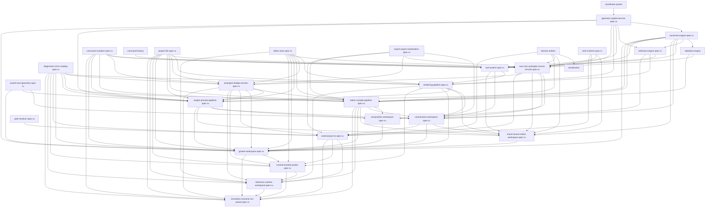

# AxiCAD Documentation Index

> Master map of all documentation modules. Keep this file in sync with actual docs.
>
> See [RULES.md](RULES.md) for documentation conventions.
> See [GLOSSARY.md](GLOSSARY.md) for terminology.

---

## Templates

| File | Purpose |
|------|---------|
| [_template-domain.md](_template-domain.md) | Template for domain entity documents |
| [_template-spec.md](_template-spec.md) | Template for technical spec modules |
| [_template-adr.md](_template-adr.md) | Template for architecture decision records |

---

## Foundational Specs

| Document | Status | Description |
|----------|--------|-------------|
| [domain-model-spec-ru](specs/domain-model-spec-ru.md) | Draft | Доменная модель AxiCAD и соответствие TOML/Rust контракту |
| [toml-schema-spec-ru](specs/toml-schema-spec-ru.md) | Draft | Каноническая TOML-схема Axicor и описание полей |
| [validation-spec-ru](specs/validation-spec-ru.md) | Draft | Спецификация системы валидации и уровней проверок |
| [editor-store-spec-ru](specs/editor-store-spec-ru.md) | Draft | Спецификация реактивного хранилища и модели состояния редактора |
| [project-file-spec-ru](specs/project-file-spec-ru.md) | Draft | Спецификация файла проекта axicad.project.json |
| [command-mutation-spec-ru](specs/command-mutation-spec-ru.md) | Draft | Спецификация командной модели изменения состояния и Undo/Redo |
| [import-export-serialization-spec-ru](specs/import-export-serialization-spec-ru.md) | Draft | Спецификация импорта, экспорта и сериализации |
| [path-resolver-spec-ru](specs/path-resolver-spec-ru.md) | Draft | Спецификация путей, адресации и резолвера ссылок |
| [diagnostics-error-catalog-spec-ru](specs/diagnostics-error-catalog-spec-ru.md) | Draft | Каталог диагностик и спецификация ошибок |
| [workspace-shell-layout-spec-ru](specs/workspace-shell-layout-spec-ru.md) | Draft | Спецификация архитектуры интерфейса и зон раскладки |
| [socket-tract-geometry-spec-ru](specs/socket-tract-geometry-spec-ru.md) | Draft | Спецификация геометрической модели сокетов, пинов и трактов |
| [geometry-spatial-service-spec-ru](specs/geometry-spatial-service-spec-ru.md) | Draft | Спецификация геометрического и пространственного сервиса |
| [constraint-engine-spec-ru](specs/constraint-engine-spec-ru.md) | Draft | Спецификация ядра проверки ограничений (Constraint Engine) |
| [selection-engine-spec-ru](specs/selection-engine-spec-ru.md) | Draft | Спецификация ядра выделения объектов (Selection Engine) |
| [tool-system-spec-ru](specs/tool-system-spec-ru.md) | Draft | Спецификация интерактивных инструментов (Tool System) |
| [rendering-pipeline-spec-ru](specs/rendering-pipeline-spec-ru.md) | Draft | Спецификация визуального слоя рендеринга (Rendering Pipeline) |
| [rust-core-axiengine-source-of-truth-spec-ru](specs/rust-core-axiengine-source-of-truth-spec-ru.md) | Draft | Спецификация канонического вычислительного ядра AxiEngine и контракта источника истины |
| [axiengine-bridge-session-spec-ru](specs/axiengine-bridge-session-spec-ru.md) | Draft | Спецификация моста интеграции и менеджера сессий AxiEngine |
| [external-port-io-spec-ru](specs/external-port-io-spec-ru.md) | Draft | Спецификация внешних портов ввода/вывода и интерфейсов рантайма |
| [runtime-timeline-probe-spec-ru](specs/runtime-timeline-probe-spec-ru.md) | Draft | Спецификация контроллера времени, зондов и метрик симуляции |
| [simulation-scenario-run-preset-spec-ru](specs/simulation-scenario-run-preset-spec-ru.md) | Draft | Спецификация сценариев симуляции и пресетов запусков |
| [engine-preview-pipeline-spec-ru](specs/engine-preview-pipeline-spec-ru.md) | Draft | Спецификация пайплайна генерации, кэширования и принятия предпросмотра |
| [baker-compile-pipeline-spec-ru](specs/baker-compile-pipeline-spec-ru.md) | Draft | Спецификация пайплайна подготовки, запуска Baker/AxiEngine compile и обработки артефактов |

---

## Workspace Mode Specs

| Document | Status | Description |
|----------|--------|-------------|
| [composition-workspace-spec-ru](specs/composition-workspace-spec-ru.md) | Draft | Спецификация предметного режима сборки Composition Workspace |
| [connectome-workspace-spec-ru](specs/connectome-workspace-spec-ru.md) | Draft | Спецификация предметного режима проектирования связей Connectome Workspace |
| [shard-neuron-editor-workspace-spec-ru](specs/shard-neuron-editor-workspace-spec-ru.md) | Draft | Спецификация предметного режима редактора внутренней биологии шарда Shard Neuron Editor |
| [growth-workspace-spec-ru](specs/growth-workspace-spec-ru.md) | Draft | Спецификация предметного режима симуляции и отладки роста сети Growth Workspace |
| [inference-runtime-workspace-spec-ru](specs/inference-runtime-workspace-spec-ru.md) | Draft | Спецификация предметного режима выполнения симуляции и инференса |

---

## Vision (why & what at 10,000 ft)

| Document | Status | Description |
|----------|--------|-------------|
| [product-overview](vision/product-overview.md) | Draft | What AxiCAD is, for whom, and why |
| [architecture](vision/architecture.md) | Draft | High-level layers, data flow, dependency rules |
| [milestones](vision/milestones.md) | Draft | Roadmap: MVP → v2 → v3 |

---

## Domain Model (what — entities & relationships)

```
Workspace
 └── Layer
      └── Department
           └── Shard
                ├── Socket ──── Tract ────── Socket
                └── (somas)
```

| Entity | Status | Description |
|--------|--------|-------------|
| [workspace](domain/workspace.md) | Draft | Top-level project container |
| [layer](domain/layer.md) | Draft | Discrete vertical level |
| [department](domain/department.md) | Draft | Logical grouping of shards within a layer |
| [shard](domain/shard.md) | Draft | Volumetric region containing somas |
| [socket](domain/socket.md) | Draft | Connection point on shard boundary |
| [tract](domain/tract.md) | Draft | Routed connection bundle between sockets |
| [coordinate-system](domain/coordinate-system.md) | Draft | Discrete 3D voxel grid primitives |

---

## Technical Specs (how — modules & algorithms)

### Pure Algorithm Layer (Rust-portable, zero DOM deps)

| Module | Status | Dependencies |
|--------|--------|-------------|
| [geometry-spatial-service-spec-ru](specs/geometry-spatial-service-spec-ru.md) | Draft | Спецификация геометрического и пространственного сервиса (Supersedes geometry-service & spatial-index) |
| [constraint-engine](specs/constraint-engine.md) | Deprecated / Superseded | [constraint-engine-spec-ru](specs/constraint-engine-spec-ru.md) |
| [validation-engine](specs/validation-engine.md) | Draft | [constraint-engine-spec-ru](specs/constraint-engine-spec-ru.md) |
| [serialization](specs/serialization.md) | Draft | domain entities |
| [command-history](specs/command-history.md) | Draft | — |

### Interactive Layer (browser-dependent)

| Module | Status | Dependencies |
|--------|--------|-------------|
| [selection-engine](specs/selection-engine.md) | Deprecated / Superseded | [selection-engine-spec-ru](specs/selection-engine-spec-ru.md) |
| [tool-system-spec-ru](specs/tool-system-spec-ru.md) | Draft | [selection-engine-spec-ru](specs/selection-engine-spec-ru.md), command-history, [command-mutation-spec-ru](specs/command-mutation-spec-ru.md), [geometry-spatial-service-spec-ru](specs/geometry-spatial-service-spec-ru.md), [constraint-engine-spec-ru](specs/constraint-engine-spec-ru.md) |
| [rendering-pipeline-spec-ru](specs/rendering-pipeline-spec-ru.md) | Draft | [geometry-spatial-service-spec-ru](specs/geometry-spatial-service-spec-ru.md), [selection-engine-spec-ru](specs/selection-engine-spec-ru.md), [tool-system-spec-ru](specs/tool-system-spec-ru.md), [diagnostics-error-catalog-spec-ru](specs/diagnostics-error-catalog-spec-ru.md), [project-file-spec-ru](specs/project-file-spec-ru.md), [editor-store-spec-ru](specs/editor-store-spec-ru.md) |

### Research Briefs

| Module | Status | Dependencies |
|--------|--------|-------------|
| [architectural-brief-ru](specs/architectural-brief-ru.md) | Draft | TOML design, Rust Baker contracts |

---

## Dependency Graph



---

## Architecture Decision Records

| ADR | Status | Decision |
|-----|--------|----------|
| [001](decisions/001-modular-docs-over-monolith.md) | Accepted | Modular spec files over monolithic design document |

---

*Last updated: 2026-06-27*
