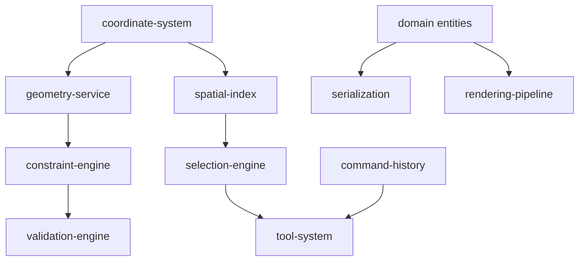

# AxiCAD Documentation Index

> Master map of all documentation modules. Keep this file in sync with actual docs.
>
> See [RULES.md](RULES.md) for documentation conventions.
> See [GLOSSARY.md](GLOSSARY.md) for terminology.

---

## Templates

| File | Purpose |
|------|---------|
| [_template-domain.md](_template-domain.md) | Template for domain entity documents |
| [_template-spec.md](_template-spec.md) | Template for technical spec modules |
| [_template-adr.md](_template-adr.md) | Template for architecture decision records |

---

## Foundational Specs

| Document | Status | Description |
|----------|--------|-------------|
| [domain-model-spec-ru](specs/domain-model-spec-ru.md) | Draft | Доменная модель AxiCAD и соответствие TOML/Rust контракту |
| [toml-schema-spec-ru](specs/toml-schema-spec-ru.md) | Draft | Каноническая TOML-схема Axicor и описание полей |
| [validation-spec-ru](specs/validation-spec-ru.md) | Draft | Спецификация системы валидации и уровней проверок |
| [editor-store-spec-ru](specs/editor-store-spec-ru.md) | Draft | Спецификация реактивного хранилища и модели состояния редактора |
| [project-file-spec-ru](specs/project-file-spec-ru.md) | Draft | Спецификация файла проекта axicad.project.json |
| [command-mutation-spec-ru](specs/command-mutation-spec-ru.md) | Draft | Спецификация командной модели изменения состояния и Undo/Redo |
| [import-export-serialization-spec-ru](specs/import-export-serialization-spec-ru.md) | Draft | Спецификация импорта, экспорта и сериализации |

---

## Vision (why & what at 10,000 ft)

| Document | Status | Description |
|----------|--------|-------------|
| [product-overview](vision/product-overview.md) | Draft | What AxiCAD is, for whom, and why |
| [architecture](vision/architecture.md) | Draft | High-level layers, data flow, dependency rules |
| [milestones](vision/milestones.md) | Draft | Roadmap: MVP → v2 → v3 |

---

## Domain Model (what — entities & relationships)

```
Workspace
 └── Layer
      └── Department
           └── Shard
                ├── Socket ──── Tract ────── Socket
                └── (somas)
```

| Entity | Status | Description |
|--------|--------|-------------|
| [workspace](domain/workspace.md) | Draft | Top-level project container |
| [layer](domain/layer.md) | Draft | Discrete vertical level |
| [department](domain/department.md) | Draft | Logical grouping of shards within a layer |
| [shard](domain/shard.md) | Draft | Volumetric region containing somas |
| [socket](domain/socket.md) | Draft | Connection point on shard boundary |
| [tract](domain/tract.md) | Draft | Routed connection bundle between sockets |
| [coordinate-system](domain/coordinate-system.md) | Draft | Discrete 3D voxel grid primitives |

---

## Technical Specs (how — modules & algorithms)

### Pure Algorithm Layer (Rust-portable, zero DOM deps)

| Module | Status | Dependencies |
|--------|--------|-------------|
| [geometry-service](specs/geometry-service.md) | Draft | coordinate-system |
| [spatial-index](specs/spatial-index.md) | Draft | coordinate-system |
| [constraint-engine](specs/constraint-engine.md) | Draft | geometry-service |
| [validation-engine](specs/validation-engine.md) | Draft | constraint-engine |
| [serialization](specs/serialization.md) | Draft | domain entities |
| [command-history](specs/command-history.md) | Draft | — |

### Interactive Layer (browser-dependent)

| Module | Status | Dependencies |
|--------|--------|-------------|
| [selection-engine](specs/selection-engine.md) | Draft | spatial-index |
| [tool-system](specs/tool-system.md) | Draft | selection-engine, command-history |
| [rendering-pipeline](specs/rendering-pipeline.md) | Draft | domain entities |

### Research Briefs

| Module | Status | Dependencies |
|--------|--------|-------------|
| [architectural-brief-ru](specs/architectural-brief-ru.md) | Draft | TOML design, Rust Baker contracts |

---

## Dependency Graph



---

## Architecture Decision Records

| ADR | Status | Decision |
|-----|--------|----------|
| [001](decisions/001-modular-docs-over-monolith.md) | Accepted | Modular spec files over monolithic design document |

---

*Last updated: 2026-06-27*
