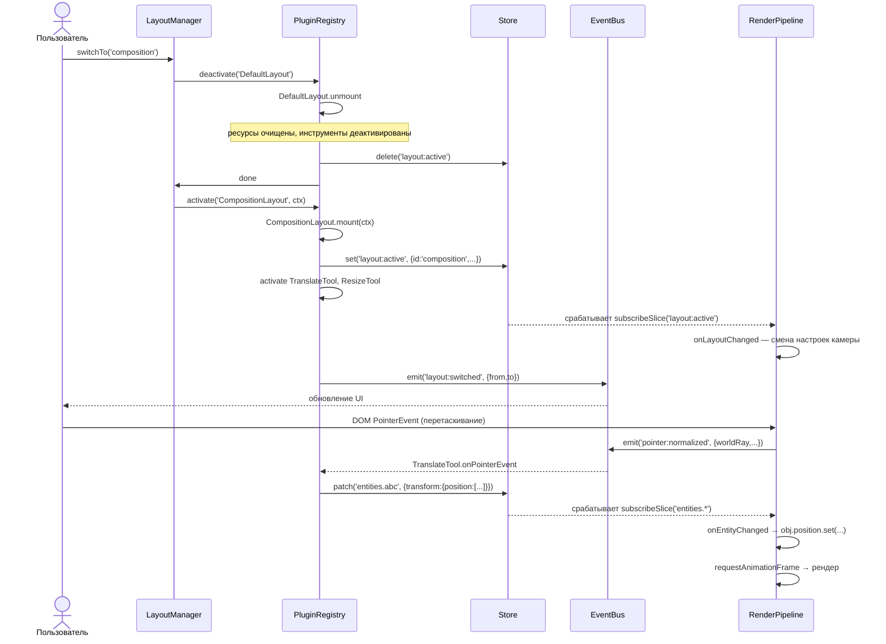

# Микроядерный 3D CAD-редактор на JavaScript/Three.js: Архитектурный бриф

**Версия:** 2.0 | **Стек:** TypeScript strict, Three.js r160+, Vite/ESM | **Дата:** 2026-06-27

---

## Раздел 1 — Обзор системы и принципы изоляции

### Диаграмма слоёв

```
┌─────────────────────────────────────────────────────────────────┐
│ APPLICATION SHELL                                               │
│ (dynamic import — no static imports)                            │
└────────────────────────────┬────────────────────────────────────┘
                             │ registers via IPlugin
┌────────────────────────────▼──────────────────────────────────────┐
│ CORE (Microkernel)                                                │
│ PluginRegistry │ EventBus │ ReactiveStore (Map-based)             │
│ ← knows ONLY IPlugin interface, never concrete classes →          │
└──────┬──────────────────┬────────────────────┬────────────────────┘
       │ ICoreAPI         │ IEventBus          │ IStore (read-only
       │ (injected)       │ (emit/on/off/once) │  for most plugins)
       ▼                  ▼                    ▼
┌──────────────┐   ┌────────────────┐   ┌──────────────────────┐
│Layout Plugins│   │ Tool Plugins   │   │ Data Managers        │
│(ILayoutPlugin│   │ (IToolPlugin)  │   │ SpatialManager       │
│ extends      │   │                │   │ SelectionManager     │
│ IPlugin)     │   │                │   │ (read/write IStore)  │
└──────┬───────┘   └─────────┬──────┘   └──────────────────────┘
       │                     │
       │ EventBus only — NO direct imports between plugins
       │                     │
┌──────▼─────────────────────▼──────────────────────────────────────┐
│ RENDER PIPELINE (passive)                                         │
│ Subscribes to Store slices. NEVER writes to Store.                │
│ Implements ILayoutPlugin — mounts/unmounts like any plugin.       │
└───────────────────────────────────────────────────────────────────┘
```

**Разрешенные связи (arrows):** Core → любой плагин (через `ICoreAPI`/`IEventBus`/`IStore`); любой плагин → EventBus (emit/subscribe); любой плагин → Store (get/subscribe); Data Managers → Store (get/set/patch).

**Запрещенные связи (arrows):** Плагин A → Плагин B (прямой импорт); RenderPipeline → Store (запись); Core → конкретный класс плагина.

### Три железных правила

1. **Никаких прямых импортов плагинов (No Direct Plugin Imports).** Плагин A никогда не делает `import` плагина B. Все межплагинное взаимодействие идет строго через `EventBus.emit/on` or `Store.get/subscribe`.
2. **Ядро ничего не знает о плагинах (Core Has No Plugin Knowledge).** `Core` импортирует только интерфейсы (`IPlugin`, `IStore`, `IEventBus`). Оно никогда не ссылается напрямую на `CompositionLayout`, `TranslateTool` или любой другой конкретный класс.
3. **RenderPipeline никогда не пишет в Store (RenderPipeline Never Writes Store).** Рендерер получает `IReadonlyStore` — обертку на уровне типов, предоставляющую доступ только к методам `get` и `subscribe`. Любая попытка вызвать `set` или `patch` приводит к ошибке компиляции.

### Почему микроядро + DOD, а не ECS или подход в стиле Redux

**ECS** (в реализации A-Frame [1][2] и Meta Horizon OS [3][4]) отлично подходит для пофрагментных систем для каждой сущности (per-entity per-frame systems), но жестко связывает идентичность сущности с глобальным объектом мира (world object) и делает переключение лейаутов (активацию/деактивацию целых наборов функций во время выполнения) неудобным — в ECS отсутствует первоклассное понятие «лейаута» (layout), владеющего пулом инструментов.

**Подход в стиле Redux** (один глобальный редюсер) делает слишком многословными специфичные для лейаутов срезы данных (slices) и подписки на них; каждый новый лейаут вынуждает добавлять ветки редюсеров в общий файл, что нарушает требование «нулевого изменения ядра» (zero core modification).

**Микроядро + DOD (Data-Oriented Design)** отделяет ядро (три фиксированных сервиса) от всей логики функций (плагинов) и хранит в Store только плоские данные в виде простых объектов (plain objects) — без методов и без объектов Three.js. Плагины загружаются через динамический `import` во время выполнения [5], декларируют свои зависимости и активируются/деактивируются независимо. Это та же модель, которая используется в хосте расширений VS Code [5], системе хуков tapable в Webpack [6] и жизненном цикле бандлов OSGi [7][8].

---

## Раздел 2 — Ядро: PluginRegistry, EventBus, Store

### 2.1 PluginRegistry

```typescript
// ── core/interfaces.ts ─────────────────────────────────────────

type PluginState =
  | 'REGISTERED'
  | 'INITIALIZED'
  | 'MOUNTED'
  | 'UNMOUNTED'
  | 'DESTROYED';

interface ICoreAPI {
  readonly registry: IPluginRegistry;
  readonly bus: IEventBus;
  readonly store: IStore; // full access — only given to Data Managers
}

interface IMountContext {
  readonly store: IReadonlyStore; // read-only for Layout/Tool plugins
  readonly bus: IEventBus;
  readonly core: ICoreAPI; // for activating sub-plugins only
}

interface IPlugin {
  readonly id: string;
  readonly version: string;
  readonly dependencies?: string[]; // IDs that must be init'd first
  init(core: ICoreAPI): Promise<void>;
  mount(context: IMountContext): Promise<void>;
  unmount(): Promise<void>;
  destroy(): Promise<void>;
}

interface IPluginRegistry {
  register(plugin: IPlugin): void;
  activate(pluginId: string, context: IMountContext): Promise<void>;
  deactivate(pluginId: string): Promise<void>;
  /** Restricted: Tool/Layout plugins may only retrieve Data Managers */
  getPlugin<T extends IPlugin>(id: string): T | undefined;
  getState(pluginId: string): PluginState;
}
```

**Жизненный цикл хуков — что делает каждый из них:**

- **`init(core)`** — вызывается один раз при вызове `register`. Получает полный `ICoreAPI`. Используется для однократной настройки связей: регистрации внутренних инструментов (sub-tools), подписки на события жизненного цикла, загрузки ассетов. Больше никогда не вызывается. Соответствует семантике `init` в ECS [4].
- **`mount(context)`** — вызывается каждый раз, когда плагин активируется (при смене лейаута, активации инструмента). Подписывается на срезы Store, активирует пул инструментов, записывает контекст лейаута в Store. Может вызываться многократно.
- **`unmount()`** — вызывается при деактивации. **Обязан** очистить массив `disposables`: отписать все срезы Store, отписать все обработчики EventBus, деактивировать пул инструментов. `PluginRegistry` проверяет утверждение `disposables.length === 0` после завершения этого вызова.
- **`destroy()`** — вызывается один раз при выгрузке модуля. Освобождает память, удаляет объекты Three.js через `deepDispose` [9], обнуляет ссылки.

Эта четырехфазная последовательность напрямую сопоставляется с состояниями бандлов OSGi (`INSTALLED → RESOLVED → ACTIVE → STOPPING → UNINSTALLED`) [7][8] и паттерном `activate/deactivate` в VS Code [5].

**Разрешение зависимостей (Dependency resolution):** `PluginRegistry.register` запускает топологическую сортировку на основе поиска в глубину (DFS) по массиву `dependencies[]`. Если плагин B объявляет `dependencies: ['SpatialManager']`, реестр гарантирует, что выполнение `SpatialManager.init` завершится до начала работы `B.init`. Циклические зависимости вызывают исключение на этапе регистрации, а не во время работы.

**Конечный автомат состояний плагина:**

```
register → REGISTERED
init → INITIALIZED
mount → MOUNTED
unmount → UNMOUNTED (может вернуться в состояние MOUNTED)
destroy → DESTROYED (терминальное состояние)
```

**Регистрация нового лейаута — 5 строк:**

```typescript
// app/main.ts — the ONLY place that touches dynamic import
const { default: compositionLayout } = await import('./plugins/composition');
core.registry.register(compositionLayout);
// No other file changes.
```

### 2.2 EventBus

```typescript
// ── core/event-bus.ts ──────────────────────────────────────────

type Unsubscribe = () => void;

interface IEventBus {
  emit<K extends keyof CADEventMap>(event: K, payload: CADEventMap[K]): void;
  on<K extends keyof CADEventMap>(
    event: K,
    handler: (payload: CADEventMap[K]) => void
  ): Unsubscribe;
  off<K extends keyof CADEventMap>(
    event: K,
    handler: (payload: CADEventMap[K]) => void
  ): void;
  once<K extends keyof CADEventMap>(
    event: K,
    handler: (payload: CADEventMap[K]) => void
  ): Unsubscribe;
}

// Central typed event map — all events declared here, nowhere else
interface CADEventMap {
  // Layout
  'layout:switched': { from: string; to: string };
  'layout:composition:activated': void;
  'layout:neuronlab:activated': void;

  // Tools
  'tool:translate:commit': { entityId: string; delta: Vec3 };
  'tool:resize:commit': { entityId: string; scale: Vec3 };
  'tool:active:changed': { toolId: string | null };

  // Pointer (emitted by RaycastBridge only)
  'pointer:normalized': NormalizedPointerEvent;

  // Store changes (emitted by Store internally)
  'store:entity:created': { entityId: string };
  'store:entity:updated': { entityId: string; keys: string[] };
  'store:entity:deleted': { entityId: string };
  'store:selection:changed': { added: string[]; removed: string[] };
}
```

**Соглашение о пространствах имен:** `{domain}:{entity}:{action}`. EventBus проверяет этот формат при вызове `emit` в сборках для разработки — строка события, не соответствующая регулярному выражению `\w+:\w+(:\w+)?`, немедленно выбрасывает ошибку. Это предотвращает тихие сбои из-за опечаток в именах событий между плагинами.

**EventBus не хранит состояние.** Это чистый маршрутизатор: `Map<string, Set<Handler>>`. Никакого повторного воспроизведения (replay) или событийного снабжения (event sourcing). Если плагину требуется история, он использует Store, а не EventBus.

**Шаблон очистки подписок** — обязателен в каждом `mount`:

```typescript
class CompositionLayout implements ILayoutPlugin {
  private disposables: Array<() => void> = [];

  async mount(ctx: IMountContext): Promise<void> {
    const unsub1 = ctx.bus.on('pointer:normalized', this.onPointer);
    const unsub2 = ctx.store.subscribe('layout:active', this.onLayoutChange);
    this.disposables.push(unsub1, unsub2);
  }

  async unmount(): Promise<void> {
    this.disposables.forEach(d => d());
    this.disposables = []; // PluginRegistry checks this is empty
  }
}
```

Легковесная реализация может использовать библиотеку `mitt` [10] в качестве основы для EventBus — её 200-байтовое API (`emit`, `on`, `off`) напрямую мапится на `IEventBus` с наложением дженерика `CADEventMap`.

### 2.3 Плоское реактивное хранилище (Flat Reactive Store)

```typescript
// ── core/store.ts ──────────────────────────────────────────────

type StoreKey = string; // e.g. 'entities.uuid-123', 'selection'
type Unsubscribe = () => void;
type ChangeCallback<T> = (value: T | undefined) => void;

interface IStore {
  get<T>(key: StoreKey): T | undefined;
  set<T>(key: StoreKey, value: T): void;
  patch<T>(key: StoreKey, delta: Partial<T>): void;
  delete(key: StoreKey): void;
  subscribe<T>(key: StoreKey, cb: ChangeCallback<T>): Unsubscribe;
  subscribeSlice<T>(pattern: string, cb: (key: string, value: T | null) => void): Unsubscribe;
}

// Read-only wrapper — given to Layout/Tool plugins and RenderPipeline
interface IReadonlyStore {
  get<T>(key: StoreKey): T | undefined;
  subscribe<T>(key: StoreKey, cb: ChangeCallback<T>): Unsubscribe;
  subscribeSlice<T>(pattern: string, cb: (key: string, value: T | null) => void): Unsubscribe;
}
```

**EntityRecord — каноническая форма данных CAD:**

```typescript
interface EntityRecord {
  id: string;
  type: 'mesh' | 'group' | 'light' | 'camera';
  transform: {
    position: [number, number, number];
    rotation: [number, number, number, number]; // quaternion xyzw
    scale: [number, number, number];
  };
  geometry: GeometryDescriptor; // descriptor only — NOT BufferGeometry
  material: MaterialDescriptor; // descriptor only — NOT Material
  meta: Record<string, unknown>;
}

// Descriptors carry only serializable data
interface GeometryDescriptor {
  type: 'box' | 'sphere' | 'cylinder' | 'custom';
  parameters: Record<string, number>;
  // For 'custom': raw Float32Array positions stored as base64 or SharedArrayBuffer id
}

interface MaterialDescriptor {
  type: 'standard' | 'phong' | 'wireframe';
  color: number; // hex
  opacity: number;
}
```

**Почему плоская структура (Map) вместо вложенного дерева:** Поиск за O(1) по `EntityId` без обхода дерева; простая JSON-сериализация для снимков состояния undo/redo; отсутствие проблем с глубоким сравнением (deep-equality) при частичном обновлении трансформации одной сущности. `ViewerState` в three-cad-viewer использует тот же паттерн наблюдаемого плоского хранилища (observable flat-store) как единственный источник правды [9].

**Проверка Store во время выполнения (runtime guard)** — вызывается внутри `set` в сборках для разработки:

```typescript
function assertPureData(value: unknown): void {
  if (value instanceof THREE.Object3D) throw new Error('Store: THREE objects forbidden');
  if (value instanceof HTMLElement) throw new Error('Store: DOM nodes forbidden');
  if (typeof value === 'function') throw new Error('Store: functions forbidden');
}
```

**Подписки на срезы (Slice subscriptions)** используют сопоставление шаблонов в стиле glob: подписка на `'entities.*'` срабатывает для любого ключа, начинающегося с `entities.`. RenderPipeline подписывается на три среза:

```typescript
store.subscribeSlice('entities.*', this.onEntityChanged);
store.subscribeSlice('selection', this.onSelectionChanged);
store.subscribeSlice('layout:active', this.onLayoutChanged);
```

---

## Раздел 3 — Плагины лейаутов (Layout Plugins)

### Интерфейс

```typescript
interface ILayoutPlugin extends IPlugin {
  readonly toolPool: string[]; // tool IDs activated with this layout
  readonly requiredManagers: string[]; // Data Manager IDs that must be INITIALIZED
  declareContext(store: IStore): ILayoutContext;
}

interface ILayoutContext {
  layoutId: string;
  activeTools: string[];
  viewport: { fov: number; near: number; far: number };
  meta: Record<string, unknown>;
}
```

Метод `declareContext` вызывается реестром `PluginRegistry` перед вызовом `mount`. Он проверяет, что все менеджеры из списка `requiredManagers` находятся в состоянии `INITIALIZED` и их ключи в Store существуют. Если какой-либо ключ отсутствует, активация прерывается с ошибкой `ContextError`, предотвращая тихие сбои в рантайме.

### Последовательность переключения лейаутов (пошагово)

1. Пользователь нажимает "Composition Mode" → UI вызывает `layoutManager.switchTo('composition')`.
2. `LayoutManager` (сам являющийся плагином) вызывает `registry.deactivate(currentLayoutId)`.
3. Выполняется метод `CurrentLayout.unmount()`:
   - Очищает массив `disposables[]` — отписывает все срезы Store и все обработчики EventBus.
   - Вызывает `registry.deactivate(toolId)` для каждого инструмента из своего пула `toolPool` (отслеживается в `layoutToolMap: Map<string, Set<string>>`).
   - Удаляет ключ из Store: `store.delete('layout:active')`.
4. `PluginRegistry` переводит `CurrentLayout` в состояние `UNMOUNTED`.
5. `LayoutManager` вызывает `registry.activate('CompositionLayout', mountContext)`.
6. Выполняется метод `CompositionLayout.mount(ctx)`:
   - Вызывает `declareContext(store)` — проверяет наличие необходимых ключей.
   - Записывает контекст: `store.set('layout:active', { id: 'composition', activeTools: this.toolPool, ... })`.
   - Подписывается на срезы Store, сохраняя токены отписки `Unsubscribe` в массив `disposables[]`.
   - Вызывает `registry.activate(toolId, ctx)` для каждого инструмента из `toolPool`.
7. `PluginRegistry` переводит `CompositionLayout` в состояние `MOUNTED`.
8. Вызывает `bus.emit('layout:switched', { from: 'default', to: 'composition' })` → UI перерендеривается.

**Что предоставляет и что скрывает IMountContext:**

| Предоставляется | Скрывается |
|---|---|
| `IReadonlyStore` (только get/subscribe) | Любые ссылки на `THREE.Scene` |
| `IEventBus` (emit/on/off/once) | Прямые ссылки на другие плагины |
| `ICoreAPI.registry` (для активации подплагинов) | Прямой доступ на запись в `IStore` |

Типизация `IReadonlyStore` делает попытку вызвать `store.set` со стороны лейаута ошибкой компиляции — полный доступ к `IStore` на запись получают только Data Managers.

### Два изолированных файла лейаутов

`CompositionLayout` and `NeuronLabLayout` находятся в абсолютно разных директориях и не имеют общих импортов между собой. Каждый импортирует сущности только из `@cad/core/interfaces`. Ни один из них не подозревает о существовании другого.

```typescript
// plugins/composition/index.ts
export { default } from './CompositionLayout';

// plugins/neuron-lab/index.ts
export { default } from './NeuronLabLayout';
```

---

## Раздел 4 — Плагины инструментов (Tool Plugins)

### Интерфейс

```typescript
type PointerEventType = 'pointerdown' | 'pointermove' | 'pointerup';

interface NormalizedPointerEvent {
  type: PointerEventType;
  screenPos: [number, number];
  worldRay: { origin: [number, number, number]; direction: [number, number, number] };
  modifiers: { shift: boolean; ctrl: boolean; alt: boolean };
}

interface IToolPlugin extends IPlugin {
  readonly inputEvents: PointerEventType[];
  onPointerEvent(event: NormalizedPointerEvent, store: IReadonlyStore): void;
}
```

Инструмент принимает нормализованное событие `NormalizedPointerEvent` — его луч `worldRay` уже вычислен компонентом `RaycastBridge` (внутри рендерера). Инструмент никак не взаимодействует с Three.js напрямую. Он читает данные сущностей из `store`, рассчитывает смещение (delta) с использованием чистой арифметики и записывает результат обратно через менеджер данных (Data Manager) или напрямую с помощью `store.patch`, если он удерживает ссылку на `IStore`, полученную на этапе `init`.

### TranslateTool — Полный пример

```typescript
// plugins/tools/TranslateTool.ts
import type { IToolPlugin, IMountContext, ICoreAPI,
  NormalizedPointerEvent, IReadonlyStore } from '@cad/core/interfaces';

export class TranslateTool implements IToolPlugin {
  readonly id = 'TranslateTool';
  readonly version = '1.0.0';
  readonly dependencies = ['SpatialManager', 'SelectionManager'];
  readonly inputEvents: PointerEventType[] = ['pointerdown', 'pointermove', 'pointerup'];

  private core!: ICoreAPI;
  private disposables: Array<() => void> = [];
  // Gesture state lives in Store, not in fields — rule §5 (Tools Are Stateless)
  // Exception: ephemeral drag anchor is written to store key 'tool:translate:dragAnchor'

  async init(core: ICoreAPI): Promise<void> {
    this.core = core;
  }

  async mount(ctx: IMountContext): Promise<void> {
    const unsub = ctx.bus.on('pointer:normalized', (evt) => {
      if (this.inputEvents.includes(evt.type)) this.onPointerEvent(evt, ctx.store);
    });
    this.disposables.push(unsub);
  }

  onPointerEvent(evt: NormalizedPointerEvent, store: IReadonlyStore): void {
    const selection = store.get<string[]>('selection') ?? [];
    if (selection.length === 0) return;

    if (evt.type === 'pointerdown') {
      // Store drag anchor — no field mutation
      this.core.store.set('tool:translate:dragAnchor', evt.worldRay.origin);
      return;
    }

    if (evt.type === 'pointermove') {
      const anchor = store.get<[number,number,number]>('tool:translate:dragAnchor');
      if (!anchor) return;
      const delta: [number,number,number] = [
        evt.worldRay.origin[0] - anchor[0],
        evt.worldRay.origin[2] - anchor[2],
        evt.worldRay.origin[1] - anchor[1],
      ];
      for (const id of selection) {
        const entity = store.get<EntityRecord>(`entities.${id}`);
        if (!entity) continue;
        const p = entity.transform.position;
        this.core.store.patch(`entities.${id}`, {
          transform: {
            ...entity.transform,
            position: [p[0]+delta[0], p[1]+delta[1], p[2]+delta[2]],
          },
        });
      }
      this.core.store.set('tool:translate:dragAnchor', evt.worldRay.origin);
    }

    if (evt.type === 'pointerup') {
      this.core.store.delete('tool:translate:dragAnchor');
      this.core.bus.emit('tool:translate:commit', {
        entityId: selection[0], delta: [0,0,0], // final delta from history
      });
    }
  }

  async unmount(): Promise<void> {
    this.disposables.forEach(d => d());
    this.disposables = [];
  }

  async destroy(): Promise<void> { /* no Three.js objects to dispose */ }
}
```

### ResizeTool — Минимальные отличия

Инструмент `ResizeTool` идентичен по структуре. В методе `onPointerEvent` он обновляет `transform.scale` вместо `transform.position` и отправляет событие `'tool:resize:commit'` по событию `pointerup`. Других отличий нет.

### Активация инструментов и приоритет

Инструменты никогда не активируются сами. Лейаут вызывает `registry.activate(toolId, ctx)` для каждого идентификатора в своем пуле `toolPool`. Плагин `ToolManager` (менеджер данных) поддерживает стек приоритетов: если два инструмента декларируют `'pointermove'` в массиве `inputEvents`, инструмент, активированный позже, получает более высокий приоритет. Обработчик инструмента с более низким приоритетом не вызывается, пока активен инструмент с высоким приоритетом. `ToolManager` обеспечивает это путем перехвата события `'pointer:normalized'` и его перенаправления исключительно на инструмент на вершине стека.

---

## Раздел 5 — Менеджеры данных: SpatialManager и SelectionManager

Менеджеры данных реализуют интерфейс `IPlugin`, но имеют усеченный жизненный цикл: только методы `init` и `destroy`. У них нет методов `mount`/`unmount` — они инициализируются один раз при запуске приложения и остаются активными на протяжении всего времени его работы. Они получают полный `IStore` (на запись и чтение) во время вызова `init`.

### 5.1 SpatialManager

```typescript
type Vec3 = [number, number, number];
type Mat4 = [number, number, number, number,
              number, number, number, number,
              number, number, number, number,
              number, number, number, number]; // column-major

interface AABB {
  min: Vec3;
  max: Vec3;
}

interface Ray {
  origin: Vec3;
  direction: Vec3; // normalized
}

interface RaycastHit {
  entityId: string;
  distance: number;
  point: Vec3;
}

interface ISpatialManager {
  computeAABB(entityId: string, store: IStore): AABB;
  raycast(ray: Ray, entityIds: string[], store: IStore): RaycastHit[];
  worldToLocal(point: Vec3, entityId: string, store: IStore): Vec3;
  localToWorld(point: Vec3, entityId: string, store: IStore): Vec3;
  composeMatrix(transform: EntityRecord['transform']): Mat4;
}
```

**Ноль импортов Three.js.** Все математические операции выполняются над массивами `number[]` и `Float32Array`. Пересечение AABB — это простой набор из шести скалярных сравнений, сторонние библиотеки не требуются [MDN 3D collision detection]:

```typescript
function aabbIntersects(a: AABB, b: AABB): boolean {
  return (
    a.min[0] <= b.max[0] && a.max[0] >= b.min[0] &&
    a.min[2] <= b.max[2] && a.max[2] >= b.min[2] &&
    a.min[1] <= b.max[1] && a.max[1] >= b.min[1]
  );
}
```

**Пересечение луча и AABB (Ray–AABB intersection)** использует метод плит (slab method): для каждой оси вычисляется `tMin = (aabb.min[i] - ray.origin[i]) / ray.direction[i]` and `tMax = (aabb.max[i] - ray.origin[i]) / ray.direction[i]`, после чего находится область пересечения всех трех интервалов. Если `max(tMin) <= min(tMax)` и `min(tMax) >= 0`, то луч пересекает коробку.

**Композиция матриц (Matrix composition)** для преобразований `worldToLocal`/`localToWorld` использует 16-элементный одномерный массив `Float32Array` в формате column-major. Все четыре операции (перенос, вращение через кватернион, масштабирование, инверсия) реализованы с явной индексацией арифметики без использования `THREE.Matrix4` [11]. Это делает `SpatialManager` полностью тестируемым в чистой среде Node.js без обращения к глобальным переменным браузера.

`SpatialManager` считывает `transform` из Store, вычисляет мировую матрицу и возвращает результат. Он никогда не пишет в Store.

### 5.2 SelectionManager

```typescript
interface ISelectionManager {
  select(entityId: string, mode: 'replace' | 'add' | 'toggle'): void;
  deselect(entityId: string): void;
  clearSelection(): void;
  getSelection(): ReadonlySet<string>;
  isSelected(entityId: string): boolean;
}
```

**Внутреннее хранилище:** `private _set = new Set<string>`. Коллекция `Set` обеспечивает время работы O(1) для методов `has`, `add`, `delete` — использование обычного `Array` требовало бы O(n) вызовов `includes` на каждую проверку наведения или рейкаста.

**Путь записи (Write path)** — каждая модификация производит два действия атомарно:

```typescript
private _commit(added: string[], removed: string[]): void {
  this._store.set('selection', Array.from(this._set)); // Store update
  this._bus.emit('store:selection:changed', { added, removed }); // notify
}
```

`SelectionManager` ничего не знает о материалах, подсветке контуров или визуальном выделении. Компонент `RenderPipeline` подписывается на `'selection'` в Store и накладывает подсвечивающие материалы независимо. Это означает, что логика выбора полностью тестируема без запуска рендерера.

---

## Раздел 6 — Пассивный конвейер рендеринга (Passive Render Pipeline)

Конвейер `RenderPipeline` реализует интерфейс `ILayoutPlugin`. Он монтируется и демонтируется точно так же, как любой другой плагин, что позволяет нескольким экземплярам рендерера (3D-вьюпорт, 2D-схема, превью-миниатюра) сосуществовать в приложении или сменять друг друга.

**Правило пассивности (Passivity rule):** рендерер принимает `IReadonlyStore`. Архитектурно для него невозможно вызвать `store.set`. Это тот же подход, что и в классе `Display` библиотеки three-cad-viewer, который подписывается через `state.subscribe` и никогда не пишет данные напрямую в `ViewerState` [9].

### Три подписки на Store

```typescript
async mount(ctx: IMountContext): Promise<void> {
  this.disposables.push(
    ctx.store.subscribeSlice('entities.*', this.onEntityChanged.bind(this)),
    ctx.store.subscribe('selection', this.onSelectionChanged.bind(this)),
    ctx.store.subscribe('layout:active', this.onLayoutChanged.bind(this)),
  );
  this._startRenderLoop();
}
```

### Синхронизация сущностей (Entity Sync)

```typescript
private onEntityChanged(entityId: string, record: EntityRecord | null): void {
  if (!record) {
    this._removeFromScene(entityId);
    return;
  }
  let obj = this.meshCache.get(entityId);
  if (!obj) {
    obj = this._createMesh(record); // geometry built from GeometryDescriptor
    this.meshCache.set(entityId, obj);
    this.scene.add(obj);
  } else if (this._geometryChanged(obj, record)) {
    // Descriptor changed — rebuild geometry, keep transform
    obj.geometry.dispose();
    obj.geometry = this._buildGeometry(record.geometry);
  }
  this._syncTransform(obj, record.transform); // pure copy, no calculation
}

private _syncTransform(obj: THREE.Object3D, t: EntityRecord['transform']): void {
  obj.position.set(...t.position);
  obj.quaternion.set(...t.rotation);
  obj.scale.set(...t.scale);
  // Three.js r160+ requires manual matrix update when matrixAutoUpdate=false
  obj.updateMatrix(); // [12]
}
```

**MeshCache:** `Map<EntityId, THREE.Object3D>`. Рендерер перестраивает геометрию только при изменении полей в `GeometryDescriptor` — обновления, затрагивающие исключительно трансформацию (позицию/масштаб/поворот), полностью пропускают шаг `_buildGeometry`, благодаря чему перемещение сущности обходится в один простой вызов `position.set`.

### RaycastBridge — Единственный обратный поток

`RaycastBridge` — единственное место, где рендерер генерирует данные, потребляемые другими плагинами. Он слушает событие `PointerEvent` браузера, использует `THREE.Raycaster` для расчета `worldRay` и отправляет событие `'pointer:normalized'` в EventBus:

```typescript
private _onDomPointerEvent(e: PointerEvent): void {
  const ndc = this._toNDC(e);
  this.raycaster.setFromCamera(ndc, this.camera);
  const { origin, direction } = this.raycaster.ray;
  this.bus.emit('pointer:normalized', {
    type: e.type as PointerEventType,
    screenPos: [e.clientX, e.clientY],
    worldRay: {
      origin: [origin.x, origin.y, origin.z],
      direction: [direction.x, direction.y, direction.z],
    },
    modifiers: { shift: e.shiftKey, ctrl: e.ctrlKey, alt: e.altKey },
  });
}
```

После выполнения `emit` работа рендерера завершена. Он не ожидает никакого ответа. Плагины инструментов перехватывают `'pointer:normalized'` из EventBus самостоятельно.

### Очистка ресурсов (Disposal)

При вызове `unmount` рендерер обходит дерево сцены с помощью `Object3D.traverse` [13] и высвобождает память всех геометрий и материалов:

```typescript
async unmount(): Promise<void> {
  this.disposables.forEach(d => d());
  this.disposables = [];
  this.scene.traverse((obj) => {
    if (obj instanceof THREE.Mesh) {
      obj.geometry.dispose();
      (Array.isArray(obj.material) ? obj.material : [obj.material])
        .forEach(m => m.dispose());
    }
  });
  this.meshCache.clear();
  // renderer.dispose only if this is the last renderer instance [14]
}
```

Этот паттерн глубокой очистки ресурсов (`deepDispose`) предотвращает утечки памяти GPU при переключении между различными плагинами рендереров [9][14][13].

---

## Раздел 7 — Диаграммы потоков данных

### Последовательность: переключение лейаута + использование TranslateTool



### Однонаправленный поток данных

```mermaid
flowchart LR
  A[DOM PointerEvent] --> B["RaycastBridge\nвычисляет worldRay"]
  B --> C["EventBus\npointer:normalized"]
  C --> D[TranslateTool\nonPointerEvent]
  D --> E["store.patch\nentity.transform.position"]
  E --> F["Store уведомляет\nподписчиков"]
  F --> G[RenderPipeline\nonEntityChanged]
  G --> H["THREE.Object3D\n.position.set"]
  H --> I["requestAnimationFrame\nrenderer.render"]

  style B fill:#f9f,stroke:#333
  style G fill:#bbf,stroke:#333
```



Ни одна стрелка не возвращается из `RenderPipeline` в `Store`, `EventBus` или какой-либо инструмент. Единственный обратный путь — это `RaycastBridge → EventBus`, который является первым шагом следующего жеста пользователя, а не петлей обратной связи (feedback loop).

---

## Раздел 8 — Правила изоляции: Конституция Архитектуры

**Правило 1 — Никаких прямых импортов плагинов (No Direct Plugin Imports).**
Плагин A никогда не импортирует сущности напрямую из путей плагина B. Любое межплагинное взаимодействие использует исключительно `EventBus.emit/on` или `Store.get/subscribe`.
*Проверка (Verification):* ESLint-правило `no-restricted-imports` с шаблоном `plugins/**` во всех директориях исходного кода плагинов; проверка `dependency-cruiser` на запрет связей `src/plugins → src/plugins`.

**Правило 2 — Ядро ничего не знает о плагинах (Core Has No Plugin Knowledge).**
Код в `src/core/` импортирует сущности только из `src/core/interfaces.ts`. Оно никогда не обращается к конкретным классам плагинов.
*Проверка:* Алиасы путей в `tsconfig paths` + правило `dependency-cruiser`: обнаружение связи `core → plugins` приводит к ошибке. Шаг CI падает при нарушении.

**Правило 3 — Store содержит только чистые данные (Store Is Pure Data).**
Метод `store.set` отклоняет любые значения, являющиеся экземплярами `THREE.Object3D`, `HTMLElement` или `Function`.
*Проверка:* Проверка времени выполнения `assertPureData` внутри метода `set` в сборках для разработки; ограничения типов TypeScript на уровне `EntityRecord` исключают появление методов на этапе компиляции.

**Правило 4 — Рендерер никогда не пишет в Store (Renderer Never Writes Store).**
Компонент `RenderPipeline` принимает исключительно `IReadonlyStore` — интерфейс TypeScript без методов `set`, `patch` или `delete`. Попытка записи в Store вызывает ошибку компиляции.
*Проверка:* Тип `IReadonlyStore` принудительно задается в контексте `IMountContext`; строгие проверки null в TypeScript отлавливают любые попытки приведения типов.

**Правило 5 — Инструменты не хранят состояние между жестами (Tools Are Stateless Between Gestures).**
Инструмент не должен сохранять изменяемое состояние перетаскивания в полях класса между событием `pointerup` и последующим `pointerdown`. Временное состояние жеста хранится в Store под ключом `tool:{toolId}:*` и удаляется в обработчике `pointerup`.
*Проверка:* Чек-лист код-ревью; опциональное ESLint-правило, помечающее изменяемые не-`readonly` поля в классах, реализующих `IToolPlugin`.

**Правило 6 — Менеджеры не имеют UI (Managers Have No UI).**
Код в `src/managers/` не содержит импорта глобальных объектов `document`, `window`, интерфейса `HTMLElement` или любых других API DOM.
*Проверка:* ESLint-правило `no-restricted-globals` со списком `document`, `window`, `navigator`; секция `lib` в конфигурации `tsconfig` для менеджеров исключает `"dom"`.

**Правило 7 — Лейаут владеет своим пулом инструментов (Layout Owns Its Tool Pool).**
Инструмент не может вызвать метод `registry.activate(toolId)` на самом себе. Менеджер `ToolManager` выбрасывает исключение `ActivationError`, если `activate(toolId)` вызывается без активного лейаута, декларирующего `toolId` в массиве `toolPool`.
*Проверка:* Метод `ToolManager.activate` сверяет данные с `layoutToolMap` перед выполнением; модульный тест проверяет выброс ошибки.

**Правило 8 — События имеют пространства имен (Events Are Namespaced).**
Все названия событий соответствуют формату `{domain}:{entity}:{action}` (например, `tool:translate:commit`, `store:entity:updated`). EventBus валидирует формат регулярным выражением `/^\w+:\w+(:\w+)?$/` при вызове `emit` в сборках для разработки.
*Проверка:* EventBus выбрасывает ошибку `InvalidEventNameError` при некорректном имени события; все имена декларируются в `CADEventMap` — опечатки отлавливаются на этапе компиляции статической проверкой ключей в TypeScript.

**Правило 9 — Очистка ресурсов жизненного цикла обязательна (Lifecycle Cleanup Is Mandatory).**
Метод `PluginRegistry.deactivate` проверяет условие `plugin.disposables.length === 0` после возврата управления из метода `unmount()`. Если массив не пуст, реестр логирует предупреждение `MemoryLeakWarning` и принудительно очищает подписки.
*Проверка:* Проверка пост-условий в `PluginRegistry`; интеграционный тест многократно монтирует/демонтирует плагин 100 раз и проверяет отсутствие роста числа слушателей EventBus.

**Правило 10 — Только динамический импорт (Dynamic Import Only).**
Плагины загружаются исключительно динамически через `import()`. Статический `import` любых путей внутри `src/plugins/` внутри модулей `src/core/` или `src/app/` строго запрещен.
*Проверка:* ESLint-правило `no-restricted-imports` в `core/` и `app/`; проверка анализатора сборки Vite на предмет отсутствия кода плагинов в чанке ядра; шаг CI с запуском `madge --circular src/core`.

---

## Раздел 9 — Полное руководство: Добавление NeuronLabLayout

Ниже представлена полная реализация новой функциональности. **Ни один существующий файл не изменяется.**

```typescript
// ── plugins/neuron-lab/NeuronLabLayout.ts ──────────────────────

import type {
  ILayoutPlugin, IPlugin, ICoreAPI,
  IMountContext, ILayoutContext, IStore,
} from '@cad/core/interfaces';

// These tool imports are the ONLY cross-plugin reference allowed:
// NeuronLabLayout owns these tools — they are declared in its toolPool
// and are co-located in the same plugin directory.
import { NeuronConnectTool } from './NeuronConnectTool';
import { NeuronResizeTool } from './NeuronResizeTool';

export class NeuronLabLayout implements ILayoutPlugin {
  readonly id = 'NeuronLabLayout';
  readonly version = '1.0.0';
  readonly dependencies = ['SpatialManager', 'SelectionManager'];
  readonly toolPool = ['NeuronConnectTool', 'NeuronResizeTool'];
  readonly requiredManagers = ['SpatialManager', 'SelectionManager'];

  private core!: ICoreAPI;
  private disposables: Array<() => void> = [];

  // ── Lifecycle ──────────────────────────────────────────────────

  async init(core: ICoreAPI): Promise<void> {
    this.core = core;
    // Register co-located tools — they are unknown to core until now
    core.registry.register(new NeuronConnectTool());
    core.registry.register(new NeuronResizeTool());
  }

  declareContext(store: IStore): ILayoutContext {
    // Validate that neuron data exists before mounting
    if (!store.get('neuron:nodes')) {
      store.set('neuron:nodes', new Map()); // initialize empty if absent
    }
    return {
      layoutId: this.id,
      activeTools: this.toolPool,
      viewport: { fov: 60, near: 0.1, far: 10000 },
      meta: { mode: 'neuron-lab' },
    };
  }

  async mount(ctx: IMountContext): Promise<void> {
    // 1. Write layout context to Store
    const layoutCtx = this.declareContext(this.core.store);
    this.core.store.set('layout:active', layoutCtx);

    // 2. Subscribe to neuron-specific data slice
    const unsubNodes = ctx.store.subscribeSlice(
      'neuron:nodes.*',
      this._onNeuronNodeChanged.bind(this),
    );
    this.disposables.push(unsubNodes);

    // 3. Subscribe to selection changes
    const unsubSel = ctx.store.subscribe(
      'selection',
      this._onSelectionChanged.bind(this),
    );
    this.disposables.push(unsubSel);

    // 4. Activate tools from toolPool
    for (const toolId of this.toolPool) {
      await this.core.registry.activate(toolId, ctx);
    }

    // 5. Announce
    ctx.bus.emit('layout:neuronlab:activated', undefined);
  }

  async unmount(): Promise<void> {
    // 1. Drain all subscriptions
    this.disposables.forEach(d => d());
    this.disposables = [];

    // 2. Deactivate tools (PluginRegistry tracks which tools belong to this layout)
    for (const toolId of this.toolPool) {
      await this.core.registry.deactivate(toolId);
    }

    // 3. Remove layout context from Store
    this.core.store.delete('layout:active');
  }

  async destroy(): Promise<void> {
    // Tools are destroyed by PluginRegistry when their parent layout is destroyed
    // No Three.js objects owned by layout — renderer handles its own disposal
  }

  // ── Private handlers ───────────────────────────────────────────

  private _onNeuronNodeChanged(key: string, value: unknown | null): void {
    // Layout-specific reaction: e.g., recompute synapse weights
    // Writes results back to Store via this.core.store (Data Manager pattern)
    if (!value) return;
    // ... pure data computation, no Three.js ...
  }

  private _onSelectionChanged(selection: string[] | undefined): void {
    // Highlight selected neuron IDs — write to a display-hint key in Store
    this.core.store.set('neuron:selectedIds', selection ?? []);
  }
}
```

```typescript
// ── plugins/neuron-lab/index.ts ────────────────────────────────
import { NeuronLabLayout } from './NeuronLabLayout';
export default new NeuronLabLayout();
```

```typescript
// ── app/main.ts — the ONLY change needed in the entire codebase ─
const { default: neuronLab } = await import('./plugins/neuron-lab');
core.registry.register(neuronLab);
// Done. No other file touched.
```

**Что не было изменено (What was not changed):** файлы в `core/`, `plugins/composition/`, `plugins/tools/`, `managers/`, `render-pipeline/` — ровно ноль изменений в коде.

---

## Раздел 10 — Направления дальнейших исследований

### 1. Undo/Redo поверх плоского хранилища (Flat Store)

Плоская структура `Map` в Store делает реализацию Undo/Redo на основе снимков состояния тривиальной: сериализовать всю `Map` в JSON-объект перед выполнением каждой команды, поместить в стек истории, восстановить при отмене (undo). Проблема заключается в расходовании памяти: в CAD-сценах с тысячами сущностей история на полных снимках состояния становится слишком дорогой.

Альтернативой является **структурное разделение данных через immer-диффы (structural sharing via immer-style patches)** [15]: вместо сохранения полной копии `Map` каждая команда записывает только те ключи, которых она коснулась, и их старые/новые значения. API `produce` библиотеки `Immer` генерирует такие структурные диффы автоматически. При отмене команды применяется обратный патч (inverse patch). Это позволяет расходовать память пропорционально числу измененных ключей в команде, а не общему размеру сцены.

Ключевое ограничение: патчи должны содержать только чистые структуры данных, разрешенные в Store. Патч, который сохраняет изменения `THREE.BufferGeometry`, нарушает Правило 3. Изменения геометрии должны описываться строго в виде диффов описателей геометрии `GeometryDescriptor`.

### 2. SpatialManager на базе Web Worker

В сценах, содержащих более 10 тысяч сущностей, расчет пересечений `SpatialManager.raycast` в основном потоке блокирует цикл рендеринга. Решением является перенос пространственных запросов в Web Worker с использованием `SharedArrayBuffer`.

Библиотека `@webecs/do-three` [доклад FOSDEM 2024 DOD, 26] демонстрирует паттерн «Структура массивов» (Structure of Arrays, SoA): вместо хранения `Map<EntityId, {x, y, z}>` координаты хранятся в трех независимых массивах `Float32Array` (`xs[i]`, `ys[i]`, `zs[i]`) с мапингом вида `EntityId → index`. SoA-структуры дружественны к кэшу процессора для итераций в стиле SIMD по всем позициям в процессе рейкаста. Массивы могут быть обернуты в `SharedArrayBuffer`, что позволяет Воркеру читать их без расходов на сериализацию. Основной поток записывает изменения трансформаций, Воркер читает их для выполнения пространственных запросов, а бесконфликтная схема двойной буферизации (lock-free double-buffer) исключает появление некорректно прочитанных промежуточных данных (torn reads).

Интерфейс `ISpatialManager` при этом не меняется — вызывающие компоненты по-прежнему вызывают `raycast(ray, entityIds, store)` и получают `RaycastHit[]`. Изменяется только реализация за интерфейсом, становясь асинхронной.

### 3. Магазин плагинов (Plugin Marketplace) и версионирование

Жизненный цикл бандлов OSGi [7][8] разрешает конфликты версий через указание диапазонов версий в `Import-Package`, которые разрешаются на этапе резолвинга бандла до запуска какого-либо кода. В контексте браузера аналогом является разрешение версий в стиле npm-semver, но перенесенное на этап выполнения.

Практический подход: манифест каждого плагина в стиле `package.json` декларирует секцию `peerDependencies` с семантическими диапазонами версий. При вызове `PluginRegistry.register` проверяется объявленная `version` каждой зависимости на соответствие установленной версии. При возникновении конфликта диапазонов (Плагин A требует `SpatialManager@^1.0`, Плагин B требует `SpatialManager@^2.0`) реестр выбрасывает исключение до вызова `init` — система падает громко и на самом раннем этапе (fail loudly, fail early).

Точки вклада (contribution points) расширений VS Code [5][16] демонстрируют дополняющий паттерн: возможности декларируются статически в манифесте, и хост-система может валидировать совместимость до загрузки какого-либо кода плагина. Применение этого подхода к плагинам CAD означает, что каждый плагин поставляется с файлом `plugin.manifest.json`, содержащим `id`, `version`, `dependencies`, `toolPool` и `requiredManagers`. Компонент `PluginRegistry` валидирует манифест в момент вызова `register`, а не в момент `mount`, перехватывая несовместимость до того, как пользователь попробует сменить лейаут.

## Литература

[1] aframe/docs/introduction/entity-component-system.md. https://github.com/aframevr/aframe/blob/master/docs/introduction/entity-component-system.md
[2] Entity-Component-System - A-Frame. https://aframe.io/docs/1.7.0/introduction/entity-component-system.html
[3] ECS Three.js Interop | Meta Horizon OS Developers. https://developers.meta.com/horizon/documentation/web/iwsdk-concept-three-basics-interop/
[4] Entity Component System | Meta Horizon OS Developers. https://developers.meta.com/horizon/documentation/web/iwsdk-concept-ecs/
[5] Extension Anatomy - Visual Studio Code. https://code.visualstudio.com/api/get-started/extension-anatomy
[6] Webpack Plugin Writing Guide. https://webpack.js.org/contribute/writing-a-plugin/
[7] 4 Life Cycle Layer - OSGi Core 7. https://docs.osgi.org/specification/osgi.core/7.0.0/framework.lifecycle.html
[8] Framework (OSGi Service Platform Release 4 Version 4.2). https://docs.osgi.org/javadoc/r4v42/org/osgi/framework/launch/Framework.html
[9] three-cad-viewer/Design.md at master. https://github.com/bernhard-42/three-cad-viewer/blob/master/Design.md
[10] developit/mitt: Tiny 200 byte functional event emitter / pubsub. - GitHub. https://github.com/developit/mitt
[11] math.gl Matrix4 API Reference. https://visgl.github.io/math.gl/docs/modules/core/api-reference/matrix4
[12] Make matrixWorld & matrix always up-to-date? · Issue #4599 - GitHub. https://github.com/mrdoob/three.js/issues/4599
[13] Object3D.traverse – three.js docs. https://threejs.org/docs/#api/en/core/Object3D.traverse
[14] WebGLRenderer.dispose – three.js docs. https://threejs.org/docs/#api/en/renderers/WebGLRenderer.dispose
[15] Using produce | Immer. https://immerjs.github.io/immer/produce/
[16] Contribution Points | Visual Studio Code Extension API. https://code.visualstudio.com/api/references/contribution-points
