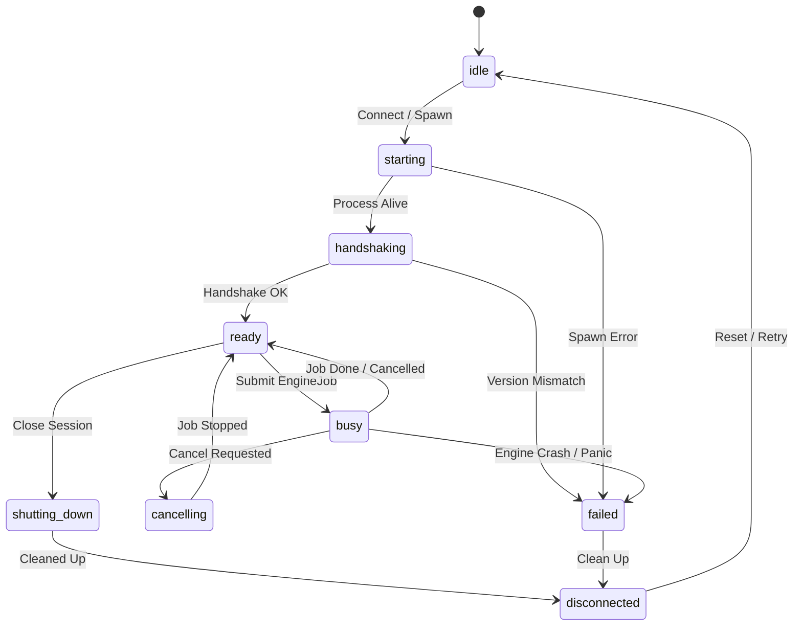

# Спецификация моста интеграции и менеджера сессий AxiEngine (AxiEngine Bridge & Session Management Spec)

> Этот документ формально определяет архитектурный контракт транспортного моста интеграции и менеджера сессий (Bridge & Session Manager) на стороне 3D-редактора AxiCAD. Спецификация регламентирует правила обнаружения вычислительного ядра AxiEngine, жизненный цикл межпроцессных сессий, протокол рукопожатия (Handshake), структуру моделей задач (EngineJob), стриминг событий, обработку аварийных отмен и границы безопасности файловой системы.

## Status: Draft

---

## 1. Назначение документа (Scope & Non-goals)

Данная спецификация устанавливает распределение зон ответственности между визуальной веб-средой AxiCAD и внешним вычислительным ядром AxiEngine на уровне транспортных протоколов и управления сессиями.

### Назначение (Scope)
- **Обнаружение и запуск (Discovery & Spawn)**: Поиск исполнимого файла движка, валидация прав и запуск процессов.
- **Протокол рукопожатия (Handshake Protocol)**: Проверка взаимной совместимости версий, протоколов, схем и поддерживаемых возможностей.
- **Управление транспортом (Transport Layer Management)**: Поддержка механизмов межпроцессного обмена (IPC stdio, gRPC, FFI/WASM).
- **Управление жизненным циклом сессий (Session Lifecycle Management)**: Координация состояний сессий подключения редактора к движку.
- **Модель задач и отмена (Job Model & Cancellation)**: Формирование уникальных задач, управление приоритетами, таймаутами и грациозной/принудительной отменой.
- **Маршрутизация событий (Event Routing)**: Перехват, трансляция и безопасная доставка асинхронных событий движка в слои редактора.
- **Маппинг диагностик (Diagnostic Mapping Integration)**: Трансляция аварийных остановов и паник движка в машиночитаемые объекты `DiagnosticItem`.

### Вне зоны ответственности (Non-goals)
- Документ **не описывает** внутреннее устройство Rust-крейтов, структуру модулей или алгоритмы ядра AxiEngine.
- Документ **не определяет** математику компиляции и запекания сети (Baker math), алгоритмы морфогенеза (Growth simulation) или нейросетевого симулятора (Inference runtime).
- Документ **не регламентирует** пользовательский интерфейс панелей настроек подключения или визуальные компоненты 3D-сцены AxiCAD.

---

## 2. Главный принцип (Main Principle)

Центральной архитектурной установкой транспортной подсистемы является использование единого унифицированного моста для всех типов операций, требующих вычислений на стороне ядра:

> **One Unified Engine Bridge to execute, observe, and protect.**

```
┌───────────────────────────────────────────────────────────────────────────────┐
│                           AxiCAD Orchestrator                                 │
│          (Editor Store, Command Mutation, Diagnostic Center)                  │
└──────────────────────────────────────┬────────────────────────────────────────┘
                                       │ EngineJobRequest / Events
                                       ▼
┌───────────────────────────────────────────────────────────────────────────────┐
│                        Unified Engine Bridge & Session Manager                │
│             (Discovery, Handshake, Transport, Job Queue, Routing)             │
└──────────────────────────────────────┬────────────────────────────────────────┘
                                       │ Inter-Process Communication (IPC/gRPC)
                                       ▼
┌───────────────────────────────────────────────────────────────────────────────┐
│                           AxiEngine Compute Core                              │
│  [validate | compile_baker | generate_layout | sample_sockets | route_tracts] │
│           [preview_somas | simulate_growth | step_inference]                  │
└───────────────────────────────────────────────────────────────────────────────┘
```

Единый мост обслуживает полный спектр команд ядра:
- `validate`: Каноническая проверка биологических и геометрических инвариантов.
- `compile_baker`: Запекание сети, упаковка ABI и генерация архива `.axic`.
- `generate_layout`: Автоматическая раскладка и выравнивание шардов/департаментов.
- `sample_sockets`: Дискретный семплинг контактных точек на границах объемов.
- `route_tracts`: Воксельная 3D-трассировка каналов и трактов связей.
- `preview_somas`: Правило-ориентированная генерация массивов сом.
- `simulate_growth`: Морфогенез, аксональный рост и синаптогенез.
- `step_inference`: Пошаговая симуляция электрической активности сети.

---

## 3. Режимы работы моста (Bridge Modes)

Интеграция моста поддерживает три последовательных режима функционирования:

| Режим | Архитектурная реализация | Преимущества | Недостатки | Статус |
|---|---|---|---|---|
| **Sidecar CLI** | Запуск процесса `axiengine-cli` через child_process (IPC stdio / JSON-lines). | Полная изоляция памяти, простая отладка, легкий перезапуск при падениях. | Накладные расходы на запуск процесса и сериализацию данных. | **MVP Standard (по умолчанию)** |
| **Long-lived Daemon** | Фоновый локальный сервис (gRPC / Unix Socket / Named Pipes). | Кэширование графа модели в памяти движка, мгновенный отклик на мелкие запросы. | Сложность управления демоном, необходимость отследить утечки памяти. | Target v2.0 |
| **In-process Library** | Прямой вызов через C-FFI или WebAssembly (WASM). | Нулевые накладные расходы на IPC, субмиллисекундный отклик. | Паника в C/Rust коде валит весь поток UI; ограничения памяти в WASM. | Optional Late Stage |

### Требования к MVP:
В версии MVP AxiCAD по умолчанию использует режим **Sidecar CLI**. Каждая тяжелая операция инициирует или задействует управляемый процесс-сайдкар с обменом текстовыми JSON-строками через стандартные потоки ввода-вывода (stdio).

---

## 4. Обнаружение и сборка движка (Engine Discovery & Build)

Подсистема обнаружения (Engine Discovery) отвечает за подготовку исполнимой среды перед установлением соединения:

1. **Порядок поиска бинарного файла**:
   - Явный путь, указанный пользователем в настройках проекта (`axicad.project.json`).
   - Переменная окружения `AXIENGINE_PATH`.
   - Локальный каталог проекта (`.local-storage/bin/axiengine`).
   - Системный путь `PATH`.
2. **Проверка метаданных (Validation & Handshake)**:
   - Запуск бинарника с флагом `--meta-json` для извлечения хэша сборки (`engineBuildHash`), версии протокола (`protocolVersion`) и поддерживаемых схем.
3. **Обработка отсутствия или устаревания**:
   - Если бинарник не найден или его версия несовместима, мост переходит в состояние `failed` и формирует системную диагностику в UI.
4. **Режим сборки по запросу (Build-on-demand Option)**:
   - AxiCAD может предоставить пользователю кнопку *"Скомпилировать AxiEngine локально"* (запуск `cargo build --release` в исходниках движка).
   - Автоматическая скрытая сборка без ведома пользователя **запрещена**, чтобы не блокировать ресурсы ПК.
5. **Трансляция ошибок сборки**:
   - Любые ошибки процесса `cargo build` перехватываются мостом и транслируются в текстовый поток логов и объекты `DiagnosticItem` уровня проекта. Молчаливые сбои (silent failures) категорически недопустимы.

---

## 5. Протокол рукопожатия (Handshake Protocol)

Перед началом выполнения задач редактор и движок обмениваются структурами рукопожатия для подтверждения контракта compatibility:

```typescript
export interface EngineHandshakeRequest {
  clientVersion: string;
  protocolVersion: string;
  requestedSchemaVersion: string;
  clientCapabilities: string[];
  sessionOptions: Record<string, unknown>;
}

export interface EngineHandshakeResponse {
  engineVersion: string;
  engineBuildHash: string;
  protocolVersion: string;
  supportedSchemaVersions: string[];
  supportedCommands: string[];
  capabilities: {
    maxVoxelGridResolution: number;
    supportsParallelBaking: boolean;
    supportsGrowthSimulation: boolean;
    supportsInferenceStepping: boolean;
  };
  featureFlags: Record<string, boolean>;
  minCompatibleProtocolVersion: string;
  maxCompatibleProtocolVersion: string;
}
```

Мост признает рукопожатие успешным только в том случае, если `protocolVersion` редактора находится в диапазоне между `minCompatibleProtocolVersion` и `maxCompatibleProtocolVersion` движка.

---

## 6. Жизненный цикл сессии (Session Lifecycle)

Состояние подключения к движку описывается строгим конечным автоматом (FSM):



### Состояния сессии (`EngineSessionState`):
- `idle`: Сессия не активна, бинарник не запущен.
- `starting`: Происходит запуск процесса или открытие сокета соединения.
- `handshaking`: Выполняется обмен структурированными пакетами рукопожатия.
- `ready`: Мост готов к приему задач компиляции или валидации.
- `busy`: В данный момент движок выполняет активную задачу (`EngineJob`).
- `cancelling`: Отправлен сигнал отмены, ожидается остановка вычислений.
- `failed`: Сессия завершилась аварийно (сбой Handshake, паника процесса).
- `shutting_down`: Происходит грациозная остановка и освобождение ресурсов.
- `disconnected`: Соединение полностью закрыто и очищено.

---

## 7. Модель задач (Job Model DTOs)

Каждая операция, отправляемая в движок, оборачивается в структурированную задачу `EngineJob`:

```typescript
export type EngineCommandType = 
  | 'validate'
  | 'compile_baker'
  | 'generate_layout'
  | 'sample_sockets'
  | 'route_tracts'
  | 'preview_somas'
  | 'simulate_growth'
  | 'step_inference';

export type JobPriority = 'low' | 'normal' | 'high' | 'urgent';

export interface EngineJobRequest {
  jobId: string;
  sessionId: string;
  commandType: EngineCommandType;
  snapshotId: string;
  mode: string;
  inputBundlePath?: string;
  inputPayload?: Record<string, unknown>;
  outputTargetPath?: string;
  cancellationToken?: string;
  priority: JobPriority;
  timeoutMs?: number;
  createdAt: number;
}

export interface EngineJobResult {
  jobId: string;
  success: boolean;
  exitCode: number;
  durationMs: number;
  outputManifestPath?: string;
  producedArtifactsCount: number;
  diagnosticsCount: number;
  errorSummary?: string;
}
```

---

## 8. Поток событий (Event Stream)

В процессе выполнения задачи движок генерирует асинхронный поток событий `EngineJobEvent`:

```typescript
export type EngineEventType = 
  | 'progress'
  | 'log'
  | 'diagnostic'
  | 'preview-frame'
  | 'artifact-ready'
  | 'patchset-proposed'
  | 'heartbeat'
  | 'job-completed'
  | 'job-failed';

export interface EngineJobEvent {
  jobId: string;
  sessionId: string;
  eventType: EngineEventType;
  sequenceNumber: number;
  timestamp: number;
  payload: Record<string, unknown>;
}
```

### Золотое правило обработки событий:
> **События движка НЕ МУТИРУЮТ Store напрямую.**

Любые приходящие события проходят через адаптер моста:
1. События `progress` и `log` отправляются в UI-компоненты прогресса и консоли.
2. События `diagnostic` транслируются в `DiagnosticItem` и передаются в **Diagnostics layer**.
3. События `patchset-proposed` передаются в слой **Command Mutation**, где оформляются в виде предложенного патча и применяются к Store **только после явного одобрения пользователем**.

---

## 9. Отмена, таймауты и аварии (Cancellation, Timeout & Crash)

Безопасность выполнения долгих операций обеспечивается следующими механизмами:

- **Грациозная отмена (Graceful Cancel)**: При клике на кнопку *"Отмена"* AxiCAD отправляет пакет отмены в канал связи или сигнал `SIGINT` сайдкар-процессу. Движок завершает текущий воксель и очищает временные структуры.
- **Принудительный останов (Force Kill)**: Если процесс или сессия не завершается в течение 5 секунд после сигнала отмены, адаптер моста (Bridge Adapter) выполняет платформ-специфичный принудительный останов (например, Unix `SIGKILL`, Windows `TerminateProcess` / `taskkill` или принудительный разрыв сокета/IPC-канала).
- **Политика таймаутов (Timeout Policy)**: Каждая задача снабжается таймаутом (по умолчанию: 30 сек для валидации, 10 мин для тяжелого запекания). По истечении времени задача отменяется автоматически.
- **Карантин частичных артефактов (Artifact Quarantine)**: Если задача завершилась со статусом `failed` или `cancelled`, любые частично созданные файлы в целевом каталоге помечаются расширением `.tmp_quarantine` и не включаются в манифест проекта.
- **Маппинг паник (Crash/Panic Mapping)**: В случае фатального падения процесса (Rust panic) мост перехватывает stderr, извлекает backtrace и формирует системную ошибку `AXI-ENGINE-PANIC` в каталоге диагностик.
- **Устаревание задач (Stale Job Behavior)**: Если пользователь внес изменения в Store во время выполнения тяжелой задачи, задача продолжает исполняться, но ее итоговый результат при получении сразу помечается флагом `isStale = true`.

---

## 10. Политика параллелизма (Concurrency Policy)

Для исключения гонки данных и перегрузки ресурсов системы мост соблюдает следующие правила:

1. **Правило тяжелых задач (MVP Heavy Job Rule)**: На уровне проекта допускается выполнение **ровно одной** тяжелой вычислительной задачи (`compile_baker`, `simulate_growth`, `step_inference`) в один момент времени.
2. **Категория легких проверок (Lightweight Category)**: Быстрые операции (`validate`, `sample_sockets`) могут исполняться асинхронно параллельно, если они запрашивают разные снимки состояния.
3. **Запрет коллизий вывода (Output Collision Lock)**: Мост категорически блокирует запуск двух одновременных сессий компиляции, у которых совпадает целевой каталог назначения (`outputTargetPath`).

---

## 11. Безопасность и границы файловой системы (Security & Boundaries)

Строгое разграничение доступов к файлам является обязательным инвариантом моста:

- **Санкционированные пути**: AxiCAD передает движку только пути внутри директории активного проекта или системного временного каталога (`tempdir`).
- **Запрет прямой записи в TOML**: AxiEngine **не имеет права** напрямую редактировать исходные файлы `model.toml`, `department.toml` или `shard.toml`. Изменения передаются только в виде объектов `PatchSet`.
- **Песочница вывода (Sandboxed Output)**: Все генерируемые артефакты пишутся либо во временный каталог сборки, либо в специализированную подпапку проекта `.local-storage/artifacts/`.

---

## 12. Интеграция с существующими спецификациями (References)

Данная спецификация опирается на следующие канонические документы экосистемы AxiCAD:

- [rust-core-axiengine-source-of-truth-spec-ru](rust-core-axiengine-source-of-truth-spec-ru.md) — Спецификация канонического ядра AxiEngine как источника истины.
- [baker-compile-pipeline-spec-ru](baker-compile-pipeline-spec-ru.md) — Спецификация пайплайна компиляции Baker Compile Pipeline.
- [editor-store-spec-ru](editor-store-spec-ru.md) — Спецификация реактивного хранилища и состояния редактора.
- [command-mutation-spec-ru](command-mutation-spec-ru.md) — Спецификация командной модели изменения состояния и Undo/Redo.
- [diagnostics-error-catalog-spec-ru](diagnostics-error-catalog-spec-ru.md) — Каталог диагностик и спецификация ошибок.
- [project-file-spec-ru](project-file-spec-ru.md) — Спецификация файла проекта `axicad.project.json`.
- [import-export-serialization-spec-ru](import-export-serialization-spec-ru.md) — Спецификация импорта, экспорта и сериализации.
- [constraint-engine-spec-ru](constraint-engine-spec-ru.md) — Спецификация ядра проверки ограничений (Constraint Engine).

---

## 13. История изменений (Changelog)

| Дата | Версия | Описание изменений |
|---|---|---|
| 2026-06-27 | 0.1.0 | Первоначальное создание спецификации моста интеграции и менеджера сессий AxiEngine Bridge & Session Management Spec. Определены 3 режима работы моста, Handshake DTO, конечный автомат сессии, модель задач EngineJob, правила обработки событий и границы безопасности. |
