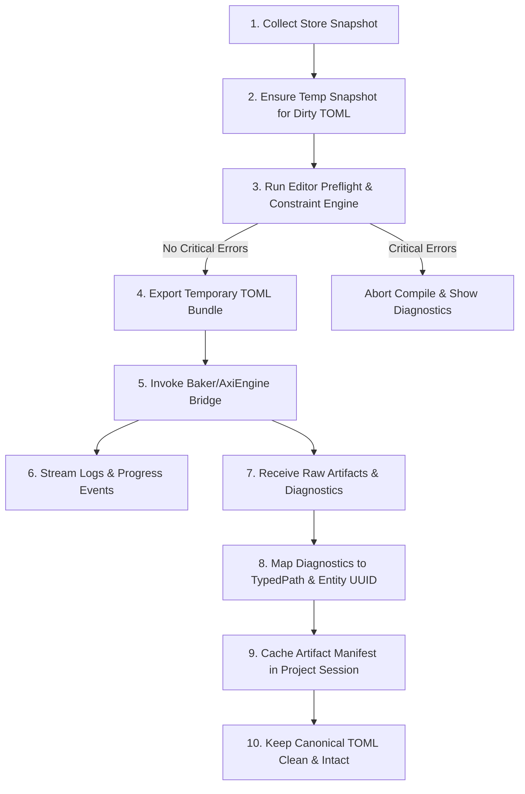

# Спецификация пайплайна подготовки, запуска Baker/AxiEngine compile и обработки артефактов (Baker Compile Pipeline Spec)

> Этот документ формально определяет архитектурный контракт пайплайна оркестрации компиляции (Baker Compile Pipeline) на стороне 3D-редактора AxiCAD. Спецификация описывает жизненный цикл подготовки снимков состояния, выполнения предварительных проверок (Preflight), запуска вычислительного ядра AxiEngine/Baker, асинхронного стриминга прогресса и логов, а также парсинга диагностик и кэширования итоговых бинарных артефактов.

## Status: Draft

---

## 1. Назначение документа (Scope & Non-goals)

Данная спецификация закрепляет статус **AxiCAD** как визуального оркестратора процессов подготовки и компиляции биологической модели, а вычислительного ядра **AxiEngine (Baker)** — как единственного владельца алгоритмов запекания, упакованных ABI и генерации артефактов.

### Назначение (Scope)
- **Оркестрация компиляции (Compile Orchestration)**: Управление жизненным циклом сессии компиляции, асинхронными состояниями и переходом между режимами.
- **Предварительные проверки (Preflight)**: Мгновенная и полная валидация реактивного хранилища Store перед вызовом внешних процессов.
- **Временный экспорт (Temporary Export Snapshot)**: Сериализация текущего состояния редактора во временный экспортный бандл без необходимости предварительной фиксации TOML на диске.
- **Вызов моста (Bridge Invocation)**: Взаимодействие с внешним вычислительным ядром AxiEngine через трехэтапную модель интеграции.
- **Обнаружение артефактов (Artifact Discovery)**: Поиск, валидация и каталогизация сгенерированных бинарных файлов и архивов `.axic`.
- **Маппинг диагностик и логов (Diagnostic/Log Mapping)**: Трансляция сырого вывода движка и машинных ошибок в унифицированные объекты `DiagnosticItem` и TypedPath.
- **Семантика устаревания (Stale State Management)**: Отслеживание расхождений между ревизиями Store, снимками компиляции и манифестами артефактов.
- **Контекст сборки и воспроизводимость (Build Context & Reproducibility)**: Обеспечение воспроизводимости компиляции за счет строгой фиксации версий протоколов и хэшей схем.

### Вне зоны ответственности (Non-goals)
- Документ **не описывает** внутренние математические алгоритмы Baker (трассировку аксонов, вокселизацию сом, упаковку бинарных масок `SomaFlags`).
- Документ **не проектирует** внутреннюю структуру крейтов или модулей Rust-ядра AxiEngine.
- Документ **не регламентирует** специфичные режимы симуляции роста (Growth Workspace) или нейросетевого рантайма (Inference Runtime).
- Документ **не является** спецификацией верстки или визуальной раскладки панелей интерфейса редактора (UI Layout Spec).
- Документ **не делает** заброшенный прототип `dev-rust-api` или legacy MVP `axicor-master` источниками истины. Они упоминаются исключительно как исторические справочные материалы (reference/prototype sources).

---

## 2. Главный принцип (Main Principle)

Разграничение ролей в процессе компиляции экосистемы Axicor строго подчиняется следующей фундаментальной формуле:

> **AxiCAD prepares and observes. AxiEngine compiles. Diagnostics explain. Artifacts are derived.**

```
┌───────────────────────────────────────────────────────────────────────────────┐
│                               AxiCAD Store                                    │
│                     (Reactive Biological State & UI)                          │
└──────────────────────────────────────┬────────────────────────────────────────┘
                                       │ 1. Collect Snapshot & Preflight
                                       ▼
┌───────────────────────────────────────────────────────────────────────────────┐
│                         Temporary Export Bundle                               │
│                   (Derived in-memory/tempdir TOML)                            │
└──────────────────────────────────────┬────────────────────────────────────────┘
                                       │ 2. Invoke Engine Bridge
                                       ▼
┌───────────────────────────────────────────────────────────────────────────────┐
│                          AxiEngine / Baker Core                               │
│                    (Executable Truth & Compile Math)                          │
└──────────────┬────────────────────────────────────────────────┬───────────────┘
               │ 3. Stream Progress & Logs                      │ 4. Emit Output
               ▼                                                ▼
┌──────────────────────────────┐                ┌──────────────────────────────┐
│     Diagnostics & Logs       │                │     Derived Artifacts        │
│    Mapped to DiagnosticItem  │                │   .axic Archive & Packed ABI │
└──────────────────────────────┘                └──────────────────────────────┘
```

1. **AxiCAD подготавливает и наблюдает**: Редактор формирует изолированные снимки состояния, выполняет быструю валидацию, передает данные движку, отображает ход выполнения и не вмешивается в математику сборки.
2. **AxiEngine компилирует**: Вычислительное ядро выполняет канонический парсинг, расчёт вокселей, упаковку бинарных масок и запекание сети.
3. **Диагностики объясняют**: Любые ошибки, предупреждения или отклонения транслируются через понятную структуру `DiagnosticItem` с точной привязкой к сущностям редактора.
4. **Артефакты являются производными**: Сгенерированные бинарные файлы и архивы являются временным результатом работы компилятора. Их удаление или повторная генерация никогда не разрушает канонические декларативные TOML-документы.

---

## 3. Обзор пайплайна (Pipeline Overview)

Высокоуровневый процесс компиляции состоит из десяти последовательных этапов:



1. **Сбор снимка Store (Collect Store Snapshot)**: Фиксация текущего ревизиона реактивного хранилища редактора (`storeRevision`) и формирование иммутабельного снайпшота графа объектов.
2. **Учет незафиксированных изменений (Ensure Temp Snapshot)**: Проверка наличия незафиксированных TOML-документов (`toml_documents_dirty`). Если список грязных путей не пуст, они сериализуются во временную директорию сборки, гарантируя компиляцию актуального состояния.
3. **Запуск префлайта редактора (Editor Preflight & Constraint Engine)**: Выполнение проверок готовности компиляции (Quick Preflight на уровне UI/кэша и Full Preflight для всего скоупа снимка). При наличии критических нарушений компиляция прерывается до вызова тяжелого движка.
4. **Экспорт временного бандла (Export Temporary TOML Bundle)**: Формирование воспроизводимой файловой структуры временного проекта с манифестом компиляции.
5. **Вызов моста AxiEngine (Invoke Baker/AxiEngine Bridge)**: Передача запроса на компиляцию через доступный канал межпроцессного взаимодействия (CLI Sidecar, Daemon или Library).
6. **Стриминг прогресса и логов (Stream Logs & Progress)**: Асинхронный перехват событий прогресса и текстового вывода stdout/stderr с отображением в UI редактора.
7. **Получение результатов (Receive Artifacts & Diagnostics)**: Перехват завершения процесса, чтение машинного отчета компиляции и обнаружение созданных бинарных файлов.
8. **Обратный маппинг диагностик (Map Diagnostics Back)**: Трансляция структур ошибок движка в канонические `DiagnosticItem` с восстановлением ссылок на Entity UUID и логические пути TypedPath.
9. **Кэширование манифеста артефактов (Cache Artifact Manifest)**: Сохранение метаданных скомпилированной сборки (`ArtifactManifest`) в `axicad.project.json` для последующего использования визуализатором.
10. **Гарантия не-мутации TOML (Keep Canonical TOML Clean)**: Процесс компиляции ни при каких обстоятельствах не изменяет исходные файлы `model.toml`, `department.toml` или `shard.toml`. Любые предложения движка по исправлению передаются в виде `PatchSet` и требуют явного выполнения команды пользователем.

---

## 4. Режимы компиляции (Compile Modes)

Пайплайн поддерживает семь строго разделенных режимов исполнения:

| Режим | Описание | Основная цель |
|-------|----------|---------------|
| `preflight-only` | Проверка инвариантов и готовности модели без стадии compile (источник проверок зависит от моста/кэша). | Быстрая валидация целостности и готовности к сборке. |
| `export-check` | Генерация временного экспортного TOML-бандла и проверка его структуры без запуска математики запекания. | Валидация корректности сериализации и путей. |
| `compile-debug` | Полная компиляция с включением отладочных символов, неоптимизированной геометрии предпросмотра и подробных логов. | Отладка трассировки и морфогенеза в процессе разработки. |
| `compile-release` | Финальное запекание модели с полной оптимизацией ABI, генерацией сжатых бинарных масок и архива `.axic`. | Подготовка готовой сети к загрузке в рантайм. |
| `artifact-inspect` | Чтение и проверка ранее скомпилированного манифеста артефактов без повторного вызова движка. | Анализ состава сборки и проверка целостности кэша. |
| `dry-run` | Запуск AxiEngine в режиме симуляции для оценки объема памяти, количества вокселей и времени сборки без записи файлов. | Оценка ресурсов перед тяжелым запеканием. |
| `stale-recheck` | Быстрое сравнение хэшей компонентов Store с ранее зафиксированным снимком компиляции. | Определение необходимости пересборки (is stale). |

---

## 5. Матрица владения данными (Data Ownership)

В процессе подготовки и выполнения компиляции сущности системы распределяются по следующим зонам ответственности:

| Сущность / Данные | Владелец (Owner) | Изменяемость (Mutability) | Описание и границы |
|-------------------|------------------|---------------------------|--------------------|
| **Store snapshot** | AxiCAD Store | Immutable (Snapshot) | Зафиксированный срез реактивного состояния редактора в момент запуска компиляции. |
| **`axicad.project.json`** | AxiCAD | Read/Write | Метаданные проекта, настройки вьюпорта, кэш активной сессии компиляции и ссылка на манифест. |
| **TOML documents** | Canonical Source | Read-Only during compile | Канонические биологические файлы. Компилятор только читает их (или их временную копию). |
| **Temporary export bundle** | AxiCAD (Orchestrator) | Transient / Derived | Временный каталог с сериализованными TOML-файлами для передачи движку. Удаляется или перезаписывается. |
| **Baker/AxiEngine artifacts** | AxiEngine | Derived Output | Сгенерированные бинарные файлы (`.axic`, `soma_flags.bin` и др.). Являются результатом работы компилятора. |
| **Logs (stdout/stderr)** | AxiEngine / Bridge | Event Stream | Сырой вывод текстовой информации. Используется для UI и парсинга, не является структурированной истиной. |
| **Diagnostics (`DiagnosticItem`)**| AxiCAD Diagnostics | Read/Write (in Store) | Канонические объекты ошибок и предупреждений, отображаемые на панели Diagnostic Center. |
| **Engine PatchSet** | AxiEngine | Proposed Change | Набор предложенных движком изменений. Не применяется автоматически до подтверждения пользователем. |

---

## 6. Базовые концепции и DTO (Core Concepts & DTOs)

Для межмодульного взаимодействия в AxiCAD определяются следующие TypeScript-интерфейсы:

```typescript
export type CompileMode = 
  | 'preflight-only'
  | 'export-check'
  | 'compile-debug'
  | 'compile-release'
  | 'artifact-inspect'
  | 'dry-run'
  | 'stale-recheck';

export interface CompileSession {
  sessionId: string;
  projectId: string;
  mode: CompileMode;
  status: 'idle' | 'preflight' | 'exporting' | 'compiling' | 'completed' | 'failed' | 'cancelled';
  startedAt: number;
  completedAt?: number;
  snapshotId: string;
  storeRevision: number;
  progressPercent: number;
  activeStageMessage: string;
  cancellationRequested: boolean;
}

export interface CompileSnapshot {
  snapshotId: string;
  storeRevision: number;
  schemaVersion: string;
  protocolVersion: string;
  createdAt: number;
  tempBundlePath?: string;
  dirtyEntitiesCount: number;
}

export interface CompileRequest {
  sessionId: string;
  snapshot: CompileSnapshot;
  mode: CompileMode;
  targetPath: string;
  engineOptions: Record<string, unknown>;
}

export interface PreflightReport {
  snapshotId: string;
  passed: boolean;
  criticalErrorsCount: number;
  warningsCount: number;
  diagnostics: DiagnosticItem[];
  timestamp: number;
}

export interface ExportBundle {
  bundleId: string;
  snapshotId: string;
  rootPath: string;
  manifestFileName: string;
  filesCount: number;
  totalSizeBytes: number;
  isDirtyExport: boolean;
}

export interface EngineInvocation {
  invocationId: string;
  bridgeType: 'cli-sidecar' | 'local-daemon' | 'wasm-library';
  executablePath: string;
  engineBuildHash: string;
  commandArgs: string[];
  pid?: number;
}

export interface CompileProgressEvent {
  sessionId: string;
  stage: string;
  percent: number;
  message: string;
  timestamp: number;
}

export interface CompileLogEvent {
  sessionId: string;
  level: 'trace' | 'debug' | 'info' | 'warn' | 'error';
  targetModule: string;
  message: string;
  timestamp: number;
  rawLine?: string;
}

export interface ArtifactRef {
  artifactId: string;
  kind: 'axic-archive' | 'packed-abi' | 'diagnostic-report' | 'preview-overlay';
  relativePath: string;
  checksumSha256: string;
  sizeBytes: number;
}

export interface ArtifactManifest {
  manifestId: string;
  sessionId: string;
  snapshotId: string;
  producedAt: number;
  engineVersion: string;
  engineBuildHash: string;
  artifacts: ArtifactRef[];
  metadata: Record<string, unknown>;
}

export interface DiagnosticMapping {
  engineErrorCode: string;
  mappedSeverity: 'error' | 'warning' | 'info';
  targetTypedPath?: string;
  targetEntityUuid?: string;
  targetTomlPath?: string;
  fallbackProjectDiagnostic: boolean;
}

export interface CompileResult {
  sessionId: string;
  success: boolean;
  manifest?: ArtifactManifest;
  diagnostics: DiagnosticItem[];
  totalDurationMs: number;
  exitCode?: number;
}

export interface StaleBuildState {
  isStale: boolean;
  reason?: 'store-revision-mismatch' | 'toml-dirty' | 'schema-version-changed' | 'missing-artifacts';
  lastCompiledRevision?: number;
  currentStoreRevision: number;
}
```

---

## 7. Правила предварительной проверки (Preflight Rules)

Проверка готовности модели к компиляции построена на каскадной схеме:

1. **Быстрый префлайт (Quick Preflight)**: Запускается в AxiCAD на уровне UI для быстрой проверки базовых инвариантов и кэшированных состояний. Служит для оперативной обратной связи и не является окончательным исполнимым источником истины (executable truth).
2. **Полный префлайт (Full Preflight)**: Запускается перед экспортом и компиляцией для глубокого анализа всего скоупа снимка (`CompileSnapshot` / export scope), а не только открытых сущностей в редакторе.
3. **Канонические правила компиляции**: Результат проверок, блокирующий компиляцию, должен быть получен через канонические правила `Constraint Engine` / `AxiEngine-backed rules` либо явно помечен как кэшированный результат этого слоя.
4. **Разделение Diagnostic Severity**:
   - **`Severity: Error`**: Критические нарушения биологических или геометрических инвариантов (например, пересечение границами шардов, невалидные типы сом).
   - **`Severity: Warning`**: Неоптимальности или предупреждения (например, неразведенные тракты, незадействованные сокеты).
5. **Политика блокировки (Blocking Policy)**:
   - **Сохранение файла проекта (`axicad.project.json`) разрешено всегда**, чтобы пользователь мог сохранить черновик и UI-метаданные при любых состояниях моделей.
   - **Экспорт и сохранение канонических TOML-файлов (`Export/Save canonical TOML`)** подчиняется правилам спецификации [import-export-serialization-spec-ru](import-export-serialization-spec-ru.md) и может блокироваться критическими ошибками схемы или биологическими инвариантами.
   - **Запуск запекания (`Baker Compile`) строго блокируется** при наличии критических диагностик готовности к компиляции (`critical compile-readiness diagnostics`).
6. **Обязательный учет устаревших элементов (Stale Elements Reporting)**:
   - Устаревшие геометрии трассировки (`stale routes`), незавершенные тракты (`stale tracts`) или устаревшие превью сом (`stale previews`) **не могут быть незаметно проигнорированы** компилятором.
   - Слой префлайта обязан пометить их соответствующими диагностиками и запросить автоматическую перетрассировку либо подтверждение пользователя.

---

## 8. Временные снимки и экспортный бандл (Temporary Snapshot / Export Bundle)

Для обеспечения непрерывности работы пользователя AxiCAD применяет механизм временных снимков:

- **Автономия от диска**: AxiCAD **не требует** от пользователя обязательного сохранения изменений на диск перед запуском компиляции.
- **Экспорт "грязного" состояния**: Если список незафиксированных путей `toml_documents_dirty` не пуст, текущее реактивное состояние Store сериализуется во временный каталог сборки (например, в `.local-storage/temp-builds/<snapshotId>/`).
- **Сохранение dirty-путей**: Процесс создания временного снимка для компиляции **НЕ УДАЛЯЕТ** пути из списка `toml_documents_dirty` основного проекта. Пользовательский черновик остается "грязным" до явного действия сохранения.
- **Метаданные снимка**: Каждый снимок маркируется параметрами `snapshotId`, `storeRevision`, `schemaVersion`, `protocolVersion` и меткой времени `createdAt`.
- **Воспроизводимость и инспекция**: Экспортный бандл представляет собой полноценную, человекочитаемую структуру TOML-файлов, доступную для инспекции разработчиком при отладке.
- **Сохранение адресации**: Внутренняя файловая структура и пути внутри временного бандла строго соответствуют логической адресации `TypedPath` (например, `departments/dept_01/shards/shard_alpha.toml`).

---

## 9. Вызов вычислительного ядра (Engine/Baker Invocation)

Взаимодействие AxiCAD с вычислительным ядром AxiEngine строится по трехэтапной эволюционной модели (Staged Integration Model):

```
┌───────────────────────────────────────────────────────────────────────────────┐
│                           Stage 1: Sidecar CLI                                │
│                     (Process Spawn via Node/Tauri IPC)                        │
└───────────────────────────────────────────────────────────────────────────────┘
                                       │ Evolution
                                       ▼
┌───────────────────────────────────────────────────────────────────────────────┐
│                          Stage 2: Local Daemon                                │
│                     (gRPC / WebSocket / Local Socket)                         │
└───────────────────────────────────────────────────────────────────────────────┘
                                       │ Evolution
                                       ▼
┌───────────────────────────────────────────────────────────────────────────────┐
│                        Stage 3: Shared Library / WASM                         │
│                    (Direct FFI / In-process Execution)                        │
└───────────────────────────────────────────────────────────────────────────────┘
```

### Валидация моста перед запуском (Pre-invocation Handshake)
Перед отправкой команды компиляции AxiCAD в обязательном порядке выполняет следующий чек-лист:
1. **Проверка бинарного файла (`Engine Binary Path`)**: Проверка наличия и прав на исполнение бинарника движка.
2. **Проверка хэша сборки (`Build Hash`)**: Сверка хэша движка с ожидаемым диапазоном версий.
3. **Совместимость протокола (`Protocol Version Check`)**: Проверка совпадения версий межпроцессного протокола обмена.
4. **Совместимость схемы (`Schema Compatibility`)**: Проверка поддерживаемых версий TOML-схем.
5. **Запрос поддерживаемых режимов (`Compile Modes Check`)**: Подтверждение поддержки запрошенного режима (`compile-release`, `dry-run` и т.д.).

---

## 10. Прогресс, логирование и отмена (Progress, Logs, and Cancellation)

Процесс компиляции является долговременной асинхронной операцией и регламентируется следующими правилами:

- **Стриминг прогресса**: Движок или адаптер моста транслируют события `CompileProgressEvent` с указанием текущего этапа (`voxelizing`, `routing`, `baking_abi`) и процента выполнения.
- **Структурированное логирование**: Текстовый вывод разбивается на объекты `CompileLogEvent` с классификацией по уровням целевых модулей.
- **Захват stdout/stderr**: При работе через CLI Sidecar текстовые потоки процесса перехватываются без потерь и буферизуются в лог-файле активной сессии компиляции.
- **Отмена операции (Cancellation)**: Пользователь может в любой момент инициировать отмену компиляции. AxiCAD отправляет сигнал `SIGINT`/`SIGTERM` (для CLI) или управляющий gRPC-пакет (для Daemon).
- **Таймауты и аварии**: В случае превышения допустимого времени выполнения или неожиданного падения процесса (crash/panic) сессия компиляции переводится в статус `failed` с формированием системной диагностики.
- **Карантин артефактов (Quarantine)**: Частично созданные файлы при неполной или отмененной компиляции помещаются в карантинный каталог и не попадают в манифест артефактов.
- **Параллельное редактирование (Concurrency & Stale)**: Пользователь имеет право продолжать редактирование модели в AxiCAD во время фоновой компиляции. Однако при изменении Store текущий активный снимок компиляции автоматически помечивается как `stale` (устаревший).

---

## 11. Манифест и структура артефактов (Artifact Manifest)

Результат работы конвейера Baker оформляется в виде набора бинарных файлов и манифеста, сопоставляемого с реестром [Artifact Cache Registry](artifact-cache-registry-spec-ru.md). Файлы сохраняются в каноническом каталоге проекта `.local-storage/artifacts/`.

### 11.1 Промежуточные состояния и контрольные точки (Checkpoints & Intermediate States Policy)
- **Целевое назначение**: При многоэтапной компиляции Baker и прогоне связанных симуляций конвейер поддерживает сохранение промежуточных состояний и контрольных точек (*checkpoints / intermediate build states*). Они необходимы для пошаговой отладки (debugging), мгновенного повторного воспроизведения (replay/recovery) и создания естественных точек восстановления без повторного пересчета.
- **Статус хранения**: Промежуточные снимки сохраняются строго как производные бинарные артефакты в `.local-storage/artifacts/` под управлением `Artifact Registry`. Они **никогда не записываются** в канонические файлы биологического описания TOML.
- **Политика очистки (Retention & Cleanup)**: Чекпоинты снабжаются политикой удержания `keep-for-replay` или `auto-evict` и подлежат автоматической ротационной очистке при превышении дисковых квот, предотвращая раздувание дискового пространства мусорными снимками.

**Состав артефактов**:
  - **Единый архив сборки (`.axic`)**: Упакованный контейнер, готовый к развертыванию в симуляторе.
  - **Упакованные ABI файлы (`Packed ABI`)**: Бинарные массивы плотной упаковки (`soma_flags.bin`, `packed_targets.bin`, `packed_positions.bin`).
  - **Диагностический отчет (`Diagnostic Report`)**: Машиночитаемый JSON с полным дампом проведенных вычислений и метрик.
  - **Оверлеи предпросмотра (`Preview Overlays`)**: Упрощенная геометрия для визуализации скомпилированных связей в 3D-сцене AxiCAD.
- **Метаданные манифеста**: Каждый манифест содержит SHA-256 хэши всех созданных файлов, объем в байтах, метку времени `producedAt`, ссылку на исходный `snapshotId` и параметры сборки движка.
- **Производный статус (Derived Nature)**: Все артефакты являются strictly derived. Ручное или автоматическое удаление директории артефактов или очистка кэша **не приводит к потере данных модели** и лишь переводит статус сборки в `isStale = true`.

---

## 12. Маппинг диагностик и ошибок (Diagnostic Mapping)

Для сохранения единого пространства ошибок все сообщения от AxiEngine транслируются в централизованный каталог диагностик редактора:

```
┌──────────────────────────────────────────┐
│          Raw Engine Output / JSON        │
│    (code: "ERR_SOMA_OVERLAP", path: ...) │
└────────────────────┬─────────────────────┘
                     │ Diagnostic Mapping Rules
                     ▼
┌──────────────────────────────────────────┐
│             DiagnosticItem               │
│  (id, severity, code, target, message)   │
└────────────────────┬─────────────────────┘
                     │ UI Dispatch
                     ▼
┌──────────────────────────────────────────┐
│      Diagnostic Center Panel / 3D HUD    │
└──────────────────────────────────────────┘
```

- **Привязка к сущностям (Entity Relatch)**: Если диагностика движка содержит текстовый путь или TOML-селектор, адаптер моста транслирует его в соответствующие `TypedPath` и Entity UUID в Store.
- **Глобальные ошибки (Fallback Diagnostics)**: В случае, если ошибку невозможно привязать к конкретной сущности (например, сбой выделения памяти движком), она регистрируется как системная диагностика уровня проекта (`fallbackProjectDiagnostic = true`).
- **Разделение сбоев (Save vs Compile)**: Ошибки компиляции блокируют завершение сессии компиляции, но **не препятствуют** сохранению конфигурации `axicad.project.json`. Сохранение канонических TOML-файлов регулируется правилами импорта/экспорта.
- **Трансформация логов в диагностики**: Простые текстовые логи не являются объектами `DiagnosticItem` до тех пор, пока они не будут явно распарсены и сопоставлены с зарегистрированными кодами ошибок из каталога диагностик.

---

## 13. Семантика флагов состояния (Dirty / Stale Semantics)

Изоляция процессов редактирования и компиляции требует четкого разграничения жизненных циклов и флагов состояний:

| Флаг состояния | Описание и триггер установки | Влияние на компиляцию | Способ сброса |
|----------------|------------------------------|-----------------------|---------------|
| `project_file_dirty` | Изменение визуальных настроек UI, позиции камеры или макета панелей в `axicad.project.json`. | Не влияет на биологическую компиляцию. | Явное сохранение файла проекта. |
| `toml_documents_dirty` | Список путей к TOML-документам с незафиксированными изменениями в биологической структуре (изменение биологических TOML payload: слои, типы, сокеты, связи и т.д.). | Требует создания временного снимка при компиляции. | Явное сохранение TOML-документов на диск. |
| `dirty_entities` | Список конкретных Entity UUID, измененных в реактивном Store с момента последнего сохранения. | Определяет объем необходимых проверок Preflight. | Сохранение или отмена изменений (Undo). |
| `compile_snapshot_stale` | Изменение Store во время или после создания текущего снимка компиляции. | Сигнализирует, что идущая или завершенная компиляция не актуальна. | Запуск нового процесса компиляции. |
| `artifact_manifest_stale` | Изменение канонических TOML или ревизиона Store после даты генерации манифеста. | Помечает скомпилированные бинарники как устаревшие (Stale). | Успешное выполнение повторной компиляции. |

### Важные системные правила:
1. **Экспорт во временный каталог НЕ очищает dirty-пути**: Создание временного экспортного бандла для нужд компилятора не удаляет пути из `toml_documents_dirty` и не сбрасывает `dirty_entities`.
2. **Принятие Engine PatchSet делает TOML "грязным"**: Если движок возвращает исправления (`PatchSet`) и пользователь принимает их, изменения применяются через `Command Mutation`, что добавляет или обновляет затронутые TOML-пути в `toml_documents_dirty` и помечает соответствующие Entity UUID в `dirty_entities`.
3. **Генерация предпросмотра НЕ делает TOML "грязным"**: Вычисление временных оверлеев или предпросмотра сом не меняет канонический биологический статус модели.

---

## 14. Взаимодействие с предметными режимами (Interaction With Workspaces)

Различные предметные режимы (Workspaces) редактора используют результаты компиляции и префлайта в соответствии со своей спецификой:

| Предметный режим | Роль в пайплайне компиляции | Потребляемые артефакты и сигналы |
|------------------|-----------------------------|-----------------------------------|
| **Composition Workspace** | Проверка пространственных габаритов (bounds), пересечений объемов шардов и департаментов перед запуском запекания. | Пространственные диагностики, ошибки пересечения AABB, статус готовности раскладки. |
| **Connectome Workspace** | Валидация связности сокетов, трассировка трактов и обнаружение устаревших каналов (`stale routes`). | Геометрия трассировки, откладываемые оверлеи трактов, ошибки прокладки кабелей. |
| **Shard Neuron Editor Workspace** | Валидация биологических типов нейронов, параметров слоев и правил упаковки сом (`SomaPlacement`). | Маски флагов сом (`SomaFlags`), воксельные сетки плотности, ошибки био-инвариантов. |
| **Growth Workspace (Future)** | Исполнение алгоритмов симуляции морфогенеза и синаптогенеза на основе скомпилированных правил. | Скомпилированные исходные контексты роста, биологические матрицы восприимчивости. |
| **Inference Runtime (Future)** | Прямое исполнение симуляции нейронной сети в реальном времени. | Финальные архивы `.axic`, упакованные плотные ABI бинарники. |

---

## 15. Сценарии аварийных ситуаций (Failure Modes)

Пайплайн оркестрации обязан корректно обрабатывать следующие аварийные сценарии:

1. **Отсутствует бинарный файл движка (`Engine Binary Missing`)**: Мост блокирует запуск компиляции, генерирует `DiagnosticItem` уровня проекта и предлагает пользователю указать путь к `AxiEngine`.
2. **Ошибка сборки движка (`Cargo/Engine Build Failed`)**: При попытке автоматической сборки движка перехватывается вывод компилятора, сессия завершается со статусом `failed`, ошибки выводятся в консоль разработчика.
3. **Несоответствие версий протокола (`Protocol Mismatch`)**: Вызов прерывается до передачи данных. Пользователю выводится предупреждение о необходимости обновления редактора или движка.
4. **Несоответствие версий TOML-схемы (`Schema Mismatch`)**: Движок отклоняет экспортный бандл. Редактор подсвечивает несовместимые поля схемы через систему диагностик.
5. **Сбой создания временного экспорта (`Temporary Export Failed`)**: Перехват ошибок файловой системы (нехватка места, отсутствие прав записи). Сессия отменяется с сохранением данных Store.
6. **Изменение Store в процессе компиляции (`Store Changed During Compile`)**: Компиляция продолжается, но создаваемый манифест сразу маркируется флагом `isStale = true`.
7. **Отмена компиляции пользователем (`Compile Cancelled`)**: Процесс движка уничтожается, временные файлы помещаются в карантин, статус сессии меняется на `cancelled`.
8. **Аварийное падение движка (`Engine Panic / Crash`)**: Перехват кода возврата, не равного 0. Анализ stderr, формирование критической диагностики с дампом паники.
9. **Неполный манифест артефактов (`Artifact Manifest Incomplete`)**: Ошибка валидации контрольных сумм или отсутствующие бинарники на выходе. Результаты компиляции забраковываются.
10. **Сбой маппинга диагностик (`Diagnostic Mapping Failed`)**: Если ошибка движка не может быть распознана, она регистрируется под дефолтным кодом `AXI-ENGINE-UNKNOWN` с сохранением сырого текста.
11. **Обнаружение устаревших полей (`Unsupported Legacy Field`)**: Валидатор фиксирует использование полей из legacy-прототипов и блокирует запуск до их удаления или миграции.
12. **Ошибки прав доступа к файловой системе (`Filesystem Permission Error`)**: Невозможность записи в целевой каталог артефактов. Процесс останавливается с понятным уведомлением пользователя.

---

## 16. Открытые архитектурные решения (Open Decisions)

В ходе дальнейшей реализации пайплайна подлежат уточнению следующие вопросы:

1. **Формат интеграции для MVP**: Целесообразно ли использовать на этапе MVP исключительно Sidecar CLI процесс для простоты отладки и изоляции?
2. **Локализация временных бандлов**: Где предпочтительнее хранить временные снайпшоты экспортных бандлов — в системной директории временных файлов (`os.tmpdir()`) или в локальной папке проекта `.local-storage/temp/`?
3. **Политика ротации кэша артефактов**: Каков максимальный срок жизни и допустимый объем дискового пространства для скомпилированных манифестов артефактов?
4. **Изоляция кэша артефактов**: Должен ли кэш артефактов располагаться непосредственно внутри каталога проекта или в глобальном пользовательском кэше (App Data)?
5. **Состав первого вертикального слиза (Vertical Slice MVP)**: Каков минимально необходимый набор ABI файлов в архиве `.axic` для успешного запуска базовой визуализации?
6. **Автосборка движка**: Должен ли AxiCAD автоматически вызывать `cargo build` при отсутствии бинарника AxiEngine или ограничиться уведомлением пользователя?
7. **Классификация логов**: Какие категории текстовых логов движка должны автоматически конвертироваться в `DiagnosticItem` первого класса для отображения в 3D-сцене?
8. **Параллельные сессии компиляции**: Допускается ли одновременный запуск нескольких сессий компиляции для разных режимов (`compile-debug` и `dry-run`) или компилятор должен быть строго однопоточным в рамках проекта?

---

## 17. Ссылки на контекстные документы (References)

Данная спецификация опирается на следующие канонические документы экосистемы AxiCAD:

- [architectural-brief-ru](architectural-brief-ru.md) — Общий архитектурный брифинг и концептуальные цели проекта.
- [domain-model-spec-ru](domain-model-spec-ru.md) — Доменная модель AxiCAD и соответствие TOML/Rust контракту.
- [toml-schema-spec-ru](toml-schema-spec-ru.md) — Каноническая TOML-схема Axicor и описание полей.
- [validation-spec-ru](validation-spec-ru.md) — Спецификация системы валидации и уровней проверок.
- [editor-store-spec-ru](editor-store-spec-ru.md) — Спецификация реактивного хранилища и модели состояния редактора.
- [project-file-spec-ru](project-file-spec-ru.md) — Спецификация файла проекта `axicad.project.json`.
- [command-mutation-spec-ru](command-mutation-spec-ru.md) — Спецификация командной модели изменения состояния и Undo/Redo.
- [import-export-serialization-spec-ru](import-export-serialization-spec-ru.md) — Спецификация импорта, экспорта и сериализации.
- [diagnostics-error-catalog-spec-ru](diagnostics-error-catalog-spec-ru.md) — Каталог диагностик и спецификация ошибок.
- [constraint-engine-spec-ru](constraint-engine-spec-ru.md) — Спецификация ядра проверки ограничений (Constraint Engine).
- [rust-core-axiengine-source-of-truth-spec-ru](rust-core-axiengine-source-of-truth-spec-ru.md) — Спецификация канонического вычислительного ядра AxiEngine и контракта источника истины.
- [composition-workspace-spec-ru](composition-workspace-spec-ru.md) — Спецификация предметного режима сборки Composition Workspace.
- [connectome-workspace-spec-ru](connectome-workspace-spec-ru.md) — Спецификация предметного режима проектирования связей Connectome Workspace.
- [shard-neuron-editor-workspace-spec-ru](shard-neuron-editor-workspace-spec-ru.md) — Спецификация предметного режима редактора внутренней биологии шарда Shard Neuron Editor.

---

## 18. История изменений (Changelog)

| Дата | Версия | Описание изменений |
|---|---|---|
| 2026-06-27 | 0.1.0 | Первоначальное создание спецификации пайплайна компиляции Baker Compile Pipeline Spec. Определены зоны ответственности, 7 режимов компиляции, DTO-интерфейсы, семантика устаревания, правила префлайта, вызов моста и сценарии аварийных ситуаций. |
| 2026-06-28 | 0.2.0 | Зафиксирована поддержка промежуточных состояний и контрольных точек (Checkpoints & Intermediate States Policy) в `.local-storage/artifacts/` для отладки и восстановления без вмешательства в канонический TOML. |
| 2026-06-27 | 0.1.1 | Точечные уточнения семантики Preflight (UI-level sanity vs full scope), политики блокировки сохранения TOML/проекта, списочной семантики toml_documents_dirty и dirty_entities для PatchSet и исправление опечаток. |
