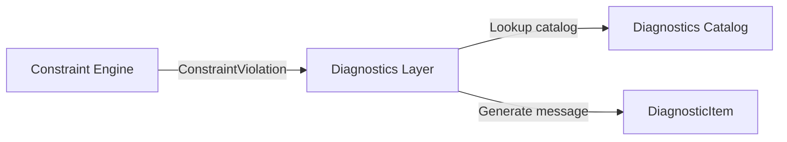

# Спецификация Constraint Engine для AxiCAD (Constraint Engine Spec)

> Этот документ формально описывает архитектуру и контракты ядра проверки ограничений (Constraint Engine) в 3D-редакторе AxiCAD. Constraint Engine представляет собой чистый, лишенный побочных эффектов слой правил поверх реактивного хранилища данных (Store) и геометрических фактов, поставляемых пространственным сервисом (Geometry & Spatial Service).

## Status: Draft

---

## 1. Назначение и границы (Scope & Non-goals)

`Constraint Engine` отвечает за обнаружение геометрических, топологических и биологических несоответствий на основе текущего снимка состояния проекта. Его главная цель — предоставить детерминированный интерфейс для проверки правил вида «разрешено / запрещено / предупреждение / требуется пересчет».

### Вне зоны ответственности (Non-goals)
- **Constraint Engine не мутирует Store**: Он является чисто читающим («read-only») модулем. Он принимает снимок состояния и возвращает список нарушений, но сам ничего не записывает и не меняет.
- **Не сохраняет данные**: Движок не работает напрямую с вводом-выводом файлов TOML или JSON.
- **Не визуализирует состояние**: Он не отвечает за отрисовку вьюпорта, раскраску силуэтов, рамок или панелей ошибок. Он только поставляет структурированные факты нарушений (facts/hints) для UI.
- **Не запускает компилятор Baker**: Движок работает внутри процесса редактора (или как Rust/WASM-библиотека в будущем) и не вызывает внешние бинарные файлы `baker-cli`.
- **Не дублирует математические расчеты**: Все пространственные предикаты (пересечение AABB, вхождение объемов, коллизии лучей) запрашиваются у [Geometry & Spatial Service](geometry-spatial-service-spec-ru.md).
- **Не является каталогом текстов ошибок**: Он не хранит локализованные строки для отображения пользователю и не владеет финальными диагностическими кодами `AXI-*`. Он возвращает машиночитаемые структурированные факты нарушений, которые затем мапятся на диагностический каталог в слоях Validation и Diagnostics.

---

## 2. Место в архитектуре (Architecture Placement)

Constraint Engine находится на стыке хранилища состояния (Store) и пространственного сервиса, являясь «мозгом» валидации:

```
                  ┌───────────────────────────────┐
                  │      Editor Store / State     │
                  └───────────────┬───────────────┘
                                  │ (Snapshot)
                                  ▼
 ┌─────────────────┐      ┌───────────────┐
 │ Geometry /      ├─────►│  Constraint   │
 │ Spatial Service │Facts │    Engine     │
 └─────────────────┘      └───────┬───────┘
                                  │
                                  ▼ (ConstraintResult)
 ┌─────────────────┐      ┌───────────────┐
 │ Validation &    │◄─────┤ Commands      │ (Preflight /
 │ Diagnostics     │      │ (Mutations)   │  Apply Checks)
 └────────┬────────┘      └───────────────┘
          │ (DiagnosticItems)
          ▼
   [ UI / 3D-Viewport ]
```

### Потоки данных и интеграция:
1. **Store / Project state -> Constraint Engine**: Движок считывает иммутабельный снимок состояния (или дельту изменений при инкрементальном прогоне).
2. **Geometry/Spatial Service -> Constraint Engine**: Поставляет геометрические факты:
   - Обнаружение коллизий AABB/OBB шардов (overlap).
   - Выход сокета/нейрона за пределы родительского шарда (containment failure).
   - Пересечение трассы тракта с запрещенными зонами (ray/box/volume intersection).
   - Граничные боксы / bounds.
3. **Constraint Engine -> ConstraintResult**: Результат вычисления передается вызывающему компоненту.
4. **Validation / Diagnostics layer**: Получает `ConstraintResult` и накладывает правила отображения, переводя внутренние нарушения (`ConstraintViolation`) в унифицированные диагностические элементы `DiagnosticItem` (согласно [Каталогу диагностик](diagnostics-error-catalog-spec-ru.md)).
5. **Командная модель (Commands & Mutations)**: Использует движок для двухфазной проверки (Preflight/Apply) согласно [Command Mutation Spec](command-mutation-spec-ru.md):
   - **Preflight Check**: Проверка допустимости интерактивного действия до его совершения (например, оценка допустимости позиции перетаскиваемого шарда).
   - **Apply Check**: Финальная валидация транзакции перед записью в историю изменений Store.
6. **Импорт / Экспорт**: Использует Constraint Engine для проверки готовности к сохранению проекта или компиляции Baker (`export/baker readiness`).

---

## 3. Основные сущности и контракты (Core Entities)

```typescript
// Концептуальный интерфейс (Conceptual interface, не является прямым API реализации)

type UUID = string; // Концептуальный UUID из Store

/** Степень критичности нарушения */
export type ConstraintSeverity = 'error' | 'warning' | 'info';

/**
 * Операции, которые могут быть заблокированы нарушениями ограничений.
 * Сохранение проекта JSON ('save-project-json') намеренно исключено из BlockingOperation на уровне типов,
 * чтобы гарантировать возможность сохранения незавершенного состояния при любых ошибках.
 */
export type BlockingOperation =
  | 'export-toml'
  | 'baker-compile'
  | 'command-apply'
  | 'apply-patchset';

/** Профиль операции, определяющий активный набор правил и поведение */
export type ConstraintProfile =
  | 'interactive-preview'
  | 'command-preflight'
  | 'command-apply'
  | 'save-project-json'
  | 'export-toml'
  | 'baker-compile'
  | 'import-staging'
  | 'apply-patchset';

/** Области действия правил (Scopes) */
export type ConstraintScopeType =
  | 'model'
  | 'department'
  | 'shard'
  | 'socket'
  | 'tract'
  | 'composition-layout'
  | 'project-metadata'
  | 'patchset';

/** Системная ссылка на сущность по ее типизированному пути */
export type AffectedEntityPath = string; // e.g. "departments.SensoryCortex.shards.L2_Exc"

/**
 * Входной контекст для работы Constraint Engine.
 * Содержит ссылку на срез Store и кэшированные геометрические факты.
 */
export interface ConstraintContext {
  readonly storeSnapshot: any; // Иммутабельный снимок Store
  readonly geometryFacts: Map<string, ConstraintFact>; // Факты от Geometry Spatial Service
  readonly affectedPaths?: AffectedEntityPath[]; // Для инкрементального прогона
  readonly profile: ConstraintProfile; // Активный профиль проверки
}

/**
 * Базовое описание единичного геометрического или топологического факта.
 * Генерируется Spatial-сервисом и кэшируется.
 */
export interface ConstraintFact {
  readonly id: string;
  readonly type: 'overlap' | 'containment' | 'distance' | 'bounds' | 'custom';
  readonly entityIds: UUID[];
  readonly payload: any; // Детали расчета (например, объем пересечения в вокселях)
}

/**
 * Интерфейс правила ограничения.
 */
export interface ConstraintRule {
  readonly ruleId: string; // Уникальный идентификатор правила, например, "CE-GEO-001"
  readonly category: string; // Категория правила (reference, structural, biology, geometry и т.д.)
  readonly scope: ConstraintScopeType;
  readonly baseSeverity: ConstraintSeverity; // Базовая критичность правила
  readonly proposedDiagnosticCode?: string; // Предлагаемый код для каталога ошибок
  
  /**
   * Вычисление правила над контекстом.
   */
  evaluate(context: ConstraintContext): ConstraintViolation[];
}

/**
 * Нарушение правила ограничения.
 */
export interface ConstraintViolation {
  readonly ruleId: string;
  readonly severity: ConstraintSeverity; // Итоговая критичность, вычисленная с учетом ConstraintProfile
  readonly affectedPaths: AffectedEntityPath[];
  readonly entityIds: UUID[];
  readonly blockingOperations: BlockingOperation[]; // Список заблокированных операций
  
  /** Машиночитаемые детали нарушения (координаты, превышенные лимиты) */
  readonly details: {
    readonly [key: string]: any;
  };
  
  /** Флаг, указывающий на необходимость пересчета derived-данных */
  readonly requiresRecompute?: boolean;
}

/**
 * Агрегированный результат прогона Constraint Engine.
 * Должен оставаться строго детерминированным. Временные метки вынесены на уровень метаданных вызова.
 */
export interface ConstraintResult {
  readonly isValid: boolean;
  readonly violations: ConstraintViolation[];
  readonly profile: ConstraintProfile;
}
```

---

## 4. Области действия правил (Constraint Scope)

Правила разделены по иерархическому принципу на области действия (`ConstraintScope`). Это позволяет организовать инкрементальный расчет и оптимизировать скорость работы.

1. **model-level**:
   - Глобальные лимиты и параметры симуляции (например, общие габариты мира, уникальность имен департаментов, соответствие `voxel_size_um`).
2. **department-level**:
   - Правила взаимного расположения шардов внутри департамента, связность внутренних сокетов, уникальность имен шардов внутри департамента.
3. **shard-level**:
   - Лимиты типов нейронов (до 16), корректность слоев шарда, лимиты VRAM (`ghost_capacity`), валидность пропорций биологических параметров.
4. **socket-level**:
   - Размеры сокета, лимиты шагов роста на портах/пинах (`growth_steps <= 255`), корректность направления сокета (`in` / `out`).
5. **tract-level**:
   - Проверка роутинга тракта, отсутствие петель с нулевой задержкой, непрерывность траектории, сечение кабельного пучка.
6. **composition-layout-level**:
   - Проверка высотных диапазонов и привязки департаментов к слоям сборки (Composition Workspace levels).
7. **project-metadata-level**:
   - Целостность JSON-файла проекта `axicad.project.json`, результаты Path Resolver / состояние ссылок на TOML-файлы конфигураций (Constraint Engine оперирует уже разрешенными или неразрешенными путями/состояниями из Store и не производит прямой ввод-вывод или проверки наличия файлов на диске).
8. **import/export patchset scope**:
   - Ограничения на изменения, вносимые временным набором патчей (PatchSet) при импорте внешних фрагментов или адаптации старых версий.

---

## 5. Профили операций (Operation Profiles)

В зависимости от текущей активности пользователя или системы, Constraint Engine переключает профиль (`ConstraintProfile`), активируя или маскируя определенные группы правил и перевычисляя итоговую серьезность нарушений (`severity`).

| Профиль (`ConstraintProfile`) | Описание поведения и расчет критичности |
| :--- | :--- |
| `interactive-preview` | **Быстрый UX во время манипуляций**. Проверяются только локальные геометрические ограничения (вхождение в контейнер, быстрые OBB-коллизии). Возвращает неблокирующие нарушения (preview violations), подходящие для визуализации в интерфейсе пользователя (UI), без прерывания интерактивных манипуляций. |
| `command-preflight` | **Валидация перед совершением транзакции**. Быстрый прогон правил, чтобы отклонить заведомо разрушительные мутации. |
| `command-apply` | **Строгий прогон правил при фиксации команды в истории Store**. Гарантирует, что транзакция не нарушает структурную целостность графа моделей. |
| `save-project-json` | **Сохранение рабочего состояния в JSON проекта**. **Специальное поведение**: Возвращает исключительно информационные факты, предупреждения и статусы готовности (warnings/info/readiness facts). Не блокирует запись файла из-за геометрии, битых ссылок или неразрешенных импортов. Реальные причины отказа (например, физическая невозможность записать файл или фатальное повреждение структуры сериализатора) лежат на уровне IO/serializer/schema, а не Constraint Engine. |
| `export-toml` | **Экспорт биологических конфигураций TOML**. Любые несоответствия биологической структуры или критические геометрические коллизии получают `severity: 'error'` и блокируют операцию. |
| `baker-compile` | **Компиляция сети на GPU (Baker)**. Активирует строжайший набор правил: аппаратные лимиты памяти, полное совпадение размеров сокетов, лимиты шагов роста аксонов. Нарушения переводятся в `severity: 'error'`. |
| `import-staging` | **Загрузка сторонних файлов**. Позволяет импортировать проекты с геометрическими коллизиями, переводя нарушения в статус `warning` или `info` для последующего ручного исправления. |
| `apply-patchset` | **Применение набора автоисправлений**. Проверяет, улучшает ли PatchSet текущую ситуацию и не вносит ли он критических петель зависимостей. |

---

## 6. Категории правил (Rule Categories)

Constraint Engine классифицирует правила по функциональным категориям:

### 6.1 Reference Integrity (Целостность ссылок)
- **Отсутствие битых путей**: Каждый `typedPath` в системе должен разрешаться в существующий объект.
- **Связность сущностей**: Ссылки департамент-слой, шард-департамент, сокет-шард должны иметь взаимный родительский и дочерний маппинг в Store.

### 6.2 Structural Constraints (Структурные ограничения)
- **Иерархическая вложенность**: Департамент принадлежит строго одному уровню (Level). Шард принадлежит строго одному департаменту.
- **Уникальность имен**: Имена департаментов уникальны в рамках проекта; имена шардов уникальны в рамках департамента; имена сокетов уникальны в рамках шарда.

### 6.3 Biological/TOML Constraints (Биологические лимиты)
- **Габариты**: Размеры шарда `w, d, h` укладываются в диапазоны PackedPosition (`0 < w <= 1023`, `0 < d <= 1023`, `0 < h <= 255`).
- **Параметры сомы**: `max_dendrites` строго равно `128` (аппаратное ограничение).
- **Шаги роста**: Лимит `growth_steps <= 255`.
- **Типы нейронов**: Не более 16 типов клеток на один шард.
- **Временные интервалы**: `signal_propagation_length >= refractory_period` (INV-CONFIG-004).

### 6.4 Geometry Constraints (Геометрические ограничения)
- **Shard Containment**: Шард должен полностью находиться в пределах физического контейнера своего департамента и высотного диапазона (Level Band).
- **Socket Bounds**: Сокет должен физически располагаться на границе (face) или в пределах воксельного объема родительского шарда.
- **Socket Hard Overlap**: Полное пересечение или наложение (hard overlap) площадок сокетов на гранях шарда или в одной зоне размещения запрещено (конфликт сокетных площадок и сэмплов в пространстве шарда/сетки).
- **Soft Congestion (Предупреждение)**: Зоны повышенной плотности расположения элементов, которые могут вызвать проблемы у Baker-компилятора, но не запрещены строго (например, пересечение AABB шардов, если это допустимо биологически для перекрытия клеток).
- **Tract Forbidden-Region**: Трассы трактов не должны пересекать объявленные зоны отчуждения (forbidden-regions) или чужие шарды без явного разрешения.

### 6.5 Dirty/Readiness Constraints (Грязное состояние и готовность)
- **Generated Preview Stale**: Сгенерированный интерактивный предпросмотр (например, превью путей тракта или сэмплинга сокета) устарел из-за изменения положения элементов и требует перевычисления.
- **Manual Tract Stale**: Ручная трассировка тракта больше не совпадает со смещенными позициями сокетов.
- **Imported Fragment Unresolved**: Импортированный фрагмент содержит ссылки на сущности, которых нет в текущей сцене (требуется ремаппинг путей).

### 6.6 Source-of-Truth Constraints (Единственность источника истины)
- **Запрет независимого дублирования**: Математические и геометрические формулы не должны дублироваться внутри движка ограничений. Если требуется проверить перекрытие сокетов, движок запрашивает у Spatial Service факты `ConstraintFact(type: 'overlap')`. Движок не должен самостоятельно вычислять трансформации мировых координат или проекции матриц.

---

## 7. Связь с грязным состоянием (Dirty State)

Constraint Engine является пассивным наблюдателем и **не устанавливает dirty-флаги в Store напрямую**. Это критически важно для предотвращения циклов обновления.

```
       [ Command / User Action ]
                  │
                  ▼ (Writes state)
              [ Store ]  ──► (Sets Dirty Flags: bio_toml_dirty, project_json_dirty)
                  │
                  ▼ (Triggers evaluation)
       [ Constraint Engine ]
                  │
                  ▼ (Returns violation payload)
  { requiresRecompute: true, staleDerivedData: ... }
```

### Разделение флагов и реакций:
1. **Dirty Flags**: Устанавливаются командами при изменении данных в Store.
   - `project_json_dirty`: Изменились параметры размещения (координаты, цвета, настройки интерфейса). Требует сохранения `axicad.project.json`.
   - `bio_toml_dirty`: Изменились биологические параметры (структура слоев, типы нейронов, соединения). Требует перезаписи TOML-файлов конфигурации.
2. **Constraint Engine Reactions**: В результате проверки Constraint Engine возвращает структурированный ответ, содержащий рекомендации по пересчету:
   - `requiresRecompute`: Флаг в `ConstraintViolation`. Сигнализирует о том, что для снятия данного нарушения необходимо запустить фоновый пересчет derived-данных (например, перезапуск автотрассировки трактов или сэмплинга сокетов).
   - `staleDerivedData`: Сигнализирует Validation слою, что текущие отображаемые геометрические данные устарели относительно Store.
   - `invalidGeneratedPreview`: Указывает, что 3D-вьюпорт использует устаревшие буферы геометрии.

---

## 8. Инкрементальная валидация (Incremental Validation)

Для обеспечения производительности 3D-редактора (отклик менее 16мс при 60 FPS) Constraint Engine поддерживает инкрементальную валидацию.

### Механизм инкрементального расчета:
- **Вектор изменений (Affected Paths)**: Команда, совершающая мутацию, передает массив путей измененных сущностей `AffectedEntityPath[]` (например, `['departments.SensoryCortex.shards.L2_Exc']`).
- **Спуск по дереву зависимостей**: Движок определяет правила, зависящие от этих путей, и запускает `evaluate` только для них.
- **Кэширование геометрических фактов**: Факты от Spatial Service (такие как AABB-пересечения) кэшируются в `ConstraintContext.geometryFacts`. Кэш инвалидируется по ревизиям Store (`entity.revision` или `store.revision`). Если ревизия шарда не изменилась, пространственный сервис возвращает кэшированные факты, избегая повторных проверок дерева интервалов (Interval Tree / R-Tree).
- **Полная валидация (Full Validation)**: Запускается принудительно перед операциями экспорта TOML или запуска Baker как блокирующая проверка. Перед сохранением JSON проекта полная валидация может запускаться исключительно в качестве информационного сканирования готовности (informational/readiness scan); её результаты записываются в кэш диагностик, но никогда не блокируют саму запись файла `axicad.project.json`.

---

## 9. Детерминированность (Determinism)

Детерминированность является базовым требованием к Constraint Engine для обеспечения стабильности совместной работы и предсказуемости симуляций.

1. **Snapshot-детерминизм**:
   - Одинаковый снимок Store и одинаковые пространственные данные должны приводить к абсолютно идентичному результату `ConstraintResult` на любой платформе (JS/TS в браузере, Rust в Baker или Python в SDK).
2. **Отсутствие метаданных выполнения в каноническом результате**:
   - Канонический `ConstraintResult` не содержит временных меток выполнения (`evaluatedAt`), параметров окружения или системных путей. Любые метаданные времени выполнения должны оборачиваться внешним слоем логики и не влияют на сравнение результатов.
3. **Стабильная сортировка**:
   - Порядок нарушений в списке `violations` должен быть стабильно детерминирован для предотвращения дребезга в интерфейсе (дребезг списка ошибок). Сортировка выполняется по критериям:
     1. Степень критичности (`severity`: error -> warning -> info).
     2. Алфавитный порядок путей затронутых сущностей (`affectedPaths[0]`).
     3. Идентификатор правила (`ruleId`).
4. **Воксельный integer-only расчет**:
   - Все проверки попадания сокетов, размеров шард и сопоставления сэмплов выполняются в целочисленных координатах вокселей. Это исключает погрешности float-вычислений и гарантирует кроссплатформенный детерминизм.
5. **Сведение float к целому**:
   - Если для вычисления правил используются дробные физические значения (из Geometry Service), они должны преобразовываться в воксельные целые координаты по правилам округления, заданным в [Geometry & Spatial Service Spec](geometry-spatial-service-spec-ru.md) (раздел 2.2 и 2.3):
     - `min = floor(value / voxel_size_um)`
     - `max = ceil(value / voxel_size_um)`

---

## 10. Сопоставление с диагностиками (Diagnostic Mapping)

Constraint Engine выдает абстрактные нарушения `ConstraintViolation`, которые не содержат форматированного текста ошибок и кодов `AXI-*`. Преобразованием нарушений в пользовательские сообщения занимается Diagnostics layer.



### Таблица соответствий правил и предложенных диагностик
Финальные коды ошибок и тексты принадлежат каталогу диагностик. В таблице ниже приведена концептуальная связь правил с существующими и предложенными кодами ошибок (Existing / Proposed Codes):

| Rule ID (Constraint Engine) | Proposed / Existing Diagnostic Code | Base Severity | Описание геометрического/биологического факта |
| :--- | :--- | :--- | :--- |
| `CE-REF-001` | `AXI-RESOLVER-001` | `error` | Битый путь к сущности (Broken typedPath / Dangling connection). |
| `CE-REF-002` | `AXI-PROJECT-001` / `002` | `warning` | Осиротевшие или устаревшие метаданные размещения в файле проекта. |
| `CE-STR-003` | `AXI-SCHEMA-002` | `error` | Дублирование имен департаментов, шардов или сокетов в одной ветке иерархии. |
| `CE-BIO-004` | `AXI-SCHEMA-001` | `error` | Превышение лимитов типов нейронов шарда (> 16 типов cells). |
| `CE-BIO-005` | `[legacy AXI-VALID-004 / proposed replacement TBD]` | `warning` | Нарушение биологических соотношений параметров (например, длина спайка и рефрактерность). |
| `CE-GEO-006` | `AXI-EDITOR-004` | `error` | Шард выходит за границы департамента (fixed bounds mismatch). |
| `CE-GEO-007` | `AXI-EDITOR-006` | `error` | Наложение воксельных позиций сокетов (Socket Hard Overlap). |
| `CE-GEO-008` | `AXI-EDITOR-007` | `warning` | Плотное скопление сокетов (Soft Congestion). |
| `CE-GEO-009` | `AXI-BAKER-003` | `error` | Сегмент тракта пронзает чужой шард или запрещенную зону (Forbidden region breach). |
| `CE-DRT-010` | `AXI-BAKER-004` | `warning` | Геометрия сокетов изменилась, ручной тракт или сэмплы устарели (stale preview). |

*Примечание: Финальный диагностический код `AXI-*` для каждого нарушения вычисляется Validation/Diagnostics слоем на основе `ruleId` и профиля.*

---

## 11. Интеграции (Integrations)

Constraint Engine глубоко интегрирован со следующими модулями экосистемы:

1. **Composition Workspace**:
   - Поставляет правила компоновки уровней и привязки департаментов. Контролирует размещение элементов на плоскостях сборки.
2. **Socket/Tract Geometry**:
   - Предоставляет геометрию сокетов и трактов для оценки пересечений, сопоставления портов и длины кабелей.
3. **Geometry/Spatial Service**:
   - Является единственным источником геометрических фактов и пространственных индексов (R-Tree).
4. **Command Mutation model**:
   - Запрашивает проверку предиктов перед изменением Store (Preflight) и гарантирует транзакционную безопасность (Apply).
5. **Import/Export Serialization**:
   - Запускает полный прогон правил перед экспортом TOML-конфигураций. Блокирует экспорт при наличии ошибок `error`.
6. **Diagnostics Catalog**:
   - Предоставляет шаблоны сообщений и рекомендации по исправлению для формирования `DiagnosticItem`.
7. **Future Connectome/Growth/Inference (Перспектива)**:
   - В будущем Constraint Engine расширится правилами проверки топологии синапсов (Connectome validation) и физическими лимитами роста нейронов во время инференса.

---

## 12. Открытые вопросы (Open Decisions)

В ходе проектирования выделены следующие нерешенные архитектурные вопросы, требующие обсуждения с Человеком:

1. **Где проходит граница между Validation Engine и Constraint Engine?**
   * *Контекст*: Сейчас Validation Engine описывает уровни (Tiers), а Constraint Engine — правила. Должен ли Validation Engine быть просто оболочкой-клиентом над Constraint Engine, или у них раздельные области ответственности?
2. **Должен ли Constraint Engine жить как Rust-portable core?**
   * *Контекст*: Для полной идентичности проверок в браузере (JS-редактор) и в CLI (компилятор Baker на Rust) оптимально иметь общее ядро на Rust, компилируемое в WASM для браузера. На каком этапе следует начать этот перенос?
3. **Нужен ли единый реестр правил (Rule Registry)?**
   * *Контекст*: Должны ли правила регистрироваться динамически (плагинами) или быть жестко прописаны в коде движка в виде монолитного класса?
4. **Как версионировать `ruleId`?**
   * *Контекст*: При обновлении биологических правил на GPU (Baker) старые проекты могут содержать невалидные конфигурации. Нужна ли поддержка версионирования профилей правил (rule profiles compatibility)?
5. **Какие именно геометрические коллизии блокируют Apply команды, а какие только компиляцию Baker?**
   * *Контекст*: Разрешать ли пользователю размещать шарды с пересечениями во время работы? (Текущий консенсус: разрешать в режиме Apply, переводить в предупреждение, но блокировать Baker).
6. **Как хранить результаты инкрементальной валидации в Store?**
   * *Контекст*: Стоит ли сохранять кэш текущих `ConstraintViolation` непосредственно в реактивном дереве Store (чтобы UI реагировал автоматически) или рассчитывать их в фоновом селекторе (derived selector/reselect) по требованию?

---

## Changelog

| Дата | Версия | Описание изменений | Автор |
| :--- | :--- | :--- | :--- |
| 2026-06-27 | v0.3.0 | Финальная полировка: save-project-json исключен из BlockingOperation, уточнен incremental full validation для JSON проекта, убран legacy код AXI-VALID-004, исправлены "граничные кубы" на боксы, уточнен scope для project metadata, исправлены опечатки в changelog. | Antigravity |
| 2026-06-27 | v0.2.0 | Доработан контракт ConstraintResult (удален timestamp), ослаблена связь с диагностиками, внедрен BlockingOperation, уточнены профили, обновлены proposed коды ошибок и относительные ссылки. | Antigravity |
| 2026-06-27 | v0.1.0 | Создан первый драфт спецификации Constraint Engine для AxiCAD. Описаны структура, области действия, профили, категории правил, детерминизм и открытые вопросы. | Antigravity |

---

## Ссылки на связанные документы
- [Каталог диагностик и спецификация ошибок AxiCAD](diagnostics-error-catalog-spec-ru.md)
- [Спецификация валидации Axicor/AxiCAD](validation-spec-ru.md)
- [Спецификация геометрического и пространственного сервиса](geometry-spatial-service-spec-ru.md)
- [Спецификация реактивного хранилища и модели состояния редактора](editor-store-spec-ru.md)
- [Спецификация командной модели изменения состояния](command-mutation-spec-ru.md)
- [Спецификация предметного режима сборки Composition Workspace](composition-workspace-spec-ru.md)
- [Спецификация геометрической модели сокетов и трактов](socket-tract-geometry-spec-ru.md)
