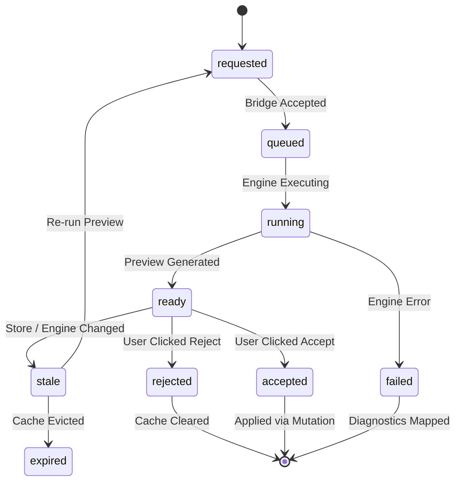
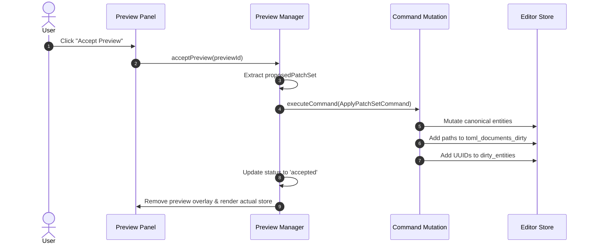

# Спецификация пайплайна генерации, кэширования и принятия предпросмотра (Engine Preview Pipeline Spec)

> Этот документ формально определяет архитектурный контракт генерации, кэширования, рендеринга и принятия временных предпросмотров (Engine-backed Previews) на стороне 3D-редактора AxiCAD. Спецификация фиксирует статус предпросмотра как производных данных, регламентирует жизненный цикл предложений движка, механизм передачи данных в подсистему рендеринга и строгое правило применения изменений через командные мутации.

## Status: Draft

---

## 1. Назначение документа (Scope & Non-goals)

Данная спецификация устанавливает правила оркестрации временных вычислений AxiEngine, предназначенных для визуализации гипотетических состояний модели в UI редактора.

### Назначение (Scope)
- **Оркестрация задач предпросмотра (Preview Jobs Orchestration)**: Запуск фоновых операций генерации геометрии, раскладки и трассировки через вызов моста.
- **Управление кэшем предпросмотра (Preview Cache Management)**: Жизненный цикл сессионного кэша результатов и геометрии.
- **Семантика устаревания (Stale Semantics)**: Отслеживание синхронизации предпросмотров с ревизиями хранилища и параметрами вычислений.
- **Передача в рендеринг (Rendering Handoff)**: Безопасная передача временных буферов и оверлеев в визуальный слой Rendering Pipeline.
- **Диагностики предпросмотра (Preview Diagnostics)**: Перехват и привязка предупреждений и ошибок генерации.
- **Процедура принятия (PatchSet Acceptance Process)**: Преобразование предложенных результатов в канонические команды редактирования.

### Вне зоны ответственности (Non-goals)
- Документ **не описывает** артефакты финальной компиляции запекания (Baker compile artifacts `.axic`).
- Документ **не содержит** детального описания математики полных симуляций роста (Growth) или нейросетевого инференса (Inference).
- Документ **не проектирует** внутреннюю структуру Rust-крейтов или алгоритмы автоупаковки движка.

---

## 2. Главный принцип (Main Principle)

Статус любых визуальных предпросмотров и предложений движка строго подчиняется фундаментальному правилу:

> **Preview is derived. Canonical state changes only through Command Mutation.**

```
┌───────────────────────────────────────────────────────────────────────────────┐
│                               AxiEngine Core                                  │
│           (Computes layout, routes, somas, and preview overlays)              │
└──────────────────────────────────────┬────────────────────────────────────────┘
                                       │ EngineJobEvent ('preview-frame' / 'patchset-proposed')
                                       ▼
┌───────────────────────────────────────────────────────────────────────────────┐
│                          AxiCAD Preview Manager                               │
│              (Stores in PreviewCacheEntry, checks StaleState)                 │
└──────────────────┬────────────────────────────────────────┬───────────────────┘
                   │ Render Handoff (Read-Only)             │ User Acceptance
                   ▼                                        ▼
┌──────────────────────────────────────┐  ┌─────────────────────────────────────┐
│          Rendering Pipeline          │  │  Command Mutation (CommandHistory)  │
│     (Visualizes generated overlays)  │  ├─────────────────────────────────────┤
│  Hover/Select via stable runtime IDs │  │  Mutates Store & marks TOML dirty   │
└──────────────────────────────────────┘  └─────────────────────────────────────┘
```

1. **AxiEngine генерирует**: Движок выполняет расчет геометрии и предлагает варианты решений.
2. **AxiCAD отображает и кэширует**: Редактор сохраняет полученные данные в изолированном временном кэше и передает оверлеи в визуальный слой без изменения биологического графа.
3. **Пользователь явно принимает результат**: Изменения попадают в канонические TOML-файлы только тогда, когда пользователь нажимает кнопку *"Применить"* (Accept), что инициирует выполнение командной мутации.

---

## 3. Типы операций предпросмотра (Preview Operation Types)

### Поддерживаемые операции предпросмотра:

| Тип операции | Описание | Область применения |
|---|---|---|
| `generate_layout` | Автоматический расчёт пространственного размещения и габаритов (bounds) шардов и департаментов. | Composition Workspace |
| `sample_sockets` | Дискретный расчёт и визуализационный предпросмотр контактных точек (сокетов/пинов) на гранях объемов. | Connectome Workspace |
| `route_tracts` | 3D-трассировка и генерация воксельных каналов для пучков трактов связей. | Connectome Workspace |
| `preview_somas` | Правило-ориентированная генерация массива позиций сом и их типов внутри объема шарда. | Shard Neuron Editor |
| `validate_preview` | Визуализация результатов гипотетической валидации (оверлеи пересечений, подсвечивание ошибок). | Все предметные режимы |
| `preview_growth_step` | Пошаговый предпросмотр векторных фронтов роста и синаптогенеза. | Growth Workspace |

### Зарезервированные операции (Reserved / Future Operations):
Тип `preview_inference_frame` (кадр активности потенциалов нейронов) зарезервирован и недоступен до принятия спецификации Inference Runtime.

---

## 4. Жизненный цикл предпросмотра (Preview Lifecycle)

Каждый объект предпросмотра проходит через строго определенный конечный автомат состояний:



### Связывание контекста (Context Binding):
Каждый элемент кэша предпросмотра жестко привязывается к следующему контексту:
- `jobId` & `sessionId`: Идентификаторы задачи и сессии моста, сгенерировавших данные.
- `snapshotId`: Идентификатор снимка состояния, на основе которого производился расчёт.
- `storeRevision`: Ревизия хранилища Store на момент запуска вычислений.
- `schemaVersion` & `protocolVersion`: Версии TOML-схемы и межпроцессного протокола.
- `engineBuildHash`: Хэш конкретной сборки вычислительного ядра AxiEngine.
- `operationParamsHash`: Хэш входных параметров операции для точного сопоставления.
- `sourceEntityIds`: Список Entity UUID сущностей редактора, задействованных в операции.

---

## 5. Модель данных и DTO (Core DTOs)

Для управления предпросмотрами в AxiCAD определены следующие TypeScript-интерфейсы:

```typescript
export type PreviewOperationType = 
  | 'generate_layout'
  | 'sample_sockets'
  | 'route_tracts'
  | 'preview_somas'
  | 'validate_preview'
  | 'preview_growth_step';

export type ReservedPreviewOperationType =
  | 'preview_inference_frame';

export type PreviewStatus = 
  | 'requested'
  | 'queued'
  | 'running'
  | 'ready'
  | 'stale'
  | 'accepted'
  | 'rejected'
  | 'expired'
  | 'failed';

export interface EnginePreviewRequest {
  previewId: string;
  jobId: string;
  sessionId: string;
  operationType: PreviewOperationType;
  snapshotId: string;
  storeRevision: number;
  schemaVersion: string;
  protocolVersion: string;
  sourceEntityIds: string[];
  parameters: Record<string, unknown>;
  operationParamsHash: string;
}

export type PreviewArtifactKind = 'geometry-buffer' | 'overlay-mesh' | 'patchset-json';

export interface PreviewArtifactRef {
  artifactId: string;
  kind: PreviewArtifactKind;
  mimeKind?: string;
  bufferRef?: string;
  tempPath?: string;
  relativePath?: string;
  byteLength: number;
  checksumSha256: string;
  payloadJson?: Record<string, unknown>;
}

export interface EnginePreviewResult {
  previewId: string;
  jobId: string;
  sessionId: string;
  operationType: PreviewOperationType;
  snapshotId: string;
  engineBuildHash: string;
  executionDurationMs: number;
  artifacts: PreviewArtifactRef[];
  proposedPatchSet?: Record<string, unknown>;
  diagnostics: DiagnosticItem[];
}

export interface PreviewStaleState {
  isStale: boolean;
  reason?: 
    | 'store-revision-changed'
    | 'entity-modified'
    | 'schema-protocol-mismatch'
    | 'engine-build-changed'
    | 'parameters-changed';
}

export interface PreviewCacheEntry {
  previewId: string;
  jobId: string;
  sessionId: string;
  operationType: PreviewOperationType;
  status: PreviewStatus;
  createdAt: number;
  snapshotId: string;
  storeRevision: number;
  schemaVersion: string;
  protocolVersion: string;
  engineBuildHash: string;
  operationParamsHash: string;
  sourceEntityIds: string[];
  result?: EnginePreviewResult;
  staleState: PreviewStaleState;
}

export interface PreviewAcceptanceRequest {
  previewId: string;
  acceptedEntityIds?: string[];
  mutationOptions?: Record<string, unknown>;
}
```

---

## 6. Владение и хранение кэша (Cache Ownership)

Архитектурное разграничение кэшируемых данных строится на следующих принципах:

- **Локализация в сессии (Session Cache Ownership)**: Кэш предпросмотра (`PreviewCacheEntry`) живет исключительно в оперативной памяти реактивного хранилища Store или сессионного кэша редактора.
- **Легковесные метаданные в Project JSON**: Файл проекта `axicad.project.json` **не хранит** тяжелые геометрии предпросмотров. В нем могут сохраняться только опциональные (opt-in) метаданные: видимость слоев предпросмотра и пользовательские настройки отображения оверлеев.
- **Изоляция канонических TOML**: Генерация любых оверлеев или временных предложений **никогда не изменяет** файлы `model.toml`, `department.toml` или `shard.toml`.
- **Временные геом-буферы не являются источником истины**: Сгенерированные воксельные сетки, вершины трактов и массивы вершин предпросмотра сом являются временными визуальными буферами. При их удалении или очистке кэша биологическая модель остаётся целостной.

---

## 7. Семантика устаревания (Stale Semantics)

Предпросмотр переходит в состояние `stale` (устаревший) при наступлении любого из следующих триггеров:

1. **Изменение `storeRevision`**: Любое изменение в Store, увеличивающее глобальный ревизион редактора.
2. **Мутация исходных сущностей (`sourceEntityIds`)**: Изменение одной из сущностей, на основе которой вычислялся предпросмотр (например, перемещение шарда делает устаревшим предпросмотр его сокетов).
3. **Смена версий схемы или протокола**: Изменение `schemaVersion` или `protocolVersion`.
4. **Обновление движка**: Изменение `engineBuildHash` при пересборке AxiEngine.
5. **Изменение параметров вычисления**: Смена параметров пользователем в панелях настроек инструмента.

При переходе в состояние `stale` UI подсвечивает оверлей полупрозрачным стилем или иконкой предупреждения, сигнализируя о необходимости перерасчета.

---

## 8. Принятие и отклонение результатов (Acceptance & Rejection)

Преобразование временных данных в каноническую модель происходит по строгому протоколу:



1. **Генерация PatchSet**: Нажатие кнопки *"Принять"* (Accept) извлекает сгенерированный движком `proposedPatchSet`.
2. **Ограничения на принятие (Accept Restrictions)**: Категорически запрещено выполнять принятие предпросмотра при соблюдении любого из условий:
   - Предпросмотр находится в состоянии `stale` (устарел).
   - Предпросмотр находится в состояниях `failed`, `expired` или `rejected`.
   - В результате предпросмотра отсутствует объект `proposedPatchSet` (нет изменений биологической модели).
   - В отчете предпросмотра содержатся ошибки уровня `'error'` либо диагностики, у которых поле `blockingOperations` включает `'apply-patchset'`.
3. **Исключительно визуальные предпросмотры (Visual-only Preview Rule)**: Операции типа `validate_preview` и оверлеи диагностик являются pure visual overlays. Они вообще не поддерживают режим принятия (`Accept`), так как не предлагают мутаций доменной модели.
4. **Исполнение через Command Mutation**: Одобренный патч применяется строго через командный слой (`Command Mutation`). Это обеспечивает полную поддержку операций **Undo/Redo**.
5. **Обновление Dirty-списков**: Только после успешного выполнения команды затронутые TOML-пути добавляются в `toml_documents_dirty`, а UUID сущностей — в `dirty_entities`.
6. **Отклонение (Rejection/Expiration)**: При клике на *"Отклонить"* (Reject) или по истечении срока жизни кэша объект `PreviewCacheEntry` удаляется из памяти, а оверлей сбрасывается из сцены без каких-либо изменений в биологической модели.

---

## 9. Передача в подсистему рендеринга (Rendering Handoff)

Интеграция с подсистемой визуализации `Rendering Pipeline` подчиняется следующим инвариантам:

- **Передача через спец-слои (Generated Preview Layers)**: Геометрические буферы предпросмотра передаются в рендер как изолированные визуальные слои (`generatedPreviewLayer` или `diagnosticOverlay`).
- **Запрет мутации со стороны рендера**: Подсистема рендеринга рассматривает полученные буферы исключительно в режиме Read-Only и не имеет права модифицировать их содержимое.
- **Стабильные Runtime ID для интерактивности**: Элементы предпросмотра (предложенные сокеты, трассы) снабжаются временными стабильными идентификаторами для обеспечения подсветки при наведении (hover) и выделении (selection). Однако эти временные runtime-идентификаторы **никогда не сериализуются** в канонические TOML-файлы.

---

## 10. Диагностики предпросмотра (Diagnostics Integration)

Диагностики, полученные в процессе генерации предпросмотра, транслируются в единую подсистему ошибок:

- **Градация Severity**: Диагностики предпросмотра соответствуют каноническому контракту и имеют уровни `'info'`, `'warning'` или `'error'`.
- **Автономия файла проекта**: Наличие ошибок предпросмотра уровня `'error'` **не блокирует** сохранение файла проекта `axicad.project.json`.
- **Блокировка акцепта (Acceptance Lock)**: Наличие критических диагностик уровня `'error'` или диагностик, у которых поле `blockingOperations` включает `'apply-patchset'`, **строго блокирует** возможность выполнения процедуры принятия до устранения конфликтов.

---

## 11. Взаимодействие с предметными режимами (Interaction with Workspaces)

Предметные процессы редактора используют подсистему предпросмотра для решения специфических задач:

| Предметный режим | Исполняемые операции предпросмотра | Визуальные оверлеи и поведение |
|---|---|---|
| **Composition Workspace** | `generate_layout`, `validate_preview` | Отображение предложенных габаритных рамок (bounds) шардов и департаментов с возможностью автоупаковки. |
| **Connectome Workspace** | `sample_sockets`, `route_tracts` | Визуализация контактных точек на гранях и 3D-трасс каналов трактов до их фиксации в проект. |
| **Shard Neuron Editor** | `preview_somas` | Отображение правил размещения сом и их воксельных сеток плотности внутри объема шарда. |
| **Future Growth Workspace** | `preview_growth_step` | Пошаговая визуализация ростка аксонов и образованных синапсов. |
| **Future Inference Runtime** | `preview_inference_frame` | Отображение волн электрической активности на осциллографе и оверлеях 3D-сцены. |

---

## 12. Интеграция с существующими спецификациями (References)

Данная спецификация опирается на следующие канонические документы экосистемы AxiCAD:

- [axiengine-bridge-session-spec-ru](axiengine-bridge-session-spec-ru.md) — Спецификация моста интеграции и менеджера сессий AxiEngine.
- [rust-core-axiengine-source-of-truth-spec-ru](rust-core-axiengine-source-of-truth-spec-ru.md) — Спецификация канонического вычислительного ядра AxiEngine.
- [editor-store-spec-ru](editor-store-spec-ru.md) — Спецификация реактивного хранилища и модели состояния редактора.
- [command-mutation-spec-ru](command-mutation-spec-ru.md) — Спецификация командной модели изменения состояния и Undo/Redo.
- [rendering-pipeline-spec-ru](rendering-pipeline-spec-ru.md) — Спецификация визуального слоя рендеринга (Rendering Pipeline).
- [diagnostics-error-catalog-spec-ru](diagnostics-error-catalog-spec-ru.md) — Каталог диагностик и спецификация ошибок.
- [project-file-spec-ru](project-file-spec-ru.md) — Спецификация файла проекта `axicad.project.json`.
- [constraint-engine-spec-ru](constraint-engine-spec-ru.md) — Спецификация ядра проверки ограничений (Constraint Engine).
- [geometry-spatial-service-spec-ru](geometry-spatial-service-spec-ru.md) — Спецификация геометрического и пространственного сервиса.
- [socket-tract-geometry-spec-ru](socket-tract-geometry-spec-ru.md) — Спецификация геометрической модели сокетов, пинов и трактов.

---

## 13. История изменений (Changelog)

| Дата | Версия | Описание изменений |
|---|---|---|
| 2026-06-27 | 0.1.0 | Первоначальное создание спецификации пайплайна предпросмотра Engine Preview Pipeline Spec. Определены 6 поддерживаемых и 1 зарезервированный тип операций, жизненный цикл и FSM предпросмотра, DTO интерфейсы, семантика устаревания, передача в рендер и процедура принятия изменений через Command Mutation. |
