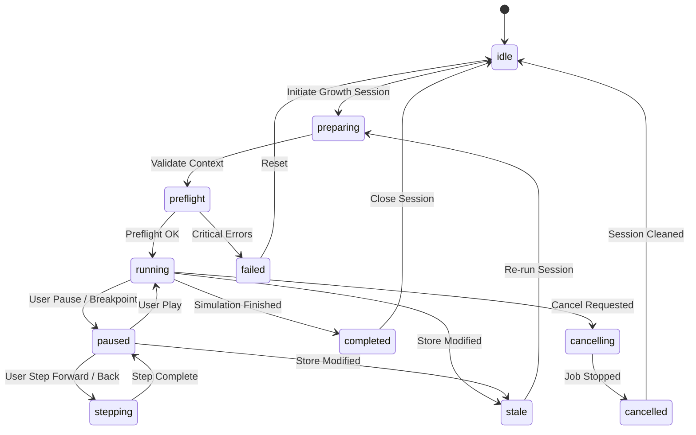
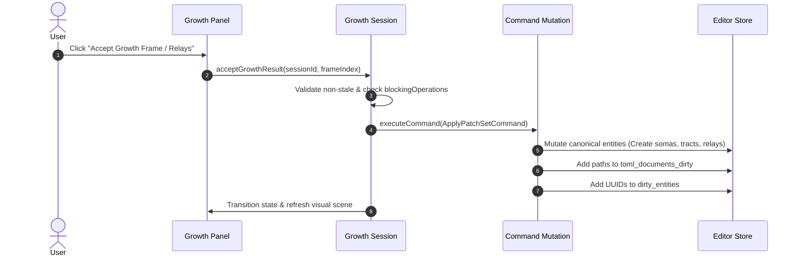

# Спецификация предметного режима симуляции и отладки роста сети Growth Workspace (Growth Workspace Spec)

> Этот документ формально определяет архитектурный контракт предметного режима отладки и симуляции роста сети (Growth Workspace) на стороне 3D-редактора AxiCAD. Спецификация регламентирует визуализацию и интерактивное управление процессами морфогенеза, аксонального и дендритного роста, синаптогенеза, автоматического предпросмотра реле-нейронов белого вещества (White Matter Relay), а также правила воспроизведения фреймов роста и принятия предложенных структур.

## Status: Draft

---

## 1. Назначение документа (Scope & Non-goals)

Данная спецификация устанавливает распределение зон ответственности при визуальной отладке и симуляции процессов биологического роста нейронной сети в AxiCAD.

### Назначение (Scope)
- **Оркестрация сессий роста (Growth Session Orchestration)**: Запуск, пауза, пошаговое исполнение и отмена процессов симуляции роста через мост AxiEngine Bridge.
- **Управление временем и плеером (Time Controls & Replay)**: Воспроизведение, шаг вперед/назад, регулировка скорости и детерминированное воспроизведение фреймов роста.
- **Визуализация процессов (Rendering Layers Integration)**: Отображение анимированных спайков, растущих сегментов аксонов и реле-структур в специализированных слоях рендеринга.
- **Диагностика и инварианты роста (Growth Diagnostics)**: Отслеживание ошибок трассировки, заторов сокетов и биологических ограничений.
- **Принятие результатов (PatchSet Acceptance Model)**: Преобразование предложенных математикой движка сегментов роста и реле в канонические команды редактора.
- **Управление семантикой устаревания (Stale Semantics)**: Синхронизация состояний симуляции с текущим ревизионом хранилища Store.

### Вне зоны ответственности (Non-goals)
- Документ **не описывает** внутреннюю математику и алгоритмы морфогенеза или синаптогенеза, исполняемые ядрами Rust в AxiEngine.
- Документ **не является** спецификацией нейросетевого инференса в реальном времени (Inference Runtime).
- Документ **не дублирует** правила запекания сети Baker Compile Pipeline.
- Документ **не делает** режим Growth Workspace прямым источником канонических TOML-файлов в обход системы командных мутаций.

---

## 2. Главный принцип (Main Principle)

Архитектурный контракт предметного режима роста строго подчиняется следующей фундаментальной формуле:

> **Growth Workspace debugs network-scale growth. Growth output is derived until accepted through Command Mutation. AxiEngine grows. AxiCAD observes, controls, visualizes, and records.**

```
┌───────────────────────────────────────────────────────────────────────────────┐
│                           AxiEngine Compute Core                              │
│         (Calculates morphogenesis, axon growth, and synaptogenesis)           │
└──────────────────────────────────────┬────────────────────────────────────────┘
                                       │ Stream GrowthFrames / GrowthEvents
                                       ▼
┌───────────────────────────────────────────────────────────────────────────────┐
│                    AxiCAD Growth Workspace Session Manager                    │
│            (Manages Timeline, Replay Controller & Stale Verification)         │
└──────────────────┬────────────────────────────────────────┬───────────────────┘
                   │ Render Handoff (Read-Only)             │ User Acceptance
                   ▼                                        ▼
┌──────────────────────────────────────┐  ┌─────────────────────────────────────┐
│          Rendering Pipeline          │  │  Command Mutation (CommandHistory)  │
│ runtimeLayer: Animated Growth Fronts │  ├─────────────────────────────────────┤
│ generatedPreviewLayer: Relay Traces  │  │  Mutates Store & marks TOML dirty   │
└──────────────────────────────────────┘  └─────────────────────────────────────┘
```

1. **AxiEngine растет**: Вычислительное ядро производит канонический расчёт векторных траекторий роста, ветвления и образования синапсов.
2. **AxiCAD наблюдает, управляет и записывает**: Редактор визуализирует текущее состояние, предоставляет органы управления временной шкалой и фиксирует историю фреймов.
3. **Результат является производным до момента принятия**: Сгенерированные сегменты роста являются временным предпросмотром и попадают в канонические TOML-документы только после явного одобрения пользователем через командную мутацию.

---

## 3. Основные сущности (Core Entities DTOs)

Для управления сессиями и визуализацией роста в AxiCAD определены следующие TypeScript-интерфейсы:

```typescript
export type GrowthScopeType = 'whole-model' | 'department' | 'shard' | 'tract-group';

export interface GrowthContext {
  snapshotId: string;
  storeRevision: number;
  schemaVersion: string;
  protocolVersion: string;
  engineBuildHash: string;
  scopeType: GrowthScopeType;
  targetEntityIds: string[];
  randomSeed: number;
  deterministicReplayId?: string;
  growthLimits: Record<string, number>;
}

export type GrowthSessionState = 
  | 'idle'
  | 'preparing'
  | 'preflight'
  | 'running'
  | 'paused'
  | 'stepping'
  | 'completed'
  | 'failed'
  | 'cancelling'
  | 'cancelled'
  | 'stale';

export interface GrowthTrace {
  traceId: string;
  sourceSocketId: string;
  targetSocketId?: string;
  currentLengthVoxel: number;
  maxLengthVoxel: number;
  pathSegments: Array<{ x: number; y: number; z: number }>;
  isCompleted: boolean;
}

export interface GrowthProbe {
  probeId: string;
  entityId: string;
  metricName: string;
  currentValue: number;
  history: number[];
}

export interface WhiteMatterRelayPreview {
  relayId: string;
  sourceTractId: string;
  suggestedPosition: { x: number; y: number; z: number };
  relayType: string;
  reason: 'length-exceeded' | 'obstacle-bypass' | 'signal-boost';
  proposedPatchSet?: Record<string, unknown>;
}

export interface GrowthConstraintStatus {
  constraintId: string;
  severity: 'error' | 'warning' | 'info';
  status: 'satisfied' | 'violated' | 'pending';
  blockingOperations: string[];
  targetEntityIds: string[];
  message: string;
}

export interface GrowthFrame {
  frameIndex: number;
  simulationTick: number;
  timestamp: number;
  activeTraces: GrowthTrace[];
  relays: WhiteMatterRelayPreview[];
  probes: GrowthProbe[];
  constraintStatuses: GrowthConstraintStatus[];
  diagnostics: DiagnosticItem[];
  proposedPatchSet?: Record<string, unknown>;
}

export interface GrowthEvent {
  eventId: string;
  tick: number;
  eventType: 'synapse-formed' | 'relay-proposed' | 'growth-blocked' | 'limit-reached';
  description: string;
  targetEntityId?: string;
}

export interface GrowthSession {
  sessionId: string;
  projectId: string;
  state: GrowthSessionState;
  context: GrowthContext;
  currentFrameIndex: number;
  totalRecordedFrames: number;
  isPlaying: boolean;
  playbackSpeed: number;
  recordedFrames: GrowthFrame[];
  activeDiagnostics: DiagnosticItem[];
}

export interface GrowthAcceptanceRequest {
  sessionId: string;
  frameIndex: number;
  acceptedRelayIds?: string[];
  acceptedTraceIds?: string[];
}
```

---

## 4. Жизненный цикл сессии роста (Session Lifecycle)

Сессия работы предметного режима подчиняется строгому конечному автомату (FSM):



### Связь с подсистемой задач (Integration with Engine Bridge):
Тяжелые этапы сетевого роста выполняются вычислительным ядром AxiEngine в виде фоновых задач `EngineJob`. С момента принятия данной спецификации операция `preview_growth_step` переходит из статуса зарезервированных в статус **supported** для предметного режима Growth Workspace при пошаговой отладке роста. *(TODO: обновить список поддерживаемых операций в engine-preview-pipeline-spec-ru.md)*.

---

## 5. Входной контекст (Input Context)

Запуск сессии симуляции роста разрешен только на основе строго валидированного контекста `GrowthContext`:
- **Иммутабельный снимок графа (`snapshotId`)**: Полный срез реактивного состояния модели.
- **Скомпилированная и предрассчитанная геометрия**: Актуальные данные сокетов, пинов и каналов трактов.
- **Биологические параметры типов нейронов**: Пороги восприимчивости, скорости удлинения и радиусы синаптогенеза.
- **Лимиты и ограничения роста**: Ограничения по длине аксонов, максимальному числу ветвлений и плотности сом.
- **Область вычислений (Selected Scope)**: Возможность запуска как на всей модели в целом, так и локально для отдельного департамента, шарда или группы трактов.
- **Детерминированный Replay ID**: Передача фиксированного `random Seed` гарантирует 100% воспроизводимость результатов симуляции.

---

## 6. Управление временем и плеером (Time Controls & Replay Controller)

Режим Growth Workspace предоставляет развитый контракт управления временной шкалой симуляции:

- **Воспроизведение и пауза (`Play / Pause`)**: Запуск непрерывного расчета/воспроизведения фреймов роста и остановка на текущем тике.
- **Шаговая навигация (`Step Forward / Step Back`)**: Переход на один тик вперед или возврат к ранее записанным кадрам из буфера сессии.
- **Множитель скорости (`Speed Multiplier`)**: Регулировка скорости воспроизведения (от `0.25x` до `8.0x`).
- **Скраббинг шкалы времени (`Timeline Scrubbing`)**: Мгновенный переход на любой записанный кадр симуляции по индексу фрейма.
- **Режим детерминированного повтора (`Deterministic Replay Mode`)**: Точное построение траекторий при совпадении хэшей сборки движка и исходных зерен (seeds).

---

## 7. Интеграция со слоями рендеринга (Rendering Layers Integration)

Отображение процессов роста распределяется по специализированным слоям подсистемы визуализации `Rendering Pipeline`:

| Слой рендеринга | Отображаемый контент и поведение | Режим доступа |
|---|---|---|
| **`runtimeLayer`** | Динамическая анимация векторных фронтов роста, растущих аксональных конусов и частиц морфогенеза. | Read-Only (Animated) |
| **`generatedPreviewLayer`** | Визуализация предрассчитанных векторных трасс, стационарных каналов и оверлеев предложенных реле-нейронов. | Read-Only (Overlays) |
| **`diagnosticOverlay`** | Цветовое подсвечивание проблемных зон (непроходимые объемы, заторы сокетов, превышение лимитов длины). | Read-Only (Warnings) |
| **`hudLayer`** | Вывод значений измерительных зондов (`GrowthProbe`), текстовых меток нейронов и текущего индекса тика. | Read-Only (2D HUD) |

*Инвариант*: Подсистема рендеринга является strictly Read-Only и ни при каких условиях не модифицирует данные реактивного хранилища Store.

---

## 8. Концепция реле белого вещества (White Matter Relay Preview)

При симуляции сетевого роста аксоны могут пересекать значительные расстояния между отдельными департаментами через зоны белого вещества (White Matter):

- **Триггер генерации**: Если рассчитываемый путь аксона превышает биологический лимит длины либо встречает непреодолимое пространственное ограничение, AxiEngine автоматически формирует предложение о создании промежуточного реле-нейрона или реле-сегмента (`WhiteMatterRelayPreview`).
- **Статус предпросмотра**: Предложенное реле подсвечивается в `generatedPreviewLayer` специальным маркером и **не становится каноническим объектом** модели до момента акцепта.
- **Автономия биологических правил**: Все правила и пороги необходимости реле задаются каноническими спецификациями и вычисляются движком; UI редактора отвечает только за отображение и акцепт.

---

## 9. Диагностики подсистемы роста (Growth Diagnostics)

Любые отклонения и нарушения инвариантов в процессе роста транслируются через канонические объекты `DiagnosticItem`:

### Типовые коды ошибок роста:
- `AXI-GROWTH-001` (`growth path exceeded`): Превышен максимально допустимый лимит длины аксонального пути.
- `AXI-GROWTH-002` (`no valid channel`): Отсутствует свободный физический канал или тракт для прокладки связи.
- `AXI-GROWTH-003` (`socket congestion`): Коллизия или переполнение контактных точек на границе сокета.
- `AXI-GROWTH-004` (`incompatible neuron type`): Несовместимость биологических типов связываемых нейронов.
- `AXI-GROWTH-005` (`stale tract geometry`): Попытка симуляции роста поверх устаревшей геометрии трактов.
- `AXI-GROWTH-006` (`relay required`): Требуется обязательная вставка реле-нейрона белого вещества.
- `AXI-GROWTH-007` (`deterministic replay mismatch`): Несовпадение контрольных сумм при детерминированном повторе.

### Градация Severity и блокировки:
Диагностики используют нижний регистр уровней (`'error'`, `'warning'`, `'info'`). При наличии ошибок уровня `'error'` или диагностик, у которых массив `blockingOperations` содержит `'run-simulation'` или `'apply-patchset'`, соответствующее действие строго блокируется UI редактора.

---

## 10. Семантика устаревания (Stale Semantics)

Активная сессия или записанные фреймы роста переходят в состояние `stale` (устаревшие) при наступлении любого из следующих событий:

1. **Изменение `storeRevision`**: Любая командная мутация биологического графа в Store.
2. **Изменение исходных сущностей**: Редактирование геометрии шардов, сокетов или трактов, задействованных в симуляции.
3. **Смена геометрии сокетов и трактов (`socket/tract geometry revision`)**: Обновление каналов или контактных точек.
4. **Смена параметров нейронов (`neuron parameter revision`)**: Изменение биологических настроек, скоростей или порогов видов нейронов.
5. **Смена контекста Baker и скомпилированных артефактов (`compiled artifact / Baker context`)**: Пересборка байт-кода запекания.
6. **Смена контекста предпросмотра (`preview context`)**: Обновление результатов предварительных вычислений.
7. **Смена версий схемы или протокола**: Изменение `schemaVersion` или `protocolVersion`.
8. **Обновление бинарника движка**: Изменение `engineBuildHash`.
9. **Изменение зерен генерации**: Смена `randomSeed` или опций вычисления пользователем.

При переходе сессии в состояние `stale` кнопка применения изменений блокируется, а оверлеи подсвечиваются полупрозрачным индикатором устаревания.

---

## 11. Модель принятия результатов (Acceptance Model)

Сгенерированные в процессе симуляции структуры роста и реле-нейроны переходят в каноническую модель по строгому протоколу:



- **Условия акцепта**: Принятие результатов разрешено **только** для актуальных (`non-stale`) фреймов при наличии объекта `GrowthFrame.proposedPatchSet` и отсутствии блокирующих диагностик.
- **Исполнение через Command Mutation**: Применение изменений осуществляется строго через командный слой с полной поддержкой Undo/Redo.
- **Обновление Dirty-списков**: После выполнения команды затронутые TOML-пути добавляются в `toml_documents_dirty`, а UUID созданных или измененных сущностей — в `dirty_entities`.

---

## 12. Взаимодействие с предметными режимами (Interaction with Workspaces)

Режим Growth Workspace является связующим звеном для многих подсистем экосистемы AxiCAD:

| Подсистема / Модуль | Характер взаимодействия и передаваемые данные |
|---|---|
| **Composition Workspace** | Поставляет пространственные габариты (bounds) и границы объемов для ограничения области роста. |
| **Connectome Workspace** | Предоставляет геометрические каналы трактов и контактные сокеты для прокладки связей. |
| **Shard Neuron Editor** | Передает параметры типов нейронов, правила ветвления и стартовые позиции сом. |
| **Baker Compile Pipeline** | Поставляет скомпилированные контексты и сжатые бинарные артефакты для точных вычислений. |
| **Engine Preview Pipeline** | Предоставляет инфраструктуру управления кэшем предпросмотра и правила акцепта. |
| **Rendering Pipeline** | Визуализирует живые частицы и анимированные векторные трассы роста в 3D-сцене. |
| **AxiEngine Bridge** | Осуществляет фоновое исполнение тяжелонагруженных задач симуляции и стриминг событий. |

---

## 13. Ссылки на контекстные документы (References)

Данная спецификация опирается на следующие канонические документы экосистемы AxiCAD:

- [rust-core-axiengine-source-of-truth-spec-ru](rust-core-axiengine-source-of-truth-spec-ru.md) — Спецификация вычислительного ядра AxiEngine.
- [axiengine-bridge-session-spec-ru](axiengine-bridge-session-spec-ru.md) — Спецификация моста интеграции и менеджера сессий.
- [engine-preview-pipeline-spec-ru](engine-preview-pipeline-spec-ru.md) — Спецификация пайплайна предпросмотра.
- [baker-compile-pipeline-spec-ru](baker-compile-pipeline-spec-ru.md) — Спецификация пайплайна компиляции Baker.
- [composition-workspace-spec-ru](composition-workspace-spec-ru.md) — Спецификация режима сборки Composition Workspace.
- [connectome-workspace-spec-ru](connectome-workspace-spec-ru.md) — Спецификация режима связей Connectome Workspace.
- [shard-neuron-editor-workspace-spec-ru](shard-neuron-editor-workspace-spec-ru.md) — Спецификация редактора биологии шарда Shard Neuron Editor.
- [socket-tract-geometry-spec-ru](socket-tract-geometry-spec-ru.md) — Спецификация геометрии сокетов и трактов.
- [geometry-spatial-service-spec-ru](geometry-spatial-service-spec-ru.md) — Спецификация геометрического сервиса.
- [constraint-engine-spec-ru](constraint-engine-spec-ru.md) — Спецификация ядра проверки ограничений.
- [editor-store-spec-ru](editor-store-spec-ru.md) — Спецификация реактивного хранилища Store.
- [command-mutation-spec-ru](command-mutation-spec-ru.md) — Спецификация командной модели изменения состояния.
- [rendering-pipeline-spec-ru](rendering-pipeline-spec-ru.md) — Спецификация визуального слоя рендеринга.
- [diagnostics-error-catalog-spec-ru](diagnostics-error-catalog-spec-ru.md) — Каталог диагностик и ошибок.
- [project-file-spec-ru](project-file-spec-ru.md) — Спецификация файла проекта `axicad.project.json`.

---

## 14. История изменений (Changelog)

| Дата | Версия | Описание изменений |
|---|---|---|
| 2026-06-27 | 0.1.0 | Первоначальное создание спецификации предметного режима Growth Workspace Spec. Определены DTO сущности, конечный автомат сессии, контроллер времени, концепт реле белого вещества, диагностики роста и модель принятия изменений через Command Mutation. |
