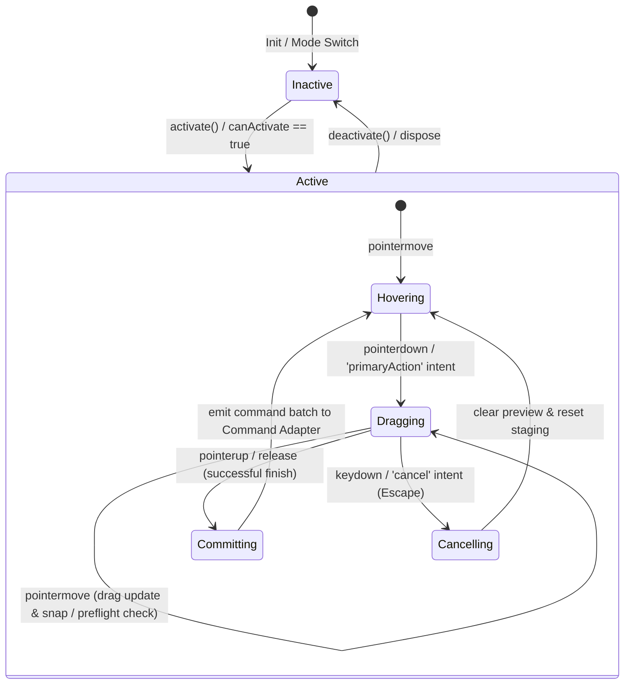

# Спецификация интерактивных инструментов AxiCAD (Tool System Spec)

> Этот документ формально описывает архитектуру, интерфейсы и жизненный цикл интерактивных инструментов (Tool System) в 3D-редакторе AxiCAD. Tool System управляет поведением указателя (курсора), логикой перетаскивания и манипуляций (drag-and-drop), расчетом привязок (snapping), предпросмотром изменений (staging/preview) и формированием структурированных команд / command batches для изменения состояния.

## Status: Draft

---

## 1. Назначение и границы (Scope & Non-goals)

`Tool System` отвечает за реакцию редактора на действия пользователя во вьюпорте и трансляцию сырых жестов в структурированные команды.

### Вне зоны ответственности (Non-goals)
- **Не является Selection Engine**: Tool System не отслеживает hover и не формирует списки выделенных сущностей. Инструменты получают уже готовый `SelectionContext` от [Selection Engine](selection-engine-spec-ru.md).
- **Не выполняет геометрические расчеты самостоятельно**: Инструменты не рассчитывают пересечения лучей с объектами и не вычисляют AABB/OBB. Эти задачи делегируются [Geometry & Spatial Service](geometry-spatial-service-spec-ru.md).
- **Не рендерит 3D-сцену**: Движок инструментов не работает напрямую с WebGL/Three.js сценой. Визуализацией отпечатков (ghosts), очертаний (outlines) и ручек управления (handles) занимается [Rendering Pipeline](rendering-pipeline.md).
- **Не мутирует Store напрямую**: Инструменты не могут делать запись в Store в обход командной модели. Единственный способ изменить Store — сгенерировать команду или пакет команд (`command batches`) для их фиксации внешним контроллером.
- **Не пишет TOML/JSON файлы**: Инструменты не работают с файловой системой и экспортом.
- **Не хранит историю отмены изменений**: Логика Undo/Redo принадлежит слою команд [Command Mutation](command-mutation-spec-ru.md).
- **Не дублирует Geometry/Spatial Service**: Инструменты не содержат собственных формул триангуляции или преобразования координат.

---

## 2. Место в архитектуре (Architecture Placement)

Tool System находится на стыке адаптера ввода, пространственного сервиса, движка ограничений и командной модели. Связи между компонентами выстроены по следующей схеме:

1. **Selection Engine -> Tool System**: Поставка актуального `SelectionContext` (выделенные объекты, точки пересечения, нормали).
2. **Geometry/Spatial Service -> Tool System**: Предоставление функций привязки (snapping) и преобразования координат.
3. **Взаимодействие с Constraint Engine**: Tool System направляет запросы проверки (`preflight requests`) в Constraint Engine, а тот возвращает результаты ограничений (`ConstraintResult` / `facts`).
4. **Tool System -> Preview/Staging Layer**: Формирование эфемерного предпросмотра (outlines, ghosts).
5. **Preview/Staging Layer -> Rendering Pipeline**: Визуализация временного состояния во вьюпорте.
6. **Tool System -> Command Adapter / Command Mutation**: Передача сгенерированных команд при завершении жеста.
7. **Command Adapter / Command Mutation -> Command History -> Store**: Выполнение и фиксация команд в Store с последующим обновлением флагов `dirty`.

```
 [ Selection Engine ] ────────► [ Tool System ] ◄─────── [ Geometry/Spatial Service ]
      (SelectionContext)              │                     (Snapping / Helpers)
                                      │ (Preflight Request)
                                      ├◄───────────────► [ Constraint Engine ]
                                      │ (ConstraintResult / Facts)
                                      ▼
                        ┌────────────────────────┐
                        │ Tool Preview / Staging │
                        └─────────────┬──────────┘
                                      ▼
                         [ Rendering Pipeline ]
                                      │
                                      ▼ (Pointer Up / Commit)
                        ┌────────────────────────┐
                        │    Command Adapter /   │
                        │    Command Mutation    │
                        └─────────────┬──────────┘
                                      ▼
                             [ Command History ]
                                      │
                                      ▼ (Commit to Store)
                             [ Editor Store ]
```

---

## 3. Основные сущности и контракты (Core Entities)

```typescript
// Концептуальный интерфейс (Conceptual interface, не является прямым API реализации)

type UUID = string; // Концептуальный UUID из Store
type TypedEntityPath = string; // Типизированный путь к сущности

export type ToolId = string; // e.g. "tool.composition.move-shard", "tool.connectome.route-tract"

/** Абстрактные пользовательские действия */
export type AbstractInputIntent =
  | 'primaryAction'   // Основное действие (клик, начало драга)
  | 'secondaryAction' // Альтернативное действие (контекстное меню, спец-жест)
  | 'constrainAxis'   // Ограничение перемещения по осям (axis lock)
  | 'snapOverride'    // Временное отключение привязки (snapping bypass)
  | 'precisionMode'   // Режим точного позиционирования (замедление мыши)
  | 'cancel'          // Отмена текущей операции (Escape)
  | 'confirm'         // Подтверждение операции (Enter)
  | 'additive'        // Добавление в мультиселект (считывается из Selection Context)
  | 'toggle'          // Инвертирование в мультиселекте (считывается из Selection Context)
  | 'cycle'           // Циклический перебор (считывается из Selection Context)
  | 'pickParent'      // Выбор родителя (считывается из Selection Context)
  | 'passThrough';    // Проход сквозь прозрачные стенки (считывается из Selection Context)

/** Возможные причины недоступности инструмента */
export type ToolDisabledReason =
  | 'no-selection'
  | 'wrong-workspace'
  | 'locked-target'
  | 'invalid-target'
  | 'missing-required-hit'
  | 'constraint-blocked';

/** Событие ввода, передаваемое инструменту */
export interface ToolEvent {
  readonly type: 'pointerdown' | 'pointermove' | 'pointerup' | 'keydown' | 'keyup';
  readonly pointWorld: [number, number, number]; // Физические координаты в мире µm
  readonly intents: Set<AbstractInputIntent>;
  
  /**
   * Non-canonical, diagnostic-only метаданные. Запрещается использовать для логики принятия решений внутри инструментов.
   * Не участвует в формировании детерминированного ToolResult.
   */
  readonly debugMeta?: Record<string, unknown>;
}

/** Состояние сессии перетаскивания (Drag Session) */
export interface DragSession {
  readonly startPointWorld: [number, number, number];
  readonly currentPointWorld: [number, number, number];
  readonly deltaWorld: [number, number, number];
  readonly stagingData: Map<string, any>; // Временный кэш параметров
}

/** Запрос к Geometry Service на расчет привязки */
export interface SnapRequest {
  readonly pointWorld: [number, number, number];
  readonly activeAxisLock?: 'x' | 'y' | 'z';
  readonly snapOverride: boolean;
}

/** Результат вычисления привязки (Snap) */
export interface SnapResult {
  readonly snappedPointWorld: [number, number, number]; // Итоговая физическая координата
  readonly snappedVoxel: [number, number, number]; // Итоговая координата в вокселях
  readonly isSnapped: boolean;
  readonly snapTargetKind?: 'grid' | 'face' | 'socket-sample' | 'axis';
}

/** Временные геометрические или визуальные данные предпросмотра */
export interface ToolPreview {
  readonly previewId: string;
  readonly entityPath?: TypedEntityPath;
  readonly ghostGeometryType?: 'box' | 'line' | 'plane';
  readonly transformMatrix?: number[]; // Матрица 4x4 для рендерера
  readonly visualHighlightKind?: 'valid' | 'invalid' | 'warning';
}

/** Результат обработки жеста при Pointer Up */
export interface ToolCommit {
  readonly committedCommands: any[]; // Сгенерированные команды (MoveShardCommand и т.д.)
}

/** Интент принудительной отмены, сбрасывающий всю транзитную геометрию */
export interface ToolCancel {
  readonly clearPreview: boolean;
}

/** Результат обработки события инструментом */
export interface ToolResult {
  readonly previewState?: ToolPreview[]; // Временный визуальный оверлей
  readonly commit?: ToolCommit; // Заполняется только при Pointer Up
  readonly cancel?: ToolCancel; // Заполняется при Escape / Отмене
  readonly reasonForFailure?: string;
}

/** Декларативные правила активации инструмента */
export interface ToolActivationPolicy {
  readonly allowedWorkspaceModes: string[];
  readonly requiredEntityKinds: string[]; // Типы сущностей, которые должны быть выделены
  readonly allowLockedEntities: boolean;
}

/** Текущее внутреннее состояние инструмента во время сессии */
export interface ToolState {
  readonly isDragging: boolean;
  readonly activeMode: 'grid-aligned' | 'free' | 'axis-locked';
  readonly lastValidResult?: ToolResult;
}

/** Инстанс конкретного инструмента с его внутренним стейтом */
export interface ToolInstance {
  readonly toolId: ToolId;
  readonly state: ToolState;
  readonly currentSession?: DragSession;
}

/** Контекст выполнения для инструмента */
export interface ToolContext {
  readonly selectionContext: any; // Данные от Selection Engine
  readonly storeSnapshot: any; // Снимок Store
  readonly activeWorkspaceMode: string; // Composition, Connectome и т.д.
  readonly gridSettings: {
    readonly showGrid: boolean;
    readonly snapStepUm: number;
    readonly voxelSizeUm: number;
  };
}

/** Декларативное определение инструмента */
export interface ToolDefinition {
  readonly id: ToolId;
  readonly title: string;
  readonly activationPolicy: ToolActivationPolicy;
  
  /** Проверяет, может ли инструмент быть запущен на текущем выделении */
  canActivate(context: ToolContext): { success: boolean; reason?: ToolDisabledReason };
  
  /** Инициализация инструмента при выборе */
  activate(context: ToolContext): void;
  
  /** Обработка интерактивных жестов */
  handleEvent(event: ToolEvent, instance: ToolInstance, context: ToolContext): ToolResult;
  
  /** Завершение работы инструмента */
  deactivate(context: ToolContext): void;
}

/** Описание интерактивной ручки управления (Gizmo Handle) */
export interface GizmoHandle {
  readonly handleId: string; // e.g. "gizmo-move-x"
  readonly kind: 'axis' | 'plane' | 'corner' | 'vertex';
  readonly ownerToolId: ToolId;
  readonly targetEntityPath: TypedEntityPath;
  readonly operation: 'move' | 'resize' | 'rotate';
  readonly direction?: [number, number, number]; // Вектор ограничения оси
}
```

---

## 4. Жизненный цикл инструмента (Tool Lifecycle)

Инструменты в AxiCAD имеют строгий жизненный цикл. Переходы между состояниями не вызывают немедленного изменения биологической модели в Store, сохраняя чистоту данных.



### Детали фаз жизненного цикла:
1. **activate (Активация)**: Инструмент инициализирует локальный стейт, подписывается на контекст. Метод `activate` возвращает или публикует декларативные описания ручек управления (`GizmoHandle[]`) и геометрии предпросмотра (`ToolPreview[]`), которые Rendering Pipeline визуализирует на сцене.
2. **hover/update (Наведение)**: При перемещении указателя без нажатия кнопок инструмент может обновлять эфемерный предпросмотр (например, подсвечивать грань шарда под курсором).
3. **pointer down (Нажатие)**: Инициализация сессии перетаскивания (`DragSession`). Фиксация точки старта.
4. **drag update (Перетаскивание)**:
   - Рассчитывается смещение дельты.
   - Запрашивается Geometric Snapping для корректировки точки под курсором.
   - Вычисляется временное состояние (`staging transaction`) и обновляется `ToolPreview` (outline, ghost).
   - Запускается `interactive-preview` проверка в Constraint Engine. Результат проверки (ошибки/предупреждения) может перекрасить превью в красный цвет, но не прерывает сам процесс драга.
5. **pointer up (Отпускание / Commit)**:
   - Выполняется финальная `command-preflight` или `command-apply` проверка.
   - В случае успеха staging-состояние преобразуется в пакет команд (`command batch`), который возвращается через `ToolCommit` во внешний Command Adapter.
   - Command History фиксирует и выполняет эти команды, обновляя Store, после чего Store автоматически выставляет флаги `bio_toml_dirty` или `project_json_dirty`.
6. **cancel/escape (Отмена)**:
   - Принудительный сброс Drag-сессии.
   - Полное уничтожение всех превью (`ToolPreview`) и временных данных транзакции. Состояние Store остается нетронутым.
7. **deactivate (Деактивация)**: Инструмент очищает за собой ресурсы, удаляет оверлеи и гизмо.

---

## 5. Категории инструментов (Tool Categories)

Спецификация классифицирует инструменты по функциональным задачам для MVP и будущих версий редактора:

1. **Selection & Navigation Tools**:
   - Выделение рамкой (box select), перемещение камеры (camera pan/orbit/zoom), инспектирование объектов.
2. **Transform Tools**:
   - Инструменты перемещения (`MoveTool`), изменения габаритов (`ResizeTool`) и вращения (`RotateTool` — перспектива) для шардов и департаментов.
3. **Composition Tools**:
   - Инструменты создания уровней (Levels), создания и удаления департаментов и размещения шардов в 3D-пространстве сцены.
4. **Socket Tools**:
   - Инструменты позиционирования сокетов на гранях шардов (`SocketPlaceTool`), изменения геометрических размеров площадки сокета, инспектирования и сопоставления портов (`SocketSample Inspector`).
5. **Tract Tools**:
   - Инструменты ручной прокладки кабельных трасс (`ManualRouteTool`), редактирования отдельных сегментов и узлов тракта, а также активации автоматического роутинга (`AutoRoute Preview`).
6. **Inspector/Edit Tools**:
   - Изменение свойств выделенных биологических параметров (например, редактирование пропорций типов нейронов или синаптических весов в инспекторе).
7. **Growth / Inference Debug Tools (Перспектива)**:
   - Инструменты покадровой отладки (step debug), установки датчиков потенциалов сомы (probe placement) и анализа роста связей в реальном времени.

---

## 6. Профили инструментов по рабочим пространствам (Workspace Profiles)

Доступность инструментов жестко ограничивается текущим активным режимом рабочей области (Workspace Mode), который поступает из конфигурации интерфейса:

- **Composition Profile**:
  - Активирует инструменты создания/удаления уровней и департаментов.
  - Разрешает работу инструментов трансформации (`MoveTool`, `ResizeTool`) над шардами и департаментами.
  - Запрещает любые операции с трактами и сокетами.
- **Connectome Profile**:
  - Блокирует перемещение и изменение размеров шардов.
  - Разрешает размещение сокетов на свободных гранях шардов.
  - Активирует инструменты трассировки трактов и линковки портов (`TractRoutingTool`).
- **Shard Lab Profile (Перспектива)**:
  - Фокусирует инструменты на редактировании внутреннего содержимого шарда (слои, плотности клеток).
- **Growth/Inference Profile (Перспектива)**:
  - Блокирует инструменты редактирования канонической структуры. Активирует инструменты установки диагностических зон и зон стимуляции.

*Правило владения*: Workspace Mode в каждый момент времени может активировать только один первичный инструмент (Primary Tool), манипулирующий выделенным контекстом.

---

## 7. Активация и владение (Activation & Ownership)

- **Принцип единственности (Primary Tool)**: В каждый момент времени во вьюпорте активен строго один инструмент редактирования. Выбор другого инструмента (например, переключение с `MoveTool` на `SocketPlaceTool`) деактивирует предыдущий.
- **Пассивные оверлеи (Passive Tools / Overlays)**: Допускается одновременная работа пассивных фоновых инструментов, которые не генерируют команды:
  - Диагностический оверлей (визуализация областей коллизий под курсором);
  - Инструмент измерения (линейка расстояний);
  - Навигационные инструменты (вращение камеры во время работы с `MoveTool`).
- **Инструменты не владеют данными**: Инструмент не хранит состояние объектов. Он лишь читает `SelectionContext` и выдает команды. Если объект удаляется из Store во время работы инструмента (например, в результате фонового обновления), инструмент должен перевычислить canActivate или принудительно отменить текущую сессию (cancel).

---

## 8. Эфемерный предпросмотр и транзитное состояние (Preview & Staging)

Слой предпросмотра необходим для обеспечения визуального отклика интерфейса без нагрузки на реактивный Store.

1. **Эфемерный предпросмотр (Ephemeral Preview)**:
   - Временный силуэт перемещаемого шарда, линия прокладываемого тракта, координаты snapping привязки.
   - Живет в локальной памяти вьюпорта или специальном эфемерном слое рендеринга (`generatedPreviewLayer`).
   - Удаляется без следа при отмене (`cancel`) или успешном коммите.
2. **Транзитное состояние действия (Staging Transaction)**:
   - Набор изменений, накопленных в процессе жеста (например, смещение координат).
   - Не записывается в каноническую биологическую структуру TOML/JSON напрямую и никогда не пачкает модель в Store.
   - Влияние на `project_json_dirty` возникает исключительно после того, как сгенерированная команда коммитится во внешний Store, при условии, что она меняет метаданные раскладки JSON.

---

## 9. Интеграция с командной моделью (Command Mutation)

Инструменты полностью изолированы от прямой записи в Store. Они лишь подготавливают команды, которые передаются на исполнение.

```typescript
// Концептуальный пример формирования результата коммита MoveTool

const commitMoveShard = (dragSession: DragSession, context: ToolContext): ToolResult => {
  const delta = dragSession.deltaWorld;
  
  // Запрос детерминированного смещения с приведением к вокселям в Geometry Service
  // в соответствии с правилами округления из geometry-spatial-service-spec-ru.md
  const snapResult = geometryService.snap({
    pointWorld: delta,
    snapStepUm: context.gridSettings.voxelSizeUm
  });

  return {
    commit: {
      committedCommands: [
        {
          type: 'MoveShardCommand',
          payload: {
            shardPath: 'departments.Sensory.shards.L2',
            deltaVoxel: snapResult.snappedVoxel // Целочисленные воксели
          }
        }
      ]
    }
  };
};
```

### Отношение к истории изменений:
- Инструмент возвращает структуру команды. Внешний командный адаптер выполняет её через `Command History` (обеспечивая запись в стек Undo/Redo).
- Инструменты могут запрашивать предварительный запуск команды (`dry-run`) для демонстрации изменений без коммита в историю.

---

## 10. Проверка ограничений при манипуляциях (Constraint Preflight)

Во время манипуляций инструмент взаимодействует с Constraint Engine по двум сценариям:

1. **Режим `interactive-preview` (во время Drag Update)**:
   - Инструмент отправляет текущие транзитные координаты в Constraint Engine.
   - Если Constraint Engine сообщает о нарушении (например, шард пересекается с границей департамента), инструмент получает массив нарушений.
   - Визуальное отображение (например, окрашивание контура шарда в красный цвет) в оверлее управляется рендерером. Движок ограничений не блокирует перетаскивание, позволяя пользователю пронести объект сквозь некорректную зону.
2. **Режим `command-preflight` / `command-apply` (при Pointer Up)**:
   - Проверка перед непосредственным коммитом команды в Store.
   - Если проверка возвращает блокирующую ошибку (уровень `error` по правилам профиля команды), коммит отклоняется, а пользователь получает уведомление об ошибке.

---

## 11. Привязки и геометрические помощники (Snapping)

Инструменты активно запрашивают математическую обработку у Geometry & Spatial Service для обеспечения точности позиционирования:

- **Сетка (Grid Snapping)**: Привязка смещения к дискретному шагу воксельной сетки (кратно `voxel_size_um`).
- **Грань (Face Snapping)**: Привязка сокета или дочернего шарда строго к внешней плоскости (грани) родительского шарда.
- **Привязка к осям (Axis Snapping)**: Блокировка перемещения по одной из глобальных или локальных осей мира при активации интента `constrainAxis`.
- **Преобразование пространств**: Инструменты используют функции `voxelToWorld` и `worldToVoxel` геометрического сервиса для подготовки детерминированных координат в командах.

---

## 12. Гизмо и интерактивные маркеры (Gizmos & Handles)

Для изменения свойств объектов во вьюпорте рендерятся интерактивные гизмо (Gizmos) и маркеры (Handles).

- **Handles как цели выделения**: Каждая ручка гизмо (например, стрелка перемещения по оси X, угловой маркер масштабирования) является самостоятельным регистрируемым кандидатом для выбора.
- **Интерактивные ручки (Gizmo Handles)**: Описываются декларативным контрактом `GizmoHandle` (см. Раздел 3 "Основные сущности"), содержащим уникальный идентификатор ручки, тип геометрии, инструмент-владелец и целевой путь сущности.
- **Идентификаторы ручек**: Handles имеют стабильные строковые ID (передаваемые в Selection Engine в стек попаданий) и не являются биологическими TOML-сущностями.
- **Разделение логики и графики**:
  - Rendering Pipeline отвечает за отрисовку гизмо (материалы, стрелочки, круги вращения).
  - Tool System описывает поведение: как изменяются координаты объекта при перетаскивании за конкретный `gizmo-move-x` (например, блокирует смещение по осям Y и Z).

---

## 13. Абстракция ввода (Input Abstraction)

Инструменты не должны содержать жестких привязок к конкретным клавишам или кнопкам мыши.

- **Адаптер ввода (Input Adapter)**: Преобразует клики, движения и клавиши в набор абстрактных интентов (`AbstractInputIntent`).
- **Интенты накопления выделения**: Интенты, связанные с выделением (`additive`, `toggle`, `cycle`, `pickParent`, `passThrough`), обрабатываются на уровне [Selection Engine](selection-engine-spec-ru.md). Tool System считывает результаты из `SelectionContext` и адаптирует поведение гизмо и инструментов.
- **Интенты действий**: Интенты манипуляций (например, `constrainAxis`, `snapOverride`, `cancel`, `confirm`) передаются напрямую инструменту в `ToolEvent` для переключения режимов (например, точное позиционирование через `precisionMode`).

Это гарантирует переносимость Tool System на устройства без клавиатур (планшеты, тач-экраны) и гибкую кастомизацию горячих клавиш в настройках проекта.

---

## 14. Детерминированность и стабильность (Determinism)

1. **Snapshot-детерминизм**:
   - Одинаковый снимок Store, интент ввода и контекст выделения на входе должны давать абсолютно идентичный результат `ToolResult` (одинаковое смещение превью и одинаковые параметры сгенерированных команд).
2. **Deterministic Float Conversion**:
   - Перетаскивание объектов во вьюпорте оперирует числами с плавающей точкой (координаты мыши на экране, физические µm на сцене).
   - При генерации команд все физические координаты должны приводиться к целочисленным вокселям или детерминированно округляться по правилам округления из [Geometry & Spatial Service Spec](geometry-spatial-service-spec-ru.md).
3. **Стабильный порядок команд**:
   - Пакет команд (batch), генерируемый инструментом (например, при перемещении группы шардов), должен иметь строго стабильный порядок команд для обеспечения корректности работы стека Undo/Redo.

---

## 15. Недоступные инструменты и диагностика (Disabled Tools)

Если инструмент не может быть активирован на текущей сцене, Tool System возвращает статус готовности с указанием причины недоступности (`ToolDisabledReason`):

- `no-selection`: Инструменту перемещения требуется выделенный объект.
- `wrong-workspace`: Попытка использовать инструмент трассировки трактов в режиме Composition.
- `locked-target`: Выделенный объект заблокирован в Store.
- `invalid-target`: Целевой объект имеет критические структурные ошибки.
- `constraint-blocked`: Constraint Engine блокирует активацию из-за неразрешимых топологических ограничений.

Машиночитаемый код причины возвращается в UI для отображения заблокированных иконок инструментов и подсказок пользователю. Tool System **не генерирует элементы диагностического каталога (`DiagnosticItem`) напрямую**.

---

## 16. Единственность источника истины (Source-of-Truth)

Для исключения рассогласования логики в проекте инструменты не должны содержать собственных копий геометрических расчетов или правил проверок.

- Если инструменту `MoveTool` требуется узнать, не пересекает ли перемещаемый шард границы департамента, он запрашивает это у Constraint Engine через превью-валидацию. Инструмент не должен самостоятельно рассчитывать пересечения AABB.
- Если инструменту `TractRoutingTool` требуется найти оптимальный путь кабеля, он инициирует запрос к Spatial-сервису, который возвращает массив точек трассы. Инструмент лишь преобразует этот массив в параметры команды `UpdateTractRouteCommand`.

---

## 17. Открытые вопросы (Open Decisions)

В ходе проектирования Tool System выделены следующие нерешенные вопросы, требующие обсуждения с Человеком:

1. **Нужен ли плагинный реестр инструментов (Tool Registry)?**
   * *Контекст*: Должны ли сторонние модули или расширения иметь возможность регистрировать свои инструменты динамически через единый Registry, или для MVP достаточно жестко прописанного статического набора инструментов?
2. **Как хранить пресеты и настройки инструментов (Tool Presets)?**
   * *Контекст*: Параметры инструментов (например, шаг привязки сетки `snapStepUm` или режим автотрассировки тракта) должны сохраняться в JSON проекта. Нужно ли выделять для этого специальный раздел метаданных в файле `axicad.project.json`?
3. **Должно ли быть модальное поведение инструментов во вьюпорте (Modal Tool Behavior)?**
   * *Контекст*: Как в Blender, когда после нажатия клавиши `G` инструмент переходит в модальный режим перемещения мыши без удержания кнопки, а подтверждение кликом мыши совершает коммит. Или использовать стандартный drag-and-drop (клик-перетаскивание-отпускание)?
4. **Как разделять навигационные инструменты (вращение камеры) и инструменты редактирования?**
   * *Контекст*: Должен ли навигационный инструмент полностью перехватывать ввод, временно приостанавливая активный инструмент трансформации, или они должны работать параллельно (на разных кнопках мыши)?
5. **Где хранить настройки биндингов клавиш (Keymaps)?**
   * *Контекст*: Должна ли карта привязки сырых клавиш к интентам лежать в глобальном конфигурационном файле пользователя на диске, или сериализоваться в JSON проекта?
6. **Должны ли инструменты автогенерации (например, автотрассировщик трактов) уметь преобразовывать эфемерный `generated-preview` в канонические TOML-структуры?**
   * *Контекст*: При автороутинге тракта генерируется временный путь. Должен ли инструмент иметь отдельный шаг 'Принять трассу' (Confirm), создающий committed TOML geometry, или это должно происходить автоматически при Pointer Up?

---

## Changelog

| Дата | Версия | Описание изменений |
| :--- | :--- | :--- |
| 2026-06-27 | v0.3.0 | Скорректированы связи с Constraint Engine в диаграмме, обновлена диаграмма жизненного цикла (команды отдаются в Command Adapter), изменен rawEvent на debugMeta, убран повторный контракт GizmoHandle, исправлены опечатки. |
| 2026-06-27 | v0.2.0 | Доработана роль Tool System (генерация команд/command batches, dirty-флаги перенесены на уровень Store), исправлена диаграмма связей, добавлены концептуальные типы (ToolInstance, ToolState, ToolMode и др.), ослаблен rawEvent в ToolEvent, переписан пример Math.round с учетом snapping helper, убрано упоминание save-project-json из префлайтов инструментов, добавлен GizmoHandle как контракт, расширены AbstractInputIntents (toggle, additive, cycle и др.), добавлен открытый вопрос по автороутингу. |
| 2026-06-27 | v0.1.0 | Создан первый драфт спецификации Tool System для AxiCAD. Описаны сущности, жизненный цикл инструментов, интеграция с Spatial Service и Constraint Engine, абстракция ввода и открытые вопросы. |

---

## Ссылки на связанные документы
- [Спецификация геометрического и пространственного сервиса](geometry-spatial-service-spec-ru.md)
- [Спецификация ядра проверки ограничений (Constraint Engine)](constraint-engine-spec-ru.md)
- [Спецификация ядра выделения объектов (Selection Engine)](selection-engine-spec-ru.md)
- [Спецификация реактивного хранилища и модели состояния редактора](editor-store-spec-ru.md)
- [Спецификация командной модели изменения состояния](command-mutation-spec-ru.md)
- [Спецификация предметного режима сборки Composition Workspace](composition-workspace-spec-ru.md)
- [Спецификация геометрической модели сокетов и трактов](socket-tract-geometry-spec-ru.md)
- [Каталог диагностик и спецификация ошибок AxiCAD](diagnostics-error-catalog-spec-ru.md)
- [Спецификация архитектуры интерфейса и зон раскладки](workspace-shell-layout-spec-ru.md)
