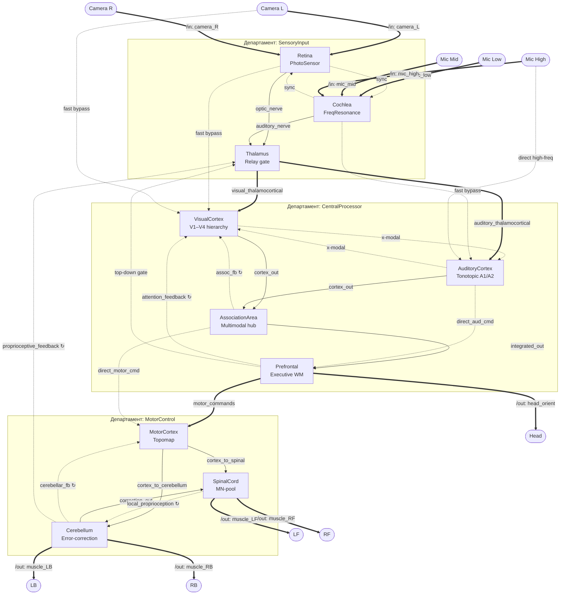

# Octopus Brain Benchmark & DSL Test

Этот проект служит полигоном для тестирования возможностей Python SDK (линтера, структуры, сборщика) на сложной топологии.

## Шаг 1: Инициализация структуры (Модель ==> Департаменты ==> Шарды)

На первом этапе мы создаем базовый скелет модели без связей, сокетов и внешних портов:
1. **Инициализация `ModelBuilder`**: Создание модели `OctopusBrain`.
2. **Инициализация Департаментов**: 
   * `SensoryInput` (сенсоры)
   * `CentralProcessor` (кора)
   * `MotorControl` (движение)
3. **Инициализация Шардов**: Создание вычислительных блоков (Retina, Cochlea, Thalamus, VisualCortex, AuditoryCortex, AssociationArea, Prefrontal, MotorCortex, Cerebellum, SpinalCord), настройка их геометрических размеров и анатомических слоев.
4. **Загрузка Нейронных Блупринтов**: Импорт физических параметров клеток из библиотек (`gnm_lib`).

## Шаг 2: Интерфейсы (Порты ввода-вывода и Сокеты)

На втором этапе мы добавляем интерфейсы взаимодействия для каждого шарда (без прокладки связей между ними):
1. **Внешние порты (`add_input_port` / `add_output_port`)**: Логические интерфейсы для общения с внешним миром (камерами, микрофонами, двигателями робота).
2. **Внутренние сокеты (`add_socket`)**: Интерфейсы для прорастания аксонов (как входящие, так и исходящие).

На этом этапе все сокеты висят свободными, ожидая дальнейшей коммутации.

## Шаг 3: Коммутация связей (Линковка)

На третьем этапе мы соединяем сокеты между собой, выстраивая проводку внутри департаментов и между ними:
1. **Внутренние связи (`connect_to`)**: Связи между сокетами внутри одного департамента. Адресация ведется по принципу `"TargetShard.TargetSocket"`.
2. **Междепартаментные связи**: Связи между сокетами разных департаментов. Адресация/разрешение имен ведется по полному пути `"Department.TargetShard.TargetSocket"`.

Линтер SDK автоматически проверяет корректность типов сокетов (чтобы передатчик соединялся с приемником) и совпадение их размерностей.

---

## Схема связей модели (Целевой граф)

