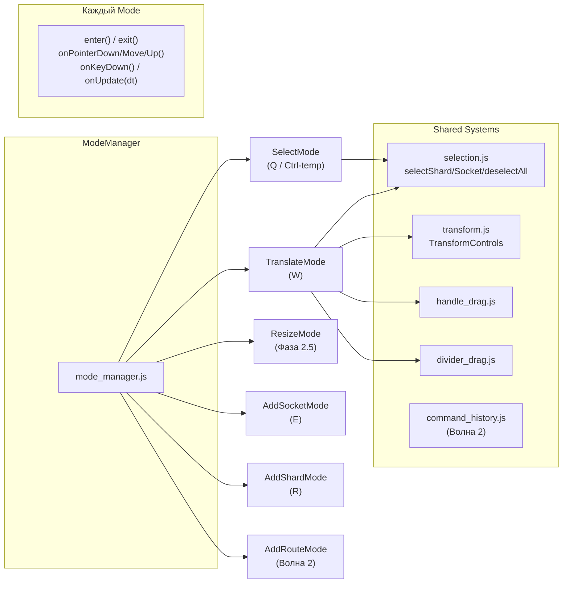

# Изоляция механик редактора — Полный план

## Контекст

Текущее состояние: интерактивная логика размазана по `selection.js` (dblclick), `editor.js` (pointer routing), `ui.js` (заглушки инструментов). Нет единого менеджера режимов, нет изоляции.

**Цель:** Полная перестройка интерактивной подсистемы на архитектуру изолированных режимов с единым ModeManager.

---

## Архитектура



### Ключевые принципы

1. **Один активный режим** — `setMode(name)` вызывает `exit()` → `enter()`
2. **Ctrl-модификатор** — Зажатый Ctrl → temp `SelectMode`, отпускание → возврат (с умным переходом в `TranslateMode`, если в процессе был выбран объект на дефолтном слое)
3. **Хоткеи** — `Q`=Select, `W`=Translate, `E`=AddSocket, `R`=AddShard, `Delete`=Удалить, `Escape`=Отмена/Deselect
4. **После создания** → автопереход в `TranslateMode` с новым объектом
5. **Ghost панели** — floating panel слева-внизу при AddShard/AddSocket mode

---

# 🌊 Волна 1 — Core

## Фаза 0: ModeManager ядро

#### [NEW] [mode_manager.js](file:///w:/Workspace/SDK/orbital_viz/js/editor/mode_manager.js)

```js
export class ModeManager {
  activeMode = null;
  previousMode = null;   // для Ctrl-override
  modes = {};            // name → Mode instance
  ctrlHeld = false;

  register(mode) { ... }
  setMode(name) { ... }  // exit() → enter() → emit MODE_CHANGED

  // Глобальные обработчики:
  // - Фильтрует клики по UI (#hud, #sidebar, #tools-sidebar, etc.)
  // - Делегирует в activeMode.onPointerDown/Move/Up(e)
  // - Ctrl keydown → temp SelectMode, keyup → restore previous (с учетом выделения)
  // - Hotkeys Q/W/E/R/Delete/Escape
  // - onUpdate(dt) → вызывается из animateViewer для ghost-анимаций
}
```

#### [MODIFY] [event_bus.js](file:///w:/Workspace/SDK/orbital_viz/js/store/event_bus.js)
- `+MODE_CHANGED: 'mode:changed'`

#### [MODIFY] [store.js](file:///w:/Workspace/SDK/orbital_viz/js/store/store.js)
- `+activeMode: 'select'`

#### [MODIFY] [editor.js](file:///w:/Workspace/SDK/orbital_viz/js/editor.js)
- **Удалить** все `window.addEventListener(dblclick/pointer*/keydown)`
- `initEditor()` создаёт `ModeManager`, регистрирует режимы, ставит `SelectMode`
- Экспорт `modeManager`

#### [MODIFY] [selection.js](file:///w:/Workspace/SDK/orbital_viz/js/editor/selection.js)
- **Удалить** `onDoubleClick`, `onKeyDown` (перехватываются ModeManager)
- Оставить `selectShard`, `selectSocket`, `deselectAll` как shared API

#### [MODIFY] [ui.js](file:///w:/Workspace/SDK/orbital_viz/js/ui.js)
- Инструменты (`tool-select`, `tool-translate`, etc.) → вызывают `modeManager.setMode()`
- Подписка на `MODE_CHANGED` → обновление `.active` класса на кнопках
- **Удалить** старые заглушки с Toast

---

## Фаза 1: SelectMode

#### [NEW] [select_mode.js](file:///w:/Workspace/SDK/orbital_viz/js/editor/modes/select_mode.js)

| Метод | Поведение |
|---|---|
| `enter()` | Подсветить все объекты слабым highlight (wireframe emissive bump). Курсор `default` |
| `exit()` | Снять highlight |
| `onPointerDown(e)` | **Одинарный ЛКМ** → raycast по shards → sockets. Попадание → `selectShard`/`selectSocket`. Промах → `deselectAll()`. Клик по оси гизмо (`transformControls.axis !== null`) → переключение в `TranslateMode`. |
| `onKeyDown(e)` | `Escape` → `deselectAll()` |

---

## Фаза 2: TranslateMode

#### [NEW] [translate_mode.js](file:///w:/Workspace/SDK/orbital_viz/js/editor/modes/translate_mode.js)

| Метод | Поведение |
|---|---|
| `enter()` | Если есть выделенный объект → attach TransformControls |
| `exit()` | `transformControls.detach()`, если в сцене нет активного выделения |
| `onPointerDown(e)` | handle_drag → divider_drag → raycast select + auto-attach gizmo |
| `onPointerMove(e)` | handle/divider isDragging → delegate. Иначе → hover cursors |
| `onPointerUp(e)` | handle/divider delegate |

---

## Фаза 2.5: ResizeMode (Редактирование размеров шардов)

#### [NEW] [resize_mode.js](file:///w:/Workspace/SDK/orbital_viz/js/editor/modes/resize_mode.js)

Режим изменения геометрических размеров шарда (вызывается из интерфейса или горячей клавишей).

- **Манипуляторы (Handles)**: 
  - На активном (выделенном) шарде по центру каждой из 6 граней отображаются 3D-манипуляторы (кубы или стрелки по вектору нормали).
  - Горизонтальные (`-X`, `+X`, `-Z`, `+Z`) изменяют ширину/глубину.
  - Вертикальные (`-Y`, `+Y`) изменяют высоту.
- **Шаг ресайза**:
  - Динамическое изменение с шагом `RESIZE_STEP = 10` вокселей (целочисленное значение).
- **Жесткие ограничения**:
  - Горизонтальные размеры: `MAX_SHARD_SIZE_XY = 1024` вокселей.
  - Вертикальные размеры: `MAX_SHARD_SIZE_Z = 256` вокселей.
  - Ограничение по полу уровня снизу и коллизиями с другими шардами на этом же уровне при расширении.
- **Клипинг и триггер удаления**:
  - Минимальный размер = `10` вокселей.
  - При попытке сжатия меньше минимума (до `9` вокселей) триггерится событие удаления объекта. Поскольку удаление пока "отклоняется", система производит локальный откат (undo) до предыдущего валидного шага.
- **Поведение сокетов на шарде при изменении размеров**:
  - Сокеты на внешних торцевых гранях (Top/Bottom) остаются прижатыми к граням (их локальная высота смещается вместе с изменением высоты шарда).
  - Сокеты, находящиеся внутри шарда (на внутренних слоях), сохраняют абсолютные мировые координаты неизменными (не масштабируются вместе с изменением габаритов).

---

## Фаза 3: AddShardMode

#### [NEW] [add_shard_mode.js](file:///w:/Workspace/SDK/orbital_viz/js/editor/modes/add_shard_mode.js)

**Ghost-шард:**
- Полупрозрачный box + wireframe, пульсация opacity 0.3↔0.6 (~1.5с цикл)
- **Зелёный** = валидная позиция
- **Жёлтый** = коллизия с другим шардом (wireframe жёлтый)
- **Красный highlight** на инородных объектах внутри ghost

**Orbit detection (трассировка):**
1. Луч из центра камеры по `camera.getWorldDirection()`
2. Intersect с `levelGroup` подложками
3. Нет попадания → конус 45°, ~200 лучей веером
4. Нет попадания → fallback на верхний orbit

**Snap-логика:**
- Ближайший шард на том же orbit → ghost вплотную к грани
- Нет шардов → центр подложки

**Автоименование:** `{orbit_label}_{dept_name}_{index}` (например `outer_motor_0`)

| Метод | Поведение |
|---|---|
| `enter()` | Трассировать orbit. Создать ghost. Показать config panel |
| `exit()` | Удалить ghost. Скрыть config panel |
| `onPointerMove(e)` | Raycast на levelGroup → двигать ghost по XZ. Snap к соседям. Проверять коллизии |
| `onPointerDown(e)` | ЛКМ при валидной позиции → создать шард, добавить в placement, `setMode('translate')` с новым шардом |
| `onUpdate(dt)` | Пульсация ghost opacity |

#### [NEW] [ghost_config_panel.js](file:///w:/Workspace/SDK/orbital_viz/js/ui/ghost_config_panel.js)

Floating panel, слева-внизу экрана. Появляется при входе в AddShard/AddSocket mode.

**AddShard конфиг:**
```
┌──────────────────────────────────┐
│  🧊 Новый шард                   │
│                                  │
│  Слой:  [▼ L3 — Outer ●]        │
│  Размер: [256] × [256] × [64]   │
│  Популяции: [3]                  │
│  Департамент: [▼ motor_cortex]   │
└──────────────────────────────────┘
```

- **Слой** — dropdown с цветными точками, сортирован по index desc
- **Размер** — W×D×H, дефолт из store (настройки)
- **Популяции** — кол-во equidistant слоёв (`height_pct = 1/N`)
- **Департамент** — dropdown существующих + "Новый..."

Изменение любого параметра → мгновенное обновление ghost в сцене.

---

## Фаза 4: AddSocketMode

#### [NEW] [add_socket_mode.js](file:///w:/Workspace/SDK/orbital_viz/js/editor/modes/add_socket_mode.js)

**Предусловие:** `selectedShardKey != null`. Иначе → Toast + fallback SelectMode.

**Ghost-сокет:**
- Полупрозрачная instanced matrix + backing, пульсация
- Следует за курсором по поверхности шарда
- faceSign определяется по нормали попадания raycast
- *Примечание:* На этой фазе также закладывается базовая логика редактирования параметров матриц (размеры, pitch, face).

| Метод | Поведение |
|---|---|
| `enter()` | Проверить `selectedShardKey`. Создать ghost socket. Показать socket config panel |
| `exit()` | Удалить ghost. Скрыть config panel |
| `onPointerMove(e)` | Raycast на поверхность шарда → двигать ghost (snap к voxel grid) |
| `onPointerDown(e)` | ЛКМ → зафиксировать сокет, добавить в placement, `rebuildSocket()`, → TranslateMode |

**AddSocket конфиг:**
```
┌──────────────────────────────────┐
│  🔌 Новый сокет                  │
│                                  │
│  Шард:  [▼ outer_motor_0]       │
│  Размер: [32] × [32]            │
│  Pitch: [1]                      │
│  Face: [▼ Top (+Z)]             │
└──────────────────────────────────┘
```

- **Шард** — dropdown всех шардов, сортировка по азбуке, дефолт = текущий selected
- **Face** — Top/Bottom

---

## Фаза 5: Delete + Confirm

#### [MODIFY] [toolbar.js](file:///w:/Workspace/SDK/orbital_viz/js/ui/toolbar.js)
- Добавить `delete-btn` слева от "Сохранить" в `#bottom-right-container`
- Видим только при `selectedShardKey || selectedSocketKey`
- Текст: `Удалить {тип}` (реактивно)
- Hotkey: `Delete` / `Backspace`

#### [NEW] [confirm_dialog.js](file:///w:/Workspace/SDK/orbital_viz/js/ui/confirm_dialog.js)

**2-ступенчатый диалог:**

Ступень 1 (popup над кнопкой):
```
┌────────────────────────────────┐
│  Удалить "outer_motor_0"?      │
│                                │
│  [Да]  [Нет]                   │
└────────────────────────────────┘
```

Ступень 2 (если "Да" и это шард с routes):
```
┌────────────────────────────────────────┐
│  Удалить сокеты на обоих концах        │
│  связей или только на этом шарде?      │
│                                        │
│  [Оба конца]  [Только этот]  [Отмена]  │
└────────────────────────────────────────┘
```

После подтверждения:
- Удалить из `placementData.shards[]`
- Удалить routes где `from === key || to === key`
- Каскадно удалить сокеты (по выбору)
- `scene.remove(mesh)`, очистить `shardMeshes[key]`
- `deselectAll()`, `emit(LAYOUT_CHANGED)`

---

## Фаза 6: Settings Panel

#### [NEW] [settings_panel.js](file:///w:/Workspace/SDK/orbital_viz/js/ui/settings_panel.js)

Drawer-панель (как physics/layers), привязана к `settings-trigger-btn`.

```
┌──────────────────────────────────┐
│  ⚙ Настройки редактора           │
│                                  │
│  Сетка подложки                  │
│  Шаг: [100] vx                   │
│                                  │
│  Snap                            │
│  Шаг: [1] vx                     │
│                                  │
│  Шард по умолчанию               │
│  W: [256]  D: [256]  H: [64]    │
│                                  │
│  Undo                            │
│  Режим: [▼ Глобальный стек]      │
└──────────────────────────────────┘
```

При изменении → обновить store, пересоздать сетку.

#### [MODIFY] [ui.js](file:///w:/Workspace/SDK/orbital_viz/js/ui.js)
- Заменить Toast-заглушку настроек на `initSettingsPanel(settingsBtn)`

---

## Фаза 7: Интерактивный ViewCube

#### [NEW] [viewcube.js](file:///w:/Workspace/SDK/orbital_viz/js/ui/viewcube.js)

**Hover:**
- `.cube-face:hover` → яркая подсветка, `cursor: pointer`
- Edge/corner hover (CSS pseudo-elements или дополнительные div)

**Click (6 граней + 12 рёбер + 8 углов):**
- Определить целевую позицию камеры (сохранить текущий зум = расстояние до `controls.target`)
- Анимация 0.5с с ease-in-out cubic

**Drag-вращение:**
- `pointerdown` на ViewCube → начать drag
- `pointermove` → вращать камеру вокруг `controls.target` (сохраняя distance)
- Синхронизация: камера вращается → ViewCube автоматически обновляется через `animateViewer`

```js
// Целевые позиции камеры (нормализованные, умножаются на distance)
const FACE_DIRS = {
  front:  [0, 0, 1],    // Y-
  back:   [0, 0, -1],   // Y+
  right:  [1, 0, 0],    // X+
  left:   [-1, 0, 0],   // X-
  top:    [0, 1, 0],    // Z+
  bottom: [0, -1, 0.01] // Z- (slight offset to avoid gimbal lock)
};
// Рёбра = average двух смежных граней, углы = average трёх
```

#### [MODIFY] [styles.css](file:///w:/Workspace/SDK/orbital_viz/css/styles.css)
- `.cube-face:hover` → `background: rgba(..., 0.85)`, `box-shadow`, `cursor: pointer`
- `.cube-edge`, `.cube-corner` — новые interactive элементы (если делаем через HTML)

#### [MODIFY] [viewer.js](file:///w:/Workspace/SDK/orbital_viz/js/viewer.js)
- `animateViewer` уже синхронизирует куб — оставляем как есть
- Добавить `animateCameraTo(targetPos, duration)` — реюзабельная анимация

---

# 🌊 Волна 2 — Advanced (после стабилизации Волны 1)

## Фаза 8: AddRouteMode

#### [NEW] [add_route_mode.js](file:///w:/Workspace/SDK/orbital_viz/js/editor/modes/add_route_mode.js)

1. Клик на выходной сокет → фиксация "начала" связи
2. Визуальная линия от сокета к курсору (THREE.Line, обновляется в `onPointerMove`)
3. Клик на входной сокет → создание route in `routesData[]`, `drawRoutes()`, → TranslateMode
4. Escape → отмена

---

## Фаза 9: Multi-select (Shift+Click)

#### [MODIFY] [store.js](file:///w:/Workspace/SDK/orbital_viz/js/store/store.js)
- `selectedShardKey/selectedSocketKey` → `selectedKeys: Set<string>`
- Обратная совместимость через getter

#### [MODIFY] [select_mode.js](file:///w:/Workspace/SDK/orbital_viz/js/editor/modes/select_mode.js)
- Shift+Click → добавить/убрать из `selectedKeys`
- Без Shift → заменить selection

#### [MODIFY] [translate_mode.js](file:///w:/Workspace/SDK/orbital_viz/js/editor/modes/translate_mode.js)
- Групповое перемещение (TransformControls на "pivot" объекте)

---

## Фаза 10: Departments как контейнеры

#### [MODIFY] [scene_builder.js](file:///w:/Workspace/SDK/orbital_viz/js/scene_builder.js)

Иерархия сцены:
```
scene
 └─ planesGroup
     └─ levelGroup (orbit N)
         └─ departmentGroup (dept "motor_cortex")  ← НОВЫЙ уровень
             └─ shardMesh
                 └─ socketGroups, layers, dividers
```

- `departmentGroup` — `THREE.Group` с динамическим bounding box (пересчитывается при перемещении шардов)
- Коллизии: между шардами внутри dept = запрещены. Между department groups = разрешены.
- Визуализация: тонкий wireframe bbox вокруг department group

---

## Фаза 11: Level Flip

#### [NEW] [level_flip.js](file:///w:/Workspace/SDK/orbital_viz/js/editor/level_flip.js)

- Кнопка "Flip" в контекстном меню уровня (или в settings panel)
- При флипе уровня:
  1. Все шарды на этом orbit: `position.z` пол остаётся на плоскости, но высота идёт в `-Z`
  2. `mesh.scale.z *= -1` (или пересчёт позиции)
  3. Матрицы (сокеты): `faceSign` инвертируется (+1 ↔ -1)
  4. Слои внутри шардов: порядок инвертируется (bottom → top)
  5. `levelGroup.userData.flipped = true/false`

> [!WARNING]
> Нужно тщательно проверить: wireframe, labels, dividers — всё должно корректно отразиться. Это потенциально самая хрупкая фича.

---

## Фаза 12: Matrix Z-коллизии

#### [MODIFY] [collision_adapter.js](file:///w:/Workspace/SDK/orbital_viz/js/editor/collision_adapter.js)

**Новые проверки:**
1. **Same-Z overlap** — две матрицы на одном faceSign с пересекающимися 2D bbox = **критическая ошибка** (validator highlight)
2. **Dead zone по Z** — `deadZone = perimeter(matrix) / 4` вокселей сверху/снизу. Если другая матрица попадает в dead zone = **warning** коллизия
3. **Автокоррекция** — если есть свободное пространство по Z → сдвинуть автоматически. Иначе → ручное решение (validator показывает ошибку)

---

## Фаза 13: Undo (Dual Stack)

#### [NEW] [command_history.js](file:///w:/Workspace/SDK/orbital_viz/js/editor/command_history.js)

**Архитектура dual-stack:**

```js
// Каждое действие:
const command = {
  hash: crypto.randomUUID(),  // уникальный ID
  objectKey: 'outer_motor_0', // привязка к объекту
  description: 'Move shard',
  do() { ... },               // применить
  undo() { ... },             // откатить
};

// Глобальный стек: [hash1, hash2, hash3, ...]
// Per-object стеки: { 'outer_motor_0': [hash1, hash3], 'inner_sensor_0': [hash2] }

// Ctrl+Z (глобальный режим): pop из globalStack → undo → remove из objectStack
// Ctrl+Z (per-object режим): pop из objectStack[selectedKey] → undo → remove из globalStack
```

**Переключение в настройках:** `store.undoMode = 'global' | 'per-object'`

---

## Порядок реализации

| # | Фаза | Волна | Зависимости |
|---|---|---|---|
| 0 | ModeManager ядро + hotkeys | 1 | — |
| 1 | SelectMode | 1 | Фаза 0 |
| 2 | TranslateMode | 1 | Фаза 0, 1 |
| 2.5 | ResizeMode (Ресайз шардов) | 1 | Фаза 0, 1, 2 |
| 3 | AddShardMode + ghost panel | 1 | Фаза 0, 2 |
| 4 | AddSocketMode + ghost panel | 1 | Фаза 0, 2 |
| 5 | Delete + 2-step Confirm | 1 | Фаза 0 |
| 6 | Settings panel | 1 | — |
| 7 | ViewCube interactive | 1 | — |
| 8 | AddRouteMode | 2 | Фаза 0 |
| 9 | Multi-select | 2 | Фаза 1 |
| 10 | Department containers | 2 | Фаза 3 |
| 11 | Level Flip | 2 | Фаза 10 |
| 12 | Matrix Z-коллизии | 2 | Фаза 4 |
| 13 | Undo dual stack | 2 | Фаза 0 |

---

## Пространственный договор (Оси)

При сериализации (экспорте в JSON) и десериализации (импорте в сцену) необходимо строго пересчитывать разницу между пространственными осями Three.js и контрактными осями движка:

- **Движок/Контракт/JSON**:
  - `Z` — вертикальная ось (высота уровня).
  - `X` — лево/право.
  - `Y` — вперед/назад.
  - *Ортогональ (вид сверху)*: `Y+` направлена вверх экрана.

- **Сцена Three.js (Визуализатор)**:
  - `Y` — вертикальная ось (высота).
  - `X` — лево/право.
  - `Z` — вперед/назад.

- **Маппинг при загрузке (Десериализации)**:
  - `ThreeJS.X = JSON.X`
  - `ThreeJS.Y = JSON.Z` (высота)
  - `ThreeJS.Z = JSON.Y`

- **Маппинг при сохранении (Сериализации)**:
  - `JSON.X = ThreeJS.X`
  - `JSON.Z = ThreeJS.Y` (высота)
  - `JSON.Y = ThreeJS.Z`

---

## Verification Plan

### Волна 1 — Ручная проверка

1. **Hotkeys**: Q/W/E/R переключают режимы. Ctrl → temp Select. Delete → диалог удаления
2. **SelectMode**: Одинарный клик выделяет. Промах → deselect. Highlight на всех объектах
3. **TranslateMode**: Клик → gizmo. Handle/divider drag работает. Snap к сетке
4. **ResizeMode**: Наведение на центр грани шарда -> отображение гизмо-стрелки. Ресайз шагом 10 vx с проверкой коллизий и лимитов (XY: 1024, Z: 256). Внутренние сокеты не двигаются, торцевые Top/Bottom следуют за гранями.
5. **AddShardMode**: Ghost следует за мышью. Config panel слева-внизу. Смена orbit → ghost перемещается. Snap к соседу. Жёлтый при коллизии. Клик → шард создан → TranslateMode
6. **AddSocketMode**: Ghost на поверхности шарда. Config panel. Клик → сокет создан → TranslateMode
7. **Delete**: Кнопка + popup. 2 ступени для шарда с routes
8. **Settings**: Drawer. Изменение сетки → обновление подложки
9. **ViewCube**: Hover highlight. Click → камера летит 0.5с. Drag → вращение камеры
