# AxiEngine — Спецификации (`INDEX.md`)

> Версия: 3.5 | Дата: 2026-06-30

---

## §1. Архитектурный граф

```mermaid
graph TD
    subgraph L0["Слой 0"]
        types["types (v2.2)"]
        physics["physics (v2.2)"]
    end
    subgraph L1["Слой 1"]
        layout["layout (v2.2)"]
        config["config (v2.1)"]
        wire["wire (v2.0)"]
    end
    subgraph L2["Слой 2"]
        ipc["ipc (v2.0)"]
        vfs["vfs (v2.0)"]
    end
    subgraph L3["Слой 3"]
        compute_api["compute-api (v2.2)"]
        compute["compute (v2.2)"]
        compute_cpu["compute-cpu (v2.2)"]
        compute_cuda["compute-cuda (v2.3)"]
        compute_hip["compute-hip (v2.1)"]
        test_harness["test-harness (v2.2)"]
    end
    subgraph L4["Слой 4"]
        topology["topology (v2.0)"]
        baker["baker (v2.0)"]
        baker_cli["baker-cli (v2.0)"]
        edge_model["edge-model (v2.0)"]
        weaver_daemon["weaver-daemon (v2.0)"]
    end
    subgraph L5["Слой 5"]
        protocol["protocol (v2.0)"]
        transport["transport (v2.0)"]
        net["net (v2.0)"]
    end
    subgraph L6["Слой 6"]
        boot["boot (v1.0)"]
        runtime["runtime (v2.0)"]
        node["node (v1.0)"]
    end

    types --> layout
    types --> config
    types --> wire
    types --> ipc
    types --> vfs
    types --> compute_api
    types --> compute_cpu
    types --> compute_cuda
    types --> compute_hip
    types --> test_harness
    types --> topology
    types --> baker
    types --> edge_model
    types --> weaver_daemon
    types --> protocol
    types --> boot
    types --> runtime
    types --> node
    physics --> config
    physics --> compute_cpu
    physics --> compute_cuda
    physics --> compute_hip
    physics --> baker
    layout --> ipc
    wire --> ipc
    wire --> protocol
    wire --> net
    layout --> compute_api
    layout --> test_harness
    layout --> topology
    layout --> baker
    layout --> edge_model
    layout --> weaver_daemon
    layout --> net
    layout --> boot
    layout --> runtime
    config --> topology
    config --> baker
    config --> weaver_daemon
    config --> boot
    wire --> weaver_daemon
    wire --> boot
    ipc --> weaver_daemon
    ipc --> net
    ipc --> boot
    ipc --> runtime
    vfs --> baker
    vfs --> edge_model
    vfs --> boot
    topology --> baker
    topology --> weaver_daemon
    baker --> baker_cli
    compute_api --> compute
    compute_api --> compute_cpu
    compute_api --> compute_cuda
    compute_api --> compute_hip
    compute_api --> test_harness
    compute_cpu --> test_harness
    compute --> boot
    compute --> runtime
    protocol --> net
    transport --> net
    net --> boot
    net --> runtime
    net --> node
    boot --> node
    runtime --> node

    classDef active fill:#1e3a8a,stroke:#3b82f6,stroke-width:2px,color:#fff;
    class types,physics,layout,config,wire,ipc,vfs,compute_api,compute,compute_cpu,compute_cuda,compute_hip,test_harness,topology,baker,baker_cli,edge_model,weaver_daemon,protocol,transport,net,boot,runtime,node active;
```

---

## §2. Реестр спецификаций

### Слой 0 (Layer 0: Primitives & Pure Math)
`no_std`, 0 аллокаций.

| Крейт | Спецификация | Статус | Назначение |
|---|---|---|---|
| `types` | [types_spec.md](spec_L0/types_spec.md) | **Approved v2.2** | Атомарные типы (`Tick`, `Voltage`), packed ABI (`PackedPosition`, `PackedTarget`, `SomaFlags`), seed/hash, константы. |
| `physics` | [physics_spec.md](spec_L0/physics_spec.md) | **Approved v2.2 / Implemented** | Математика GLIF, AHP, homeostasis, Active Tail, GSOP, DDS heartbeat, `v_seg`. |

### Слой 1 (Layer 1: Data Contracts & Deserialization)

| Крейт | Спецификация | Статус | Назначение |
|---|---|---|---|
| `layout` | [layout_spec.md](spec_L1/layout_spec.md) | **Approved v2.2** | C-ABI макеты физической памяти (`VariantParameters`), выравнивание плоскостей SoA и заголовки файлов. |
| `config` | [config_spec.md](spec_L1/config_spec.md) | **Approved v2.1 / Ready for Implementation** | Serde/TOML DTO, парсинг и "Shift-Left" локальная валидация DSL (`model.toml`, `department.toml`, `shard.toml`). |
| `wire` | [wire_spec.md](spec_L1/wire_spec.md) | **Draft v2.0** | C-ABI структуры сетевых и IPC пакетов, magic-константы, выравнивание, Little-Endian политика и `no-alloc` хелперы. |

### Слой 2 (Layer 2: Infrastructure & OS Isolation)

| Крейт | Спецификация | Статус | Назначение |
|---|---|---|---|
| `ipc` | [ipc_spec.md](spec_L2/ipc_spec.md) | **Draft v2.0** | Жизненный цикл SHM/mmap, атомарные переходы Ночной Фазы (CAS), двойной буфер Swapchain и изоляция OS системных вызовов. |
| `vfs` | [vfs_spec.md](spec_L2/vfs_spec.md) | **Draft v2.0** | Контейнерный формат `.axic`, оглавление TOC, Read-Only mmap отображение, нормализация путей и примитивы экстракции. |

### Слой 3 (Layer 3: Hardware Acceleration & Compute Abstraction)

| Крейт | Спецификация | Статус | Назначение |
|---|---|---|---|
| `compute-api` | [compute_api_spec.md](spec_L3/compute_api_spec.md) | **Approved v2.2 / Implemented** | Аппаратно-независимый HAL контракт бэкендов вычислений (`ComputeBackend`), непрозрачные VRAM handles и DTO команд. |
| `compute` | [compute_spec.md](spec_L3/compute_spec.md) | **Approved v2.2 / Implemented** | Фасад вычислений `ShardEngine`, автовыбор бэкендов (`BackendPreference`) и оркестрация жизненного цикла шарда. |
| `compute-cpu` | [compute_cpu_spec.md](spec_L3/compute_cpu_spec.md) | **Approved v2.2 / Implemented** | Многопоточная CPU-реализация `ComputeBackend` на базе Rayon, выровненные ресурсы хоста и проверочная реализация. |
| `compute-cuda` | [compute_cuda_spec.md](spec_L3/compute_cuda_spec.md) | **Approved v2.3 / Stage 1R Batch-Native Implemented** | Высокопроизводительная CUDA-реализация `ComputeBackend` на базе NVIDIA Runtime API и неблокирующих стримов. |
| `compute-hip` | [compute_hip_spec.md](spec_L3/compute_hip_spec.md) | **Draft v2.1 / API Sync** | Высокопроизводительная AMD ROCm/HIP реализация `ComputeBackend` на базе Wave64 вейвфронтов и неблокирующих стримов. |
| `test-harness` | [test_harness_spec.md](spec_L3/test_harness_spec.md) | **Approved v2.2 / Implemented** | Вспомогательный тестовый крейт для дифференциальных проверок `ComputeBackend`, фикстур и контроля ABI-зеркал. |

### Слой 4 (Layer 4: Geometry, Growth & Connectome Generation)

| Крейт | Спецификация | Статус | Назначение |
|---|---|---|---|
| `topology` | [topology_spec.md](spec_L4/topology_spec.md) | **Draft v2.0** | Чистый алгоритмический крейт пространственной геометрии, детерминированного размещения сом, пространственной сетки и роста аксонов. |
| `baker` | [baker_spec.md](spec_L4/baker_spec.md) | **Draft v2.0** | Оркестратор компиляции AOT, координация фаз сборки, генерация бинарных блобов по `layout` и упаковка `.axic`. |
| `baker-cli` | [baker_cli_spec.md](spec_L4/baker_cli_spec.md) | **Draft v2.0** | Консольная утилита и sidecar-интерфейс для запуска `baker`, вывода отчетов/прогресса и управления флагами. |
| `edge-model` | [edge_model_spec.md](spec_L4/edge_model_spec.md) | **Draft v2.0** | Оффлайн-конвертор десктопных моделей в edge-артефакты (WTA top-K срез, разделение SRAM/Flash, MMU padding). |
| `weaver-daemon` | [weaver_daemon_spec.md](spec_L4/weaver_daemon_spec.md) | **Draft v2.0** | Изолированный OS-процесс Ночной Фазы (прунинг, спраутинг, столбовое уплотнение SoA в SHM). |

### Слой 5 (Layer 5: Network Stack)

| Крейт | Спецификация | Статус | Назначение |
|---|---|---|---|
| `protocol` | [protocol_spec.md](spec_L5/protocol_spec.md) | **Draft v2.0** | Stateless-парсер L7, нарезка/сборка спайковых чанков (`no_std`, zero-alloc) и валидация эпох. |
| `transport` | [transport_spec.md](spec_L5/transport_spec.md) | **Draft v2.0** | Системный I/O сокетов ОС, неблокирующая передача UDP/TCP, предвыделенные пулы и очереди. |
| `net` | [net_spec.md](spec_L5/net_spec.md) | **Draft v2.0** | Сетевой оркестратор `axi-net`: таблицы маршрутов RCU, BSP-барьеры, бэкпрешер, External IO и телеметрия. |

### Слой 6 (Layer 6: Runtime Orchestration & Node Startup)

| Крейт | Спецификация | Статус | Назначение |
|---|---|---|---|
| `boot` | [boot_spec.md](spec_L6/boot_spec.md) | **Draft v1.0** | Инициализация окружения, монтирование VFS, проверка выравнивания и flash-копирование состояния в GPU. |
| `runtime` | [runtime_spec.md](spec_L6/runtime_spec.md) | **Draft v2.0** | Оркестратор вычислений шардов, Day/Night переходы, координация с `weaver-daemon` и сбои. |
| `node` | [node_spec.md](spec_L6/node_spec.md) | **Draft v1.0** | Тонкий OS-демон: разбор CLI-аргументов, CPU affinity, Tokio-изоляция и graceful shutdown. |

---

## §3. Реестры

- **Инварианты и ошибки**: [troubleshooting.md](troubleshooting.md)
- **Вопросы и замечания к ревью**: [review.md](review.md)
