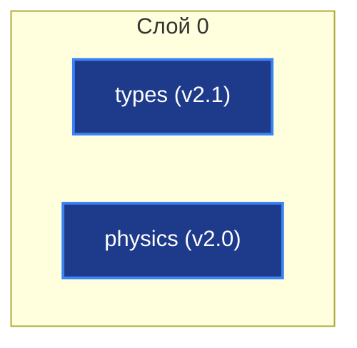

# AxiEngine — Спецификации (`INDEX.md`)

> Версия: 1.5 | Дата: 2026-06-29

---

## §1. Архитектурный граф

---

## §2. Реестр спецификаций

### Слой 0 (Layer 0: Primitives & Pure Math)
`no_std`, 0 аллокаций.

| Крейт | Спецификация | Статус | Назначение |
|-------|--------------|--------|------------|
| `types` | [types_spec.md](spec_L0/types_spec.md) | **Draft v2.1** | Атомарные типы (`Tick`, `Voltage`), packed ABI (`PackedPosition`, `PackedTarget`, `SomaFlags`), seed/hash, константы. |
| `physics` | [physics_spec.md](spec_L0/physics_spec.md) | **Draft v2.0** | Математика GLIF, AHP, homeostasis, Active Tail, GSOP, DDS heartbeat, `v_seg`. |

---

## §3. Реестры

- **Инварианты и ошибки**: [troubleshooting.md](troubleshooting.md)
- **Вопросы и замечания к ревью**: [review.md](review.md)
