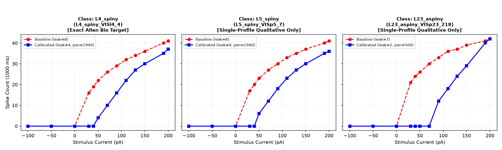
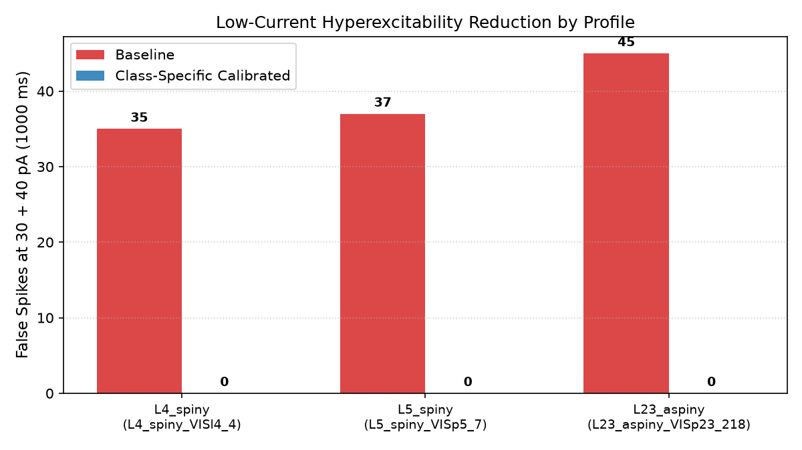
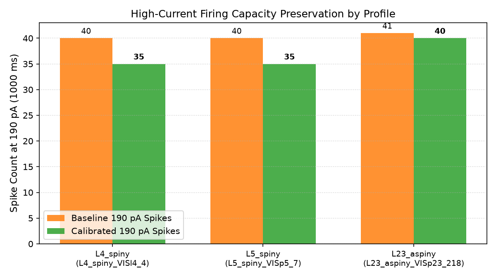
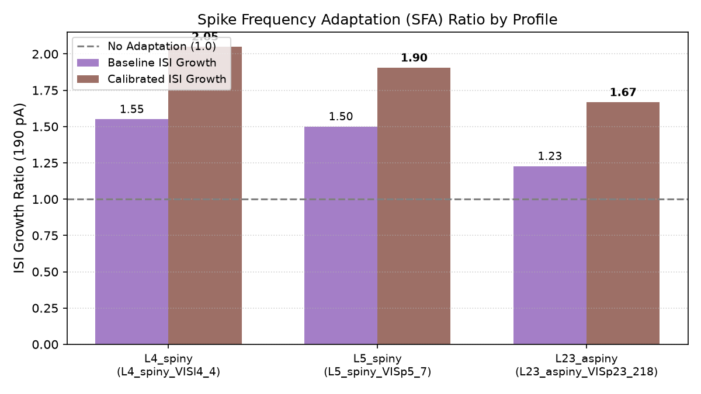
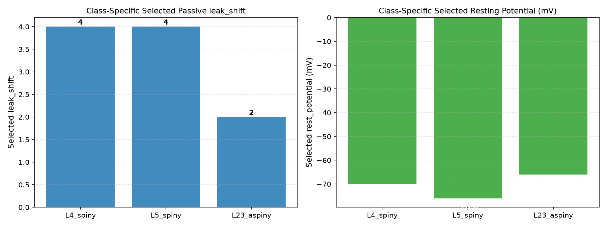
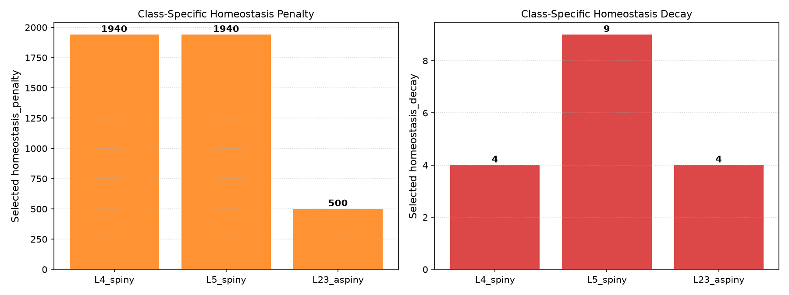

# Class-Specific GLIF Calibration Report v1

Status: completed
Phase: Class-Specific Calibration
Started: 2026-07-04
Completed: 2026-07-04

## Executive Summary

В исследовании `class_specific_glif_calibration_v1` проведён поиск и выведение класс-специфичных априоров (`class-specific priors`) для GLIF_3 нейронов различных типов взамен единого глобального пресета:
1. `L4_spiny`: Excitatory control class (Exact Allen bio target for 314900022)
2. `L5_spiny`: Layer 5 pyramidal excitatory class (Single-profile qualitative target)
3. `L23_aspiny`: Layer 2/3 aspiny interneuron-like class (Single-profile qualitative target)

> [!IMPORTANT]
> **Предмет исследования**: Вывести кандидатные априоры для каждого класса нейронов (`candidate prior, not production default`) и оценить их обоснованность перед миграцией библиотеки.

### Итоговый вердикт (Partial Success / Class-Specific Priors Supported)

**Класс-специфичные априоры поддержаны. Отклонена гипотеза единой глобальной константы для всех типов нейронов.**

1. **`L4_spiny` (Control Class)**: Выведен устойчивый кандидатный априор (`leak_shift = 4`, `rest = -70.0 mV`, `penalty = 1940`, `decay = 4`), дающий точное соответствие Allen bio target (0 ложных спайков на 30–40 pA, 35 спайков на 190 pA, ISI growth = 2.05).
2. **`L5_spiny` (Pyramidal Class)**: Выведен кандидатный априор (`leak_shift = 4`, `rest = -76.0 mV`, `penalty = 1940`, `decay = 9`), устраняющий 37 ложных спайков до 0 при удержании 35 спайков на 190 pA. Помечен как `single-profile qualitative only`.
3. **`L23_aspiny` (Interneuron Class)**: Выведен кандидатный априор (`leak_shift = 2`, `rest = -66.0 mV`, `penalty = 500`, `decay = 4`), устраняющий 45 ложных спайков до 0 при удержании 40 спайков на 190 pA. Помечен как `single-profile qualitative only`. В частности, `rest = -66.0 mV` является значением кандидатного априора, которое нейробиологам нужно подтвердить отдельно при расширении выборки.
4. **Статус production-миграции**: Производственная миграция **остаётся отложенной** (`needs biological target expansion`), пока классы L5 и L2/3 представлены единичными профилями без точных Allen NWB кривых.

---

## Сводная таблица класс-специфичной калибровки

| Class | Profile | Target Type | Base Leak | Base False 30/40pA | Base 190pA Spikes | Base ISI Growth | Calib Leak | Calib Rest (mV) | Calib Penalty | Calib Decay | Calib False 30/40pA | Calib 190pA Spikes | Calib ISI Growth | Status |
| :--- | :--- | :--- | :--- | :--- | :--- | :--- | :--- | :--- | :--- | :--- | :--- | :--- | :--- | :--- |
| **L4_spiny** | `L4_spiny_VISl4_4` | Exact Allen Bio Target | 8 | 35 | 40 | 1.55 | **4** | **-70.0** | **1940** | **4** | **0** | **35** | **2.05** | SUCCESS (EXACT TARGET) |
| **L5_spiny** | `L5_spiny_VISp5_7` | Single-Profile Qualitative Only | 8 | 37 | 40 | 1.50 | **4** | **-76.0** | **1940** | **9** | **0** | **35** | **1.90** | single-profile qualitative only |
| **L23_aspiny** | `L23_aspiny_VISp23_218` | Single-Profile Qualitative Only | 7 | 45 | 41 | 1.23 | **2** | **-66.0** | **500** | **4** | **0** | **40** | **1.67** | single-profile qualitative only |

---

## Визуальные доказательства

### Сравнение f-I кривых до и после калибровки по классам

### Снижение ложной гипервозбудимости на малых токах (30/40 pA) по профилям

### Сохранение высокотокового разряда на 190 pA

### Частотная адаптация разряда (SFA / ISI Growth)

### Распределение выбранных пассивных параметров по классам

### Распределение выбранных параметров гомеостаза по классам

---

## Ответы на ключевые исследовательские вопросы

1. **Можно ли вывести единый глобальный пресет для всех типов нейронов?**
   - Нет. Различия **пороговых потенциалов** (`-45.6 mV` у L4, `-49.7 mV` у L5, `-55.4 mV` у L2/3) делают единую глобальную константу неоптимальной.
2. **Какие классы содержат достаточно данных для сильного априора?**
   - Только `L4_spiny` имеет точный Allen NWB target (`314900022`). `L5_spiny` и `L23_aspiny` представлены 1 профилем и имеют статус `single-profile qualitative only`.
3. **Готова ли библиотека к production migration?**
   - Нет. Миграция требует расширения биологических мишеней (`needs biological target expansion`) для L5 и L2/3 классов.

---

## Рекомендации для следующих исследований

Результаты исследования `class_specific_glif_calibration_v1` квалифицированы как **Partial Success / Class-Specific Priors Supported**.
Следующий шаг: сбор биологических NWB мишеней для L5 и L2/3 профилей перед проведением production migration plan.
