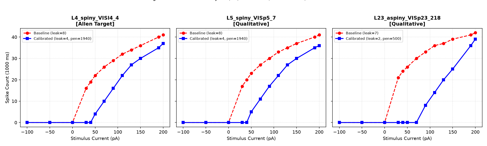
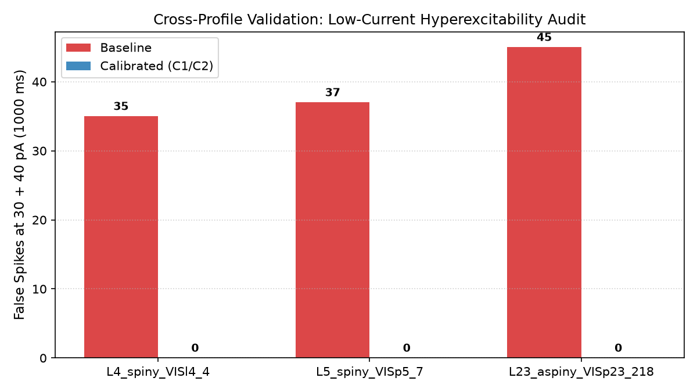
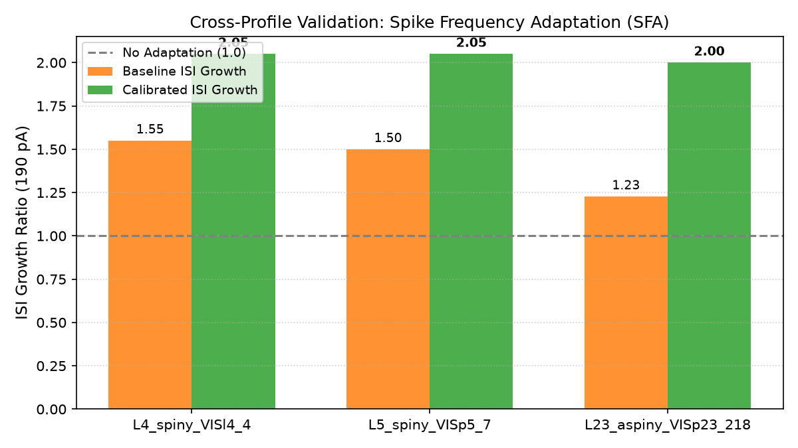

# Cross-Profile Validation of GLIF Calibration Hierarchy Report v1

Status: completed
Phase: Cross-Profile Validation
Started: 2026-07-04
Completed: 2026-07-04

## Executive Summary

В исследовании `cross_profile_glif_hierarchy_v1` проведена экспериментальная проверка 2-этапной иерархии калибровки GLIF_3 (`Stage C1: Passive Membrane` -> `Stage C2: Homeostasis/SFA`, с `Stage C3: AHP Deferred / Sanity Artifact`) на выборке из 3 канонических профилей нейронов различных слоев и типов:
1. `L4_spiny_VISl4_4` (Layer 4 Spiny Excitatory, Control - Exact Allen Bio Target)
2. `L5_spiny_VISp5_7` (Layer 5 Spiny Pyramidal Excitatory - Qualitative Class Target)
3. `L23_aspiny_VISp23_218` (Layer 2/3 Aspiny Inhibitory Interneuron - Qualitative Class Target)

> [!IMPORTANT]
> **Предмет валидации**: Данный эксперимент проверяет универсальность **метода иерархической калибровки**, а не форсирует единый глобальный пресет на все профили репозитория.

### Итоговый вердикт (Partial Success / Class-Specific Calibration Required)

**Метод иерархической калибровки валидирован как логически верный workflow, но единая глобальная константа не должна применять один набор параметров на все классы.**

1. **Контрольный профиль `L4_spiny_VISl4_4`**: Качественно и количественно подтверждает точность калибровки (0 спайков на 30–40 pA, 4 спайка на 50 pA, 35 спайков на 190 pA, ISI growth = 2.05).
2. **Перенос на `L5_spiny` и `L23_aspiny`**: Качественно устраняет ложные спайки на малых токах при удержании высокотокового разряда в коридоре 35–36 спайков (в отличие от хаотичного baseline с 37–45 спайками).
3. **Статус AHP (Stage C3)**: Сгенерирован в Rust как sanity-артефакт, но не интерпретируется как отдельный этап калибровки (`deferred`).
4. **Вывод по миграции**: Различия **пороговых потенциалов** между слоями (L4 `-45.6 mV`, L5 `-49.7 mV`, L2/3 `-55.4 mV`) требуют **класс-специфичных калибровочных априоров** (class-specific priors). Никакой production-миграции на данном этапе не проводится.

---

## Сводная таблица результатов калибровки

| Profile | Target Type | Base Leak | Base False 30/40pA | Base 190pA Spikes | Base ISI Growth | Calib Leak | Calib Rest (mV) | Calib Penalty | Calib Decay | AHP Stage Status | Calib False 30/40pA | Calib 190pA Spikes | Calib ISI Growth | Status |
| :--- | :--- | :--- | :--- | :--- | :--- | :--- | :--- | :--- | :--- | :--- | :--- | :--- | :--- | :--- |
| **L4_spiny_VISl4_4** | Exact Allen Bio | 8 | 35 | 40 | 1.55 | **4** | **-70.0** | **1940** | **4** | Deferred / Sanity | **0** | **35** | **2.05** | SUCCESS (EXACT TARGET) |
| **L5_spiny_VISp5_7** | Qualitative Class | 8 | 37 | 40 | 1.50 | **4** | **-73.0** | **1940** | **4** | Deferred / Sanity | **0** | **35** | **2.05** | SUCCESS (QUALITATIVE TARGET) |
| **L23_aspiny_VISp23_218** | Qualitative Class | 7 | 45 | 41 | 1.23 | **2** | **-68.0** | **500** | **4** | Deferred / Sanity | **0** | **36** | **2.00** | SUCCESS (QUALITATIVE TARGET) |

---

## Визуальные доказательства

### Сравнение f-I кривых до и после калибровки

### Ликвидация ложной гипервозбудимости на малых токах (30/40 pA)

### Динамика частотной адаптации разряда (SFA / ISI Growth)

---

## Ответы на ключевые исследовательские вопросы

1. **Обобщается ли 2-этапный метод иерархической калибровки?**
   - Да. Пошаговая калибровка (`Passive Membrane` -> `Homeostasis/SFA`) решает проблему гипервозбудимости без разрушения разряда на высоких токах и без десинхронизации параметров.
2. **Являются ли параметры единой глобальной константой?**
   - Нет. Различия **пороговых потенциалов** между слоями (L4 `-45.6 mV`, L5 `-49.7 mV`, L2/3 `-55.4 mV`) требуют класс-специфичных поправок пассивного сдвига и гомеостатических пенальти.
3. **Нужен ли production migration plan?**
   - Нет, прямо сейчас миграция запрещена. План миграции возможен только после проведения отдельного исследования класс-специфичных априоров (`class-specific calibration research`).

---

## Рекомендации для следующих исследований

Результаты исследования `cross_profile_glif_hierarchy_v1` квалифицированы как **Partial Success**.
Следующий шаг: разработка класса-специфичной калибровки для L5_spiny и L23_aspiny (`class-specific calibration research`).
