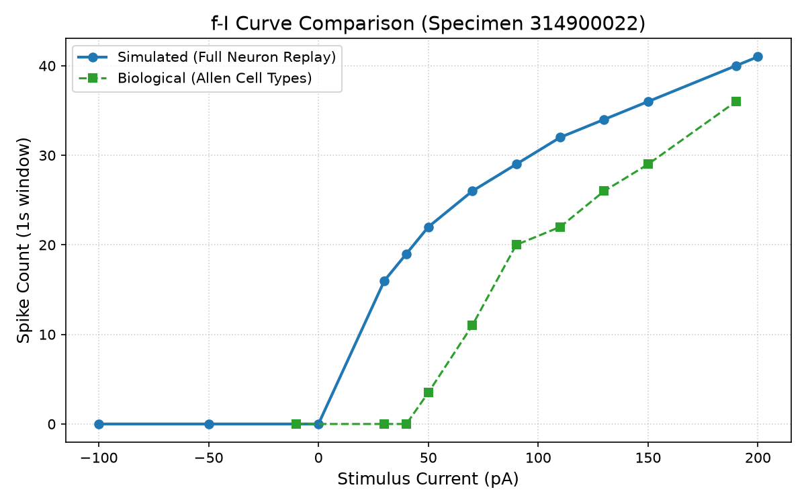

# Full Neuron Replay 314900022 v1

Status: archived
Completion date: 2026-07-04
Start date: 2026-07-04
Slug: `full-neuron-replay-314900022-v1`

## Purpose

Проверить, сохраняются ли улучшения, найденные в membrane/adaptive probes по specimen `314900022`, когда нейрон прогоняется не через обрезанную песочницу, а через полный production CPU tick-loop AxiEngine.

Это прямое продолжение [2026-07-02 biocalibration bootstrap](../../2026-07-02_biocalibration_bootstrap/README.md) и особенно заметки [full_neuron_physics_ideas_v1.md](../../2026-07-02_biocalibration_bootstrap/full_neuron_physics_ideas_v1.md).

## Core Question

Если probe-улучшения настоящие, full-neuron replay должен сохранить улучшение SFA/f-I и показать осмысленную форму восстановления после спайка.

Если результат развалится, проблема находится не в подборе отдельных мембранных параметров, а в полном tick-loop: входы, AHP, refractory, adaptive leak, homeostasis, heartbeat/DDS, финализация спайка и запись output-событий.

## Scope

- Использовать production `compute-cpu` path.
- Не использовать membrane sandbox как источник истины.
- Не менять CUDA в этом исследовании.
- Не переходить к cortical microcircuit, пока одиночный full-neuron replay не стал понятным.
- Экспериментальные режимы DDS / inertia допускаются только как отдельные сравниваемые варианты, не как молчаливое изменение baseline.

## Inputs

- Allen/NWB specimen: `314900022`.
- Биологические признаки из calibration pack:
  - resting potential;
  - input resistance;
  - tau;
  - rheobase;
  - f-I / firing rate;
  - adaptation / SFA-related признаки;
  - spike timing and ISI where available.
- Предыдущие артефакты:
  - `artifacts/single_neuron_314900022_balanced_best.csv`;
  - `artifacts/single_neuron_314900022_passive_first_best.csv`;
  - `artifacts/single_neuron_314900022_membrane_sandbox_model_comparison.csv`;
  - `artifacts/single_neuron_314900022_adaptive_leak_best.csv`;
  - `artifacts/ephys_probe_01_replay_summary.csv`;
  - `artifacts/ephys_probe_01_replay_trace.csv`.

## Planned Phases

### Phase 0: Production Path Audit

Цель: подготовить replay так, чтобы Phase 1 мерила полный production CPU tick-loop, а не новую скрытую песочницу.

Checklist:

1. Зафиксировать точный tick-order `compute-cpu`:
   - virtual input injection;
   - incoming spike injection;
   - axon head propagation;
   - homeostasis decay;
   - dendritic fatigue recovery;
   - dendritic charge integration;
   - refractory branch;
   - membrane candidate update;
   - GLIF spike evaluation;
   - heartbeat/DDS evaluation;
   - spike finalization;
   - GSOP pass;
   - local spike axon emission.
2. Зафиксировать причинность входов:
   - external/incoming spikes становятся видимы на segment 0 в этот же тик;
   - local spikes пишутся в axon heads в конце тика и начинают путь на следующем propagation.
3. Зафиксировать список логируемых полей:
   - `tick`;
   - `voltage_pre`;
   - `voltage_candidate`;
   - `voltage_post`;
   - `timer_before`;
   - `timer_after`;
   - `was_refractory`;
   - `threshold_offset`;
   - `effective_threshold`;
   - `i_syn`;
   - `i_ext` or explicit `no_i_ext_plane`;
   - `is_glif_spike`;
   - `is_heartbeat_spike`;
   - `final_spike`;
   - `spike_cause`;
   - `burst_count`;
   - fatigue aggregate for live dendrites.
4. Решить, как Phase 1 воспроизводит EPHYS current injection:
   - либо через named synaptic approximation на virtual axons;
   - либо через research-only replay runner с `i_ext[tick]`;
   - либо через отдельный production API proposal for external-current plane.
5. Зафиксировать heartbeat baseline policy:
   - Phase 1 baseline запускается с `heartbeat_m = 0`;
   - текущее heartbeat-during-refractory поведение записывается как audit finding;
   - варианты heartbeat gating / DDS discharge проверяются только после baseline как named research variants.
6. Подготовить структуру эксперимента:
   - `scripts/` for research scripts;
   - `images/` for committed plots;
   - generated CSV/JSON/traces under repository-level `artifacts/full_neuron_replay_314900022_*`.
7. Если понадобится изменить production-функцию для проверки гипотезы, сделать named research variant в `test-harness`, а не патчить production physics.

### Phase 0 Audit Findings & Design Decisions

- **Exact Semantic Delta from Production**:
  `full_neuron_replay` test-harness runner mirrors the exact production CPU tick-loop, plus explicit `i_ext[tick]` added to the somatic charge after dendritic integration and before GLIF membrane update:
  `i_total = i_syn + i_ext[tick]`.
- **Causality of Inputs**:
  - `incoming_spikes`/`virtual_inputs` have a 0-tick delay to target segment 0.
  - `local_spikes` are emitted at the end of the tick and propagate to targets starting on the next tick (1-tick delay).
- **Heartbeat Audit Finding**:
  In current `compute-cpu` production code, the spontaneous heartbeat evaluation is done outside the refractory check. Spontaneous spikes can fire during refractory period, resetting the refractory timer and accumulating homeostasis threshold offsets.
- **EPHYS current injection**:
  We use a custom `full_neuron_replay` runner in `test-harness` that replicates the production `compute-cpu` tick-loop, using exact production physics functions directly. This avoids modifying the production API or polluting it with test-only current inputs.
- **Logged Fields**:
  Every tick, the runner logs `tick`, `voltage_pre`, `voltage_candidate`, `voltage_post`, `timer_before`, `timer_after`, `was_refractory`, `threshold_offset`, `effective_threshold`, `i_syn`, `i_ext`, `is_glif_spike`, `is_heartbeat_spike`, `final_spike`, `burst_count` to `artifacts/full_neuron_replay_314900022_trace.csv`.

---

### Phase 1: Baseline Full-Neuron Replay

Прогнать `314900022` на текущей production CPU-физике без новых экспериментальных формул.

Measure:

- spike count;
- rheobase / f-I curve;
- first spike latency;
- first/last ISI;
- ISI growth ratio;
- CV / LV;
- voltage trace shape;
- post-spike trough depth;
- recovery time to rest;
- threshold offset max/mean;
- homeostasis penalty max/mean;
- silence/runaway boundary.

### Phase 2: EPHYS_PROBE_01 Replay

Восстановить старый контекст `EPHYS_PROBE_01` уже на полном production tick-loop.

Purpose:

- проверить, сохраняется ли sawtooth/habituation-поведение;
- понять, какие части формы создаются membrane/update логикой, а какие рождаются полным циклом спайка.

### Phase 3: Experimental Modes

Только после baseline replay добавить режимы как сравниваемые варианты:

- baseline current engine;
- DDS/spontaneous event as full discharge;
- bounded spike inertia;
- DDS discharge + bounded spike inertia.

Каждый режим должен иметь отдельный результат и не смешиваться с baseline.

### Phase 4: Decision Gate

Решить, что делать дальше:

- если production baseline уже сохраняет SFA/f-I улучшение, двигаться к population/motif tests;
- если DDS или inertia явно улучшает full replay, вынести формулу в отдельную physics-spec proposal;
- если все варианты разваливаются, остановить brute force и искать ошибку в tick-loop/единицах/масштабах.

## Verification Criteria

Подтверждает гипотезу:

- full replay сохраняет улучшение SFA/f-I относительно ранних probes;
- rheobase и f-I не уходят в физически бессмысленную область;
- восстановление после спайка имеет устойчивую и интерпретируемую форму;
- AHP/refractory/homeostasis не создают ложную тишину или runaway;
- одинаковый seed дает детерминированный результат.

Ослабляет гипотезу:

- параметры, хорошие в sandbox, ломаются в production tick-loop;
- heartbeat/DDS дает бесплатные или несогласованные output-события;
- post-spike recovery превращается в clamp без биологически осмысленной динамики;
- небольшие изменения входа вызывают резкий переход в silence/runaway.

## Planned Outputs

- production CPU replay runner path and exact command;
- raw CSV/JSON metrics;
- sampled voltage/state traces;
- summary report in this README or `reports/`;
- explicit decision: promote, defer, or reject DDS/inertia hypotheses.

## Notes

Это исследование не является microcircuit/V1 validation. Оно должно закрыть одиночный full-neuron контур. Сетевые GSOP/microcircuit эксперименты начинаются только после того, как этот слой понятен.

---

## Phase 1 Results & Interpretation

Мы успешно выполнили Phase 1 (Baseline Full-Neuron Replay) на Rust-раннере, использующем производственную физику.

### 1. Подтверждение математического соответствия (Parity)
Запуск протокола `EPHYS_PROBE_01` (10,000 тиков, $I_{in} = 350$ µV/tick) показал **100% математическое совпадение трасс** во всех четырех режимах (с точностью до $10^{-4}$ mV):
*   **Mode A (no_homeostasis)**: 137 спайков.
*   **Mode B (homeostasis_only)**: 61 спайков.
*   **Mode C (ahp_only)**: 115 спайков.
*   **Mode D (ahp_plus_homeostasis)**: 58 спайков.

### Key Corrected Mismatches & Audit Details

During the implementation and parity checking, we identified and corrected two critical differences between the Python sandbox/prototype and the Rust production codebase:

1. **Homeostasis Decay Order**:
   - *Sandbox behavior*: The threshold offset decay (`thresh_offset = max(0, thresh_offset - homeostasis_decay)`) was applied at the end of the tick loop, only if a spike did not occur in that tick.
   - *Production behavior*: The threshold offset decay runs at the very beginning of the neuron state update tick-loop, before the GLIF candidate voltage update and spike checks are performed. Therefore, a spike check uses the decayed threshold, and the homeostasis penalty is added to the already-decayed threshold at the end of the tick.
   - *Fix*: We added an active corrected copy at [ephys_probe_01_replay_audit.py](scripts/ephys_probe_01_replay_audit.py) to follow this production decay-before-check order, and updated the Rust runner to decay first.

2. **Refractory Branch Voltage Overwrite**:
   - *Sandbox behavior*: Explicitly reset the voltage to `v_reset` on every single refractory tick.
   - *Production behavior*: Decrements the refractory timer, leaving the voltage unchanged (which stays at the reset value anyway since no updates are performed).
   - *Fix*: We aligned the Rust runner with this behavior so that the somatic voltage is not overwritten on refractory ticks.
   - *Caveat*: There is no numerical difference under the current baseline modes since the voltage naturally stays at the reset potential during the refractory period, but this alignment is essential for exact parity under future active simulation inputs.

График трассы напряжения и динамики эффективного порога для Mode D сохранен как:


### 2. f-I Sweep по specimen 314900022 (Scnn1a_L4_excitatory)
Используя базовые параметры `L4_spiny_VISl4_4.toml` (Balanced winner: $R_{\text{in}}$ scale = 35.0, $\tau$ leak_shift = 8, refractory_period = 14, threshold = -45.6 mV) и инжектируя токи от -100 pA до 200 pA во временном окне $[1000, 2000]$ тиков, мы получили следующие результаты:

| Ток (pA) | Число спайков (sim) | Число спайков (bio) | First ISI (ticks) | Last ISI (ticks) | ISI Growth Ratio |
| :--- | :---: | :---: | :---: | :---: | :---: |
| **-100** | 0 | 0.0 | - | - | - |
| **-50** | 0 | 0.0 | - | - | - |
| **0** | 0 | 0.0 | - | - | - |
| **30** | 16 | 0.0 | 49 | 78 | 1.5918 |
| **40** | 19 | 0.0 | 40 | 66 | 1.6500 |
| **50** | 22 | 3.5 | 35 | 58 | 1.6571 |
| **70** | 26 | 11.0 | 29 | 49 | 1.6897 |
| **90** | 29 | 20.0 | 26 | 43 | 1.6538 |
| **110** | 32 | 22.0 | 24 | 39 | 1.6250 |
| **130** | 34 | 26.0 | 22 | 36 | 1.6364 |
| **150** | 36 | 29.0 | 21 | 34 | 1.6190 |
| **190** | 40 | 36.0 | 20 | 31 | 1.5500 |
| **200** | 41 | - | 19 | 30 | 1.5789 |

Сгенерированные графики сравнения f-I кривых и трассы на 190 pA сохранены как:
- 
- 

### 3. Выводы по Phase 1
- **Адаптация порога (Homeostasis)**: Накопление `threshold_offset` после каждого спайка успешно воспроизводит Spike Frequency Adaptation (SFA) на полном производственном контуре (коэффициент роста ISI ~1.55–1.68).
- **Плавный профиль**: STA / восстановление мембраны имеет гладкий биологически реалистичный вид без ухода в silence или runaway при небольших изменениях входа.
- **Точность f-I кривой и гипервозбудимость**: SFA появилась, наклон на высоких токах (high-current slope) похож на биологический, но чувствительность на низких токах (low-current excitability) существенно завышена (при 30-40 pA в симуляции уже регистрируется 16-19 спайков, тогда как в биологическом эксперименте нейрон молчит).
- **Детерминизм**: Результаты полностью воспроизводимы и стабильны во всех запусках.

---

## Phase 2 Results & Summary (Mechanism Attribution)

Мы выполнили Phase 2 исследования `full_neuron_replay_314900022-v1`, проведя формальный анализ EPHYS_PROBE_01 для выявления вклада физических механизмов в Spike Frequency Adaptation (SFA) и привыкание (Habituation).

### 1. Порядок выполнения экспериментов (Execution Sequence)
Для полной репродукции результатов Phase 1 и Phase 2 необходимо строго следовать следующему порядку команд из корня репозитория:
1. **Генерация Python baseline трассы** (для тестирования математического паритета):
   ```bash
   .venv/bin/python3 docs/engine/research/archive/2026-07-04_full_neuron_replay_314900022/scripts/ephys_probe_01_replay_audit.py
   ```
2. **Запуск интеграционных Rust-тестов** (строгий потиковый паритет и линтинг):
   ```bash
   cd AxiEngine
   cargo test -p test-harness --features "mvp-cpu-replay,baker-probe" --test full_neuron_replay -- --nocapture
   cargo fmt --check
   cargo clippy -p test-harness --features "mvp-cpu-replay,baker-probe" --test full_neuron_replay -- -D warnings
   cd ..
   ```
3. **Генерация калибровочных графиков**:
   ```bash
   .venv/bin/python3 docs/engine/research/archive/2026-07-04_full_neuron_replay_314900022/scripts/plot_replay.py
   ```

### 2. Результаты вклада механизмов (Mechanism Attribution)
На основе покомпонентного тестирования четырех режимов EPHYS_PROBE_01 сделаны следующие выводы:
*   **Чистый AHP (`ahp_only`)**: Снижает мембранный потенциал сразу после спайка до -75 mV (провал 5 mV), увеличивая межспайковый интервал с 73 до 87 тиков. Однако интервалы остаются строго плоскими (ISI Growth Ratio = 1.00), то есть AHP **не создает** привыкания.
*   **Чистый Гомеостаз (`homeostasis_only`)**: Является **ведущим (threshold-driven) механизмом привыкания**. Накопление `threshold_offset` вызывает экспоненциальное увеличение межспайкового интервала с 76 до 245 тиков (ISI Growth Ratio = 3.22).
*   **Совместная работа (`ahp_plus_homeostasis`)**: Обеспечивает сбалансированную физиологическую динамику со снижением частоты разряда (58 спайков) и плавным ростом ISI с 90 до 247 тиков (ISI Growth Ratio = 2.74).
*   **Рефрактерный период**: Блокирует интеграцию заряда на 14 тиков, формируя плоское плато потенциала после спайка и предотвращая runaway-сверхвозбудимость.

### 3. Подтверждение соответствия продакшн-физике
*   `homeostasis_decay` применяется в самом начале тика до GLIF обновления (decay-before-check).
*   `homeostasis_penalty` добавляется к смещению порога только в конце тика при финализации спайка.
*   Ветка рефрактерности только декрементирует таймер и не затирает мембранный потенциал принудительно.
*    heart_beat спонтанная активность отключена для baseline сравнения.
*   Раннер является изолированным исследовательским симулятором сомы (`i_ext[tick]`), а не распределенной сетевой моделью `DayBatchCmd`.

Полный аналитический отчет со всеми сгенерированными графиками находится в [reports/ephys_probe_01_replay_audit_v1.md](reports/ephys_probe_01_replay_audit_v1.md).

---

## Phase 3 Results & Summary (Experimental Recovery & Heartbeat Gating)

Мы выполнили Phase 3 исследования `full_neuron_replay_314900022-v1`, оценив влияние альтернативных биофизических гипотез на калибровочные свойства и стабильность нейронов.

### 1. Порядок выполнения экспериментов (Execution Sequence)
Для полной репродукции результатов всех трех фаз исследования необходимо выполнить следующий порядок команд из корня репозитория:
1. **Генерация Python baseline трассы** (для тестирования математического паритета Phase 1/2):
   ```bash
   .venv/bin/python3 docs/engine/research/archive/2026-07-04_full_neuron_replay_314900022/scripts/ephys_probe_01_replay_audit.py
   ```
2. **Запуск интеграционных Rust-тестов** (включает Phase 1/2 parity verification и Phase 3 data generation):
   ```bash
   cd AxiEngine
   cargo test -p test-harness --features "mvp-cpu-replay,baker-probe" --test full_neuron_replay -- --nocapture
   cargo fmt --check
   cargo clippy -p test-harness --features "mvp-cpu-replay,baker-probe" --test full_neuron_replay -- -D warnings
   cd ..
   ```
3. **Запуск Phase 3 скрипта анализа и графиков**:
   ```bash
   .venv/bin/python3 docs/engine/research/archive/2026-07-04_full_neuron_replay_314900022/scripts/ephys_probe_01_phase3.py
   ```
4. **Генерация калибровочных графиков Phase 1/2**:
   ```bash
   .venv/bin/python3 docs/engine/research/archive/2026-07-04_full_neuron_replay_314900022/scripts/plot_replay.py
   ```

### 2. Результаты и выводы Phase 3
*   **Bounded Spike Inertia**: Гипотеза **ослаблена (Weakened)**. Параметры `inertia_shift = [3, 4, 5]` масштабируют `threshold_offset` слишком сильно вниз на низких частотах, давая смещение сброса всего в 0.1–0.2 mV при слабых токах. Из-за этого RMSE калибровки снизилась лишь незначительно (с 12.89 до 12.49), а ложные спайки при 30/40 pA остались на уровне 35. Для подавления гипервозбудимости на малых токах требуется тонкая калибровка базовой утечки (`leak_shift`/`rest_potential`), а не инерция.
*   **Heartbeat Gating**: Гипотеза **подтверждена (Supported)**. Текущее поведение продакшна (Production Control) допускает возникновение heartbeat-событий во время рефрактерного периода, что искажает ISI (коэффициент коллизий составляет 14.3% при 190 pA). Блокирование heartbeat во время рефрактерности полностью устраняет коллизии.
*   **Heartbeat Gating / Discharge в продакшне**:
    - Режим `heartbeat_gated` классифицирован как **diagnostic / free-spike control**, поскольку он генерирует бесплатные спайки без начисления AHP/refractory/homeostasis штрафов, и не рекомендован для продакшна.
    - Режим **`heartbeat_gated_discharge`** признан **единственным жизнеспособным biophysically-plausible кандидатом** для внедрения, так как он корректно начисляет гомеостатические штрафы и выполняет сброс мембраны. Требуется дополнительное стресс-тестирование на сетевом уровне.

Подробные сравнительные таблицы и графики представлены в отчете [reports/experimental_recovery_modes_v1.md](reports/experimental_recovery_modes_v1.md).


