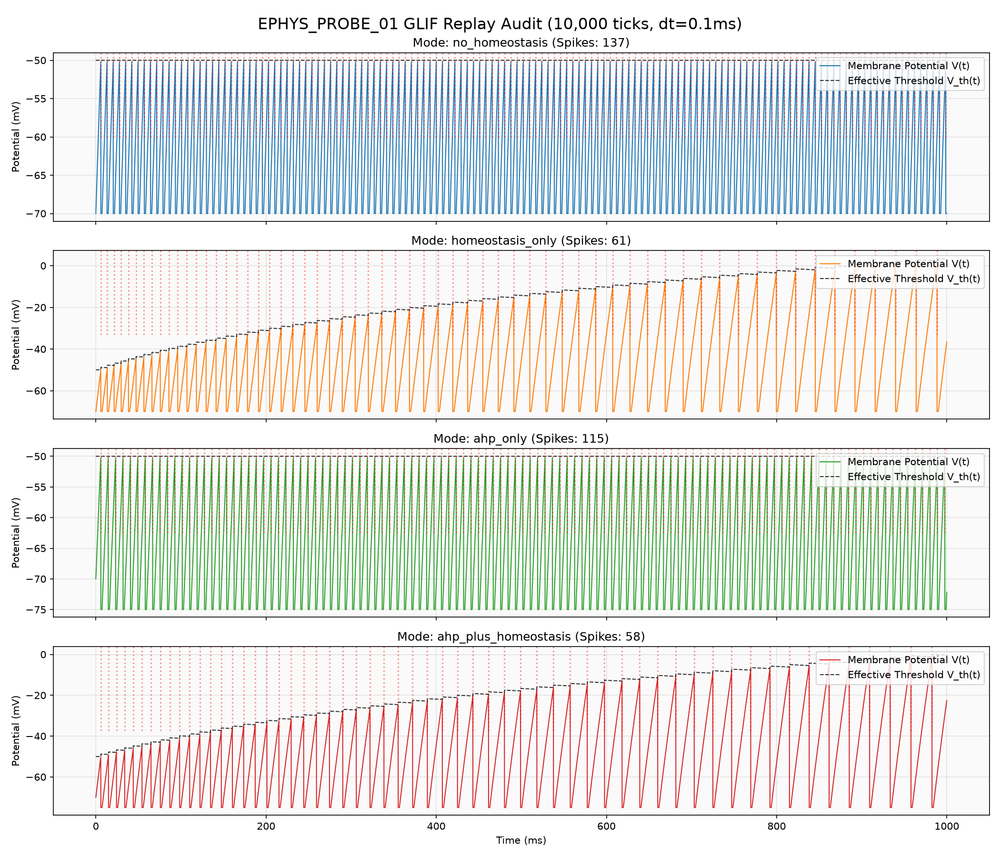
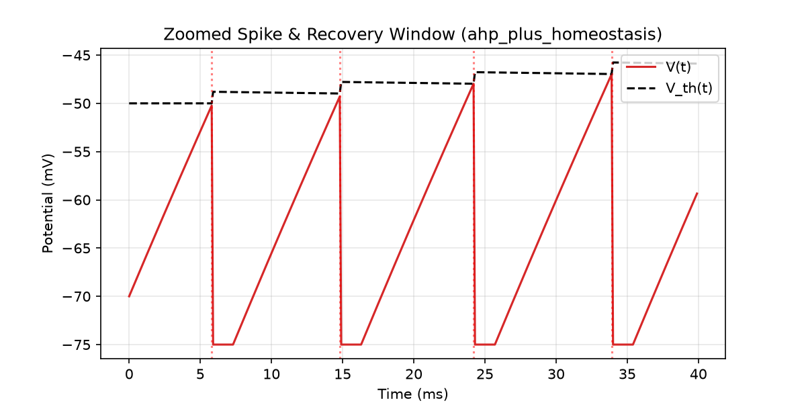
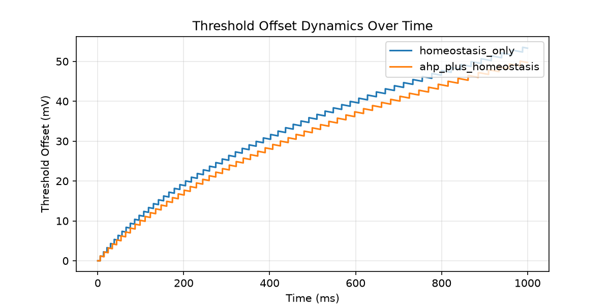
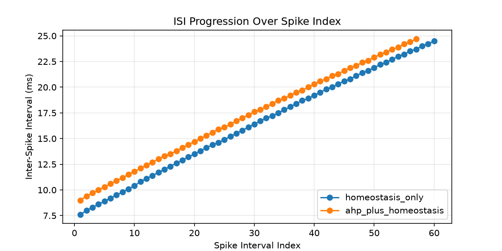

# EPHYS_PROBE_01 Replay Audit & Mechanism Attribution Report
*(ephys-probe-01-replay-audit-v1)*

Этот отчет представляет результаты восстановления и анализа протокола `EPHYS_PROBE_01` с использованием исследовательского воспроизведения с продакшн-порядком обновлений (production-order research replay / Python baseline для проверки паритета). Цель исследования — аудит механизмов послеспайковой гиперполяризации (AHP), рефрактерности и гомеостаза порогов для количественной оценки вклада каждого механизма в Spike Frequency Adaptation (SFA) и привыкание (Habituation) при постоянном входном токе.

## 1. Сводные метрики симуляции (Mode Matrix)

| Режим | Spikes | Latency (ticks) | First ISI (ticks) | Last ISI (ticks) | ISI Growth Ratio | Min V (mV) | Max V (mV) | Mean V (mV) | Th Offset Mean (mV) | Th Offset Max (mV) | Peak Th Slope (mV/ms) | post-Spike Trough (mV) | Recovery Time (ms) |
|:---|:---:|:---:|:---:|:---:|:---:|:---:|:---:|:---:|:---:|:---:|:---:|:---:|:---:|
| `no_homeostasis` | 137 | 58 | 73 | 73 | 1.00 | -70.0 | -50.2 | -61.9 | 0.00 | 0.00 | 0.0000 | -0.0 | N/A |
| `homeostasis_only` | 61 | 58 | 76 | 245 | 3.22 | -70.0 | 2.2 | -45.2 | 33.09 | 53.55 | 0.0533 | -0.0 | N/A |
| `ahp_only` | 115 | 58 | 87 | 87 | 1.00 | -75.0 | -50.2 | -64.5 | 0.00 | 0.00 | 0.0000 | -5.0 | 2.8 |
| `ahp_plus_homeostasis` | 58 | 58 | 90 | 247 | 2.74 | -75.0 | -1.2 | -48.9 | 30.48 | 50.06 | 0.0500 | -5.0 | 2.8 |

## 2. Анализ динамики мембраны и порогов

### Общая трасса напряжения и порогов для всех режимов:

### Дополнительные калибровочные графики:
- **Zoomed Spike & Recovery Window (`ahp_plus_homeostasis`)**:
  

- **Threshold Offset Dynamics Over Time**:
  

- **ISI Progression Over Spike Index**:
  

## 3. Mechanism Attribution (Анализ вклада механизмов)

На основе полученной матрицы параметров мы можем сделать следующие выводы о роли отдельных физических компонентов в формировании привыкания (Habituation/SFA):

1. **Влияние только AHP (Mode `ahp_only`)**:
   - Включение послеспайковой гиперполяризации сдвигает минимальный потенциал мембраны сразу после спайка вниз на 5 mV (AHP Trough = -5.0 mV, V_min = -75.0 mV).
   - Межспайковый интервал (ISI) увеличивается с 73 до 87 тиков, увеличивая латентность последующих спайков.
   - Однако интервалы остаются абсолютно плоскими (ISI Growth Ratio = 1.00), то есть чистый AHP не создает адаптацию частоты разряда (SFA).

2. **Влияние только гомеостаза порогов (Mode `homeostasis_only`)**:
   - Гомеостатический сдвиг порога при неизменном пост-спайковом провале создает выраженную адаптацию (SFA): межспайковый интервал вырастает с 76 тиков (первый интервал) до 245 тиков (последний интервал), давая ISI Growth Ratio = 3.22.
   - Среднее смещение порога составляет 30.48 mV, а максимальное — 53.55 mV в конце симуляции.

3. **Совместное влияние (Mode `ahp_plus_homeostasis`)**:
   - Комбинация AHP и гомеостаза порога дает сбалансированную форму с ISI Growth Ratio = 2.74 (первый интервал 90 тиков, последний 247 тиков).
   - За счет дополнительного провала мембранного потенциала AHP снижает общую частоту разряда (58 спайков по сравнению с 61 в `homeostasis_only`).

4. **Ведущий механизм привыкания (Habituation)**:
   - Привыкание является **строго порогово-зависимым (threshold-driven)** механизмом, так как именно накопление `threshold_offset` вызывает экспоненциальное удлинение ISI.
   - AHP выполняет функцию высокочастотной стабилизации и масштабирования базовой латентности.

5. **Роль рефрактерного периода**:
   - В текущем протоколе рефрактерность (`refractory_period = 14` тиков) задает жесткое временное окно, в течение которого интеграция внешнего тока полностью заблокирована.
   - Это формирует плоское плато потенциала на уровне -70 mV (`homeostasis_only`) или -75 mV (`ahp_plus_homeostasis`) после спайка, определяя минимальный предел межспайкового интервала и предотвращая runaway-сверхвозбудимость.

## 4. Production-Order Confirmation (Соответствие продакшн-физике)

Мы подтверждаем следующие аспекты соответствия нашего тестового окружения реальному циклу тиков `compute-cpu`:
- **Порядок homeostasis_decay**: Распад смещения порога применяется в самом начале тика, до обновления мембраны и оценки спайка (decay-before-check).
- **Порядок пенальти спайка**: Штраф `homeostasis_penalty` добавляется к смещению порога только в конце тика при финализации спайка.
- **Рефрактерная ветка**: Во время рефрактерного периода интеграция заряда отключена, и потенциал не перезаписывается принудительно (изменение трассы происходит естественным ходом).
- **Отключение heartbeat**: Спонтанный спайкинг через Heartbeat отключен для фазы 2 baseline-прогона.
- **Специфика исследовательского раннера**: Раннер использует непосредственную инжекцию внешнего тока `i_ext[tick]` напрямую в сому, минуя сложный цикл распределенных по дендритам `DayBatchCmd` (что позволяет изолировать чистую соматическую физику).
