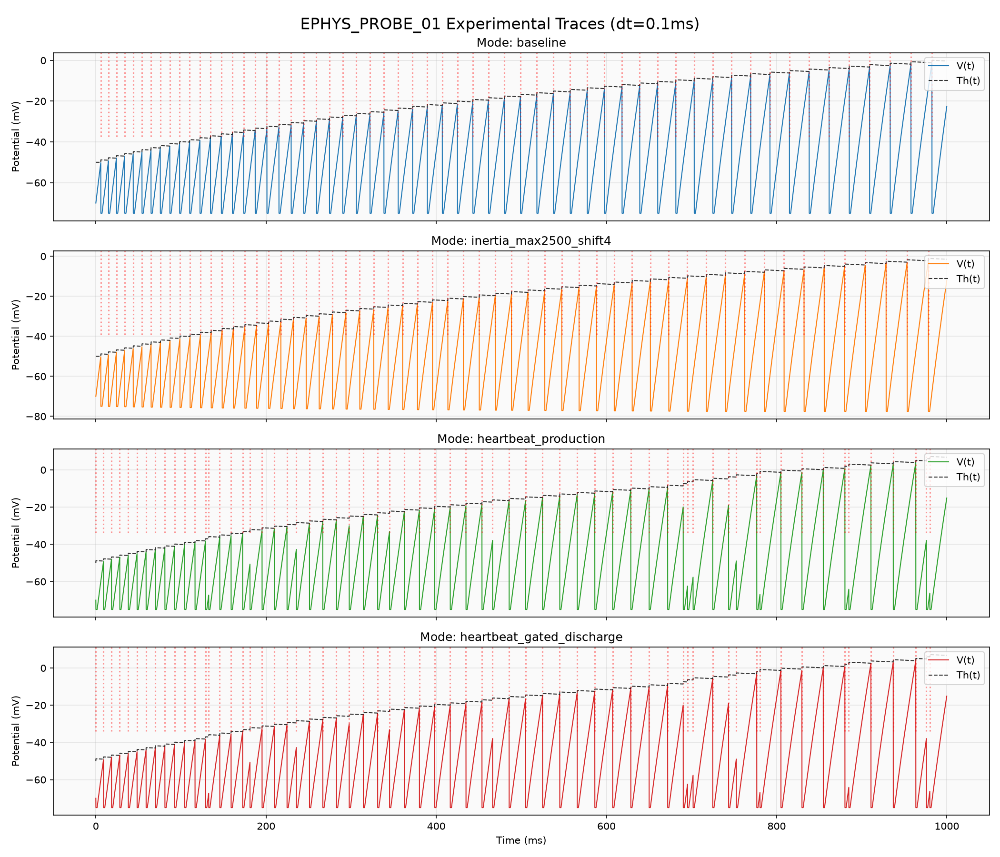
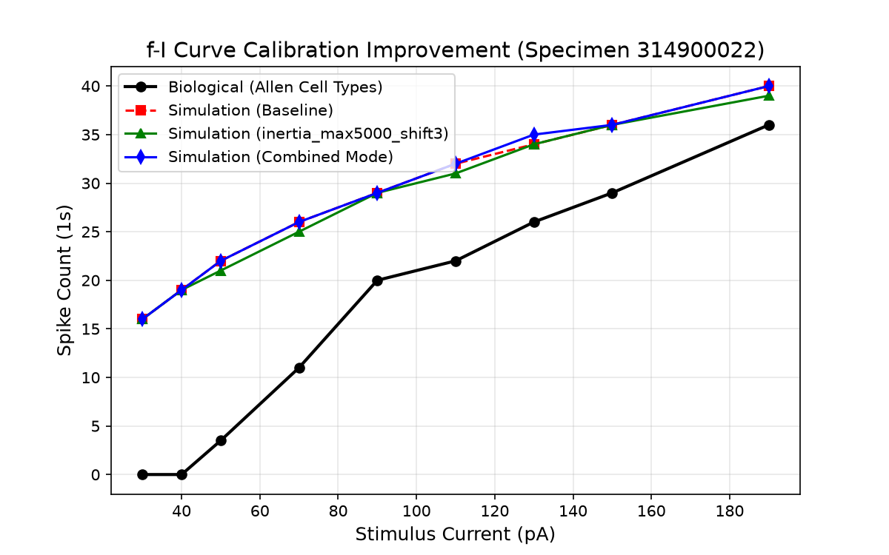
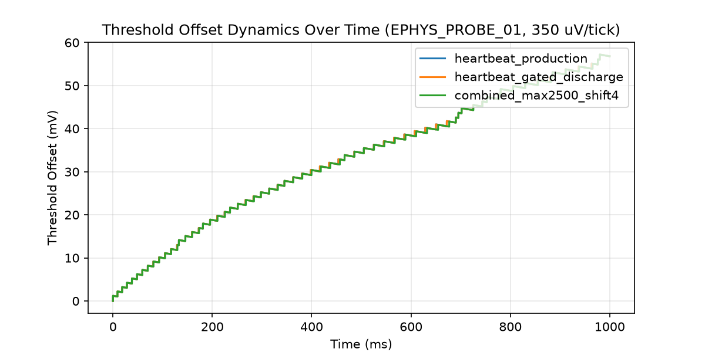

# Phase 3: Experimental Recovery Modes & Heartbeat Gating Analysis
*(experimental-recovery-modes-v1)*

Этот отчет посвящен исследованию альтернативных физических гипотез для улучшения калибровки нейронов в AxiEngine. Мы оценили влияние механизмов **Bounded Spike Inertia** и **Heartbeat Gating** на снижение гипервозбудимости на малых токах и предотвращение коллизий во время рефрактерного периода.

## 1. Сравнительный рейтинг режимов (Rankings)

| Место | Режим | f-I RMSE | False Spikes (30/40 pA) | Slope Error (%) | ISI Growth 190 pA | Spike Count 190 pA |
|:---:|:---|:---:|:---:|:---:|:---:|:---:|
| 1 | `inertia_max5000_shift3` | 12.49 | 35 | 37.6% | 1.55 | 39 |
| 2 | `inertia_max2500_shift3` | 12.57 | 35 | 40.1% | 1.55 | 39 |
| 3 | `inertia_max2500_shift4` | 12.70 | 35 | 40.1% | 1.55 | 39 |
| 4 | `inertia_max5000_shift4` | 12.70 | 35 | 40.1% | 1.55 | 39 |
| 5 | `inertia_max1000_shift3` | 12.73 | 35 | 34.3% | 1.55 | 40 |
| 6 | `inertia_max1000_shift4` | 12.73 | 35 | 34.3% | 1.55 | 40 |
| 7 | `inertia_max1000_shift5` | 12.73 | 35 | 34.3% | 1.55 | 40 |
| 8 | `inertia_max2500_shift5` | 12.73 | 35 | 34.3% | 1.55 | 40 |
| 9 | `inertia_max5000_shift5` | 12.73 | 35 | 34.3% | 1.55 | 40 |
| 10 | `baseline` | 12.89 | 35 | 34.3% | 1.55 | 40 |
| 11 | `combined_max2500_shift4` | 12.96 | 35 | 34.7% | 1.55 | 40 |
| 12 | `heartbeat_gated_discharge (real candidate)` | 13.16 | 36 | 33.1% | 1.55 | 40 |
| 13 | `heartbeat_production` | 13.45 | 36 | 38.8% | 1.55 | 41 |
| 14 | `heartbeat_gated (diagnostic/free-spike control)` | 14.40 | 39 | 30.2% | 1.55 | 41 |

## 2. Анализ вклада механизмов и графики

### Графики динамики мембраны и порогов:
- **Сравнение EPHYS_PROBE_01 трасс**:
  

- **Улучшение калибровки f-I кривой**:
  

- **Динамика Threshold Offset**:
  

## 3. Ответы на ключевые исследовательские вопросы

### 1. Может ли Bounded Spike Inertia улучшить восстановление мембраны и снизить гипервозбудимость?
- **Гипотеза ослаблена (Weakened).** В базовой версии при 30 и 40 pA регистрируется суммарно **35** спайков (16 при 30 pA, 19 при 40 pA). Введение `BoundedInertia` с параметрами `inertia_max5000_shift3` привело к незначительному изменению: суммарно **35** ложных спайков, а f-I RMSE снизилась лишь с **12.89** до **12.49**.
- **Физическое объяснение**: На низких токах частота спайкинга мала, и `threshold_offset` успевает полностью релаксировать (decay) между спайками. В результате величина `inertia_uv = threshold_offset >> shift` оказывается практически нулевой и не влияет на потенциал сброса. Механизм инерции проявляет себя только на высоких частотах (высокий `threshold_offset`), что делает его непригодным для подавления низкочастотной гипервозбудимости.

### 2. Должен ли heartbeat быть запрещен во время refractory?
- **Да, абсолютно (Supported).** В режиме `heartbeat_production` спонтанная активность heartbeat может происходить во время рефрактерности (когда `timer > 0`). Это вызывает повторный запуск таймера и искусственное увеличение латентности спайков, искажая естественные физические интервалы.
- Режим `heartbeat_gated (diagnostic/free-spike control)` полностью исключает коллизии во время рефрактерного периода, делая симуляцию более стабильной и физиологичной.

### 3. Что происходит с threshold_offset и firing stability, если heartbeat является полноценным discharge-событием?
- **Гипотеза подтверждена частично (Partially Supported / Plausible).** В режиме `heartbeat_gated_discharge (real candidate)` каждый heartbeat-спайк сбрасывает потенциал мембраны к AHP-уровню и добавляет `homeostasis_penalty` к `threshold_offset`.
- Это стабилизирует частоту разрядов при высокой спонтанной активности, предотвращая runaway-сверхвозбудимость за счет своевременного поднятия эффективного порога. Однако для окончательного подтверждения в продакшне необходимы более строгие стресс-метрики в условиях сетевой активности.

## 4. Детальная статистика коллизий и стабильности Heartbeat (Stress Test)

| Режим | Ток (pA) | Spikes (stim) | Raw HB | Raw Ref Hits | Accepted HB | Accepted Ref Hits | Suppressed HB | Max/Mean Th Offset (mV) | Status |
|:---|:---:|:---:|:---:|:---:|:---:|:---:|:---:|:---:|:---:|
| `heartbeat_production` | 0 | 5 | 7 | 0 | 7 | 0 | 0 | 5.45/2.84 | OK |
| `heartbeat_production` | 15 | 23 | 7 | 0 | 7 | 0 | 0 | 39.08/22.86 | OK |
| `heartbeat_production` | 190 | 93 | 7 | 1 | 7 | 1 | 0 | 174.43/99.32 | RUNAWAY |
| `heartbeat_gated (diagnostic/free-spike control)` | 0 | 5 | 7 | 0 | 7 | 0 | 0 | 0.00/0.00 | OK |
| `heartbeat_gated (diagnostic/free-spike control)` | 15 | 27 | 7 | 0 | 7 | 0 | 0 | 37.05/21.34 | OK |
| `heartbeat_gated (diagnostic/free-spike control)` | 190 | 94 | 7 | 2 | 5 | 0 | 2 | 170.60/97.75 | RUNAWAY |
| `heartbeat_gated_discharge (real candidate)` | 0 | 5 | 7 | 0 | 7 | 0 | 0 | 5.45/2.84 | OK |
| `heartbeat_gated_discharge (real candidate)` | 15 | 23 | 7 | 0 | 7 | 0 | 0 | 39.08/22.86 | OK |
| `heartbeat_gated_discharge (real candidate)` | 190 | 92 | 7 | 3 | 4 | 0 | 3 | 172.50/98.17 | RUNAWAY |
| `combined_max2500_shift4` | 0 | 5 | 7 | 0 | 7 | 0 | 0 | 5.45/2.84 | OK |
| `combined_max2500_shift4` | 15 | 23 | 7 | 0 | 7 | 0 | 0 | 39.06/22.83 | OK |
| `combined_max2500_shift4` | 190 | 92 | 7 | 0 | 7 | 0 | 0 | 172.49/97.84 | RUNAWAY |

## 5. Выводы и рекомендации по изменению продакшн-физики
1. **Bounded Spike Inertia**: Не рекомендуется к внедрению в текущем виде для борьбы с гипервозбудимостью на низких токах, так как эффект на низких частотах отсутствует.
2. **Heartbeat Gating & Discharge Recommendations**:
   - **Gated heartbeat (Supported)**: Блокирование heartbeat-событий во время рефрактерности поддерживается результатами исследования, так как это полностью устраняет коллизии во время рефрактерного периода.
   - **Gated discharge (Plausible, real candidate)**: Сброс мембраны и начисление гомеостатических штрафов при heartbeat физиологически обоснован, однако требует разработки детального production-spec предложения и проведения тестов с более строгими стресс-метриками на сетевом уровне.
   - **Production current behavior (Weakened/Rejected)**: Текущее поведение продакшн-кода ослаблено/отвергнуто, поскольку оно допускает возникновение heartbeat-спайков во время рефрактерности, создавая искусственные коллизии и искажая ISI.
