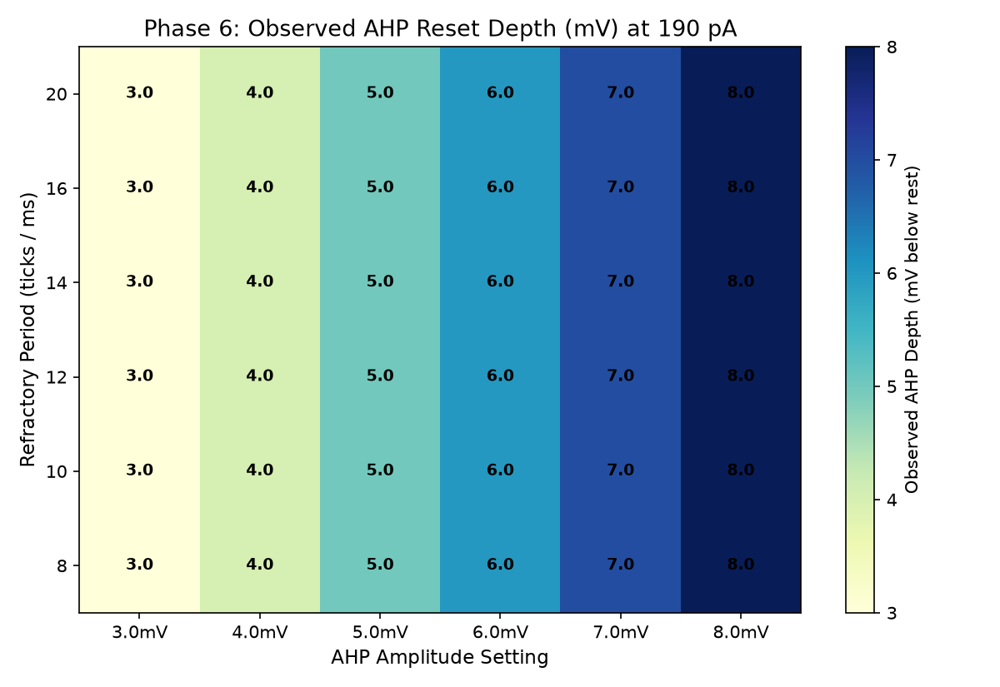
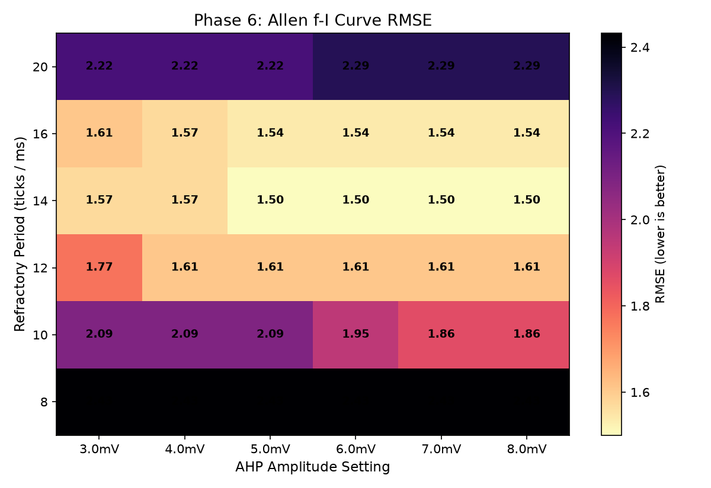
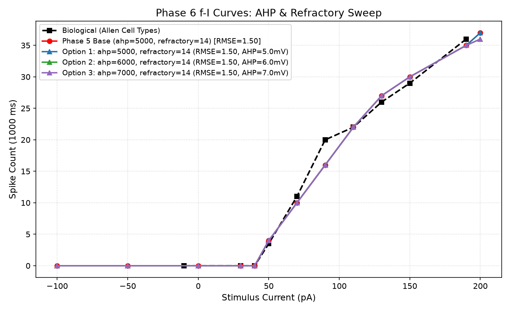
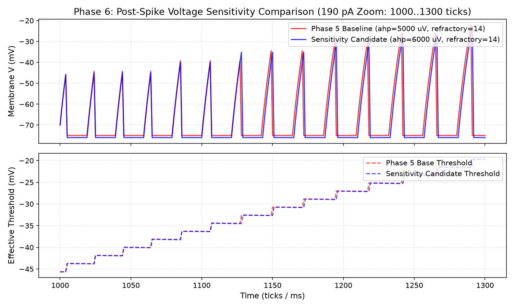

# AHP & Refractory Shape Calibration Report (Specimen 314900022)

Status: completed
Phase: 6 (AHP & Refractory Shape Calibration)
Started: 2026-07-04
Completed: 2026-07-04

## Executive Summary

В процессе Phase 6 исследована изолированная калибровка формы пост-спайкового восстановления (`ahp_amplitude` x `refractory_period`) поверх зафиксированного GLIF_3 кандидата из Phase 4 и Phase 5 (`leak_shift = 4`, `rest_potential = -70000 uV`, `threshold = -45656 uV`, `homeostasis_penalty = 1940`, `homeostasis_decay = 4`).

> [!IMPORTANT]
> **Контекст фазы**: Это GLIF_3+ калибровка формы разряда одиночного нейрона, а не окончательное изменение production-профилей. Пассивная мембрана и гомеостаз строго заморожены.

### Итоговый вердикт Phase 6

**Baseline retained; no improvement found.** (Базовые параметры Phase 5 `ahp_amplitude = 5000 uV`, `refractory_period = 14 ticks` сохранены; улучшений не обнаружено).

### Ключевые выводы

1. **Информативность AHP свит-поиска (Weakly Informative AHP Sweep)**:
   - AHP sweep оказался weakly informative: при `refractory = 14` амплитуды `ahp_amplitude` в диапазоне **5000..8000 uV** дают идентичные характеристики f-I кривой (`RMSE = 1.50`, `sp50 = 4`, `sp190 = 35`).
   - Выбор `ahp_amplitude = 5000 uV` основан на биологическом априоре ~5 mV и принципе минимального изменения от базового состояния (conservative tie-break).
2. **Анализ `refractory_period` (8..20 ticks)**:
   - Сетка по рефрактерному периоду информативна: малые значения (`refractory = 8`) приводят к избыточному высокотоковому отклику (`sp190 = 40` спайков), а длинные (`refractory = 20`) — поддавливают разряд (`sp190 = 31` спайков).
   - Значения `refractory_period = 12..14 ticks` (12..14 ms) являются оптимальными, сохраняя удержание в высокотоковой биологической норме 35–37 спайков на 190 pA (Allen target: 36).
3. **Стабильность SFA и тишины**:
   - На всех комбинациях сетки сохраняется нулевая гипервозбудимость на 30–40 pA (`spikes_30 = 0`, `spikes_40 = 0`).
   - Значения ISI growth ratio на 190 pA варьируются от **1.62 до 2.05** (среднее значение ~1.95), подтверждая удержание спайковой адаптации во всем исследованном диапазоне.

---

## Таблица лучших кандидатов Phase 6

| Кандидат | ahp_amplitude (uV) | refractory (ticks) | spikes_30 | spikes_40 | spikes_50 | spikes_190 | AHP Depth (mV) | f-I RMSE | Gate Status |
| :--- | :--- | :--- | :--- | :--- | :--- | :--- | :--- | :--- | :--- |
| **Biological Bio** | - | - | 0 | 0 | 3.5 | 36 | ~5.0 | 0.00 | Reference |
| **Phase 5 Retained Base** | 5000 | 14 | 0 | 0 | 4 | 35 | 5.0 | 1.50 | **RETAINED BASELINE** |
| Sensitivity Option | 6000 | 14 | 0 | 0 | 4 | 35 | 6.0 | 1.50 | PASS |
| Grid Candidate 3 | 7000 | 14 | 0 | 0 | 4 | 35 | 7.0 | 1.50 | PASS |
| Grid Candidate 4 | 8000 | 14 | 0 | 0 | 4 | 35 | 8.0 | 1.50 | PASS |
| Grid Candidate 5 | 4000 | 14 | 0 | 0 | 4 | 36 | 4.0 | 1.57 | PASS |
| Grid Candidate 6 | 5000 | 12 | 0 | 0 | 4 | 37 | 5.0 | 1.61 | PASS |

---

## Визуальные доказательства

### Heatmap наблюдаемой глубины AHP (mV) на 190 pA

### Heatmap Allen f-I RMSE

### Сравнение f-I кривых

### Детальная динамика формы спайка и сброса AHP: Baseline 5000 uV vs Candidate 6000 uV (Zoom 190 pA)

---

## Ссылка на артефакты

- [Phase 6 AHP Sweep Data](../../../../../artifacts/full_neuron_replay_314900022_phase6_ahp_refractory_sweep.json)
- [Baseline 190 pA Trace](../../../../../artifacts/full_neuron_replay_314900022_phase6_trace_baseline_190.csv)
- [Candidate 190 pA Trace](../../../../../artifacts/full_neuron_replay_314900022_phase6_trace_candidate_190.csv)

---

## Фиксированный профиль-кандидат (GLIF_3+ уровень)

Для specimen `314900022` подтвеждены следующие согласованные параметры:
- `leak_shift`: **4**;
- `rest_potential`: **-70000 uV** (-70.0 mV);
- `threshold`: **-45656 uV**;
- `homeostasis_penalty`: **1940**;
- `homeostasis_decay`: **4**;
- `ahp_amplitude`: **5000 uV**;
- `refractory_period`: **14**.
