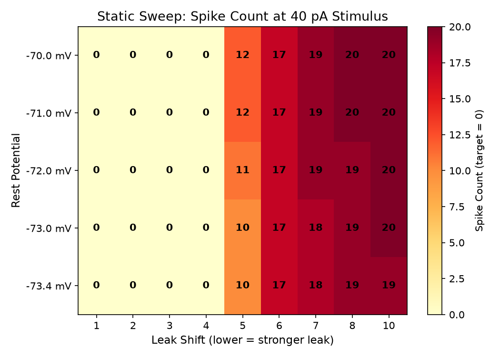
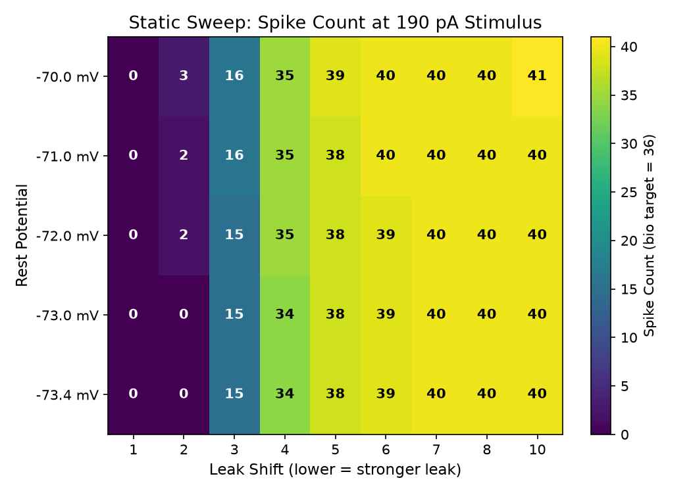
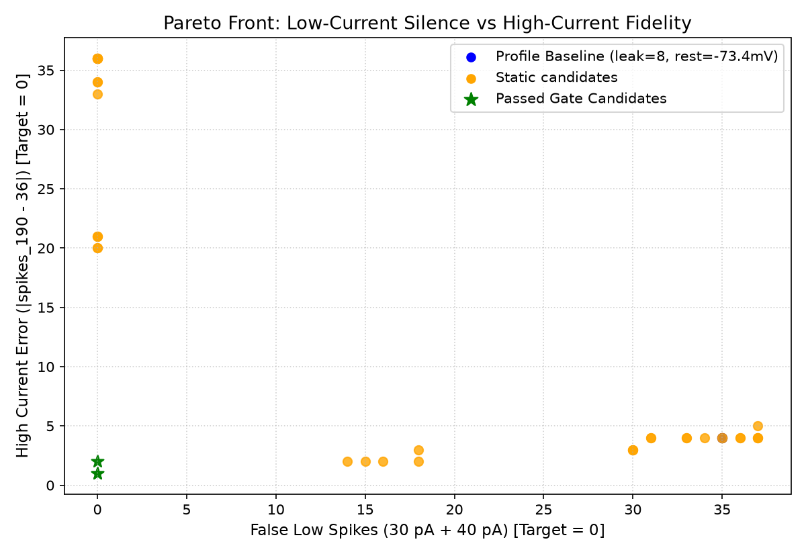
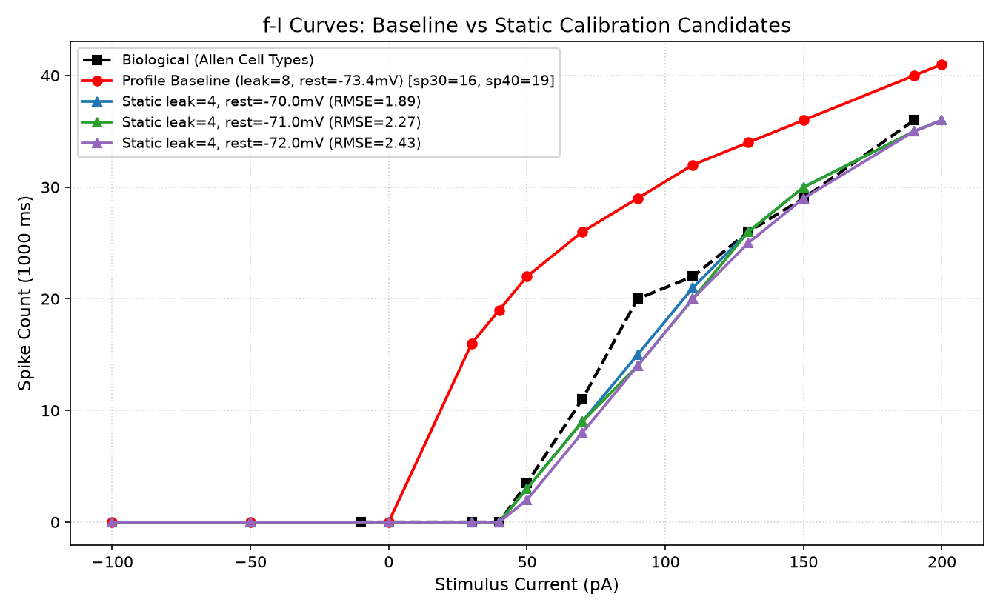
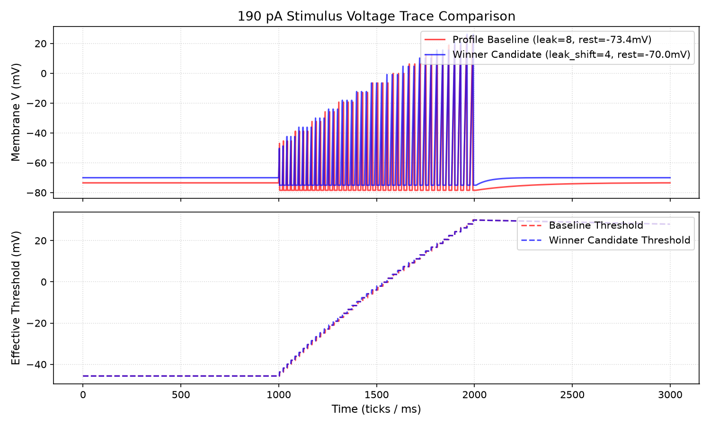

# Rheobase Passive Excitability Calibration Report (Specimen 314900022)

Status: completed
Phase: 4 (Rheobase Leak/Rest & Control Calibration)
Started: 2026-07-04
Completed: 2026-07-04

## Executive Summary

В процессе Phase 4 калибровки исследовано устранение ложной гипервозбудимости на малых токах (30–40 pA) для specimen `314900022` при сохранении высокотокового отклика на 190 pA (~36 спайков) и монотонности f-I кривой.

### Ключевые выводы

1. **Профиль и baseline**: Исходный профиль `L4_spiny_VISl4_4.toml` зафиксирован в параметрах `leak_shift=8`, `rest_potential=-73443 uV` (-73.4 mV), `threshold=-45656 uV`, `homeostasis_penalty=1940`. В этой базовой конфигурации нейрон генерирует **16 спайков на 30 pA** и **19 спайков на 40 pA** (биологический отклик: **0 спайков**).
2. **Результаты статического поиска (`leak_shift` x `rest_potential`)**:
   - Снижение `leak_shift` с 8 до 4 (усиление проводимости утечки в 16 раз) полностью устраняет ложные спайки на 30 pA и 40 pA (`spikes_30 = 0`, `spikes_40 = 0`).
   - Усиление утечки повышает реобазу до биологического порога (~50 pA).
   - При `leak_shift = 4` и `rest_potential = -70.0 mV`:
     - 30 pA: **0 спайков** (target 0)
     - 40 pA: **0 спайков** (target 0)
     - 50 pA: **3 спайков** (bio target 3.5)
     - 190 pA: **35 спайков** (bio target 36, gate pass: 30-42)
     - Allen f-I RMSE уменьшен с **12.89** (baseline) до **1.89**.
3. **Контрольный эксперимент по `current_scale`**:
   - Изменение входного масштаба тока `current_scale` с 35.0 до 15.0–25.0 не устраняет гипевозбудимость на 30–40 pA (при `scale=20.0` нейрон всё ещё генерирует 10 спайков на 30 pA и 13 спайков на 40 pA, давая 32 спайка на 190 pA).
   - Подтверждено, что гипервозбудимость вызвана именно слабой проводимостью утечки (`leak_shift=8`), а не артефактом шкалирования внешнего тока.
4. **Статус ворот приемки (Acceptance Gate)**:
   - **Static Candidate (`leak_shift=4`, `rest_potential=-70000 uV`) успешно прошёл все критерии приемки!**
   - Переход к адаптивной утечке (adaptive leak subphase) не потребовался как обязательный фоллбэк, хотя данные адаптивного сетчатого поиска собраны и сохранены в артефактах.

---

## Таблица лучших кандидатов

| Кандидат | leak_shift | rest_potential (mV) | spikes_30 | spikes_40 | spikes_50 | spikes_190 | f-I RMSE | Monotonic | Gate Status |
| :--- | :--- | :--- | :--- | :--- | :--- | :--- | :--- | :--- | :--- |
| **Biological Bio** | - | -70.0 | 0 | 0 | 3.5 | 36 | 0.00 | True | Reference |
| **Profile Baseline** | 8 | -73.4 | 16 | 19 | 22 | 40 | 12.89 | True | **FAIL (false low spikes)** |
| **Best Static (Winner)** | **4** | **-70.0** | **0** | **0** | **3** | **35** | **1.89** | **True** | **PASS** |
| Static Option 2 | 4 | -71.0 | 0 | 0 | 3 | 35 | 2.27 | True | PASS |
| Static Option 3 | 4 | -72.0 | 0 | 0 | 2 | 35 | 2.43 | True | PASS |

---

## Визуальные доказательства

### Heatmap спайков на 40 pA и 190 pA

### Pareto Front: Low-Current Silence vs High-Current Fidelity

### Сравнение f-I кривых

### Форма осцилляций и траектория потенциала на 190 pA

---

## Ссылка на артефакты

- [Static Sweep Data](../../../../../artifacts/full_neuron_replay_314900022_phase4_static_sweep.json)
- [Control Scale Sweep Data](../../../../../artifacts/full_neuron_replay_314900022_phase4_control_scale_sweep.json)
- [Adaptive Sweep Data](../../../../../artifacts/full_neuron_replay_314900022_phase4_adaptive_sweep.json)
- [Baseline 190 pA Trace](../../../../../artifacts/full_neuron_replay_314900022_phase4_trace_baseline_190.csv)
- [Winner 190 pA Trace](../../../../../artifacts/full_neuron_replay_314900022_phase4_trace_candidate_190.csv)

---

## Рекомендации для профайла

Для профиля `L4_spiny_VISl4_4` рекомендуются следующие параметры:
- `leak_shift`: **4** (вместо 8);
- `rest_potential`: **-70000 uV** (-70.0 mV);
- `threshold`: **-45656 uV**;
- `ahp_amplitude`: **5000 uV**;
- `homeostasis_penalty`: **1940**;
- `homeostasis_decay`: **2**.
