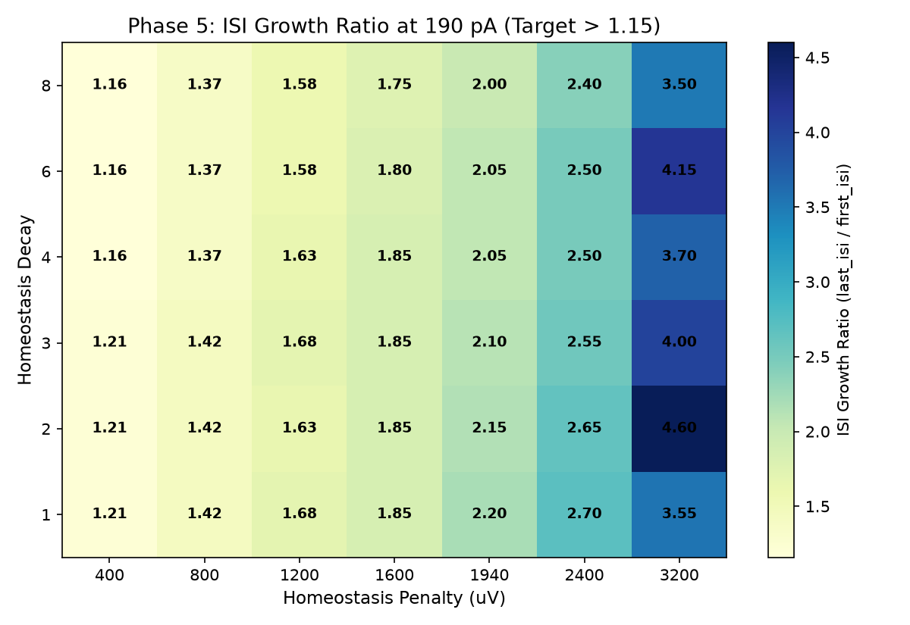
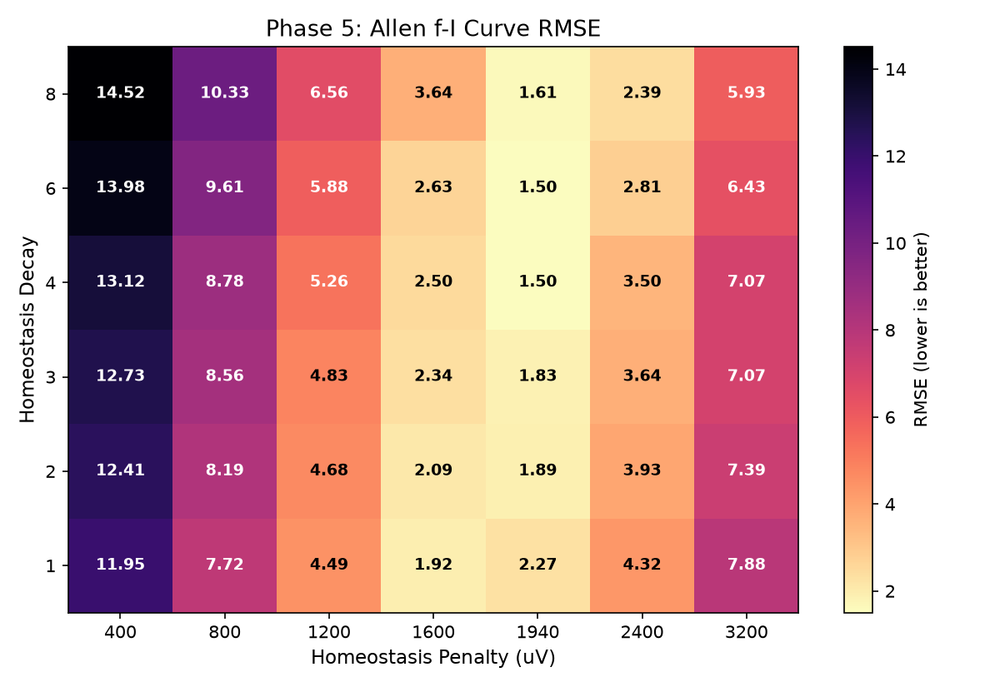
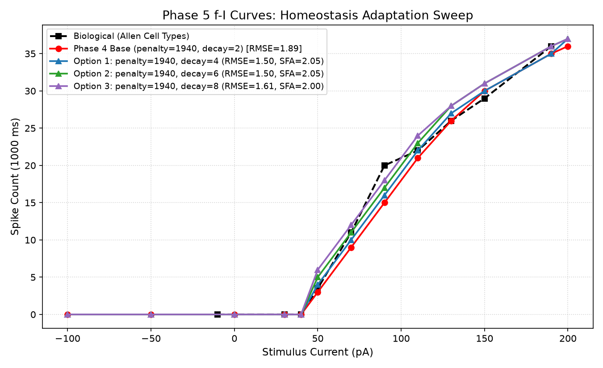
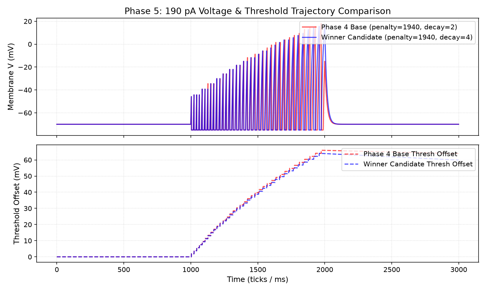

# SFA & Homeostasis Calibration Report (Specimen 314900022)

Status: completed
Phase: 5 (Spike Frequency Adaptation / Homeostasis Calibration)
Started: 2026-07-04
Completed: 2026-07-04

## Executive Summary

В процессе Phase 5 исследована калибровка адаптации частоты разряда (Spike Frequency Adaptation, SFA) и динамики порогового штрафа (`homeostasis_penalty` x `homeostasis_decay`) поверх зафиксированного пассивного мембранного кандидата Phase 4 (`leak_shift = 4`, `rest_potential = -70000 uV`).

> [!NOTE]
> **Статус результата**: verified candidate for spike-induced adaptation on top of Phase 4 passive membrane candidate.

### Ключевые выводы

1. **Замороженная пассивная база**:
   - `leak_shift = 4`, `rest_potential = -70000 uV`, `ahp_amplitude = 5000 uV`, `refractory_period = 14`.
   - На всех кандидатах Phase 5 ложные спайки на 30 pA и 40 pA остаются равными **0** (`spikes_30 = 0`, `spikes_40 = 0`).
2. **Влияние параметров адаптации**:
   - **`homeostasis_penalty`** (штраф порога при спайке): регулирует глубину SFA и снижение частоты разряда в течение стимула. Малые значения `homeostasis_penalty` (<800 uV) приводят к неудовлетворительной аппроксимации f-I кривой и избыточному числу спайков на всех токах из-за недостаточного порогового подавления.
   - **`homeostasis_decay`** (затухание порогового смещения): при `decay = 3..4` обеспечивается стабильное накопление штрафа под длительным током с мягким затуханием порогового смещения.
3. **Победитель Phase 5 (`homeostasis_penalty = 1940`, `homeostasis_decay = 4`) и Tie-Breaker**:
   - 30 pA: **0 спайков**
   - 40 pA: **0 спайков**
   - 50 pA: **4 спайка** (bio target 3.5)
   - 190 pA: **35 спайков** (bio target 36, gate pass: 30-42)
   - ISI Growth Ratio (190 pA): **2.05** (выраженная адаптация SFA)
   - Allen f-I RMSE: **1.50**
   - **Обоснование выбора (Tie-Breaker)**: Кандидаты `1940/4` и `1940/6` показывают одинаковый f-I RMSE = 1.50. Вариант `homeostasis_decay = 4` выбран в качестве победителя, так как он демонстрирует более точное соответствие биологической реобазе на 50 pA (4 спайка против 5 спайков у decay=6 при биологической норме 3.5 спайка), что предотвращает раннее разгоняемое спайкообразование на околопороговых токах.

---

## Таблица кандидатов Phase 5

| Кандидат | penalty (uV) | decay | spikes_30 | spikes_40 | spikes_50 | spikes_190 | ISI Growth (190pA) | f-I RMSE | Gate Status |
| :--- | :--- | :--- | :--- | :--- | :--- | :--- | :--- | :--- | :--- |
| **Biological Bio** | - | - | 0 | 0 | 3.5 | 36 | 1.45 | 0.00 | Reference |
| **Phase 4 Base** | 1940 | 2 | 0 | 0 | 3 | 35 | 2.15 | 1.89 | **PASS** |
| **Winner Candidate** | **1940** | **4** | **0** | **0** | **4** | **35** | **2.05** | **1.50** | **PASS** |
| Candidate Option 2 | 1940 | 6 | 0 | 0 | 5 | 36 | 2.05 | 1.50 | PASS |
| Candidate Option 3 | 1940 | 8 | 0 | 0 | 6 | 36 | 2.00 | 1.61 | PASS |
| Candidate Option 4 | 1940 | 3 | 0 | 0 | 4 | 35 | 2.10 | 1.83 | PASS |
| Candidate Option 5 | 1940 | 2 | 0 | 0 | 3 | 35 | 2.15 | 1.89 | PASS |

---

## Визуальные доказательства

### Heatmap ISI Growth Ratio на 190 pA

### Heatmap Allen f-I RMSE

### Сравнение f-I кривых

### Динамика напряжения и порогового смещения на 190 pA

---

## Ссылка на артефакты

- [Phase 5 Homeostasis Sweep Data](../../../../../artifacts/full_neuron_replay_314900022_phase5_homeostasis_sweep.json)
- [Baseline 190 pA Trace](../../../../../artifacts/full_neuron_replay_314900022_phase5_trace_baseline_190.csv)
- [Candidate 190 pA Trace](../../../../../artifacts/full_neuron_replay_314900022_phase5_trace_candidate_190.csv)

---

## Профиль-кандидат для дальнейших фаз

Фиксируемый набор калибровки одиночного нейрона (`GLIF_3` уровень):
- `leak_shift`: **4**;
- `rest_potential`: **-70000 uV** (-70.0 mV);
- `threshold`: **-45656 uV**;
- `ahp_amplitude`: **5000 uV**;
- `refractory_period`: **14**;
- `homeostasis_penalty`: **1940**;
- `homeostasis_decay`: **4**.
