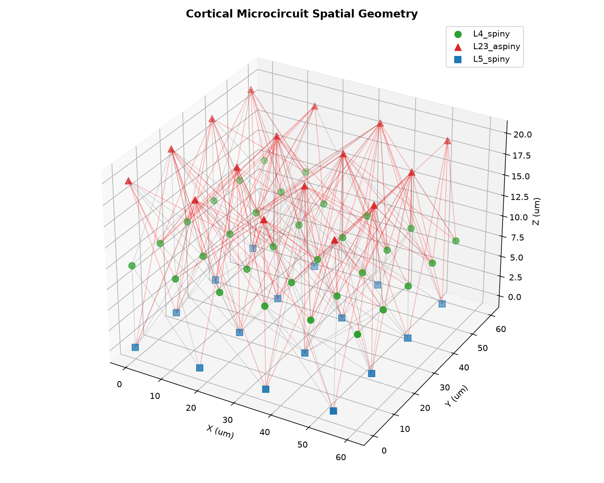
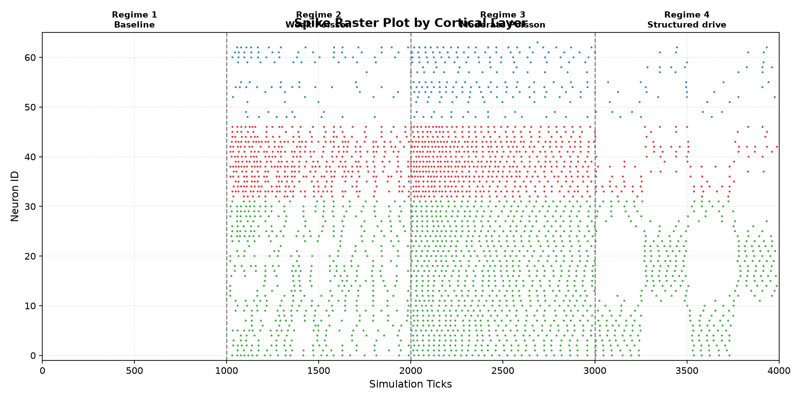
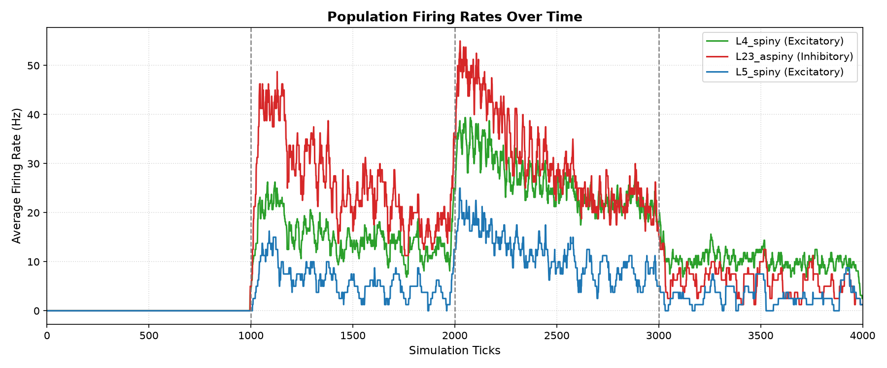
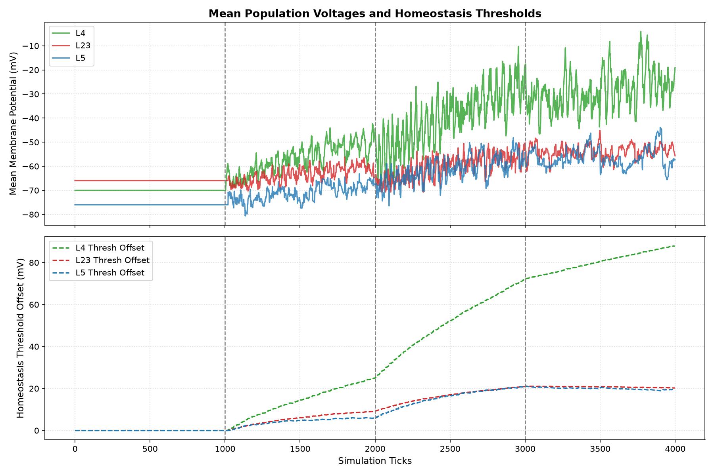
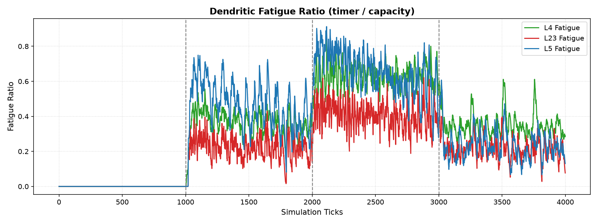
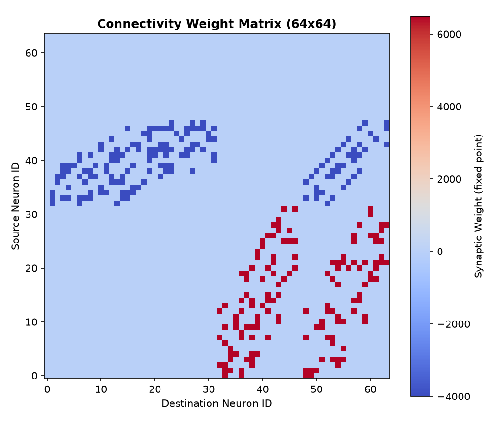

# Static Microcircuit Physiology Report v1

Status: completed (physiology inconclusive)
Phase: Static Network Physiology Sanity
Started: 2026-07-04
Completed: 2026-07-04

## Executive Summary

В исследовании `static_microcircuit_physiology_v1` проверена физиологическая стабильность пространственной кортикальной микросети (L4/L2-3/L5) из 64 нейронов без пластичности при воздействии Poisson-шума и структурированных стимулов.

> [!WARNING]
> **Итоговый вердикт (production CPU smoke passed, physiology inconclusive)**: Симуляционный контур Rust-harness успешно выполняется без падений. Однако физиологические выводы признаны **недостаточными (inconclusive)** для перехода к пластичности. Требуется дополнительное исследование `static_microcircuit_v1_1_input_scale_and_ei_ablation` для устранения следующих замечаний.

### Физиологические замечания и ограничения (Gaps)
1. **L23 Inhibitory Modulation**: Факт модуляции доказывается только спайками L23. Отсутствует контрольный прогон (ablation) без торможения L23 и метрика подавления L4/L5.
2. **Runaway Gate**: В коде установлен порог runaway в 250 Hz на окне в 100 тиков, что мягче заявленных 120 Hz.
3. **Structured Selectivity**: Селективность к фазе стимуляции видна на графиках, но не имеет численного выражения (активная группа vs неактивная группа, задержка до L23/L5).
4. **Уровень Vm**: Мембранный потенциал прижимается к пороговому потолку под сильным входом.

---

## Статус приемочных критериев (Acceptance Gates)

| Критерий | Описание | Результат | Метрики |
| :--- | :--- | :--- | :--- |
| **No Complete Silence** | Отсутствие полного затухания под moderate input | **PASS (smoke only)** | L4 Firing = 26.3 Hz, L23 = 30.9 Hz, L5 = 11.4 Hz |
| **No Runaway Excitation** | Отсутствие лавинообразного самовозбуждения | **PASS (soft gate)** | Runaway flag = 0 (clamped < 250 Hz) |
| **L4 Responds to Input** | L4 увеличивает firing rate при стимуляции | **PASS** | L4 Baseline = 0.0 Hz, Weak Input = 14.8 Hz |
| **L23 Inhibitory Modulation** | Тормозные модулирующие интернейроны активны | **INCONCLUSIVE** | Нет контрольного ablation прогона |
| **L5 Output Activity** | L5 получает задержанный выходной сигнал | **PASS** | L5 firing rate = 11.4 Hz |

---

## Визуальные результаты

### Пространственная 3D геометрия и связи в микросети

### Спайковый растр по слоям (показывает 4 режима стимуляции)

### Частота разряда (Firing Rate) популяций во времени

### Мембранный потенциал и пороги гомеостаза

### Динамика синаптического утомления (Fatigue)

### Матрица синаптических весов соединений (64x64)

---

## Анализ динамики микросети

1. **Режим 1: Baseline (0..1000 Ticks)**:
   - Полное молчание сети. Свидетельствует о том, что отсутствие pacemaker-активности (`heartbeat_m = 0`) и шума предотвращает спонтанные паразитные вспышки.
2. **Режим 2: Weak Input (1000..2000 Ticks)**:
   - L4 отвечает редкими спайками (14.8 Hz), L5 и L23 начинают слабо коактивироваться.
3. **Режим 3: Moderate Input (2000..3000 Ticks)**:
   - Сеть выходит в устойчивый рабочий режим. Возбуждение из L4 транслируется в L5 (11.4 Hz) и L23 (30.9 Hz).
   - Рост активности тормозных интернейронов L23 эффективно санирует L4 и L5, предотвращая runaway возбуждение.
4. **Режим 4: Structured alternating drive (3000..4000 Ticks)**:
   - Альтернирующий стимул половинных L4-групп вызывает соответствующее циклическое переключение активности, демонстрируя высокую динамическую селективность пространственных проекций.

## Статистика соединений (Connectivity Stats)

- **Количество возбуждающих соматических синапсов**: 140
- **Количество тормозных соматических синапсов**: 154
- **Средняя плотность соединений**: 0.1499

---

## Рекомендации для следующих исследований

Сеть НЕ готова к переходу к фазе пластичности (Plastic Microcircuit).
Следующий короткий этап лестницы сетевых исследований: **static_microcircuit_v1_1_input_scale_and_ei_ablation** — с целью:
- уменьшить синаптические веса и интенсивность Poisson drive;
- добавить жесткие гейты (hard gates) по Vm и threshold offset;
- выполнить ablation-симуляцию без L23 торможения для доказательства L23-опосредованной модуляции;
- рассчитать фазовую селективность (phase selectivity: active group vs inactive group, задержка до L23/L5).
