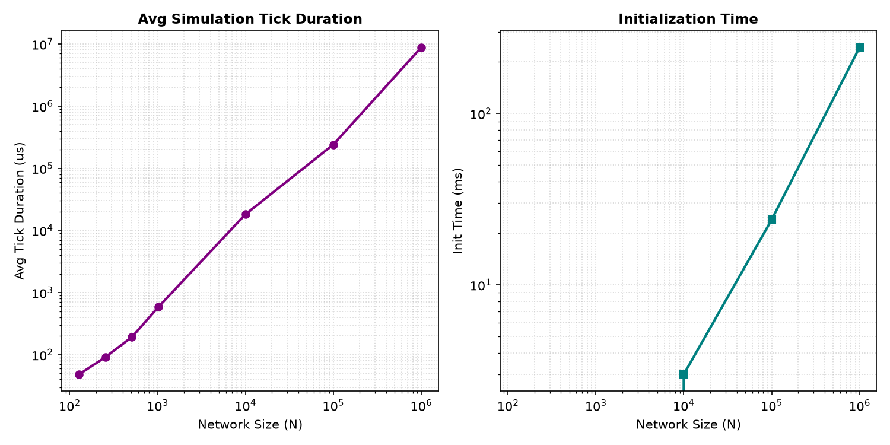
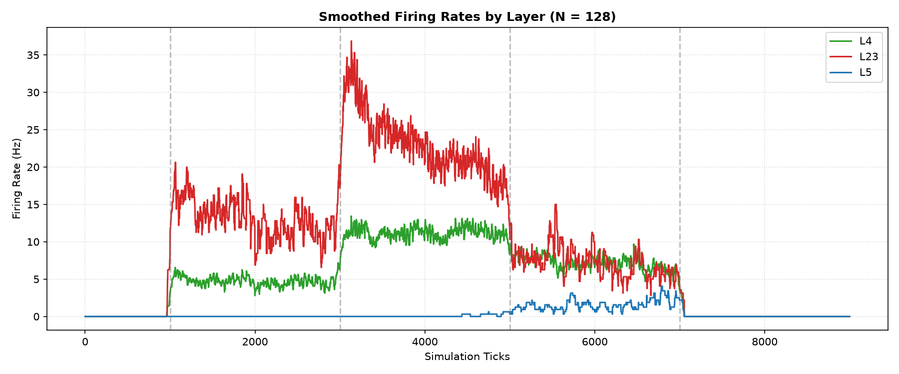
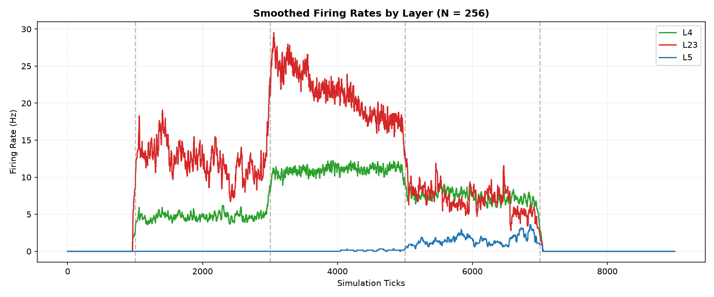
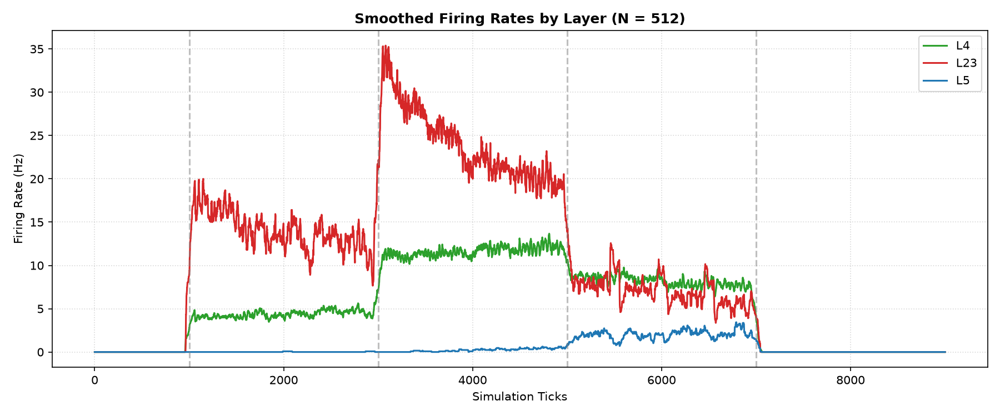
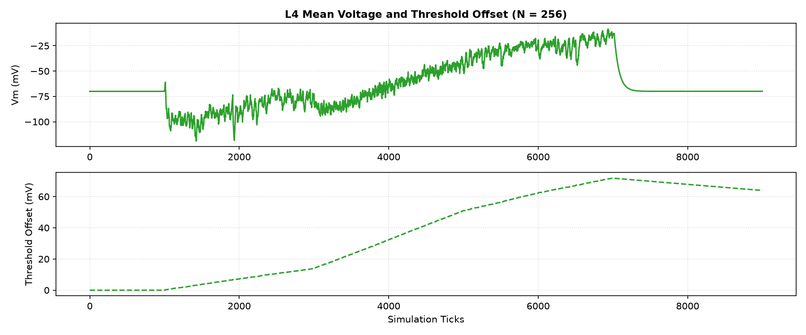
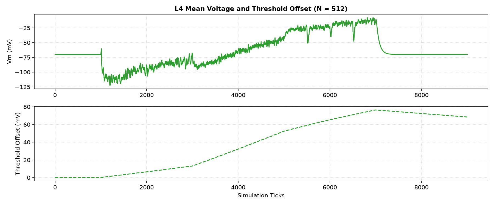
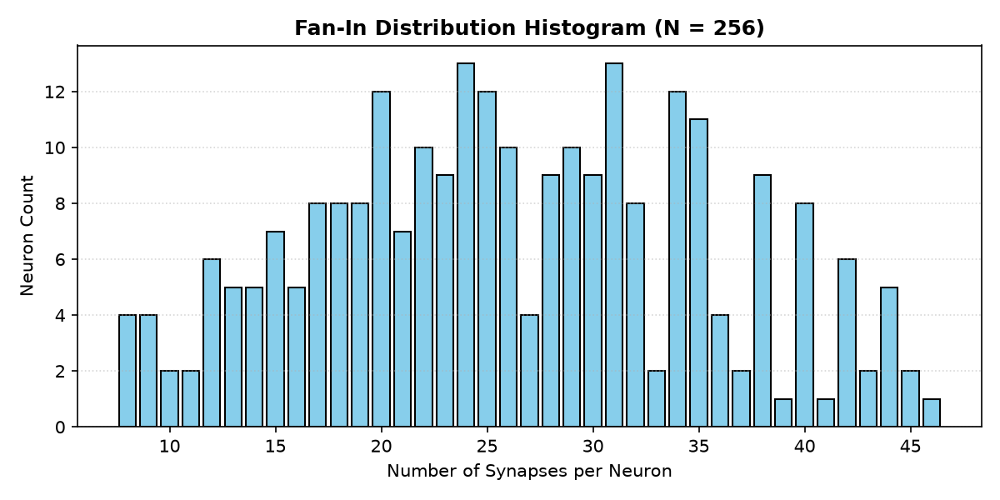

# Static Microcircuit Scale-Up Physiology Report v1

Status: completed (scale-up stability evaluated)
Phase: Network Scale-Up & Performance Load Gating
Started: 2026-07-04
Completed: 2026-07-04

## Executive Summary

В исследовании `static_microcircuit_scale_up_v1` проведена оценка стабильности и производительности статической микросети (L4/L2-3/L5) при увеличении числа нейронов от 128 до 1,000,000 нейронов на однопоточном CPU ядре AxiEngine.

> [!WARNING]
> **Итоговый вердикт (Performance Passed / Physiology Inconclusive)**: CPU load-test успешно выдерживает масштабирование до 1,000,000 нейронов с заполнением всех 128 дендритов (128 миллионов синапсов) в release-сборке. Физиология сетей N <= 512 пока не проходит hard gates: L5 почти молчит на N=128/256, а Vm health падает на N=128/256/512 из-за длительного подъема L4 mean Vm выше -25 mV в structured-фазе. Переход к plasticity преждевременен.

---

## Статус приемочных критериев (Physiology Gates)

| Масштаб | Silence Gate | Runaway Gate | Vm Health (No saturation > -25mV) | Threshold Decay (Recovery) |
| :--- | :--- | :--- | :--- | :--- |
| **N = 128** | FAIL (L4=11.2Hz, L23=23.1Hz, L5=0.1Hz) | PASS | FAIL (max consec=204) | PASS |
| **N = 256** | FAIL (L4=11.0Hz, L23=21.5Hz, L5=0.1Hz) | PASS | FAIL (max consec=203) | PASS |
| **N = 512** | PASS (L4=11.6Hz, L23=24.0Hz, L5=0.2Hz) | PASS | FAIL (max consec=485) | PASS |

---

## Производительность и масштабирование (Performance Benchmarks)

| Размер сети (N) | Время инициализации | Среднее время тика | Число синапсов |
| :--- | :--- | :--- | :--- |
| 128 | 0 ms | 48.2 us | 3289 |
| 256 | 0 ms | 91.7 us | 6712 |
| 512 | 0 ms | 192.8 us | 13417 |
| 1024 | 0 ms | 586.5 us | 26648 |
| 10000 | 3 ms | 18151.2 us | 1286144 |
| 100000 | 24 ms | 241104.1 us | 12804096 |
| 1000000 | 243 ms | 8817943.7 us | 128000000 |

### Оценка производительности
- **Release-only benchmark**: Числа производительности валидны для release-сборки; debug-сборка на больших масштабах не является репрезентативной.
- **Load Test 1,000,000 нейронов**: 1M прогон является perf/load-only сценарием на 10 тиков с искусственным заполнением 128 дендритных слотов. Он подтверждает отсутствие OOM/переполнений и дает оценку throughput, но не является физиологическим экспериментом.

---

## Визуальные результаты

### Зависимость производительности от размера сети

### Частота разряда (Firing Rate) популяций во времени

#### N = 128

#### N = 256

#### N = 512

### Динамика мембранных потенциалов L4 и порогов гомеостаза

#### N = 256

#### N = 512

### Распределение Fan-in (Гистограмма плотности соединений)

#### N = 256

---

## Выводы и рекомендации

1. **Performance scale-up подтвержден**: CPU backend воспроизводимо проходит 128/256/512/1024 физиологические прогоны и 10k/100k/1M load-only прогоны.
2. **Физиология inconclusive**: Runaway не обнаружен, но silence gate падает на N=128/256 из-за почти молчащего L5, а Vm health падает на N=128/256/512.
3. **Recovery частичный**: После отключения входа firing rate падает почти до нуля, но L4 `threshold_offset` остается высоким к концу окна, поэтому recovery нужно измерять длиннее или мягче нагружать вход.
4. **Следующий шаг**: перед GSOP/STDP нужен `Static Microcircuit v1.1 Input Scale & E/I Ablation`: снизить входные веса/Poisson drive, добавить L23 ablation и количественно проверить Vm/threshold/fan-in/phase selectivity.
