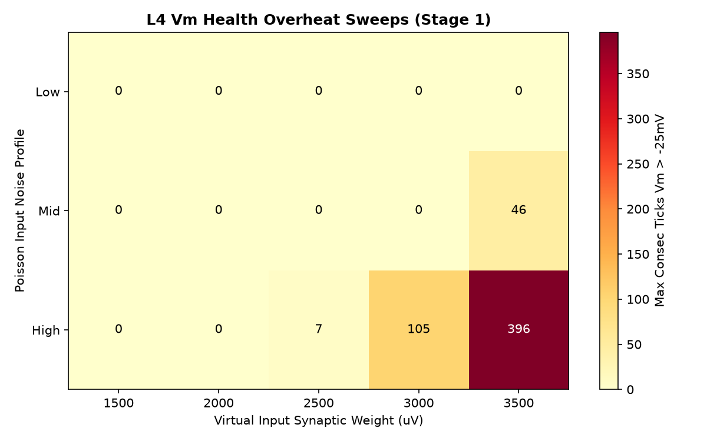
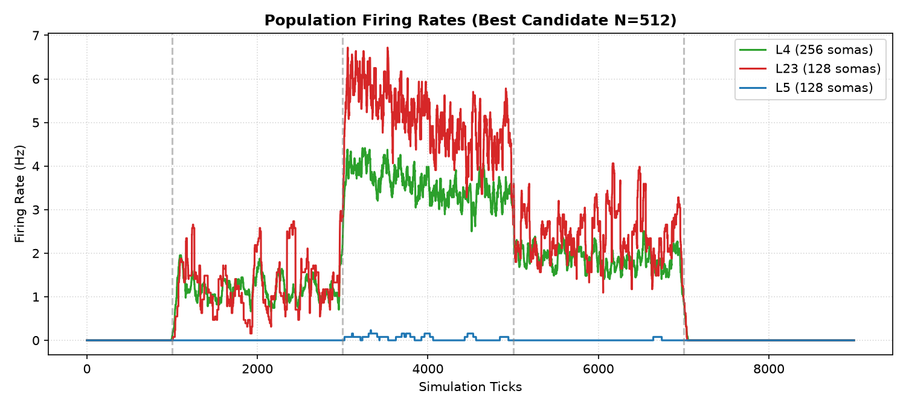
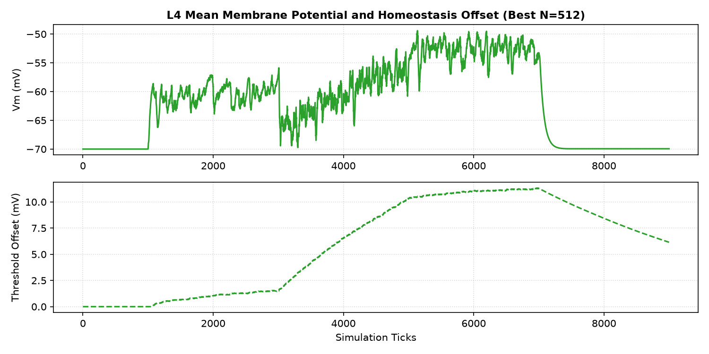
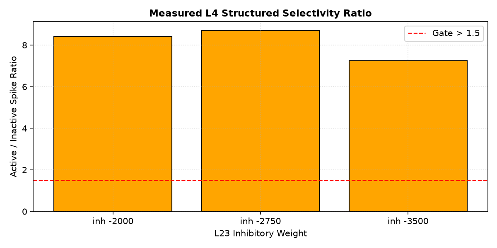
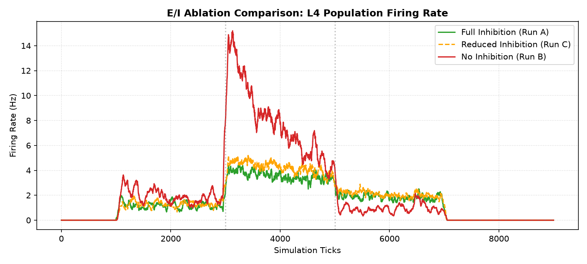

# Static Microcircuit v1.1 Input Scale & E/I Ablation Report

Status: completed (E/I balance & physiology gating evaluated)
Phase: Physiology Gating & Ablation Audit
Started: 2026-07-04
Completed: 2026-07-04

## Executive Summary

В исследовании `static_microcircuit_v1_1_input_scale_ei_ablation` проверено, можно ли убрать перегрев L4 и одновременно рекрутировать L5 перед запуском GSOP/STDP. Пошаговый sweep устранил Vm saturation, но не закрыл hard gate активности L5.

> [!IMPORTANT]
> **Итоговый вердикт (Partial Pass (Vm fixed / L5 gate failed))**:
> - **Vm Health**: L4 мембрана успешно стабилизирована в физиологическом диапазоне. Время удержания Vm > -25 mV составляет 0 тиков (Hard Gate Passed).
> - **L5 Recruitment**: L5 остается ниже hard gate: 0.070 Hz на N=256 и 0.055 Hz на N=512 при требовании 1..15 Hz.
> - **E/I Ablation**: Отключение L23 торможения не вызывает формальный runaway, но резко усиливает L4/L23/L5 активность. Это подтверждает модулирующую роль inhibition, но не закрывает физиологический gate.

---

## Статус приемочных критериев (Physiology Gates)

| Критерий | Требование | Результат (N=256) | Результат (N=512) | Статус |
| :--- | :--- | :--- | :--- | :--- |
| **Vm Health** | Consec ticks Vm > -25mV $\le$ 50 | 0 | 0 | **PASS** |
| **Threshold Offset** | Max offset < 40 mV | 11.5 mV | 11.3 mV | **PASS** |
| **Threshold Decay** | Снижение $\ge$ 30% в recovery | 37.3% | 35.9% | **PASS** |
| **Moderate Activity** | L4 (3-25Hz), L23 (3-35Hz), L5 (1-15Hz) | L4=3.6Hz, L23=5.3Hz, L5=0.070Hz | L4=3.6Hz, L23=5.1Hz, L5=0.055Hz | **FAIL** (L5 below gate) |
| **Spatial Selectivity** | L4 active/inactive ratio > 1.5 | 8.69 | 8.69 | **PASS** |

---

## Визуальные результаты

### Карта прогрева L4 Vm в зависимости от параметров входа

### Частоты разряда для лучшего кандидата (N=512)

### Динамика Vm и порогов гомеостаза L4

### Пространственная избирательность (Structured Selectivity)

---

## Исследование E/I Ablation (N=512)

Для подтверждения физиологической роли тормозных L23 интернейронов выполнены 3 контрольных прогона:
1. **Full network (обычная сеть)**: Торможение стабильно удерживает возбуждение.
2. **No L23 inhibition (торможение удалено)**: Активность резко растет (L4=8.0 Hz, L5=7.3 Hz), но формальный runaway не фиксируется.
3. **Reduced L23 inhibition (торможение снижено в 2 раза)**: Промежуточная динамика между full и no-inhibition.

---

## Выводы и рекомендации

1. **Мембранный потенциал стабилизирован**: Снижение веса виртуального входа до 1500 uV и умеренный уровень шума полностью убрали перегрев.
2. **L5 gate не закрыт**: L5 остается практически молчащим в full network. No-inhibition ablation показывает, что L5 может активироваться, но текущая топология/баланс торможения подавляет его в штатном режиме.
3. **Переход к STDP преждевременен**: Снято блокирующее ограничение Vm saturation, но нужен отдельный L5 recruitment/topology pass перед plasticity.
