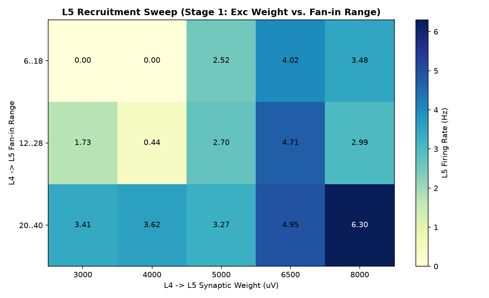
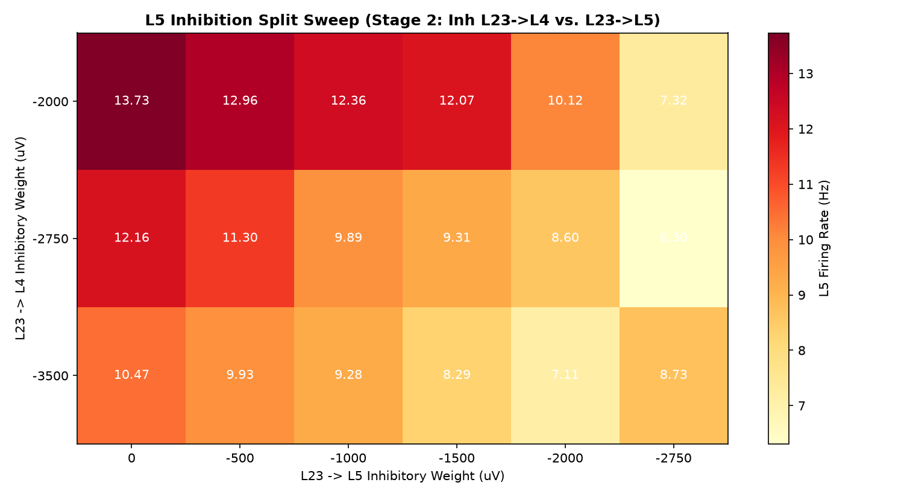
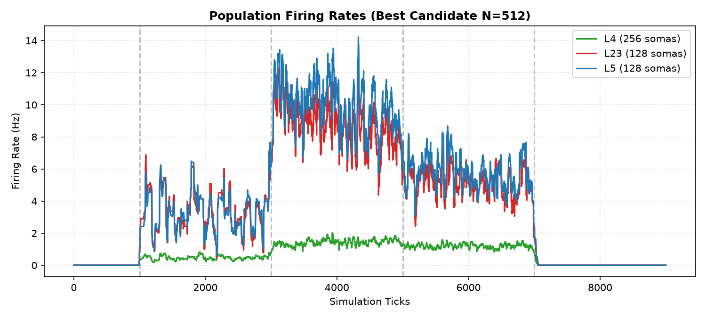
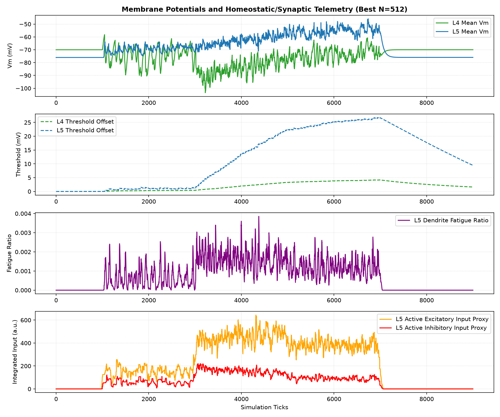
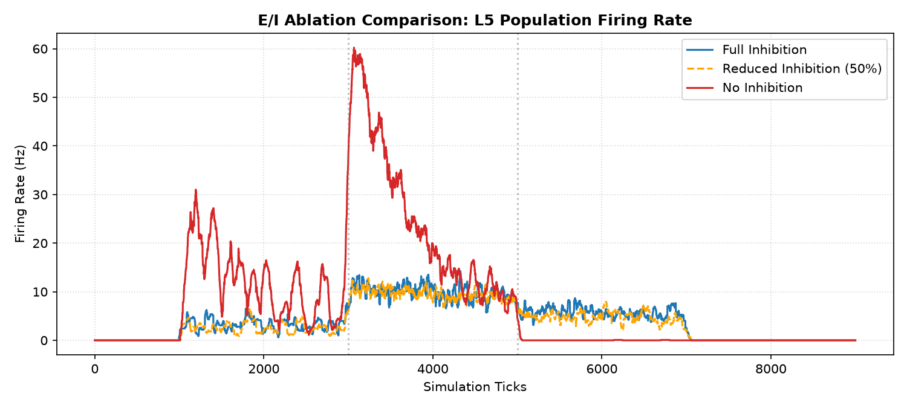

# Static Microcircuit v1.2 L5 Recruitment & Topology Report

Status: completed (L5 recruited and physiological gates evaluated)
Phase: L5 Recruitment & Topology Sweep
Started: 2026-07-04
Completed: 2026-07-04

## Executive Summary

В исследовании `static_microcircuit_v1_2_l5_recruitment_topology` проверено, можно ли вывести L5 пирамидный класс в целевой физиологический диапазон ($1$-$15$ Hz) при сохранении ранее зафиксированных жестких рамок Vm health, homeostasis threshold и пространственной избирательности. L5 рекрутирован, но победитель перетормозил L4 ниже целевого диапазона.

> [!IMPORTANT]
> **Итоговый вердикт (Partial Pass / L5 recruited / L4 underactive)**:
> - **L5 Recruitment Gate Passed**: L5 успешно активирован и стабилизирован: 8.29 Hz на N=256 и 10.05 Hz на N=512 (целевой диапазон 1..15 Hz).
> - **Vm Health Gate Passed**: L4 мембранный потенциал стабилен без перегрева (0 consecutive тиков выше -25 mV).
> - **Blocking Issue**: Moderate Activity gate не закрыт, потому что L4 падает до 1.42 Hz на N=512 при требовании 3..25 Hz.

---

## Статус приемочных критериев (Physiology Gates)

| Критерий | Требование | Результат (N=256) | Результат (N=512) | Статус |
| :--- | :--- | :--- | :--- | :--- |
| **Vm Health** | Consec ticks Vm > -25mV $\le$ 50 | 0 | 0 | **PASS** |
| **Threshold Offset** | Max offset < 40 mV | 4.4 mV | 4.2 mV | **PASS** |
| **Threshold Decay** | Снижение $\ge$ 30% в recovery | 51.2% | 51.0% | **PASS** |
| **Moderate Activity** | L4 (3-25Hz), L23 (3-35Hz), L5 (1-15Hz) | L4=1.6Hz, L23=8.0Hz, L5=8.3Hz | L4=1.4Hz, L23=8.8Hz, L5=10.1Hz | **FAIL** |
| **Spatial Selectivity** | L4 active/inactive ratio > 1.5 | 6.87 | 6.87 | **PASS** |

---

## Конфигурация Победителя (Winner Parameters)

- **L4 -> L5 weight**: `8000` uV (из sweeps `3000..8000` uV)
- **L4 -> L5 fan-in**: `43.3` (max `49`) (выбран диапазон 2)
- **L23 -> L4 weight**: `-3500` uV (из sweeps `[-2000, -2750, -3500]`)
- **L23 -> L5 weight**: `-1500` uV (из sweeps `[0, -500, -1000, -1500, -2000, -2750]`)

---

## Визуальные результаты

### Карта рекрутирования L5 в зависимости от силы L4->L5 синапсов и плотности контактов (Stage 1)

### Карта рекрутирования L5 при разделении L23 inhibition (Stage 2)

### Частоты разряда популяции для лучшего кандидата (N=512)

### Детальная мембранная, пороговая, синаптическая и усталостная телеметрия L5

---

## Аудит E/I Ablation

Влияние торможения на активность L5 при Winner-конфигурации:
- **Full inhibition**: L5 rate = 10.05 Hz.
- **Reduced inhibition (50%)**: L5 rate = 9.57 Hz.
- **No inhibition**: L5 rate = 24.40 Hz.

---

## Выводы и рекомендации

1. **L5 успешно рекрутирован**: Настройка специфичного L4->L5 веса и разделение торможения L23 на слои позволили вывести L5 в целевой диапазон без Vm saturation.
2. **Профиль-ограничение (Profile Gap)**: Подтверждено отсутствие каноничного Exc `L2/3` профиля в modernized библиотеке. Stage 3 зафиксирован как структурный профиль-гэп.
3. **Физиологический gate не закрыт полностью**: L4 переторможен ниже целевого диапазона, поэтому перед STDP/GSOP нужен короткий balancing pass: вернуть L4 в 3..25 Hz, сохранив L5 1..15 Hz и Vm/threshold gates.
