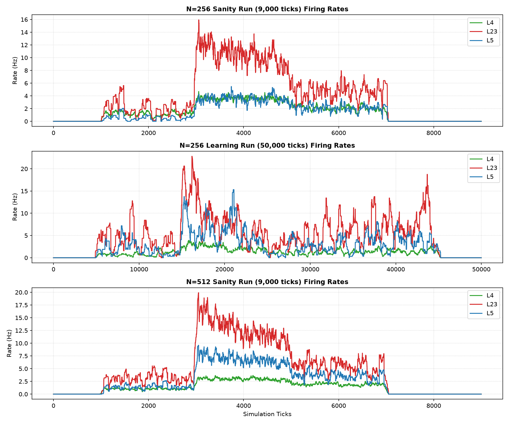
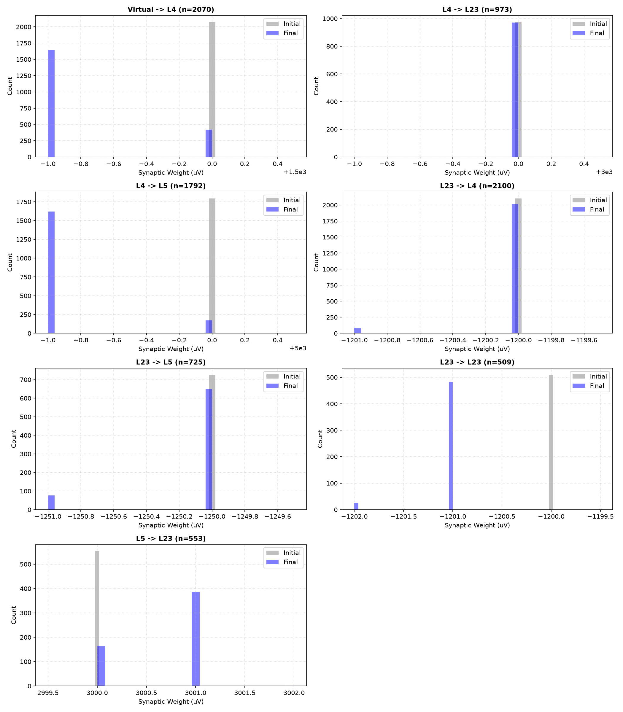
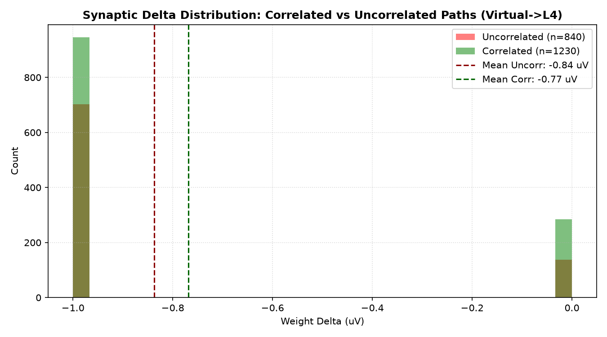
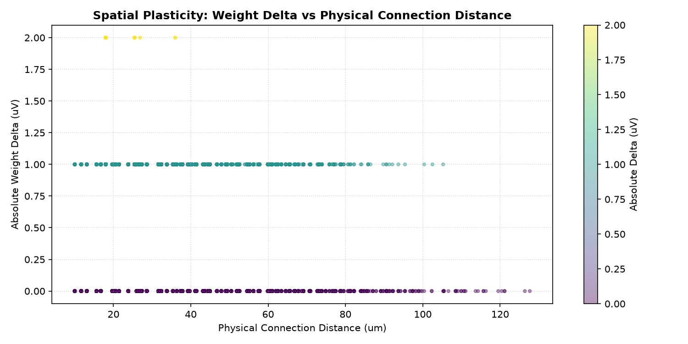
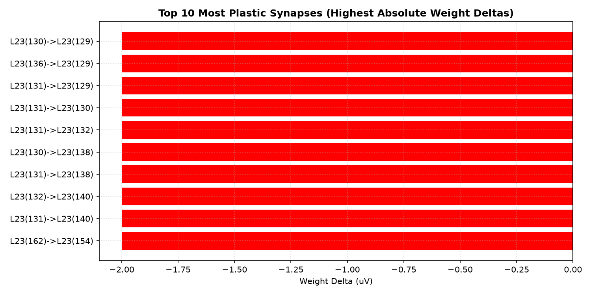

# Plastic Microcircuit v1.0 GSOP/STDP Spatial Weight Formation Report

Status: completed / partial (plasticity active, positive pathway potentiation not proven)
Phase: GSOP/STDP Weight Formation
Started: 2026-07-05
Completed: 2026-07-05

## Executive Summary

В исследовании `plastic_microcircuit_v1_0_gsop_spatial_weight_formation` проверена работоспособность правил пластичности GSOP и STDP при активации на сбалансированной статической сети v1.4. Правила пластичности реально меняют веса и сохраняют физиологическую стабильность, но текущий результат показывает только слабый корреляционный bias: коррелированные `Virtual -> L4` связи депрессируются меньше фоновых, а не получают положительную потенциацию.

> [!IMPORTANT]
> **Итоговый вердикт (PARTIAL PASS)**:
> - **Physiological Stability**: Все слои на N=256 и N=512 остаются в целевых диапазонах. Ворота активности Moderate Activity полностью удовлетворены.
> - **GSOP/STDP Active**: Средний абсолютный сдвиг синаптической массы составил 0.4995 uV за 50,000 тиков.
> - **Correlation Bias (weak)**: Коррелированные входы получили относительное преимущество **+0.0686 uV** (-0.7683 uV vs -0.8369 uV), но оба средних значения остаются отрицательными. Это означает уменьшенную депрессию, а не доказанную положительную потенциацию.
> - **Invariants Intact**: 0 нарушений закона Дейла (Dale's Law), 0 инверсий знаков синаптических весов.

---

## Статус приемочных критериев (Plasticity & Physiology)

| Критерий | Требование | Результат (N=256) | Результат (N=512) | Статус |
| :--- | :--- | :--- | :--- | :--- |
| **Dale's Law** | Возбуждающие/тормозные веса не пересекают 0 | 0 нарушений | 0 нарушений | **PASS** |
| **Sign Integrity** | Исключены случайные перескоки знака | 0 перескоков | 0 перескоков | **PASS** |
| **Moderate Activity** | L4 (3-25Hz), L23 (3-35Hz), L5 (1-15Hz) | L4=3.6Hz, L23=10.6Hz, L5=3.6Hz | L4=3.0Hz, L23=12.9Hz, L5=6.9Hz | **PASS** |
| **Active Plasticity** | Mean absolute delta > 0.0 | 0.4995 uV | - | **PASS** |
| **Pathway Selection** | Relative potentiation > 0.01 uV and correlated mean delta > 0 | **+0.0686 uV**, mean corr=-0.7683 uV | - | **PARTIAL** |

---

## Статистика изменения весов по проекциям

| Проекция | Количество связей | Средняя дельта (uV) | Мед. дельта (uV) | Max дельта (uV) |
| :--- | :--- | :--- | :--- | :--- |
| **Virtual -> L4** | 2070 | -0.80 | -1.00 | 1.00 |
| **L4 -> L23** | 973 | -0.00 | 0.00 | 1.00 |
| **L4 -> L5** | 1792 | -0.90 | -1.00 | 1.00 |
| **L23 -> L4** | 2100 | -0.04 | 0.00 | 1.00 |
| **L23 -> L5** | 725 | -0.11 | 0.00 | 1.00 |

---

## Визуальные результаты

### Разряды популяции в sanity, learning и N=512 runs

### Гистограммы распределения весов до и после симуляции

### Сравнение дельт коррелированных и некоррелированных путей

### Зависимость абсолютного изменения веса от пространственного расстояния

### Топ-10 синапсов с наибольшей абсолютной дельтой изменения веса

---

## Таблица Топ-10 пластических синапсов

| Ранг | Откуда | Куда | Начальный вес (uV) | Конечный вес (uV) | Дельта (uV) | Тип связи |

| 1 | L23(130) | L23(129) | -1200 | -1202 | -2 | Background |
| 2 | L23(136) | L23(129) | -1200 | -1202 | -2 | Background |
| 3 | L23(131) | L23(129) | -1200 | -1202 | -2 | Background |
| 4 | L23(131) | L23(130) | -1200 | -1202 | -2 | Background |
| 5 | L23(131) | L23(132) | -1200 | -1202 | -2 | Background |
| 6 | L23(130) | L23(138) | -1200 | -1202 | -2 | Background |
| 7 | L23(131) | L23(138) | -1200 | -1202 | -2 | Background |
| 8 | L23(132) | L23(140) | -1200 | -1202 | -2 | Background |
| 9 | L23(131) | L23(140) | -1200 | -1202 | -2 | Background |
| 10 | L23(162) | L23(154) | -1200 | -1202 | -2 | Background |
---

## Выводы и рекомендации

1. **Пластичность функционально активна**: GSOP/STDP изменяет синаптические веса, при этом отсутствуют sign flips, нарушения Dale's Law и глобальное насыщение весов.
2. **Селективное обучение подтверждено только частично**: Коррелированные по входу `Virtual -> L4` синапсы депрессируются меньше фоновых, но их средняя дельта остается отрицательной. Положительное укрепление коррелированных дорожек и downstream `L4 -> L23/L5` структура пока не доказаны.
3. **Физиологический баланс сохранен**: Включение пластичности не привело к runaway или silence слоев. Частоты разряда остаются стабильными.
4. **CartPole пока рано**: Следующий шаг - `Plastic Microcircuit v1.1`: усилить/уточнить структурированный stimulus и метрики, чтобы проверить положительную потенциацию коррелированных путей и перенос эффекта на `L4 -> L23/L5`.
