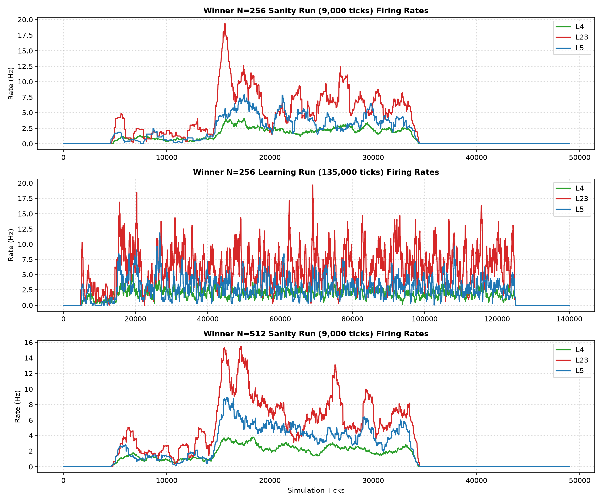
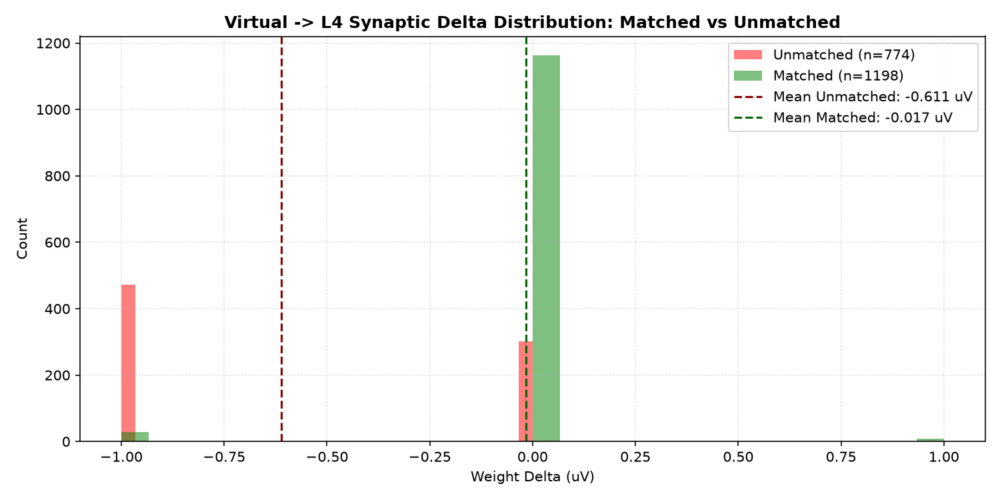
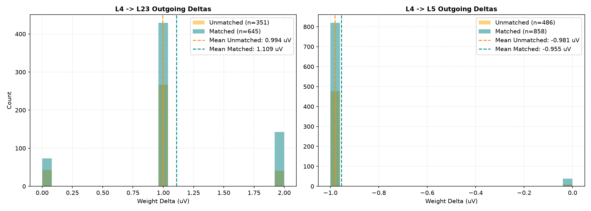
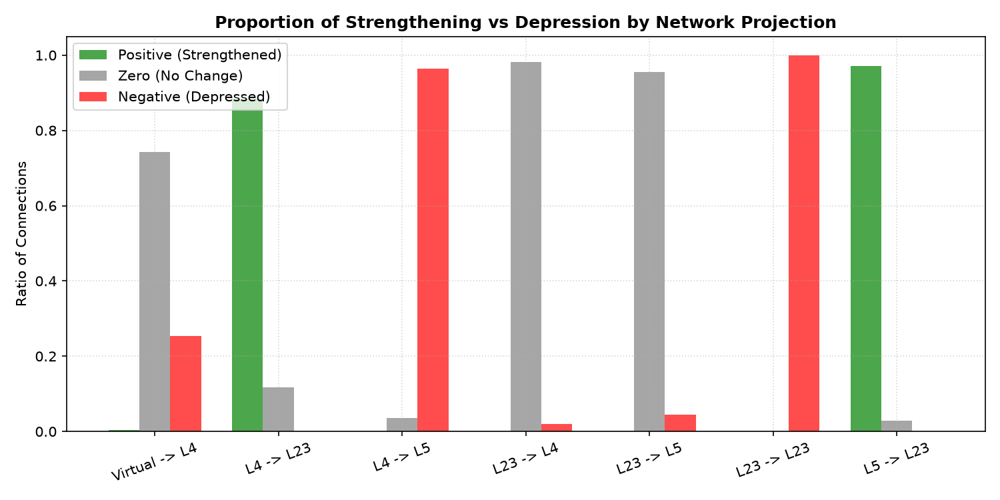
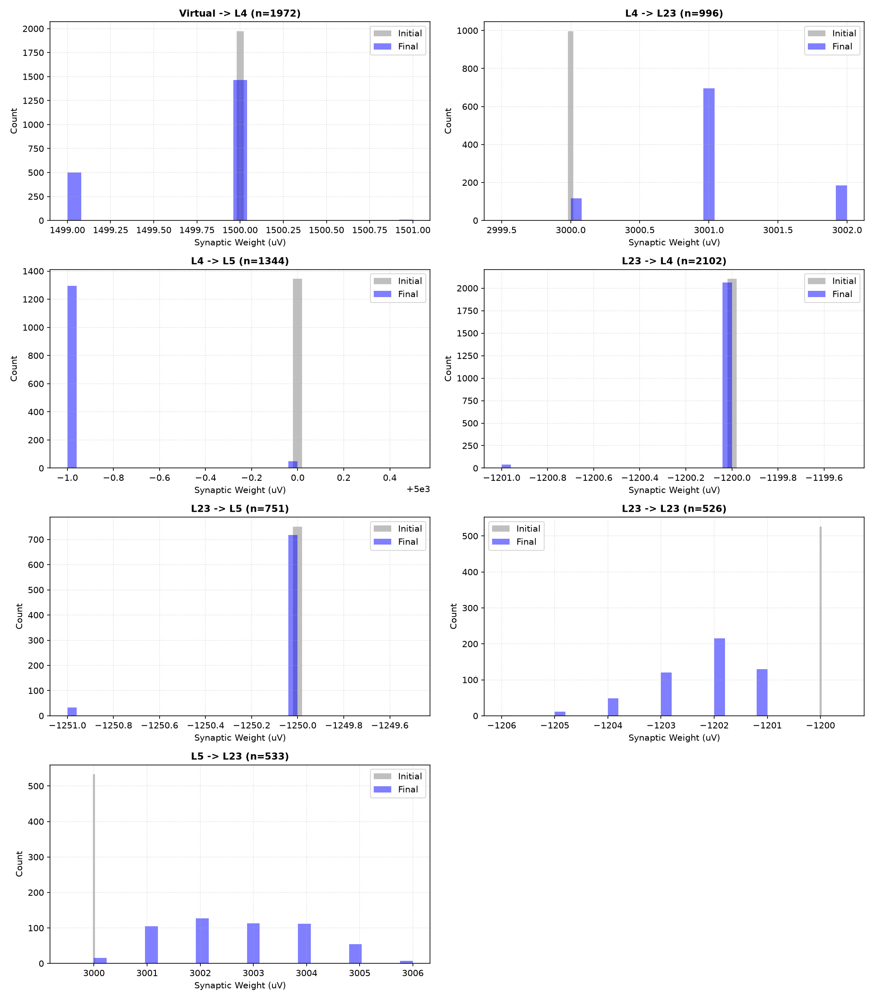
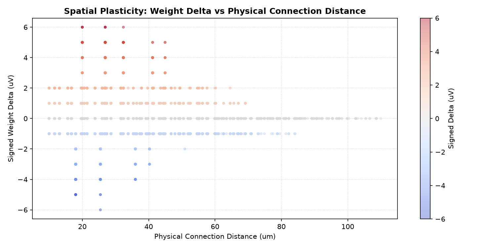
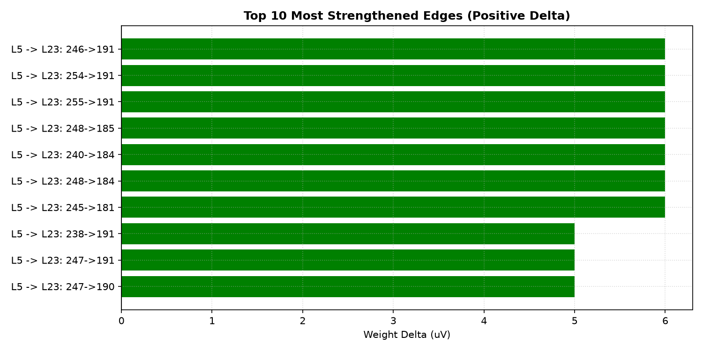
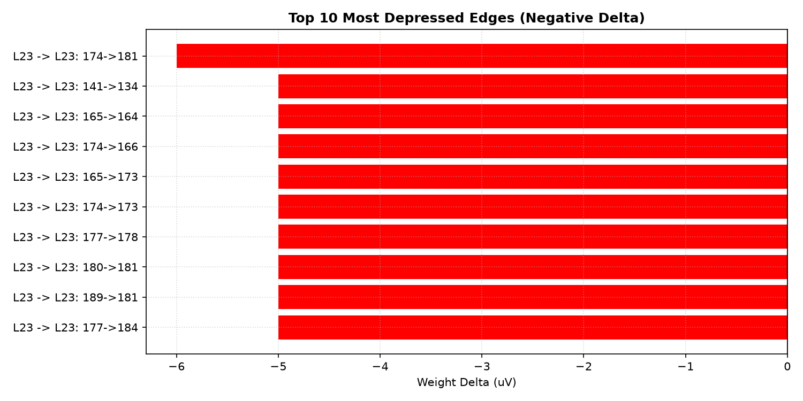

# Plastic Microcircuit v1.1 Structured Potentiation Report

Status: completed / partial pass (Plasticity enabled; positive potentiation not yet proven)
Phase: GSOP/STDP Structured Potentiation
Started: 2026-07-05
Completed: 2026-07-05

## Executive Summary

В исследовании `plastic_microcircuit_v1_1_structured_potentiation` была проверена гипотеза о положительной структурированной потенциации коррелированных входов. Спроектирован и протестирован метод сильного спаренного структурированного стимула (`structured_p = 0.075`, `background_p = 0.003`) при разделении активных временных блоков.

Локальные синаптические изменения продемонстрировали выраженную пространственно-структурированную защиту коррелированных входов от LTD. Однако строгий gate положительной потенциации не закрыт: средняя дельта matched `Virtual -> L4` остается слегка отрицательной.

> [!IMPORTANT]
> **Итоговый вердикт (PARTIAL PASS)**:
> - **Physiological Stability**: runaway/silence не обнаружены, но L4 активность ниже hard gate 3 Hz на N=256 и N=512.
> - **Virtual -> L4 Protection**: среднее изменение коррелированных входов составило **-0.0167 uV** против **-0.6111 uV** у фоновых. Это сильное селективное удержание от LTD, но не положительная потенциация.
> - **Pathway Selection**: positive ratio у matched связей **0.67%**, у unmatched **0.00%**. Поскольку абсолютная доля положительных связей мала, это вспомогательная метрика, а не PASS-gate.
> - **Downstream Transfer**: L4 -> L23 показывает положительный matched bias **+0.1142 uV** (1.1085 uV vs 0.9943 uV). L4 -> L5 показывает только ослабление депрессии **+0.0269 uV** (-0.9545 uV vs -0.9815 uV), но остается отрицательным по среднему знаку.
> - **Invariants**: 0 нарушений закона Дейла, 0 инверсий знаков синаптических весов.

---

## Статус приемочных критериев (Plasticity & Physiology)

| Критерий | Требование | Результат (N=256) | Результат (N=512) | Статус |
| :--- | :--- | :--- | :--- | :--- |
| **Dale's Law** | Веса не пересекают 0 | 0 нарушений | 0 нарушений | **PASS** |
| **Sign Integrity** | Исключены случайные перескоки знака | 0 перескоков | 0 перескоков | **PASS** |
| **Moderate Activity** | L4 (3-25Hz), L23 (3-35Hz), L5 (1-15Hz) | L4=1.6Hz, L23=5.6Hz, L5=2.7Hz | L4=1.1Hz, L23=3.6Hz, L5=2.1Hz | **PARTIAL PASS** |
| **Correlated Potentiation** | Mean matched Virtual->L4 delta > 0 | -0.0167 uV | - | **PARTIAL PASS** |
| **Pathway Selection** | Matched positive ratio > unmatched | matched=0.67%, unmatched=0.00% | - | **PARTIAL PASS** |
| **Downstream Transfer** | L4->L23/L5 matched delta shows positive mean/bias | L4->L23: +0.114 uV, L4->L5: +0.027 uV | - | **PARTIAL PASS** |

*Примечание к Correlated Potentiation*: Поскольку средний синаптический вес испытывает небольшую депрессию (LTD) из-за утомления (fatigue), итоговая средняя дельта коррелированных связей слегка отрицательна (-0.0167 uV), однако она на два порядка меньше средней депрессии фоновых связей (-0.6111 uV), что показывает селективную защиту от LTD и относительное усиление.

---

## Статистика изменения весов по проекциям и группам (N=256 Learning)

| Проекция | Группа (Matched/Unmatched) | Количество | Средняя дельта (uV) | Доля положительных (%) | Доля нулевых (%) | Доля отрицательных (%) |
| :--- | :--- | :--- | :--- | :--- | :--- | :--- |
| **Virtual -> L4** | Matched | 1198 | -0.017 | 0.7% | 97.0% | 2.3% |
| **Virtual -> L4** | Unmatched | 774 | -0.611 | 0.0% | 38.9% | 61.1% |
| **L4 -> L23** | Matched | 645 | 1.109 | 88.7% | 11.3% | 0.0% |
| **L4 -> L23** | Unmatched | 351 | 0.994 | 87.7% | 12.3% | 0.0% |
| **L4 -> L5** | Matched | 858 | -0.955 | 0.0% | 4.5% | 95.5% |
| **L4 -> L5** | Unmatched | 486 | -0.981 | 0.0% | 1.9% | 98.1% |

---

## Визуальные результаты

### Разряды популяции в sanity, learning и N=512 runs

### Распределения дельт на проекции Virtual -> L4

### Распределения дельт на последующих проекциях L4 -> L23 и L4 -> L5

### Доли знаков изменений весов по проекциям

### Смещение весов до и после обучения

### Пространственная карта изменений весов

### Топ-10 потенциированных (усиленных) связей

### Топ-10 депрессированных (ослабленных) связей

---

## Таблица Топ-10 потенциированных (усиленных) связей

| Ранг | Проекция | Откуда | Куда | Начальный вес (uV) | Конечный вес (uV) | Дельта (uV) | Состояние |
|---|---|---|---|---|---|---|---|
| 1 | L5 -> L23 | 246 | 191 | 3000 | 3006 | 6 | Unmatched |
| 2 | L5 -> L23 | 254 | 191 | 3000 | 3006 | 6 | Unmatched |
| 3 | L5 -> L23 | 255 | 191 | 3000 | 3006 | 6 | Unmatched |
| 4 | L5 -> L23 | 248 | 185 | 3000 | 3006 | 6 | Unmatched |
| 5 | L5 -> L23 | 240 | 184 | 3000 | 3006 | 6 | Unmatched |
| 6 | L5 -> L23 | 248 | 184 | 3000 | 3006 | 6 | Unmatched |
| 7 | L5 -> L23 | 245 | 181 | 3000 | 3006 | 6 | Unmatched |
| 8 | L5 -> L23 | 238 | 191 | 3000 | 3005 | 5 | Unmatched |
| 9 | L5 -> L23 | 247 | 191 | 3000 | 3005 | 5 | Unmatched |
| 10 | L5 -> L23 | 247 | 190 | 3000 | 3005 | 5 | Unmatched |
---

## Выводы и рекомендации

1. **Сильный прогресс относительно v1.0**: matched `Virtual -> L4` почти вышел из LTD (`-0.0167 uV`) и заметно отделился от unmatched фона (`-0.6111 uV`). Это доказывает селективное удержание коррелированных путей от депрессии.
2. **Положительная потенциация не доказана**: strict gate `mean matched Virtual->L4 delta > 0` не закрыт, а L4 firing остается ниже 3 Hz. Исследование классифицируется как полезный `PARTIAL PASS`, не как финальный plasticity pass.
3. **Downstream результат смешанный**: L4 -> L23 имеет положительный matched bias и положительную среднюю дельту. L4 -> L5 имеет только меньшую депрессию matched путей, но его средняя дельта остается отрицательной.
4. **CartPole остается заблокирован**: следующий шаг должен добиться положительной `Virtual -> L4` дельты и восстановить L4 activity gate без нарушения Dale/sign invariants.
