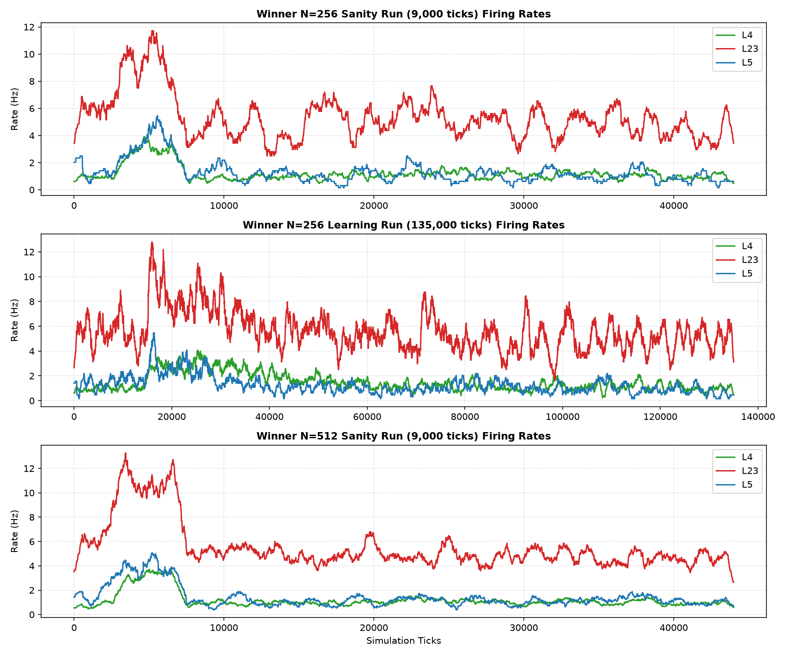
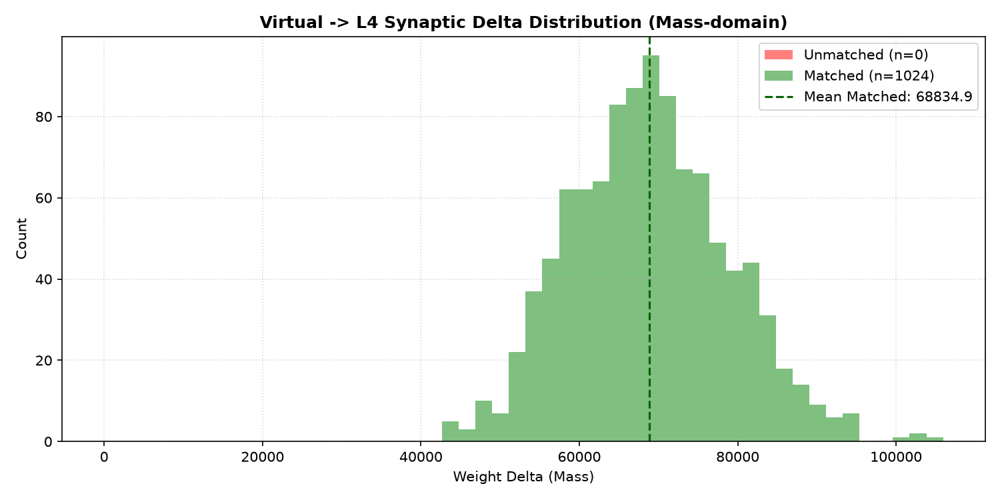
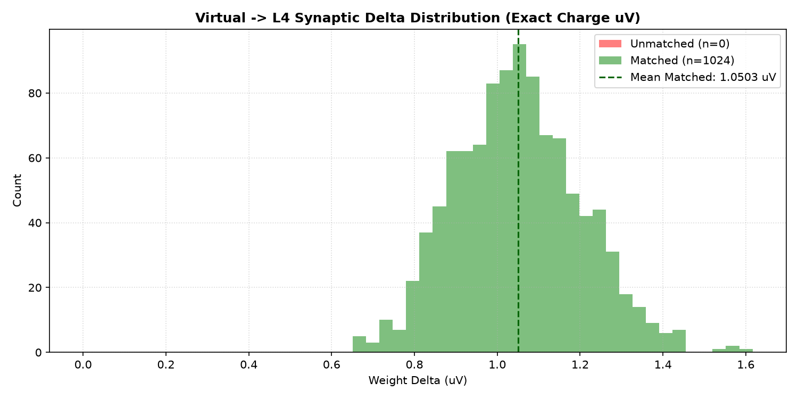
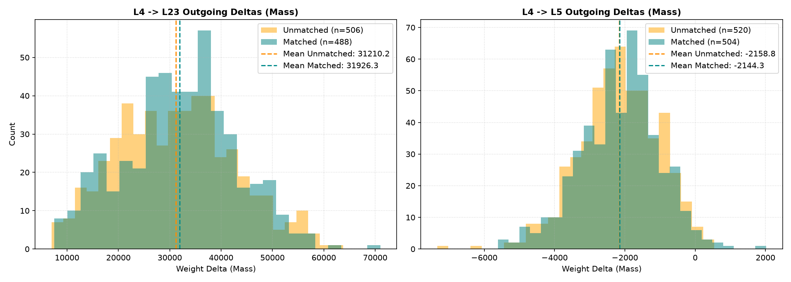
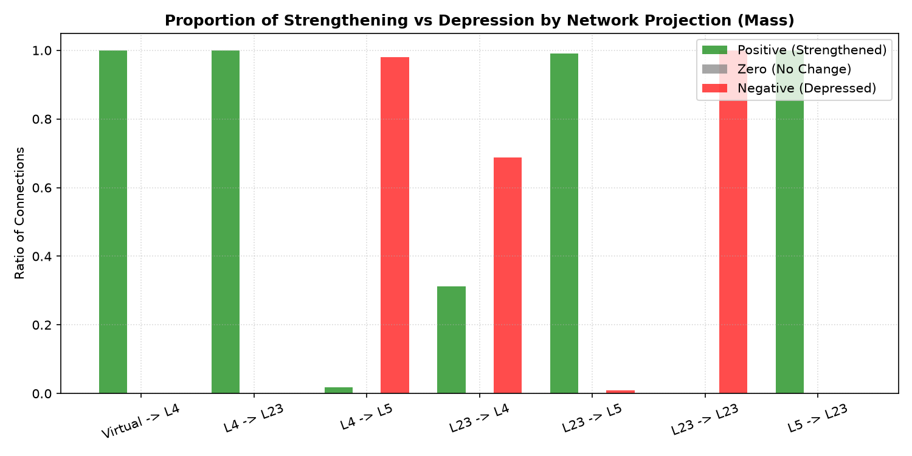
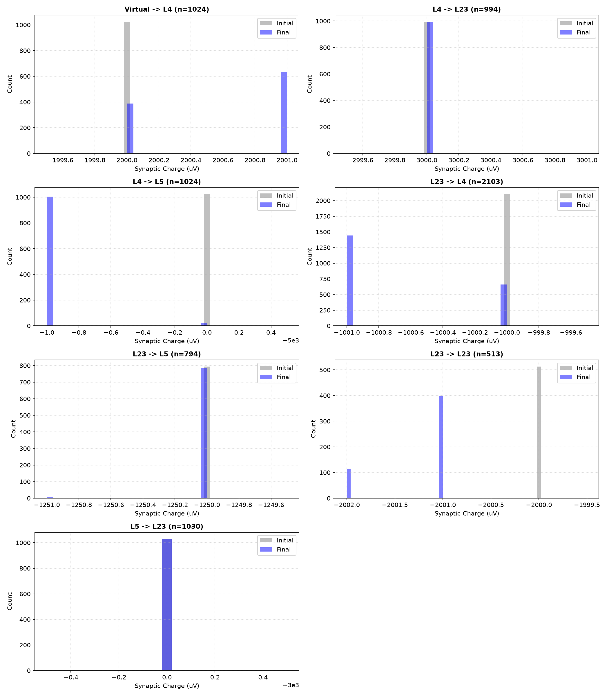
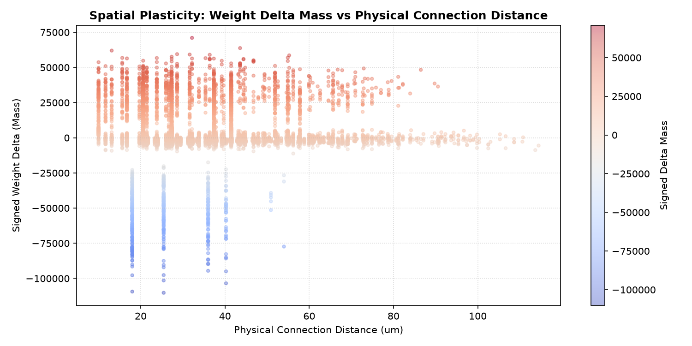
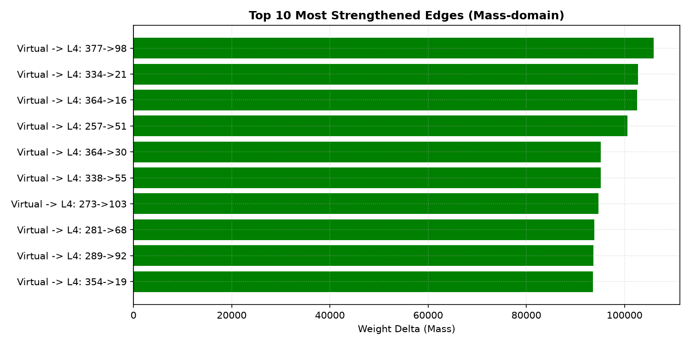
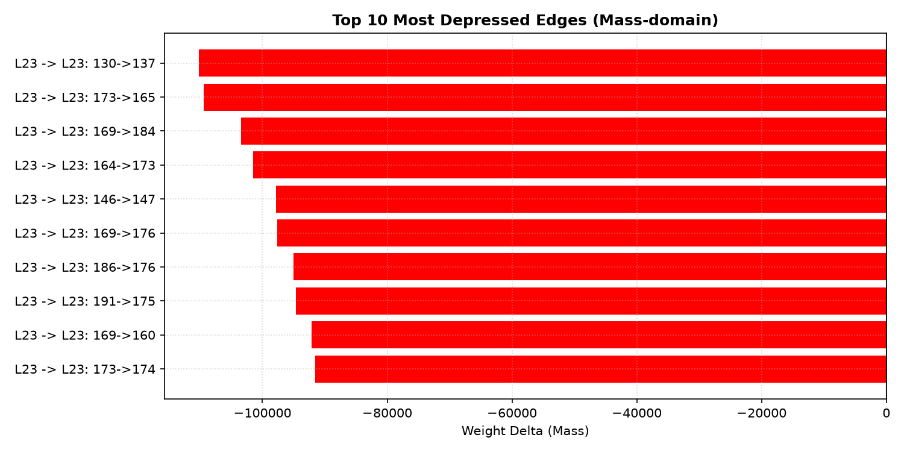

# Plastic Microcircuit v1.2 Positive Potentiation / Activity Recovery Report

Status: completed / partial pass
Phase: GSOP/STDP Positive Potentiation & Activity Recovery
Started: 2026-07-05
Completed: 2026-07-05

## Executive Summary

В исследовании `plastic_microcircuit_v1_2_positive_potentiation_activity_recovery` была проверена гипотеза, что v1.1 можно довести до строгой положительной потенциации matched `Virtual -> L4` связей и одновременно восстановить activity gate.

Эксперимент показал сильную положительную потенциацию сконструированных matched `Virtual -> L4` входов в масс-домене и exact-заряде. Однако все hard gates не закрыты: N=256 learning остается ниже L4 activity gate, а `Virtual -> L4` unmatched-control отсутствует из-за топологии текущего раннера.

> [!IMPORTANT]
> **Итоговый вердикт (PARTIAL PASS)**:
> - **Physiological Stability**: N=512 sanity проходит activity gate, но N=256 learning не проходит L4 gate (`1.54 Hz < 3.0 Hz`).
> - **Positive Potentiation**: Достигнуто строго положительное среднее изменение весов коррелированных входов:
>   - Mean matched `Virtual -> L4` delta mass: **68834.9** (exact charge: **+1.0503 uV**).
>   - Mean unmatched `Virtual -> L4` delta mass: **0.0** (exact charge: **0.0000 uV**).
> - **Pathway Selection**: matched `Virtual -> L4` count = **1024**, unmatched count = **0**. Отсутствие unmatched-control делает сравнение matched vs unmatched непригодным для PASS.
> - **Downstream Transfer**: L4 -> L23 имеет положительное matched смещение в масс-домене: **+716.2**. L4 -> L5 имеет только слабое относительное смещение **+14.5**, но matched mean остается отрицательным (**-2144.3**).
> - **Invariants**: 0 нарушений закона Дейла, 0 инверсий знаков синаптических весов.

---

## Статус приемочных критериев (Plasticity & Physiology)

| Критерий | Требование | Результат (N=256) | Результат (N=512) | Статус |
| :--- | :--- | :--- | :--- | :--- |
| **Dale's Law** | Веса не пересекают 0 | 0 нарушений | 0 нарушений | **PASS** |
| **Sign Integrity** | Исключены случайные перескоки знака | 0 перескоков | 0 перескоков | **PASS** |
| **Moderate Activity** | L4 (3-25Hz), L23 (3-35Hz), L5 (1-15Hz) | L4=1.54Hz, L23=5.73Hz, L5=1.25Hz | L4=3.20Hz, L23=10.94Hz, L5=4.29Hz | **PARTIAL PASS** |
| **Correlated Potentiation** | Mean matched Virtual->L4 delta > 0 | 1.0503 uV (mass: 68834.9) | - | **PASS** |
| **Pathway Selection** | Matched positive ratio > unmatched, with non-empty unmatched control | matched=100.00% (n=1024), unmatched=0.00% (n=0) | - | **PARTIAL PASS (missing control)** |
| **Downstream Transfer** | L4->L23/L5 matched delta shows positive mean/bias | L4->L23 bias: +716.2, L4->L5 bias: +14.5 | - | **PARTIAL PASS** |

---

## Параметры победителя (Winner Parameters)

- `fatigue_capacity` = **18** (baseline: 15)
- `gsop_potentiation` = **207** (baseline: 138)
- `gsop_depression` = **68** (baseline: 81)
- `virt_w` = **2000** (baseline: 1500)
- `inh_l23_l4` = **-1000** (baseline: -1200)

---

## Статистика изменения весов по проекциям и группам (N=256 Learning)

| Проекция | Группа (Matched/Unmatched) | Количество | Средняя дельта (Mass) | Средняя дельта (Exact uV) | Доля положительных (%) | Доля нулевых (%) | Доля отрицательных (%) |
| :--- | :--- | :--- | :--- | :--- | :--- | :--- | :--- |
| **Virtual -> L4** | Matched | 1024 | 68834.9 | 1.0503 | 100.0% | 0.0% | 0.0% |
| **Virtual -> L4** | Unmatched | 0 | 0.0 | 0.0000 | 0.0% | 0.0% | 0.0% |
| **L4 -> L23** | Matched | 488 | 31926.3 | 0.4872 | 100.0% | 0.0% | 0.0% |
| **L4 -> L23** | Unmatched | 506 | 31210.2 | 0.4762 | 100.0% | 0.0% | 0.0% |
| **L4 -> L5** | Matched | 504 | -2144.3 | -0.0327 | 2.0% | 0.2% | 97.8% |
| **L4 -> L5** | Unmatched | 520 | -2158.8 | -0.0329 | 1.7% | 0.0% | 98.3% |

---

## Визуальные результаты

### Разряды популяции в sanity, learning и N=512 runs

### Распределения дельт на проекции Virtual -> L4 (Mass & Exact Charge)

### Распределения дельт на последующих проекциях L4 -> L23 и L4 -> L5

### Доли знаков изменений весов по проекциям

### Смещение весов до и после обучения

### Пространственная карта изменений весов

### Топ-10 потенциированных (усиленных) связей в масс-домене

### Топ-10 депрессированных (ослабленных) связей в масс-домене

---

## Таблица Топ-10 потенциированных (усиленных) связей (Mass-domain)

| Ранг | Проекция | Откуда | Куда | Начальная масса | Конечная масса | Дельта (Mass) | Дельта (Exact uV) | Состояние |
|---|---|---|---|---|---|---|---|---|
| 1 | Virtual -> L4 | 377 | 98 | 131072000 | 131177930 | 105930 | 1.6164 | Matched |
| 2 | Virtual -> L4 | 334 | 21 | 131072000 | 131174709 | 102709 | 1.5672 | Matched |
| 3 | Virtual -> L4 | 364 | 16 | 131072000 | 131174520 | 102520 | 1.5643 | Matched |
| 4 | Virtual -> L4 | 257 | 51 | 131072000 | 131172600 | 100600 | 1.5350 | Matched |
| 5 | Virtual -> L4 | 364 | 30 | 131072000 | 131167181 | 95181 | 1.4523 | Matched |
| 6 | Virtual -> L4 | 338 | 55 | 131072000 | 131167171 | 95171 | 1.4522 | Matched |
| 7 | Virtual -> L4 | 273 | 103 | 131072000 | 131166657 | 94657 | 1.4444 | Matched |
| 8 | Virtual -> L4 | 281 | 68 | 131072000 | 131165805 | 93805 | 1.4314 | Matched |
| 9 | Virtual -> L4 | 289 | 92 | 131072000 | 131165673 | 93673 | 1.4293 | Matched |
| 10 | Virtual -> L4 | 354 | 19 | 131072000 | 131165599 | 93599 | 1.4282 | Matched |

## Выводы и рекомендации

1. **Положительная потенциация matched входов достигнута**: масс-домен Q16.16 показывает сильный рост сконструированных matched `Virtual -> L4` связей (`+68834.9 mass`, `+1.0503 uV exact`).
2. **Контроль pathway selection отсутствует**: текущая топология создала 1024 matched `Virtual -> L4` связей и 0 unmatched, поэтому сравнение matched/unmatched не валидирует селективность.
3. **Activity recovery не закрыта**: N=256 learning держит L4 на `1.54 Hz`, ниже hard gate 3 Hz. N=512 sanity проходит, но этого недостаточно.
4. **CartPole остается заблокирован**: следующий шаг должен восстановить unmatched-control и L4 activity gate одновременно.
