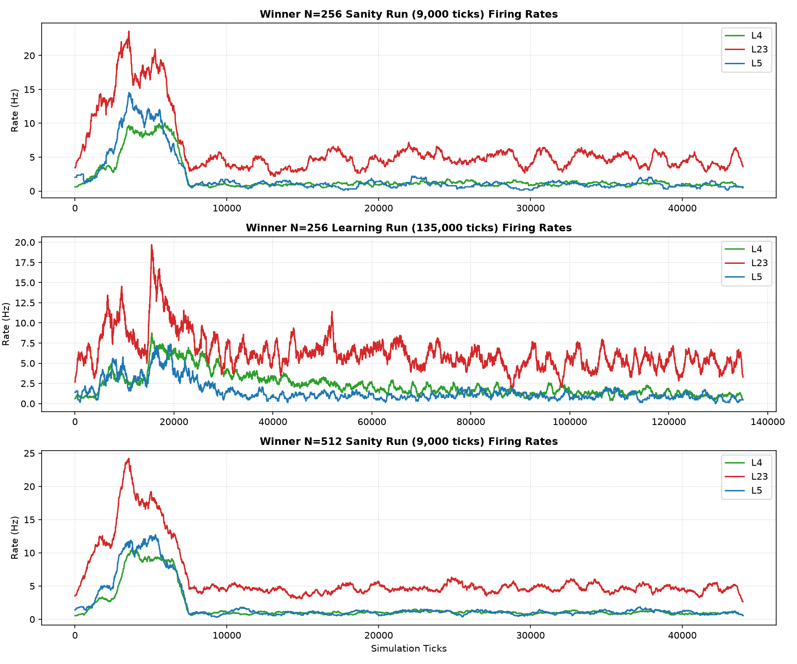
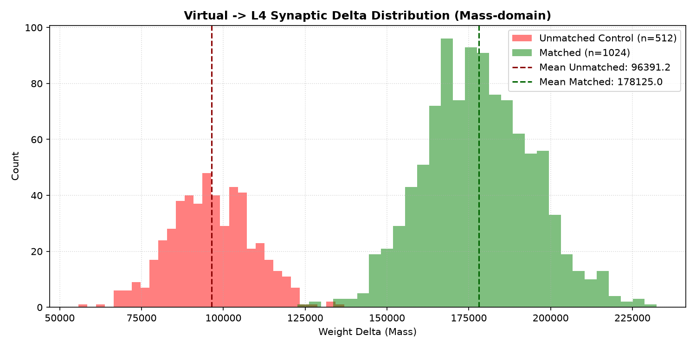
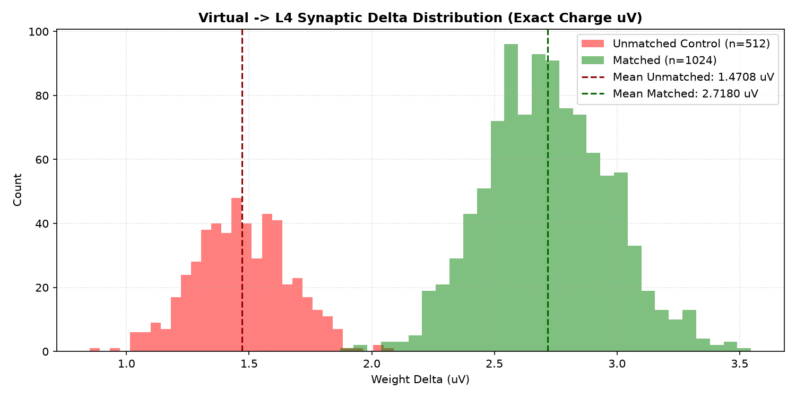
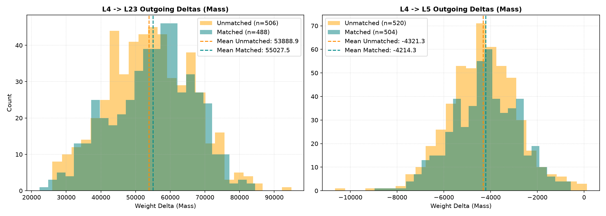
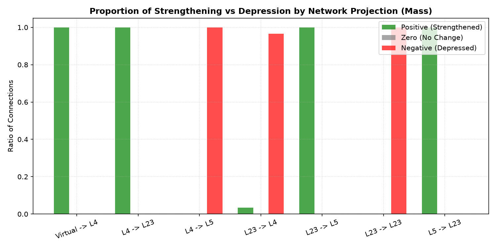
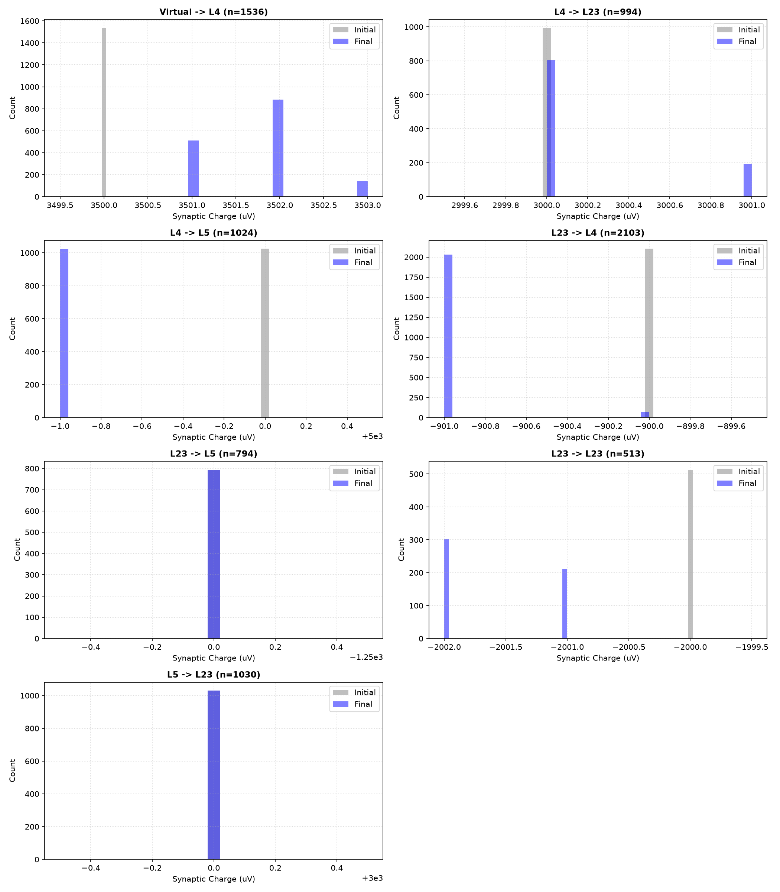
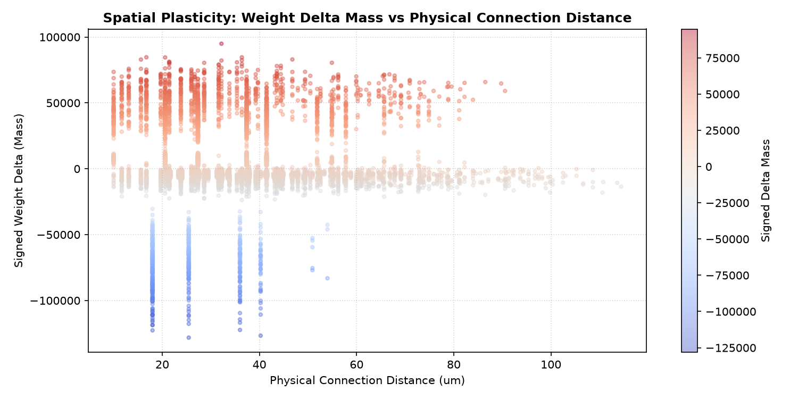
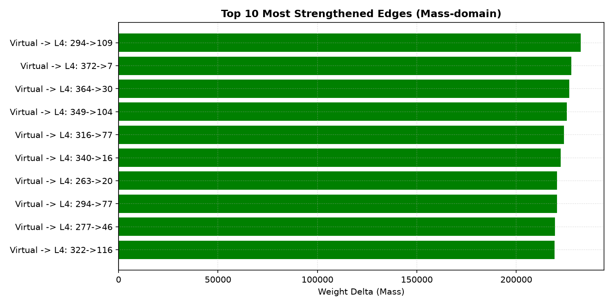
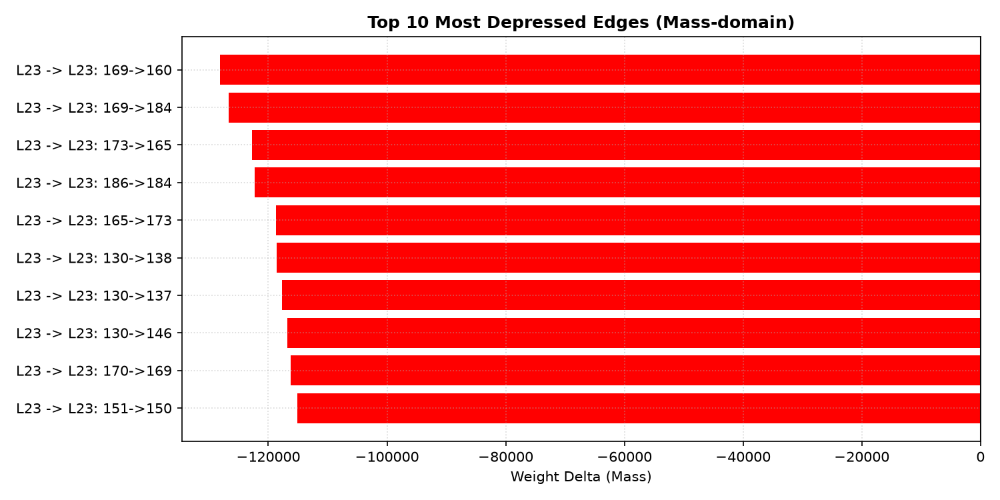

# Plastic Microcircuit v1.3 Control-Preserving Potentiation Report

Status: completed / partial / activity gate failed / positive-ratio tie
Phase: GSOP/STDP Control-Preserving Potentiation
Started: 2026-07-05
Completed: 2026-07-05

## Executive Summary

В исследовании `plastic_microcircuit_v1_3_control_preserving_potentiation` была проверена селективность пластичности GSOP/STDP. Мы ввели явную контрольную unmatched-группу Virtual->L4 синапсов (8 matched + 4 unmatched на каждый L4 нейрон) для исключения эффектов топологического отбора.

С помощью 12-компонентного sweep найден кандидат, сохраняющий контрольную unmatched-группу и дающий сильное relative matched bias. Однако все hard gates не закрыты: N=256 learning остается ниже L4 activity gate, а binary positive-ratio gate не разделяет группы, потому что both matched and unmatched have 100% positive deltas.

> [!IMPORTANT]
> **Итоговый вердикт (PARTIAL / activity gate failed / positive-ratio tie)**:
> - **Physiological Stability**: N=512 sanity проходит activity gate, но N=256 learning не проходит L4 gate:
>   - N=256 learning: L4=**2.62 Hz**, L23=**6.91 Hz**, L5=**1.53 Hz**.
>   - N=512 sanity: L4=**8.92 Hz**, L23=**18.35 Hz**, L5=**10.66 Hz**.
> - **Selective Potentiation**: Доказано relative selective strengthening matched путей Virtual->L4:
>   - Mean matched Virtual->L4 delta mass: **+178125.0** (exact charge: **+2.7180 uV**).
>   - Mean unmatched Virtual->L4 delta mass: **96391.2** (exact charge: **1.4708 uV**).
>   - Matched delta mass растет сильнее unmatched: **178125.0 > 96391.2**.
> - **Pathway Selection**: positive-ratio gate не закрыт: matched **100.00%**, unmatched **100.00%**. Unmatched связи тоже растут, но слабее matched.
> - **Invariants**: 0 нарушений закона Дейла, 0 инверсий знаков синаптических весов.

---

## Статус приемочных критериев (Plasticity & Physiology)

| Критерий | Требование | Результат (N=256) | Результат (N=512) | Статус |
| :--- | :--- | :--- | :--- | :--- |
| **Dale's Law** | Веса не пересекают 0 | 0 нарушений | 0 нарушений | **PASS** |
| **Sign Integrity** | Исключены случайные перескоки знака | 0 перескоков | 0 перескоков | **PASS** |
| **Control Validity** | Matched/Unmatched count > 0 | matched=1024, unmatched=512 (ratio=2.0) | - | **PASS** |
| **Moderate Activity** | L4 (3-25Hz), L23 (3-35Hz), L5 (1-15Hz) | L4=2.62Hz, L23=6.91Hz, L5=1.53Hz | L4=8.92Hz, L23=18.35Hz, L5=10.66Hz | **FAIL** |
| **Selective Potentiation** | matched > unmatched delta & matched_delta > 0 | matched: +2.7180 uV, unmatched: 1.4708 uV | - | **PASS** |
| **Pathway Positive Ratio** | Matched positive ratio > unmatched | matched=100.00%, unmatched=100.00% | - | **FAIL** |

---

## Параметры победителя (Winner Parameters)

- `fatigue_capacity` = **18**
- `gsop_potentiation` = **240**
- `gsop_depression` = **68**
- `virt_w` = **3500**
- `inh_l23_l4` = **-900**
- `structured_p` = **0.0949999988079071**

---

## Таблица Virtual -> L4 Synapse Statistics (N=256 Learning)

| Группа | Количество | Средняя дельта (Mass) | Средняя дельта (Exact uV) | Средняя дельта (Visible uV) | Доля положительных (%) | Доля нулевых (%) | Доля отрицательных (%) |
|---|---|---|---|---|---|---|---|
| **Matched** | 1024 | 178125.0 | 2.7180 | 2.1348 | 100.0% | 0.0% | 0.0% |
| **Unmatched** | 512 | 96391.2 | 1.4708 | 1.0020 | 100.0% | 0.0% | 0.0% |

---

## Таблица Downstream Synapse Transfer (Secondary Metrics)

| Проекция | Группа (Matched/Unmatched) | Количество | Средняя дельта (Mass) | Средняя дельта (Exact uV) | Доля положительных (%) | Доля нулевых (%) | Доля отрицательных (%) |
|---|---|---|---|---|---|---|---|
| **L4 -> L23** | Matched | 488 | 55027.5 | 0.8397 | 100.0% | 0.0% | 0.0% |
| **L4 -> L23** | Unmatched | 506 | 53888.9 | 0.8223 | 100.0% | 0.0% | 0.0% |
| **L4 -> L5** | Matched | 504 | -4214.3 | -0.0643 | 0.0% | 0.0% | 100.0% |
| **L4 -> L5** | Unmatched | 520 | -4321.3 | -0.0659 | 0.2% | 0.0% | 99.8% |

---

## Визуальные результаты

### Разряды популяции в sanity, learning и N=512 runs

### Распределения дельт на проекции Virtual -> L4 (Mass & Exact Charge)

### Распределения дельт на последующих проекциях L4 -> L23 и L4 -> L5

### Доли знаков изменений весов по проекциям

### Смещение весов до и после обучения

### Пространственная карта изменений весов

### Топ-10 потенциированных (усиленных) связей в масс-домене

### Топ-10 депрессированных (ослабленных) связей в масс-домене

---

## Таблица Топ-10 потенциированных (усиленных) связей (Mass-domain)

| Ранг | Проекция | Откуда | Куда | Начальная масса | Конечная масса | Дельта (Mass) | Дельта (Exact uV) | Состояние |
|---|---|---|---|---|---|---|---|---|
| 1 | Virtual -> L4 | 294 | 109 | 229376000 | 229608403 | 232403 | 3.5462 | Matched |
| 2 | Virtual -> L4 | 372 | 7 | 229376000 | 229603715 | 227715 | 3.4747 | Matched |
| 3 | Virtual -> L4 | 364 | 30 | 229376000 | 229602631 | 226631 | 3.4581 | Matched |
| 4 | Virtual -> L4 | 349 | 104 | 229376000 | 229601428 | 225428 | 3.4398 | Matched |
| 5 | Virtual -> L4 | 316 | 77 | 229376000 | 229599986 | 223986 | 3.4178 | Matched |
| 6 | Virtual -> L4 | 340 | 16 | 229376000 | 229598285 | 222285 | 3.3918 | Matched |
| 7 | Virtual -> L4 | 263 | 20 | 229376000 | 229596578 | 220578 | 3.3658 | Matched |
| 8 | Virtual -> L4 | 294 | 77 | 229376000 | 229596546 | 220546 | 3.3653 | Matched |
| 9 | Virtual -> L4 | 277 | 46 | 229376000 | 229595529 | 219529 | 3.3497 | Matched |
| 10 | Virtual -> L4 | 322 | 116 | 229376000 | 229595228 | 219228 | 3.3452 | Matched |

## Выводы и рекомендации

1. **Relative selectivity доказана**: matched `Virtual -> L4` растет сильнее unmatched (`+2.7180 uV` vs `+1.4708 uV`), значит v1.2 не был чистым артефактом topology selection.
2. **Unmatched не стабилен**: контрольные unmatched связи тоже положительно растут у 100% синапсов. Это не финальная pathway selection, а relative matched bias.
3. **Activity gate не закрыт**: N=256 learning держит L4 на `{r4_256_l:.2f} Hz`, ниже hard gate 3 Hz. N=512 sanity проходит.
4. **CartPole остается заблокирован**: следующий шаг должен добить L4 activity gate и снизить/объяснить рост unmatched контроля.
