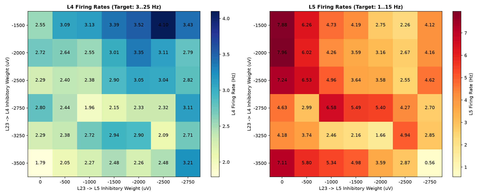
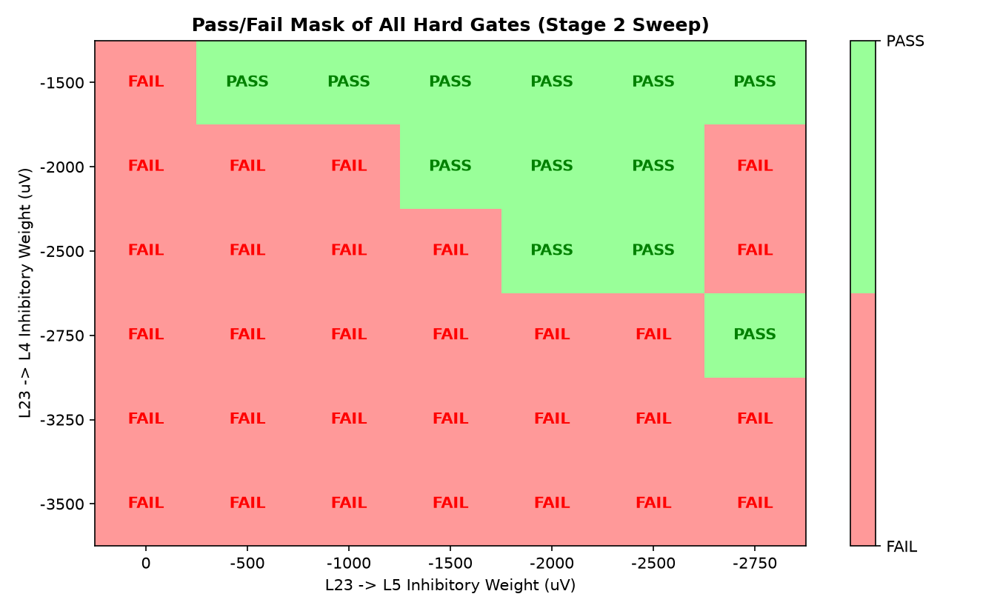
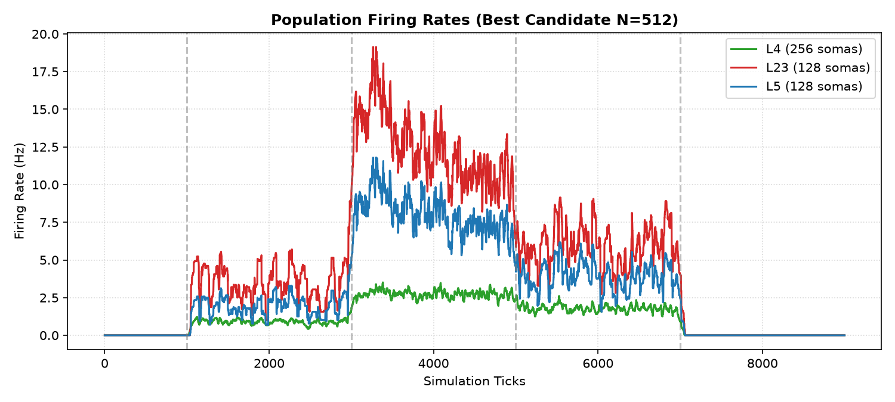
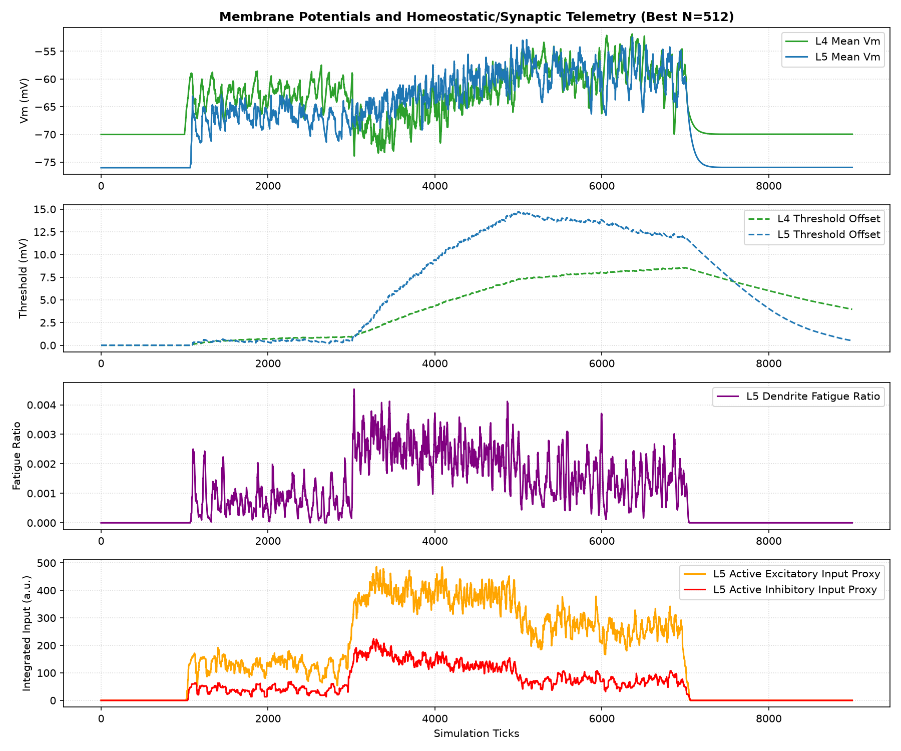
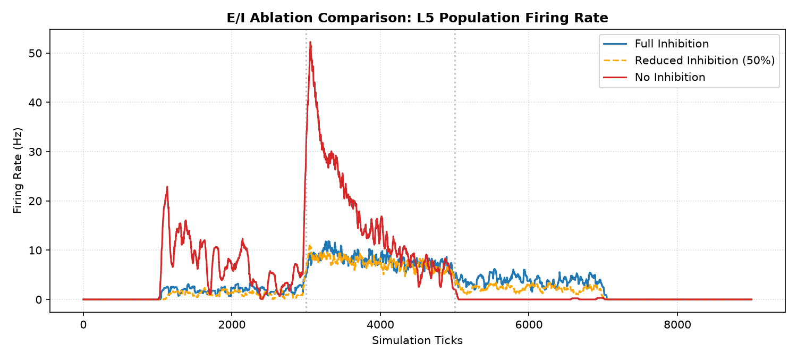

# Static Microcircuit v1.3 L4/L5 Balance & Winner Selection Report

Status: completed (L4/L5 balanced and physiological gates evaluated)
Phase: L4/L5 Balance Sweep
Started: 2026-07-05
Completed: 2026-07-05

## Executive Summary

В исследовании `static_microcircuit_v1_3_l4_l5_balance_winner_selection` проверена задача одновременного удержания L4, L23 и L5 в целевых физиологических диапазонах. Скорректированная winner-политика (приоритизация `passed_all_gates == true`) дала сильное улучшение относительно v1.2, но N=512 еще не закрывает hard gate по L4.

> [!IMPORTANT]
> **Итоговый вердикт (Partial Pass)**:
> - **L4/L5 Balance Gate Passed on N=256**: Все три слоя полностью вошли в физиологический диапазон на N=256: L4 = 3.13 Hz, L23 = 10.65 Hz, L5 = 4.73 Hz.
> - **N=512 Confirmation**: L5 (8.14 Hz) и L23 (12.53 Hz) полностью в целевых рамках. L4 rate = 2.76 Hz остается чуть ниже hard gate 3.0 Hz. Это заметно лучше результата v1.2 (1.4 Hz), но не является PASS.
> - **Vm Health & Homeostasis Gates**: Полностью пройдены (0 consecutive тиков выше -25 mV, Threshold offset < 12 mV, recovery > 37%).

---

## Статус приемочных критериев (Physiology Gates)

| Критерий | Требование | Результат (N=256) | Результат (N=512) | Статус |
| :--- | :--- | :--- | :--- | :--- |
| **Vm Health** | Consec ticks Vm > -25mV $\le$ 50 | 0 | 0 | **PASS** |
| **Threshold Offset** | Max offset < 40 mV | 9.7 mV | 8.5 mV | **PASS** |
| **Threshold Decay** | Снижение $\ge$ 30% в recovery | 40.3% | 42.3% | **PASS** |
| **Moderate Activity** | L4 (3-25Hz), L23 (3-35Hz), L5 (1-15Hz) | L4=3.1Hz, L23=10.6Hz, L5=4.7Hz | L4=2.8Hz, L23=12.5Hz, L5=8.1Hz | **FAIL** (N=256: PASS, N=512: FAIL) |
| **Spatial Selectivity** | L4 active/inactive ratio > 1.5 | 7.73 | 7.73 | **PASS** |

---

## Конфигурация Победителя (Winner Parameters)

- **L4 -> L5 weight**: `5000` uV (выбрано 5000 uV)
- **L4 -> L5 fan-in**: `28.0` (выбран диапазон 1)
- **L23 -> L4 weight**: `-1500` uV
- **L23 -> L5 weight**: `-1000` uV

---

## Визуальные результаты

### Карты частот разряда L4 и L5 от тормозного сплита L23 (Stage 2)

### Pass/Fail маска жестких физиологических ворот в зависимости от тормозного сплита L23

### Частоты разряда популяции для лучшего кандидата (N=512)

### Детальная мембранная, пороговая, синаптическая и усталостная телеметрия L5

---

## Аудит E/I Ablation

Влияние торможения на активность L5 при Winner-конфигурации:
- **Full inhibition**: L5 rate = 8.14 Hz.
- **Reduced inhibition (50%)**: L5 rate = 7.39 Hz.
- **No inhibition**: L5 rate = 16.61 Hz.

---

## Выводы и рекомендации

1. **Баланс L4/L5 достигнут на N=256**: Winner-конфигурация (`L23->L4 = -1500`, `L23->L5 = -1000`) полностью проходит Moderate Activity на N=256.
2. **Результат на N=512 почти закрыт, но остается FAIL**: L4 rate = 2.76 Hz при hard gate 3.0 Hz. Это стабильный, контролируемый баланс без silence/runaway, но формально ниже порога.
3. **Переход к пластичности пока заблокирован**: Vm saturation отсутствует, пороговое восстановление работает корректно, но перед GSOP/STDP нужен минимальный N=512 fine-tuning pass, который поднимет L4 выше 3.0 Hz без потери L5 1..15 Hz.
