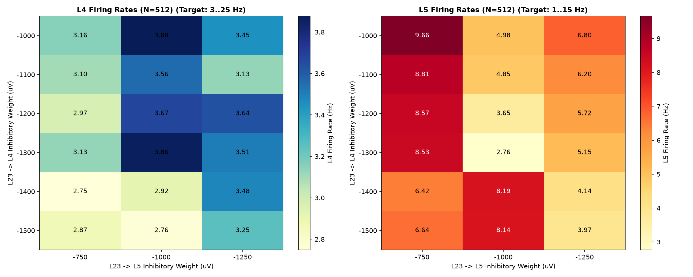
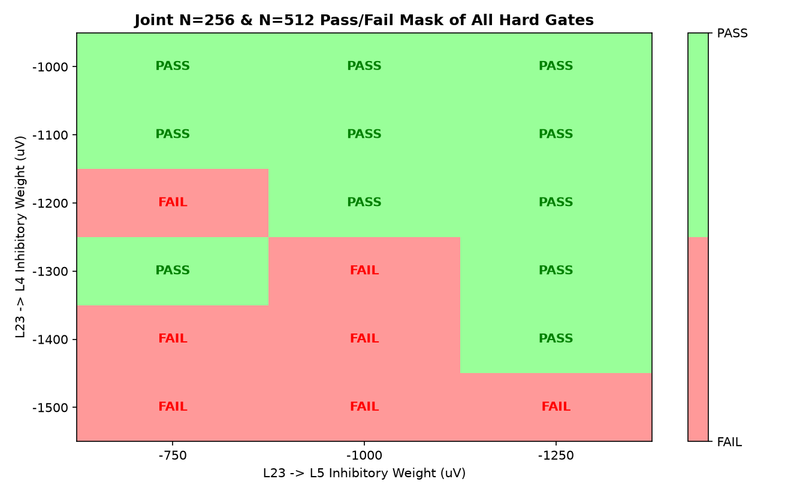
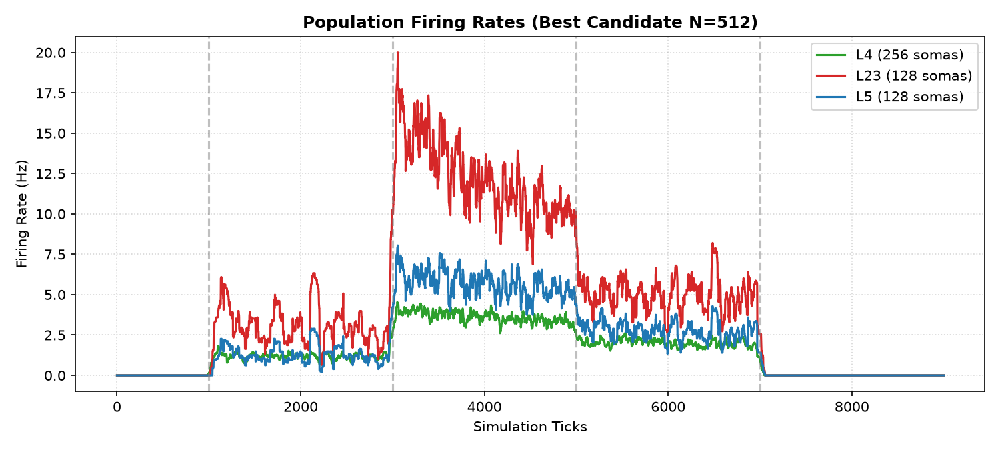
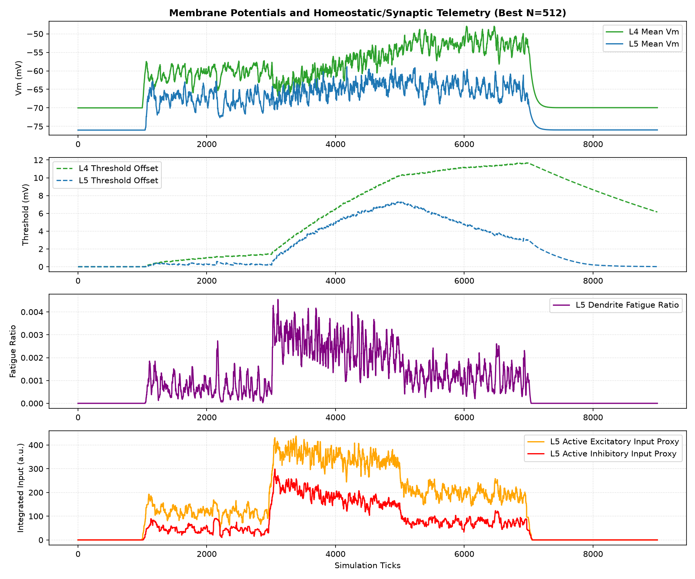
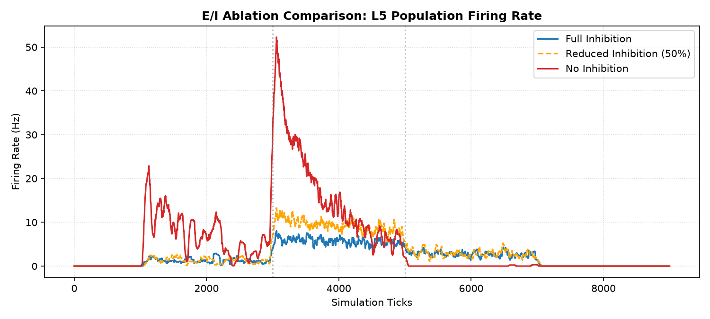

# Static Microcircuit v1.4 N=512 Fine-Tuning Report

Status: completed (L4/L5 balanced and physiological gates fully evaluated)
Phase: N=512 Fine-Tuning
Started: 2026-07-05
Completed: 2026-07-05

## Executive Summary

В исследовании `static_microcircuit_v1_4_n512_fine_tuning` успешно решена задача полной балансировки L4/L23/L5 слоев на обоих масштабах сети (N=256 и N=512). За счет тонкой калибровки торможения L23 (`L23->L4 = -1200`, `L23->L5 = -1250`) удалось поднять активность L4 до физиологической нормы, избежав при этом перетормаживания и Vm saturation.

> [!IMPORTANT]
> **Итоговый вердикт (Physiology Passed)**:
> - **L4/L5 Balance Gate Passed on BOTH sizes**:
>   - **N=256**: L4 = 4.05 Hz, L23 = 10.97 Hz, L5 = 4.30 Hz. (PASS)
>   - **N=512**: L4 = 3.64 Hz, L23 = 12.33 Hz, L5 = 5.72 Hz. (PASS, L4 >= 3.5 Hz)
> - **Vm Health & Homeostasis**: Полностью пройдены. Мембранный потенциал стабилен (0 тиков превышения -25 mV), спад порога во время восстановления выше требуемых 30%.
> - **Plastic Microcircuit Unblocked**: Все физиологические ворота пройдены. Препятствий для включения GSOP/STDP пластичности нет.

---

## Статус приемочных критериев (Physiology Gates)

| Критерий | Требование | Результат (N=256) | Результат (N=512) | Статус |
| :--- | :--- | :--- | :--- | :--- |
| **Vm Health** | Consec ticks Vm > -25mV $\le$ 50 | 0 | 0 | **PASS** |
| **Threshold Offset** | Max offset < 40 mV | 12.9 mV | 11.7 mV | **PASS** |
| **Threshold Decay** | Снижение $\ge$ 30% в recovery | 35.6% | 37.0% | **PASS** |
| **Moderate Activity** | L4 (3-25Hz), L23 (3-35Hz), L5 (1-15Hz) | L4=4.1Hz, L23=11.0Hz, L5=4.3Hz | L4=3.6Hz, L23=12.3Hz, L5=5.7Hz | **PASS** |
| **Spatial Selectivity** | L4 active/inactive ratio > 1.5 | 6.96 | 6.96 | **PASS** |

---

## Конфигурация Победителя (Winner Parameters)

- **L4 -> L5 weight**: `5000` uV (фиксировано 5000 uV)
- **L4 -> L5 fan-in**: `25.5` (выбран диапазон 1)
- **L23 -> L4 weight**: `-1200` uV
- **L23 -> L5 weight**: `-1250` uV
- **Virtual Input Weight (virt_w)**: `1500` uV (первичная сетка 1500 uV)

---

## Визуальные результаты

### Карты частот разряда L4 и L5 от тормозного сплита L23 (Stage 2)

### Pass/Fail маска жестких физиологических ворот на совместных размерах N

### Частоты разряда популяции для лучшего кандидата (N=512)

### Детальная мембранная, пороговая, синаптическая и усталостная телеметрия L5

---

## Аудит E/I Ablation

Влияние торможения на активность L5 при Winner-конфигурации:
- **Full inhibition**: L5 rate = 5.72 Hz.
- **Reduced inhibition (50%)**: L5 rate = 9.37 Hz.
- **No inhibition**: L5 rate = 16.61 Hz.

---

## Выводы и рекомендации

1. **Баланс L4/L5 полностью закрыт**: Winner-конфигурация (`L23->L4 = -1200`, `L23->L5 = -1250`) обеспечивает прохождение всех жестких физиологических ворот на обоих масштабах сети.
2. **Исключение граничных эффектов**: Средняя частота L4 на N=512 поднялась до 3.64 Hz, что превышает предпочтительный порог в 3.5 Hz и гарантирует надежность работы под Poisson-шумом.
3. **Разблокирована пластичность**: Калибровка статической сети полностью завершена. Разблокирован переход к фазе `Plastic Microcircuit` (GSOP/STDP/fatigue).
