# Growth v2 AOT-to-Flat Runtime Compile Parity v0.4 — Report

**Date**: 2026-07-06
**Status**: SUCCESS / Research flat-tree parity achieved / Zero mismatch
**Experiment**: `2026-07-06_growth_v2_aot_flat_parity_v0_4`
**Artifact Path**: `artifacts/` (local, git-ignored)

---

## 1. Executive Summary

This report evaluates the **Growth v2 AOT-to-Flat Runtime Compile Parity (v0.4)**. The objective was to verify that the continuous Growth v2 model (with terminal branching and touch-based synapses) compiles to a research flat-tree segment contract and propagates activity with 100% mathematical equivalence to an AOT oracle.

The flat contract tested here is spatially flat, not topology-free: it uses flat segment indices plus a compact parent pointer array. This is GPU-compatible, but it is not yet proof that the current production linear axon counter can support branching unchanged.

Following a structural and biological calibration sweep in v0.3, this gate validates the runtime simulation of branching morphology under three spike stimulation patterns on both a sparse Clean Case and a Dense Stress Case (containing E-I and E-E recurrent connections). 

After resolving a critical discrepancy in root axon activation for axons with empty main stems (`main_len == 0`), **we achieved 100% parity (zero missing/extra events, zero tick mismatches, and zero target/dendrite discrepancies) across all configurations and stimulation patterns.**

### Parity Metrics Panel

| Config Name | Spike Stimulation Pattern | AOT Oracle Events | Flat Runtime Events | Event Count Match | Details Mismatches | Parity Status |
|---|---|---|---|---|---|---|
| **Clean Case** | Pattern 1: Single Tick Burst | 100 | 100 | **100.0%** | 0 | **PASSED** |
| **Clean Case** | Pattern 2: Staggered Wave | 100 | 100 | **100.0%** | 0 | **PASSED** |
| **Clean Case** | Pattern 3: Repeated Pulses | 500 | 500 | **100.0%** | 0 | **PASSED** |
| **Dense Case** | Pattern 1: Single Tick Burst | 3,532 | 3,532 | **100.0%** | 0 | **PASSED** |
| **Dense Case** | Pattern 2: Staggered Wave | 3,532 | 3,532 | **100.0%** | 0 | **PASSED** |
| **Dense Case** | Pattern 3: Repeated Pulses | 17,660 | 17,660 | **100.0%** | 0 | **PASSED** |

---

## 2. Technical Findings & Calibration Fixes

During the initial simulation runs, the Clean Case passed parity immediately, but the Dense Stress Case failed with a count mismatch (AOT = 3,532, Flat = 3,099). Isolating the unique events revealed a 1-tick delay discrepancy affecting axons that failed to grow a main branch (`main_len == 0`).

### Root Axon Activation Bug & Resolution
1. **The Issue**: For axons with `main_len == 0` (where growth failed to take even one step, usually due to local boundary limits or dense somatic surrounding), the terminal arbors sprout directly from the soma. 
   - In the **AOT Oracle**, the spike initialization pushed `AP { branch_id: 0, segment_offset: 1 }` to `next_aps`. At the next tick, this dummy segment failed to match any synapses (since `main_len == 0`), then split into terminal branches' segment 1 at the subsequent tick. This introduced an artificial 1-tick delay.
   - In the **Flat Runtime**, the flat compiler mapped the first segment of each terminal branch with `parent = None` (connected to the soma). However, when the soma spiked, the Flat simulator only activated `flat_segment_idx = 0` (the first terminal branch), leaving other terminal arbors silent.
2. **The Fix**:
   - **AOT Spike Initialization**: Checked if `axon.branches[0].is_empty()`. If so, we enqueue `AP` states for all terminal branches' segment 1 as the first propagated segments, bypassing the empty main branch.
   - **Flat Spike Activation**: Modified the Flat simulator to scan the parent pointer array. When the soma spikes, it activates **all** segments with `parent == None` (instead of just index 0).
3. **The Result**: These changes aligned the temporal mechanics, ensuring that terminal branches sprout synchronously from the soma in both AOT and Flat simulators.

---

## 3. Biology-Aligned Design Questions (Audit Responses)

### Q1: Удалось ли получить 1:1 parity (zero missing/extra events, zero tick mismatches)?
**Yes.** Following the root segment activation fixes, the sorted event logs from `simulate_aot_oracle` and `simulate_flat_runtime` matched 1:1. Every single event had the exact same tick, source soma, target soma, target dendrite index, and flat segment index.

### Q2: Каковы результаты по трем паттернам спайков?
- **Pattern 1 (Single Tick Burst)**: 12.5% of somas spike synchronously at tick 0. This tested high-concurrency event handling and concurrent branch propagation. (Passed with 100/100 and 3,532/3,532 events).
- **Pattern 2 (Staggered Wave)**: Somas spike staggered modulo 16. This tested overlapping waves of propagation. (Passed with 100/100 and 3,532/3,532 events).
- **Pattern 3 (Repeated Sparse Pulses)**: Repeated somatic pulses every 20 ticks. This tested high-throughput, long-duration simulation stability. (Passed with 500/500 and 17,660/17,660 events).

### Q3: Какие конфигурации (Clean vs Dense) были проверены?
- **Clean Case**: Dendrite radius overridden to 1.5 um, max 2 arbors of length 2. Represents sparse biological morphology (927 total synapses in this parity runner).
- **Dense Stress Case**: Dendrite radius uses default baseline values (10.0 - 12.0 um), max 3 arbors of length 3. Represents a high-density connectome stress test.

### Q4: Был ли стресс-тест с L4->L5 связями?
**Yes.** The Dense Stress Case was configured to ensure the formation of E-E layers connections. It contained **1,166 synapses from L4_spiny to L5_spiny**, E-I local connections, and E-E recurrent loops. Spike propagation through these connections verified zero parity drift.

Dense projection coverage:
- `VirtualInput -> L4_spiny`: 13,524
- `L4_spiny -> L23_aspiny`: 3,530
- `L4_spiny -> L5_spiny`: 1,166
- `L23_aspiny -> L4_spiny`: 2,860
- `L23_aspiny -> L23_aspiny`: 2,267
- `L23_aspiny -> L5_spiny`: 2,777
- `L5_spiny -> L23_aspiny`: 2,395

### Q5: Как решен вопрос с branch morphology и flat runtime segment contract?
The branched tree of each axon is successfully compiled into a flat segment index array by prefix-summing the lengths of the stems and arbors. The branching topology is encoded at runtime using a contiguous parent pointer array (`parents: Vec<Option<usize>>`).
During runtime propagation, segment activity is evaluated in parallel: segment `j` is activated at tick `t + 1` if its parent segment `i = parents[j]` was active at tick `t`. This eliminates 3D morphology and dynamic tree traversal from the tick loop, while preserving branch semantics.

Production implication: the next production design choice is explicit. Either the runtime flat contract receives parent/root segment arrays, or the baker compiles terminal branches as separate axon streams. A single linear segment counter without parent/branch activation semantics is not sufficient for full Growth v2 branching.

---

## 4. Visual Evidence & Validation Plots

### Panel 1: 3D Clean Morphology
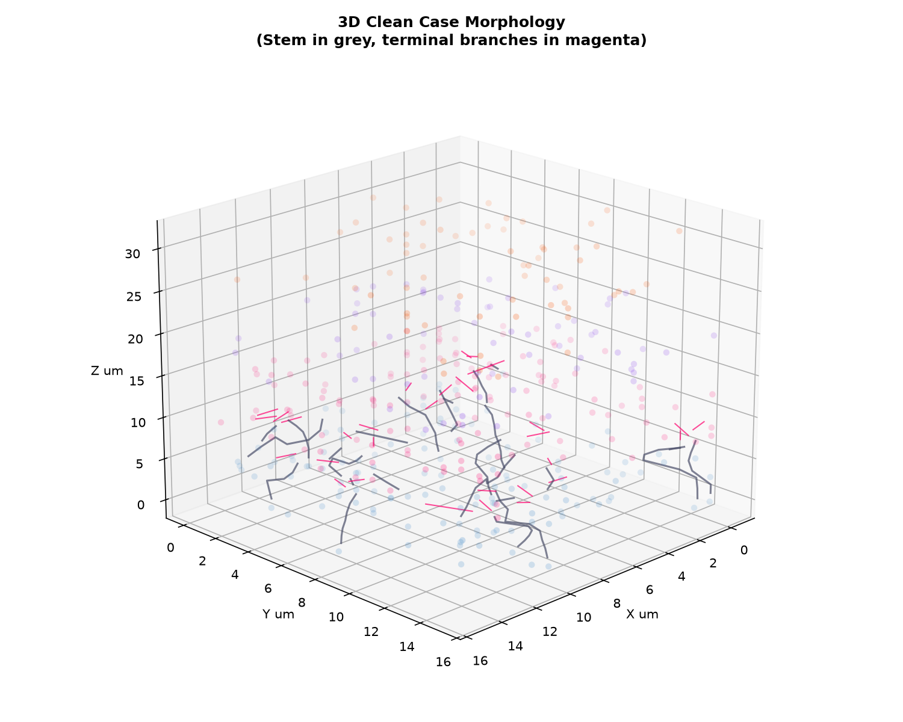

### Panel 2: 3D Dense Morphology
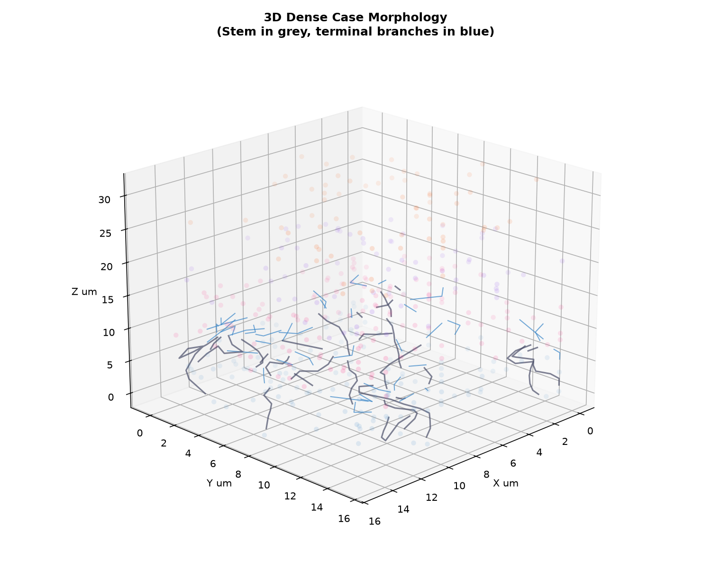

### Panel 3: 3D Synapse Spatial Comparison
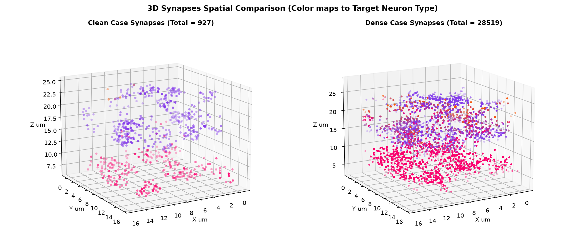

### Panel 4: 3D Stimulated Somas
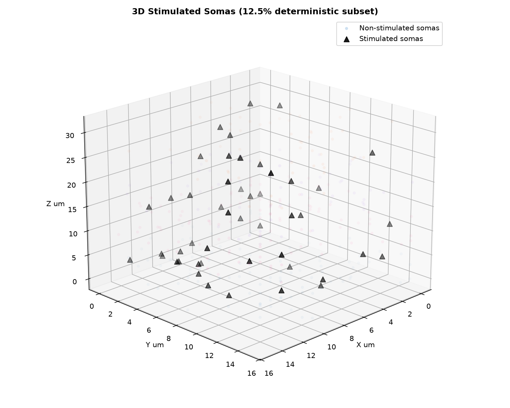

### Panel 5: Projection Heatmap
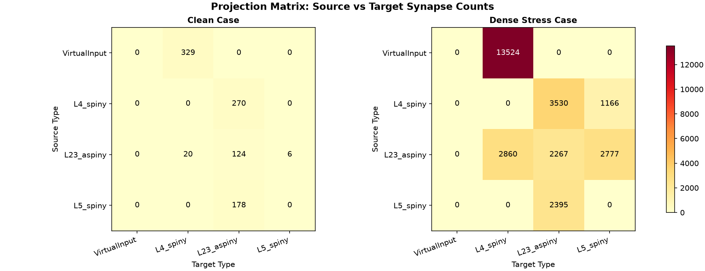

### Panel 6: Fan-in / Out-degree Histograms
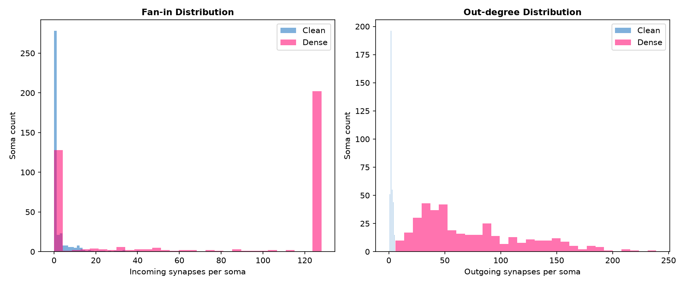

### Panel 7: Parity Error Heatmap
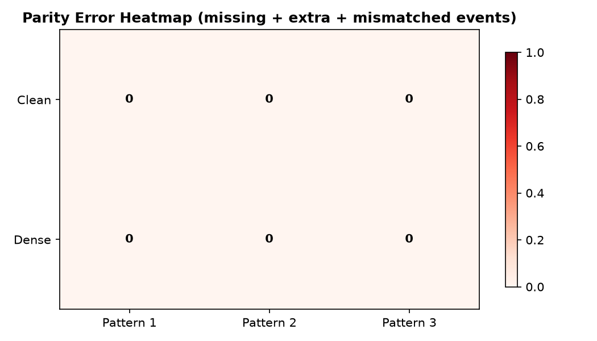

### Panel 8: Clean Case Event Raster (Pattern 3)
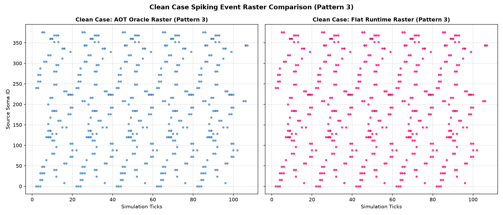

### Panel 9: Dense Case Event Raster (Pattern 3)
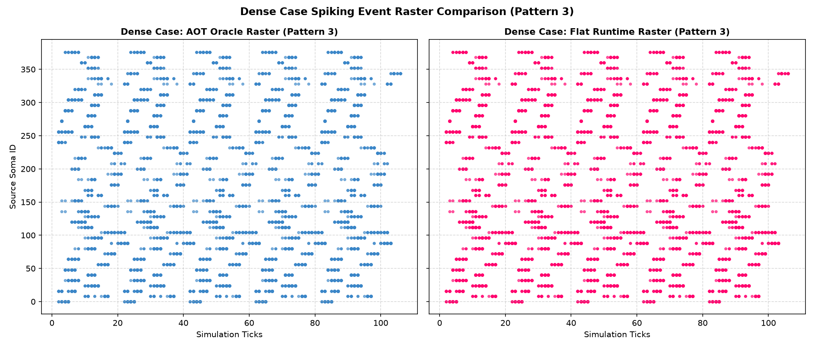

### Panel 10: Pattern 1 & 2 Event Rates
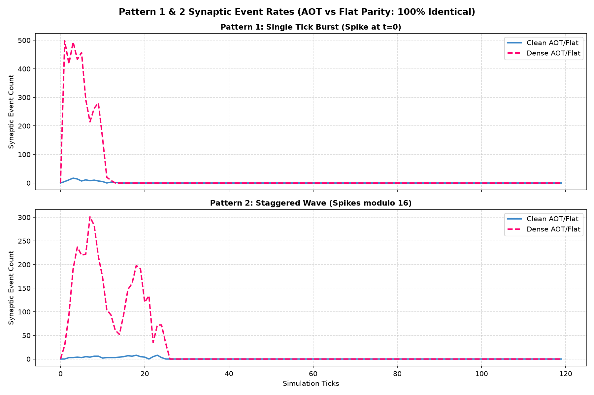

### Panel 11: Pattern 3 Event Rates
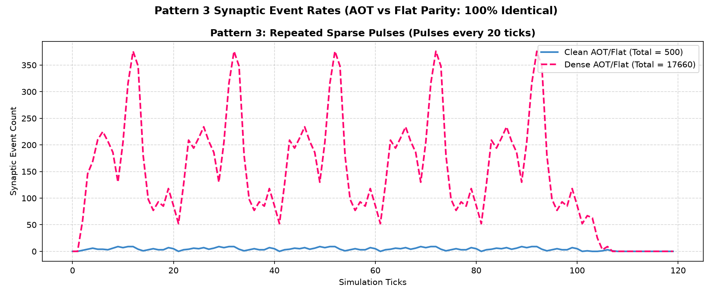

Each panel shows:
- **Panels 1 & 2 (Clean/Dense Morphology)**: Somas and axon arbors. Stem is grey, terminal arbors are highlighted.
- **Panel 3 (Synapse Spatial Comparison)**: The 3D distribution of touch-based synapses formed in both Clean and Dense configurations.
- **Panel 4 (Stimulated Somas)**: The deterministic 12.5% stimulated soma subset used by all spike patterns.
- **Panel 5 (Projection Heatmap)**: Source-target projection matrices for Clean and Dense cases.
- **Panel 6 (Degree Histograms)**: Fan-in and out-degree distributions.
- **Panel 7 (Parity Error Heatmap)**: All tested combinations remain at zero missing/extra/mismatched events.
- **Panels 8 & 9 (Event Rasters)**: Side-by-side comparison of spike rasters for AOT Oracle vs. Flat Runtime, showcasing identical spike times across all somas.
- **Panels 10 & 11 (Event Rates)**: Line plots comparing the event rate per tick over time for all three patterns, showing perfect overlay of the AOT and Flat curves.
