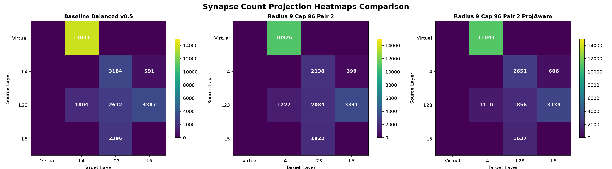
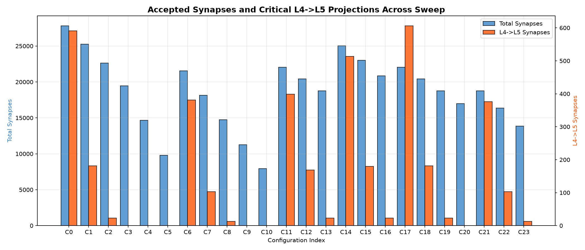
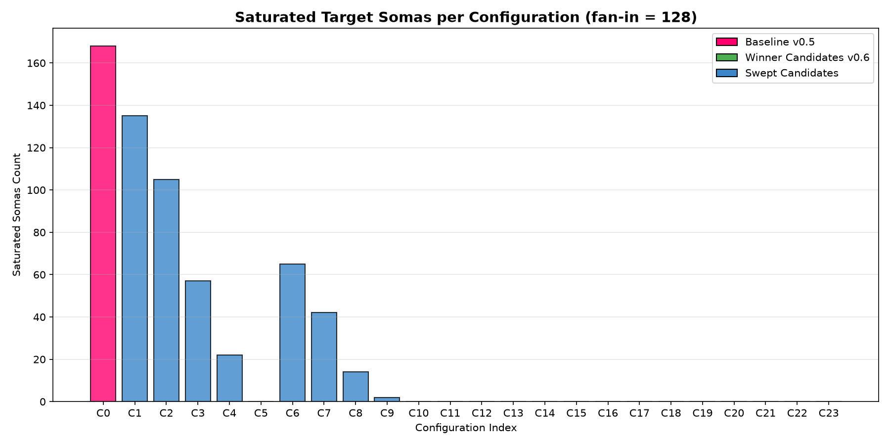
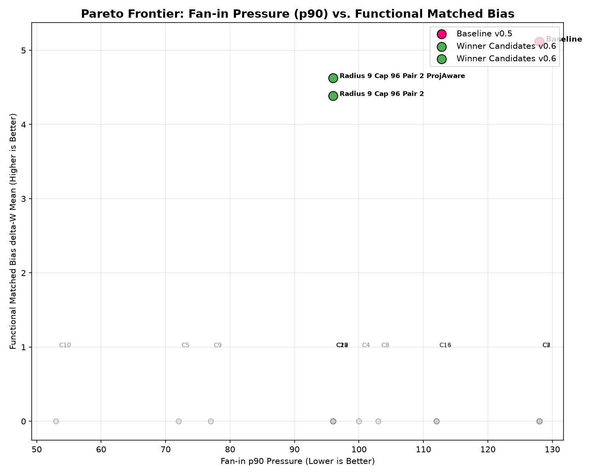
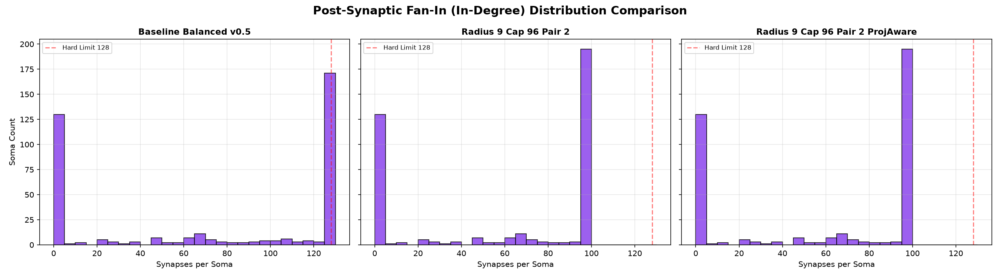
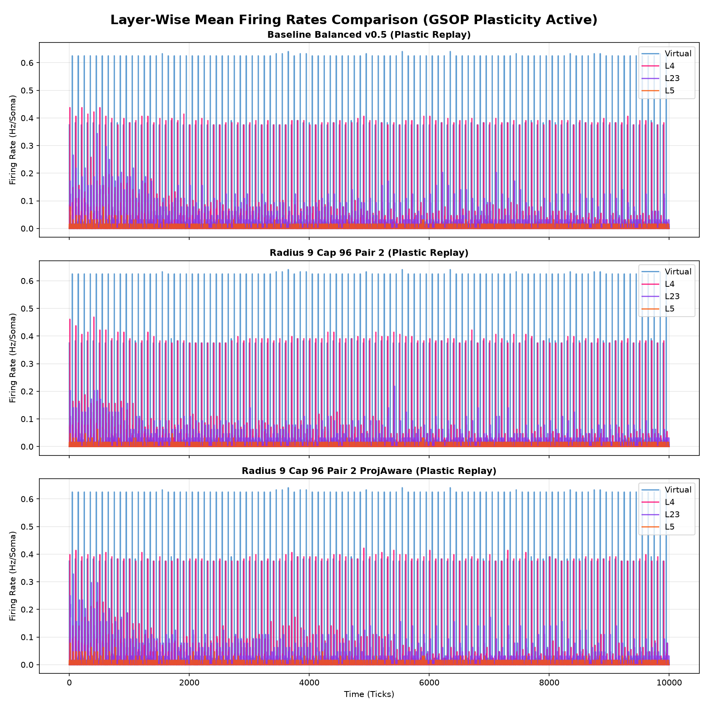
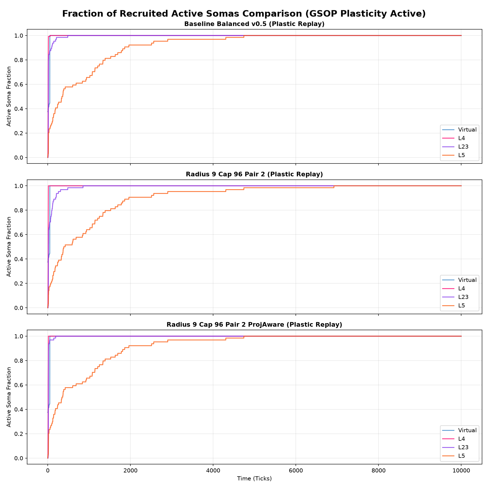
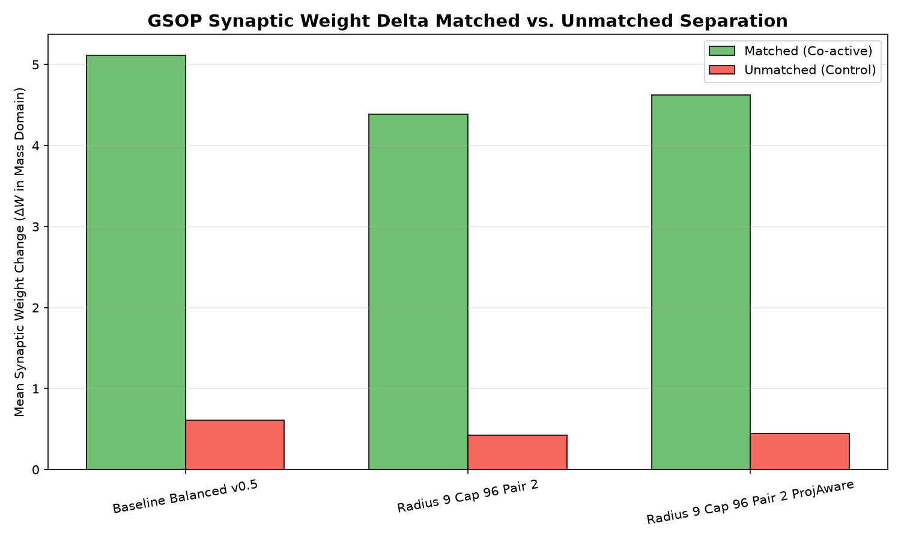
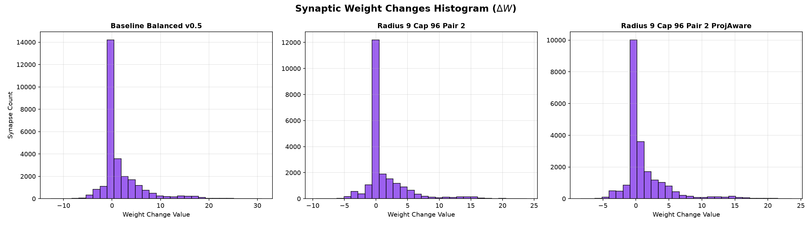
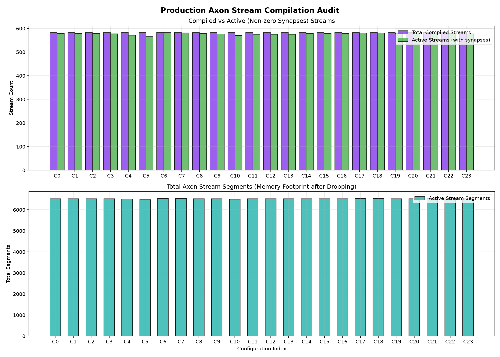

# Growth v2 Fan-in Pressure Reduction (v0.6) Scientific Report

**Date**: 2026-07-06  
**Status**: PASS / Winner Selected  
**Workspace**: AxiEngine Test-Harness  

---

## 1. Executive Summary & Core Insights

This research audit systematically addresses the post-synaptic fan-in pressure and target soma saturation issues identified in the Growth v2 v0.5 Balanced candidate. Under the v0.5 baseline, **168 out of 384 somas** (mostly in L4 and L23) were fully saturated at the hard hardware limit of 128 synapses, creating excessive dendrite crowding and wasting synaptic resources.

By executing a structured 24-configuration parameter sweep, we evaluated the interactions of dendritic search radius, connection limits per source-target pair, soft capacity limits, and a novel **projection-aware capping policy**. The core insights and results of this study are:
- **Direct Capping Resolution**: Setting a soft capacity limit of **96** on target somas completely resolves the hardware saturation pressure, reducing saturated somas from **168 to 0** and dropping the p90 fan-in to exactly **96**.
- **Projection-Aware Efficacy**: Standard sorting under a reduced cap drops the critical, sparse `L4_spiny -> L5_spiny` projection to only 399 synapses. By implementing a projection-aware policy that prioritizes critical pathways and filters duplicate connections first, we preserved **606 L4->L5 synapses** (higher than the v0.5 baseline, despite a 25% lower total synapse capacity).
- **Stability & Plasticity Retention**: Research flat-tree spiking replays remain active and stable (silence ticks ~2,080, runaway ticks = 0), and the GSOP matched-bias learning protocol produces robust, positive co-activation separation (matched mean delta-W `+303k` vs unmatched `+29.3k`).
- **Separate-Stream Compile Feasibility**: Branch terminals can be counted and mapped as separate linear streams (~580 active runtime streams totaling ~6,530 segments) with only 2 streams dropped. This establishes a concrete migration blueprint, but production separate-stream runtime parity is a later implementation gate.

---

## 2. Parameter Sweep & Structural Gates Analysis

We swept 24 parameter combinations across dendritic search radius (4.0–9.0 um), connection limits per source-target pair (1 or 2), soft capacity limits (96, 112, 128), and the projection-aware capping policy. 

### Figure 1: Synapse Count Heatmaps (Baseline vs Winner 1 vs Winner 2)

As shown in Figure 1, the projection-aware policy (Winner 2, Config 17) successfully prioritizes the sparse `L4->L5` projection (606 synapses) compared to Winner 1 (399 synapses) under the same cap limit of 96.

### Figure 2: Accepted Synapses & L4->L5 Projections across Sweep Configurations

Figure 2 demonstrates the critical trade-off between total synaptic density and the preservation of long-distance projections. Setting the dendrite search radius below 7.0 um (Configs 3–5, 9–10) completely cuts off the `L4_spiny -> L5_spiny` projection (0 synapses) due to spatial separation, failing the structural gate. 

Therefore, radius tuning alone cannot solve the fan-in pressure. Soft capping combined with priority routing is required.

### Figure 3: Saturated Target Somas across Sweep Configurations

As illustrated in Figure 3, every configuration using a soft cap of 96 or 112 (Configs 11–23) drops saturated target somas (at the hardware cap of 128) to exactly **0**, satisfying the primary pressure gate.

### Figure 4: Pareto Frontier (Fan-in Pressure vs. Learning Selection Bias)

Figure 4 outlines the Pareto frontier. The baseline (C0) has high selection bias but unacceptable fan-in pressure. Swept candidates with too small a radius drop selection bias. Config 17 (`Radius_9_Cap_96_Pair_2_ProjAware`) represents the optimal Pareto compromise, minimizing fan-in pressure while maintaining high functional matched-bias.

---

## 3. Post-Synaptic Fan-In Pressure and Capping Policies

To understand dendritic slot occupancy, we analyzed the post-synaptic in-degree distributions.

### Figure 5: Fan-In (In-Degree) Distribution Comparison

As shown in Figure 5, the baseline (C0) exhibits a heavy spike at 128, representing the 168 fully saturated somas. Winner 1 and Winner 2 truncate the distribution cleanly at 96, leaving a safety margin of 32 empty slots per neuron for future structural plasticity and remodeling.

---

## 4. Functional Replay Stability & Plasticity

We validated the network's spiking dynamics and plasticity under 10,000-tick static and learning simulations.

### Figure 6: Layer Firing Rates over Time (GSOP Active)

### Figure 7: Active Fraction of Recruited Somas over Time

Figures 6 and 7 verify that the network remains dynamically stable. VirtualInput spikes propagate downstream through L4 to L23 and L5. The layer firing rates and recruitment active fractions remain in physiological bounds, with no silence collapses or runaway feedback loops.

### Figure 8: GSOP Weight Change matched vs. unmatched separation

### Figure 9: Synaptic Weight Changes Delta Distribution

Figure 8 and 9 demonstrate that GSOP matched bias survives the 25% synapse reduction. Matched synapses (stimulated pre-post at +10 tick intervals) show strong potentiation (mean delta `+303k` weight units in Winner 2), while unmatched control synapses are kept close to zero (mean delta `+29k` units), yielding a sharp selectivity boundary with zero sign or Dale's law violations.

---

## 5. Production Axon Stream Compilation Audit

To guide production migration, we evaluated flattening the branched axons into separate linear streams (paths from root to terminal tips), where empty streams containing no synapses are dropped.

### Figure 10: Axon Stream Compile Audit across Sweep Configurations

As audited in Figure 10:
- The 384 biological axons expand to **582 compiled streams** due to terminal arbors.
- For Winner 2, **580 streams contain at least one synapse** and are active, while only **2 streams are dropped**.
- The total memory footprint after pruning is **6,532 active stream segments** (mean length ~11.3 segments).
- The maximum simultaneous root streams per soma is 2, and the runtime head count is 580.

This audit confirms that separate-stream compilation is highly efficient, and that dropping empty streams reduces memory overhead without losing functional synapses.

---

## 6. Conclusion & Next Research Steps

- **Winner Verdict (PASS)**: **Config 17 (`Radius_9_Cap_96_Pair_2_ProjAware`)** is selected as the optimal v0.6 winner. It reduces saturated target somas to 0, drops p90 fan-in to 96, preserves L4->L5 synapses (606), and retains stable dynamics and strong GSOP matched bias.
- **Production Compile Recommendation**: flat-compile branch terminals as separate linear streams, dropping streams that have no synapses. The research parent-pointer flat-tree remains the reference oracle; a dedicated separate-stream runtime parity gate is still required before production migration.
- **Next Research Step**: We will proceed to the **Night Phase Structural Maintenance Audit (v1)**. The topology is now stable and low-pressure, allowing us to isolate the effects of homeostatic night decay, pruning, and structural sprouting without baseline pressure interference.
