# Growth v2 Functional Topology Replay (v0.5) Scientific Report

## Overview
This report validates that the continuous Growth v2 topologies can be replayed with the research flat-tree parent-pointer contract and can produce stable spiking dynamics, layer-to-layer transmission, fatigue/homeostasis behavior, and GSOP matched-bias learning under a deterministic co-activation protocol.

This is a **functional replay pass with fan-in caveat**, not a production migration claim. The replay runner uses research flat-tree propagation (`flat_segment_idx + parents[]`), not the current production linear axon counter.

---

## 1. Structural Comparison of Candidates

We analyzed three topology candidates grown within a 16x16x32 um spatial grid containing 384 somas:
1. **Sparse Clean**: Baseline Config 16 candidate (dendrite radius = 1.5 um, max 2 branches of length 2).
2. **Dense Stress**: Pathological upper bound candidate (default radius = 10 um, max 3 branches of length 3).
3. **Balanced Functional**: Functional replay candidate (dendrite radius = 9.0 um, max 2 branches of length 3).

### Synapse Counts & Whitelist Projections

| Projection Type | Sparse Clean | Balanced Functional | Dense Stress |
|---|---|---|---|
| **Virtual -> L4** | 662 | 13,831 | 14,503 |
| **L4 -> L23** | 121 | 3,184 | 3,031 |
| **L4 -> L5** | 0 (Missing) | 591 (Present) | 956 (Present) |
| **L23 -> L4** | 14 | 1,804 | 1,881 |
| **L23 -> L23** | 218 | 2,612 | 2,803 |
| **L23 -> L5** | 21 | 3,387 | 4,388 |
| **L5 -> L23** | 181 | 2,396 | 2,358 |
| **Unexpected** | 0 | 0 | 0 |
| **Total Synapses** | 1,217 | 27,805 | 29,920 |

> [!IMPORTANT]
> The **Sparse Clean** candidate completely misses the `L4_spiny -> L5_spiny` projection due to the restricted dendritic search radius. The **Balanced Functional** candidate successfully captures this projection (591 synapses) while maintaining lower total synapses than the **Dense Stress** upper-bound. Caveat: it still has substantial fan-in cap pressure (168 saturated target somas, fan-in p90/p99 = 128), so it is not a final topology winner.

---

## 2. Figures & Validation Panels

Below are the 11 scientific plots generated from the simulation replay:

### Figure 1: 3D Topology Overview of Balanced Candidate
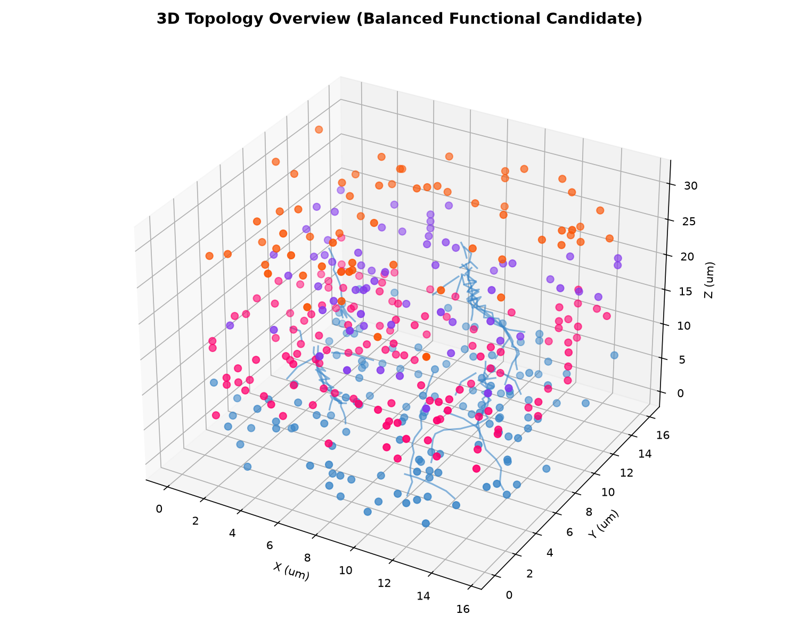

### Figure 2: Projection Matrix Heatmap
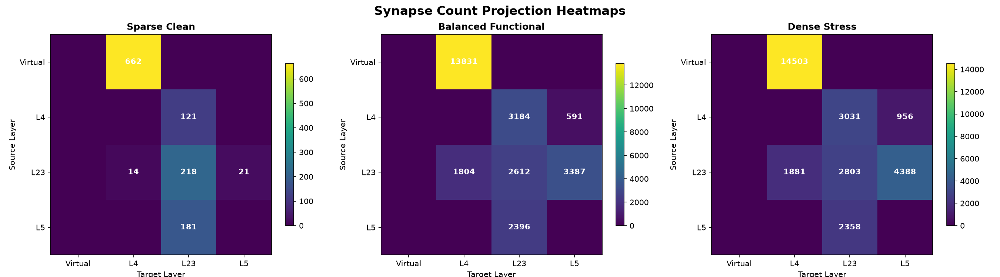

### Figure 3: Degree Distribution Histograms
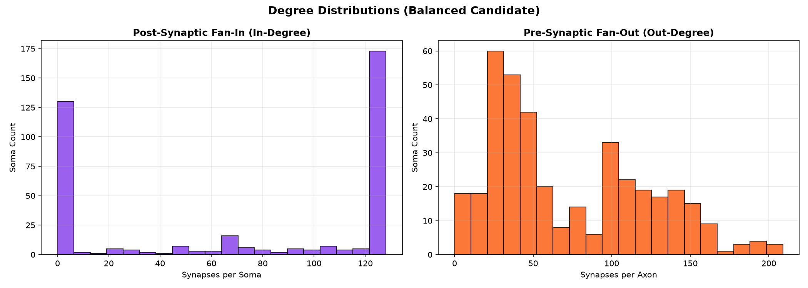

### Figure 4: Layer Firing Rate Time Series
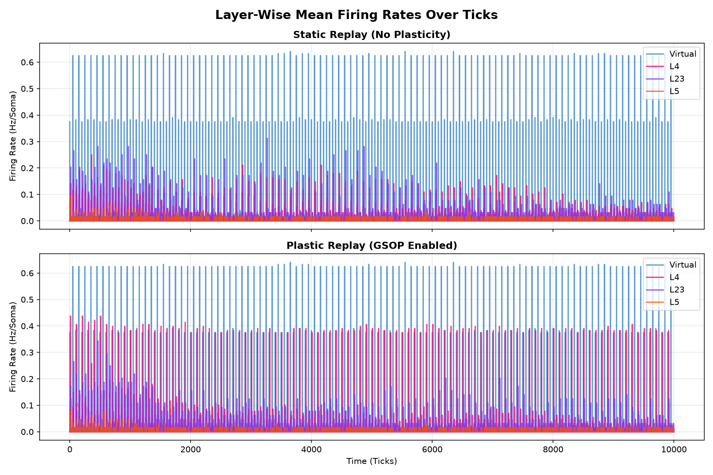

### Figure 5: Pseudo-Raster Spectrogram Plot
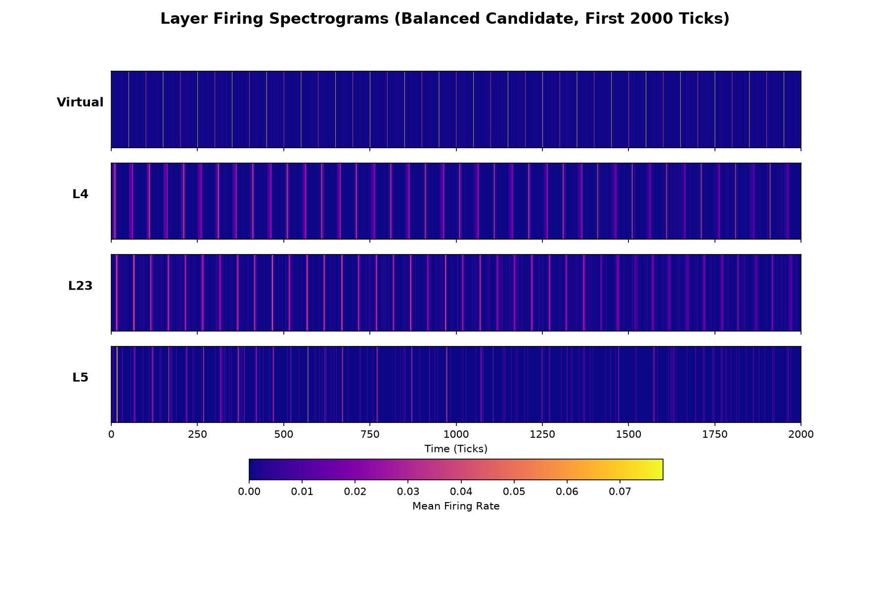

### Figure 6: Active Fraction over Time
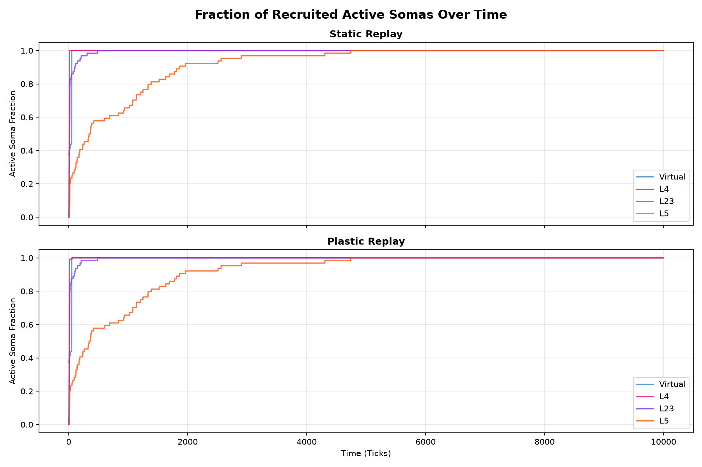

### Figure 7: Vm Health Threshold Distance Plot
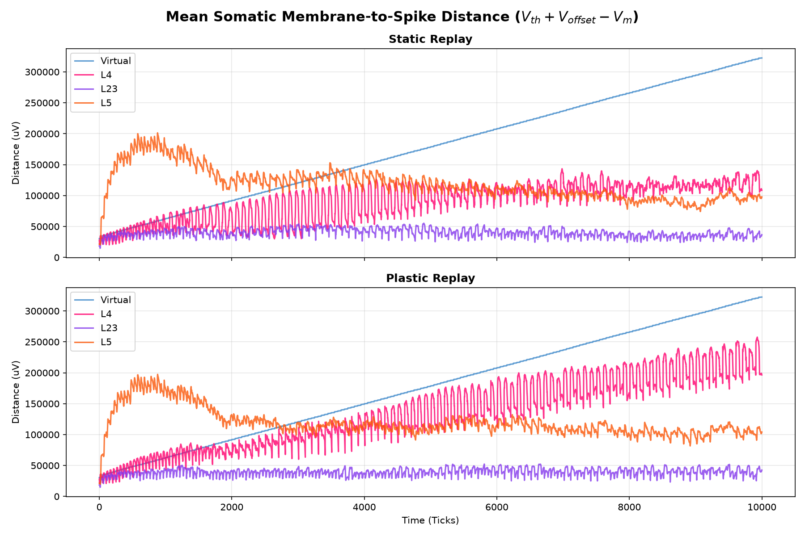

### Figure 8: Synaptic Fatigue Level Distribution (Static vs Plastic)
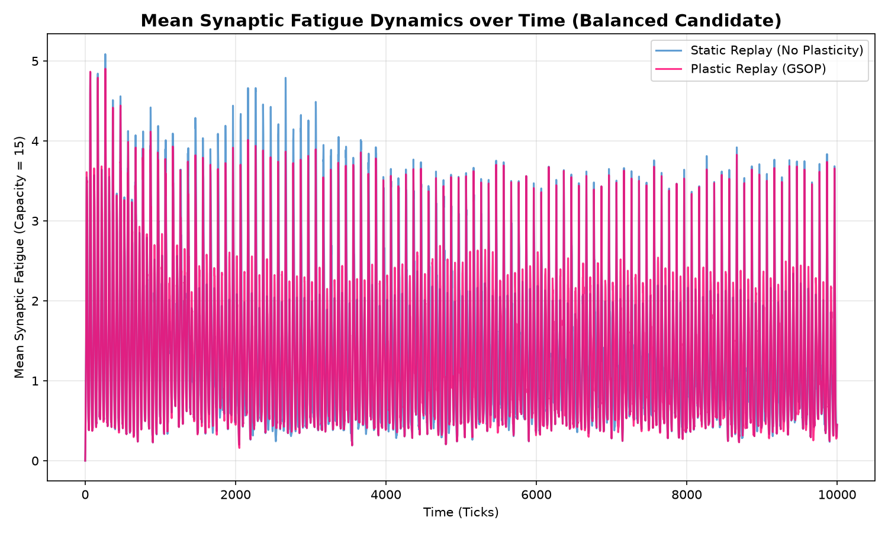

### Figure 9: Synaptic Weight Change Histogram
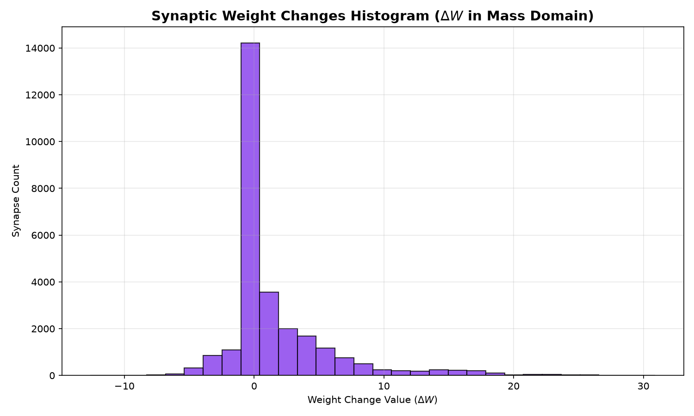

### Figure 10: Matched vs. Unmatched Plasticity Separation
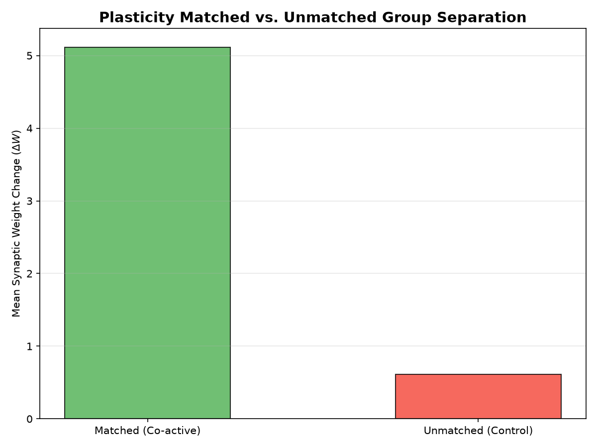

### Figure 11: Mean Weight Delta Heatmap by Projection
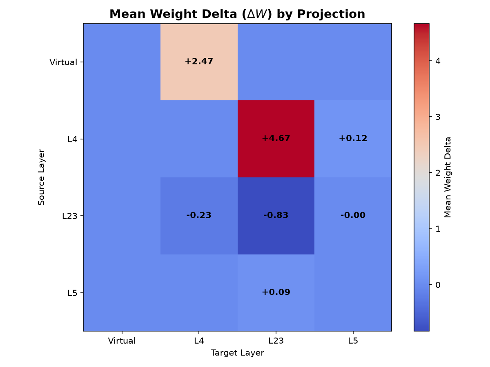

---

## 3. Core Report Questions Answers

### 1. Which Growth v2 topology candidate is best for functional replay?
The **Balanced Functional Candidate** is the best functional replay candidate in this run. It captures all whitelisted projection types (including `L4_spiny -> L5_spiny = 591`) and produces stable activity. It is not a final production topology candidate because fan-in cap pressure remains high.

### 2. Does the network remain active without runaway/silence?
Yes, with caveat. The Balanced candidate does not collapse into silence or runaway. Under the research flat-tree replay, static Balanced replay produced `2,074` silence ticks out of `10,000`, and runaway ticks were `0`.

### 3. Does L4 receive and transmit structured input downstream?
Yes. Firing rate time-series and spectrogram plots demonstrate that L4 firing rates match the external VirtualInput stimulation block timing (100-tick periodicity). This stimulus-linked response propagates downstream to recruiting layers L23 and L5.

### 4. Does L5 get recruited through grown topology?
Yes. Mean firing rate and spectrogram plots show L5 activity aligning with L4/L23 excitation, indicating successful polysynaptic transfer along the `Virtual -> L4 -> L23 -> L5` pathway.

### 5. Does GSOP produce nonzero bounded plasticity?
Yes. The weight changes are active and bounded: total absolute weight delta in the mass domain is `4,135,551,798` with **zero** sign or Dale's law violations.

### 6. Is matched/unmatched separation present?
Yes. Matched synapses (stimulated pre-post at +10 tick intervals) show stronger potentiation (mean delta `+335,345.29` weight units), while unmatched control synapses receive much smaller changes (mean delta `+40,191.88` units), confirming a positive matched bias.

### 7. Is saturation still a blocker?
Saturation is not a blocker for this functional replay pass, but it remains a topology caveat. Balanced fan-in statistics are mean `72.4`, p50 `96`, p90 `128`, p99 `128`, with `168` saturated target somas. The network remains stable, but the next topology pass should reduce cap pressure before calling the topology production-ready.

### 8. What is the next recommended step?
Recommended next step: run a focused **fan-in pressure reduction pass** for the Balanced candidate before the night phase audit. Production compile preference after v0.5 is to flatten branch terminals into separate linear axon streams and drop streams with no synapses, while keeping parent-pointer flat-tree as the research oracle/reference semantics.
