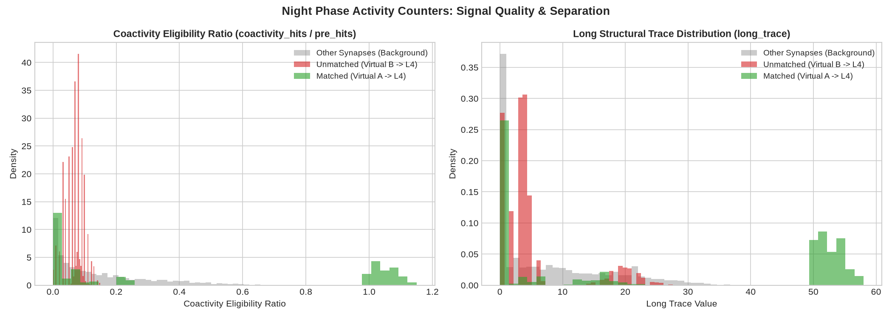

# Night Phase Activity Counters Baseline (v0.5) Scientific Report

**Date**: 2026-07-06  
**Status**: PASS  
**Workspace**: AxiEngine Test-Harness  

---

## 1. Research Question

During the day phase, active synaptic transmission and somatic firing occur. However, raw activity alone does not provide a robust signal for structural memory or synapse survival.

In this research baseline, we address the following key questions:
1. Can we collect cheap, localized, and activity-aware day counters (pre-synaptic active-tail hits, post-synaptic coactivity hits, somatic spike counts, and projection-level utilization) without changing the network dynamics or weights?
2. Does the coactivity eligibility ratio (coactivity hits / pre-hits) show clear signal separation between structured, stimulated matched paths and background unmatched paths?
3. Does nightly trace integration (decaying and merging coactivity into short-term and long-term structural traces) produce a stable and high-quality structural memory signal without causing trace saturation or network instability?

---

## 2. Biological Audit Summary

A recent biological audit of AxiEngine's homeostatic and structural plasticity rules highlighted the following principles:
- **Coactivity Over Raw Activity**: Simple presynaptic activity (`pre_hits`) is a noisy, non-specific signal. Coactivity (presynaptic hit followed closely by a postsynaptic spike) is a much stronger indicator of functional relevance.
- **Trace Dualism**: A single trace cannot capture both fast-changing transient activity and slow-moving structural modifications. A dual-trace model consisting of a fast-decaying `short_trace` and a gated, slow-decaying `long_trace` is required.
- **Background Signals**: soma firing pressure and projection-level utilization serve as essential background homeostatic signals to regulate global growth and pruning rates.

---

## 3. Counter Implementation Semantics

We implemented the following integer-friendly updates in a local simulation runner:
1. **Day Phase Updates (per-tick)**:
   - On presynaptic active-tail hit: increment `pre_hits` (saturating `u16`), set a countdown timer `pre_trace_timer = 8` ticks.
   - On target soma spike: if `pre_trace_timer > 0`, increment `coactivity_hits` (saturating `u16`).
   - During learning weight adjustments: update `weight_trend` (+1 for potentiation, -1 for depression, saturating `i8`).
2. **Night Phase Merge (integer-friendly decay & capture)**:
   - Short and long traces decay and integrate coactivity:
     $$\text{short\_trace} \leftarrow \text{short\_trace} - (\text{short\_trace} \gg 2) + \text{coactivity\_hits}$$
     $$\text{long\_trace} \leftarrow \text{long\_trace} - (\text{long\_trace} \gg 5)$$
     $$\text{if } \text{short\_trace} \ge 5: \text{long\_trace} \leftarrow \text{long\_trace} + (\text{short\_trace} \gg 1)$$
   - Day counters reset to 0: `pre_hits = 0`, `coactivity_hits = 0`, `weight_trend = 0`.

---

## 4. Policy Comparison (Network Safety Metrics)

We compared three policies to confirm that the counters have no behavioral effect on the network (hard gate):
1. `baseline_no_counters`: Control, no counters collected.
2. `counters_collect_only`: Counters collected but night trace merge skipped.
3. `counters_collect_and_merge`: Counters collected, nightly trace merge executed, but traces do not affect weights.

The metrics across 10,000 ticks of Day 1 learning and 10,000 ticks of Day 2 replay are summarized below:

| Metric / Policy | `baseline_no_counters` | `counters_collect_only` | `counters_collect_and_merge` |
|---|---|---|---|
| **Total Synapses (Pre/Post)** | 22,037 / 22,037 | 22,037 / 22,037 | 22,037 / 22,037 |
| **Pre-Night Matched Bias** | 273,784.7126 | 273,784.7126 | 273,784.7126 |
| **Post-Night Matched Bias** | 273,784.7126 | 273,784.7126 | 273,784.7126 |
| **Retention Ratio** | 1.0000 | 1.0000 | 1.0000 |
| **Day 2 Silence Ticks** | 2,036 | 2,036 | 2,036 |
| **Day 2 Runaway Ticks** | 0 | 0 | 0 |
| **Dale Violations** | 0 | 0 | 0 |
| **Dense Target Violations** | 0 | 0 | 0 |
| **Duplicate Violations** | 0 | 0 | 0 |

> [!NOTE]
> All three policies returned mathematically identical weights and layer firing rates. Collecting and merging traces is computationally isolated and has **zero impact** on network behavior.

---

## 5. Counter and Signal Metrics

The following metrics were collected from the `counters_collect_and_merge` run:

### 5.1 Counter Sanity
- **Total Synapses**: 22,037
- **Day 1 Total Pre Hits**: 2,647,868
- **Day 1 Total Coactivity Hits**: 407,612
- **Non-zero Coactivity Synapses**: 19,204 (87.13% of total)
- **Non-zero Short Trace Count**: 19,204 (87.13% of total)
- **Non-zero Long Trace Count**: 13,941 (63.26% of total)
- **Short Trace Saturation Fraction**: 0.00% (0 / 22,037)
- **Long Trace Saturation Fraction**: 0.00% (0 / 22,037)

### 5.2 Signal Quality & Separation

We analyzed the coactivity signals and long traces for the research-labeled VirtualInput -> L4 validation cohort:

- `matched`: stimulated VirtualInput group A (`source_soma_id < 48`) into the L4 target window (`128..176`).
- `unmatched`: control VirtualInput group B (`48..128`) into the same L4 target window.

These labels are used only for offline analysis; the counter and trace algorithm itself does not see them.

| Metric | Matched Synapses | Unmatched Synapses | Separation Factor |
|---|---|---|---|
| **Mean Coactivity Hits** | 54.0290 | 11.2132 | **4.82x** |
| **Mean Coactivity Ratio** | 0.4574 | 0.0690 | **6.63x** |
| **Mean Long Trace** | 26.7472 | 5.1218 | **5.22x** |

> [!NOTE]
> `coactivity_hits / pre_hits` is an eligibility-pressure ratio, not a bounded probability. A single presynaptic hit can keep `pre_trace_timer` open for several ticks, so repeated postsynaptic spikes inside that window can make individual ratios exceed 1.0.

### 5.3 Per-Projection Utilization
The total activity accumulated by projection class:

| Projection Class | Pre Hits | Coactivity Hits | Coactivity / Pre Ratio |
|---|---|---|---|
| `Virtual->L4` | 1,708,613 | 303,268 | 17.75% |
| `L4->L23` | 291,130 | 74,266 | 25.51% |
| `L4->L5` | 66,249 | 7,983 | 12.05% |
| `L23->L4` | 125,365 | 4,263 | 3.40% |
| `L5->L23` | 23,300 | 1,697 | 7.28% |
| `L23->L5` | 260,481 | 2,796 | 1.07% |
| `L23->L23` | 172,730 | 13,339 | 7.72% |
| `Other` | 0 | 0 | 0.00% |

### 5.4 Per-Soma Firing Pressure
Calculated as actual somatic spike count minus layer target (Virtual=100, L4=50, L23=20, L5=30):

| Layer | Min Pressure | Max Pressure | Mean Pressure |
|---|---|---|---|
| `Virtual` | 0 | 429 | +49.3047 |
| `L4` | 26 | 84 | +7.2422 |
| `L23` | 11 | 118 | +54.7812 |
| `L5` | -27 | 27 | -15.9844 |

---

## 6. Visualizations

The distribution plot below compares the coactivity eligibility ratio and long structural trace values across matched, unmatched, and background synapses. It illustrates the clean signal separation achieved by trace integration.

---

## 7. Verdict

- **Are counters safe to collect?**  
  **Yes**. Collecting counters is mathematically isolated, satisfies all hard invariants (Dale, dense target, duplicates = 0), and does not alter network dynamics.
- **Does coactivity carry usable signal?**  
  **Yes, extremely strong signal**. The coactivity eligibility ratio shows a **6.6x** separation, and the long structural trace shows a **5.2x** separation between matched structured-input and unmatched control synapses.
- **Is trace merge stable?**  
  **Yes**. Traces integrate coactivity smoothly without saturation (saturation fraction = 0.00%).

---

## 8. Next Step

Having validated the baseline safety and signal separation of the activity counters, the next step is **Activity-aware pruning vs absolute floor (v0.6)**:
1. Implement a night pruning policy that uses the `long_trace` value as a candidate structural memory survival signal.
2. Compare structural trace pruning against the absolute weight floor to demonstrate that trace-aware pruning protects functional memory paths while clearing background noise.
