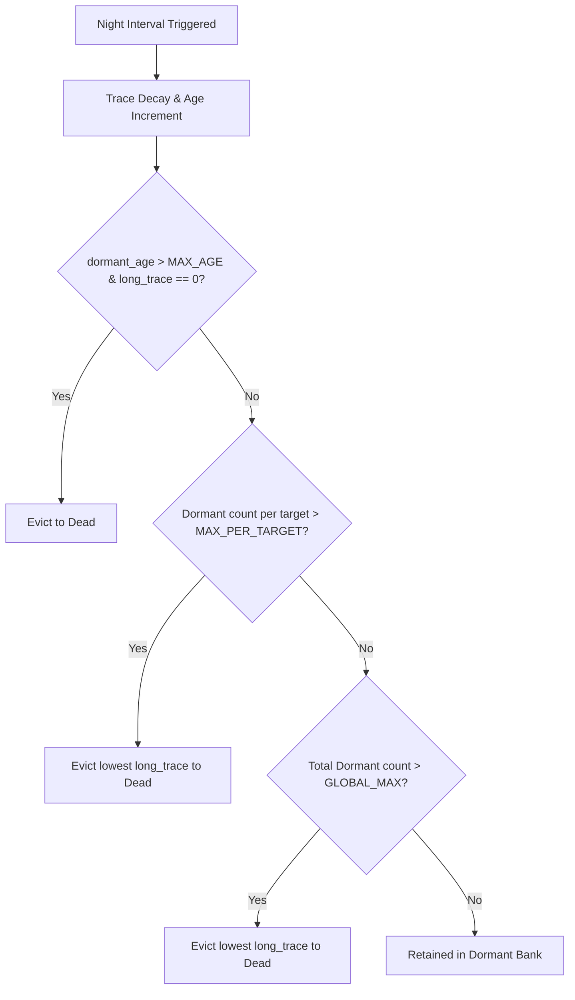

# Night Phase Age+Trace Eviction Report (v1.6c)

**Status**: `SUCCESS / AGE-TRACE EVICTION BRANCH VALIDATED`  
**Execution Date**: 2026-07-06  
**Test Harness**: [night_phase_age_trace_eviction_v1_6c.rs](file:///home/alex/AI_Home/workflow/AxiEngine/crates/test-harness/tests/night_phase_age_trace_eviction_v1_6c.rs)  
**Plot Data**: [plot_data.json](file:///home/alex/AI_Home/workflow/docs/engine/research/archive/2026-07-06_night_phase_age_trace_eviction_v1_6c/artifacts/plot_data.json)

---

## 1. Executive Summary

This micro-gate experiment isolates and validates the third branch of the dormant bank eviction logic: **age-out of inactive synapses**. 

To prevent interference from cap-based eviction, 100 synthetic synapses were initialized with unique `target_soma_id`s, high caps (`max_dormant_total = 500`, `max_dormant_per_target = 10`), and a `MAX_DORMANT_AGE` of 2.

The test verified that the state machine behaves as a perfect step-function:
* **Cycles 1 & 2**: All synapses remain in the Dormant Bank (`dormant = 100`, `dead = 0`) as their ages do not exceed 2.
* **Cycle 3**: Synapse age increments to 3, which is `> MAX_DORMANT_AGE` (2). Because `long_trace` is 0, the eviction branch fires for all 100 synapses, moving them to `Dead`.
* **Cycle 4**: Bank remains stable at 0.

This mechanically completes the validation of the three-pronged MVP eviction state machine. Biological timescale calibration is out of scope for this mechanical verification.

---

## 2. Quantitative Results

| Cycle | Dormant Count | Cumulative Dead (Evicted) | Age+Trace Evictions | Target Cap Evictions | Global Cap Evictions | Max Age |
| :--- | :---: | :---: | :---: | :---: | :---: | :---: |
| **1** | 100 | 0 | 0 | 0 | 0 | 1 |
| **2** | 100 | 0 | 0 | 0 | 0 | 2 |
| **3** | 0 | 100 | 100 | 0 | 0 | 0 |
| **4** | 0 | 100 | 0 | 0 | 0 | 0 |

---

## 3. Consolidation of MVP Night Phase Mechanics

With the completion of v1.6c, all three state-machine branches of the MVP night phase are fully validated and ready for production freeze:

1. **v1.6 (Consolidated Smoke Run)**: Proved basic stability, day/night cycles, trace decay, and target-aware sprouting without structural collapse.
2. **v1.6b (Eviction Stress)**: Proved target and global cap bounding under heavy pruning load (exceeded caps, evicting 11,000+ synapses to Dead while preserving active count bounds).
3. **v1.6c (Age+Trace Micro-Gate)**: Proved the step-function transition of the age-out eviction branch.
