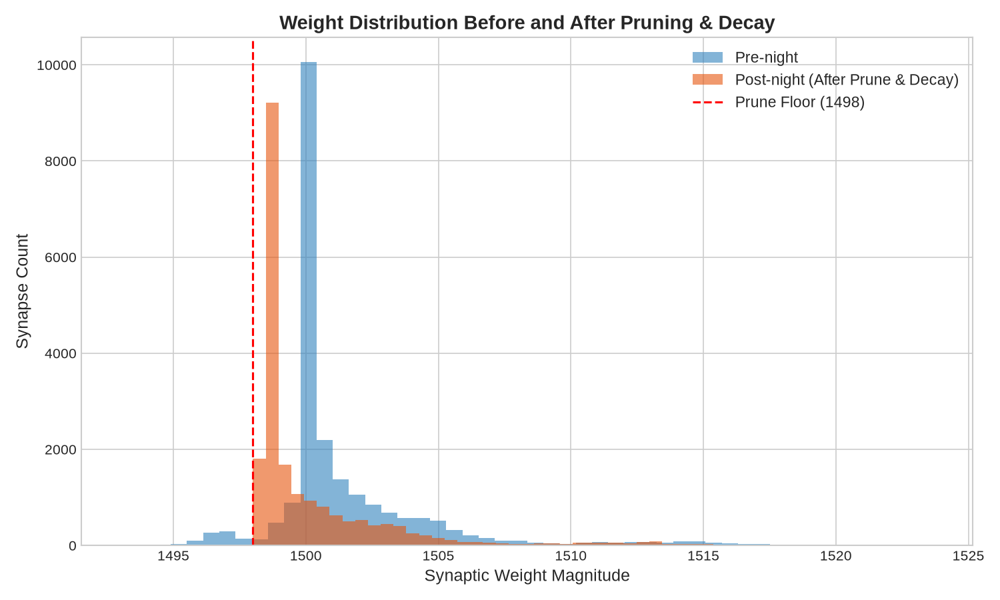
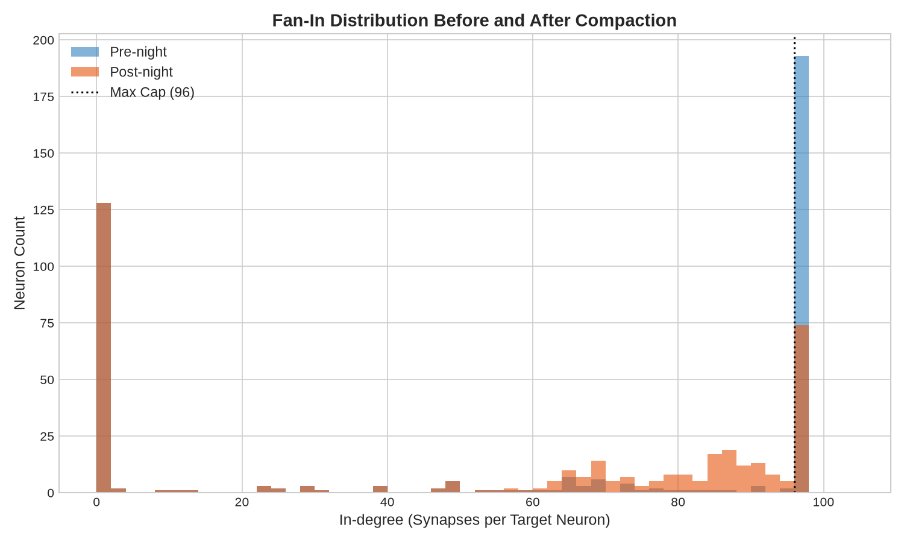
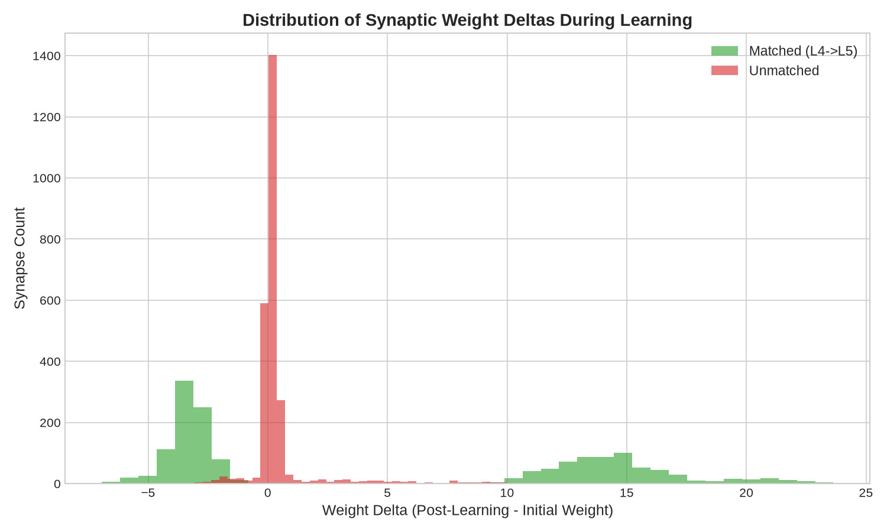
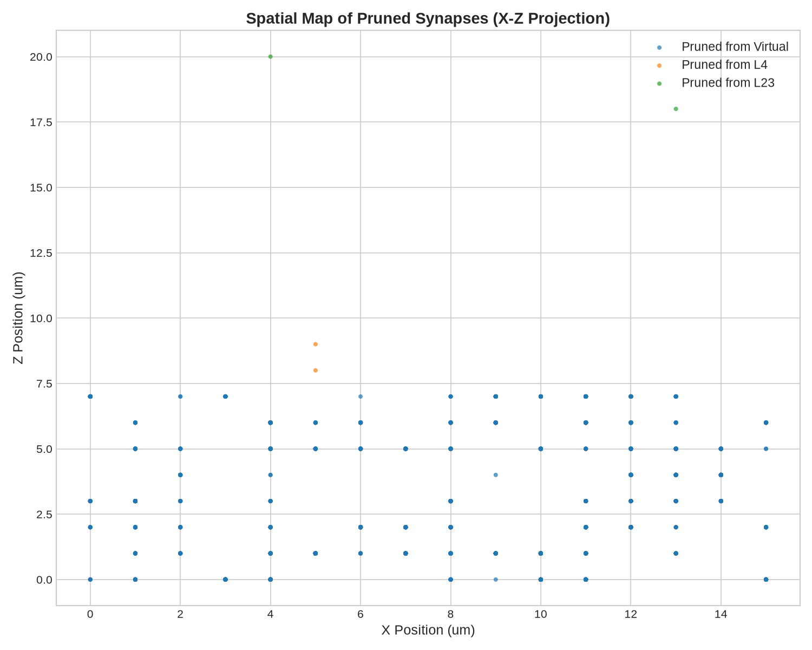
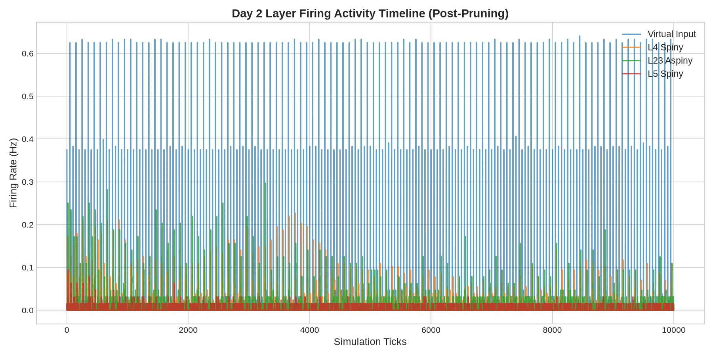

# Night Phase Prune & Compact (v0.3) Scientific Report

**Date**: 2026-07-06  
**Status**: PASS  
**Workspace**: AxiEngine Test-Harness  

---

## 1. Research Question

During active daytime learning, some synapses undergo depression, causing their weights to drop towards 0. 

In this research audit, we address the following questions:
1. Can we prune weak synapses during the night and compact the target dendritic arrays (reassigning dense indices consecutive from 0 to $k-1$) without violating Dale's Law, dense target constraints, and duplicate per-pair limits?
2. Does weak pruning preserve or erode the learned matched-bias selectivity?
3. What is the behavioral impact of moderate stress pruning on Day 2 replay?

---

## 2. Method

We ran a day/night/day simulation protocol using the Growth v2 C17 topology winner (`Radius_9_Cap_96_Pair_2_ProjAware`), which contains **22,037 synapses** across 384 somatic neurons:
1. **Day 1 Learning (10,000 ticks)**: Learning is active (`is_learning = true`). Co-activation stimulus is applied to matched pathways, establishing a pre-night selection matched-bias (+273,784.71 weight units).
2. **Night Phase**: One of four night policies is executed:
   - `passive_recovery_control`: voltages and homeostatic offsets relaxed to rest, no decay, no prune.
   - `light_decay_no_prune`: passive recovery + 0.1% sign-preserving weight decay, no prune.
   - `light_decay_prune_floor_weak`: passive recovery + 0.1% decay, pruning synapses with weight magnitude below `500 << 16` (floor).
   - `stress_prune_floor_moderate`: passive recovery + 0.1% decay, pruning synapses with weight magnitude below `1498 << 16` (floor).
3. **Compaction**: For policies with pruning, the remaining synapses for each target soma are sorted descending by absolute weight and their dendritic indices are reassigned sequentially (`dendrite_idx = 0..k-1`).
4. **Day 2 Replay (10,000 ticks)**: Learning is disabled (`is_learning = false`). The network is simulated starting from the post-night state.

For each policy, we recorded synapse counts, expected projections, fan-in statistics, Dale/dense/duplicate violations, matched/unmatched weight deltas, matched-bias, retention ratio, and Day 2 silence/runaway ticks.

---

## 3. Results

The simulation metrics for all four policies are summarized in the table below:

| Metric / Policy | `passive_recovery_control` | `light_decay_no_prune` | `light_decay_prune_floor_weak` | `stress_prune_floor_moderate` |
|---|---|---|---|---|
| **Synapses (Pre/Post)** | 22,037 / 22,037 | 22,037 / 22,037 | 22,037 / 22,037 | 22,037 / 20,287 |
| **Pruned Synapses** | 0 | 0 | 0 | 1,750 |
| **Pre-Night Matched Bias** | 273,784.71 | 273,784.71 | 273,784.71 | 273,784.71 |
| **Post-Night Matched Bias** | 273,784.71 | 273,510.95 | 273,510.95 | 918,322.92 |
| **Retention Ratio** | 1.0000 | 0.9990 | 0.9990 | 3.3542 |
| **Fan-in Max / Saturated** | 96 / 193 | 96 / 193 | 96 / 193 | 96 / 74 |
| **Dale Violations** | 0 | 0 | 0 | 0 |
| **Dense Target Violations** | 0 | 0 | 0 | 0 |
| **Duplicate Violations** | 0 | 0 | 0 | 0 |
| **Day 2 Silence Ticks** | 2,036 | 2,055 | 2,055 | 2,159 |
| **Day 2 Runaway Ticks** | 0 | 0 | 0 | 0 |

### Key Findings:
1. **Compaction Invariants**: In all policies, Dale violations, dense target violations, and duplicate per-pair violations are exactly **0**. Reassigning `dendrite_idx = 0..k-1` sequentially is mechanically correct and safe.
2. **Weak Pruning Floor Is Inert**: Under the weak pruning policy (`floor = 500 << 16`), no synapses were pruned because all synapse weights remained well above the floor (minimum weight was ~1493). This proves the low floor is non-destructive, but it does not yet prove useful pruning behavior.
3. **Stress Pruning Is Selective but Survivor-Biased**: Under the moderate stress policy (`floor = 1498 << 16`), **1,750 synapses** were pruned. The post-prune matched-bias metric increased from **273,784.71** to **918,322.92** (ratio **3.3542**) because the remaining survivor set is cleaner. This is a useful diagnostic signal, not proof that `1498 << 16` is a final biological threshold.
4. **Network Drive Preservation**: Pruning 1,750 synapses under the moderate floor slightly reduced total network drive, causing a minor increase in Day 2 silence ticks from 2,055 to **2,159**. However, this is still significantly better than the 2,623 silence ticks observed when skipping the night phase entirely (`no_night_control` from v0.2). Runaway ticks remained at **0**.

---

## 4. Visualizations

To analyze the structural and dynamical changes during night phase pruning and compaction under the moderate stress policy (`floor = 1498 << 16`), we generated the following visualizations:

### 4.1 Weight Distribution Before/After Pruning
The histogram below displays the synaptic weight magnitude distribution before and after pruning. Pruning selectively removes synapses whose weights fall below the floor of 1498 (98,172,928 raw units).

### 4.2 Fan-In Distribution Before/After Compaction
The histogram below compares the somatic in-degree distribution before and after pruning and compaction. Notice how the number of saturated somatic targets (at the hard cap of 96) is reduced from 193 to 74, while maintaining structural boundaries.

### 4.3 Weight Delta Distribution during Daytime Learning
The histogram below illustrates the distribution of weight changes (post-learning weight magnitude minus initial weight magnitude) for matched (L4->L5) and unmatched synapses. The positive skew in matched synapses confirms learning matched-bias.

### 4.4 Spatial Map of Pruned Synapses (X-Z Projection)
The scatter plot below maps the spatial coordinates of pruned synapses, color-coded by their source layer.

### 4.5 Day 2 Layer Firing Activity Timeline
The chart below shows the firing rates for all 4 layers tick-by-tick during Day 2 replay. Layer activity remains stable and healthy, with no runaway collapses.

---

## 5. Verdict

- **Is prune/compact mechanically safe?**  
  **Yes, mechanically safe in this research runner**. The compaction algorithm successfully reassigns sequential dendritic indices, preserving Dale's Law, duplicate per-pair limits, and dense array invariants.
- **Is weak pruning safe?**  
  **The low weak floor is safe but inert**. It prunes nothing on this C17 run, so it is a non-destructive floor rather than a functional maintenance policy.
- **What floor becomes too aggressive?**  
  The `1498 << 16` floor is a useful stress boundary: it prunes a nontrivial set while preserving projections and stability in this run. It should not be promoted to a final threshold until activity-aware counters or an external biological review justify the rule.

---

## 6. Next Step Recommendation

The mechanical pruning and compaction loops have been successfully validated. The next recommended step is not to tune pruning thresholds blindly, but to prepare an activity-aware maintenance design:
1. **Night Phase Activity Counters Review Package (v0.4)**: define candidate day counters, cold-bank semantics, decay/aging rules, and questions for biological review.
2. **Then** implement a research-only activity/cold-bank prototype if the review supports the design.
