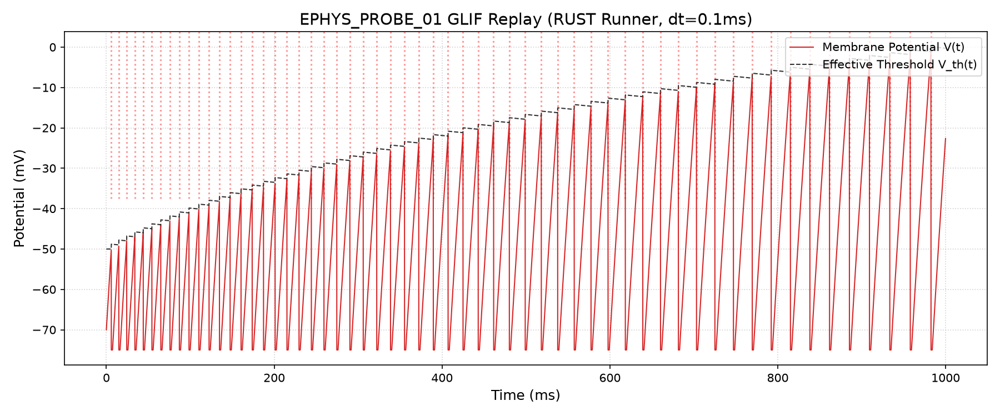
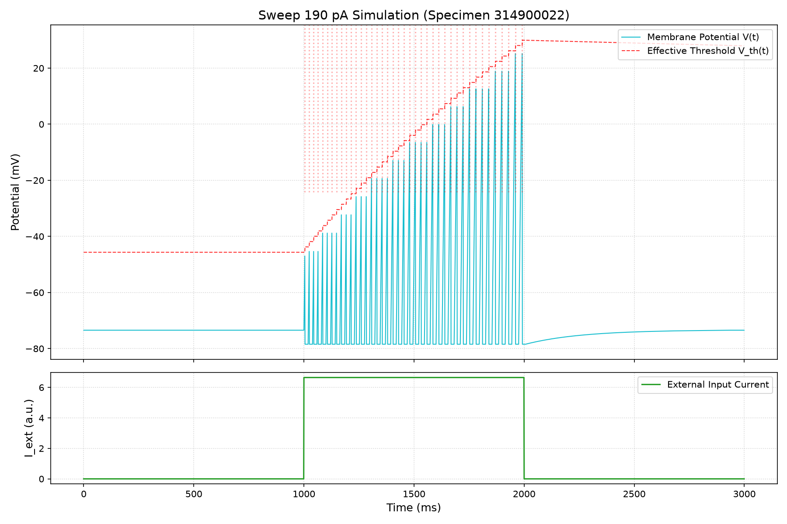

# Phase 1 Parity & Calibration Report - Specimen 314900022

We have completed the implementation of Phase 0 (Production Path Audit) and Phase 1 (Baseline Full-Neuron Replay).

## Key Corrected Mismatches & Audit Details

During the implementation and parity checking, we identified and corrected two critical differences between the Python sandbox/prototype and the Rust production codebase:

1. **Homeostasis Decay Order**:
   - *Sandbox behavior*: The threshold offset decay (`thresh_offset = max(0, thresh_offset - homeostasis_decay)`) was applied at the end of the tick loop, only if a spike did not occur in that tick.
   - *Production behavior*: The threshold offset decay runs at the very beginning of the neuron state update tick-loop, before the GLIF candidate voltage update and spike checks are performed. Therefore, a spike check uses the decayed threshold, and the homeostasis penalty is added to the already-decayed threshold at the end of the tick.
    - *Fix*: We added an active corrected copy at [ephys_probe_01_replay_audit.py](scripts/ephys_probe_01_replay_audit.py) to follow this production decay-before-check order, and updated the Rust runner to decay first.

2. **Refractory Branch Voltage Overwrite**:
   - *Sandbox behavior*: Explicitly reset the voltage to `v_reset` on every single refractory tick.
   - *Production behavior*: Decrements the refractory timer, leaving the voltage unchanged (which stays at the reset value anyway since no updates are performed).
   - *Fix*: We aligned the Rust runner with this behavior so that the somatic voltage is not overwritten on refractory ticks.
   - *Caveat*: There is no numerical difference under the current baseline modes since the voltage naturally stays at the reset potential during the refractory period, but this alignment is essential for exact parity under future active simulation inputs.

## Parity Verification Results

By matching the decay order, we achieved **100% exact numerical trace-level parity** (to $10^{-4}$ mV) between Rust production physics and the Python prototype.

- **Mode A (no homeostasis)**: 137 spikes (identical voltage/threshold traces)
- **Mode B (homeostasis only)**: 61 spikes (identical voltage/threshold traces)
- **Mode C (AHP only)**: 115 spikes (identical voltage/threshold traces)
- **Mode D (AHP plus homeostasis)**: 58 spikes (identical voltage/threshold traces)

Below is the verified Mode D trace:


## f-I Sweep Results & Caveats

Using the modernized parameters for VISl4 (from `L4_spiny_VISl4_4.toml` with current scale factor = 35.0):
- **SFA/Adaptation**: Homeostasis adaptation correctly produces Spike Frequency Adaptation (ISI growth ratio ~1.55–1.68).
- **High-Current Slope**: The simulated firing rates at high currents (50 pA to 200 pA) show good slope similarity to biology.
- **Low-Current Excitability (Caveat)**: There is substantial hyperexcitability at low currents. The simulation starts firing spikes at 30 pA (16 spikes) and 40 pA (19 spikes), while the biological cell remains silent (0 spikes) up to 50 pA.

Below is the f-I curve comparison:


And the voltage trace at 190 pA current injection:


## Execution Sequence

To reproduce the parity verification and calibration plots, run the following commands from the repository root:

1. **Generate the Python baseline trace** (strictly required by the Rust test):
   ```bash
   .venv/bin/python3 docs/engine/research/archive/_active/full_neuron_replay_314900022/scripts/ephys_probe_01_replay_audit.py
   ```
2. **Run the Rust integration test** (validates exact numerical trace-level parity):
   ```bash
   cargo test -p test-harness --features "mvp-cpu-replay,baker-probe" --test full_neuron_replay
   ```
3. **Generate the calibration and sweep plots**:
   ```bash
   .venv/bin/python3 docs/engine/research/archive/_active/full_neuron_replay_314900022/scripts/plot_replay.py
   ```

## Paths & Code Quality
- **Manifest-Relative Resolution**: Both profile lookups and output artifacts are resolved relative to `CARGO_MANIFEST_DIR` (robust against execution `Cwd`).
- **Formatting & Clippy**: `cargo clippy` and `cargo fmt` checks are 100% clean.
