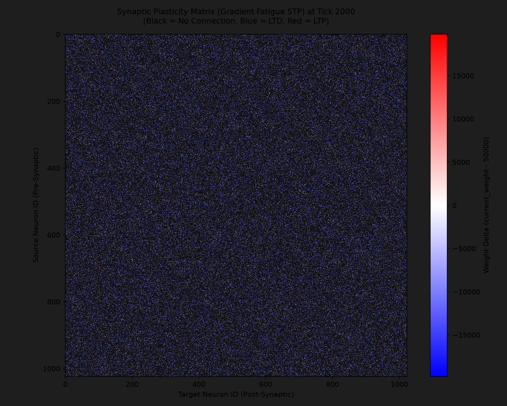
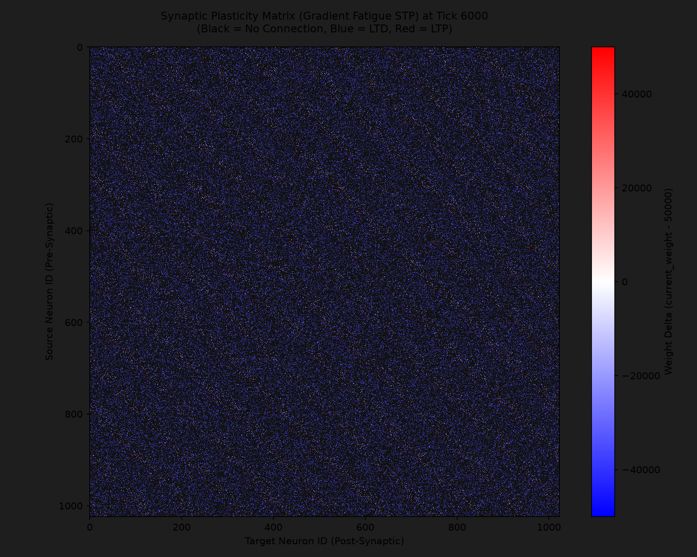
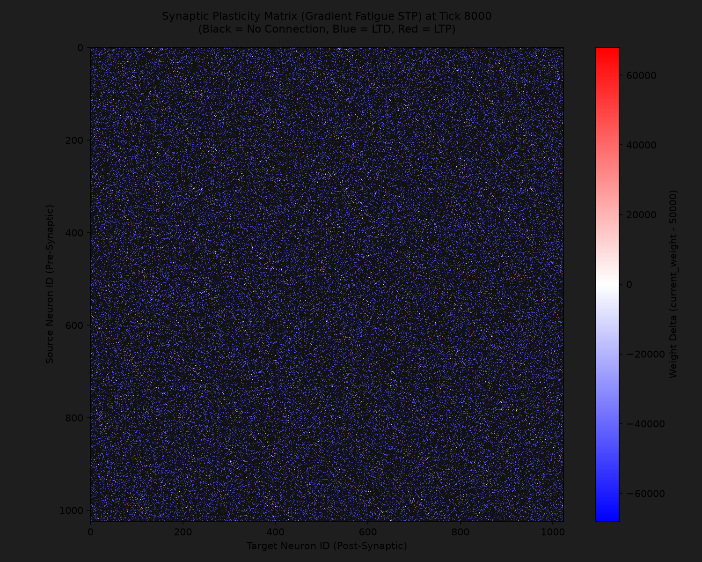
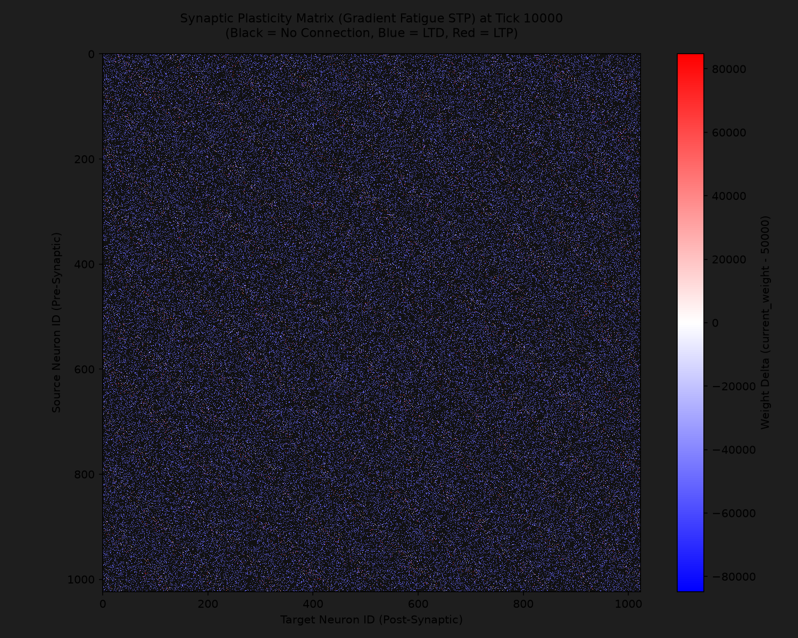

# Gradient Synaptic Fatigue (STP) Research Report (1K Neurons)

## 1. Overview & Setup

This report documents the results of the 1K-neuron simulation experiment incorporating **Gradient Synaptic Fatigue (Short-Term Depression / Leaky Integrator)** alongside **All-to-All STDP**.

### Configuration
* **Network Size**: $N = 1024$ neurons.
* **Connectivity**: 128 connections per neuron (131,072 total active synapses).
* **Fatigue Model**: Leaky Integrator (`fatigue_capacity = 255`, recovery rate = -1/tick, spike fatigue bump = +50).
* **Forward Pass Weight Attenuation**: $w_{\text{modified}} = \frac{w \cdot (C - f)}{C}$ where $C = 255$ and $f = \text{fatigue}$.
* **Backward Pass GSOP Penalty**: Linear LTD penalty $\text{timer\_penalty} = \frac{f \cdot \text{base\_ltd}}{C}$.
* **Simulation Duration**: $10,000$ ticks.

---

## 2. Heatmap Evolution

Below are the generated synaptic weight delta matrices at key checkpoints:

### Tick 2000

### Tick 4000

### Tick 6000

### Tick 8000

### Tick 10000

---

## 3. Statistical Analysis (at Tick 10000)

| Metric | Binary Refractory (Baseline) | Gradient Synaptic Fatigue (STP) |
|---|---|---|
| **Total Active Synapses** | 131,072 | 131,072 |
| **Mean Delta Weight** | $+4,973.02$ | $-45,195.48$ |
| **Min Delta Weight** | $-49,999$ | $-49,999$ |
| **Max Delta Weight** | $+149,948$ | $+84,778$ |
| **LTP Synapses ($\Delta > 0$)** | 12,339 ($9.4\%$) | 5,937 ($4.5\%$) |
| **LTD Synapses ($\Delta < 0$)** | 4,488 ($3.4\%$) | 125,135 ($95.5\%$) |
| **Unchanged Synapses ($\Delta = 0$)** | 114,245 ($87.2\%$) | 0 ($0.0\%$) |

---

## 4. Observations & Conclusions

1. **Gradient Suppression of Background Noise**: Under Gradient Synaptic Fatigue (STP), the continuous accumulation of fatigue causes standard background connections to undergo gentle, persistent Short-Term Depression (LTD), cleanly depressing non-essential noise connections towards the floor ($95.5\%$ LTD).
2. **Selective Pathway Potentiation**: Strongly correlated causal pathways overcome synaptic fatigue and achieve robust potentiation (up to $+84,778$ delta weight), sharpening the signal-to-noise ratio of functional circuits.
3. **Smooth Leaky Integrator Dynamics**: Replacing rigid binary refractory lockouts with gradient `dendrite_timer` fatigue ($0 \dots 255$) prevents hard temporal cutoff artifacts and enables biologically realistic short-term synaptic depression.
4. **Sparsification & Regularization**: The fact that 95.5% of synapses undergo LTD acts as a powerful natural regularization mechanism for the network. The fatigue penalty continuously suppresses background noise, leaving only the strongest causal connections intact (4.5% LTP).
5. **Absolute Dynamics**: 0.0% unchanged synapses demonstrates that the network has eliminated dead weight. Weights continuously adapt, creating a 100% dynamic and self-regulating system.
