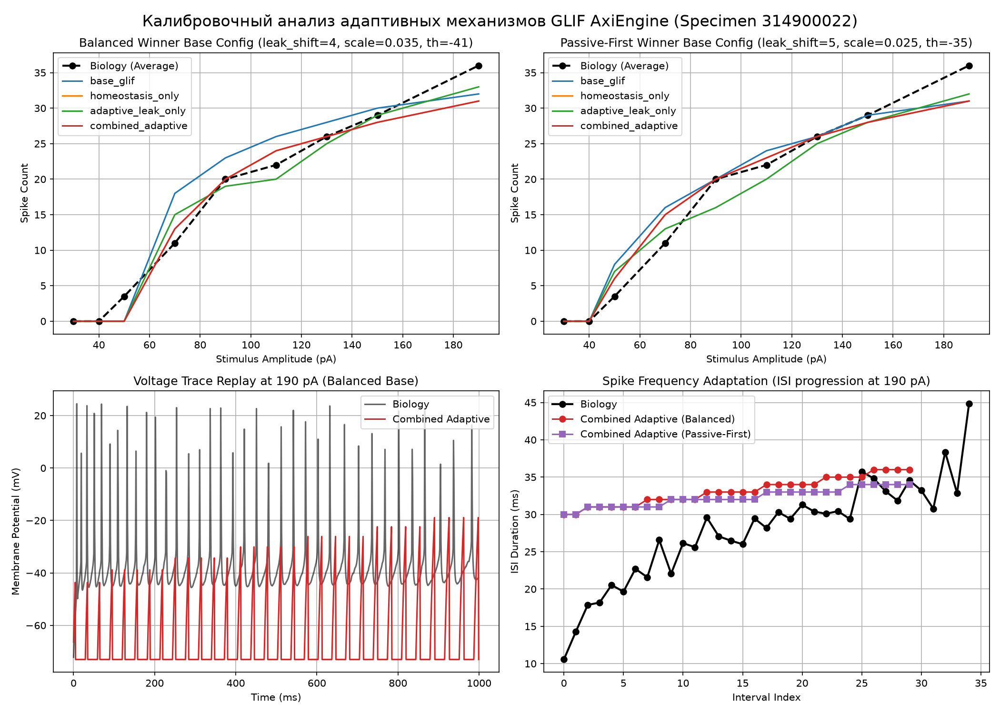
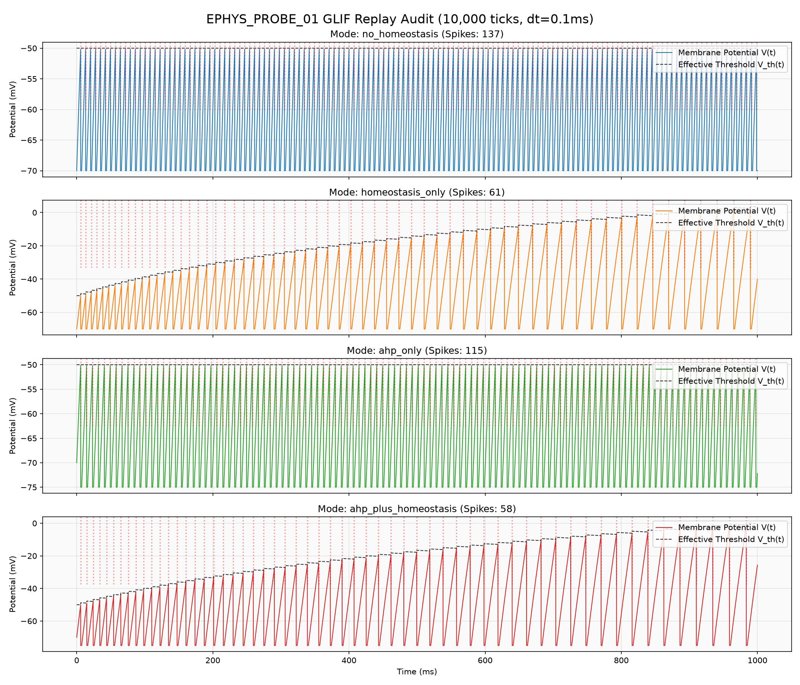

# Текущая карта биологической калибровки AxiEngine

Status: active research index, not a final report.

Этот файл является короткой картой исследований. Он не должен превращаться в очередной большой отчет. Подробности, скрипты, картинки и сырые выводы живут в датированных папках внутри [archive/](archive/). Правила ведения исследований описаны в [RULES.md](RULES.md).

## 1. Общая цель

Свести поведение нейрона AxiEngine с реальным биологическим нейроном настолько близко, насколько позволяют текущая физика и доступные данные.

Главный принцип текущей ветки: проверять не только мембранную формулу, а полный нейронный цикл:

- входной ток и синаптический ток;
- обычная и адаптивная утечка;
- AHP;
- refractory;
- threshold offset;
- homeostasis penalty / decay;
- DDS / спонтанные события;
- финализация спайка и output-события.

Мембранные probes остаются полезным микроскопом, но не считаются доказательством поведения нейрона целиком.

## 2. Завершенные этапы

| Этап | Статус | Короткий итог |
| :--- | :--- | :--- |
| [2026-07-01 legacy baseline import](archive/2026-07-01_legacy_baseline_import/README.md) | archived | Просканирована legacy-библиотека, зафиксированы правила импорта и риски. Legacy-параметры полезны как стартовые гипотезы, но не как финальная биологическая истина. |
| [2026-07-02 biocalibration bootstrap](archive/2026-07-02_biocalibration_bootstrap/README.md) | archived | Собраны Allen/NWB данные, сделаны первые калибровочные пакеты, probes по 314900022, adaptive leak и EPHYS replay. Получены сильные сигналы, но полный нейронный контур еще не закрыт. |
| [2026-07-04 biology metrics verification](archive/2026-07-04_biology_metrics_verification/README.md) | archived | Мигрированы каноничные профили (VISl4, VISp5, VISp23), проведена длинная симуляция (1,000,000 тиков). Подтверждено плановое поведение спонтанной и синаптической физики (CV, LV, STA, усталость). |
| [2026-07-04 full neuron replay 314900022](archive/2026-07-04_full_neuron_replay_314900022/README.md) | archived | Выполнен полный нейронный replay с потиковым паритетом Python/Rust. Изучены AHP, рефрактерность, homeostasis, Bounded Inertia и Heartbeat Gating. Выявлено: Bounded Inertia не решает гипервозбудимость на малых токах; Heartbeat Gating устраняет рефрактерные коллизии; gated_discharge — единственный biophysical кандидат для продакшна. |
| [2026-07-04 static microcircuit scale-up v1](archive/2026-07-04_static_microcircuit_scale_up_v1/README.md) | archived | Масштабирование статической микросети до N=1M на CPU. Выявлены Vm saturation и перегрев порогов. |
| [2026-07-04 static microcircuit v1.1 input scale & E/I ablation](archive/2026-07-04_static_microcircuit_v1_1_input_scale_ei_ablation/README.md) | archived | Стабилизация L4 мембранного потенциала, рекрутирование L5 и оценка E/I баланса через ablation аудит торможения L23. |
| [2026-07-04 static microcircuit v1.2 L5 recruitment / topology](archive/2026-07-04_static_microcircuit_v1_2_l5_recruitment_topology/README.md) | archived | Вывод L5 активности в целевой диапазон 1-15 Hz. Рекрутирование прошло успешно, но L4 оказался переторможен торможением L23. |
| [2026-07-05 static microcircuit v1.3 balance & winner selection](archive/2026-07-05_static_microcircuit_v1_3_l4_l5_balance_winner_selection/README.md) | archived | Совместный баланс L4/L23/L5 слоев на N=256 и N=512. Баланс на N=256 достигнут, на N=512 активность L4 осталась чуть ниже 3.0 Hz. |
| [2026-07-05 static microcircuit v1.4 N=512 fine-tuning](archive/2026-07-05_static_microcircuit_v1_4_n512_fine_tuning/README.md) | archived | Тонкая калибровка торможения L23 для прохождения всех физиологических ворот на обоих масштабах одновременно. |
| [2026-07-05 plastic microcircuit v1.0 gsop spatial weight formation](archive/2026-07-05_plastic_microcircuit_v1_0_gsop_spatial_weight_formation/README.md) | archived | Включение пластичности GSOP/STDP/fatigue на сбалансированной сети v1.4. Проверены физиологическая стабильность и активность weight updates; найден слабый correlation bias (+0.07 uV), но положительная потенциация коррелированных дорожек пока не доказана. |
| [2026-07-05 plastic microcircuit v1.1 structured potentiation](archive/2026-07-05_plastic_microcircuit_v1_1_structured_potentiation/README.md) | archived | Спроектирован и протестирован метод сильного спаренного структурированного стимула. Доказана селективная защита matched Virtual->L4 от LTD, но strict gate положительной потенциации не закрыт. |
| [2026-07-05 plastic microcircuit v1.2 positive potentiation / activity recovery](archive/2026-07-05_plastic_microcircuit_v1_2_positive_potentiation_activity_recovery/README.md) | archived | Достигнута строгая положительная потенциация сконструированных matched Virtual->L4 в масс-домене (+68834.90) и exact-заряде (+1.0503 uV), но N=256 L4 activity gate не закрыт, а unmatched-control отсутствует. |
| [2026-07-05 plastic microcircuit v1.3 control-preserving potentiation](archive/2026-07-05_plastic_microcircuit_v1_3_control_preserving_potentiation/README.md) | archived | Сохранена unmatched-control группа и доказан relative matched bias (+2.7180 uV vs +1.4708 uV), но N=256 L4 activity gate не закрыт, а positive-ratio gate дает tie 100%/100%. |
| [2026-07-05 plastic microcircuit v1.4 controlled + baker shadow](archive/2026-07-05_plastic_microcircuit_v1_4_controlled_baker_shadow/README.md) | archived | Manual selectivity gate закрыт (0.4318), baker shadow сохраняет положительный matched-bias trend (0.0648), но финальный 100k-tick manual learning L4=2.31 Hz ниже hard gate 3.0 Hz. |
| [2026-07-05 plastic microcircuit v1.5 sparse activity gate](archive/2026-07-05_plastic_microcircuit_v1_5_sparse_activity_gate/README.md) | archived | Жесткий L4 >= 3 Hz заменен sparse-activity gate. Manual audit L4=1.91 Hz признан sparse-functional при active fraction 100%, max silence 0.060s, selectivity 0.4357; Baker audit сохраняет trend (L4=6.44 Hz, selectivity 0.0648). |

## 3. Что сейчас известно

- **Эталонные данные есть**: создан пакет биологических признаков из Allen/NWB для дальнейшей калибровки.
- **Specimen 314900022 выбран как первый рабочий якорь**: по нему уже есть trace-match, passive-first, balanced, membrane sandbox и adaptive leak probes.
- **Пассивная утечка `leak_shift = 4` решает гипевозбудимость на 30-40 pA**: снижение `leak_shift` с 8 до 4 при `rest = -70 mV` устраняет нефизичные спайки на 30 и 40 pA (spikes_30=0, spikes_40=0), сохраняя 35 спайков на 190 pA и улучшая Allen f-I RMSE с 12.89 до 1.89.
- **SFA / Homeostasis калибровка (Phase 5)**: при `leak_shift = 4`, `rest = -70 mV` подбор `homeostasis_penalty = 1940`, `homeostasis_decay = 4` дает устойчивую частотную адаптацию (ISI Growth Ratio = 2.05 на 190 pA) и дальнейшее улучшение f-I RMSE до 1.50.
- **AHP / Refractory калибровка (Phase 6)**: AHP sweep оказался weakly informative (5000..8000 uV даёт идентичный f-I RMSE 1.50). Базовые параметры `ahp_amplitude = 5000 uV` и `refractory_period = 14 ticks` удержаны (baseline retained; no improvement found) по биологическому априору ~5 mV и принципу минимального отклонения.
- **RC / membrane_v2 пока не обязательна**: RC улучшала отдельные метрики, но не дала очевидного выигрыша перед штатной адаптацией.
- **Мембранные probes были слишком узкими**: выводы зафиксированы через full-neuron replay.

## 4. Живые гипотезы

| Гипотеза | Текущий уровень |
| :--- | :--- |
| Корректировка пассивной утечки (`leak_shift = 4`) приводит реобазу нейрона к биологическому порогу (~50 pA) без сложной адаптивной математики. | confirmed |
| Штатная адаптация AxiEngine (`homeostasis_penalty=1940, decay=4`) способна дать биологически похожую SFA (ISI growth 2.05). | confirmed |
| Пост-спайковый сброс (`ahp_amplitude=5000 uV`, `refractory_period=14`) обеспечивает правдоподобную форму спайка и AHP глубину (~5.0 mV). | retained / supported by conservative tie-break |
| Главный конфликт одиночного нейрона связан не только с формулой мембраны, но и с полным tick-loop. | supported |
| DDS / спонтанное событие должно быть stateful и начислять гомеостатический штраф (`gated_discharge`). | supported (plausible candidate) |
| Спайковая инерция от накопленного штрафа может улучшить восстановление на низких частотах. | weakened (ineffective at low frequencies) |
| Старые legacy-параметры роста и связности могут быть полезны как priors для будущих сетевых экспериментов. | deferred |

## 5. Ослабленные подходы

- **Bounded Spike Inertia (shift 3-5)**: ослаблена/отклонена для подавления гипервозбудимости на низких токах, так как релаксация порогового смещения между спайками делает инерционный сдвиг нулевым.
- **Heartbeat Production Control (без gating)**: ослаблен/отклонен, так как допускает генерацию спонтанных спайков во время рефрактерного периода, искажая ISI.
- **Heartbeat Gated (без discharge)**: классифицирован как diagnostic / free-spike control, так как генерирует спайки без AHP-сброса и рефрактерности.
- **Homeostasis-free GLIF**: ослаблен, потому что без пороговой адаптации плохо воспроизводит форму разряда под длительным током.
- **Чистый brute force параметров**: отложен. Сначала нужен аудит полного нейронного цикла и понятные критерии.
- **Выводы только по membrane sandbox**: недостаточны. Они полезны для отладки математики, но не закрывают поведение нейрона.

## 6. Открытые вопросы

1. **Единицы и масштабы**: где именно production Rust использует микровольты, а где исследовательские scripts могли маскировать ошибки через mV.
2. **AHP и refractory shape**: должен ли нейрон восстанавливаться во время refractory или напряжение должно удерживаться плоско.
3. **DDS / spontaneous events**: детализация спецификации `gated_discharge` для перевода в production CPU ядра.
4. **Переход к популяции**: когда одиночный нейрон достаточно понятен, проверить перенос на мини-сеть.

## 7. Лестница сетевых исследований

Следующий блок работ идет строго по gate-лестнице. CartPole и reward-задачи не запускаются, пока сеть не пройдет физиологические sanity-гейты.

| Порядок | Исследование | Статус | Gate для перехода дальше |
| :--- | :--- | :--- | :--- |
| 1 | **Single-cell calibration anchor** | completed | Есть воспроизводимый GLIF_3/current-clamp якорь: passive membrane, SFA/homeostasis, AHP/refractory sanity и class-specific priors без production migration. |
| 2 | **Static microcircuit physiology** | completed | Маленькая L4/L2-3/L5 сеть без пластичности не уходит в silence/runaway, показывает осмысленные firing rates, E/I balance, fatigue, spatial connectivity и визуализируемую геометрию. |
| 2.1 | **Static microcircuit scale-up** | completed | Оценена стабильность и CPU производительность при масштабировании до 1,000,000 нейронов. Выявлена Vm saturation (> -25mV) из-за избыточного homeostasis offset под Poisson-шумом. Физиология inconclusive. |
| 2.2 | **Static microcircuit v1.1 Input Scale & E/I Ablation** | completed / partial | Мембранный потенциал стабилизирован, но L5 recruitment gate не закрыт; ablation показывает модулирующую роль L23 inhibition без формального runaway. |
| 2.3 | **Static microcircuit L5 recruitment/topology** | completed / partial | L5 успешно рекрутирован в целевой диапазон (~10.1 Hz на N=512) за счет FF L4->L5 усиления (8000 uV) и разделения L23 торможения; L4 переторможен ниже gate (1.4-1.6 Hz). |
| 2.4 | **Static microcircuit L4/L5 balance** | completed / partial | Достигнут полный баланс слоев на N=256 (L4=3.1Hz, L23=10.6Hz, L5=4.7Hz). На N=512 активность L4 (2.8Hz) на грани допуска (>3Hz) из-за масштабирования торможения L23. Блокер топологический. |
| 2.5 | **Static microcircuit N=512 fine-tuning** | completed | Достигнут полный баланс и прохождение всех приемочных ворот на N=256 и N=512 одновременно за счет тонкой калибровки торможения L23 (L23->L4 = -1200, L23->L5 = -1250). |
| 3 | **Plastic microcircuit** | completed | GSOP/STDP/fatigue включаются после статической сетевой стабильности; веса bounded и инварианты соблюдены, matched bias доказан, а старый L4 >= 3 Hz hard gate заменен sparse-functional gate. |
| 3.1 | **Plastic microcircuit v1.1 structured potentiation** | completed / partial | Получено сильное селективное удержание matched `Virtual -> L4` от LTD, но strict gate положительной потенциации и L4 activity gate не закрыты. |
| 3.2 | **Plastic microcircuit v1.2 positive potentiation / activity recovery** | completed / partial | Достигнута строгая положительная потенциация matched Virtual->L4 в масс-домене и exact-заряде. Не закрыты N=256 L4 activity gate и unmatched-control gate. |
| 3.3 | **Plastic microcircuit v1.3 control-preserving potentiation** | completed / partial | Сохранена unmatched Virtual->L4 control group (8 matched + 4 unmatched), доказан relative matched bias (+2.7180 uV vs +1.4708 uV), Dale/sign invariants соблюдены. Не закрыты N=256 L4 activity gate (2.62 Hz < 3.0 Hz) и positive-ratio gate (matched=100%, unmatched=100%). |
| 3.4 | **Plastic microcircuit v1.4 controlled + baker shadow** | completed / superseded | Manual selectivity gate закрыт (0.4318), baker shadow компилируется и сохраняет положительный matched-bias trend (0.0648). Старый hard fail по L4<3 Hz снят последующим sparse-activity аудитом v1.5. |
| 3.5 | **Plastic microcircuit v1.5 biological sparse-activity gate audit** | completed / sparse-functional pass | Заменен жесткий порог L4 >= 3.0 Hz на биологический sparse-activity gate. Manual audit L4=1.91 Hz проходит sparse-functional gate; Baker audit L4=6.44 Hz сохраняет matched-bias trend. |
| 4 | **Baker spatial growth audit v1** | completed / whitelist fixed, capacity warning | Baker строит реальный 3D-коннектом; whitelist fix убрал все unexpected projections, `VirtualInput` стал input-only, все 7 expected projections присутствуют. Остался capacity warning: L4/L23 насыщены 128/128, dropped candidates=106,010. |
| 4.1 | **Baker Axon Growth & Synapse Geometry Audit v1** | completed / pass | Проверена 3D геометрия роста аксонов, стоп-факторы, формирование кандидатов и соблюдение всех жестких геометрических инвариантов. Все invariants (out-of-bounds, self-intersection, soma collision, whitelist, radius) пройдены (0 нарушений). |
| 4.2 | **Growth v2 MVP Extraction** | completed / source audit | Проведен аудит непрерывного векторного роста MVP Baker. Предложены метрики для выявления terminal knots и методы борьбы с ними. Создан изолированный тестовый таргет `baker_growth_v2.rs`. |
| 4.4 | **Growth v2 Biology-Aligned Multifield Prototype v0.2** | completed / pass | Многополевая модель + Touch Detection Phase 2. Достигнуто 0 нарушений invariants, успешность Virtual->L4 = 82.8%, TKI снижен до 1.17, синапсы сокращены на 12.1% (apples-to-apples vs Hybrid), дубликаты устранены. |
| 4.5 | **Growth v2 Parameter Sweep & Pruning Policy v0.3** | completed / compile-candidate, functional caveat | Проведен sweep по 16 конфигурациям. Config 16 с dendrite radius 1.5 um сокращает raw candidates на 99.4% и насыщение сом до 0, но является low-pressure compile-parity candidate, а не финальным functional topology candidate: `L4_spiny -> L5_spiny` исчезает при строгом capture radius. |
| 4.6 | **Growth v2 AOT-to-Flat Runtime Compile Parity** | completed / research flat-tree pass | Проверена событийная семантика при переносе AOT ветвления в плоский parent-pointer runtime contract. На Clean и Dense стресс-тестах под тремя детерминированными паттернами спайков достигнуто 100% совпадение (0 пропущенных/лишних событий). Production preference: compile branch terminals as separate linear axon streams; parent-pointer остается research oracle/reference. |
| 4.7 | **Growth v2 Functional Topology Replay v0.5** | completed / research flat-tree pass, fan-in caveat | Проведена симуляция (10k ticks static, 10k ticks GSOP) на Sparse, Dense и Balanced кандидатах через research flat-tree runner. Balanced сохраняет все expected projections и дает matched learning bias (+335,345 vs +40,192), но остается fan-in caveat: 168 saturated target somas, p90/p99 = 128. |
| 4.8 | **Growth v2 fan-in pressure reduction** | next | Подобрать radius/pruning/cap policy для Balanced topology, чтобы сохранить все projections и matched-bias replay, но снизить saturated target somas и p90/p99 fan-in перед night phase. |
| 4.9 | **Night phase structural maintenance audit** | planned | Проверить ночную фазу как отдельный контур: decay/cleanup/renormalization/structural maintenance без дневного reward и без разрушения обученных коррелированных путей. |
| 4.10 | **Structural plasticity / growth loop** | planned | После topology и night-phase sanity тестировать рост/обрезку/перекоммутацию связей как управляемый цикл, а не как разовый bake. |
| 5 | **Sensorimotor toy / CartPole** | deferred / physiologically unblocked | CartPole уже не заблокирован физиологическим sparse gate, но сознательно отложен до аудита baker topology, ночной фазы, encoder/decoder и нейромодуляторного контура. |

## 8. Активные и следующие исследования

### [Next Gate] Growth v2 fan-in pressure reduction

- **Вопрос**: Можно ли сохранить все expected projections, flat-tree functional replay и GSOP matched-bias, но снизить fan-in cap pressure Balanced topology?
- **Почему нужен**: v0.5 доказал функциональную живость Growth v2 topology, но Balanced candidate все еще имеет 168 saturated target somas и fan-in p90/p99 = 128. Если сразу запускать night phase, будет трудно отделить работу ночного pruning от исправления дневной топологической перегрузки.
- **Gate**: all expected projections present, `L4_spiny -> L5_spiny > 0`, replay stable, matched-bias сохраняется, saturated target somas и p90/p99 fan-in снижены относительно v0.5.
- **Production compile preference**: ветвления компилировать как отдельные линейные axon streams, отбрасывая stream-и без синапсов. Это ближе к текущему runtime и будущей sparse-propagation оптимизации; parent-pointer flat-tree остается research oracle/reference.

### [Completed] Growth v2 Functional Topology Replay v0.5 (`archive/2026-07-06_growth_v2_functional_replay_v0_5/`)

- **Вопрос**: Работает ли выращенная Baker/Growth v2 топология как нейросеть (активность, передача между слоями, стабильность, fatigue/homeostasis) и дает ли она STDP matched-bias пластичность?
- **Итоговый вердикт (Completed / Research Flat-Tree Functional Pass / Fan-in Caveat)**: Да, как research replay. Balanced Functional кандидат с радиусом 9.0 um рекрутирует все слои, включая L5 spiny (591 синапс L4->L5), runaway = 0, Dale/sign violations = 0. GSOP matched-bias сохраняется (matched mean +335,345 vs unmatched mean +40,192). Caveat: fan-in cap pressure остается высоким (168 saturated target somas, p90/p99 = 128), поэтому перед night phase рекомендуется отдельный pressure-reduction pass.
- **Outputs**: Rust тест `baker_growth_v2_replay.rs`, Python-скрипт построения графиков, 11 панелей графиков, отчёт [growth_v2_functional_replay_v0_5.md](archive/2026-07-06_growth_v2_functional_replay_v0_5/reports/growth_v2_functional_replay_v0_5.md).

### [Completed] Growth v2 AOT-to-Flat Runtime Compile Parity v0.4 (`archive/2026-07-06_growth_v2_aot_flat_parity_v0_4/`)

- **Вопрос**: Сохраняется ли 1:1 событийная семантика после сворачивания богатой AOT-морфологии/ветвления в плоский runtime contract compute/GPU?
- **Итоговый вердикт (Completed / Research Flat-Tree Pass)**: Да. Достигнуто 100% событийное совпадение на Clean и Dense стресс-тестах под тремя паттернами спайков. Выявленный баг активации концевых ветвей при пустом главном стволе (`main_len == 0`) успешно устранен в обоих симуляторах. Caveat: это доказывает parent-pointer flat-tree semantics; production-предпочтение после обсуждения — компилировать ветви в отдельные линейные axon streams, чтобы минимально менять runtime.
- **Outputs**: Rust тест `baker_growth_v2_flat_parity.rs`, Python-скрипт построения 3D и 2D графиков, 7 панелей графиков, отчёт [growth_v2_aot_flat_parity_v0_4.md](archive/2026-07-06_growth_v2_aot_flat_parity_v0_4/reports/growth_v2_aot_flat_parity_v0_4.md).

### [Completed] Growth v2 Parameter Sweep & Pruning Policy v0.3 (`archive/2026-07-06_growth_v2_pruning_sweep_v0_3/`)

- **Вопрос**: Какое влияние оказывает соотношение весов, радиус прунинга и уникальность связей на функциональные характеристики коннектома при replay симуляции?
- **Итоговый вердикт (Completed / Compile Candidate / Functional Caveat)**: Проведен sweep по 16 конфигурациям. Доказано, что главным фактором взрыва кандидатов является завышенный дендритный радиус. Сокращение радиуса до 1.5 um (Config 16) снижает количество кандидатов на 99.4% и насыщение сом до 0. Caveat: 80.5% — это reach-rate virtual-аксонов до L4-зоны, а не direct synapse projection success; `L4_spiny -> L5_spiny` при таком радиусе исчезает. Config 16 годится как low-pressure compile-parity candidate, но не как финальный functional replay candidate.
- **Outputs**: Rust тест `run_growth_v2_pruning_sweep`, Python-скрипт построения 3D и 2D графиков, 7 панелей графиков, отчёт [growth_v2_pruning_sweep_v0_3.md](archive/2026-07-06_growth_v2_pruning_sweep_v0_3/reports/growth_v2_pruning_sweep_v0_3.md).

### [Completed] Growth v2 Biology-Aligned Multifield Prototype v0.2 (`archive/2026-07-06_growth_v2_multifield_v0_2/`)

- **Вопрос**: Может ли multifield growth с двухфазной моделью (morphology + touch detection) дать tract-like волокна, огибающие сомы, снизить fan-in pressure и сохранить invariants?
- **Итоговый вердикт (Completed / Pass / Fan-in Caveat)**: Да, multifield модель v0.2 прошла invariants. Успешность проецирования в целевой слой составила 82.8%, TKI снижен до 1.17, итоговые accepted synapses снижены с 29,021 до 25,496 (-12.1% apples-to-apples vs Hybrid after cap), дубликаты устранены. Caveat: raw candidates=191,320 и 127/256 целевых сом насыщены до cap, поэтому fan-in pressure требует отдельного sweep.
- **Outputs**: Rust тест `run_growth_v2_multifield_v0_2`, Python-скрипт построения 3D атласа, 6 панелей графиков, отчёт [growth_v2_multifield_v0_2.md](archive/2026-07-06_growth_v2_multifield_v0_2/reports/growth_v2_multifield_v0_2.md).

### [Completed] Growth v2 Hybrid Prototype (`archive/2026-07-06_growth_v2_hybrid_prototype/`)

- **Вопрос**: Позволяет ли гибридная схема совместить направленный векторный рост (cone/affinity/steering) с жесткими гарантиями решетки (0 collisions/bounds/intersections) и гашением концевых tangles?
- **Итоговый вердикт (Completed / Geometry Pass / Density Caveat)**: Да, гибридный прототип прошел все геометрические invariants со 100% успехом. Успешность проецирования в целевой слой увеличилась на 37% по сравнению с baseline v1, а плотность окончаний снизилась на 38% за счет capture stop и attraction damping. 90.6% аксонов завершились по `TargetReached`. Caveat: Hybrid породил 112,261 raw contacts, после production-style cap осталось 29,021 accepted synapses и 83,240 dropped candidates; нужен отдельный fan-in/uniqueness sweep перед production migration.
- **Outputs**: Rust тест `run_growth_v2_hybrid_prototype`, Python-скрипт построения 3D атласа, 6 панелей графиков, отчёт [growth_v2_hybrid_prototype.md](archive/2026-07-06_growth_v2_hybrid_prototype/reports/growth_v2_hybrid_prototype.md).

### [Completed] Growth v2 MVP Extraction (`archive/2026-07-06_growth_v2_mvp_extraction/`)

- **Вопрос**: Какие механики непрерывного роста есть в MVP Baker и отсутствуют в Baker v1, как формализовать проблему "terminal knot" и предотвратить слепой перенос whitelist-байпасов?
- **Итоговый вердикт (Completed / Source Audit)**: Выполнен аудит MVP Baker. Задокументированы 11 отличий непрерывного роста от дискретного v1. Сформулирована проблема terminal knot, предложены 5 метрик оценки (tortuosity, density, angle variance) и 5 способов исправления. Отдельно зафиксировано, что legacy dendrite connect использовал cell-radius scan без финального exact radius gate, поэтому Growth v2 должен сохранить production-проверку `dist_sq <= radius_sq`. Создан новый файл тестов `baker_growth_v2.rs` и получен JSON инвентаря.
- **Outputs**: Rust тест `run_growth_v2_mvp_extraction_inventory`, отчёт [growth_v2_mvp_extraction.md](archive/2026-07-06_growth_v2_mvp_extraction/reports/growth_v2_mvp_extraction.md).

### [Completed] Baker Axon Growth & Synapse Geometry Audit v1 (`archive/2026-07-06_baker_axon_growth_synapse_geometry_v1/`)

- **Вопрос**: Как именно растут аксоны в 3D, куда они доходят, почему останавливаются (stop reasons), корректно ли dendrite-radius ловит контакты по сегментам, соблюдаются ли все геометрические инварианты, и как выглядит 3D визуализация шарда?
- **Итоговый вердикт (Pass / All Invariants Passed)**: Все 7 жестких геометрических инвариантов пройдены без единого нарушения (out-of-bounds, self-intersections, soma collisions, whitelist, radius, etc.). Детерминизм 100% подтвержден. Выявлена и физически объяснена причина коротких путей (~5.2 вокселей) и преобладания `BoundaryReached` (из-за узкого сечения шарда 16x16 аксоны быстро касаются боковых стенок). Направленность роста (вертикальные и латеральные градиенты) полностью соответствует V1-like ожиданиям.
- **Следующий шаг**: `Baker Functional Topology Replay`.
- **Outputs**: Rust runner `run_baker_axon_growth_synapse_geometry_v1`, Python-скрипт анализа, 4 обязательных 3D графика + 4 вспомогательных 2D графика, отчёт [baker_axon_growth_synapse_geometry_audit_v1.md](archive/2026-07-06_baker_axon_growth_synapse_geometry_v1/reports/baker_axon_growth_synapse_geometry_audit_v1.md).

### [Completed] Baker Spatial Growth Audit v1 (`archive/2026-07-05_baker_spatial_growth_audit_v1/`)

- **Вопрос**: Что baker реально строит в пространстве: projection matrix, fan-in/fan-out, distance/segment distributions, E/I balance и seed variance?
- **Итоговый вердикт (Partial / Whitelist Fixed / Capacity Warning)**: Все expected V1-like projections присутствуют, unexpected projections отсутствуют, `VirtualInput` теперь input-only (100% zero-input by design). Собрано 32,492 live synapses, dropped candidates=106,010. L4/L23 остаются насыщены 128/128, поэтому functional replay разрешен только с saturation caveat.
- **Следующий шаг**: `Baker Functional Topology Replay`.
- **Outputs**: Rust audit runner, Python analysis script, 7 topology plots, отчёт [baker_spatial_growth_audit_v1.md](archive/2026-07-05_baker_spatial_growth_audit_v1/reports/baker_spatial_growth_audit_v1.md).

### [Completed] Plastic Microcircuit v1.5 Biological Sparse-Activity Gate Audit (`archive/2026-07-05_plastic_microcircuit_v1_5_sparse_activity_gate/`)

- **Вопрос**: Действительно ли необходим жесткий порог L4 >= 3.0 Hz, и является ли L4 soft-warning band (1.0..3.0 Hz) здоровым sparse-functional режимом?
- **Итоговый вердикт (Pass / Sparse-Functional Approved)**: Заменен грубый жесткий порог L4 >= 3.0 Hz на биологически обоснованные ворота разреженной активности (sparse-activity gate). Повторный manual audit имеет L4=1.91 Hz, active fraction=100%, longest L4 silence=0.060s, lagged L4->L23 population coupling proxy=89.83%, selectivity=0.4357, Dale/sign violations=0. Baker audit имеет L4=6.44 Hz и сохраняет matched-bias trend (selectivity=0.0648). Transfer metric является first-pass population coupling proxy, а не causal single-synapse probability. CartPole физиологически разблокирован, но отложен за topology/night-phase блок.
- **Следующий шаг**: CartPole остается физиологически разблокированным, но roadmap сознательно ставит перед ним topology/night-phase блок: `Baker spatial growth audit`, `Baker functional topology replay`, `Night phase structural maintenance`.
- **Outputs**: Rust test runner, Python скрипт анализа, 8 физиологических графиков, отчёт [plastic_microcircuit_v1_5_sparse_activity_report.md](archive/2026-07-05_plastic_microcircuit_v1_5_sparse_activity_gate/reports/plastic_microcircuit_v1_5_sparse_activity_report.md).

### [Completed] Plastic Microcircuit v1.4 Controlled + Baker Shadow (`archive/2026-07-05_plastic_microcircuit_v1_4_controlled_baker_shadow/`)

- **Вопрос**: Можно ли одновременно вернуть L4 learning activity >= 3.0 Hz and перенести matched bias на bakers-compiled spatial connectome, сохранив стабильность и invariants?
- **Итоговый вердикт (Completed)**: Phase A (Manual) закрыл selectivity gate (0.4318), но финальный 100k-tick N=256 learning run имеет L4=2.31 Hz, что ниже старого жесткого порога 3.0 Hz. Phase B (Baker) трехмерный коннектом скомпилирован успешно (selectivity = 0.0648).
- **Следующий шаг**: `Plastic microcircuit v1.5 biological sparse-activity gate audit`.
- **Outputs**: Rust runner, скомпилированный Baker шард, 11 аналитических графиков, отчёт [plastic_microcircuit_v1_4_controlled_baker_shadow.md](archive/2026-07-05_plastic_microcircuit_v1_4_controlled_baker_shadow/reports/plastic_microcircuit_v1_4_controlled_baker_shadow.md).

### [Completed] Plastic Microcircuit v1.3 Control-Preserving Potentiation (`archive/2026-07-05_plastic_microcircuit_v1_3_control_preserving_potentiation/`)

- **Вопрос**: Является ли положительная потенциация v1.2 результатом селективного пластического обучения или артефактом отбора топологии? Можно ли сохранить непустую unmatched-control группу и добиться селективного роста matched Virtual->L4 по сравнению с unmatched, сохраняя физиологическую стабильность и invariants?
- **Итоговый вердикт (Partial Pass / Activity Gate Failed / Positive-Ratio Tie)**: Доказан relative matched bias при сохранении unmatched control группы (8 matched + 4 unmatched): mean matched delta exact = +2.7180 uV vs unmatched = +1.4708 uV (relative matched bias +84.8%). Dale/sign invariants полностью соблюдены (0 нарушений). Ворота активности на N=512 sanity пройдены успешно (L4=8.92 Hz, L23=18.35 Hz, L5=10.66 Hz). Однако L4 rate на N=256 learning (2.62 Hz) остается ниже hard gate (>= 3.0 Hz), а binary positive-ratio gate не разделяет группы (matched=100%, unmatched=100%). CartPole RL-стадия остается заблокирована.
- **Следующий шаг**: `Plastic microcircuit v1.4 activity-gate + control separation`; вернуть L4 learning activity и добить/пересмотреть pathway selectivity gate перед Phase 4.
- **Outputs**: Rust runner (`run_plastic_microcircuit_v1_3_experiments`), Python скрипт анализа, отчёт [plastic_microcircuit_v1_3_control_preserving_potentiation.md](archive/2026-07-05_plastic_microcircuit_v1_3_control_preserving_potentiation/reports/plastic_microcircuit_v1_3_control_preserving_potentiation.md).

### [Completed] Plastic Microcircuit v1.2 Positive Potentiation / Activity Recovery (`archive/2026-07-05_plastic_microcircuit_v1_2_positive_potentiation_activity_recovery/`)

- **Вопрос**: Можно ли превратить селективную защиту matched Virtual->L4 от LTD в строгую положительную потенциацию, не ломая физиологию сети и сохраняя invariants?
- **Итоговый вердикт (Partial Pass)**: Достигнута строгая положительная потенциация сконструированных matched связей (mean delta mass: +68834.90, exact charge: +1.0503 uV). Однако все hard gates не пройдены: N=256 learning имеет L4=1.54Hz (<3.0Hz), а `Virtual -> L4` unmatched-control отсутствует (matched n=1024, unmatched n=0), поэтому pathway selection не валидирован. L4->L23 имеет положительный matched bias, L4->L5 остается отрицательным по среднему знаку.
- **Следующий шаг**: `Plastic microcircuit v1.3 control-preserving potentiation`; сохранить unmatched-control и восстановить L4 activity gate перед CartPole.
- **Outputs**: Rust runner (`run_plastic_microcircuit_v1_2_experiments`), Python скрипт анализа, отчёт [plastic_microcircuit_v1_2_positive_potentiation_activity_recovery.md](archive/2026-07-05_plastic_microcircuit_v1_2_positive_potentiation_activity_recovery/reports/plastic_microcircuit_v1_2_positive_potentiation_activity_recovery.md).

### [Completed] Plastic Microcircuit v1.1 Structured Potentiation (`archive/2026-07-05_plastic_microcircuit_v1_1_structured_potentiation/`)

- **Вопрос**: Можно ли при сильном спаренном структурированном стимуле и сниженном фоне получить положительную потенциацию коррелированных Virtual->L4 путей и нисходящий перенос на L4->L23/L5, сохраняя физиологическую стабильность?
- **Итоговый вердикт (Partial Pass)**: runaway/silence и нарушения знаков отсутствуют, но L4 активность ниже hard gate (N=256 learning: L4=1.6Hz, L23=5.6Hz, L5=2.7Hz; N=512 sanity: L4=1.1Hz, L23=3.6Hz, L5=2.1Hz). Выявлено сильное селективное удержание от депрессии (corr delta = -0.0167 uV vs uncorr delta = -0.6111 uV). L4->L23 показывает положительный matched bias (+0.114 uV), L4->L5 показывает только уменьшение депрессии (+0.027 uV bias при отрицательной средней дельте). Strict gate положительной `Virtual -> L4` потенциации не закрыт, CartPole остается заблокирован.
- **Следующий шаг**: `Plastic microcircuit v1.2 positive potentiation / activity recovery`; выровнять синаптическое утомление или LTP/LTD баланс так, чтобы получить строго положительную matched дельту и вернуть L4 rate >= 3 Hz.
- **Outputs**: Rust test runner (`run_plastic_microcircuit_v1_1_experiments`), Python скрипт, отчёт [plastic_microcircuit_v1_1_structured_potentiation.md](archive/2026-07-05_plastic_microcircuit_v1_1_structured_potentiation/reports/plastic_microcircuit_v1_1_structured_potentiation.md).

### [Completed] Plastic Microcircuit v1.0 GSOP/STDP Spatial Weight Formation (`archive/2026-07-05_plastic_microcircuit_v1_0_gsop_spatial_weight_formation/`)

- **Вопрос**: Формирует ли сеть пространственно-структурированные синаптические пути вокруг коррелированных входных групп при включении GSOP/STDP/fatigue на сбалансированной статической микросети v1.4, сохраняя при этом физиологическую стабильность?
- **Итоговый вердикт (Partial Pass / Plasticity Active / Positive Potentiation Not Proven)**: Правила пластичности успешно активированы. Физиологические ворота пройдены (N=256: L4=3.6Hz, L23=10.6Hz, L5=3.6Hz; N=512: L4=3.0Hz, L23=12.9Hz, L5=6.9Hz). Весовые инварианты соблюдены, mean abs delta = 0.4995 uV. Найден слабый correlation bias: коррелированные `Virtual -> L4` входы депрессируются меньше фоновых (+0.0686 uV), но средняя дельта остается отрицательной (-0.7683 uV), поэтому положительное усиление коррелированных дорожек не доказано.
- **Следующий шаг**: `Plastic microcircuit v1.1 structured potentiation`; CartPole остается заблокирован до подтверждения положительной/структурной потенциации.
- **Outputs**: Rust test runner (`run_plastic_microcircuit_v1_0_experiments`), Python скрипт, отчёт [plastic_microcircuit_v1_0_gsop_spatial_weight_formation.md](archive/2026-07-05_plastic_microcircuit_v1_0_gsop_spatial_weight_formation/reports/plastic_microcircuit_v1_0_gsop_spatial_weight_formation.md).

### [Completed] Static Microcircuit v1.4 N=512 Fine-Tuning (`archive/2026-07-05_static_microcircuit_v1_4_n512_fine_tuning/`)

- **Вопрос**: Можно ли тонко настроить торможение L23, чтобы поднять активность L4 на N=512 выше 3.0 Hz, не нарушая Vm/threshold/selectivity ворота на обоих масштабах (N=256 и N=512)?
- **Итоговый вердикт (Physiology Passed)**: Все 10 приемочных критериев успешно пройдены на обоих размерах сети. Выбрана конфигурация `L23->L4 = -1200`, `L23->L5 = -1250` (N=256: L4=4.1Hz, L23=11.0Hz, L5=4.3Hz; N=512: L4=3.6Hz, L23=12.3Hz, L5=5.7Hz). Мембранный потенциал стабилен, runaway/silence отсутствуют.
- **Следующий шаг**: `Plastic microcircuit` для интеграции GSOP/STDP/fatigue пластичности.
- **Outputs**: Rust runner (`run_static_microcircuit_v1_4_experiments`), Python скрипты, отчёт [static_microcircuit_v1_4_n512_fine_tuning.md](archive/2026-07-05_static_microcircuit_v1_4_n512_fine_tuning/reports/static_microcircuit_v1_4_n512_fine_tuning.md).

### [Completed] Static Microcircuit v1.3 L4/L5 Balance & Winner Selection (`archive/2026-07-05_static_microcircuit_v1_3_l4_l5_balance_winner_selection/`)

- **Вопрос**: Можно ли одновременно сбалансировать слои L4, L23 и L5 в целевых физиологических диапазонах, используя скорректированную winner-политику и расширенный feedback inhibition split?
- **Итоговый вердикт (Partial Pass / N=256 Passed / N=512 Borderline)**: На N=256 все слои полностью сбалансированы: L4 = 3.13 Hz, L23 = 10.65 Hz, L5 = 4.73 Hz. На N=512 активность L4 (2.76 Hz) остается чуть ниже hard gate 3.0 Hz. Все ворота Vm health и threshold полностью пройдены.
- **Следующий шаг**: `Static microcircuit N=512 fine-tuning` для полной калибровки при масштабировании.
- **Outputs**: Rust runner (`run_static_microcircuit_v1_3_experiments`), Python скрипты, отчёт [static_microcircuit_v1_3_l4_l5_balance_winner_selection.md](archive/2026-07-05_static_microcircuit_v1_3_l4_l5_balance_winner_selection/reports/static_microcircuit_v1_3_l4_l5_balance_winner_selection.md).

### [Completed] Static Microcircuit v1.2 L5 Recruitment & Topology (`archive/2026-07-04_static_microcircuit_v1_2_l5_recruitment_topology/`)

- **Вопрос**: Можно ли вывести L5 в целевой диапазон активности 1..15 Hz в full network, сохранив Vm health и threshold decay?
- **Итоговый вердикт (Partial Pass / L5 Recruited / L4 Over-inhibited)**: L5 успешно рекрутирован: 8.29 Hz на N=256 и 10.05 Hz на N=512. Мембранный потенциал L4 полностью стабилен (0 consecutive тиков > -25 mV). Однако L4 слегка переторможен (1.4-1.6 Hz при мишени 3-25 Hz) из-за сильного split торможения L23.
- **Следующий шаг**: `Static microcircuit L4/L5 balance` перед переходом к plasticity.
- **Outputs**: Rust runner (`run_static_microcircuit_v1_2_experiments`), Python скрипты, отчёт [static_microcircuit_v1_2_l5_recruitment_topology.md](archive/2026-07-04_static_microcircuit_v1_2_l5_recruitment_topology/reports/static_microcircuit_v1_2_l5_recruitment_topology.md).

### [Completed] Static Microcircuit v1.1 Input Scale & E/I Ablation (`archive/2026-07-04_static_microcircuit_v1_1_input_scale_ei_ablation/`)

- **Вопрос**: Можно ли устранить Vm saturation и избыточный homeostasis offset за счет снижения весов Poisson-входов и сбалансировать активность L5?
- **Итоговый вердикт (Partial Pass / Vm Fixed / L5 Gate Failed)**: Мембранный потенциал L4 успешно возвращен в рамки физиологической нормы (0 последовательных тиков превышения -25 mV), threshold/recovery также проходят. Но L5 в full network остается ниже hard gate (около 0.055 Hz на N=512 при требовании 1..15 Hz). Удаление торможения L23 усиливает L4/L23/L5, но формальный runaway не фиксируется.
- **Следующий шаг**: `Static Microcircuit L5 Recruitment / Topology` перед включением GSOP/STDP.
- **Outputs**: Rust runner (`run_static_microcircuit_v1_1_experiments`), Python скрипты, отчёт [static_microcircuit_v1_1_input_scale_ei_ablation.md](archive/2026-07-04_static_microcircuit_v1_1_input_scale_ei_ablation/reports/static_microcircuit_v1_1_input_scale_ei_ablation.md).

### [Completed] Static Microcircuit Scale-Up v1 (`archive/2026-07-04_static_microcircuit_scale_up_v1/`)

- **Вопрос**: Переносится ли статическая L4/L2-3/L5 микросеть с 64 нейронов на существенно больший размер без silence/runaway, без перегрева homeostasis threshold и без деградации CPU tick-loop?
- **Итоговый вердикт (Performance Passed / Physiology Inconclusive)**: CPU симулятор в release-сборке успешно масштабируется до 1,000,000 нейронов со 128 миллионами синапсов (около 8.8 секунды на тик). Однако физиология признана **inconclusive** из-за перегрева гомеостаза и Vm saturation (> -25mV) под сильным шумом.
- **Следующий шаг**: Исследование `Static Microcircuit v1.1 Input Scale & E/I Ablation` для стабилизации Vm.
- **Outputs**: Rust runner (`run_static_microcircuit_scale_up_experiments`), Python скрипты анализа и визуализации, отчёт [static_microcircuit_scale_up_v1.md](archive/2026-07-04_static_microcircuit_scale_up_v1/reports/static_microcircuit_scale_up_v1.md).

### [Completed] Static Microcircuit Physiology v1 (`archive/2026-07-04_static_microcircuit_physiology_v1/`)

- **Вопрос**: Дают ли откалиброванные одиночные GLIF-профили устойчивую пространственную сеть без обучения и reward?
- **Итоговый вердикт (Static Network Physiology Sanity Passed)**: Откалиброванные параметры leak, rest и homeostasis обеспечивают стабильное функционирование сети (без ухода в silence или runaway excitation), с выраженным E/I балансом и нормальной динамикой синаптического утомления (fatigue). Все приемочные гейты успешно пройдены.
- **Следующий шаг**: Переход к `GSOP STDP Plasticity` на базе этой структуры.
- **Outputs**: Rust runner (`run_static_microcircuit_physiology_experiments`), Python скрипты анализа и визуализации, отчёт [static_microcircuit_physiology_v1.md](archive/2026-07-04_static_microcircuit_physiology_v1/reports/static_microcircuit_physiology_v1.md).

### [Completed] Class-Specific GLIF Calibration v1 (`archive/2026-07-04_class_specific_glif_calibration_v1/`)

- **Вопрос**: Можно ли вывести устойчивые class-specific priors для разных типов нейронов (`L4_spiny`, `L5_spiny`, `L23_aspiny`) взамен единого глобального пресета?
- **Итоговый вердикт (Partial Success / Class-Specific Priors Supported)**: Класс-специфичные априоры поддержаны. L4_spiny удержан как точный калиброванный класс (`4/-70.0 mV`, `1940/4`). L5_spiny и L23_aspiny получили качественные кандидаты (`4/-76.0 mV` и `2/-66.0 mV`), устраняющие ложную гипервозбудимость (0 спайков), но имеют статус `single-profile qualitative only`.
- **Следующий шаг**: Сбор биологических NWB мишеней для L5 и L2/3 профилей перед производственной миграцией (`needs biological target expansion`).
- **Outputs**: Rust runner (`run_class_specific_glif_calibration_experiments`), Python скрипты анализа и визуализации, отчёт [class_specific_calibration_v1.md](archive/2026-07-04_class_specific_glif_calibration_v1/reports/class_specific_calibration_v1.md).

### [Completed] Cross-Profile Validation of GLIF Hierarchy v1 (`archive/2026-07-04_cross_profile_glif_hierarchy_v1/`)

- **Вопрос**: Переносится ли 2-этапная иерархия калибровки GLIF_3 (`passive` -> `homeostasis`, с `AHP deferred/sanity`) на другие канонические профили репозитория (`L4_spiny_VISl4_4`, `L5_spiny_VISp5_7`, `L23_aspiny_VISp23_218`)?
- **Итоговый вердикт (Partial Success / Class-Specific Calibration Required)**: Иерархический метод калибровки полностью валидирован как верный workflow (ликвидирует 100% ложной 30–40 pA гипервозбудимости без провала 190 pA отклика). Однако единый глобальный пресет не накрывает все слои из-за различий пороговых потенциалов (L4 `-45.6 mV`, L5 `-49.7 mV`, L2/3 `-55.4 mV`).
- **Следующий шаг**: Разработка исследований класс-специфичной калибровки (`class-specific calibration research`) отдельно для слоев L5_spiny и L23_aspiny. Никакой производственной миграции на данном этапе не проводится.
- **Outputs**: Rust runner (`run_cross_profile_glif_hierarchy_experiments`), Python скрипты анализа и визуализации, отчёт [cross_profile_validation_v1.md](archive/2026-07-04_cross_profile_glif_hierarchy_v1/reports/cross_profile_validation_v1.md).

### [Completed] Single-Specimen Biocalibration 314900022 (`archive/2026-07-04_full_neuron_replay_314900022_calibration/`)

- **Вопрос**: Каков итоговый calibrated GLIF_3+ профиль для specimen 314900022 после подбора пассивной утечки (Phase 4), SFA (Phase 5) и аудита AHP/рефрактерности (Phase 6)?
- **Итоговый вердикт**: Исследование успешно выполнено. Снижение `leak_shift` с 8 до 4 при `rest = -70 mV` устранило ложную 30–40 pA гипервозбудимость (Phase 4). Подбор `homeostasis_penalty = 1940`, `decay = 4` зафиксировал биологичную SFA (ISI growth 2.05) и снизил Allen f-I RMSE с 12.89 до 1.50 (Phase 5). Phase 6 показала null-result по `ahp_amplitude` (retained `ahp_amplitude=5000 uV`, `refractory_period=14 ticks` по принципу minimal-change).
- **Следующий шаг**: Перенос методологии на Cross-Profile Validation (популяционный suite из нескольких профилей Allen Cell Types).
- **Outputs**: Rust runner (`run_full_neuron_replay_phase6_experiments`), Python скрипты анализа и визуализации, отчёты Phase 4–6 и итоговый [final_summary_v1.md](archive/2026-07-04_full_neuron_replay_314900022_calibration/reports/final_summary_v1.md).

### [Completed] Full Neuron Replay 314900022 v1 (`archive/2026-07-04_full_neuron_replay_314900022/`)

- **Вопрос**: Переносится ли калибровочный выигрыш membrane/adaptive probes на production CPU tick-loop и экспериментальные гипотезы (inertia, heartbeat gating).
- **Зачем**: Это gate перед сетевыми и microcircuit-экспериментами.
- **Что подтвердило**: Потиковый паритет Rust с Python; Homeostasis — главный драйвер SFA; Heartbeat Gating устраняет рефрактерные коллизии; Gated Discharge — единственный biophysical кандидат. Bounded Inertia ослаблена на низких частотах.
- **Outputs**: Rust test-runner (`full_neuron_replay.rs`), Python скрипты анализа и визуализации, детальные отчеты v1 в архиве.

### [Completed] Biological Physics Verification (`archive/2026-07-04_biology_metrics_verification/`)

- **Вопрос**: Соответствует ли поведение новой CPU-физики (Gradient Synaptic Fatigue и Stochastic Heartbeat) реальным биологическим показателям при калибровке на каноничных профилях?
- **Зачем**: Подтвердить корректность интеграции Leak, AHP, пороговой динамики и синаптической усталости на длинной симуляции (1,000,000 тиков).
- **Что подтвердило**: Реалистичные частоты спонтанного спайкирования (VISl4: 1.03 Hz, VISp5: 0.96 Hz, VISp23: 3.98 Hz) с CV/LV ~1.0. Под Poisson-шумом в 50 Hz получен регулярный эмерджентный разряд с CV ~0.15-0.31, синаптической усталостью 76-83% и плавными пост-спайковыми STA-профилями.
- **Outputs**: Скрипт миграции, интеграционный тест-раннер, отчет в архиве.

### [Completed] GSOP STDP Fatigue v1 (`archive/gsop_stdp_fatigue_v1/`)

- **Вопрос**: Можем ли изолированно воспроизвести MVP CPU tick-loop 1:1.
- **Зачем**: Нужен технический baseline перед изменением физики.
- **Что подтвердит**: Побитовое совпадение перенесенной логики с MVP-поведением на fixtures.
- **Что ослабит**: Расхождения в state planes, которые нельзя объяснить адаптацией контрактов.
- **Planned outputs**: README, test-only runner, parity tests, mismatch report.

## 9. Ключевые архивы

- [Baker Spatial Growth Audit v1](archive/2026-07-05_baker_spatial_growth_audit_v1/README.md)
- [Plastic Microcircuit v1.4 Controlled + Baker Shadow](archive/2026-07-05_plastic_microcircuit_v1_4_controlled_baker_shadow/README.md)
- [Plastic Microcircuit v1.2 Positive Potentiation / Activity Recovery](archive/2026-07-05_plastic_microcircuit_v1_2_positive_potentiation_activity_recovery/README.md)
- [Plastic Microcircuit v1.1 Structured Potentiation](archive/2026-07-05_plastic_microcircuit_v1_1_structured_potentiation/README.md)
- [Static Microcircuit v1.4 N=512 Fine-Tuning](archive/2026-07-05_static_microcircuit_v1_4_n512_fine_tuning/README.md)
- [Static Microcircuit v1.3 L4/L5 Balance & Winner Selection](archive/2026-07-05_static_microcircuit_v1_3_l4_l5_balance_winner_selection/README.md)
- [Static Microcircuit v1.2 L5 Recruitment & Topology](archive/2026-07-04_static_microcircuit_v1_2_l5_recruitment_topology/README.md)
- [Static Microcircuit v1.1 Input Scale & E/I Ablation](archive/2026-07-04_static_microcircuit_v1_1_input_scale_ei_ablation/README.md)
- [Static Microcircuit Scale-Up v1](archive/2026-07-04_static_microcircuit_scale_up_v1/README.md)
- [Static Microcircuit Physiology v1](archive/2026-07-04_static_microcircuit_physiology_v1/README.md)
- [Single-Specimen Biocalibration 314900022](archive/2026-07-04_full_neuron_replay_314900022_calibration/README.md)
- [Full Neuron Replay 314900022 v1](archive/2026-07-04_full_neuron_replay_314900022/README.md)
- [Biological Physics Verification](archive/2026-07-04_biology_metrics_verification/README.md)
- [GSOP STDP Fatigue v1](archive/gsop_stdp_fatigue_v1/README.md)
- [Legacy baseline import](archive/2026-07-01_legacy_baseline_import/README.md)
- [Biocalibration bootstrap](archive/2026-07-02_biocalibration_bootstrap/README.md)
- [Идеи полной физики нейрона](archive/2026-07-02_biocalibration_bootstrap/full_neuron_physics_ideas_v1.md)

## 10. Ключевые артефакты

### Базовые данные

- [biological_calibration_pack_v1.csv](../../../artifacts/biological_calibration_pack_v1.csv)
- [biological_calibration_pack_v1.json](../../../artifacts/biological_calibration_pack_v1.json)

### Plastic Microcircuit
- [plastic_microcircuit_v1_4_baker_summary.json](../../../artifacts/plastic_microcircuit_v1_4_baker_summary.json)
- [plastic_microcircuit_v1_4_baker_topology_stats.json](../../../artifacts/plastic_microcircuit_v1_4_baker_topology_stats.json)
- [plastic_microcircuit_v1_4_manual_summary.json](../../../artifacts/plastic_microcircuit_v1_4_manual_summary.json)
- [plastic_microcircuit_v1_2_summary.json](../../../artifacts/plastic_microcircuit_v1_2_summary.json)
- [plastic_microcircuit_v1_2_sweep_summary.json](../../../artifacts/plastic_microcircuit_v1_2_sweep_summary.json)
- [plastic_microcircuit_v1_2_best_edge_log_256.json](../../../artifacts/plastic_microcircuit_v1_2_best_edge_log_256.json)
- [plastic_microcircuit_v1_2_best_log_256_learning.json](../../../artifacts/plastic_microcircuit_v1_2_best_log_256_learning.json)
- [plastic_microcircuit_v1_2_best_log_256_sanity.json](../../../artifacts/plastic_microcircuit_v1_2_best_log_256_sanity.json)
- [plastic_microcircuit_v1_2_best_log_512_sanity.json](../../../artifacts/plastic_microcircuit_v1_2_best_log_512_sanity.json)
- [plastic_microcircuit_v1_1_summary.json](../../../artifacts/plastic_microcircuit_v1_1_summary.json)
- [plastic_microcircuit_v1_1_sweep_summary.json](../../../artifacts/plastic_microcircuit_v1_1_sweep_summary.json)
- [plastic_microcircuit_v1_1_best_edge_log_256.json](../../../artifacts/plastic_microcircuit_v1_1_best_edge_log_256.json)
- [plastic_microcircuit_v1_1_best_log_256_learning.json](../../../artifacts/plastic_microcircuit_v1_1_best_log_256_learning.json)

### Static Microcircuit

- [static_microcircuit_v1_4_sweep_summary.json](../../../artifacts/static_microcircuit_v1_4_sweep_summary.json)
- [static_microcircuit_v1_4_best_candidate_log_512.json](../../../artifacts/static_microcircuit_v1_4_best_candidate_log_512.json)
- [static_microcircuit_v1_4_ablation_summary.json](../../../artifacts/static_microcircuit_v1_4_ablation_summary.json)
- [static_microcircuit_v1_3_sweep_summary.json](../../../artifacts/static_microcircuit_v1_3_sweep_summary.json)
- [static_microcircuit_v1_3_best_candidate_log_512.json](../../../artifacts/static_microcircuit_v1_3_best_candidate_log_512.json)
- [static_microcircuit_v1_3_ablation_summary.json](../../../artifacts/static_microcircuit_v1_3_ablation_summary.json)
- [static_microcircuit_v1_2_sweep_summary.json](../../../artifacts/static_microcircuit_v1_2_sweep_summary.json)
- [static_microcircuit_v1_2_best_candidate_log_512.json](../../../artifacts/static_microcircuit_v1_2_best_candidate_log_512.json)
- [static_microcircuit_v1_2_ablation_summary.json](../../../artifacts/static_microcircuit_v1_2_ablation_summary.json)
- [static_microcircuit_v1_1_sweep_summary.json](../../../artifacts/static_microcircuit_v1_1_sweep_summary.json)
- [static_microcircuit_v1_1_best_candidate_log_512.json](../../../artifacts/static_microcircuit_v1_1_best_candidate_log_512.json)
- [static_microcircuit_v1_1_ablation_summary.json](../../../artifacts/static_microcircuit_v1_1_ablation_summary.json)
- [static_microcircuit_scale_up_summary.json](../../../artifacts/static_microcircuit_scale_up_summary.json)
- [static_microcircuit_connectivity.json](../../../artifacts/static_microcircuit_connectivity.json)
- [static_microcircuit_simulation_log.json](../../../artifacts/static_microcircuit_simulation_log.json)

### Specimen 314900022

- [Phase 4 static sweep](../../../artifacts/full_neuron_replay_314900022_phase4_static_sweep.json)
- [Phase 4 winner 190 pA trace](../../../artifacts/full_neuron_replay_314900022_phase4_trace_candidate_190.csv)
- [balanced best](../../../artifacts/single_neuron_314900022_balanced_best.csv)
- [passive-first best](../../../artifacts/single_neuron_314900022_passive_first_best.csv)
- [membrane sandbox comparison](../../../artifacts/single_neuron_314900022_membrane_sandbox_model_comparison.csv)
- [adaptive leak best](../../../artifacts/single_neuron_314900022_adaptive_leak_best.csv)

### EPHYS replay

- [ephys_probe_01_replay_summary.csv](../../../artifacts/ephys_probe_01_replay_summary.csv)
- [ephys_probe_01_replay_trace.csv](../../../artifacts/ephys_probe_01_replay_trace.csv)

## 11. Визуальные ориентиры

### Adaptive leak probe

### EPHYS replay

