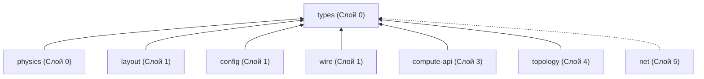

# spec_types

> Версия спеки: 1.0
> Дата: 2026-05-27
> Статус: Approved

---

## §1. Идентификация

| Поле | Значение |
|------|----------|
| Название | types |
| Слой | Слой 0 — Примитивы |
| Тип | Library (lib) |
| no_std | Строго обязателен (true) |
| Описание | Фундаментальный словарь системы: атомарные типы, глобальные константы, гибридная система координат, кванты времени, детерминированное хеширование и stateless seed. Не содержит бизнес-логики. |

---

## §2. Стек и Окружение

### §2.1. Внутренние зависимости (inbound)

| Крейт | Что используется | Зачем |
|-------|-----------------|-------|
| — | Нет внутренних зависимостей | Крейт является фундаментом (Слой 0) для всей системы |

### §2.2. Внешние зависимости

| Crate | Версия | Зачем |
|-------|--------|-------|
| bytemuck | =1.25.0, features=["derive"] | Zero-cost приведение сырых байтовых массивов к структурам (Pod, Zeroable) для C-ABI контрактов |
| wyhash | =0.5.0 | Быстрое детерминированное хеширование и генерация псевдослучайных чисел без состояния (stateless RNG) |

### §2.3. Feature Flags

| Feature | Default | Что включает |
|---------|---------|-------------|
| default | [] | По умолчанию крейт собирается в strict no_std окружении |

---

## §3. Инварианты

Крейт `types` гарантирует соблюдение 10 фундаментальных инвариантов, которые служат контрактом для всех вышестоящих слоев движка.

### §3.1. Структурные инварианты (Memory & Layout)
Обеспечивают предсказуемость C-ABI и идеальную упаковку в регистры GPU без скрытого паддинга.

- **INV-TYPES-001**: `size_of::<PackedPosition>() == 4` байта.
  - *Обоснование*: Структура должна влезать в один 32-битный регистр для коалесцированного доступа в GPU и минимизации VRAM.
  - *Следствие нарушения*: Silent Data Corruption в VRAM при DMA-транзакциях в compute-ядрах, крах C-ABI контракта.
  - *Где проверяется*: compile-time, `const_assert_eq!` и юнит-тест `test_packed_position_memory_layout`.

- **INV-TYPES-002**: `size_of::<PackedTarget>() == 4` байта.
  - *Обоснование*: Гарантия плотной упаковки массивов связей (дендритов) без паддинга для оптимального использования шины памяти GPU.
  - *Следствие нарушения*: Перерасход памяти в 2 раза, рассинхронизация с GPU-ядром, нарушение выравнивания в SoA.
  - *Где проверяется*: compile-time assert и юнит-тест `test_packed_target_memory_layout`.

- **INV-TYPES-003**: `size_of::<SomaFlags>() == 1` байт.
  - *Обоснование*: Минимизация footprint состояния нейрона, выравнивание в массивах `u8`.
  - *Следствие нарушения*: Нарушение кэш-линий, падение пропускной способности памяти при итерации сомы.
  - *Где проверяется*: compile-time assert и юнит-тест `test_soma_flags_memory_layout`.

- **INV-TYPES-004**: `size_of::<MasterSeed>() == 8` байт.
  - *Обоснование*: Корневой сид должен быть строго 64-битным для передачи в вызовы FNV-1a и wyhash64.
  - *Следствие нарушения*: Несоответствие сигнатуры хэш-функций, потенциальный выход за границы регистров при побитовом сдвиге.
  - *Где проверяется*: compile-time assert и юнит-тест `test_master_seed_memory_layout`.

- **INV-TYPES-005**: Все обертки (Newtypes) обязаны иметь атрибут `#[repr(transparent)]`. В крейте физически запрещено использовать `#[repr(C)]` с паддингами или неявное выравнивание компилятора.
  - *Обоснование*: Гарантирует, что структуры-обертки бинарно эквивалентны базовым примитивам в C-ABI при FFI-вызовах.
  - *Следствие нарушения*: Нарушение ABI при взаимодействии с C/C++ и GPU кодом, появление нежелательного паддинга.
  - *Где проверяется*: compile-time статические проверки структуры типов.

### §3.2. Семантические инварианты (Битовая математика)
Защищают логику от аппаратных ограничений и переполнений при упаковке/распаковке.

- **INV-TYPES-006**: Бинарный `0` в памяти структуры `PackedTarget` математически и логически означает `None` (отсутствие связи), а не связь с аксоном `0`.
  - *Обоснование*: Использование `0` как пустого маркера предотвращает чтение неинициализированной памяти и ускоряет проверки.
  - *Следствие нарушения*: Сегфолт или чтение мусора (Zero-Index Trap) при обращении к нулевому индексу.
  - *Где проверяется*: юнит-тест `test_packed_target_zero_index` (распаковка гарантированно возвращает `None` для значения `0`).

- **INV-TYPES-007**: При упаковке `PackedTarget` значение `axon_id` не имеет права превышать `16_777_214` (0x00FFFFFE). Упаковка значения сверх лимита приведет к тихому обрезанию старших битов.
  - *Обоснование*: Поле `Axon_ID` занимает строго 24 бита в упакованном представлении `PackedTarget`.
  - *Следствие нарушения*: Наложение старших битов `axon_id` на смещение сегмента (Bit Bleed), повреждение геометрических индексов и непредсказуемое поведение симуляции.
  - *Где проверяется*: межкрейтовый инвариант, проверяется при аллокации шарда в крейте `layout` / `topology` (`assert!(total_axons <= 0x00FFFFFE)`).

- **INV-TYPES-008**: Функция `random_f32` математически гарантирует возврат значения строго `< 1.0` (максимум `0.99999994`). Возврат ровно `1.0` физически невозможен.
  - *Обоснование*: Предотвращение ошибок выхода за границы массивов (`OutOfBounds`) при индексации по случайному значению вида `(random_f32 * array.len()) as usize`.
  - *Следствие нарушения*: Крах программы по панике выхода за границы массива или порча памяти в небезопасных вычислениях (GPU/FFI).
  - *Где проверяется*: юнит-тест `random_f32_range`.

### §3.3. Архитектурные инварианты (Поведение)
Ограничения на процесс исполнения кода нулевого слоя.

- **INV-TYPES-009**: В крейте запрещено использование `Result`, `panic!`, `unwrap` или `assert`. Все функции обязаны быть тотальными (total functions) и безопасно обрабатывать любой битовый ввод за O(1).
  - *Обоснование*: Обеспечение максимальной производительности без ветвлений и накладных расходов в горячем цикле.
  - *Следствие нарушения*: Снижение производительности, непредсказуемый сбой в рантайме.
  - *Где проверяется*: статический анализ кода (запрет макросов `panic!`, `unwrap`, `expect`, `assert!`).

- **INV-TYPES-010**: Запрещено использование системных вызовов для получения энтропии (`std::time`, `/dev/urandom`, `thread_rng`). Вся энтропия генерируется исключительно как чистая функция от `MasterSeed` и входных параметров (детерминированное хеширование).
  - *Обоснование*: Обеспечение побитовой воспроизводимости симуляции кластера независимо от времени или платформы.
  - *Следствие нарушения*: Потеря детерминизма симуляции, невозможность точной отладки по логам.
  - *Где проверяется*: юнит-тесты хеширования и генерации сидов (`same_string_same_seed`, `test_avalanche_effect`).

---

## §4. Публичный API

### §4.1. Типы

Фундаментальный доменный словарь системы. Содержит структуры-обертки (`newtypes`) для сокрытия битовых операций и псевдонимы типов (`type aliases`) для повышения читаемости контрактов в вышестоящих слоях.

| Тип | Базовый тип | Категория | Семантика |
|---|---|---|---|
| `PackedPosition` | `u32` | Struct | Упакованные 3D-координаты и тип нейрона: `[Type(4b) \| Z(8b) \| Y(10b) \| X(10b)]`. Обязателен `#[repr(transparent)]` и `bytemuck::Pod`. |
| `PackedTarget` | `u32` | Struct | Целевой указатель дендрита: `[Segment_Offset(8b) \| Axon_ID + 1(24b)]`. Обязателен `#[repr(transparent)]`. Скрывает логику инкремента +1 (Zero-Index Trap). |
| `SomaFlags` | `u8` | Struct | Битовое поле состояния сомы: `[Type_ID(4b) \| Burst_Count(3b) \| Is_Spiking(1b)]`. Обязателен `#[repr(transparent)]`. Изолирует битовые маски. |
| `MasterSeed` | `u64` | Struct | Корневой сид кластера. База для детерминированной генерации. Обязателен `#[repr(transparent)]`. |
| `Microns` | `f32` | Alias | Абсолютная пространственная единица (1.0 = 1 мкм). |
| `Fraction` | `f32` | Alias | Нормализованная координата или доля в диапазоне `[0.0, 1.0]`. |
| `VoxelCoord` | `u32` | Alias | Дискретная координата в воксельной сетке. |
| `DenseIndex` | `u32` | Alias | Непрерывный индекс (0..N-1), используемый GPU для обращения к SoA-массивам. |
| `Tick` | `u64` | Alias | Дискретный квант времени симуляции. |
| `Weight` | `i32` | Alias | Вес синапса в домене массы (Mass Domain). Ограничен `±2.14B`. |
| `Voltage` | `i32` | Alias | Мембранный потенциал сомы (в микровольтах). |
| `AxonHead` | `u32` | Alias | Индекс сегмента аксона. Ожидает маркер `AXON_SENTINEL` (0x80000000) при неактивности. |
| `SegmentIndex` | `u32` | Alias | Индекс сегмента внутри геометрии аксона (0..255). |
| `VariantId` | `u8` | Alias | Идентификатор профиля поведения нейрона в LUT `(0..15)`. |

### §4.2. Трейты

В данном крейте публичные трейты отсутствуют. Крейт `types` представляет собой атомарный словарь данных и реализует исключительно паттерн Plain Old Data (POD) без полиморфизма поведения.

### §4.3. Функции

Функции в данном крейте реализованы как ассоциированные методы структур-оберток или как самостоятельные чистые функции (`const fn`). Запрещено использование операций с состоянием и динамических аллокаций. Все побитовые операции должны выполняться за O(1).

#### 1. Упаковка, распаковка и мутация битовых полей (Bitwise Ops)

**`PackedPosition`**
*   `pub const fn pack_raw(x: u32, y: u32, z: u32, type_id: u8) -> Self` — Упаковывает координаты по маске `(type_id << 28) | (z << 20) | (y << 10) | x`.
*   `pub const fn x(&self) -> u32` — Извлекает X (`val & 0x3FF`).
*   `pub const fn y(&self) -> u32` — Извлекает Y (`(val >> 10) & 0x3FF`).
*   `pub const fn z(&self) -> u32` — Извлекает Z (`(val >> 20) & 0xFF`).
*   `pub const fn type_id(&self) -> u8` — Извлекает Type (`(val >> 28) & 0xF`).

**`PackedTarget`**
*   `pub const fn pack(axon_id: u32, segment_offset: u32) -> Self` — Упаковка с защитой от нулевого индекса: `(segment_offset << 24) | ((axon_id + 1) & 0x00FFFFFF)`.
*   `pub const fn axon_id(&self) -> u32` — Извлекает и корректирует ID: `(val & 0x00FFFFFF).saturating_sub(1)`.
*   `pub const fn segment_offset(&self) -> u32` — Извлекает сегмент: `val >> 24`.

**`SomaFlags`**
*   `pub const fn pack(type_id: u8, burst_count: u8, is_spiking: bool) -> Self` — Упаковка: `(type_id << 4) | (burst_count << 1) | (is_spiking as u8)`.
*   `pub const fn type_id(&self) -> u8` — Извлекает тип: `val >> 4`.
*   `pub const fn burst_count(&self) -> u8` — Извлекает счетчик серии: `(val >> 1) & 0x07`.
*   `pub const fn is_spiking(&self) -> bool` — Извлекает флаг спайка: `(val & 0x01) != 0`.
*   `pub const fn with_spiking(self, is_spiking: bool) -> Self` — O(1) мутатор флага спайка: `Self((self.0 & !0x01) | (is_spiking as u8))`.
*   `pub const fn with_burst_count(self, count: u8) -> Self` — O(1) мутатор счетчика: `Self((self.0 & !0x0E) | ((count & 0x07) << 1))`.

#### 2. Детерминированное хеширование и энтропия (Stateless RNG)

*   **`MasterSeed`**
    *   `pub const fn from_str(s: &str) -> Self` — Генерация корневого сида из строки через FNV-1a.
    *   `pub const fn raw(&self) -> u64` — Возвращает внутреннее значение `u64` для передачи в хеш-функции.
*   `pub const fn fnv1a_32(data: &[u8]) -> u32` — Базовое FNV-1a хеширование (имена зон, I/O матрицы).
*   `pub const fn wyhash64(data: &[u8], seed: u64) -> u64` — Быстрое неколлизионное хеширование.
*   `pub const fn entity_seed(master_seed: u64, entity_id: u32) -> u64` — Вычисляет уникальный сид сущности, смешивая `master_seed` и `entity_id` с использованием лавинного эффекта.
*   `pub fn random_f32(seed: u64) -> f32` — Генерация псевдослучайного числа в диапазоне `[0.0, 1.0)` через битовую маску мантиссы IEEE 754.

### §4.4. Константы и Магические Числа

Аппаратные лимиты памяти, защитные маркеры, битовые маски и сигнатуры бинарных форматов. Физические константы симуляции (скорость сигнала, размер вокселя) в данном крейте отсутствуют, так как они вычисляются динамически на основе `simulation.toml`.

#### 1. Аппаратные лимиты (Memory & Layout Limits)

| Константа | Значение | Тип | Семантика |
|-----------|----------|-----|-----------|
| `MAX_DENDRITES` | `128` | `usize` | Фундаментальный хард-лимит дендритов на сому. База для расчета 1166-Byte Invariant и выравнивания кэш-линий. |
| `WARP_SIZE` | `32` | `usize` | Аппаратный размер варпа GPU (база для выравнивания `align_to_warp`). |
| `MAX_SEGMENTS_PER_AXON` | `256` | `usize` | Максимальная длина аксона. Ограничена 8 битами поля `Segment_Offset` в `PackedTarget`. |
| `TARGET_AXON_MASK` | `0x00FFFFFF` | `u32` | Маска для извлечения 24-битного `Axon_ID` из `PackedTarget`. |
| `TARGET_SEG_SHIFT` | `24` | `u32` | Битовый сдвиг для извлечения 8-битного `Segment_Offset` из `PackedTarget`. |
| `SHM_VERSION` | `4` | `u8` | Текущая аппаратная версия структуры разделяемой памяти (Night Phase IPC v4). |

#### 2. Сентинели и защитные маркеры (Sentinels & Guards)

| Константа | Значение | Тип | Семантика |
|-----------|----------|-----|-----------|
| `AXON_SENTINEL` | `0x80000000` | `u32` | Маркер неактивного аксона (или головы). Предотвращает переполнение u32 и ложные срабатывания `Active Tail`. |
| `SENTINEL_DANGER_THRESHOLD`| `0x70000000` | `u32` | Порог переполнения аксона. Сигналы с `head < 0x70000000` гарантированно защищены от перезаписи при сборке мусора. |
| `EMPTY_PIXEL` | `0xFFFF_FFFF`| `u32` | Маркер пустого пикселя матрицы в `mapped_soma_ids` (без привязанной сомы). Триггерит `Early Exit` в I/O ядрах. |

---

## §5. Доменная Логика

Общий словарь движка. Все остальные крейты — компилятор топологии, GPU-вычислители, сетевой стек, конфиг — обязаны говорить на одном языке: одинаково измерять координаты, время, адресовать связи между нейронами и генерировать случайность. Крейт `types` и есть этот язык. Он вынесен в отдельную единицу на Слое 0, чтобы ни один из вышестоящих крейтов не зависел от другого ради базовых определений.

## §6. Алгоритмы и Формулы

В связи с тем, что крейт `types` является фундаментальным словарем (Слой 0), он не содержит алгоритмов бизнес-логики. Вся алгоритмическая база сводится к четырем `stateless`-преобразованиям:

### §6.1. Детерминированное строковое хеширование (FNV-1a)

Используется для перевода строковых идентификаторов (имена зон, I/O матрицы) в хэши без использования динамических аллокаций.

#### 1. FNV-1a (32-bit) — для имен зон и матриц
```rust
// Псевдокод
fn fnv1a_32(data: &[u8]) -> u32 {
    let mut hash: u32 = 0x811c9dc5;
    for &byte in data {
        hash ^= byte as u32;
        hash = hash.wrapping_mul(0x01000193);
    }
    hash
}
```

#### 2. FNV-1a (64-bit) — для генерации MasterSeed
```rust
// Псевдокод
fn seed_from_str(s: &str) -> u64 {
    let mut hash: u64 = 0xcbf29ce484222325;
    for &byte in s.as_bytes() {
        hash ^= byte as u64;
        hash = hash.wrapping_mul(0x00000100000001B3);
    }
    hash
}
```

### §6.2. Лавинное смешивание сидов (Avalanche Bit Mixing)

Гарантирует уникальность и равномерное распределение энтропии для каждой сущности в кластере на базе `MasterSeed`.
```rust
// Псевдокод
fn entity_seed(master_seed: u64, entity_id: u32) -> u64 {
    let seed = master_seed
        .wrapping_add(entity_id as u64)
        .wrapping_add(0x60bee2bee120fc15);
    
    // Avalanche bit mixing (wyhash-style)
    let mut tmp = (seed as u128).wrapping_mul(0xa3b195354a39b70d);
    let m1 = (tmp >> 64) as u64 ^ (tmp as u64);
    let tmp2 = (m1 as u128).wrapping_mul(0x1b03738712fad5c9);
    (tmp2 >> 64) as u64 ^ (tmp2 as u64)
}
```

### §6.3. Быстрая генерация Float (IEEE 754 Mantissa Masking)

Преобразует энтропийный `u64` сид в псевдослучайное число с плавающей точкой в диапазоне `[0.0, 1.0)` на CPU и GPU без операции деления.
```rust
// Псевдокод
fn random_f32(seed: u64) -> f32 {
    let bits = ((seed >> 41) as u32) | 0x3F800000;
    f32::from_bits(bits) - 1.0
}
```

### §6.4. Защита от нулевого индекса (Zero-Index Trap Prevention)

Использует `0` как маркер пустого слота (None), сдвигая реальные `axon_id` на `+1` при упаковке в `PackedTarget`.
```rust
// Псевдокод
fn pack_target(axon_id: u32, segment_offset: u32) -> u32 {
    let shifted_axon = (axon_id + 1) & 0x00FFFFFF;
    (segment_offset << 24) | shifted_axon
}

fn unpack_target(packed: u32) -> Option<(u32, u32)> {
    if packed == 0 {
         return None;
    }
    let axon_id = (packed & 0x00FFFFFF).saturating_sub(1);
    let segment_offset = packed >> 24;
    Some((axon_id, segment_offset))
}
```

---

## §7. Структуры Данных и Memory Layout

Крейт `types` проектируется с абсолютной прозрачностью памяти (Zero-Cost Abstractions). Все составные типы реализованы через паттерн `Newtype` с атрибутом `#[repr(transparent)]`, что гарантирует их бинарную эквивалентность базовым примитивам (C-ABI) при FFI-вызовах.

В этом слое намеренно **отсутствует платформозависимое выравнивание** (например, padding до 32 или 64 байт). Выравниванием массивов для GPU занимается исключительно вышестоящий крейт `layout`. 

| Структура | Размер в памяти | C-ABI Эквивалент | Выравнивание (Align) |
|---|---|---|---|
| `PackedPosition` | 4 байта | `uint32_t` | 4 |
| `PackedTarget` | 4 байта | `uint32_t` | 4 |
| `SomaFlags` | 1 байт | `uint8_t` | 1 |
| `MasterSeed` | 8 байт | `uint64_t` | 8 |

---

## §8. Граничные Случаи и Особые Сценарии

### §8.1. Граничные значения

| # | Ситуация | Ожидаемое поведение |
|---|----------|-------------------|
| E-001 | **Bit Bleed (Кровотечение битов)**: Попытка упаковать координату `X`, превышающую 10 бит (например, 2048), в `PackedPosition`. | Игнорируется старший бит, применяется жесткая маска `& 0x3FF`. Координата закольцовывается (Wrap-around), предотвращая затирание соседних полей `Y` и `Z`. |
| E-002 | **Иллюзия нулевой связи (Zero-Index Trap)**: Упаковка связи с аксоном `axon_id = 0` и `segment = 0` в `PackedTarget`. | Формула выполняет сдвиг `(axon_id + 1)`, записывая в память `1`. Гарантируется, что бинарный `0` в памяти всегда обозначает пустоту (`None`), а не нулевой индекс. |
| E-003 | **Переполнение Burst-счетчика**: Добавление 8-го спайка в 3-битный счетчик серий `SomaFlags` (лимит 0..7). | Значение фиксируется на `7` (Saturating Clamp). Математика мутатора: `count.min(7)`. Переполнение в `0` аппаратно блокируется, чтобы не сломать кривую BDP-пластичности. |
| E-004 | **Нестандартная энтропия**: Передача пустой строки `""` или строки с non-ASCII символами в `MasterSeed::from_str`. | Функция `fnv1a` безопасно обрабатывает любые байтовые срезы без паник, возвращая стабильный детерминированный хэш (исключение паник при парсинге). |
| E-005 | **Float Bound Exclusivity**: Максимальное теоретическое значение, возвращаемое `random_f32`. | Строго ограничено `0.99999994` (за счет битовой маски `0x3F800000`). Гарантируется, что результат никогда не будет равен `1.0`, предотвращая `OutOfBounds` при масштабировании массивов в вышестоящих слоях. |
| E-006 | **Axon ID Overflow (Крах лимита аксонов)**: Превышение общего числа аксонов в шарде (`total_axons = Local + Virtual + Ghost`) значения `16 777 214` (лимит 24 бит поля `Axon_ID` с учетом сдвига). | Математика упаковки `PackedTarget` остается слепой (без branch-проверок) ради O(1). Защита обеспечивается формированием жесткого инварианта для вышестоящих слоев: функция аллокации шарда обязана проверять `assert!(total_axons <= 0x00FFFFFE)`. Превышение прерывает компиляцию/загрузку с требованием перебалансировки шарда. |

### §8.2. Состояния гонки и конкурентность [если применимо]

Секция не применима к данному крейту: крейт является полностью stateless, не имеет глобального разделяемого состояния, кэша или статических переменных. Все функции потокобезопасны.

### §8.3. Деградация и Recovery [если применимо]

Секция не применима к данному крейту: stateless-функции выполняют чистые математические преобразования за O(1) и не зависят от внешних ресурсов, которые могли бы отказать.

---

## §9. Ошибки

В связи с фундаментальной природой крейта (Слой 0), в нем действует строгая политика **Zero Error & Zero Panic**. 

### §9.1. Перечисление ошибок

Крейт не экспортирует собственные типы ошибок (например, `enum Error`) и не содержит функций, возвращающих `Result`. Все математические и побитовые преобразования спроектированы как тотальные функции (total functions), которые гарантированно возвращают валидное значение при любых входных данных.

### §9.2. Стратегия обработки

| Ошибка | Восстановимая? | Рекомендация вызывающему |
|--------|---------------|------------------------|
| — | Не применимо | Крейт не генерирует ошибок |

### §9.3. Паники

Использование макросов `panic!`, `unwrap()`, `expect()` или `assert!` внутри функций крейта **категорически запрещено**. 

| Условие | Почему паника, а не Err |
|---------|--------------------------|
| — | Паники полностью отсутствуют By Design. |

**Защита контрактов:** 
Вместо генерации паник при выходе за границы допустимых значений, крейт обязан использовать математически безопасные аппаратные операции за `O(1)`:
* Наложение масок (`& 0x3FF`, `& 0x00FFFFFF`).
* Насыщающую арифметику (`saturating_sub`).
* Встроенные лимиты (например, маскирование мантиссы для RNG).

Контроль соблюдения высокоуровневых инвариантов (например, недопустимость передачи `axon_id > 16_777_214` для упаковки) является строгой обязанностью (контрактом) вызывающего кода из вышестоящих слоев (например, аллокатора шарда или парсера).

---

## §10. Зависимости и Интеграция

### §10.1. Что крейт потребляет (inbound)

| Крейт-источник | Что используем | Какой контракт ожидаем |
|---------------|---------------|----------------------|
| — | Нет внутренних зависимостей | Крейт является абсолютным фундаментом (Слой 0). Импорт любых других крейтов из workspace архитектурно запрещен. |

### §10.2. Кто потребляет крейт (outbound / обратные зависимости)

Так как крейт предоставляет фундаментальный словарь системы, от него зависят практически все слои движка. Ниже перечислены ключевые потребители:

| Крейт-потребитель | Что использует | Какой контракт мы обязаны сохранить |
|------------------|---------------|-----------------------------------|
| `physics` | `Tick`, обертки битов | Неизменность O(1) масок и сдвигов для интеграции в горячем цикле. |
| `layout` | `PackedPosition`, `PackedTarget`, `SomaFlags` | Строгое соответствие размерам C-ABI (4 и 1 байт), абсолютное отсутствие скрытого паддинга. |
| `wire` | `PackedPosition`, Магические числа | Фиксированное представление структур в Little-Endian для сериализации сетевых пакетов. |
| `topology` | Функции хеширования, `PackedPosition` | Абсолютный детерминизм `fnv1a` и `wyhash64` для Spatial Grid и генерации графа (смена алгоритма сломает сиды). |
| `config` | `Tick`, `MasterSeed` | Безопасный парсинг строковых сидов и отсутствие паник. |
| `compute-api` | Абстракции координат и времени | C-ABI совместимость для FFI-передачи на GPU. |

### §10.3. Диаграмма взаимодействия



---

## §11. Стратегия Тестирования

Поскольку крейт `types` (Слой 0) не имеет состояний и зависимостей, стратегия тестирования строится на 100% покрытии математических преобразований через модульные и property-based тесты.

### §11.1. Юнит-тесты

| Тест | Что проверяет | Связанный инвариант / Граничный случай |
|------|--------------|-------------------|
| `test_memory_layout` | `size_of` и `align_of` для `PackedPosition`, `PackedTarget`, `SomaFlags`, `MasterSeed` строго равны ожидаемым байтам. | INV-TYPES-001, 002, 003, 004 |
| `test_zero_index_trap` | Упаковка `axon_id=0, seg=0` возвращает бинарную `1`. Распаковка `0` возвращает `None`. | INV-TYPES-006, E-002 |
| `test_bit_bleed_masks` | Упаковка значений, превышающих битовые лимиты (например, X=2048), корректно обрезается маской `& 0x3FF` без повреждения Y и Z. | E-001 |
| `test_burst_saturation` | Прибавление к `burst_count=7` оставляет его `7`, не переполняя в `0`. | E-003 |
| `test_hash_determinism` | `fnv1a_32` и `MasterSeed::from_str` для строки `"AXICOR"` возвращают строго зафиксированные эталонные константы. | INV-TYPES-010, E-004 |
| `test_avalanche_effect` | Изменение `entity_id` на 1 бит приводит к изменению минимум 16 бит в возвращаемом `entity_seed`. | INV-TYPES-010 |
| `test_float_bound_exclusivity` | Прогон `random_f32` на 1 000 000 случайных сидов. Результат всегда `< 1.0` и `>= 0.0`. | INV-TYPES-008, E-005 |

### §11.2. Property-based тесты (Fuzzing)

Для доказательства тотальной безопасности крейта (Zero Panic) применяются property-based тесты (например, через крейт `proptest`):
1.  **No Panic Guarantee:** Генерация миллионов случайных `u32` и `u64` мусорных значений с передачей их во все функции распаковки и хеширования. Ни одна операция не должна вызывать `panic!`.
2.  **Symmetry (Симметрия):** Для любых валидных `x, y, z, type`, упаковка с последующей распаковкой обязана вернуть исходные значения: `unpack(pack(x)) == x`.

### §11.3. Интеграционные тесты

**Не применимо.** Крейт Слоя 0 тестируется в абсолютной изоляции. Взаимодействие абстракций тестируется в вышестоящих крейтах (`layout`, `topology`).

### §11.4. Тесты производительности

**Не применимо.** Все операции крейта имеют заявленную сложность `O(1)` (1–4 такта ALU) и часто выполняются как `const fn` на этапе компиляции. Создание бенчмарков избыточно.

### §11.5. Специфические проверки

1. **Golden Vectors (Эталонные векторы):** Жесткая фиксация ожидаемых значений (хешей, сидов) для конкретных строк или параметров в тестах. Защищает от случайной смены алгоритмов `wyhash` или `FNV-1a`, гарантируя детерминизм симуляции между версиями движка.
2. **Const Evaluatability (Оценка во время компиляции):** Проверка того, что все `const fn` (например, `pack_raw`, `from_str`) действительно могут быть вычислены на этапе компиляции, без использования рантайм-выражений. Это критично для сборки `layout` и генерации статических таблиц в GPU-кернелах.

---

## §12. Бюджеты и Ограничения

**Не применимо.** Крейт `types` не аллоцирует память (Zero Allocations), не порождает потоков и не использует I/O. Ограничения на размер типов уже зафиксированы в §3.1 (Структурные инварианты).

---

## Checklist Полноты (A.3)

- ✅ Все публичные типы описаны в §4 — Все 4 структуры и 10 псевдонимов документированы.
- ✅ Все инварианты из §3 имеют соответствующий пункт в §11 (тесты) — Инварианты `INV-TYPES-001` - `INV-TYPES-010` покрыты юнит-тестами.
- ✅ Все `Err`-варианты перечислены в §9 — Раздел N/A, крейт не генерирует ошибок (Zero Error & Zero Panic).
- ✅ Все крейты-потребители перечислены в §10.2 — Описаны 6 ключевых потребителей.
- ✅ Нет ни одного «магического числа» без объяснения — Каждое смещение и маска снабжены описанием.
- ✅ Все формулы имеют единицы измерения — Алгоритмы сжатия и хеширования не содержат физических мер.
- ✅ Граничные случаи из §8 покрыты тестами в §11 — Сценарии `E-001` – `E-006` полностью перекрыты тестами.