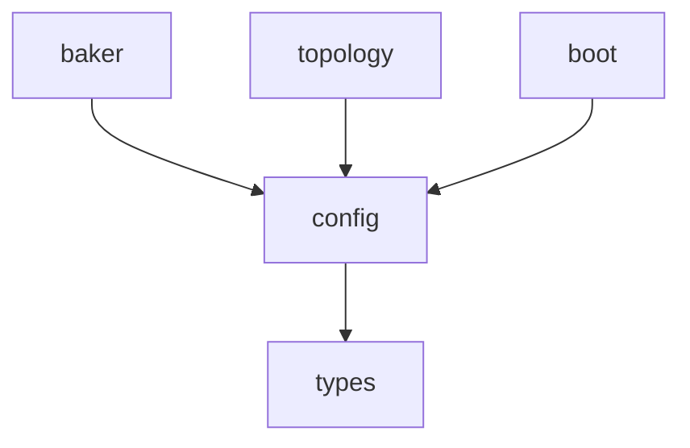

# spec_config

> Версия спеки: 1.0  
> Дата: 2026-05-28  
> Статус: Approved  

---

## §1. Идентификация

| Поле | Значение |
|------|----------|
| Название | config |
| Слой | Слой 1 — Контракты Данных |
| Тип | Library (lib) |
| no_std | Нет (требуется `std` для `fs`, `String` и аллокаций Serde) |
| Описание | Парсинг, валидация и типизация конфигурационных файлов (simulation, brain, anatomy, blueprints, io, instance). Крейт выступает в роли "Shift-Left" аппаратного огневола, гарантируя математическую корректность и валидность всех параметров симуляции перед загрузкой на GPU или хост. |

---

## §2. Стек и Окружение

### §2.1. Внутренние зависимости (inbound)

| Крейт | Что используется | Зачем |
|-------|-----------------|-------|
| `types` | `Tick`, `MasterSeed` | Использование фундаментальных типов квантов времени и сидов для построения структур конфигурации без нарушения архитектурной изоляции. |

### §2.2. Внешние зависимости

| Crate | Версия | Зачем |
|-------|--------|-------|
| `serde` | `=1.0.228`, features=["derive"] | Десериализация TOML-файлов в строгие типизированные структуры Rust. Версия жестко привязана к Workspace Cargo.toml. |
| `toml` | `=0.8.23` | Парсинг текстовых файлов конфигурации. Версия жестко привязана к Workspace Cargo.toml. |

### §2.3. Feature Flags

Секция не применима к данному крейту: Feature flags не используются.

---

## §3. Инварианты

Крейт `config` гарантирует соблюдение 5 фундаментальных инвариантов, которые служат контрактом для всех вышестоящих слоев движка.

### §3.1. Структурные инварианты

- **INV-CONFIG-001**: Максимальное количество типов нейронов в blueprints не может превышать `16` типов.
  - *Обоснование*: `VariantId` (идентификатор профиля в LUT) занимает 4 бита в упакованном представлении сомы (`SomaFlags` в `[spec_types.md §4.1]`). Соответственно, размер LUT-таблицы вариантов на GPU аппаратно ограничен 16 записями.
  - *Следствие нарушения*: Silent Data Corruption или падение GPU-ядра из-за выхода за границы массива Constant Memory (16 элементов) при чтении параметров.
  - *Где проверяется*: compile-time / load-time assert при десериализации `blueprints.toml` в `config::blueprints`.

### §3.2. Семантические инварианты

- **INV-CONFIG-002**: Плотность нейронов (`density`) в каждом слое `anatomy.toml` должна быть строго `>= 0.0`.
  - *Обоснование*: Отрицательная плотность не имеет биологического и математического смысла при стохастическом размещении сом.
  - *Следствие нарушения*: Ошибка стохастической генерации/размещения сом в `topology` (бесконечный цикл или panic).
  - *Где проверяется*: load-time / runtime assert при десериализации `anatomy.toml` в `config::anatomy`.

- **INV-CONFIG-003**: Дискретный шаг скорости `v_seg` должен быть строго целым числом: `(signal_speed_m_s * tick_duration_us) % segment_length_um == 0`.
  - *Обоснование*: В горячих ядрах симуляции используется целочисленная физика (Integer Physics) в соответствии с `[spec_physics.md §3.1]` для обеспечения 100% воспроизводимости и производительности на GPU. Дробный шаг `v_seg` недопустим.
  - *Следствие нарушения*: Ошибки округления на GPU, потеря детерминизма, неверное прохождение сигналов по сегментам аксона.
  - *Где проверяется*: load-time / runtime assert при валидации `simulation.toml` в `config::validate`.

- **INV-CONFIG-004**: Защита "Single Spike in Flight". Для каждого типа нейрона в `blueprints.toml` должно выполняться условие: `signal_propagation_length >= refractory_period`.
  - *Обоснование*: Гарантирует, что предыдущий импульс успеет покинуть сому (пройти длину хвоста) до того, как нейрон выйдет из рефрактерности и сможет сгенерировать новый спайк. Защищает регистр `BurstHeads8` от наложения сигналов.
  - *Следствие нарушения*: Наложение импульсов, повреждение аппаратной очереди `BurstHeads8` на GPU, крах расчетов STDP.
  - *Где проверяется*: В функции `validate_blueprints`.

- **INV-CONFIG-005**: Аппаратный лимит геометрии аксона. Значение `axon_growth_max_steps` в `simulation.toml` не может превышать 255.
  - *Обоснование*: Структура `PackedTarget` из Слоя 0 выделяет строго 8 бит на `Segment_Offset`. Если аксон будет длиннее 255 сегментов, дендриты не смогут адресовать его дальние участки, что приведет к Silent Data Corruption при битовом сдвиге.
  - *Следствие нарушения*: Переполнение 8-битного значения смещения, запись мусора в память VRAM.
  - *Где проверяется*: Shift-Left валидация `simulation.toml`.

### §3.3. Межкрейтовые инварианты

Секция не применима к данному крейту: Крейт является автономным Shift-Left валидатором конфигураций и не имеет взаимных зависимостей состояний с другими крейтами.

---

## §4. Публичный API

### §4.1. Типы (Types)

Все DTO-структуры крейта разделены на логические домены.

#### Домен 1: Системные метаданные (`sys.rs`)
*   **`SystemMeta`**
    *   **Семантика**: Метаданные конфигурационного файла (`id`, `version`, `created_at`). Используется для жесткого контроля версионирования.
    *   **Жизненный цикл**: Считывается при парсинге файлов, валидируется и переносится в итоговый `manifest.toml`.
    *   **Ограничения**: `id` обязан быть валидной строкой/UUID, `version` строго соответствует semver.

#### Домен 2: Вложенные структуры Simulation (`simulation.rs`)
*   **`SimulationConfig`**
    *   **Семантика**: Корневой AST-узел файла `simulation.toml` (Grandfather Level). Содержит параметры мира, физики, оркестрации отделов (departments) и межотдельских связей.
    *   **Жизненный цикл**: Считывается один раз при старте (Boot).
*   **`WorldConfig`**
    *   **Семантика**: Физические габариты макро-мира (`width_um`, `depth_um`, `height_um`). Задаются в микрометрах. 
    *   **Ограничения**: Габариты обязаны быть `> 0.0`.
*   **`SimulationParams`**
    *   **Семантика**: Фундаментальный физический свод законов вселенной (временные и пространственные константы).
    *   **Жизненный цикл**: Проходит жесткую Shift-Left валидацию на целочисленность `v_seg` (INV-CONFIG-003).
    *   **Ограничения**:
        *   `tick_duration_us > 0` — шаг времени в микросекундах.
        *   `total_ticks >= 0` — предел тиков симуляции (`0` = бесконечно).
        *   `master_seed: String` — строковый сид для wyhash/RNG, не может быть пустым.
        *   `voxel_size_um > 0.0` — размер вокселя (квант пространства).
        *   `segment_length_voxels > 0` — шаг сегмента аксона.
        *   `signal_speed_m_s > 0.0` — скорость сигнала.
        *   `sync_batch_ticks > 0` — размер батча оркестратора.
        *   `0 < axon_growth_max_steps <= 255` — аппаратный лимит шагов Cone Tracing.
        *   `max_dendrites == 128` — жесткий предел VRAM.
*   **`DepartmentEntry`**
    *   **Семантика**: Элемент оркестрации макро-уровня. Связывает независимые отделы (саб-мозги) в единый организм.
    *   **Ограничения**: Путь `config` (`brain.toml`) должен быть валидным.
*   **`DepartmentConnectionConfig`**
    *   **Семантика**: Описание макро-связей между отделами. Определяет маппинг выходной матрицы зоны одного отдела во входную зону другого.
    *   **Ограничения**: `from` и `to` должны указывать на валидные зарегистрированные отделы. `width` и `height` проекции должны быть `> 0`.

#### Домен 3: Вложенные структуры Brain (`brain.rs`)
*   **`BrainConfig`**
    *   **Семантика**: Корневой AST-узел файла `brain.toml`. Оркестратор зон макро-топологии.
*   **`SimulationConfigRef`**
    *   **Семантика**: Жесткая ссылка на корневой `simulation.toml`. Исключает дублирование физических констант и защищает кластер от Split-Brain.
    *   **Ограничения**: Указанный путь обязан существовать и содержать валидную конфигурацию физики.
*   **`ZoneConfig`**
    *   **Семантика**: Описание конкретной зоны с путями к ее файлам.
    *   **Ограничения**: Имя зоны (`name`) должно быть уникальным. Пути `blueprints`, `anatomy`, `io` и `baked_dir` обязаны быть валидными.
*   **`ConnectionConfig`**
    *   **Семантика**: Описание межзональной макро-связи (Ghost Projections). Определяет маппинг выходной матрицы во входную матрицу другой зоны.
    *   **Ограничения**: Габариты проекции (`width`, `height`) должны быть `> 0`. `entry_z` обязан соответствовать перечислению `EntryZ`. При `growth_steps == 0` (статический маппинг) поле `axon_ids` обязано быть `Some(Vec<u32>)` (MVP fallback).
*   **`EntryZ`**
    *   **Семантика**: Enum-тип для указания точки входа аксона в целевую зону: `Top`, `Mid`, `Bottom`.

#### Домен 4: Вложенные структуры Anatomy & Blueprints (`anatomy.rs`, `blueprints.rs`)
*   **`AnatomyConfig` & `BlueprintsConfig`**
    *   **Семантика**: Корневые структуры файлов `anatomy.toml` и `blueprints.toml`.
*   **`LayerConfig`**
    *   **Семантика**: Параметры слоя коры. Содержит процентную высоту (`height_pct`), плотность нейронов (`density`) и квоты клеточного состава (`composition`).
    *   **Ограничения**: `height_pct > 0.0`, `density >= 0.0`. Сумма `height_pct` всех слоев внутри `anatomy.toml` обязана быть строго 1.0 (INV-CONFIG-002).
*   **`NeuronTypeDistribution`**
    *   **Семантика**: Квота конкретного типа нейрона в слое.
    *   **Ограничения**: Сумма долей `share` всех элементов внутри списка `composition` слоя обязана быть строго равна 1.0.
*   **`NeuronType`**
    *   **Семантика**: Полный физический профиль нейрона, разбитый на логические подструктуры для гибкой Serde-десериализации:
        *   `name: String` — имя типа нейрона.
        *   `membrane: MembraneParams` — параметры мембраны (`threshold: i32`, `rest_potential: i32`, `leak_shift: u32`).
        *   `timings: TimingParams` — тайминги (`refractory_period: u8`, `synapse_refractory_period: u8`).
        *   `signal: SignalParams` — геометрия сигнала (`signal_propagation_length: u8`).
        *   `homeostasis: HomeostasisParams` — штрафы порога (`homeostasis_penalty: i32`, `homeostasis_decay: u16`).
        *   `adaptive_leak: AdaptiveLeakParams` — адаптивная утечка (`adaptive_leak_min_shift: i32`, `adaptive_leak_gain: u16`, `adaptive_mode: u8`).
        *   `dopamine: DopamineParams` — аффинность R-STDP (`d1_affinity: u8`, `d2_affinity: u8`).
        *   `gsop: GsopParams` — GSOP пластичность (`gsop_potentiation: u16`, `gsop_depression: u16`, `is_inhibitory: bool`, `inertia_curve: [u8; 8]`).
        *   `spontaneous: SpontaneousParams` — DDS шум (`spontaneous_firing_period_ticks: u32`).
    *   **Ограничения**: `refractory_period > 0`, `signal_propagation_length > 0`.
*   **`AxicorConstantMemory`**
    *   **Семантика**: Аппаратный контейнер строго на 1024 байта. Содержит массив из 16 скомпилированных `VariantParameters`.
    *   **Жизненный цикл**: Формируется `baker` и загружается напрямую в Constant Memory (L1 Cache) видеокарты.
    *   **Ограничения**: Размер массива профилей строго ограничен 16 элементами (INV-CONFIG-001).

#### Домен 5: Вложенные структуры I/O (`io.rs`)
*   **`IoConfig`**
    *   **Семантика**: Корневой AST-узел файла `io.toml`. Отвечает за маппинг внешних каналов ввода-вывода на пространство шарда.
*   **`IoMatrix`**
    *   **Семантика**: Группа пинов ввода/вывода (сенсорная или моторная область).
    *   **Ограничения**: Имя матрицы обязано быть уникальным. Содержит параметры: `resolution: (u32, u32)` (разрешение сетки), `strategy: String` (стратегия сбора спайков), `modality: String` (модальность канала).
*   **`IoPin`**
    *   **Семантика**: Конкретный канал передачи данных.
    *   **Ограничения**: UV-координаты (`local_u`, `local_v`, `u_width`, `v_height`) обязаны лежать в диапазоне `0.0 .. 1.0`. `stride > 0`.
*   **`SysId`**
    *   **Семантика**: Утилитарная обертка для строковых идентификаторов (например, `pin_id_v1` или `matrix_id_v1`).

#### Домен 6: Вложенные структуры Instance / Shard (`instance.rs`)
*   **`InstanceConfig`**
    *   **Семантика**: Корневой AST-узел файла `shard.toml`. Описывает геометрию конкретного шарда в макро-пространстве кластера.
    *   **Жизненный цикл**: Считывается конвейером `boot` для аллокации VRAM и инициализации топологии сети.
*   **`Coordinate3D` & `Dimensions3D`**
    *   **Семантика**: Физическое макро-положение (`x, y, z`) и физические размеры (`w, d, h`) шарда.
    *   **Ограничения**: Для поддержки 3D-масштабирования (Macro-3D) координаты `x`, `y`, `z` имеют тип `u64`. Размеры `w, d, h` должны быть строго `> 0.0`.
*   **`Neighbors3D`**
    *   **Семантика**: Сетевые соседи шарда по всем 6 осям: `x_plus`, `x_minus`, `y_plus`, `y_minus`, `z_plus`, `z_minus` для корректной маршрутизации Ghost-аксонов в 3D пространстве.
    *   **Ограничения**: Значение `"Self"` легально и активирует тороидальное замыкание.
*   **`ShardSettings`**
    *   **Семантика**: Настройки ночной фазы и рантайма:
        *   `night_interval_ticks: u32` — периодичность наступления Ночной Фазы.
        *   `max_sprouts: u32` — лимит структурного пластического почкования.
        *   `prune_threshold: i32` — порог обрезки синапсов.
        *   `save_checkpoints_interval_ticks: u32` — интервал записи снапшотов `.state` на SSD (из `[settings]`).
        *   `ghost_capacity: u32` — резерв VRAM под Ghost Axons (из `[settings]`).

#### Домен 7: Сгенерированные манифесты (`manifest.rs`)
*Эти структуры генерируются AOT-компилятором (baker) и загружаются в рантайм без тяжелого парсинга логики.*

*   **`ModelManifest`**
    *   **Семантика**: Глобальный манифест всей модели со ссылками на директории зон.
    *   **Ограничения**: Поле `magic` строго обязано быть равно `0x4D4F444C` (`MODL`).
*   **`ZoneManifest`**
    *   **Семантика**: AOT-скомпилированный манифест зоны. Содержит точные вычисленные числа, готовые для инициализации памяти GPU.
    *   **Жизненный цикл**: Формируется крейтом `baker`, читается конвейером `boot`.
*   **`ManifestMemory` & `ManifestNetwork`**
    *   **Семантика**: Финализированные расчеты VRAM (аппаратно выровненное `padded_n`, `virtual_axons`, `ghost_capacity`) и сетевые порты для UDP/TCP обмена.
*   **`ManifestSettings` & `ManifestPlasticity`**
    *   **Семантика**: Выжимка рантайм-настроек и порогов пластичности для горячего цикла.
*   **`ManifestVariant`**
    *   **Семантика**: Транслированный `NeuronType` в плоскую структуру, готовую для прямого каста в C-ABI контейнер `VariantParameters`.

### §4.2. Трейты

Секция не применима к данному крейту: Публичные трейты отсутствуют, так как крейт предоставляет исключительно структуры данных для конфигурации и функции парсинга.

### §4.3. Функции

Все функции крейта `config` делятся на три категории: **парсинг** (десериализация TOML → DTO), **валидация** (Shift-Left проверки инвариантов) и **загрузка** (файловый I/O + парсинг).

---

#### Категория A: Парсинг (TOML → DTO)

Чистые функции без побочных эффектов. Принимают `&str` (содержимое TOML-файла), возвращают типизированную структуру или ошибку.

##### `fn parse_simulation_config(content: &str) -> Result<SimulationConfig, ConfigError>`

- **Назначение**: Десериализация содержимого `simulation.toml` в корневую структуру `SimulationConfig`. Строгий режим Serde (`deny_unknown_fields`) запрещает неизвестные поля.
- **Предусловия**: Нет.
- **Постусловия**: Возвращает валидный `SimulationConfig` или `ConfigError::ParseError` при нарушении формата. Подстановка дефолтов: `segment_length_voxels = 2`, `axon_growth_max_steps = 255` при отсутствии.
- **Сложность**: O(N) по времени (N — длина строки), O(M) по памяти (M — число departments + connections).
- **Паника**: Никогда.
- **Пример**:
  ```rust
  let config = parse_simulation_config(toml_str)?;
  assert!(config.simulation.tick_duration_us > 0);
  ```

##### `fn parse_brain_config(content: &str) -> Result<BrainConfig, ConfigError>`

- **Назначение**: Десериализация содержимого `brain.toml` в `BrainConfig`. Извлекает `SimulationConfigRef`, массивы `[[zone]]` и `[[connection]]`.
- **Предусловия**: Нет.
- **Постусловия**: Возвращает `BrainConfig` с непустым `SimulationConfigRef.config`. Не резолвит путь к `simulation.toml` — это ответственность `resolve_simulation_ref`.
- **Сложность**: O(N) по времени, O(Z + C) по памяти (Z — зон, C — connections).
- **Паника**: Никогда.

##### `fn parse_anatomy_config(content: &str) -> Result<AnatomyConfig, ConfigError>`

- **Назначение**: Десериализация содержимого `anatomy.toml` в `AnatomyConfig` (массив `LayerConfig`).
- **Предусловия**: Нет.
- **Постусловия**: Возвращает `AnatomyConfig` со списком слоёв. Не выполняет семантическую валидацию (1.0 Height Invariant) — это ответственность `validate_anatomy`.
- **Сложность**: O(N) по времени, O(L) по памяти (L — число слоёв).
- **Паника**: Никогда.

##### `fn parse_blueprints_config(content: &str) -> Result<BlueprintsConfig, ConfigError>`

- **Назначение**: Десериализация содержимого `blueprints.toml` в `BlueprintsConfig` (массив `NeuronType`). Порядок элементов в массиве определяет `VariantId` (0..15).
- **Предусловия**: Нет.
- **Постусловия**: Возвращает `BlueprintsConfig`. Не выполняет семантическую валидацию лимита 16 типов — это ответственность `validate_blueprints`.
- **Сложность**: O(N) по времени, O(T) по памяти (T — число типов нейронов).
- **Паника**: Никогда.

##### `fn parse_io_config(content: &str) -> Result<IoConfig, ConfigError>`

- **Назначение**: Десериализация содержимого `io.toml` в `IoConfig` (матрицы и пины ввода/вывода).
- **Предусловия**: Нет.
- **Постусловия**: Возвращает `IoConfig` с валидной структурой матриц и пинов. Не проверяет UV-координаты семантически — это ответственность `validate_io`.
- **Сложность**: O(N) по времени, O(M × P) по памяти (M — матриц, P — пинов на матрицу).
- **Паника**: Никогда.

##### `fn parse_instance_config(content: &str) -> Result<InstanceConfig, ConfigError>`

- **Назначение**: Десериализация содержимого `shard.toml` в `InstanceConfig`. Значение `"Self"` в полях `Neighbors3D` парсится как тороидальное замыкание.
- **Предусловия**: Нет.
- **Постусловия**: Возвращает `InstanceConfig` с валидным `Coordinate3D`, `Dimensions3D`, `Neighbors3D` и `ShardSettings`.
- **Сложность**: O(N) по времени, O(1) по памяти.
- **Паника**: Никогда.

##### `fn parse_sys_meta(content: &str) -> Result<SystemMeta, ConfigError>`

- **Назначение**: Извлечение метаданных (`id`, `version`, `created_at`) из любого TOML-файла, содержащего секцию `[*_id_v1]`.
- **Предусловия**: Нет.
- **Постусловия**: Возвращает `SystemMeta` или `ConfigError` если секция метаданных отсутствует или невалидна.
- **Сложность**: O(N) по времени, O(1) по памяти.
- **Паника**: Никогда.

---

#### Категория B: Файловая загрузка (File I/O + Parse)

Обёртки поверх парсеров, выполняющие `fs::read_to_string` и делегирующие парсинг соответствующей `parse_*` функции. Требуют `std`.

##### `fn load_simulation_config(path: &Path) -> Result<SimulationConfig, ConfigError>`

- **Назначение**: Чтение файла `simulation.toml` с диска и вызов `parse_simulation_config`.
- **Предусловия**: Файл по указанному пути должен существовать и быть читаемым.
- **Постусловия**: Возвращает `SimulationConfig` или `ConfigError::IoError` / `ConfigError::ParseError`.
- **Сложность**: O(N) по времени (I/O + парсинг), O(N) по памяти (буфер файла).
- **Паника**: Никогда.

##### `fn load_brain_config(path: &Path) -> Result<BrainConfig, ConfigError>`

- **Назначение**: Чтение файла `brain.toml` с диска и вызов `parse_brain_config`. Не резолвит `SimulationConfigRef`.
- **Предусловия**: Файл по указанному пути должен существовать.
- **Постусловия**: Возвращает `BrainConfig` или `ConfigError`.
- **Сложность**: O(N) по времени, O(N) по памяти.
- **Паника**: Никогда.

##### `fn load_instance_config(path: &Path) -> Result<InstanceConfig, ConfigError>`

- **Назначение**: Чтение файла `shard.toml` с диска и вызов `parse_instance_config`.
- **Предусловия**: Файл по указанному пути должен существовать.
- **Постусловия**: Возвращает `InstanceConfig` или `ConfigError`.
- **Сложность**: O(N) по времени, O(N) по памяти.
- **Паника**: Никогда.

---

#### Категория C: Валидация (Shift-Left Инварианты)

Функции семантической проверки. Вызываются после парсинга для обеспечения инвариантов, которые невозможно выразить через Serde.

##### `fn validate_simulation(config: &SimulationConfig) -> Result<(), ConfigError>`

- **Назначение**: Проверка целочисленности `v_seg` (INV-CONFIG-003), положительности физических констант (`tick_duration_us > 0`, `voxel_size_um > 0.0`, `signal_speed_m_s > 0.0`), непустоты `master_seed`, и лимита `max_dendrites == 128`.
- **Предусловия**: `config` получен из `parse_simulation_config`.
- **Постусловия**: `Ok(())` или `ConfigError::ValidationError` с описанием нарушенного инварианта.
- **Сложность**: O(1).
- **Паника**: Никогда.

##### `fn validate_blueprints(config: &BlueprintsConfig) -> Result<(), ConfigError>`

- **Назначение**: Проверка аппаратного лимита `<= 16` типов нейронов (INV-CONFIG-001). Проверка правила "Single Spike in Flight": `signal_propagation_length >= refractory_period` (INV-CONFIG-004). Проверка массива `inertia_curve.len() == 8`.
- **Предусловия**: `config` получен из `parse_blueprints_config`.
- **Постусловия**: `Ok(())` или `ConfigError::ValidationError`.
- **Сложность**: O(T) (T — число типов нейронов, T ≤ 16).
- **Паника**: Никогда.

##### `fn validate_anatomy(config: &AnatomyConfig) -> Result<(), ConfigError>`

- **Назначение**: Проверка 1.0 Height Invariant (сумма `height_pct` всех слоев ≈ 1.0 с допуском `1e-4`). Проверка 1.0 Composition Invariant (сумма `share` внутри `composition` каждого слоя ≈ 1.0). Проверка `density >= 0.0` (INV-CONFIG-002).
- **Предусловия**: `config` получен из `parse_anatomy_config`.
- **Постусловия**: `Ok(())` или `ConfigError::ValidationError`.
- **Сложность**: O(L × C) (L — слоёв, C — типов в composition).
- **Паника**: Никогда.

##### `fn validate_brain(config: &BrainConfig) -> Result<(), ConfigError>`

- **Назначение**: Проверка уникальности имен зон (через `HashSet`). Проверка непустого `SimulationConfigRef.config`. Проверка `width > 0` и `height > 0` для каждого `ConnectionConfig`. Проверка что `from`/`to` ссылаются на существующие зоны. Проверка `axon_ids` при `growth_steps == 0`.
- **Предусловия**: `config` получен из `parse_brain_config`.
- **Постусловия**: `Ok(())` или `ConfigError::ValidationError`.
- **Сложность**: O(Z + C) (Z — зон, C — connections).
- **Паника**: Никогда.

##### `fn validate_io(config: &IoConfig) -> Result<(), ConfigError>`

- **Назначение**: Проверка уникальности имен матриц. Проверка UV-координат пинов в диапазоне `0.0..=1.0`. Проверка `stride > 0`. Проверка `resolution > (0, 0)`.
- **Предусловия**: `config` получен из `parse_io_config`.
- **Постусловия**: `Ok(())` или `ConfigError::ValidationError`.
- **Сложность**: O(M × P) (M — матриц, P — пинов).
- **Паника**: Никогда.

##### `fn validate_instance(config: &InstanceConfig) -> Result<(), ConfigError>`

- **Назначение**: Проверка `Dimensions3D` (`w, d, h > 0.0`). Проверка корректности формата адресов соседей (IP:Port или `"Self"`). Проверка `ghost_capacity > 0`. Проверка `save_checkpoints_interval_ticks > 0`.
- **Предусловия**: `config` получен из `parse_instance_config`.
- **Постусловия**: `Ok(())` или `ConfigError::ValidationError`.
- **Сложность**: O(1).
- **Паника**: Никогда.

---

#### Категория D: Резолвинг перекрёстных ссылок

##### `fn resolve_simulation_ref(brain: &BrainConfig, base_dir: &Path) -> Result<SimulationConfig, ConfigError>`

- **Назначение**: Резолвит `SimulationConfigRef.config` относительно `base_dir` (директория `brain.toml`), загружает и парсит найденный `simulation.toml`. Исключает обход файловой системы (`PathBuf::parent()`) — путь берётся напрямую из конфига.
- **Предусловия**: `brain.simulation.config` содержит валидный относительный путь. `base_dir` — директория, содержащая `brain.toml`.
- **Постусловия**: Возвращает `SimulationConfig` или `ConfigError::IoError` (файл не найден) / `ConfigError::ParseError`.
- **Сложность**: O(N) по времени (I/O + парсинг), O(N) по памяти.
- **Паника**: Никогда.

---

#### Категория E: Парсинг манифестов (AOT-сгенерированные TOML)

Эти функции парсят `manifest.toml` файлы, сгенерированные крейтом `baker`. Структуры манифестов определены в §4.1 (Домен 7).

##### `fn parse_model_manifest(content: &str) -> Result<ModelManifest, ConfigError>`

- **Назначение**: Десериализация `manifest.toml` уровня модели. Валидация magic-числа `0x4D4F444C` (`MODL`).
- **Предусловия**: Нет.
- **Постусловия**: Возвращает `ModelManifest` с проверенным `magic`. `ConfigError::ValidationError` при несовпадении magic.
- **Сложность**: O(N) по времени, O(Z) по памяти (Z — зон в модели).
- **Паника**: Никогда.

##### `fn parse_zone_manifest(content: &str) -> Result<ZoneManifest, ConfigError>`

- **Назначение**: Десериализация `manifest.toml` уровня зоны. Содержит `ManifestMemory`, `ManifestNetwork`, `ManifestSettings`, `ManifestPlasticity` и массив `ManifestVariant`.
- **Предусловия**: Нет.
- **Постусловия**: Возвращает `ZoneManifest` с массивом `variants.len() <= 16`.
- **Сложность**: O(N) по времени, O(V) по памяти (V — число вариантов, V ≤ 16).
- **Паника**: Никогда.

### §4.4. Константы и Магические Числа

| Константа | Значение | Тип | Семантика |
|-----------|----------|-----|-----------|
| `MAX_NEURON_TYPES` | 16 | `usize` | Максимально допустимое количество уникальных типов нейронов на один шард (аппаратное ограничение GPU constant memory). |
| `MIN_TICK_DURATION` | 1 | `u32` | Минимальная длительность тика в микросекундах. |
| `MODEL_MANIFEST_MAGIC` | `0x4D4F444C` | `u32` | Magic-число (`MODL` в ASCII) для валидации `ModelManifest` при десериализации. |
| `MAX_INERTIA_RANKS` | 8 | `usize` | Жесткий размер массива `inertia_curve` в `GsopParams`. Парсер обрезает входной массив через `.take(8)`. |
| `FLOAT_TOLERANCE` | `1e-4` | `f32` | Допуск погрешности float при проверке 1.0 Height / Composition инвариантов в `validate_anatomy`. |
| `DEFAULT_MAX_STEPS` | 255 | `u32` | Безопасный фолбэк для `axon_growth_max_steps`. Установлен в 255 для соответствия 8-битному лимиту PackedTarget. |

---

## §5. Доменная Логика

Парсинг, типизация и валидация конфигурационных файлов симулятора (параметров физики, анатомии, зон и внешнего ввода-вывода) из формата TOML.

Выделение конфигурации в отдельный крейт Слоя 1 изолирует ресурсоёмкий текстовый парсинг (Serde, динамические аллокации строк и работу с файловой системой) от вычислительного ядра симуляции. Это оставляет горячий цикл чистым от динамической памяти и пригодным для сборки в `no_std`.

Крейт выступает в роли «Shift-Left» предохранителя симуляции. Он проверяет анатомические и физические параметры сети (количество типов нейронов, скорость сигналов, ограничения геометрии) на соответствие жестким аппаратным лимитам GPU и MCU *до* этапа генерации топологии. Это исключает запуск заведомо некорректных моделей, способных вызвать переполнение видеопамяти (VRAM) или сбои целочисленной физики в рантайме.

---

## §6. Алгоритмы и Формулы

### §6.1. Проверка целочисленности дискретной скорости (`v_seg` Integer Verification)

**Вход**:
- `signal_speed_m_s: f32` — скорость распространения сигнала в метрах в секунду (из `simulation.toml`).
- `tick_duration_us: u32` — длительность тика в микросекундах (из `simulation.toml`).
- `segment_length_um: f32` — длина одного сегмента аксона в микрометрах (из `simulation.toml`).

**Выход**:
- `v_seg: u32` — дискретный шаг скорости в сегментах за тик.
- `Result<(), ConfigError>` — результат валидации.

**Детерминизм**: Да.

**Формула / Псевдокод:**

Математическое вычисление скорости за тик в микрометрах:

```math
\text{speed\_um\_tick} = \text{signal\_speed\_m\_s} \cdot \text{tick\_duration\_us}
```

```math
\text{v\_seg\_f32} = \frac{\text{speed\_um\_tick}}{\text{segment\_length\_um}}
```

Движок требует, чтобы `v_seg_f32` было строго целым числом для работы целочисленной физики без FPU-округлений:

```math
\text{v\_seg\_f32} \pmod 1.0 = 0.0
```

```rust
// Псевдокод
fn validate_v_seg(speed_m_s: f32, tick_us: u32, seg_len_um: f32) -> Result<u32, &'static str> {
    let speed_um_tick = speed_m_s * tick_us as f32;
    let v_seg_f32 = speed_um_tick / seg_len_um;
    let v_seg = v_seg_f32.round() as u32;
    
    if (v_seg_f32 - v_seg as f32).abs() > 1e-5 {
        return Err("v_seg is not an integer: Integer Physics constraint violated");
    }
    Ok(v_seg)
}
```

**Численный пример:**

| Вход (`speed_m_s`, `tick_us`, `seg_len_um`) | Ожидаемый `v_seg` | Результат | Комментарий |
|:---|:---|:---|:---|
| `(2.0, 1000, 20.0)` | `100` | `Ok(100)` | `2.0 * 1000 / 20.0 = 100.0` — строго целое |
| `(1.23, 1000, 20.0)` | — | `Err` | `1.23 * 1000 / 20.0 = 61.5` — дробное значение |

---

## §7. Структуры Данных и Memory Layout

### §7.1. Иерархическое дерево конфигурации

Конфигурационные структуры организуются в логическое дерево без пересечений полей. Все структуры являются Serde DTO без бинарных паддингов — memory layout определяется компилятором Rust.

```text
SimulationConfig (simulation.toml)
  ├── meta: Option<SystemMeta>
  ├── world: WorldConfig
  │     ├── width_um (f64)
  │     ├── depth_um (f64)
  │     └── height_um (f64)
  ├── simulation: SimulationParams
  │     ├── tick_duration_us (u32)
  │     ├── total_ticks (u64)
  │     ├── master_seed (String)
  │     ├── voxel_size_um (f32)
  │     ├── segment_length_voxels (u32, default=2)
  │     ├── signal_speed_m_s (f32)
  │     ├── sync_batch_ticks (u32)
  │     ├── axon_growth_max_steps (u32, default=2000)
  │     └── max_dendrites (u8, ==128)
  ├── departments: Vec<DepartmentEntry>
  │     ├── meta: Option<SystemMeta>
  │     ├── name (String)
  │     └── config (String → path to brain.toml)
  └── connections: Vec<DepartmentConnectionConfig>
        ├── from (String)
        ├── to (String)
        ├── output_matrix (String)
        ├── width (u32)
        ├── height (u32)
        ├── entry_z: EntryZ
        ├── target_type (String)
        └── growth_steps (u32)

BrainConfig (brain.toml)
  ├── simulation: SimulationConfigRef
  │     └── config (String → path to simulation.toml)
  ├── zones: Vec<ZoneConfig>
  │     ├── meta: Option<SystemMeta>
  │     ├── name (String, unique)
  │     ├── blueprints (String → path)
  │     ├── anatomy (String → path)
  │     ├── io (String → path)
  │     └── baked_dir (String → path)
  └── connections: Vec<ConnectionConfig>
        ├── meta: Option<SystemMeta>
        ├── from (String)
        ├── to (String)
        ├── output_matrix (String)
        ├── width (u32)
        ├── height (u32)
        ├── entry_z: EntryZ {Top, Mid, Bottom}
        ├── target_type (String)
        ├── growth_steps (u32)
        └── axon_ids: Option<Vec<u32>>

AnatomyConfig (anatomy.toml)
  └── layers: Vec<LayerConfig>
        ├── name (String)
        ├── height_pct (f32, Σ==1.0)
        ├── density (f32, >=0.0)
        └── composition: Vec<NeuronTypeDistribution>
              ├── type_name (String)
              └── share (f32, Σ==1.0)

BlueprintsConfig (blueprints.toml)
  └── neuron_types: Vec<NeuronType>  [max 16]
        ├── name (String)
        ├── membrane: MembraneParams
        │     ├── threshold (i32)
        │     ├── rest_potential (i32)
        │     └── leak_shift (u32)
        ├── timings: TimingParams
        │     ├── refractory_period (u8, >0)
        │     └── synapse_refractory_period (u8)
        ├── signal: SignalParams
        │     └── signal_propagation_length (u8, >0)
        ├── homeostasis: HomeostasisParams
        │     ├── homeostasis_penalty (i32)
        │     └── homeostasis_decay (u16)
        ├── adaptive_leak: AdaptiveLeakParams
        │     ├── adaptive_leak_min_shift (i32)
        │     ├── adaptive_leak_gain (u16)
        │     └── adaptive_mode (u8)
        ├── dopamine: DopamineParams
        │     ├── d1_affinity (u8)
        │     └── d2_affinity (u8)
        ├── gsop: GsopParams
        │     ├── gsop_potentiation (u16)
        │     ├── gsop_depression (u16)
        │     ├── is_inhibitory (bool)
        │     └── inertia_curve ([u8; 8])
        └── spontaneous: SpontaneousParams
              └── spontaneous_firing_period_ticks (u32)

IoConfig (io.toml)
  └── matrices: Vec<IoMatrix>
        ├── name (String, unique)
        ├── resolution (u32, u32)
        ├── strategy (String)
        ├── modality (String)
        └── pins: Vec<IoPin>
              ├── id: SysId
              ├── local_u (f32, 0.0..=1.0)
              ├── local_v (f32, 0.0..=1.0)
              ├── u_width (f32, 0.0..=1.0)
              ├── v_height (f32, 0.0..=1.0)
              └── stride (u32, >0)

InstanceConfig (shard.toml)
  ├── meta: Option<SystemMeta>
  ├── zone_id (String)
  ├── offset: Coordinate3D {x: u64, y: u64, z: u64}
  ├── dimensions: Dimensions3D {w: f64, d: f64, h: f64}
  ├── neighbors: Neighbors3D
  │     ├── x_plus: Option<String>  ("Self" = torus)
  │     ├── x_minus: Option<String>
  │     ├── y_plus: Option<String>
  │     ├── y_minus: Option<String>
  │     ├── z_plus: Option<String>
  │     └── z_minus: Option<String>
  └── settings: ShardSettings
        ├── night_interval_ticks (u32)
        ├── max_sprouts (u32)
        ├── prune_threshold (i32)
        ├── save_checkpoints_interval_ticks (u32)
        └── ghost_capacity (u32)

ModelManifest (manifest.toml — model level)
  ├── magic (u32, ==0x4D4F444C)
  └── zones: Vec<String> (paths)

ZoneManifest (manifest.toml — zone level)
  ├── memory: ManifestMemory
  ├── network: ManifestNetwork
  ├── settings: ManifestSettings
  ├── plasticity: ManifestPlasticity
  └── variants: Vec<ManifestVariant> [max 16]
```

---

## §8. Граничные Случаи и Особые Сценарии

### §8.1. Граничные значения

| # | Ситуация | Ожидаемое поведение |
|---|----------|-------------------|
| E-016 | **Плотность нейронов меньше нуля (`density < 0.0`)**: В слое анатомии передано отрицательное значение плотности. | Валидатор немедленно возвращает `ConfigError::ValidationError` и останавливает запуск (INV-CONFIG-002). |
| E-017 | **Превышение количества типов нейронов (`neuron_types.len() > 16`)**: В blueprints.toml определено 17 или более профилей нейронов. | Валидатор возвращает `ConfigError::ValidationError("Neuron types limit exceeded")` (INV-CONFIG-001). |
| E-018 | **Дробное значение шага скорости (`v_seg` is non-integer)**: Физические параметры дают дробный шаг. | Валидатор возвращает `ConfigError::ValidationError("v_seg is not an integer")` (INV-CONFIG-003). |
| E-019 | **Нарушение Single Spike in Flight (`signal_propagation_length < refractory_period`)**: Конфигурация допускает выпуск второго спайка до затухания первого. | Валидатор возвращает `ConfigError::ValidationError` (INV-CONFIG-004). |
| E-020 | **Превышение лимита длины аксона (`axon_growth_max_steps > 255`)**: Попытка задать длину, превышающую 8-битный лимит адресации. | Валидатор возвращает `ConfigError::ValidationError` (INV-CONFIG-005). |

### §8.2. Состояния гонки и конкурентность

Секция не применима к данному крейту: Крейт является stateless, не содержит глобального разделяемого состояния, кэша или параллельного исполнения. Все операции парсинга и валидации выполняются в рамках одного потока на этапе инициализации рантайма.

### §8.3. Деградация и Recovery

Секция не применима к данному крейту: Крейт выполняет чистый разбор конфигурации во время старта (AOT/Boot) и не участвует в рантайм-сценариях деградации или самовосстановления системы.

---

## §9. Ошибки

### §9.1. Перечисление ошибок

```rust
#[derive(Debug)]
pub enum ConfigError {
    /// Ошибка файлового ввода/вывода (файл не найден, нет прав доступа)
    IoError(std::io::Error),
    /// Ошибка парсинга структуры TOML (синтаксические ошибки в файле)
    ParseError(String),
    /// Нарушение инвариантов и ограничений валидации (INV-CONFIG-001, 002, 003)
    ValidationError(String),
}
```

### §9.2. Стратегия обработки

| Ошибка | Восстановимая? | Рекомендация вызывающему |
|--------|---------------|------------------------|
| `ConfigError::IoError` | Нет | Прервать запуск. Проверить наличие и права доступа к файлу конфигурации. |
| `ConfigError::ParseError` | Нет | Прервать запуск. Проверить синтаксис TOML-файла конфигурации. |
| `ConfigError::ValidationError` | Нет | Прервать запуск. Привести параметры симуляции в соответствие с аппаратными ограничениями. |

### §9.3. Паники

| Условие | Почему паника, а не Err |
|---------|--------------------------|
| — | Крейт не порождает паник и всегда возвращает `Result` для безопасной обработки ошибок вызывающим кодом. |

---

## §10. Зависимости и Интеграция

### §10.1. Что крейт потребляет (inbound)

| Крейт-источник | Что используем | Какой контракт ожидаем |
|---------------|---------------|----------------------|
| `types` | `Tick`, `MasterSeed` | Атомарные типы данных в no_std окружении. |

### §10.2. Кто потребляет крейт (outbound / обратные зависимости)

| Крейт-потребитель | Что использует | Какой контракт мы обязаны сохранить |
|------------------|---------------|-----------------------------------|
| `baker` | `SimulationConfig`, `AnatomyConfig`, `BlueprintsConfig` | Предоставление 100% провалидированных данных для построения бинарного архива `.axic`. |
| `topology` | `SimulationConfig`, `AnatomyConfig` | Гарантия валидности плотности слоев для генерации координат. |
| `boot` | `SimulationConfig`, `InstanceConfig` | Стабильные типы и методы десериализации на этапе инициализации шарда. |

### §10.3. Диаграмма взаимодействия



---

## §11. Стратегия Тестирования

### §11.1. Юнит-тесты

| Тест | Что проверяет | Связанный инвариант / Граничный случай |
|------|--------------|-------------------|
| `test_invalid_density_fails` | Попытка спарсить плотность `< 0.0` возвращает `Err(ValidationError)`. | INV-CONFIG-002, E-016 |
| `test_too_many_neuron_types_fails` | Определение более 16 типов нейронов возвращает ошибку. | INV-CONFIG-001, E-017 |
| `test_v_seg_non_integer_fails` | Нецелочисленная скорость дает `Err(ValidationError)`. | INV-CONFIG-003, E-018 |
| `test_single_spike_in_flight_violation` | Проверка `signal_propagation_length < refractory_period` возвращает ошибку. | INV-CONFIG-004, E-019 |
| `test_axon_growth_max_steps_exceeded` | Задание `axon_growth_max_steps > 255` возвращает `Err(ValidationError)`. | INV-CONFIG-005, E-020 |
| `test_valid_simulation_config` | Полный цикл парсинга корректного `simulation.toml` завершается успехом. | INV-CONFIG-003 |
| `test_valid_brain_config` | Парсинг корректного `brain.toml` с `[[zone]]` и `[[connection]]`. | — |
| `test_brain_duplicate_zone_names` | Две зоны с одинаковым `name` → `Err(ValidationError)`. | — |
| `test_brain_missing_simulation_ref` | Отсутствие `[simulation].config` → `Err(ValidationError)`. | — |
| `test_anatomy_height_sum_not_1` | Сумма `height_pct` ≠ 1.0 → `Err(ValidationError)`. | INV-CONFIG-002 |
| `test_anatomy_composition_sum_not_1` | Сумма `share` в `composition` ≠ 1.0 → `Err(ValidationError)`. | INV-CONFIG-002 |
| `test_io_uv_out_of_range` | UV-координата пина `> 1.0` → `Err(ValidationError)`. | — |
| `test_io_duplicate_matrix_names` | Две матрицы с одинаковым именем → `Err(ValidationError)`. | — |
| `test_instance_self_neighbor` | Значение `"Self"` корректно парсится как тороидальное замыкание. | — |
| `test_instance_zero_dimensions` | Размеры шарда `w = 0.0` → `Err(ValidationError)`. | — |
| `test_model_manifest_wrong_magic` | `ModelManifest` с неверным `magic` → `Err(ValidationError)`. | — |
| `test_zone_manifest_variants_limit` | `ZoneManifest` с `variants.len() > 16` → `Err(ValidationError)`. | INV-CONFIG-001 |
| `test_blueprints_inertia_curve_len` | Массив `inertia_curve` длиннее 8 → обрезка до 8 рангов. | — |
| `test_simulation_defaults` | Отсутствие `segment_length_voxels` → подставляется дефолт `2`. | — |
| `test_connection_axon_ids_required` | `growth_steps == 0` без `axon_ids` → `Err(ValidationError)`. | — |

### §11.2. Property-based тесты

Для проверки устойчивости парсера применяются property-based тесты (через генератор случайных TOML строк):
1. **Fuzzing Parse:** Передача случайного мусора в функции парсинга никогда не вызывает паник в коде, возвращая строго `Err(ParseError)`.

### §11.3. Интеграционные тесты

| Тест | Крейты-участники | Сценарий |
|------|-----------------|---------|
| `test_full_boot_validation` | `config` + `boot` | Полная загрузка кластера с валидацией всех 6 TOML-файлов. |

### §11.4. Тесты производительности

Секция не применима к данному крейту: Конфигурация парсится однократно при старте симуляции, жесткие требования по латентности и пропускной способности отсутствуют.

---

## §12. Бюджеты и Ограничения

### §12.1. Память

Секция не применима к данному крейту: Крейт не аллоцирует постоянную память и не имеет рантайм-кешей.

### §12.2. Латентность

Секция не применима к данному крейту: Время парсинга конфигурации на старте не является критичным для симуляции (AOT).

### §12.3. Compile-time

| Ограничение | Значение |
|------------|---------|
| Максимальное время сборки крейта | < 10s (release) |

---

## Приложение A — Глоссарий

| Термин | Определение |
|--------|-----------|
| Shift-Left Валидация | Подход к обеспечению качества, при котором проверки переносятся на самые ранние этапы жизненного цикла (в данном случае — до запуска симуляции). |

Checklist Полноты (A.3)

- [x] Все публичные типы описаны в §4
- [x] Все функции описаны в §4.3 (7 parse + 3 load + 6 validate + 1 resolve + 2 manifest = 19 функций)
- [x] Все инварианты из §3 имеют соответствующий пункт в §11 (тесты)
- [x] Все `Err`-варианты перечислены в §9 (`IoError`, `ParseError`, `ValidationError`)
- [x] Все крейты-потребители перечислены в §10.2
- [x] Нет ни одного «магического числа» без объяснения
- [x] Все формулы имеют единицы измерения
- [x] Граничные случаи из §8 покрыты тестами в §11
- [x] Все константы описаны в §4.4 (`MAX_NEURON_TYPES`, `MIN_TICK_DURATION`, `MODEL_MANIFEST_MAGIC`, `MAX_INERTIA_RANKS`, `FLOAT_TOLERANCE`)
