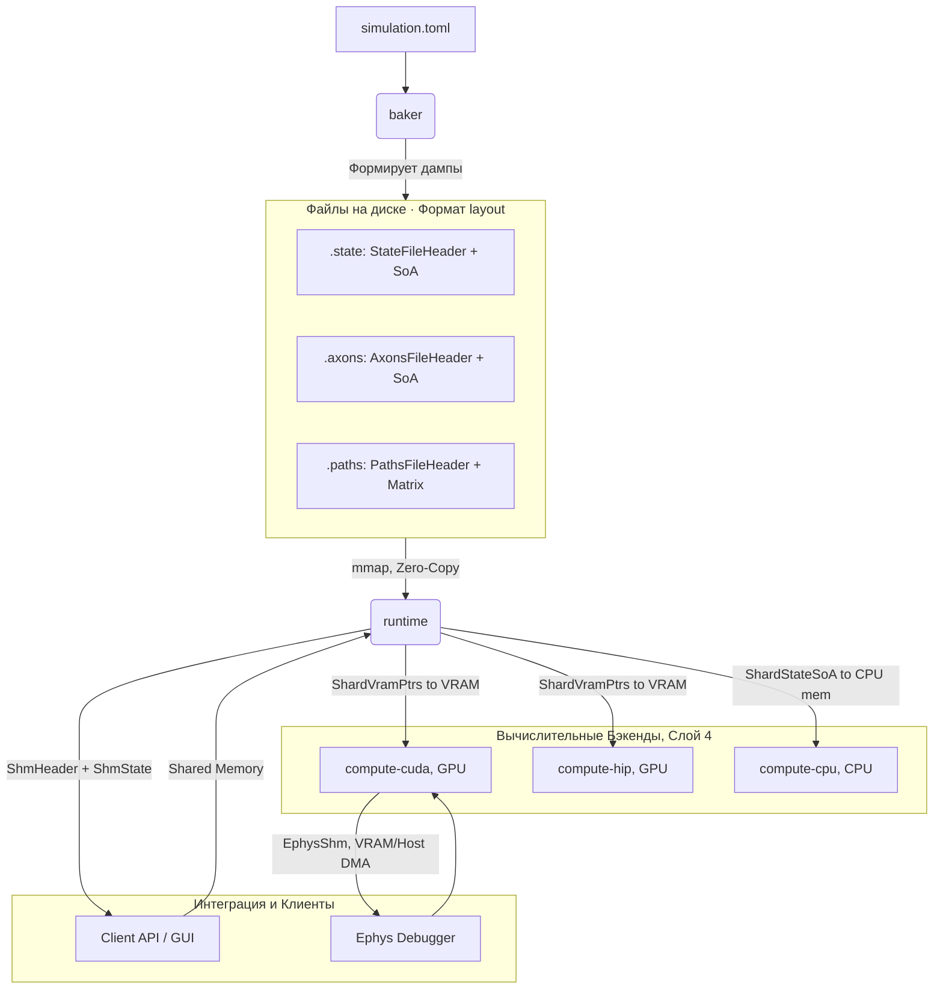

# spec_layout

> Версия спеки: 1.0  
> Дата: 2026-05-28  
> Статус: Approved  

---

## §1. Идентификация

| Поле | Значение |
|------|----------|
| Название | layout |
| Слой | Слой 1 — Контракты Данных |
| Тип | Library (lib) |
| no_std | Строго обязателен (true) |
| Описание | C-ABI контракты памяти, SoA (Structure of Arrays) раскладки и аппаратное выравнивание (Warp Alignment). Крейт содержит исключительно POD (Plain Old Data) структуры с `#[repr(C)]`. Гарантирует абсолютно безопасный Zero-Copy DMA перенос данных между CPU, GPU (CUDA/HIP) и микроконтроллерами (ESP32) без сериализации и десериализации. |

---

## §2. Стек и Окружение

### §2.1. Внутренние зависимости (inbound)

| Крейт | Что используется | Зачем |
|-------|-----------------|-------|
| `types` | `PackedPosition`, `PackedTarget`, `SomaFlags`, `Voltage`, `Weight`, `AxonHead` | Использование фундаментальных 32-битных и 8-битных примитивов для построения C-ABI структур без дублирования типов и без риска нарушения выравнивания памяти. |

### §2.2. Внешние зависимости

| Crate | Версия | Зачем |
|-------|--------|-------|
| `bytemuck` | `=1.25.0`, features=["derive"] | Предоставляет маркерные трейты `Pod` и `Zeroable` для абсолютно безопасного (Zero-Cost) каста сырых байтовых массивов (из VRAM или mmap) в Rust-структуры и обратно. |

### §2.3. Feature Flags

Секция не применима к данному крейту: Feature flags не используются. Крейт собирается в строгом `no_std` окружении по умолчанию.

---

## §3. Инварианты

### §3.1. Структурные инварианты

- **INV-LAYOUT-001**: `size_of::<VariantParameters>() == 64` байта и `align_of::<VariantParameters>() == 64` байта.
  - *Обоснование*: Размер структуры должен быть ровно равен одной кэш-линии L1/L2 для обеспечения идеального Coalesced Access и кэширования в Constant Memory на GPU без эффекта ложного разделения (False Sharing) между потоками.
  - *Следствие нарушения*: Падение производительности GPU-ядер из-за неэффективного использования кэша, возникновение невыровненного доступа, крах C-ABI соглашения с CUDA/HIP.
  - *Где проверяется*: compile-time, статические проверки `const_assert_eq!(size_of::<VariantParameters>(), 64)` и `const_assert_eq!(align_of::<VariantParameters>(), 64)`.

- **INV-LAYOUT-002**: `size_of::<BurstHeads8>() == 32` байта и `align_of::<BurstHeads8>() == 32` байта.
  - *Обоснование*: Гарантирует считывание всех 8 голов распространяющегося сигнала за одну транзакцию L1-кэша и предотвращает аппаратное исключение невыровненного доступа (unaligned access trap) на Xtensa LX7 (ESP32) при векторных операциях.
  - *Следствие нарушения*: Аппаратное прерывание процессора на ESP32 (Crash), падение производительности или Silent Data Corruption в видеопамяти при DMA.
  - *Где проверяется*: compile-time, статические проверки `const_assert_eq!(size_of::<BurstHeads8>(), 32)` и `const_assert_eq!(align_of::<BurstHeads8>(), 32)`.

- **INV-LAYOUT-003**: `size_of::<StateFileHeader>() == 16` байт.
  - *Обоснование*: Строго фиксированный размер заголовка файла `.state` для обеспечения корректности расчета смещений при Zero-Copy mmap.
  - *Следствие нарушения*: Несовместимость файлов состояния, неверный маппинг смещений SoA-массивов, повреждение памяти при чтении.
  - *Где проверяется*: compile-time, `const_assert_eq!(size_of::<StateFileHeader>(), 16)`.

- **INV-LAYOUT-004**: `size_of::<AxonsFileHeader>() == 16` байт.
  - *Обоснование*: Фиксированный размер заголовка файла `.axons`, обеспечивающий 32-битное выравнивание следующего за ним массива `BurstHeads8`.
  - *Следствие нарушения*: Смещение данных аксонов, нарушение 32-байтового выравнивания голов аксонов, паника `FATAL C-ABI BOUNDARY`.
  - *Где проверяется*: compile-time, `const_assert_eq!(size_of::<AxonsFileHeader>(), 16)`.

- **INV-LAYOUT-005**: `size_of::<PathsFileHeader>() == 16` байт.
  - *Обоснование*: Фиксированный размер заголовка файла `.paths`, используемый для проверки метаданных трассировки путей.
  - *Следствие нарушения*: Неверный парсинг матрицы геометрии, сбой выравнивания длин сегментов аксонов.
  - *Где проверяется*: compile-time, `const_assert_eq!(size_of::<PathsFileHeader>(), 16)`.

- **INV-LAYOUT-006**: `size_of::<ShmHeader>() == 128` байт.
  - *Обоснование*: Строгий размер заголовка IPC shared memory для обмена данными в Night Phase.
  - *Следствие нарушения*: Нарушение протокола синхронизации между `runtime` и `daemon`, сдвиг смещений SoA-массивов в разделяемой памяти.
  - *Где проверяется*: compile-time, `const_assert_eq!(size_of::<ShmHeader>(), 128)`.

- **INV-LAYOUT-010**: `size_of::<ShardStateHeader>() == 32` байта и `align_of::<ShardStateHeader>() == 32` байта.
  - *Обоснование*: Гарантирует правильное 32-байтовое выравнивание заголовка снимка состояния (checkpoint) для безопасного mmap и PCIe DMA переноса.
  - *Следствие нарушения*: Сдвиг смещения полезной нагрузки чекпоинта, неопределенное поведение при чтении или записи дампа состояния.
  - *Где проверяется*: compile-time, `const_assert_eq!(size_of::<ShardStateHeader>(), 32)` и `const_assert_eq!(align_of::<ShardStateHeader>(), 32)`.

- **INV-LAYOUT-011**: `size_of::<EphysShm>() == 640192` байт и `align_of::<EphysShm>() == 64` байта.
  - *Обоснование*: Выравнивание структуры отладчика по 64 байтам (L2 Cache Line) исключает cache thrashing при параллельной записи осциллограмм мембранных потенциалов и инъекции токов со стороны GPU.
  - *Следствие нарушения*: Искажение регистрируемых осциллограмм, падение пропускной способности при обращении CUDA/HIP ядер к shared memory.
  - *Где проверяется*: compile-time, `const_assert_eq!(size_of::<EphysShm>(), 640192)` и `const_assert_eq!(align_of::<EphysShm>(), 64)`.

### §3.2. Семантические инварианты

- **INV-LAYOUT-007**: *Инвариант 1166 байт (The 1166-Byte Invariant)*.
  - *Обоснование*: Полный размер состояния одного нейрона в памяти равен сумме состояния сомы (`4 + 1 + 4 + 1 + 4 = 14` байт) и 128 слотов дендритов (`128 * (4 + 4 + 1) = 1152` байт). Итого `14 + 1152 = 1166` байт.
  - *Следствие нарушения*: Silent Data Corruption при записи дампа состояния на диск и чтении на хосте/девайсе из-за нарушения побайтового соответствия.
  - *Где проверяется*: load-time, runtime-проверка размера файла: `state_file_size % 1166 == 0`.

- **INV-LAYOUT-008**: *Инвариант 1025 байт SHM (The 1025-Byte SHM Invariant)*.
  - *Обоснование*: Суммарный объем разделяемой памяти на один нейрон в SHM (без учета заголовка и очередей событий) равен: веса (`128 * 4B = 512B`) + цели (`128 * 4B = 512B`) + флаги сомы (`1B`). Итого `1025` байт. Смещения вычисляются с выравниванием по 64 байтам.
  - *Следствие нарушения*: Несоответствие смещений SoA в shared memory, перезапись данных других областей памяти baker-демоном.
  - *Где проверяется*: runtime, проверки смещений в `ShmHeader::validate()`.

- **INV-LAYOUT-009**: *Инвариант выравнивания варпа и кэш-линии (Warp-Alignment and 64-byte Cache Line rule)*.
  - *Обоснование*: Количество нейронов `padded_n` в шард-состоянии должно быть кратно размеру варпа (32 потока для CUDA, 64 для HIP). Все смещения SoA-массивов в `.state` дампе и SHM округляются до границ 64 байт (размер кэш-линии L2).
  - *Следствие нарушения*: Потеря coalesced memory access на GPU, падение производительности из-за cache thrashing, сбои при вызове `bytemuck::cast_slice` (нарушение выравнивания).
  - *Где проверяется*: load-time/runtime assert: `padded_n % 32 == 0` (или `padded_n % 64 == 0`), и `offset % 64 == 0` для всех SoA-массивов.

### §3.3. Межкрейтовые инварианты

- **INV-CROSS-007**: *Битовое соответствие ShardVramPtrs*.
  - *Участники*: `layout`, `compute-cuda`, `compute-hip`.
  - *Кто владелец проверки*: `layout`.
  - *Обоснование*: Порядок, типы и выравнивание полей в Rust-структуре `ShardVramPtrs` (или `VramState` в крейте `layout`) должны байт-в-байт соответствовать структуре `ShardVramPtrs` в C++/CUDA коде. Любое изменение порядка полей приведет к неверной адресации на GPU.
  - *Следствие нарушения*: Segmentation fault при запуске CUDA/HIP ядер, крах памяти GPU, повреждение данных VRAM.
  - *Где проверяется*: compile-time / load-time, FFI-тесты выравнивания и смещения полей в `test-harness`.

---

## §4. Публичный API

### §4.1. Типы

Крейт предоставляет набор строго выровненных C-ABI структур (POD - Plain Old Data), гарантирующих 100% совместимость при FFI-вызовах к CUDA/HIP ядрам и Zero-Copy маппинге с диска.

| Тип | Категория | Выравнивание (Align) | Семантика и контракты |
|---|---|---|---|
| `VariantParameters` | Struct (POD) | `align(64)` | Профиль поведения нейрона (GLIF и GSOP параметры). Размер строго **64 байта**. Это позволяет массиву из 16 профилей (1024 байта) идеально ложиться в Constant Memory GPU, занимая ровно по одной L1 кэш-линии на тип без ложного разделения (False Sharing). |
| `BurstHeads8` | Struct (POD) | `align(32)` | Сдвиговый регистр голов аксона (8 x `u32`). Размер строго **32 байта** (половина кэш-линии). Гарантирует загрузку состояния всего Active Tail за одну транзакцию памяти. |
| `ShardStateSoA` | Struct | `repr(C)` | Host-side контейнер для инициализации и хранения состояния шарда. Инкапсулирует `Vec` массивы `voltage`, `flags`, `dendrite_targets` и др., гарантируя, что их емкость выровнена по размеру варпа (`padded_n`). |
| `VramState` / `ShardVramPtrs` | Struct (FFI) | `repr(C)` | Коллекция сырых указателей (`*mut`) на массивы внутри GPU VRAM. Используется для Zero-Cost передачи контекста состояния из Rust в C++/CUDA ядра. |
| `StateFileHeader` | Struct (POD) | `repr(C)` (16 байт) | Заголовок бинарного дампа `.state`. Содержит Magic-маркер `GSNS`, версию и размеры (`padded_n`, `total_axons`). |
| `AxonsFileHeader` | Struct (POD) | `repr(C)` (16 байт) | Заголовок бинарного дампа `.axons`. Содержит Magic-маркер `GSAX` и счетчик `total_axons`. |
| `PathsFileHeader` | Struct (POD) | `repr(C)` (16 байт) | Заголовок файла геометрии `.paths`. Содержит Magic-маркер `PATH` и хард-лимит `max_segments` (256). |
| `ShmHeader` | Struct (POD) | `align(64)` | Заголовок разделяемой памяти (POSIX/Windows SHM) для Night Phase IPC. Размер строго **128 байт**. Хранит метаданные и смещения SoA-массивов. |
| `ShmState` | Enum (u8) | `align(1)` | Состояния конечного автомата Night Phase IPC (`Idle`, `NightStart`, `Sprouting`, `NightDone`, `Error`). Размер — **1 байт**. |
| `StateOffsets` | Struct | — | Вспомогательная структура хоста, содержащая вычисленные байтовые смещения SoA-массивов внутри `.state` дампа и разделяемой памяти. |
| `ShardStateHeader` | Struct (POD) | `align(32)` | Заголовок бинарного дампа состояния (checkpoints) для самовосстановления (Self-Healing). Размер строго **32 байта**. Содержит маркер `SNAP` и размер полезной нагрузки. |
| `EphysShm` | Struct (POD) | `align(64)` | Структура разделяемой памяти электрофизиологического отладчика (~640 КБ) для прямой инъекции токов и записи мембранных вольтажей с/на GPU. |

### §4.2. Трейты

Секция не применима к данному крейту: Публичные трейты отсутствуют.

### §4.3. Функции

#### `fn align_to_warp(n: usize) -> usize`

- **Назначение**: Выравнивает переданное число нейронов `n` вверх до ближайшего кратного 64 (размер L2 кэш-линии и размер Wavefront на GPU).
- **Предусловия**: Нет.
- **Постусловия**: Возвращает `aligned_n >= n`, причем `aligned_n % 64 == 0`.
- **Сложность**: O(1) по времени, O(1) по памяти.
- **Паника**: Никогда.
- **Пример**:
  ```rust
  assert_eq!(align_to_warp(100), 128);
  assert_eq!(align_to_warp(64), 64);
  ```

#### `fn calculate_paths_file_size(total_axons: usize) -> usize`

- **Назначение**: Вычисляет точный размер файла `.paths` с учетом 16-байтового заголовка, массива длин и выравнивания матрицы путей по границе 64 байт.
- **Предусловия**: `total_axons <= 0x00FF_FFFF` (лимит 24 бит на ID аксона).
- **Постусловия**: Возвращает суммарный размер файла в байтах.
- **Сложность**: O(1) по времени, O(1) по памяти.
- **Паника**: Никогда.
- **Пример**:
  ```rust
  let size = calculate_paths_file_size(1000);
  assert!(size > 16 + 1000 + 1000 * 256 * 4);
  ```

#### `fn calculate_paths_matrix_offset(total_axons: usize) -> usize`

- **Назначение**: Рассчитывает байтовое смещение начала матрицы путей в файле `.paths` (после заголовка и массива длин путей, выравненное по 64).
- **Предусловия**: `total_axons <= 0x00FF_FFFF`.
- **Постусловия**: Возвращает смещение, кратное 64 байтам.
- **Сложность**: O(1) по времени, O(1) по памяти.
- **Паника**: Никогда.
- **Пример**:
  ```rust
  let offset = calculate_paths_matrix_offset(100);
  assert_eq!(offset % 64, 0);
  ```

#### `fn calculate_state_blob_size(neuron_count: usize) -> (usize, usize)`

- **Назначение**: Вычисляет выравненное по варпу количество нейронов (`padded_n`) и суммарный размер `.state` блоба в байтах с учетом 64-байтового выравнивания каждого из 8 SoA-массивов.
- **Предусловия**: Нет.
- **Постусловия**: Возвращает кортеж `(padded_n, total_bytes)`.
- **Сложность**: O(1) по времени, O(1) по памяти.
- **Паника**: Никогда.
- **Пример**:
  ```rust
  let (padded_n, total_bytes) = calculate_state_blob_size(100);
  assert_eq!(padded_n, 128);
  assert!(total_bytes > 0);
  ```

#### `fn compute_state_offsets(padded_n: usize) -> StateOffsets`

- **Назначение**: Рассчитывает индивидуальные смещения в байтах для всех SoA-массивов внутри `.state` дампа или shared memory (все смещения выровнены по 64 байтам).
- **Предусловия**: `padded_n % 32 == 0` (или `padded_n % 64 == 0`).
- **Постусловия**: Возвращает заполненную структуру `StateOffsets`.
- **Сложность**: O(1) по времени, O(1) по памяти.
- **Паника**: При нарушении выравнивания в debug-сборке.
- **Пример**:
  ```rust
  let offsets = compute_state_offsets(128);
  assert_eq!(offsets.soma_voltage % 64, 0);
  assert_eq!(offsets.dendrite_targets % 64, 0);
  ```

#### `fn columnar_idx(padded_n: usize, neuron_idx: usize, slot: usize) -> usize`

- **Назначение**: Рассчитывает плоский Dense Index одномерного SoA-массива дендритов для заданного нейрона и слота входа.
- **Предусловия**: `neuron_idx < padded_n` и `slot < 128` (или `MAX_DENDRITES`).
- **Постусловия**: Возвращает плоский индекс `flat_idx = slot * padded_n + neuron_idx`.
- **Сложность**: O(1) по времени, O(1) по памяти.
- **Паника**: Если `neuron_idx >= padded_n` или `slot >= 128` (проверяется через `assert!` или `debug_assert!`).
- **Пример**:
  ```rust
  let idx = columnar_idx(1024, 5, 1);
  assert_eq!(idx, 1029); // 1 * 1024 + 5
  ```

#### `fn shm_size(padded_n: usize) -> usize`

- **Назначение**: Рассчитывает полный размер разделяемой памяти (IPC SHM) в байтах с учетом заголовка `ShmHeader`, SoA-массивов, очередей событий передачи/удаления аксонов и аппаратного выравнивания страниц ОС (4096 байт).
- **Предусловия**: `padded_n % 32 == 0` (или `padded_n % 64 == 0`).
- **Постусловия**: Возвращает размер в байтах, кратный 4096.
- **Сложность**: O(1) по времени, O(1) по памяти.
- **Паника**: Никогда.
- **Пример**:
  ```rust
  let size = shm_size(1024);
  assert_eq!(size % 4096, 0);
  ```

### §4.4. Константы и Магические Числа

| Константа | Значение | Тип | Семантика |
|-----------|----------|-----|-----------|
| `MAX_DENDRITES` | `128` | `usize` | Аппаратный жесткий лимит количества дендритных входов на один нейрон. |
| `PATHS_MAGIC` | `0x50415448` | `u32` | Магическое число файла трассировки путей `.paths` (ASCII-код "PATH"). |
| `MAX_SEGMENTS_PER_AXON` | `256` | `usize` | Максимальная длина пути одного аксона в сегментах. |
| `SHM_MAGIC` | `0x41584943` | `u32` | Магическое число shared memory сегмента Night Phase (ASCII-код "AXIC"). |
| `SHM_VERSION` | `4` | `u8` | Текущая версия протокола Night Phase IPC (v4), включающая синхронизацию электрического состояния нейронов. |
| `EPHYS_MAGIC` | `0x45504859` | `u32` | Магическое число shared memory отладчика электрофизиологии (ASCII-код "EPHY"). |
| `SNAP_MAGIC` | `0x50414E53` | `u32` | Магическое число заголовка снимка состояния (ASCII-код "SNAP"). |
| `STATE_MAGIC` | `0x534E5347` | `u32` | Магическое число заголовка файла состояния `.state` (ASCII-код "GSNS"). |
| `AXONS_MAGIC` | `0x58415347` | `u32` | Магическое число заголовка файла аксонов `.axons` (ASCII-код "GSAX"). |
| `MAX_HANDOVERS_PER_NIGHT` | `10000` | `usize` | Максимальный размер очереди событий передачи аксонов в shared memory за одну ночь. |
| `MAX_PRUNES_PER_NIGHT` | `10000` | `usize` | Максимальный размер очереди событий обрезки синапсов в shared memory за одну ночь. |
| `AXON_HANDOVER_EVENT_SIZE` | `20` | `usize` | Размер структуры `AxonHandoverEvent` в байтах (C-ABI). |
| `AXON_HANDOVER_PRUNE_SIZE` | `12` | `usize` | Размер структуры `AxonHandoverPrune` в байтах (C-ABI). |
| `MAX_EPHYS_TARGETS` | `16` | `usize` | Максимальное количество одновременно регистрируемых/инъецируемых нейронов в отладчике. |
| `MAX_EPHYS_TICKS` | `10000` | `usize` | Длина буфера записи осциллограмм мембранных потенциалов (в тиках симуляции). |

---

## §5. Доменная Логика

Физическая раскладка структур данных в памяти (Memory Layout) и на диске. Крейт содержит исключительно POD-структуры с гарантированным C-ABI (`#[repr(C)]`) и правила вычисления адресов в SoA-массивах.

Выделение макетов памяти в отдельный контрактный крейт Слоя 1 изолирует физическое представление данных от вычислительных ядер (Слой 3) и сетевых контрактов (Слой 2). Это гарантирует, что хост-процесс, GPU-вычислитель, сетевой стек и файлы состояния на диске оперируют абсолютно идентичными смещениями байтов.

Крейт решает проблему накладных расходов при передаче гигабайтов состояния сети нейронов между CPU, VRAM видеокарты и диском. Фиксация выравнивания SoA-структур под размер GPU-варпа (32/64 потока) и кэш-линии (64 байта) позволяет выполнять мгновенный zero-copy перенос данных (DMA/mmap) без рантайм-десериализации и с максимальной аппаратной скоростью доступа.

---

## §6. Алгоритмы и Формулы

### §6.1. Колончатое транспонирование дендритных массивов (Columnar Transposition Index)

**Вход**:
- `padded_n: usize` — выравненное по размеру варпа количество нейронов шарда (безразмерное).
- `neuron_idx: usize` — локальный индекс нейрона (`0 <= neuron_idx < padded_n`, безразмерный).
- `slot: usize` — индекс дендритного слота (`0 <= slot < 128`, безразмерный).

**Выход**:
- `flat_idx: usize` — плоский индекс в SoA-массиве дендритных параметров (безразмерный).

**Детерминизм**: Да.

**Формула / Псевдокод:**

```math
\text{flat\_idx} = \text{slot} \cdot N_{\text{padded}} + I_{\text{neuron}}
```

```rust
// Псевдокод
fn columnar_idx(padded_n: usize, neuron_idx: usize, slot: usize) -> usize {
    slot * padded_n + neuron_idx
}
```

**Численный пример:**

| Вход (`padded_n`, `neuron_idx`, `slot`) | Ожидаемый выход | Комментарий |
|:---|:---|:---|
| `(1024, 5, 1)` | `1029` | Слот 1, нейрон 5, при ширине 1024 |
| `(64, 0, 2)` | `128` | Слот 2, нейрон 0, при ширине 64 |

---

### §6.2. Выравнивание размера варпа (Warp Size Alignment)

**Вход**:
- `n: usize` — исходное количество нейронов (безразмерное).

**Выход**:
- `aligned_n: usize` — выравненное количество нейронов (безразмерное).

**Детерминизм**: Да.

**Формула / Псевдокод:**

```math
\text{aligned\_n} = \lceil n / 64 \rceil \cdot 64
```

```rust
// Псевдокод
fn align_to_warp(n: usize) -> usize {
    (n + 63) & !63
}
```

**Численный пример:**

| Вход (`n`) | Ожидаемый выход | Комментарий |
|:---|:---|:---|
| `100` | `128` | Округление вверх до кратного 64 |
| `64` | `64` | Уже кратно 64 |

---

### §6.3. Расчет смещений SoA-массивов (SoA Memory Offsets)

**Вход**:
- `padded_n: usize` — выравненное количество нейронов (безразмерное).

**Выход**:
- Смещения в байтах для каждого SoA-массива в `.state` бинарном дампе и shared memory.

**Детерминизм**: Да.

**Формула / Псевдокод:**

Каждое последующее смещение вычисляется на основе предыдущего с округлением вверх до границы 64 байт (размер кэш-линии L2):

```math
\text{offset}_k = (\text{offset}_{k-1} + \text{size}_{k-1} + 63) \ \& \ \sim 63
```

```rust
// Псевдокод
fn align_offset(offset: usize) -> usize {
    (offset + 63) & !63
}

fn compute_state_offsets(padded_n: usize) -> StateOffsets {
    let mut current = 0;
    
    let soma_voltage = current;
    current = align_offset(current + padded_n * 4); // i32
    
    let flags = current;
    current = align_offset(current + padded_n * 1); // u8
    
    let threshold_offset = current;
    current = align_offset(current + padded_n * 4); // i32
    
    let timers = current;
    current = align_offset(current + padded_n * 1); // u8
    
    let soma_to_axon = current;
    current = align_offset(current + padded_n * 4); // u32
    
    let dendrite_targets = current;
    current = align_offset(current + padded_n * 128 * 4); // u32 (PackedTarget)
    
    let dendrite_weights = current;
    current = align_offset(current + padded_n * 128 * 4); // i32 (Mass Domain)
    
    let dendrite_timers = current;
    current = align_offset(current + padded_n * 128 * 1); // u8
    
    StateOffsets {
        soma_voltage,
        flags,
        threshold_offset,
        timers,
        soma_to_axon,
        dendrite_targets,
        dendrite_weights,
        dendrite_timers,
        total_size: current,
    }
}
```

---

### §6.4. Расчет размера и смещений файла геометрии (Paths File Size and Offsets)

**Вход**:
- `total_axons: usize` — общее количество аксонов (безразмерное).

**Выход**:
- `matrix_offset: usize` — смещение начала матрицы путей (в байтах).
- `file_size: usize` — общий размер файла `.paths` (в байтах).

**Детерминизм**: Да.

**Формула / Псевдокод:**

Размер заголовка составляет 16 байт (`PathsFileHeader`). За ним следует массив длин путей `path_lengths` размером `total_axons` байт (каждый элемент `u8`). Смещение матрицы путей выравнивается по границе 64 байт. Сама матрица представляет собой плоский массив размером `total_axons * 256 * 4` байт (каждая запись — 32-битный `PackedPosition`).

```math
\text{matrix\_offset} = (\text{sizeof(PathsFileHeader)} + N_{\text{axons}} \cdot \text{sizeof(u8)} + 63) \ \& \ \sim 63
```
```math
\text{file\_size} = \text{matrix\_offset} + N_{\text{axons}} \cdot 256 \cdot \text{sizeof(PackedPosition)}
```

```rust
// Псевдокод
fn calculate_paths_matrix_offset(total_axons: usize) -> usize {
    let header_and_lengths = 16 + total_axons;
    (header_and_lengths + 63) & !63
}

fn calculate_paths_file_size(total_axons: usize) -> usize {
    let matrix_offset = calculate_paths_matrix_offset(total_axons);
    matrix_offset + total_axons * 256 * 4
}
```

**Численный пример:**

| Вход (`total_axons`) | Ожидаемый `matrix_offset` | Ожидаемый `file_size` | Комментарий |
|:---|:---|:---|:---|
| `1000` | `1024` | `1025024` | `16 + 1000 = 1016` -> выравнивание до `1024` |
| `0` | `64` | `64` | Минимальный вырожденный случай |

---

### §6.5. Расчет размера разделяемой памяти (Shared Memory Size calculation)

**Вход**:
- `padded_n: usize` — выравненное количество нейронов (безразмерное).

**Выход**:
- `shm_size: usize` — полный размер сегмента SHM в байтах.

**Детерминизм**: Да.

**Формула / Псевдокод:**

Размер сегмента разделяемой памяти рассчитывается как сумма размера заголовка `ShmHeader` (128 байт), SoA-массивов (веса, цели, флаги, вольтаж, пороги, таймеры) с выравниванием массивов флагов и таймеров по 64 байтам, и очередей событий `AxonHandoverEvent` и `AxonHandoverPrune`. Финальный размер округляется вверх до границы страницы виртуальной памяти ОС (4096 байт).

```math
\text{total\_bytes} = 128 + (N_{\text{padded}} \cdot 128 \cdot 4) + (N_{\text{padded}} \cdot 128 \cdot 4) + (10000 \cdot 20) + (10000 \cdot 12) + \text{align}_{64}(N_{\text{padded}}) + (N_{\text{padded}} \cdot 4) + (N_{\text{padded}} \cdot 4) + \text{align}_{64}(N_{\text{padded}})
```
```math
\text{shm\_size} = (\text{total\_bytes} + 4095) \ \& \ \sim 4095
```

```rust
// Псевдокод
fn shm_size(padded_n: usize) -> usize {
    let weights_bytes = padded_n * 128 * 4;
    let targets_bytes = padded_n * 128 * 4;
    let handovers_bytes = 10000 * 20; // MAX_HANDOVERS_PER_NIGHT * AXON_HANDOVER_EVENT_SIZE
    let prunes_bytes = 10000 * 12;    // MAX_PRUNES_PER_NIGHT * AXON_HANDOVER_PRUNE_SIZE
    let flags_bytes = (padded_n + 63) & !63;
    let voltage_bytes = padded_n * 4;
    let threshold_bytes = padded_n * 4;
    let timers_bytes = (padded_n + 63) & !63;

    let total_bytes = 128
        + weights_bytes
        + targets_bytes
        + handovers_bytes
        + prunes_bytes
        + flags_bytes
        + voltage_bytes
        + threshold_bytes
        + timers_bytes;

    (total_bytes + 4095) & !4095
}
```

**Численный пример:**

| Вход (`padded_n`) | Ожидаемый выход | Комментарий |
|:---|:---|:---|
| `1024` | `1380352` | Размер сегмента с учетом заголовков, SoA-массивов, очередей событий и округления до 4 KB |

---

## §7. Структуры Данных и Memory Layout

### §7.1. VariantParameters

**Размер**: 64 байта, **Alignment**: 64 байта.

```text
Offset  Size  Field                           Type     Описание
──────  ────  ─────                           ────     ────────
0x00    4     threshold                       i32      Мембранный порог спайка
0x04    4     rest_potential                  i32      Потенциал мембраны в покое
0x08    4     leak_shift                      u32      Сдвиг утечки мембранного потенциала
0x0C    4     homeostasis_penalty             i32      Штраф за спайк (гомеостаз)
0x10    4     spontaneous_firing_period_ticks u32      Период спонтанной генерации спайков
0x14    2     initial_synapse_weight          u16      Стартовый вес нового синапса
0x16    2     gsop_potentiation               u16      Шаг LTP (потенциация веса)
0x18    2     gsop_depression                 u16      Шаг LTD (депрессия веса)
0x1A    2     homeostasis_decay               u16      Затухание штрафа гомеостаза
0x1C    1     refractory_period               u8       Период абсолютной рефрактерности
0x1D    1     synapse_refractory_period       u8       Период рефрактерности синапса
0x1E    1     signal_propagation_length       u8       Длина распространения сигнала в сегментах
0x1F    1     is_inhibitory                   u8       Флаг тормозного синапса (1=GABA, 0=Glu)
0x20    8     inertia_curve                   [u8; 8]  Коэффициенты инерции пластичности
0x28    2     ahp_amplitude                   u16      Амплитуда гиперполяризации сомы
0x2A    6     _pad                            [u8; 6]  Выравнивание до 48 байт
0x30    4     adaptive_leak_min_shift         i32      Минимальный сдвиг адаптивной утечки
0x34    2     adaptive_leak_gain              u16      Множитель адаптивной утечки
0x36    1     adaptive_mode                   u8       Режим адаптивной утечки (1/0)
0x37    3     _leak_pad                       [u8; 3]  Выравнивание до 58 байт
0x3A    1     d1_affinity                     u8       Чувствительность дофамина D1
0x3B    1     d2_affinity                     u8       Чувствительность дофамина D2
0x3C    4     heartbeat_m                     u32      Коэффициент DDS Heartbeat
──────  ────  ─────                           ────     ────────
Total: 64 bytes
```

### §7.2. BurstHeads8

**Размер**: 32 байта, **Alignment**: 32 байта.

```text
Offset  Size  Field              Type     Описание
──────  ────  ─────              ────     ────────
0x00    4     h0                 u32      Сдвиговый регистр: голова 0
0x04    4     h1                 u32      Сдвиговый регистр: голова 1
0x08    4     h2                 u32      Сдвиговый регистр: голова 2
0x0C    4     h3                 u32      Сдвиговый регистр: голова 3
0x10    4     h4                 u32      Сдвиговый регистр: голова 4
0x14    4     h5                 u32      Сдвиговый регистр: голова 5
0x18    4     h6                 u32      Сдвиговый регистр: голова 6
0x1C    4     h7                 u32      Сдвиговый регистр: голова 7
──────  ────  ─────              ────     ────────
Total: 32 bytes
```

### §7.3. ShmHeader

**Размер**: 128 байт, **Alignment**: 64 байта.

```text
Offset  Size  Field                    Type        Описание
──────  ────  ─────                    ────        ────────
0x00    4     magic                    u32         Магическое число `0x41584943` ("AXIC")
0x04    1     version                  u8          Версия протокола SHM (4)
0x05    1     state                    u8          Состояние автомата `ShmState`
0x06    2     _pad                     u16         Выравнивание
0x08    4     padded_n                 u32         Число нейронов, выровненное по варпу
0x0C    4     dendrite_slots           u32         Количество дендритных слотов (128)
0x10    4     weights_offset           u32         Смещение массива весов дендритов (байт)
0x14    4     targets_offset           u32         Смещение массива целей дендритов (байт)
0x18    8     epoch                    u64         Текущая эпоха симуляции (BSP Epoch)
0x20    4     total_axons              u32         Количество аксонов (Local + Ghost + Virtual)
0x24    4     handovers_offset         u32         Смещение очереди `AxonHandoverEvent`
0x28    4     handovers_count          u32         Количество событий в очереди handovers
0x2C    4     zone_hash                u32         FNV-1a хэш имени зоны
0x30    4     prunes_offset            u32         Смещение очереди `AxonHandoverPrune`
0x34    4     prunes_count             u32         Количество исходящих событий prunes
0x38    4     incoming_prunes_count    u32         Количество входящих событий prunes
0x3C    4     flags_offset             u32         Смещение массива `flags` нейронов
0x40    4     voltage_offset           u32         Смещение массива `voltage` нейронов
0x44    4     threshold_offset_offset  u32         Смещение массива `threshold_offset` нейронов
0x48    4     timers_offset            u32         Смещение массива `refractory_timer` нейронов
0x4C    52    _reserved                [u32; 13]   Резервные байты (Stricly 13 элементов)
──────  ────  ─────                    ────        ────────
Total: 128 bytes
```

### §7.4. Заголовки бинарных файлов дампа

#### StateFileHeader (.state)
**Размер**: 16 байт, **Alignment**: 4 байта.
```text
Offset  Size  Field              Type     Описание
──────  ────  ─────              ────     ────────
0x00    4     magic              [u8; 4]  Магические байты `"GSNS"`
0x04    4     version            u32      Версия формата (1)
0x08    4     padded_n           u32      Выравненное количество нейронов
0x0C    4     total_axons        u32      Общее количество аксонов
──────  ────  ─────              ────     ────────
Total: 16 bytes
```

#### AxonsFileHeader (.axons)
**Размер**: 16 байт, **Alignment**: 4 байта.
```text
Offset  Size  Field              Type     Описание
──────  ────  ─────              ────     ────────
0x00    4     magic              [u8; 4]  Магические байты `"GSAX"`
0x04    4     version            u32      Версия формата (1)
0x08    4     total_axons        u32      Общее количество аксонов
0x0C    4     _padding           u32      Выравнивание до 16 байт
──────  ────  ─────              ────     ────────
Total: 16 bytes
```

#### PathsFileHeader (.paths)
**Размер**: 16 байт, **Alignment**: 4 байта.
```text
Offset  Size  Field              Type     Описание
──────  ────  ─────              ────     ────────
0x00    4     magic              u32      Магическое число `0x50415448` ("PATH")
0x04    4     version            u32      Версия формата (1)
0x08    4     total_axons        u32      Общее количество аксонов
0x0C    4     max_segments       u32      Максимальное количество сегментов (256)
──────  ────  ─────              ────     ────────
Total: 16 bytes
```

#### ShardStateHeader (Snapshot Header)
**Размер**: 32 байта, **Alignment**: 32 байта.
```text
Offset  Size  Field              Type        Описание
──────  ────  ─────              ────        ────────
0x00    4     magic              u32         Магическое число `0x50414E53` ("SNAP")
0x04    4     zone_hash          u32         FNV-1a хэш имени зоны
0x08    4     tick               u32         Симуляционный тик чекпоинта
0x0C    4     _padding1          u32         Выравнивание до 16 байт
0x10    8     payload_size       u64         Смещение/размер полезной нагрузки в байтах
0x18    8     _padding2          [u64; 1]    Выравнивание структуры до 32 байт
──────  ────  ─────              ────        ────────
Total: 32 bytes
```

### §7.5. Бинарная раскладка .state (SoA State Dump)

После заголовка `StateFileHeader` файлы `.state` содержат 8 SoA массивов, записанных последовательно. Смещение начала каждого массива выравнивается по границе 64 байт для PCIe DMA совместимости.

```text
Порядок массивов в .state файле (после StateFileHeader):
1. voltage           [padded_n] × i32
2. flags             [padded_n] × u8
3. threshold_offset  [padded_n] × i32
4. timers            [padded_n] × u8
5. soma_to_axon      [padded_n] × u32
6. dendrite_targets  [128 * padded_n] × u32 (types::PackedTarget)
7. dendrite_weights  [128 * padded_n] × i32 (веса в Mass Domain)
8. dendrite_timers   [128 * padded_n] × u8
```

Формула расчета смещения для массива `K` от начала SoA Payload:
`offset_k = (offset_prev + size_prev + 63) & !63`

### §7.6. EphysShm (Electrophysiology Shared Memory)

**Размер**: 640192 байт, **Alignment**: 64 байта.

```text
Offset    Size    Field             Type                Описание
──────    ────    ─────             ────                ────────
0x0000    4       magic             u32                 Магическое число `0x45504859` ("EPHY")
0x0004    4       state             u32                 Автомат дебага (0=Idle, 1=Trigger, 2=Busy, 3=Done)
0x0008    4       count             u32                 Количество зарегистрированных спайков
0x000C    4       max_ticks         u32                 Предел записываемых тиков (10 000)
0x0010    4       current_tick      u32                 Текущий тик записи осциллограммы
0x0014    44      _pad              [u32; 11]           Выравнивание заголовка до 64 байт
0x0040    64      target_tids       [u32; 16]           Dense ID целевых нейронов для записи/инъекции
0x0080    64      injection_uv      [i32; 16]           Инъекционные токи (мкВ) для каждого из 16 нейронов
0x00C0    640000  out_trace         [i32; 16 * 10000]   Матрица записанных потенциалов мембраны
──────    ────    ─────             ────                ────────
Total: 640192 bytes
```

---

## §8. Граничные Случаи и Особые Сценарии

### §8.1. Граничные значения

| # | Ситуация | Ожидаемое поведение |
|---|----------|-------------------|
| E-012 | `padded_n == 0` | `calculate_state_blob_size` возвращает `(0, 0)`. Попытка аллокации или маппинга отсекается на уровне вызывающего с ошибкой `CAbiBoundaryError::InvalidSize`. |
| E-013 | Невыровненный указатель mmap хоста (`addr % 64 != 0`) | При вызове `bytemuck::cast_slice` немедленный `panic!` с префиксом `FATAL C-ABI BOUNDARY`. Предотвращает unaligned access на CPU и некорректный PCIe DMA на GPU. |
| E-014 | Размер `.state` файла не совпадает с расчётным `calculate_state_blob_size` | Загрузка отменяется с ошибкой `CAbiBoundaryError::SizeMismatch { expected, actual }`. Стратегия восстановления — ответственность вызывающего (`runtime` / `boot`). |
| E-015 | `total_axons == 0` | `calculate_paths_file_size` возвращает минимальный размер 16 байт (только заголовок `PathsFileHeader`). Система работает корректно. |

### §8.2. Состояния гонки и конкурентность

| # | Сценарий | Контракт `layout` |
|---|----------|------------------|
| R-001 | Конкурентный доступ к Night Phase IPC через поле `state` в `ShmHeader` | Крейт `layout` определяет POD-поле `state: u8` и enum `ShmState` (`Idle / NightStart / Sprouting / NightDone`). Контракт Single-Writer: в каждый момент времени ровно один участник записывает в это поле. Реализация атомарного доступа (барьеры памяти, `fence`, `compare_exchange`) — ответственность крейта `ipc` (Слой 2). |

### §8.3. Деградация и Recovery

| # | Отказ | Поведение |
|---|-------|-----------|
| D-001 | Нарушение выравнивания адреса при `bytemuck::cast_slice` | Немедленный `panic!` с префиксом `FATAL C-ABI BOUNDARY`. Невосстановимое нарушение C-ABI контракта. Повторная загрузка и восстановление — ответственность вызывающего. |

---

## §9. Ошибки

### §9.1. Перечисление ошибок

```rust
pub enum CAbiBoundaryError {
    /// Неверный размер или нулевые габариты padded_n / total_axons
    InvalidSize,
    /// Несоответствие фактического размера блоба ожидаемому расчетному значению
    SizeMismatch {
        expected: usize,
        actual: usize,
    },
    /// Нарушение выравнивания адреса в памяти
    AlignmentViolation {
        expected_align: usize,
        actual_addr: usize,
    },
    /// Ошибка файлового ввода-вывода или сбой mmap
    IOError(String),
}
```

### §9.2. Стратегия обработки

| Ошибка | Восстановимая? | Рекомендация вызывающему |
|--------|---------------|------------------------|
| `CAbiBoundaryError::InvalidSize` | Нет | Проверить конфигурацию `manifest.toml` / `shard.toml` и перезапустить процесс. |
| `CAbiBoundaryError::SizeMismatch` | Нет | Файл поврежден или записан старой версией Baker. Требуется полный ребейк топологии. |
| `CAbiBoundaryError::AlignmentViolation` | Нет | Критическая системная ошибка. Проверить распределение памяти OS page или выравнивание кучи. |
| `CAbiBoundaryError::IOError` | Да | Повторить чтение, если файл заблокирован, иначе завершить работу. |

### §9.3. Паники

| Условие | Почему паника, а не Err |
|---------|--------------------------|
| `address % 4096 != 0` при `mmap` | **FATAL C-ABI BOUNDARY**: Выделенный адрес страницы ОС не кратен 4 KB. Невосстановимое нарушение контракта Zero-Copy. Дальнейшие операции приведут к невыровненному доступу и падению шины. |
| `offset % soa_align != 0` для полей | **FATAL C-ABI BOUNDARY**: Смещение SoA-массива нарушает его индивидуальное выравнивание. Означает баг генератора Baker, грозит повреждением данных. |
| `padded_n % 32 != 0` | Нарушение выравнивания по размеру варпа. Аппаратное ограничение GPU SIMT выполнения. |

---

## §10. Зависимости и Интеграция

### §10.1. Что крейт потребляет (inbound)

| Крейт-источник | Что используем | Какой контракт ожидаем |
|---------------|---------------|----------------------|
| `types` | `SomaFlags`, `PackedPosition`, `PackedTarget`, `Voltage`, `Weight`, `AxonHead` | Атомарные типы C-ABI без внутренних дыр и паддингов для построения POD-структур. |
| `bytemuck` | Маркерные трейты `Pod` и `Zeroable` | Безопасные касты байтовых массивов к Rust-структурам в `no_std` окружении. |

### §10.2. Кто потребляет крейт (outbound / обратные зависимости)

| Крейт-потребитель | Что использует | Какой контракт мы обязаны сохранить |
|------------------|---------------|-----------------------------------|
| `compute-cuda` | `ShardVramPtrs`, `VariantParameters`, `BurstHeads8` | Порядок полей и байтовое выравнивание структур должны в точности соответствовать C++/CUDA-ядрам. |
| `compute-hip` | `ShardVramPtrs`, `VariantParameters`, `BurstHeads8` | Порядок полей и байтовое выравнивание структур должны в точности соответствовать C++/HIP-ядрам. |
| `compute-cpu` | `ShardStateSoA`, `VariantParameters`, `BurstHeads8` | Корректность адресации данных при симуляции на CPU. |
| `baker` | `ShardStateSoA`, заголовки дампов | Корректный расчет смещений SoA-массивов при записи и чтении файлов `.state`, `.axons` и `.paths`. |
| `ipc` | `ShmHeader`, `ShmState` | Размер `ShmHeader` строго равен 128 байтам, семантика состояний `ShmState` стабильна. |
| `runtime` | `ShardStateSoA`, `StateOffsets`, `VramState` | Координация жизненного цикла симуляции, аллокация VRAM на основе смещений SoA и маппинг файлов. |

### §10.3. Диаграмма взаимодействия

Крейт `layout` служит общим контрактом данных (Data Schema) для всех фаз жизненного цикла симуляции — от AOT-компиляции графа сети (Connectome Baking) до исполнения симуляции на GPU/CPU и обмена телеметрией через Shared Memory.



---

## §11. Стратегия Тестирования

### §11.1. Юнит-тесты

| Тест | Что проверяет | Связанный инвариант / Граничный случай |
|------|--------------|-------------------|
| `test_variant_parameters_layout` | Размер `VariantParameters` равен 64, выравнивание равно 64. | INV-LAYOUT-001 |
| `test_burst_heads_layout` | Размер `BurstHeads8` равен 32, выравнивание равно 32. | INV-LAYOUT-002 |
| `test_state_file_header_layout` | Размер `StateFileHeader` равен 16, magic-поле равно `"GSNS"`. | INV-LAYOUT-003 |
| `test_axons_file_header_layout` | Размер `AxonsFileHeader` равен 16, magic-поле равно `"GSAX"`. | INV-LAYOUT-004 |
| `test_paths_file_header_layout` | Размер `PathsFileHeader` равен 16, magic-поле равно `"PATH"`. | INV-LAYOUT-005 |
| `test_shm_header_layout` | Размер `ShmHeader` равен 128, magic-поле равно `"AXIC"`. | INV-LAYOUT-006 |
| `test_shard_state_header_layout` | Размер `ShardStateHeader` равен 32, выравнивание равно 32, magic-поле равно `"SNAP"`. | INV-LAYOUT-010 |
| `test_ephys_shm_layout` | Размер `EphysShm` равен 640192, выравнивание равно 64, magic-поле равно `"EPHY"`. | INV-LAYOUT-011 |
| `test_state_offset_calculations` | Расчет `compute_state_offsets` гарантирует выравнивание всех смещений по 64 байтам. | INV-LAYOUT-009 |
| `test_columnar_idx` | Соответствие формулы `columnar_idx` ручному расчету смещений по столбцам. | — |
| `test_calculate_state_blob_size_zero` | Проверка того, что `calculate_state_blob_size(0)` возвращает `(0, 0)`. | E-012 |
| `test_calculate_paths_file_size_zero` | Проверка того, что `calculate_paths_file_size(0)` возвращает минимальный размер `16` байт. | E-015 |

### §11.2. Property-based тесты

Секция не применима к данному крейту: Для структур данных и memory layout достаточно юнит-тестов и статических проверок размеров типов.

### §11.3. Интеграционные тесты

| Тест | Крейты-участники | Сценарий | Связанный инвариант / Граничный случай |
|------|-----------------|---------|-------------------|
| `test_vram_ptrs_alignment` | `layout` + `compute-cuda` / `compute-hip` | Сверка смещений полей `ShardVramPtrs` на CPU и GPU на побайтовое соответствие. | INV-CROSS-007 |
| `test_state_file_roundtrip` | `layout` + `baker` | Запись и восстановление полной SoA-структуры в файл `.state` с валидацией инварианта 1166 байт. | INV-LAYOUT-007 |
| `test_shm_size_validation` | `layout` + `ipc` | Валидация выравнивания shared memory регионов и проверка инварианта 1025 байт. | INV-LAYOUT-008 |
| `test_unaligned_mmap_cast_panic` | `layout` + `bytemuck` | Попытка выполнить `bytemuck::cast_slice` на невыровненном по 64 байтам хост-указателе. Ожидается немедленная паника с префиксом `FATAL C-ABI BOUNDARY`. | E-013, D-001 |
| `test_state_file_size_mismatch` | `layout` + `baker` / `runtime` | Загрузка файла `.state` с размером, не соответствующим ожидаемому, и проверка возврата ошибки `CAbiBoundaryError::SizeMismatch`. | E-014 |

### §11.4. Тесты производительности

Секция не применима к данному крейту: Крейт не выполняет вычислений в рантайме.

---

## §12. Бюджеты и Ограничения

### §12.1. Память

| Ресурс | Бюджет | Как считается |
|--------|--------|-------------|
| Динамическая память (`no_std`) | **0 байт (Zero Allocation)** | Использование кучи (`Vec`, `Box`, `Arc` и т.д.) в режиме сборки `no_std` строжайше запрещено. Все операции кастинга производятся по ссылке (Zero-Copy). |
| Динамическая память (Host) | На усмотрение хоста | Разрешена только внутри `ShardStateSoA` для AOT-парсинга и подготовки графов на хост-процессе. |
| Память видеокарты (VRAM) | `padded_n * 1166 + total_axons * 32` байт | Сумма плоской раскладки состояния SoA и массива аксонов с учетом 64-байтового выравнивания каждого из SoA-массивов. |

### §12.2. Латентность

Секция не применима к данному крейту: Вычисления в рантайме отсутствуют.

### §12.3. Compile-time

| Ограничение | Значение |
|------------|---------|
| Время сборки крейта (release) | < 10 секунд (минимальный набор внешних зависимостей, отсутствие процедурных макросов). |

---

## Checklist Полноты (A.3)

- ✅ Все публичные типы описаны в §4 (добавлены `ShmHeader`, `ShmState`, `StateOffsets` и др.).
- ✅ Все инварианты из §3 имеют соответствующий пункт в §11 (все `INV-LAYOUT` и `INV-CROSS` покрыты юнит- и интеграционными тестами).
- ✅ Все Err-варианты перечислены в §9 (определен `CAbiBoundaryError` и таксономия ошибок).
- ✅ Все крейты-потребители перечислены в §10.2 (указаны контракты для `compute`, `baker`, `ipc` и `runtime`).
- ✅ Нет ни одного «магического числа» без объяснения (все константы вынесены и задокументированы в §4.4).
- ✅ Все формулы имеют единицы измерения (размеры в байтах, смещения в байтах, емкости в нейронах/аксонах).
- ✅ Граничные случаи из §8 покрыты тестами в §11 (проверки невыровненных mmap адресов и некорректных размеров файлов тестируются в интеграционных тестах).
