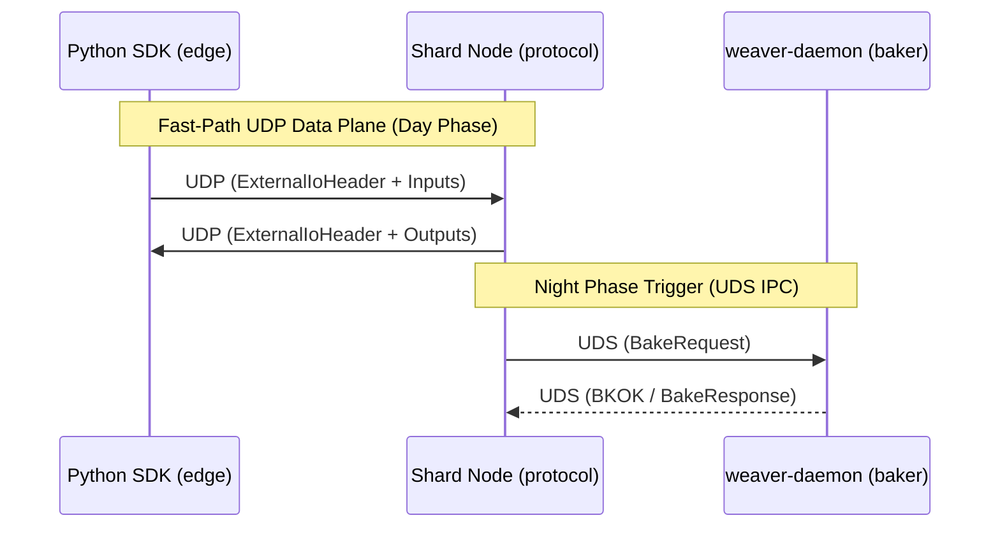

# spec_wire

> Версия спеки: 1.0
> Дата: 2026-05-29
> Статус: Approved

---

## §1. Идентификация

| Поле | Значение |
|---|---|
| **Имя крейта** | `wire` |
| **Слой** | 1 — Data Contracts |
| **Тип** | `lib` + `build.rs` (SDK-генератор) |
| **`no_std`** | Да (обязательно; bare-metal и MCU совместимость) |
| **Одно предложение** | C-ABI структуры сетевого протокола и заголовков файлов симуляции с zero-allocation сериализацией и кодогенерацией Python SDK через `build.rs`. |

---

## §2. Стек и Окружение

### §2.1. Внутренние зависимости (inbound)

| Крейт | Что используется | Зачем |
|---|---|---|
| `types` | Базовые packed типы | Использование фундаментальных типов и физических квантов при построении C-ABI структур пакетов. |
| `layout` | C-ABI константы и параметры выравнивания | Обеспечение совместимости сетевых форматов с раскладкой памяти VRAM и гарантия безопасного каста. |

### §2.2. Внешние зависимости

| Крейт | Версия | Зачем |
|---|---|---|
| `bytemuck` | `=1.25.0`, `features = ["derive"]` | Zero-copy приведение `&[u8]` к строго типизированным C-ABI структурам без накладных расходов на десериализацию. Версия жёстко привязана к `workspace Cargo.toml`. |

### §2.3. Feature Flags

Секция не применима к данному крейту: Feature flags не используются.

---

## §3. Инварианты

Крейт `wire` гарантирует соблюдение 3 фундаментальных инвариантов, обеспечивающих сетевую безопасность, отсутствие Silent Data Corruption и строгую синхронизацию с SDK.

### §3.1. Структурные инварианты

- **INV-WIRE-001**: C-ABI совместимость и строгий размер структур. Все публичные структуры обязаны иметь атрибут `#[repr(C)]` или `#[repr(packed)]`, а их размеры должны быть жестко зафиксированы.
  - *Обоснование*: Любая неопределенность в выравнивании полей (struct padding) компилятором Rust приведет к Silent Data Corruption при обмене данными между GPU-ядрами, CPU-хостом и внешними клиентами (Python SDK, C++ плагины).
  - *Следствие нарушения*: Смещение байтов, чтение мусора вместо валидных координат/флагов, падение рантайма или непредсказуемое поведение симуляции.
  - *Где проверяется*: compile-time, макросы `const_assert_eq!` или `static_assertions::assert_eq_size!`.

- **INV-WIRE-002**: Безопасный zero-copy cast. Все сетевые и дисковые заголовки должны реализовывать трейты `bytemuck::Pod` и `bytemuck::Zeroable`.
  - *Обоснование*: Любая промежуточная копия памяти или аллокация в горячем цикле сетевой трансляции спайков снижает пропускную способность шины и увеличивает p99 латентность.
  - *Следствие нарушения*: Снижение производительности сетевого стека, аллокации на куче в критическом пути исполнения.
  - *Где проверяется*: compile-time автопроверка компилятором через derive-макросы `bytemuck`.

### §3.2. Семантические инварианты

- **INV-WIRE-003**: Строгая бинарная синхронизация с SDK. Генератор `build.rs` обязан автоматически транслировать бинарный макет всех `#[repr(C)]` структур в Python-модуль `contract_generated.py` при любой сборке крейта.
  - *Обоснование*: Предотвращает человеческий фактор и ошибки ручного копирования бинарных смещений полей в SDK на стороне Python.
  - *Следствие нарушения*: Рассинхронизация полей, Silent Data Corruption при парсинге отчетов, телеметрии или файлов манифестов внешними инструментами анализа.
  - *Где проверяется*: Автоматическая компиляция и проверка генерации в `build.rs` при сборке проекта.

### §3.3. Межкрейтовые инварианты

Секция не применима к данному крейту: Крейт является автономным декларатором бинарных контрактов и не зависит от рантайм-состояний других компонентов.

---

### §4.1. Типы (Types)

Все типы крейта `wire` обязаны реализовывать трейты `bytemuck::Pod` и `bytemuck::Zeroable` для безопасного O(1) приведения из байтовых буферов (`&[u8]`).

#### Домен 1: Fast-Path UDP (Spike Sync)
*   **`SpikeBatchHeaderV2`**
    *   **Размер / Выравнивание**: 16 байт / `align(16)`.
    *   **Поля**: `magic` ([u8; 4] = "SPK2"), `src_zone_hash` (u32), `dst_zone_hash` (u32), `epoch` (u32), `chunk_idx` (u16), `total_chunks` (u16).
    *   **Семантика**: Заголовок L7-фрагментированного батча спайков. `chunk_idx` == 0xFFFF означает ACK пакет.
*   **`SpikeEventV2`**
    *   **Размер / Выравнивание**: 8 байт / `align(8)`.
    *   **Поля**: `ghost_id` (u32 — прямой индекс в VRAM получателя), `tick_offset` (u32).
    *   **Семантика**: Единичный спайк внутри батча. Массив этих структур следует сразу за заголовком.
*   **`SpikeBatchHeader` (Legacy V1)**
    *   **Размер / Выравнивание**: 8 байт / `align(4)`.
    *   **Поля**: `magic` ([u8; 4] = "SPIK"), `batch_id` (u32).
    *   **Семантика**: Устаревший заголовок нефрагментированного пакета спайков. Сохранен для обратной совместимости C-ABI.
*   **`SpikeEvent` (Legacy V1)**
    *   **Размер / Выравнивание**: 8 байт / `align(8)`.
    *   **Поля**: `ghost_axon_id` (u32), `tick_offset` (u32).
    *   **Семантика**: Устаревшее событие спайка. Сохранено для обратной совместимости C-ABI.

#### Домен 2: Внешний I/O (Сенсоры, Моторы, R-STDP)
*   **`ExternalIoHeader`**
    *   **Размер / Выравнивание**: 20 байт / `align(4)`.
    *   **Поля**: `magic` ([u8; 4] = "GSIO" или "GSOO"), `zone_hash` (u32), `matrix_hash` (u32), `payload_size` (u32), `global_reward` (i16), `_padding` (u16).
    *   **Семантика**: Заголовок пакета среды. `payload_size` строго равен размеру прикрепленной битовой маски или дампа.
*   **`ControlPacket`**
    *   **Размер / Выравнивание**: 8 байт / `align(8)`.
    *   **Поля**: `magic` ([u8; 4] = "DOPA"), `dopamine` (i16), `_pad` (u16).
    *   **Семантика**: Пакет инъекции глобального дофамина (R-STDP) без передачи I/O данных.

#### Домен 3: Slow-Path TCP & Routing (Межзональная Топология)
*   **`GhostConnection`**
    *   **Размер / Выравнивание**: 8 байт / `align(8)`.
    *   **Поля**: `src_soma_id` (u32), `target_ghost_id` (u32).
    *   **Семантика**: Связь между сомой-источником и Ghost-аксоном.
*   **`AxonHandoverEvent`**
    *   **Размер / Выравнивание**: 20 байт / `align(4)`.
    *   **Поля**: `origin_zone_hash` (u32), `local_axon_id` (u32), `entry_x` (u16), `entry_y` (u16), `vector_x` (i8), `vector_y` (i8), `vector_z` (i8), `type_mask` (u8), `remaining_length` (u16), `entry_z` (u8), `_padding` (u8).
    *   **Семантика**: Событие динамической передачи растущего аксона при пересечении границы шарда (Night Phase).
*   **`AxonHandoverPrune`**
    *   **Размер / Выравнивание**: 12 байт / `align(4)`.
    *   **Поля**: `target_zone_hash` (u32), `receiver_zone_hash` (u32), `dst_ghost_id` (u32).
    *   **Семантика**: Удаление мертвой Ghost-связи.
*   **`AxonHandoverAck`**
    *   **Размер / Выравнивание**: 16 байт / `align(4)`.
    *   **Поля**: `target_zone_hash` (u32), `receiver_zone_hash` (u32), `src_axon_id` (u32), `dst_ghost_id` (u32).
    *   **Семантика**: Ответное подтверждение создания Ghost-аксона для O(1) обновления таблиц маршрутизации на стороне отправителя.
*   **`RouteUpdate`**
    *   **Размер / Выравнивание**: 24 байт / `align(8)`.
    *   **Поля**: `magic` ([u8; 4] = "ROUT"), `zone_hash` (u32), `new_ipv4` (u32), `new_port` (u16), `mtu` (u16), `cluster_secret` (u64).
    *   **Семантика**: RCU-обновление таблицы маршрутизации (Dynamic MTU) при миграции или воскрешении шарда.
*   **`GeometryRequest` & `GeometryResponse`**
    *   **Семантика**: Rust-специфичные `enum` (bincode сериализация), оборачивающие передачу батчей `AxonHandoverEvent` и `AxonHandoverPrune` по TCP.

#### Домен 4: Телеметрия (WebSocket)
*   **`TelemetryFrameHeader`**
    *   **Размер / Выравнивание**: 16 байт / `align(8)`.
    *   **Поля**: `magic` ([u8; 4] = "TELE"), `tick` (u64), `count` (u32).
    *   **Семантика**: Заголовок бинарного WebSocket-фрейма. За ним следует плоский массив `[u32; count]` из Dense ID спайкнувших нейронов.

#### Домен 5: Заголовки Файлов Запекания (Baking Artifacts)
*   **`GxiHeader`**
    *   **Размер**: 32 байта.
    *   **Поля**: `magic` ([u8; 4] = "GXI\0"), `zone_hash` (u32), `matrix_hash` (u32), `input_count` (u32), `total_pixels` (u32), `_padding` ([u32; 3]).
*   **`GxoHeader`**
    *   **Размер**: 32 байта.
    *   **Поля**: `magic` ([u8; 4] = "GXO\0"), `zone_hash` (u32), `matrix_hash` (u32), `output_count` (u32), `_padding` ([u32; 4]).
*   **`GxiMatrixDescriptor`**
    *   **Размер**: 16 байт.
    *   **Поля**: `name_hash` (u32), `offset` (u32), `width` (u16), `height` (u16), `stride` (u8), `_padding` ([u8; 3]).
    *   **Семантика**: Описание метаданных и VRAM-смещения одной входной матрицы в файле `.gxi`.
*   **`GxoMatrixDescriptor`**
    *   **Размер**: 16 байт.
    *   **Поля**: `name_hash` (u32), `offset` (u32), `width` (u16), `height` (u16), `stride` (u8), `_padding` ([u8; 3]).
    *   **Семантика**: Описание метаданных и VRAM-смещения одной выходной матрицы в файле `.gxo`.
*   **`GhostsHeader`**
    *   **Размер**: 16 байт.
    *   **Поля**: `magic` ([u8; 4] = "GHST"), `from_zone_hash` (u32), `to_zone_hash` (u32), `connection_count` (u32).
*   **`GxoMatrixDescriptor`**
    *   **Размер / Выравнивание**: 16 байт / `align(4)`.
    *   **Поля**: `name_hash` (u32), `offset` (u32), `width` (u16), `height` (u16), `stride` (u8), `_padding` ([u8; 3]).
    *   **Семантика**: Дескриптор конкретной выходной матрицы внутри файла `.gxo`. Указывает смещение (`offset`) в глобальном массиве сомы, с которого начинаются пиксели данной матрицы. Критично для демультиплексирования данных на стороне Python SDK.

#### Домен 6: UDS IPC (Night Phase Trigger)
*   **`BakeRequest`**
    *   **Размер / Выравнивание**: 16 байт / `align(4)`.
    *   **Поля**: `magic` ([u8; 4] = "BAKE"), `zone_hash` (u32), `current_tick` (u32), `prune_threshold` (i16), `max_sprouts` (u16).
    *   **Семантика**: Легковесный бинарный триггер для пробуждения `weaver-daemon` через Unix Domain Sockets.

### §4.2. Трейты

Секция не применима к данному крейту: Крейт является чистым C-ABI контрактом данных и не экспортирует абстрактные трейты.

### §4.3. Функции (Functions)

Крейт `wire` предоставляет исключительно zero-cost утилиты для кастинга памяти (обертки над `bytemuck`):
*   `fn as_bytes(&self) -> &[u8]` — приведение заголовка к массиву байт за $O(1)$.
*   `fn slice_as_bytes(slice: &[Self]) -> &[u8]` — приведение массива структур (например, `SpikeEventV2`) к байтам для пакетной сетевой отправки.
*   `fn from_bytes(buf: &[u8]) -> Result<&Self, WireError>` — безопасное приведение сырого сетевого буфера к ссылке на структуру (с проверкой длины и выравнивания).
*   `fn slice_from_bytes(buf: &[u8]) -> Result<&[Self], WireError>` — безопасное приведение буфера к массиву структур.

### §4.4. Константы и Магические Числа

| Константа | Значение | Тип | Семантика |
|-----------|----------|-----|-----------|
| `SPK2_MAGIC` | `0x324B5053` (`b"SPK2"`) | `u32` | Магическое число fast-path UDP спайкового пакета V2 |
| `GSIO_MAGIC` | `0x4F495347` (`b"GSIO"`) | `u32` | Магическое число пакета внешнего ввода (Sensors) |
| `GSOO_MAGIC` | `0x4F4F5347` (`b"GSOO"`) | `u32` | Магическое число пакета внешнего вывода (Motors) |
| `DOPA_MAGIC` | `0x41504F44` (`b"DOPA"`) | `u32` | Магическое число пакета глобального дофамина (R-STDP Control) |
| `ROUT_MAGIC` | `0x54554F52` (`b"ROUT"`) | `u32` | Магическое число пакета RCU-обновления маршрутизации |
| `TELE_MAGIC` | `0x454C4554` (`b"TELE"`) | `u32` | Магическое число фрейма телеметрии спайков (WebSocket) |
| `SPIK_MAGIC` | `0x5350494B` (`b"SPIK"`) | `u32` | Магическое число нефрагментированного спайкового пакета V1 (Legacy V1) |
| `GXI_MAGIC`  | `0x00495847` (`b"GXI\0"`) | `u32` | Магическое число файла зонной инициализации (Geom-Zone-Input) |
| `GXO_MAGIC`  | `0x004F5847` (`b"GXO\0"`) | `u32` | Магическое число файла зонного вывода (Geom-Zone-Output) |
| `GHST_MAGIC` | `0x54534847` (`b"GHST"`) | `u32` | Магическое число файла связей Ghost-аксонов (Ghosts) |
| `BAKE_MAGIC` | `0x42414B45` (`b"BAKE"`) | `u32` | Магическое число триггера фазы запекания (BakeRequest) |
| `BAKE_READY_MAGIC` | `0x424B4F4B` (`b"BKOK"`) | `u32` | Магическое число подтверждения успешного запекания |
| `MAX_UDP_PAYLOAD` | `65507` | `usize` | Максимально допустимый размер UDP-пакета (MTU-лимит для Desktop/Server). Пакеты, превышающие этот размер, требуют L7-фрагментации или отбрасываются. Используется для преаллокации Egress Pool. |

---

## §5. Доменная Логика

Единый бинарный протокол обмена данными и структуры сетевых контрактов (C-ABI) для взаимодействия между узлами симуляции, IPC-демонами и внешними SDK.

Крейт служит единым источником правды для сетевого и межпроцессного протокола. Его выделение изолирует структуру сообщений от логики их передачи (сетевых сокетов, UDP-стека) и кодогенерации SDK, предотвращая рассинхронизацию форматов между Rust и Python.

Крейт решает проблему задержек при передаче миллионов событий симуляции (спайков, телеметрии, команд управления). Фиксация Little-Endian формата и выравнивания под целевые архитектуры (x86/ARM/ESP32) позволяет передавать и считывать данные без процессороемкой сериализации, копирования в куче или перестановки байтов.

---

## §6. Алгоритмы и Формулы

В связи со спецификой крейта (Data Contracts), сложные вычислительные алгоритмы отсутствуют. Логика сводится к расчету смещений, фрагментации и безопасной трансляции памяти.

### §6.1. Трансляция AST в Python struct макеты (Кодогенерация)

**Вход**: Файлы исходного кода `src/*.rs` с AST-представлением Rust структур.
**Выход**: Текстовый файл Python модуля `contract_generated.py` со строковыми форматами библиотеки `struct` (например, `<I Q I`).
**Детерминизм**: Да.

**Псевдокод алгоритма (build.rs):**
```rust
fn generate_python_contracts() {
    let files = list_rust_files("src/");
    let mut out = String::new();
    for file in files {
        let structs = parse_c_repr_structs(file);
        for s in structs {
            let py_format = translate_to_python_format(&s.fields);
            // Жесткая фиксация Little-Endian ('<' в Python struct)
            out.push_str(&format!("class {}:\n    FORMAT = '<{}'\n", s.name, py_format));
        }
    }
    write_file("contract_generated.py", out);
}
```

### §6.2. Расчет L7-Фрагментации (MTU Chunking)

Вход: `total_spikes` (общее число спайков в батче), `MAX_UDP_PAYLOAD` (лимит MTU). Выход: Количество пакетов `total_chunks`. Детерминизм: Да.

Максимальное количество спайков, помещающихся в один UDP-пакет, вычисляется исходя из размера заголовка `SpikeBatchHeaderV2`:

```math
N_{max} = \lfloor \frac{MAX\_UDP\_PAYLOAD - sizeof(SpikeBatchHeaderV2)}{sizeof(SpikeEventV2)} \rfloor
```

Общее количество чанков (пакетов) для передачи всего батча:

```math
total\_chunks = \lceil \frac{total\_spikes}{N_{max}} \rceil
```

### §6.3. O(1) Zero-Copy Cast (Безопасное приведение)

Вход: Сырой сетевой или дисковый буфер `payload: &[u8]`. Выход: Типизированный срез `&[SpikeEventV2]` (или другой структуры) либо ошибка `WireError`.

Алгоритм: Аппаратное приведение типов (через `bytemuck`) без копирования в куче требует двух жестких математических проверок:

1. **Проверка длины**: `payload.len() % sizeof(TargetStruct) == 0`. Буфер не должен содержать оборванных байтов в конце.
2. **Проверка выравнивания**: `payload.as_ptr() as usize % align_of(TargetStruct) == 0`. Начальный адрес памяти буфера должен быть аппаратно выровнен, иначе процессор (особенно на ARM/ESP32) сгенерирует аппаратное исключение (Unaligned Access).

---

## §7. Структуры Данных и Memory Layout

### §7.1. SpikeBatchHeaderV2 Layout

**1. `SpikeBatchHeaderV2` (16 байт)**
Заголовок фрагментированного батча спайков по UDP.
| Offset | Size | Field | Type |
|---|---|---|---|
| 0x00 | 4 | `src_zone_hash` | `u32` |
| 0x04 | 4 | `dst_zone_hash` | `u32` |
| 0x08 | 4 | `epoch` | `u32` |
| 0x0C | 2 | `chunk_idx` | `u16` |
| 0x0E | 2 | `total_chunks` | `u16` |

**2. `SpikeEventV2` (8 байт)**
| Offset | Size | Field | Type |
|---|---|---|---|
| 0x00 | 4 | `ghost_id` | `u32` |
| 0x04 | 4 | `tick_offset` | `u32` |

**3. `SpikeBatchHeader` (Legacy V1, 8 байт)**
Устаревший заголовок нефрагментированного спайкового пакета.
| Offset | Size | Field | Type |
|---|---|---|---|
| 0x00 | 4 | `magic` | `[u8; 4]` |
| 0x04 | 4 | `batch_id` | `u32` |

**4. `SpikeEvent` (Legacy V1, 8 байт)**
Устаревшая структура единичного спайка.
| Offset | Size | Field | Type |
|---|---|---|---|
| 0x00 | 4 | `ghost_axon_id` | `u32` |
| 0x04 | 4 | `tick_offset` | `u32` |

**5. `ExternalIoHeader` (20 байт)**
Заголовок I/O для сенсоров и моторов.
| Offset | Size | Field | Type |
|---|---|---|---|
| 0x00 | 4 | `magic` | `[u8; 4]` |
| 0x04 | 4 | `zone_hash` | `u32` |
| 0x08 | 4 | `matrix_hash` | `u32` |
| 0x0C | 4 | `payload_size` | `u32` |
| 0x10 | 2 | `global_reward` | `i16` |
| 0x12 | 2 | `_padding` | `u16` |

**6. `ControlPacket` (8 байт)**
Инъекция дофамина.
| Offset | Size | Field | Type |
|---|---|---|---|
| 0x00 | 4 | `magic` | `[u8; 4]` |
| 0x04 | 2 | `dopamine` | `i16` |
| 0x06 | 2 | `_pad` | `u16` |

**7. `TelemetryFrameHeader` (16 байт)**
| Offset | Size | Field | Type |
|---|---|---|---|
| 0x00 | 4 | `magic` | `[u8; 4]` |
| 0x04 | 4 | `tick` | `u32` |
| 0x08 | 4 | `spikes_count` | `u32` |
| 0x0C | 4 | `_padding` | `u32` |

**6. `RouteUpdate` (24 байта)**
| Offset | Size | Field | Type |
|---|---|---|---|
| 0x00 | 4 | `magic` | `[u8; 4]` |
| 0x04 | 4 | `zone_hash` | `u32` |
| 0x08 | 4 | `new_ipv4` | `u32` |
| 0x0C | 2 | `new_port` | `u16` |
| 0x0E | 2 | `mtu` | `u16` |
| 0x10 | 8 | `cluster_secret`| `u64` |

### §7.2. Геометрия и Маршрутизация (Slow-Path)

**1. `AxonHandoverEvent` (20 байт)**
| Offset | Size | Field | Type |
|---|---|---|---|
| 0x00 | 4 | `origin_zone_hash`| `u32` |
| 0x04 | 4 | `local_axon_id` | `u32` |
| 0x08 | 2 | `entry_x` | `u16` |
| 0x0A | 2 | `entry_y` | `u16` |
| 0x0C | 1 | `vector_x` | `i8` |
| 0x0D | 1 | `vector_y` | `i8` |
| 0x0E | 1 | `vector_z` | `i8` |
| 0x0F | 1 | `type_mask` | `u8` |
| 0x10 | 2 | `remaining_length`| `u16` |
| 0x12 | 1 | `entry_z` | `u8` |
| 0x13 | 1 | `_padding` | `u8` |

**2. `AxonHandoverAck` (16 байт)**
| Offset | Size | Field | Type |
|---|---|---|---|
| 0x00 | 4 | `target_zone_hash`| `u32` |
| 0x04 | 4 | `receiver_zone_hash`| `u32` |
| 0x08 | 4 | `src_axon_id` | `u32` |
| 0x0C | 4 | `dst_ghost_id` | `u32` |

**3. `AxonHandoverPrune` (12 байт)**
| Offset | Size | Field | Type |
|---|---|---|---|
| 0x00 | 4 | `target_zone_hash`| `u32` |
| 0x04 | 4 | `receiver_zone_hash`| `u32` |
| 0x08 | 4 | `dst_ghost_id` | `u32` |

**4. `GhostConnection` (8 байт)**
| Offset | Size | Field | Type |
|---|---|---|---|
| 0x00 | 4 | `src_soma_id` | `u32` |
| 0x04 | 4 | `target_ghost_id` | `u32` |

**5. `BakeRequest` (UDS IPC, 16 байт)**
| Offset | Size | Field | Type |
|---|---|---|---|
| 0x00 | 4 | `magic` | `[u8; 4]` |
| 0x04 | 4 | `zone_hash` | `u32` |
| 0x08 | 4 | `current_tick` | `u32` |
| 0x0C | 2 | `prune_threshold` | `i16` |
| 0x0E | 2 | `max_sprouts` | `u16` |

### §7.3. Заголовки Файлов Запекания

**1. `GxiHeader` (32 байта)**
| Offset | Size | Field | Type |
|---|---|---|---|
| 0x00 | 4 | `magic` | `[u8; 4]` |
| 0x04 | 4 | `zone_hash` | `u32` |
| 0x08 | 4 | `matrix_hash` | `u32` |
| 0x0C | 4 | `input_count` | `u32` |
| 0x10 | 4 | `total_pixels` | `u32` |
| 0x14 | 12| `_padding` | `[u32; 3]` |

**2. `GxoHeader` (32 байта)**
| Offset | Size | Field | Type |
|---|---|---|---|
| 0x00 | 4 | `magic` | `[u8; 4]` |
| 0x04 | 4 | `zone_hash` | `u32` |
| 0x08 | 4 | `matrix_hash` | `u32` |
| 0x0C | 4 | `output_count` | `u32` |
| 0x10 | 16| `_padding` | `[u32; 4]` |

**3. `GxiMatrixDescriptor` (16 байт)**
| Offset | Size | Field | Type |
|---|---|---|---|
| 0x00 | 4 | `name_hash` | `u32` |
| 0x04 | 4 | `offset` | `u32` |
| 0x08 | 2 | `width` | `u16` |
| 0x0A | 2 | `height` | `u16` |
| 0x0C | 1 | `stride` | `u8` |
| 0x0D | 3 | `_padding` | `[u8; 3]` |

**4. `GxoMatrixDescriptor` (16 байт)**
| Offset | Size | Field | Type |
|---|---|---|---|
| 0x00 | 4 | `name_hash` | `u32` |
| 0x04 | 4 | `offset` | `u32` |
| 0x08 | 2 | `width` | `u16` |
| 0x0A | 2 | `height` | `u16` |
| 0x0C | 1 | `stride` | `u8` |
| 0x0D | 3 | `_padding` | `[u8; 3]` |

**5. `GhostsHeader` (16 байт)**
| Offset | Size | Field | Type |
|---|---|---|---|
| 0x00 | 4 | `magic` | `[u8; 4]` |
| 0x04 | 4 | `from_zone_hash` | `u32` |
| 0x08 | 4 | `to_zone_hash` | `u32` |
| 0x0C | 4 | `connection_count` | `u32` |

---

## §8. Граничные Случаи и Особые Сценарии

Поскольку крейт `wire` оперирует сырым сетевым трафиком, он является первой линией защиты (Hardware Firewall). Основной инвариант для всех граничных случаев: **Zero Panic**. Парсинг недоверенных буферов никогда не должен приводить к крашу процесса.

### §8.1. Граничные значения

| # | Ситуация | Ожидаемое поведение |
|---|----------|-------------------|
| E-021 | **Несовпадение магического числа (Unknown Magic Number)**: Получен сетевой пакет с неизвестным идентификатором (например, шум на UDP-порту). | Безопасное игнорирование (O(1) Drop). Пакет отклоняется без дальнейшего парсинга и аллокаций. Возвращается `WireError::InvalidMagic`. |
| E-022 | **Невыровненный буфер (Unaligned Buffer Cast)**: Попытка скастовать `&[u8]` из сетевого сокета к структуре с `align(8)` или `align(16)`, когда стартовый адрес смещен. | В отличие от крейта `layout` (где это вызывает панику), сетевой стек **не паникует**. Возвращается `WireError::AlignmentMismatch`. Вызывающий код обязан скопировать данные в выровненный буфер на стеке и повторить каст. |
| E-023 | **Обрезанный пакет (Truncated Packet)**: Длина сырого `&[u8]` буфера меньше, чем `size_of::<Header>()`. | Мгновенный возврат `WireError::BufferTooSmall`. Предотвращает чтение за границами памяти (Out-of-Bounds Read). |
| E-024 | **Несовпадение заявленного размера (Payload Size Mismatch)**: Поле `payload_size` в `ExternalIoHeader` не совпадает с реальной длиной хвоста UDP пакета. | Пакет отклоняется (Drop). Это защита от Buffer Over-read and Silent Data Corruption при обработке сенсорных входов со стороны внешних агентов. |
| E-025 | **Превышение MTU сети (Oversized Payload)**: Суммарный размер массива `SpikeEventV2` превышает `MAX_UDP_PAYLOAD` (65507 байт). | Сетевой маршрутизатор (крейт `net`) перехватывает этот случай до сериализации и нарезает массив на чанки (L7-фрагментация), используя формулы из §6.2. В самом `wire` лимит не проверяется, он предоставляет только структуру заголовка для фрагментации. |
| E-026 | **Сбой кодогенератора `build.rs` при сборке**: Ошибка в макросах `decl_wire!` или `decl_wire_list!`, приводящая к падению компиляции Rust. | Безопасность процесса не нарушена. Сборка прерывается до стадии `libstd` и линковки, предотвращая выпуск битого крейта в продакшн. |
| E-027 | **Переполнение смещения дескриптора (Descriptor Offset Overflow)**: Произведение `width * height * stride` или сумма `offset + size` приводят к переполнению `u32::MAX` при расчете границ буфера. | Безопасное отклонение с возвратом `WireError::BufferTooSmall` или `WireError::ValidationError` вместо паники или чтения за границами памяти (Out-of-Bounds Read). |
| E-028 | **Некорректный индекс или лимит чанка (L7 Fragmentation Index OOB)**: В заголовке `SpikeBatchHeaderV2` пришел `chunk_idx >= total_chunks` или заявлено аномально высокое `total_chunks` для DoS-атаки (выделение буфера сборщика). | Пакет отбрасывается рантаймом с ошибкой. Для предотвращения DoS-атаки pre-allocation лимитируется максимальной емкостью буфера (`ghost_capacity`). |

### §8.2. Состояния гонки и конкурентность

Секция не применима к данному крейту: Крейт является stateless декларатором бинарных форматов.

### §8.3. Деградация и Recovery

Секция не применима к данному крейту: Крейт не имеет рантайм-логики управления отказами.

---

## §9. Ошибки

### §9.1. Перечисление ошибок

```rust
#[derive(Debug)]
pub enum WireError {
    /// Неверный бинарный идентификатор (magic number)
    InvalidMagic { expected: [u8; 4], actual: [u8; 4] },
    /// Недостаточный размер буфера для кастинга структуры
    BufferTooSmall { expected: usize, actual: usize },
    /// Ошибка выравнивания памяти буфера
    AlignmentMismatch,
    /// Несовпадение версии формата
    VersionMismatch { expected: u32, actual: u32 },
    /// Ошибки семантической валидации (переполнение смещений, кривой payload_size)
    ValidationError(String),
}
```

### §9.2. Стратегия обработки

| Ошибка | Восстановимая? | Рекомендация вызывающему |
|--------|---------------|------------------------|
| `InvalidMagic` | Нет | Игнорировать пакет / прервать чтение файла. |
| `BufferTooSmall` | Нет | Отбросить пакет как поврежденный. |
| `AlignmentMismatch` | Да | Скопировать буфер во временный выровненный буфер на стеке и повторить каст. |
| `VersionMismatch` | Нет | Прервать загрузку симуляции. |
| `ValidationError` | Нет | Отбросить пакет как поврежденный/злонамеренный (Drop). |

### §9.3. Паники

| Условие | Почему паника, а не `Err` |
|---------|--------------------------|
| — | Функции крейта полностью исключают паники и всегда возвращают `Result`. |

---

## §10. Зависимости и Интеграция

### §10.1. Что крейт потребляет (inbound)

| Крейт-источник | Что используем | Какой контракт ожидаем |
|---|---|---|
| `types` | `PackedPosition` | Стабильная бинарная раскладка (10-10-8-4): извлечение X, Y, Z, Type за O(1) сдвигами без аллокаций. |
| `layout` | C-ABI константы | Стабильное выравнивание структур (`align(4)`, `align(8)`, `align(16)`) для zero-copy DMA хоста. |

### §10.2. Кто потребляет крейт (outbound / обратные зависимости)

| Крейт-потребитель | Что использует | Какой контракт мы обязаны сохранить |
|---|---|---|
| `baker` | Заголовки `.gxi`/`.gxo`/`.ghosts` | Сохранение структуры файлов запекания для прямой загрузки в VRAM без парсинга. |
| `edge` (Python SDK) | Сгенерированный макет | Точное совпадение смещений и размеров полей (C-ABI) через ctypes маппинг. |
| `protocol` (Fast-Path) | `SpikeBatchHeaderV2`, `ExternalIoHeader` | Бинарная совместимость для O(1) сетевой сериализации/десериализации без аллокаций в горячем цикле. |
| `weaver-daemon` | `BakeRequest` | Сохранение структуры IPC-сообщений для корректного переключения фаз симуляции по UDS. |

### §10.3. Диаграмма взаимодействия



---

## §11. Стратегия Тестирования

### §11.1. Юнит-тесты

| Тест | Что проверяет | Связанный инвариант |
|---|---|---|
| `test_spike_batch_header_size` | Проверка `size_of::<SpikeBatchHeaderV2>() == 16` | INV-WIRE-001 |
| `test_spike_event_size` | Проверка `size_of::<SpikeEventV2>() == 8` | INV-WIRE-001 |
| `test_external_io_header_size` | Проверка `size_of::<ExternalIoHeader>() == 20` | INV-WIRE-001 |
| `test_bytemuck_cast_roundtrip` | Проверка zero-copy кастинга туда-обратно без потерь | INV-WIRE-002 |
| `test_python_codegen_output` | Проверка корректности структуры сгенерированного `.py` контракта | INV-WIRE-003 |
| `test_invalid_magic_error` | Возврат `WireError::InvalidMagic` при неверном magic-поле в пакете | E-021 |
| `test_unaligned_cast_error` | Возврат `WireError::AlignmentMismatch` при невыровненном кастинге | E-022 |
| `test_truncated_buffer_error` | Возврат `WireError::BufferTooSmall` при недостаточной длине буфера | E-023 |
| `test_external_io_payload_size` | Сравнение `payload_size` с фактическим размером UDP буфера | E-024 |
| `test_net_l7_fragmentation_split` | Разделение спайковых пакетов по лимиту MTU перед отправкой | E-025 |
| `test_codegen_compilation_failure` | Остановка компиляции при синтаксической ошибке в build.rs | E-026 |
| `test_descriptor_bounds_overflow` | Безопасное отклонение с ошибкой при переполнении `offset + size` | E-027 |
| `test_l7_reassembly_oob_check` | Игнорирование пакетов с `chunk_idx >= total_chunks` и ограничение емкости | E-028 |

---

## §12. Бюджеты и Ограничения

### §12.1. Память (Memory Footprint)

| Ресурс | Бюджет | Как считается / Примечание |
|---|---|---|
| Динамическая аллокация в рантайме | 0 байт | Все преобразования через `bytemuck` не задействуют кучу (heap). |
| Размер сгенерированного SDK | < 100 KB | Файл `contract_generated.py` не должен вызывать задержек при импорте. |
| Ограничение на время сборки | < 5s | Время выполнения `build.rs` в release режиме. |

### §12.2. Латентность (Latency)

| Операция | Бюджет (p99) | Условия |
|---|---|---|
| Zero-copy приведение (Cast) | < 100 ns | На одно сообщение/пакет, x86/ARM CPU. |
| Кодогенерация при сборке | < 1s | Время генерации AST парсером в `build.rs`. |

### §12.3. Сетевые ограничения (MTU Bounds)

| Ограничение | Значение | Описание |
|---|---|---|
| Максимальный размер чанка (Desktop) | 65507 байт | Лимит `MAX_UDP_PAYLOAD` во избежание фрагментации IP-стека ОС. |
| Максимальный размер чанка (ESP32) | 1400 байт | Сетевой лимит для MCU (предотвращение переполнения LWIP). |

---

## Приложение A — Глоссарий

| Термин | Определение |
|--------|-----------|
| Zero-Copy | Метод передачи и чтения данных, исключающий копирование байтов между различными буферами памяти. |
| build.rs | Скрипт сборки Cargo, выполняющийся на этапе компиляции проекта перед сборкой основного кода. |

Checklist Полноты (A.3)

- [x] Все публичные типы описаны в §4
- [x] Все инварианты из §3 имеют соответствующий пункт в §11 (тесты)
- [x] Все `Err`-варианты перечислены в §9 (`InvalidMagic`, `BufferTooSmall`, `AlignmentMismatch`, `VersionMismatch`, `ValidationError`)
- [x] Все крейты-потребители перечислены в §10.2
- [x] Нет ни одного «магического числа» без объяснения
- [x] Все формулы имеют единицы измерения
- [x] Граничные случаи из §8 покрыты тестами в §11
- [x] Все константы описаны в §4.4 (`SPK2_MAGIC`, `GSIO_MAGIC`, `GSOO_MAGIC`, `DOPA_MAGIC`, `ROUT_MAGIC`, `TELE_MAGIC`, `SPIK_MAGIC`, `GXI_MAGIC`, `GXO_MAGIC`, `GHST_MAGIC`, `BAKE_MAGIC`, `BAKE_READY_MAGIC`)
