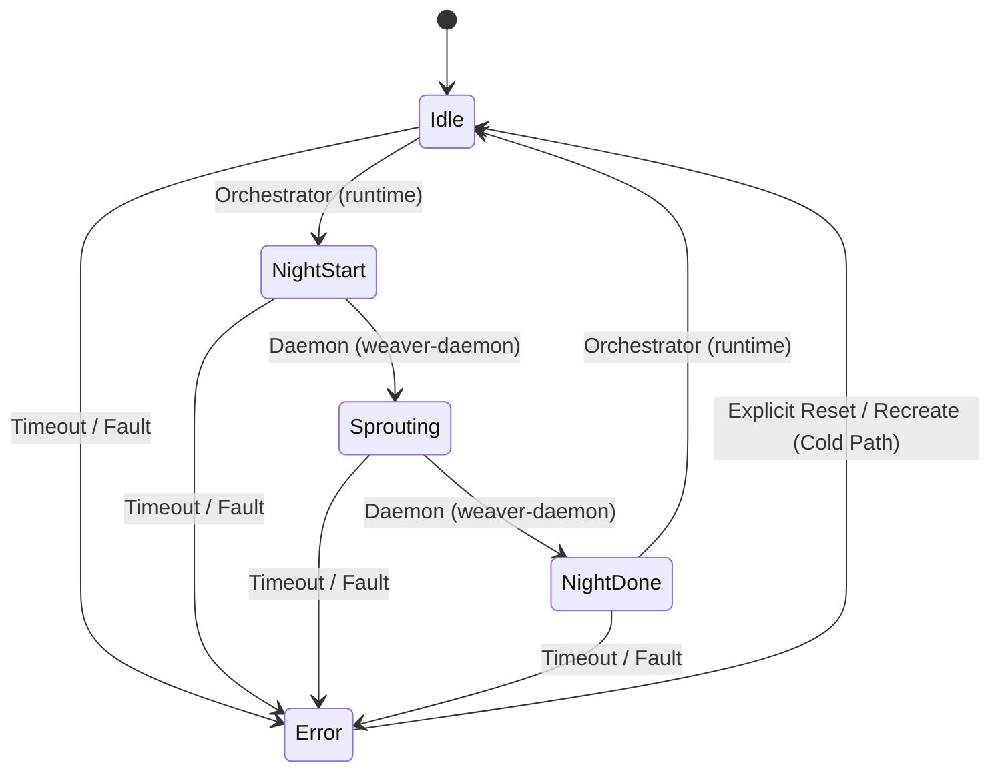

# spec_ipc

> Версия спеки: 2.0  
> Дата: 2026-06-29  
> Статус: Draft (Architecture Pass 1)

---

## §1. Идентификация

| Поле | Значение |
|---|---|
| **Имя крейта** | `ipc` |
| **Слой** | Слой 2 — Инфраструктура Межпроцессного Взаимодействия (Inter-Process Communication) |
| **Тип** | Library (`lib`) |
| **no_std** | Нет (`false`) — требуются системные вызовы ОС для mmap, управления правами файлов и синхронизации |
| **Описание** | Изолятор платформозависимых механизмов жизненного цикла разделяемой памяти (SHM), отображения файлов в память (mmap), Lock-Free атомарной синхронизации процессов и двойных буферов Swapchain. Крейт отвечает за создание, валидацию, очистку отравленных сегментов ОС, управление правами доступа runtime-директорий и атомарный автомат состояний Ночной Фазы. Крейт не является окончательно утвержденным владельцем C-ABI макетов данных и сетевых DTO пакетов. |

---

## §2. Стек и Окружение

### §2.1. Внутренние зависимости (inbound)

| Крейт | Что используется | Зачем |
|---|---|---|
| `types` (Слой 0) | `ZoneHash`, хэширование имен, идентификаторы рантайма | Детерминированное вычисление POSIX/Windows имен сегментов памяти и сокетов на основе хэша зоны. |
| `layout` (Слой 1) | `ShmHeader`, `ShmState`, `EphysShm` *(Предлагаемая зависимость / Предварительное нерешенное владение)* | Заявка на Zero-Cost приведение сырых 64-байт выровненных указателей mmap к C-ABI структурам. Владение макетами находится на согласовании. |
| `wire` (Слой 1) | Байтовые DTO сообщений (`AxonHandoverEvent`, `AxonHandoverAck`, `AxonHandoverPrune`, `ControlPacket`) | Передача сообщений через каналы управления и буферы IPC без дублирования структур пакетов. |
| `vfs` (Слой 2) | Граница монтирования архивов read-only (`.axic`) | Изоляция мутабельных SHM-сегментов рантайма от неизменяемых архивов VFS. |

### §2.2. Внешние зависимости

| Crate | Версия | Сфера использования |
|---|---|---|
| `memmap2` | `=0.9.10` | Кроссплатформенный memory-mapped I/O (POSIX SHM на Linux, File Mapping на Windows). |
| `libc` | `=0.2.182` | Выполнение прямых системных вызовов ОС (`shm_open`, `shm_unlink`, `ftruncate`, `chmod`) на Linux. |

> [!IMPORTANT]
> Новые внешние зависимости в крейт `ipc` не добавляются без отдельного анализа и согласования.

### §2.3. Feature Flags и Платформенная Изоляция

Секция публичных feature flags не используется. Изоляция системных вызовов Linux и Windows реализуется через атрибуты условной компиляции `#[cfg(target_os = "linux")]` и `#[cfg(target_os = "windows")]`.

---

## §3. Ownership Boundaries (Границы Владения)

| Модуль / Крейт | Монопольная Зона Владения (Single Source of Truth) | Строгие Запреты (Что категорически запрещено в крейте) |
|---|---|---|
| **`ipc`** (Слой 2) | **Жизненный цикл SHM/mmap и синхронизация**: Создание, открытие, закрытие сегментов SHM, OS-специфичные имена файлов и сокетов, очистка отравленных (stale/poisoned) сегментов, права доступа runtime-директорий (`0o700`), атомарные переходы автомата (CAS), spin-wait таймауты, примитивы указательного Swapchain, mock-аллокатор для тестов и округление размера до страниц ОС (`4096B`). | Запрещено утверждение монопольного владения C-ABI DTO до финального решения, монтирование `.axic` архивов (владелец `vfs`), аллокация VRAM (владелец `compute`/`runtime`), AOT-компиляция (владелец `baker`) и парсинг TOML. |
| **`layout`** (Слой 1) | **Макеты Памяти (Кандидат в владельцы)**: C-ABI структуры `ShmHeader`, `ShmState`, `EphysShm` *(Нерешенный вопрос владения)*, смещения SoA-плоскостей дисковых файлов. | Запрещены системные вызовы `mmap`, `shm_open` и управление файловыми дескрипторами ОС. |
| **`wire`** (Слой 1) | **Сетевые и IPC DTO**: Бинарные структуры пакетов хэндновера, спайков и управления. | Запрещена реализация атомарных автоматов переходов в разделяемой памяти. |
| **`vfs`** (Слой 2) | **Файловая Система и Архивы**: Монтирование read-only пакетов `.axic`, распаковка геометрии. | Запрещено создание мутабельных разделяемых сегментов Ночной Фазы. |

---

## §4. Платформенная Политика Именования и Окружения

### §4.1. Специфика Операционных Систем и Безопасность UDS
- **Linux**: Использование POSIX SHM (`/dev/shm`) с детерминированными именами. При холодном старте выполняется обязательное удаление осиротевшего сегмента (`shm_unlink`).
  - **Права доступа и Директория Сокетов**: Правило прав `0o700` применяется строго к **runtime-директории** процессов, а не напрямую к файлу сокета. Сокеты не помещаются напрямую в корень `/tmp/`. Целевым стандартом является `$XDG_RUNTIME_DIR/axiengine/axicor_baker_{zone_hash:08X}.sock` или приватная изолированная директория `/tmp/axiengine-$uid/` с правами `0o700`. Права самого файла сокета, вызовы `chmod` и `umask` регулируются отдельно при создании слушателя сокета.
- **Windows**: Использование file-backed mmap в системной временной директории (`%TEMP%`) или изолированной runtime-директории проекта.

### §4.2. Детерминированное Именование Сегментов
Имена файлов и сегментов памяти рассчитываются детерминированно от `zone_hash` (форматирование 8 символов Hex в верхнем регистре):
- **Сегмент состояния SHM**: `axicor_shard_{zone_hash:08X}`
- **Файл манифеста**: `axicor_manifest_{zone_hash:08X}.toml`
- **Сегмент осциллограмм Ephys**: `axicor_ephys_{zone_hash:08X}.shm`
- **Управляющий сокет UDS (Linux)**: `$XDG_RUNTIME_DIR/axiengine/axicor_baker_{zone_hash:08X}.sock` (или `/tmp/axiengine-$uid/...`)

---

## §5. Валидация Разделяемой Памяти (SHM Validation)

> [!IMPORTANT]
> Смещения полей в заголовке `ShmHeader` оперативной памяти (Live SHM Header Offsets) **не равны** смещениям SoA-плоскостей в дисковых файлах дампов `.state` (State File Offsets). Дисковые `.state` файлы выравниваются по своим формулам и содержат другой набор заголовков.

### §5.1. Два Варианта Валидации Живой SHM Памяти
При вызове `validate_shm_header` валидация выполняется по одному из двух сценариев в зависимости от финального решения по разделению владения:

1. **Вариант А (Если `ShmHeader` принадлежит `layout`)**: Крейт `ipc` вызывающим образом дёргает готовую функцию-валидатор из библиотеки `layout`.
2. **Вариант Б (Временная валидация legacy-совместимых полей `ShmHeader`)**: Крейт `ipc` проверяет явный список полей заголовка:
   - `magic == SHM_MAGIC` (`0x41584943` / `"AXIC"`).
   - `version == SHM_VERSION` (соответствие текущей версии).
   - `state` — валидный диапазон enum автомата (`0..=4`).
   - `padded_n` — кратность 64.
   - `dendrite_slots == 128`.
   - Поля смещений: `weights_offset`, `targets_offset`, `handovers_offset`, `prunes_offset`, `flags_offset`, `voltage_offset`, `threshold_offset_offset`, `timers_offset`.
   - Счетчики и емкости: `handovers_count <= MAX_HANDOVERS_PER_NIGHT`, `prunes_count <= MAX_PRUNES_PER_NIGHT`.

> [!CAUTION]
> Невалидный заголовок никогда не используется повторно в молчаливом режиме. При обнаружении ошибки монтирование завершается со сбоем (`Err(IpcError::PoisonedSegment)`), либо сегмент пересоздается заново в режиме холодного старта владельца.

---

## §6. Атомарный Автомат Состояний Ночной Фазы (State Machine)

Координация работы между GPU-оркестратором (`runtime`) и CPU-демоном (`weaver-daemon`) осуществляется через атомарный автомат состояний в разделяемой памяти.

### §6.1. Состояния Автомата
- `Idle` (`0`): Горячий цикл симуляции (Дневная Фаза). Демон ожидает триггера.
- `NightStart` (`1`): Оркестратор приостановил горячий цикл и передал управление демону.
- `Sprouting` (`2`): Демон выполняет $O(N)$ алгоритмы 3D-геометрии и синаптогенеза.
- `NightDone` (`3`): Демон завершил модификацию памяти и передает результаты оркестратору.
- `Error` (`4`): Аварийное состояние при таймауте или краше одного из участников.

### §6.2. Разрешенные Переходы и Ответственность Писателей (Single-Writer Pattern)



| Исходное Состояние | Целевое Состояние | Единоличный Писатель (Single Writer) | Условие и Механизм Перехода |
|---|---|---|---|
| `Idle (0)` | `NightStart (1)` | Orchestrator (`runtime`) | Завершение батча тиков Дневной Фазы. |
| `NightStart (1)` | `Sprouting (2)` | Daemon (`weaver-daemon`) | Считывание сигналов и начало 3D-расчетов. |
| `Sprouting (2)` | `NightDone (3)` | Daemon (`weaver-daemon`) | Завершение модификации весов и связей. |
| `NightDone (3)` | `Idle (0)` | Orchestrator (`runtime`) | Применение патчей памяти и возобновление симуляции. |
| *Любое состояние* | `Error (4)` | Любой участник / Sentinel | Превышение таймаута `NIGHT_PHASE_TIMEOUT_SECS` или краш. |
| `Error (4)` | `Idle (0)` | Orchestrator (`runtime`) | Строго через явный сброс в режиме холодного старта. |

### §6.3. Атомарная Порядок Памяти (Memory Ordering)
Каждый переход состояния выполняется через атомарную операцию `compare_exchange`.
- **Синхронизация состояний**: Используется порядок `Ordering::AcqRel` для успешного перехода и `Ordering::Acquire` для проверки текущего состояния.
- **Обоснование**: `Release` гарантирует, что все записи в SoA-плоскости памяти завершены до публикации нового состояния, а `Acquire` гарантирует, что читатель увидит свежие данные памяти сразу после успешного считывания состояния.

---

## §7. Жизненный Цикл Разделяемой Памяти (SHM Lifecycle)

```
[Cold Start] ──> shm_unlink() ──> shm_open(O_CREAT|O_EXCL) ──> ftruncate() ──> mmap() ──> Zero Init ──> Validate ──> Expose
                                                                                                            │
[Attach Path] ────────────────────────────────────────────────> mmap() ──> Validate Header ─────────────────┤
                                                                                                            ▼
[Teardown] <─── Unmap (Clients) <─── shm_unlink() (Owner Only) <──────────────────────────────────── Active Runtime
```

### §7.1. Холодный Старт (Cold Start / Exclusive Owner)
Выполняется исключительно монопольным владельцем сегмента (оркестратором):
1. **Очистка**: Вызов `shm_unlink` для удаления возможного осиротевшего сегмента от предыдущего аварийного завершения.
2. **Создание**: Вызов `shm_open` с флагами `O_CREAT | O_EXCL | O_RDWR` для монопольного создания нового сегмента.
3. **Установка размера**: Вызов `ftruncate` с округлением размера до выравненных страниц ОС (`4096 bytes`).
4. **Отображение**: Вызов `mmap` с флагами `PROT_READ | PROT_WRITE` и `MAP_SHARED`.
5. **Инициализация**: Заполнение сегмента нулями и запись базового `ShmHeader` со статусом `Idle`.
6. **Публикация**: Предоставление доступа остальным компонентам.

### §7.2. Подключение Клиента (Attach Existing)
Выполняется присоединяющимися процессами (демоном):
1. Отображение существующего файла/сегмента через `mmap`.
2. Полная валидация заголовка согласно §5.1.
3. При обнаружении ошибок — мгновенный отказ в подключении (`Err(IpcError::PoisonedSegment)`).

### §7.3. Завершение Работы (Teardown)
- **Присоединившиеся процессы**: Выполняют только `unmap` отображенного региона памяти.
- **Монопольный владелец**: Выполняет `unmap`, после чего вызывает `shm_unlink` (на Linux) или удаляет временный файл (на Windows).

---

## §8. Протоколы Примитивов Swapchain, Control Channel и Ephys

### §8.1. Примитивы Двойного Буфера Swapchain (`InputSwapchain` / `OutputSwapchain`)
Swapchains в `ipc` являются примитивами **двойного буфера (Double-Buffer Pointer Swap)**, а не кольцевым буфером (Ring Buffer).
- **Модель Владения Буферами**: В каждый момент времени существуют буферы `ready` и `back`. Производитель (Producer) монопольно владеет буфером `back` во время записи новой порции данных. Покупатель/Потребитель (Consumer) владеет буфером `ready`.
- **Публикация и Взаимообмен**: Заполнив полезную нагрузку в `back`, производитель атомарно подменяет указатель с `ready` через вызов `AtomicPtr::swap` с порядком `Ordering::AcqRel`. Возвращенный старый указатель переходит во владение производителя как новый `back`-буфер для следующей итерации.
- **Порядок Памяти**: Потребитель забирает опубликованный указатель с `Ordering::Acquire`. Использование `Ordering::Relaxed` допускается строго на операциях с локальными указателями потока, если они уже были синхронизированы через предшествующий барьер `Acquire`.
- **Переполнение емкости (Overflow)**: При переполнении внешнего входного буфера возвращается ошибка `Err(IpcError::CapacityExceeded)` или применяется явная политика отбрасывания. Неконтролируемый `panic!` запрещен.

### §8.2. Сокет Управляющего Канала (Control Channel)
`ipc` владеет жизненным циклом сокета и моделью прав доступа директории (`0o700`), но не интерпретирует семантику передаваемых бизнес-команд.
- **Разграничение сокетов**: Низкоуровневый управляющий канал `ipc` используется исключительно для внутренних сигналов симулятора (`runtime` / `weaver-daemon`). Внешний JSON-lines мост редактора (AxiCAD Bridge) работает на верхнем уровне над командами движка и не смешивается с сокетами `ipc`.

### §8.3. Протокол Осциллограмм Ephys (Ephys Handshake)
*(Данная секция является условной и применяется строго в том случае, если `EphysShm` остаётся в сфере ответственности моста ipc/layout)*.

Управление инъекциями токов и снятием осциллограмм через `EphysShm` выполняется по 4-тактовому протоколу рукопожатия:
1. `Idle (0) -> Trigger (1)`: Внешний клиент записывает параметры инъекции и взводит триггер.
2. `Trigger (1) -> Busy (2)`: Рантайм перехватывает задачу и производит запись осциллограмм в горячем цикле.
3. `Busy (2) -> Done (3)`: Рантайм завершает запись трассы и публикует результат.
4. `Done (3) -> Idle (0)`: Клиент считывает данные и возвращает модуль в исходный режим.
- **Кандидаты Лимитов**: Из legacy-кода выделены факты-кандидаты для верификации: `target_count <= 16`, `max_ticks <= 10000`, размер структуры `640_192B` (640 192 байта). Финальный API утверждается после закрытия вопроса владения.
- **Безопасность**: Запрещена перезапись данных во время состояний `Busy` и `Done`.

### §8.4. Примитив Теневой Репликации (Shadow Replication Primitive)
Крейт `ipc` предоставляет zero-copy / mmap-backed примитивы источника и приемника данных (`ShadowShmManager`). Принятие решений о времени, частоте и адресатах сетевой репликации принадлежит крейтам `transport` и `runtime`.

---

## §9. Иерархия Ошибок (`IpcError`)

```rust
#[derive(Debug, Clone, Copy, PartialEq, Eq)]
pub enum IpcError {
    InvalidHeaderMagic,
    VersionMismatch,
    InvalidState,
    InvalidTransition,
    OffsetOutOfRange,
    AlignmentMismatch,
    PoisonedSegment,
    Timeout,
    CasConflict,
    PermissionDenied,
    MapFailed,
    CapacityExceeded,
    ControlChannelClosed,
    UnsupportedPlatform,
}
```

---

## §10. Требуемые Инварианты

- **INV-IPC-001**: Сырой указатель mmap и смещения SoA-плоскостей состояния выровнены по границе 64 байт (`PADDED_N_ALIGNMENT`).
- **INV-IPC-002**: При холодном старте монопольный владелец безусловно очищает осиротевшие сегменты (`shm_unlink`) перед созданием новых.
- **INV-IPC-003**: Атомарные переходы автомата состояний выполняются через `compare_exchange` с порядком `AcqRel`/`Acquire`.
- **INV-IPC-004**: Опрос состояния автомата ограничен таймаутом `NIGHT_PHASE_TIMEOUT_SECS` (10 с) с переводом в `Error (4)`.
- **INV-IPC-005**: Runtime-директории файловых сокетов на Linux создаются со строгими правами доступа `0o700`.
- **INV-IPC-006**: Обмен указателями в Swapchain использует атомарный `swap` с порядком `Ordering::AcqRel`.
- **INV-IPC-007**: *(Условный инвариант)* Протокол Ephys строго соблюдает 4-тактовый цикл `Idle -> Trigger -> Busy -> Done -> Idle`, если `EphysShm` входит в scope `ipc`.
- **INV-IPC-008**: Присоединяющиеся процессы не имеют права удалять SHM-сегменты из файловой системы при завершении работы.

---

## §11. Golden Tests / Обязательная Матрица Тестирования

Крейт `ipc` обязан быть покрыт набором автоматических тестов:

1. **Детерминизм Имен Сегментов (`test_deterministic_shm_names`)**: Проверка генерации путей по `zone_hash` для Linux и Windows.
2. **Очистка Осиротевших Сегментов (`test_cold_start_evicts_stale`)**: Проверка удаления старого сегмента при холодном старте.
3. **Отказ Мониторинга Невалидного Заголовка (`test_attach_rejects_bad_magic_and_version`)**: Проверка возврата `PoisonedSegment` при поврежденном magic или версии.
4. **Валидация Смещений и Лимитов (`test_attach_rejects_bad_offsets_and_counts`)**: Проверка браковки немонотонных смещений или превышения емкости событий.
5. **Валидация Матрицы Переходов Состояний (`test_state_machine_transitions`)**: Разрешение только валидных переходов и блокировка запрещенных.
6. **Отработка Таймаута Автомата (`test_state_machine_timeout_to_error`)**: Симуляция зависания демона и проверка перехода в `Error (4)`.
7. **Атомарная Видимость Swapchain (`test_swapchain_publish_consume_visibility`)**: Проверка передачи указателей и данных между потоками при двойном буфере.
8. **Обработка Переполнения Емкости Swapchain (`test_swapchain_capacity_overflow`)**: Проверка возврата ошибки при переполнении буфера.
9. **Работа Автономного Mock-Аллокатора (`test_mock_shm_allocator_isolation`)**: Проверка работы `MockShmAllocator` в RAM без обращения к ФС.
10. **Проверка Рукопожатия Ephys (`test_ephys_handshake_and_bounds`)**: *(Условный тест)* Проверка 4-тактового цикла и валидации границ `max_ticks`, если `EphysShm` сохраняется в `ipc`.

---

## §12. Open Questions / Review Debt (Открытые Вопросы и Противоречия)

В процессе анализа спецификации IPC выявлены следующие открытые вопросы для согласования:

1. **Нерешенный Владелец Декларации `ShmHeader`, `ShmState` и `EphysShm`**:
   - *Контекст*: Сейчас макеты структур соприкасаются с `layout` и `ipc`. Принятие решения требует обновления `layout_spec.md`.
   - *Вопрос*: Утверждается ли полное монопольное владение C-ABI объявлениями этих структур за крейтом `layout` с обновлением его спецификации?

2. **Граница Расчета `shm_size` (Логический Макет vs Страница ОС)**:
   - *Контекст*: Логическая сумма полей рассчитывается по формулам SoA, но mmap требует выравнивания на 4096 байт.
   - *Вопрос*: К какому крейту относится функция расчета итогового выровненного размера — `layout` или `ipc`?

3. **Канал Управления на платформе Windows (Named Pipe vs Localhost TCP)**:
   - *Контекст*: На Linux используется Unix Domain Sockets. На Windows легаси-код применял localhost TCP сокеты.
   - *Вопрос*: Утверждается ли Named Pipes в качестве основного стандарта управляющего канала для Windows взамен fallback TCP?

4. **Доменная Принадлежность Сигналов `BakeRequest`**:
   - *Контекст*: Сигналы запуска AOT-сборки передаются через управляющий канал IPC.
   - *Вопрос*: Относятся ли структуры сигналов `BakeRequest` к крейту `wire` или объявляются в `ipc`?

5. **Владелец Сетевой Теневой Репликации (Shadow Replication)**:
   - *Контекст*: Использование `sendfile`/`splice` для передач VRAM-дампов соприкасается с IPC и сетевым стеком.
   - *Вопрос*: Является ли теневая репликация исключительно инфраструктурным примитивом `ipc` или переносится в ведение `transport`/`runtime`?

6. **Строгость Порядка Атомарных Операций (AcqRel vs SeqCst)**:
   - *Контекст*: Для автоматов переходов предложен `AcqRel`, однако для упрощения модели анализа возможен переход на `SeqCst`.
   - *Вопрос*: Требуется ли зафиксировать `SeqCst` для всех переходов автомата состояний SHM?

7. **Политика Обработки Переполнения Внешнего Входного Буфера**:
   - *Контекст*: При высокой плотности данных внешний поток ввода может переполнить емкость буфера.
   - *Вопрос*: Выбирается ли политика отбрасывания пакетов (Drop), обратного давления (Backpressure) или возврат ошибки?

8. **Целевая Версия `SHM_VERSION`**:
   - *Контекст*: В legacy-коде используется версия `SHM_VERSION = 3`.
   - *Вопрос*: Сохраняется ли значение 3 или инкрементируется до 4 при утверждении обновленного макета `layout v2.0`?
