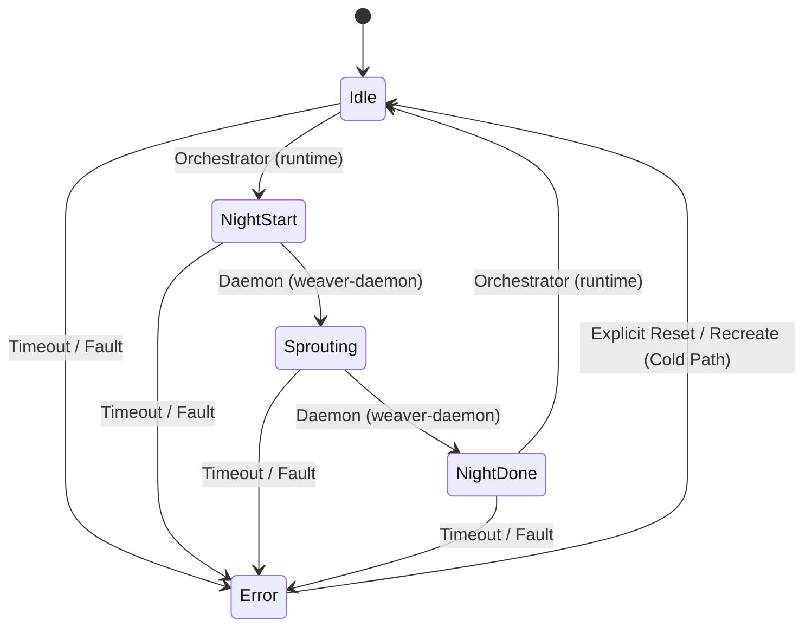

# spec_ipc

> Версия спеки: 2.1  
> Дата: 2026-07-10  

---

## §1. Идентификация

| Поле | Значение |
|---|---|
| **Имя крейта** | `ipc` |
| **Слой** | Слой 2 — Инфраструктура Межпроцессного Взаимодействия (Inter-Process Communication) |
| **Тип** | Library (`lib`) |
| **no_std** | Нет (`false`) — требуются системные вызовы ОС для mmap, Named Pipes / UDS, управления правами файлов и синхронизации |
| **Описание** | Изолятор платформозависимых механизмов жизненного цикла разделяемой памяти (SHM), отображения файлов в память (mmap), Lock-Free атомарной синхронизации процессов, двойных буферов Swapchain, каналов Named Pipes / UDS и DTO сообщений управления `weaver-daemon`. Крейт отвечает за создание, валидацию заголовков разделяемой памяти, очистку отравленных сегментов ОС, управление правами доступа runtime-директорий, атомарный автомат состояний Ночной Фазы и типы сообщений Weaver-задач. Крейт не владеет C-ABI макетами SoA-данных. |

---

## §2. Стек и Окружение

### §2.1. Внутренние зависимости (inbound)

| Крейт | Что используется | Зачем |
|---|---|---|
| `types` (Слой 0) | `ZoneHash`, хэширование имен, идентификаторы рантайма | Детерминированное вычисление POSIX/Windows имен сегментов памяти и Named Pipes на основе хэша зоны. |
| `layout` (Слой 1) | `ShmHeader` | Импорт C-ABI структуры заголовка разделяемой памяти для валидации и разметки планов. Владение макетом `ShmHeader` принадлежит `layout`. |

### §2.2. Внешние зависимости

| Crate | Версия | Сфера использования |
|---|---|---|
| `memmap2` | `=0.9.10` | Кроссплатформенный memory-mapped I/O (POSIX SHM на Linux, File Mapping на Windows). |
| `libc` | `=0.2.182` | Выполнение прямых системных вызовов ОС (`shm_open`, `shm_unlink`, `ftruncate`, `chmod`) на Linux. |

> [!IMPORTANT]
> Новые внешние зависимости в крейт `ipc` не добавляются без отдельного анализа и согласования.

### §2.3. Feature Flags и Платформенная Изоляция

Секция публичных feature flags не используется. Изоляция системных вызовов Linux и Windows реализуется через атрибуты условной компиляции `#[cfg(target_os = "linux")]` и `#[cfg(target_os = "windows")]`.

---

## §3. Ownership Boundaries (Границы Владения)

| Модуль / Крейт | Монопольная Зона Владения (Single Source of Truth) | Строгие Запреты (Что категорически запрещено в крейте) |
|---|---|---|
| **`ipc`** (Слой 2) | **Жизненный цикл SHM/mmap, синхронизация и DTO управления**: Создание, открытие, закрытие сегментов SHM, OS-специфичные имена файлов и сокетов/Named Pipes, очистка отравленных (stale/poisoned) сегментов, права доступа runtime-директорий (`0o700`), атомарные переходы автомата (CAS), spin-wait таймауты, примитивы Swapchain, DTO-сообщения `WeaverJobRequest`/`WeaverReport`/`WeaverGrowthContext`, округление размера до страниц ОС (`4096B`). | Запрещено монопольное владение C-ABI SoA структурами (владелец `layout`), монтирование `.axic` архивов (владелец `vfs`), аллокация VRAM (владелец `compute`/`runtime`), AOT-компиляция (владелец `baker`) и парсинг TOML. |
| **`layout`** (Слой 1) | **Макеты Памяти**: C-ABI структуры `ShmHeader`, `VariantParameters`, `BurstHeads8`, `NightWorkingViewMut/Ref`, формулы смещений SoA-плоскостей. | Запрещены системные вызовы `mmap`, `shm_open` и управление файловыми дескрипторами Named Pipes ОС. |
| **`wire`** (Слой 1) | **Сетевые DTO**: Бинарные структуры пакетов хэндновера, спайков и управления для внешней сети. | Запрещена реализация атомарных автоматов переходов в разделяемой памяти. |
| **`vfs`** (Слой 2) | **Файловая Система и Архивы**: Монтирование read-only пакетов `.axic`, распаковка геометрии. | Запрещено создание мутабельных разделяемых сегментов Ночной Фазы. |

---

## §4. Платформенная Политика Именования и Окружения

### §4.1. Специфика Операционных Систем и Безопасность UDS / Named Pipes
- **Linux**: Использование POSIX SHM (`/dev/shm`) с детерминированными именами. При холодном старте выполняется обязательное удаление осиротевшего сегмента (`shm_unlink`).
  - **Права доступа и Директория Сокетов**: Правило прав `0o700` применяется строго к **runtime-директории** процессов, а не напрямую к файлу сокета. Сокеты не помещаются напрямую в корень `/tmp/`. Целевым стандартом является `$XDG_RUNTIME_DIR/axiengine/axicor_baker_{zone_hash:08X}.sock` или приватная изолированная директория `/tmp/axiengine-$uid/` с правами `0o700`.
- **Windows**: Использование file-backed mmap в системной временной директории (`%TEMP%`) или изолированной runtime-директории проекта.
  - **Канал управления**: Для Windows в качестве управляющего канала используются Named Pipes (Именованные Каналы) вида `\\.\pipe\axicor_baker_{zone_hash:08X}`. Fallback TCP-сокеты на localhost запрещены.

### §4.2. Детерминированное Именование Сегментов
Имена файлов и сегментов памяти рассчитываются детерминированно от `zone_hash` (форматирование 8 символов Hex в верхнем регистре):
- **Сегмент состояния SHM**: `axicor_shard_{zone_hash:08X}`
- **Файл манифеста**: `axicor_manifest_{zone_hash:08X}.toml`
- **Сегмент осциллограмм Ephys**: `axicor_ephys_{zone_hash:08X}.shm`
- **Управляющий канал (Linux UDS)**: `$XDG_RUNTIME_DIR/axiengine/axicor_baker_{zone_hash:08X}.sock`
- **Управляющий канал (Windows Pipe)**: `\\.\pipe\axicor_baker_{zone_hash:08X}`

---

## §5. Валидация Разделяемой Памяти (SHM Validation)

### §5.1. Правила Валидации Живой SHM Памяти
При инициализации подключения к SHM-сегменту выполняется валидация заголовка `ShmHeader` (который импортируется из `layout`):
1. `magic == *b"AXSM"`.
2. `version == 1` (соответствие текущей версии).
3. `state` — валидный диапазон enum автомата (`0..=4`, т.е. от `Idle` до `Error`).
4. `padded_n` — кратность 64 (`PADDED_N_ALIGNMENT`).
5. Проверка монотонности и правильности смещений `off_state_blob`, `off_axons_blob` и `off_paths_blob` согласно формулам выравнивания из `layout`.
6. Соответствие общего размера сегмента вычисленной величине `ShmHeader.total_size` с учетом размера страниц ОС.

При обнаружении несоответствия или признаков сбоя монтирование завершается со сбоем (`Err(IpcError::PoisonedSegment)`), а сегмент подлежит пересозданию (см. §7.4).

---

## §6. Атомарный Автомат Состояний Ночной Фазы (State Machine)

Координация работы между GPU-оркестратором (`runtime`) и CPU-демоном (`weaver-daemon`) осуществляется через атомарный автомат состояний в разделяемой памяти.

### §6.1. Состояния Автомата
- `Idle` (`0`): Горячий цикл симуляции (Дневная Фаза). Демон ожидает триггера.
- `NightStart` (`1`): Оркестратор приостановил горячий цикл, экспортировал VRAM в Host RAM и передал управление демону.
- `Sprouting` (`2`): Демон выполняет алгоритмы Ночной Фазы.
- `NightDone` (`3`): Демон завершил мутации памяти хоста и передает результаты обратно оркестратору.
- `Error` (`4`): Аварийное состояние (таймаут, сбой алгоритма, паника). В коде автомата состояний нет отдельного варианта `Poisoned`, все ошибки переводят автомат строго в состояние `Error(4)`.

### §6.2. Разрешенные Переходы и Ответственность Писателей (Single-Writer Pattern)



| Исходное Состояние | Целевое Состояние | Единоличный Писатель (Single Writer) | Условие и Механизм Перехода |
|---|---|---|---|
| `Idle (0)` | `NightStart (1)` | Orchestrator (`runtime`) | Завершение батча тиков Дневной Фазы. |
| `NightStart (1)` | `Sprouting (2)` | Daemon (`weaver-daemon`) | Считывание сигналов и начало расчетов. |
| `Sprouting (2)` | `NightDone (3)` | Daemon (`weaver-daemon`) | Завершение модификации весов, связей и путей. |
| `NightDone (3)` | `Idle (0)` | Orchestrator (`runtime`) | Применение патчей памяти и возобновление симуляции. |
| *Любое состояние* | `Error (4)` | Любой участник / Sentinel | Превышение таймаута `NIGHT_PHASE_TIMEOUT_SECS` или краш. |
| `Error (4)` | `Idle (0)` | Orchestrator (`runtime`) | Строго через явный сброс в режиме холодного старта с пересозданием сегмента. |

### §6.3. Атомарная Порядок Памяти (Memory Ordering)
Каждый переход состояния выполняется через атомарную операцию `compare_exchange` с порядком памяти `Ordering::AcqRel` для успешного перехода и `Ordering::Acquire` для неуспешного. `Release` гарантирует, что все записи в SoA-плоскости хост-памяти завершены до публикации нового состояния, а `Acquire` гарантирует, что читатель увидит свежие данные памяти сразу после считывания состояния.

---

## §7. Жизненный Цикл Разделяемой Памяти (SHM Lifecycle)

### §7.1. Холодный Старт (Cold Start / Exclusive Owner)
Выполняется исключительно монопольным владельцем сегмента (оркестратором):
1. **Очистка**: Вызов `shm_unlink` (на Linux) или удаление файла (на Windows) для удаления осиротевшего сегмента.
2. **Создание**: Вызов `shm_open` с флагами `O_CREAT | O_EXCL | O_RDWR` для монопольного создания.
3. **Установка размера**: Вызов `ftruncate` с округлением размера до выравненных страниц ОС (`4096 bytes`).
4. **Отображение**: Вызов `mmap` с флагами `PROT_READ | PROT_WRITE` и `MAP_SHARED`.
5. **Инициализация**: Заполнение сегмента нулями и запись базового `ShmHeader` (magic `*b"AXSM"`, state `Idle`).

### §7.2. Подключение Клиента (Attach Existing)
Выполняется демоном (`weaver-daemon`):
1. Отображение существующего файла/сегмента через `mmap`.
2. Валидация заголовка согласно §5.1.
3. При обнаружении ошибок — мгновенный отказ в подключении (`Err(IpcError::PoisonedSegment)`).

### §7.3. Завершение Работы (Teardown)
- **Присоединившиеся процессы**: Выполняют только `unmap` отображенного региона памяти.
- **Монопольный владелец**: Выполняет `unmap` и `shm_unlink` (на Linux) / удаление временного файла (на Windows).

### §7.4. Семантика Отравленного Сегмента (Poisoned Segment Recovery)
Если автомат переходит в состояние `Error(4)` или валидация `ShmHeader` падает, сегмент признается "отравленным" (poisoned). Возобновление работы (resume) поверх этого сегмента запрещено. Оркестратор обязан выполнить полный teardown, удалить старый сегмент и прибегнуть к холодному старту с восстановлением из контрольной точки или повторным сбором шарда.

---

## §8. Swapchain, Управляющий Канал и DTO Сообщений

### §8.1. Примитивы Двойного Буфера Swapchain (`InputSwapchain` / `OutputSwapchain`)
Swapchains в `ipc` являются примитивами **двойного буфера (Double-Buffer Pointer Swap)**:
- **Модель**: `ready` и `back`. Производитель (Producer) пишет в `back`, Потребитель (Consumer) читает из `ready`.
- **Взаимообмен**: Заполнив полезную нагрузку в `back`, производитель атомарно подменяет указатель с `ready` через `AtomicPtr::swap` с порядком `Ordering::AcqRel`.

### §8.2. Сокет / Канал Управляющего Канала (Control Channel)
`ipc` владеет низкоуровневым каналом управления для внутренних сигналов симулятора (`runtime` / `weaver-daemon`). Он использует UDS сокеты на Linux и Named Pipes на Windows.

### §8.3. Weaver Control DTOs (DTO Управления Биологическими Шагами)
Структуры управляющих запросов и отчетов Ночной Фазы принадлежат крейту `ipc` для исключения перекрестных зависимостей между рантаймом и демоном (решение `REV-WEAVER-001`):

```rust
/// Запрос на выполнение биологического цикла Ночной Фазы.
#[derive(Debug, Clone)]
pub struct WeaverJobRequest {
    pub shard_id: u32,
    pub zone_hash: u32,
    pub night_epoch: u64,
    pub master_seed: [u8; 32],        // Семя генератора случайных чисел
    pub prune_threshold: u32,         // u32 порог прунинга (сконвертированный i32 на стороне runtime)
    pub max_sprouts: u32,             // Лимит новорожденных связей
    pub w_distance: u32,              // Весовые FP 16.16 коэффициенты attraction
    pub w_power: u32,
    pub w_explore: u32,
    pub initial_synapse_weight: i32,  // Базовый синаптический вес с учетом Dale
    pub has_growth_context: bool,     // Присутствует ли контекст роста путей
}

/// Дополнительный биологический контекст роста путей.
#[derive(Debug, Clone)]
pub struct WeaverGrowthContext {
    pub target_somas: Vec<u32>,       // Целевые нейроны
    pub attraction_radius: u32,       // Радиус притяжения вокселей
}

/// Финальный отчет о результатах выполнения биологического планирования Ночной Фазы.
#[derive(Debug, Clone)]
pub struct WeaverReport {
    pub shard_id: u32,
    pub night_epoch: u64,
    pub pruned_count: u32,
    pub compacted_count: u32,
    pub sprouted_count: u32,
    pub ghost_handovers_count: u32,
    pub duration_us: u64,
}
```

---

## §9. Иерархия Ошибок (`IpcError`)

```rust
#[derive(Debug, Clone, Copy, PartialEq, Eq)]
pub enum IpcError {
    InvalidHeaderMagic,
    VersionMismatch,
    InvalidState,
    InvalidTransition,
    OffsetOutOfRange,
    AlignmentMismatch,
    PoisonedSegment,
    Timeout,
    CasConflict,
    PermissionDenied,
    MapFailed,
    CapacityExceeded,
    ControlChannelClosed,
    UnsupportedPlatform,
}
```

---

## §10. Требуемые Инварианты

- **INV-IPC-001**: Сырой указатель mmap и смещения SoA-плоскостей выровнены по границе 64 байт (`PADDED_N_ALIGNMENT`).
- **INV-IPC-002**: При холодном старте монопольный владелец безусловно очищает осиротевшие сегменты перед созданием новых.
- **INV-IPC-003**: Атомарные переходы автомата состояний выполняются через `compare_exchange` с порядком `AcqRel`/`Acquire`.
- **INV-IPC-004**: Опрос состояния автомата ограничен таймаутом `NIGHT_PHASE_TIMEOUT_SECS` (10 с) с переводом в `Error (4)`.
- **INV-IPC-005**: Runtime-директории файловых сокетов на Linux создаются со строгими правами доступа `0o700`.
- **INV-IPC-006**: Обмен указателями в Swapchain использует атомарный `swap` с порядком `Ordering::AcqRel`.
- **INV-IPC-007**: Присоединяющиеся процессы не имеют права удалять SHM-сегменты из файловой системы при завершении работы.

---

## §11. Golden Tests / Обязательная Матрица Тестирования

Крейт `ipc` обязан быть покрыт набором автоматических тестов:

1. **Детерминизм Имен Сегментов (`test_deterministic_shm_names`)**: Проверка генерации путей по `zone_hash` для Linux и Windows.
2. **Очистка Осиротевших Сегментов (`test_cold_start_evicts_stale`)**: Проверка удаления старого сегмента при холодном старте.
3. **Отказ Мониторинга Невалидного Заголовка (`test_attach_rejects_bad_magic_and_version`)**: Проверка возврата `PoisonedSegment` при поврежденном magic или версии.
4. **Валидация Матрицы Переходов Состояний (`test_state_machine_transitions`)**: Разрешение только валидных переходов и блокировка запрещенных.
5. **Отработка Таймаута Автомата (`test_state_machine_timeout_to_error`)**: Симуляция зависания демона и проверка перехода в `Error (4)`.
6. **Атомарная Видимость Swapchain (`test_swapchain_publish_consume_visibility`)**: Проверка передачи указателей и данных между потоками при двойном буфере.
7. **Обработка Переполнения Емкости Swapchain (`test_swapchain_capacity_overflow`)**: Проверка возврата ошибки при переполнении буфера.
8. **Работа Автономного Mock-Аллокатора (`test_mock_shm_allocator_isolation`)**: Проверка работы `MockShmAllocator` в RAM без обращения к ФС.
9. **Проверка Named Pipes на Windows (`test_windows_named_pipe_names`)**: Проверка генерации путей именованных каналов на Windows.
10. **Сериализация Weaver Job DTO (`test_weaver_job_dto_serialization`)**: Проверка успешной сериализации/десериализации Weaver DTO-структур.

---

## §12. Resolved Architectural Decisions (Принятые Решения Pass 2)

1. **[RESOLVED] Владение декларацией `ShmHeader` (REV-IPC-001 / Pass 2.3)**:
   - *Решение*: Монопольное владение бинарным представлением `ShmHeader` и формулами расчета смещений SoA в SHM передано в крейт `layout`. Крейт `ipc` импортирует эти типы и фокусируется исключительно на системном жизненном цикле и IPC-атоматах.

2. **[RESOLVED] Граница Расчета `shm_size` (Логический Макет vs Страница ОС)**:
   - *Решение*: Вычисление точных смещений и размера `total_size` выполняется в `layout`. Крейт `ipc` принимает значение и округляет его до размера страниц ОС (`ftruncate` с выравниванием на 4096 байт).

3. **[RESOLVED] Канал Управления на платформе Windows (Named Pipe vs Localhost TCP)**:
   - *Решение*: В качестве управляющего канала на Windows утвержден стандарт Named Pipes. Localhost TCP-сокеты исключены из архитектуры.

4. **[RESOLVED] Место проживания Weaver DTO (REV-WEAVER-001 / Pass 2.3)**:
   - *Решение*: Структуры `WeaverJobRequest`, `WeaverReport` и `WeaverGrowthContext` объявлены в крейте `ipc`. Библиотека `weaver-daemon` осуществляет их реэкспорт. Это исключает прямую зависимость рантайма от демона.  
   *Примечание о сведении (convergence)*: Текущая версия `weaver_daemon_spec` §4 временно содержит расхождения в описании полей. В рамках T002c спецификация `weaver_daemon_spec` будет переписана для фиксации `ipc` как единственного источника истины (Single Source of Truth) для данных DTO.

