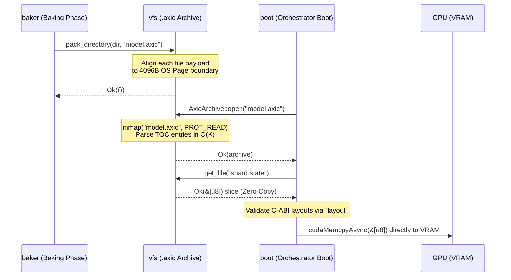

# spec_vfs

> Версия спеки: 1.0
> Дата: 2026-06-23
> Статус: Verified

---

## §1. Идентификация

| Поле | Значение |
|---|---|
| Название | `vfs` |
| Слой | Слой 2 — Инфраструктура |
| Тип | Library (`lib`) |
| `no_std` | **Нет** (требуются системные вызовы для memory-mapped файлов и структуры `std::fs` / `std::collections::HashMap`) |
| Описание | Виртуальная файловая система архивов `.axic`. Обеспечивает постранично выровненный (4096B) Zero-Copy произвольный доступ к скомпилированным биологическим артефактам симуляции. |

---

## §2. Стек и Окружение

### §2.1. Внутренние зависимости (inbound)

Крейт работает на максимально низком уровне и не тянет в себя бизнес-логику движка, опираясь только на фундаментальный словарь.

| Крейт | Что используется | Зачем |
|---|---|---|
| `types` | Глобальные константы | Использование фундаментальных физических констант выравнивания. |

### §2.2. Внешние зависимости

Сторонний код сведен к абсолютному минимуму. Мы не пишем свой аллокатор страниц ОС, поэтому делегируем платформозависимый код (Linux/Windows) проверенному крейту.

| Crate | Версия | Зачем |
|---|---|---|
| `memmap2` | `=0.9.10` | Кроссплатформенный memory-mapped I/O для проецирования архива в адресное пространство процесса. |
| `anyhow` | `=1.0.102` | Упрощенная обработка ошибок на этапе AOT-упаковки в модуле `packer`. |

### §2.3. Feature Flags

Секция не применима к данному крейту: крейт собирается без условных фич, предоставляя единый кроссплатформенный API как для упаковки (Baking Phase), так и для чтения (Day Phase).

---

## §3. Инварианты

Крейт `vfs` гарантирует соблюдение 6 фундаментальных инвариантов, определяющих безопасность Zero-Copy загрузки, изоляцию разделяемой памяти и аппаратные контракты ОС (Linux/Windows).

### §3.1. Структурные инварианты

- **INV-VFS-001**: *Аппаратное выравнивание страниц ОС (4096-Byte Page Alignment)*.
  - *Обоснование*: Системные вызовы `mmap` (Linux) и `MapViewOfFile` (Windows) требуют, чтобы смещение (offset) внутри файла было строго кратно размеру страницы памяти ОС. Чтобы мапить файлы `.state` или `.axons` напрямую из монолитного архива `.axic` без аллокаций, `AxicPacker` обязан выравнивать каждый вложенный файл паддингом по формуле `(4096 - (current_pos % 4096)) % 4096`.
  - *Следствие нарушения*: Крах системного вызова `mmap` на этапе монтирования (например, `OS Error 22: Invalid argument`).
  - *Где проверяется*: Compile-time (алгоритм упаковщика в `AxicPacker`) и Run-time (ассерт при чтении TOC в `AxicArchive::open`).

- **INV-VFS-002**: *Сигнатура архива (Magic Header)*.
  - *Обоснование*: Заголовок архива (первые 12 байт) обязан начинаться с Little-Endian константы `0x43495841` ("AXIC"). За ней следует TOC (Table of Contents), состоящий из дескрипторов по 272 байта (256 байт имя, 8 байт смещение, 8 байт размер).
  - *Следствие нарушения*: Чтение мусора в память, попытка `mmap` с дикими смещениями из битого TOC, краш ноды при старте.
  - *Где проверяется*: В первых строках функции инициализации `AxicArchive::open()`.

### §3.2. Семантические инварианты

- **INV-VFS-003**: *Неизменяемость ROM-образа (ROM Immutability)*.
  - *Обоснование*: Архив `.axic` является статичным "картриджем" (Read-Only Memory). Данные внутри него мапятся в память строго через `memmap2::Mmap` (PROT_READ).
  - *Следствие нарушения*: `Segmentation fault` (SIGSEGV) со стороны MMU процессора при попытке оркестратора или демона записать данные обратно в архив.
  - *Где проверяется*: На уровне системы типов Rust — API архива возвращает только иммутабельные слайсы `&[u8]`.

- **INV-VFS-004**: *Запрет динамической диспетчеризации (Zero-Trait Monomorphism)*.
  - *Обоснование*: Использование абстрактных файловых систем (например, `dyn VfsProvider`) убьет инлайнинг, добавит оверхед `vtable` и разрушит Zero-Copy гарантии в Слоях 2 и 3. Крейт работает исключительно с конкретными структурами `Mmap`.
  - *Следствие нарушения*: Потеря производительности и контроля над физической памятью при монтировании слотов VRAM.
  - *Где проверяется*: Code-review (запрет `dyn Trait` в крейте).

- **INV-VFS-005**: *Уникальность и нуль-терминированность путей в TOC (TOC Path Uniqueness and Null-Termination)*.
  - *Обоснование*: Имена файлов внутри оглавления TOC `.axic` архива обязаны быть уникальными UTF-8 путями длиной не более 255 байт и заканчиваться символом `\0` (null-terminator) для обеспечения FFI/C-ABI совместимости и надежного хеш-поиска в рантайме.
  - *Следствие нарушения*: Затирание дескрипторов при упаковке, некорректное чтение путей (Out-of-Bounds при парсинге UTF-8) и Silent Data Corruption.
  - *Где проверяется*: Валидация при упаковке в `pack_directory` и проверка при разборе TOC в `AxicArchive::open()`.

### §3.3. Межкрейтовые инварианты

- **INV-CROSS-009**: *Изоляция мутабельных артефактов в tmpfs (TMPFS Extraction)*.
  - *Участники*: `vfs`, `[spec_boot.md §7.6] <!-- TBD: дождаться спеки boot -->`, `[spec_ipc.md §4.1]`
  - *Кто владелец проверки*: `vfs` (API экспорта).
  - *Обоснование*: Файлы `.state`, `.axons` и `.paths` требуют мутации во время Ночной Фазы (`weaver-daemon` модифицирует их через mmap). Поскольку `.axic` архив заблокирован на чтение (INV-VFS-003), оркестратор (`boot`) обязан использовать метод экстракции крейта `vfs`, чтобы скопировать эти бинарники во временную директорию ОС (tmpfs) перед аллокацией VRAM. Это изолирует Data Race между независимыми процессами и кластерами, читающими один и тот же `.axic`.
  - *Следствие нарушения*: Коллизии POSIX-блокировок, повреждение ROM-архива, краш `weaver-daemon` при попытке открыть файл на запись.
  - *Где проверяется*: Загрузочный пайплайн в крейте `boot` (`rom_extract.rs`).

---

## §4. Публичный API

### §4.1. Типы

В крейте полностью отсутствуют абстрактные провайдеры (вроде `dyn VfsProvider`). Публичный API представлен единственной структурой для работы с Memory-Mapped файлами ОС.

#### AxicArchive
- **Семантика**: Объект Read-Only отображения скомпилированного архива `.axic` в виртуальное адресное пространство процесса.
- **Структура**:
  - `mmap: memmap2::Mmap` — сырой Read-Only буфер, отображенный в память.
  - `toc: std::collections::HashMap<String, (usize, usize)>` — оглавление архива (Table of Contents), сопоставляющее полные строковые пути файлов с кортежами `(offset, size)` в байтах.
- **Жизненный цикл**: Инициализируется оркестратором при загрузке системы через `AxicArchive::open()`. Существует в течение всего времени симуляции и отпускает файл (Drop `mmap`) при завершении.
- **Ограничения на значения**: Смещения (`offset` + `size`) в таблице `toc` обязаны указывать строго внутрь границ `mmap.len()`.

---

## §4.2. Трейты

Секция не применима к данному крейту: крейт не предоставляет публичных трейтов для реализации, так как работает с конкретными структурами memory-mapped ввода-вывода.

---

## §4.3. Функции

#### `fn open(path: &Path) -> Result<AxicArchive, VfsError>`

- **Назначение**: Открытие `.axic` архива на диске, отображение его в память через `memmap2::Mmap` и разбор TOC.
- **Предусловия**: Файл по указанному пути существует, доступен для чтения и имеет размер не менее 12 байт.
- **Постусловия**: Возвращает проинициализированный `AxicArchive` с разобранной TOC. Каждое смещение TOC-дескриптора обязано быть кратным 4096 (OS Page Size).
- **Сложность**: O(K) по времени для построения TOC (K — количество файлов в архиве), O(K) по памяти. Системный вызов mmap выполняется за O(1).
- **Паника**: Никогда.
- **Пример**:
  ```rust
  let archive = AxicArchive::open(Path::new("model.axic"))?;
  assert!(archive.toc.contains_key("manifest.toml"));
  ```

#### `fn get_file(&self, path: &str) -> Result<&[u8], VfsError>`

- **Назначение**: Возврат неизменяемой ссылки на область памяти mmap, соответствующую файлу в архиве.
- **Предусловия**: Архив успешно открыт и инициализирован.
- **Постусловия**: Возвращает срез памяти `&[u8]` без аллокаций и копирования (Zero-Copy).
- **Сложность**: O(1) по времени (хеш-поиск и срез массива), O(1) по памяти.
- **Паника**: Никогда.
- **Пример**:
  ```rust
  let state_bytes = archive.get_file("zone_0.state")?;
  assert_eq!(state_bytes.len(), expected_size);
  ```

#### `fn extract_file(&self, path: &str, dest: &Path) -> Result<(), VfsError>`

- **Назначение**: Извлечение (копирование) файла из архива на физический диск (например, в tmpfs для обеспечения изоляции мутабельных данных).
- **Предусловия**: Архив успешно инициализирован, запрашиваемый файл присутствует в TOC, целевой путь `dest` доступен на запись.
- **Постусловия**: На диске создается файл по указанному пути, содержимое которого полностью идентично слайсу исходного файла из архива.
- **Сложность**: O(S) по времени (где S — размер файла в байтах), O(1) по оперативной памяти (стриминговое копирование без полной загрузки файла в кучу).
- **Паника**: Никогда.
- **Пример**:
  ```rust
  archive.extract_file("zone_0.state", Path::new("/dev/shm/zone_0.state"))?;
  ```

#### `fn pack_directory(project_dir: &Path, out_file: &Path) -> Result<(), VfsError>`

- **Назначение**: Рекурсивная упаковка указанной директории в монолитный архив с постраничным выравниванием.
- **Предусловия**: Исходная директория доступна для чтения, целевой файл может быть создан.
- **Постусловия**: Выходной файл содержит корректный заголовок, оглавление TOC и выровненные по 4096 байт полезные нагрузки файлов.
- **Сложность**: O(F + S/PageSize) по времени, где F — количество файлов, S — общий объем данных. O(F) по памяти для обхода.
- **Паника**: Никогда.

#### `fn page_padding(offset: usize) -> usize`

- **Назначение**: Расчет объема выравнивающего паддинга для смещения.
- **Предусловия**: Нет.
- **Постусловия**: Возвращает целое число байт от 0 до 4095.
- **Сложность**: O(1) по времени, O(1) по памяти.
- **Паника**: Никогда.
- **Пример**:
  ```rust
  let padding = page_padding(12);
  assert_eq!(padding, 4084);
  ```

---

## §4.4. Константы и Магические Числа

| Константа | Значение | Тип | Семантика |
|---|---|---|---|
| `AXIC_MAGIC` | `0x43495841` | `u32` | Сигнатура архива `AXIC` в Little-Endian. |
| `OS_PAGE_SIZE` | `4096` | `usize` | Размер физической страницы ОС для выравнивания данных в `.axic`. |
| `TOC_ENTRY_SIZE` | `272` | `usize` | Размер одной записи в таблице оглавления (TOC): 256 байт имя + 8 байт смещение + 8 байт размер. |
| `AXIC_HEADER_SIZE` | `12` | `usize` | Размер заголовка архива (4 байта magic + 4 байта version + 4 байта file count). |

---

## §5. Доменная Логика

Доступ к скомпилированным биологическим артефактам симуляции в монолитном ROM-архиве `.axic` через механизмы проецирования файлов в память (mmap).

Крейт изолирует системно-зависимый файловый ввод-вывод и проверки аппаратного выравнивания ОС от логики ядра симуляции. Это исключает расползание низкоуровневых операций с памятью по вышележащим слоям.

Вместо парсинга множества мелких файлов и фрагментации кучи при запуске ноды симуляции, `vfs` отображает весь архив напрямую в виртуальную память. Это даёт мгновенный zero-copy доступ к параметрам, конфигурациям и топологии биологических сетей на физическом уровне ОС.

---

## §6. Алгоритмы и Формулы

### §6.1. Расчёт выравнивания файлов в архиве

- **Вход:** `current_pos: usize` — текущая позиция записи в архив.
- **Выход:** `padding: usize` — размер паддинга в байтах.
- **Детерминизм:** Да.

```rust
fn calculate_padding(current_pos: usize) -> usize {
    (4096 - (current_pos % 4096)) % 4096
}
```

| `current_pos` | `padding` | Примечание |
|---|---|---|
| `4096` | `0` | Уже выровнено |
| `4095` | `1` | |
| `12` | `4084` | Начало TOC |

### §6.2. Поиск смещений в TOC (TOC Lookup)

- **Вход:** `path: &str` — имя файла (макс. 256 байт).
- **Выход:** `Option<(offset, size): (usize, usize)>` — смещение и размер, или `None`.
- **Детерминизм:** Да.

```rust
fn lookup_file(toc: &HashMap<String, (usize, usize)>, path: &str) -> Option<(usize, usize)> {
    toc.get(path).copied()
}
```

| `path` | Результат |
|---|---|
| `"zone_0.state"` | `Some((4096, 123456))` |
| `"nonexistent"` | `None` |

---

## §7. Структуры Данных и Memory Layout

### §7.1. Структура `.axic` файла на диске

**Размер:** Переменный. **Alignment:** 4096 байт.

| Offset | Size | Field | Type | Описание |
|---|---|---|---|---|
| `0x00` | 4 | `magic` | `[u8; 4]` | `b"AXIC"` (0x43495841) |
| `0x04` | 4 | `version` | `u32` | Версия формата (всегда 1) |
| `0x08` | 4 | `file_count` | `u32` | Количество файлов (K) |
| `0x0C` | 272×K | `toc_entries` | `[TocEntry]` | TOC, 272 байта на запись |
| `...` | P | `padding` | — | Нули до кратного 4096 |
| `0x1000+` | S | `file_data` | `[u8]` | Данные файлов, каждый выровнен по 4096 |

### §7.2. Структура TOC-дескриптора

**Размер:** 272 байта. **Alignment:** 8 байт.

| Offset | Size | Field | Type | Описание |
|---|---|---|---|---|
| `0x00` | 256 | `file_path` | `[u8; 256]` | UTF-8, дополнено `\0` |
| `0x100` | 8 | `file_offset` | `u64` | Смещение от начала архива (кратно 4096) |
| `0x108` | 8 | `file_size` | `u64` | Реальный размер файла в байтах |

---

## §8. Граничные Случаи и Особые Сценарии

Вся обработка граничных случаев в `vfs` сводится к защите от `SIGBUS` / `SIGSEGV` на уровне процессора при работе с сырыми `mmap` указателями и оглавлением TOC.

### §8.1. Граничные значения

| # | Ситуация | Ожидаемое поведение |
|---|---|---|
| E-038 | **Truncated Archive (Архив < 12 байт)**: Физический размер файла на диске меньше `AXIC_HEADER_SIZE` (12 байт). | Мгновенный отказ монтирования в `open()`. Возврат `VfsError::IoError` (или `VfsError::OutOfBounds`). Аппаратная защита от Out-of-Bounds паники при попытке прочитать магическое число и счетчик файлов. |
| E-039 | **Invalid Magic (Сбитая сигнатура)**: Первые 4 байта файла не равны `b"AXIC"` (0x43495841). | Отказ монтирования с ошибкой `VfsError::InvalidMagic`. Защита от попытки распарсить случайный бинарный мусор или текстовый конфиг как таблицу TOC. |
| E-040 | **TOC Out of Bounds (Поврежденное смещение)**: Заявленные в TOC-дескрипторе смещение и размер файла (`file_offset + file_size`) указывают за пределы фактического `mmap.len()`. | Открытие архива прерывается с возвратом `VfsError::OutOfBounds`. Жесткая защита от получения аппаратного исключения `SIGBUS` от MMU ядра ОС при попытке выдать срез памяти `&mmap[offset..]`. |
| E-041 | **Path Limit Exceeded (Длинный путь)**: При AOT-сборке длина пути файла превышает 256 байт. | Упаковщик `AxicPacker` прерывает работу с ошибкой `VfsError::PathTooLong`. Структура TOC-дескриптора аппаратно зафиксирована на 272 байтах (256 на имя + 16 на метаданные). Динамическая аллокация строк для путей запрещена. |
| E-042 | **Missing File (Файл не найден)**: Вызывающий код запрашивает путь, отсутствующий в TOC. | `get_file` безопасно возвращает отсутствие данных (`None` или `VfsError::FileNotFound`). Нулевой overhead, так как поиск идет в хеш-таблице за $O(1)$. |
| E-043 | **Zero Files Archive (Пустой архив)**: Количество файлов в архиве `file_count` равно `0`. | Архив успешно открывается, возвращая `AxicArchive` с пустой TOC. |
| E-044 | **Unaligned TOC Entry (Невыровненное смещение TOC)**: Запись в TOC указывает на смещение, не кратное `OS_PAGE_SIZE` (4096 байт), нарушая `INV-VFS-001`. | Функция `AxicArchive::open` завершается с ошибкой `VfsError::AlignmentViolation` на этапе чтения TOC. |
| E-045 | **Archive Version Mismatch (Несовпадение версии архива)**: Поле `version` в заголовке `.axic` не равно `1`. | Метод `AxicArchive::open` возвращает `VfsError::InvalidVersion`. |
| E-046 | **Non-UTF-8 Path in TOC (Некорректный UTF-8 путь в TOC)**: TOC-запись содержит невалидную UTF-8 последовательность в имени файла. | Метод `AxicArchive::open` возвращает ошибку `VfsError::Utf8Error`, предотвращая паники и неопределенное поведение операционной системы при последующем использовании путей. |
| E-047 | **Zero-Sized File in Archive (Файлы нулевого размера в архиве)**: Вложенный файл в архиве имеет `file_size == 0`. | Метод `get_file()` возвращает пустой срез `&[]` (Zero-length slice) без вызова `mmap` на пустой диапазон. |

### §8.2. Состояния гонки и конкурентность

| # | Сценарий | Защита |
|---|---|---|
| R-013 | **Конкурентное чтение (Multi-thread Mmap)**: Несколько потоков или инстансов-шардов одновременно вызывают `get_file()` и читают байты из одного объекта `AxicArchive`. | **Абсолютно безопасно (Lock-Free)**. Архив монтируется строго в режиме `PROT_READ`. Ядро ОС прозрачно шарит физические страницы кэша (Page Cache) между потоками и процессами. В крейте `vfs` физически отсутствуют мьютексы. |
| R-014 | **Гонка модификации (Запись в смонтированный архив)**: Сторонний процесс (или сам оркестратор) пытается изменить файл `.axic` на диске во время работы HFT-цикла. | На уровне `vfs` запись блокируется неизменяемой ссылкой `mmap`. Попытки ОС обновить страницы вызовут неконсистентность или `SIGBUS`. Решается на уровне архитектуры: мутабельные файлы (`.state`, `.axons`) заранее экстрагируются в изолированную `tmpfs` песочницу (INV-CROSS-009). |

### §8.3. Деградация и Recovery

| # | Отказ | Поведение | Восстановление |
|---|---|---|---|
| D-008 | **Сбой `mmap` (OS Limit / OOM)**: Операционная система отказывает в выделении виртуального адресного пространства при вызове `open()` (например, исчерпан лимит `vm.max_map_count` на Linux). | Метод инициализации возвращает системную ошибку `VfsError::MmapFailed(std::io::Error)`. | Восстановление на уровне infrastructure-крейта невозможно. Оркестратор обязан залогировать сбой и завершить работу узла (Fatal Boot Error), так как без ROM-архива загрузка графа невозможна. |

---

## §9. Ошибки

### §9.1. Перечисление ошибок

```rust
#[derive(Debug)]
pub enum VfsError {
    /// Системная ошибка ввода-вывода ОС при манипуляциях с файлами архива
    IoError(std::io::Error),
    
    /// Сбой системного вызова mmap при проецировании файла в память
    MmapFailed(std::io::Error),
    
    /// Несовпадение сигнатуры magic-числа в заголовке архива
    InvalidMagic { expected: [u8; 4], actual: [u8; 4] },
    
    /// Неподдерживаемая версия формата архива .axic
    InvalidVersion(u32),
    
    /// Указанный для упаковки путь не является директорией
    NotADirectory(std::path::PathBuf),
    
    /// TOC-дескриптор указывает на смещение или размер за пределами файла архива
    OutOfBounds { offset: usize, size: usize, archive_size: usize },
    
    /// Смещение файла в TOC не выровнено по границе страницы ОС (4096 байт)
    AlignmentViolation { path: String, offset: usize },
    
    /// Путь к файлу при упаковке превышает лимит в 256 байт
    PathTooLong(String),
    
    /// Запрашиваемый файл отсутствует в таблице оглавления архива
    FileNotFound(String),
    
    /// Ошибка при разборе пути: имя файла в TOC содержит невалидную UTF-8 последовательность
    Utf8Error(std::str::Utf8Error),
    
    /// Обнаружен дубликат пути в оглавлении архива при упаковке или разборе
    DuplicatePath(String),
    
    /// Обнаружено перекрытие адресных пространств данных двух файлов в архиве
    OverlapViolation {
        path_a: String,
        path_b: String,
        offset_a: usize,
        size_a: usize,
        offset_b: usize,
        size_b: usize,
    },
}
```

### §9.2. Стратегия обработки

| Ошибка | Восстановимая? | Рекомендация вызывающему |
|---|---|---|
| `IoError` | Нет | Вывести ошибку ФС в лог и аварийно завершить работу (`abort`), так как файлы симуляции недоступны. |
| `MmapFailed` | Нет | Проверить лимиты виртуальной памяти ОС (`vm.max_map_count`) и завершить работу. |
| `InvalidMagic` | Нет | Архив поврежден или имеет неверный формат. Завершить работу ноды с кодом 1. |
| `InvalidVersion` | Нет | Пересобрать архив правильной версией Baker или обновить исполняемый файл ноды. |
| `NotADirectory` | Да (при упаковке) | Проверить и скорректировать указанный в конфигурации путь к исходной директории. |
| `OutOfBounds` | Нет | Сигнализировать о критическом повреждении файла `.axic`. Экстренно завершить работу. |
| `AlignmentViolation` | Нет | Пересобрать архив с соблюдением страничного паддинга 4096 байт. |
| `PathTooLong` | Да (при сборке) | Сократить относительный путь к упаковываемому файлу. |
| `FileNotFound` | Да | Использовать дефолтное состояние/залогировать предупреждение (для опциональных файлов), для обязательных - прервать запуск. |
| `Utf8Error` | Нет | Логировать ошибку и прервать запуск ноды, так как имя файла в TOC повреждено. |
| `DuplicatePath` | Нет | Исправить структуру исходных файлов и пересобрать архив без дубликатов путей. |
| `OverlapViolation` | Нет | Немедленно остановить работу ноды для предотвращения Data Race и порчи разделяемой памяти. |

### §9.3. Паники

| Условие | Почему паника, а не `Err` |
|---|---|
| `debug_assert!(offset % 4096 == 0)` | Нарушение страничного выравнивания в отладочной сборке, сигнализирующее о баге в алгоритме паддинга упаковщика. |
| `path.contains('\0')` при упаковке | Переданный путь содержит нуль-символ в середине. Нарушение C-string соглашения, приводящее к некорректному FFI. |
| Попытка записи в иммутабельный VFS-слайс | Попытка изменить байты в ROM-архиве `.axic` является грубым нарушением инварианта неизменяемости `INV-VFS-003`. |

---

## §10. Зависимости и Интеграция

### §10.1. Что крейт потребляет (inbound)

| Крейт-источник | Что используем | Какой контракт ожидаем |
|---|---|---|
| `types` | Глобальные константы | Стабильность констант выравнивания памяти и магических чисел сигнатур. |
| `memmap2` (внешний) | `Mmap` | Обеспечение системного mmap-отображения с гарантиями защиты страниц памяти (Read-Only) на уровне ядра ОС (Linux/Windows), защита от OOM при монтировании. |

### §10.2. Кто потребляет крейт (outbound / обратные зависимости)

Крейт `vfs` является узловым мостом между AOT-компилятором и горячим рантаймом. 

| Крейт-потребитель | Что использует | Какой контракт мы обязаны сохранить |
|---|---|---|
| `boot` | `AxicArchive::open`, `get_file` | Предоставление Zero-Copy mmap доступа к файлам `.state` и `.axons` без их копирования в User-Space, а также извлечение изменяемых файлов в tmpfs. |
| `baker` | `pack_directory`, `AxicPacker` | Безусловное выравнивание каждого вложенного файла по границе 4096 байт (OS Page Size) при упаковке в `.axic`. |
| `edge-model` | `AxicArchive` | Чтение десктопного архива для проведения топологической дистилляции (WTA) и разрезания на `.sram` и `.flash` для MCU. |

### §10.3. Диаграмма взаимодействия



---

## §11. Стратегия Тестирования

### §11.1. Юнит-тесты

| Тест | Что проверяет | Связанный инвариант / Граничный случай |
|---|---|---|
| `test_padding_calculation` | Формула паддинга дает правильные значения для `0, 1, 4095, 4096` смещений. | INV-VFS-001 |
| `test_archive_pack_and_open_roundtrip` | Упаковка тестовой директории и чтение файлов из нее через `AxicArchive` возвращает идентичные байты. | INV-VFS-002 |
| `test_mmap_alignment_enforced` | Убедиться, что все файлы внутри архива начинаются со смещений, кратных 4096. | INV-VFS-001 |
| `test_read_only_protection` | Проверить, что слайс, возвращаемый `get_file`, неизменяем (ошибка компилятора при попытке мутации). | INV-VFS-003 |
| `test_invalid_magic_handling` | Попытка открыть файл с битой сигнатурой возвращает `VfsError::InvalidMagic`. | INV-VFS-002, E-039 |
| `test_toc_bounds_check` | Попытка доступа к TOC-записям, смещения которых выходят за пределы файла, возвращает `VfsError::OutOfBounds`. | E-040 |
| `test_unaligned_toc_error` | Валидация выравнивания при открытии генерирует `VfsError::AlignmentViolation` при сбитом смещении в TOC. | E-044 |
| `test_empty_archive_handling` | Корректное открытие `.axic` файла без TOC записей. | E-043 |
| `test_path_too_long_handling` | Валидатор путей упаковщика возвращает ошибку `VfsError::PathTooLong` при превышении лимита длины пути. | E-041 |
| `test_missing_file_handling` | Запрос отсутствующего файла возвращает `None` или `VfsError::FileNotFound`. | E-042 |
| `test_truncated_archive_handling` | Попытка монтирования файла архива размером меньше минимального заголовка отклоняется. | E-038 |
| `test_archive_version_mismatch` | Проверка отклонения архивов с неподдерживаемой версией заголовка. | E-045 |
| `test_utf8_error_in_path` | Проверка генерации ошибки при разборе TOC с некорректным UTF-8 путем. | E-046 |
| `test_zero_sized_file_handling` | Запрос файла нулевого размера возвращает пустой слайс без аллокаций и mmap. | E-047 |
| `test_toc_uniqueness_and_null_termination` | Проверка, что имена файлов в TOC уникальны и заканчиваются символом `\0`. | INV-VFS-005 |
| `test_not_a_directory_handling` | Попытка упаковать несуществующий путь или путь, не являющийся директорией, возвращает `VfsError::NotADirectory`. | E-041 |
| `test_duplicate_path_handling` | Попытка упаковать или прочитать архив с дублирующимися путями возвращает `VfsError::DuplicatePath`. | INV-VFS-005 |
| `test_overlap_violation_handling` | Попытка открыть архив, в котором файлы пересекаются по адресам, возвращает `VfsError::OverlapViolation`. | INV-VFS-002 |

### §11.2. Property-based тесты

| Свойство | Генератор | Связанный инвариант |
|---|---|---|
| `∀ pos: (pos + page_padding(pos)) % 4096 == 0` | Случайные смещения `usize` | INV-VFS-001 |

### §11.3. Интеграционные тесты

| Тест | Крейты-участники | Сценарий | Связанный инвариант / Граничный случай |
|---|---|---|---|
| `test_baker_to_vfs_integration` | `baker` + `vfs` + `boot` | Запуск baker -> генерация тестовых структур -> упаковка в `.axic` -> монтирование архива, сверка TOC и копирование мутабельных файлов в tmpfs. | INV-CROSS-009 |

### §11.4. Тесты производительности

| Бенчмарк | Метрика | Порог |
|---|---|---|
| `bench_vfs_lookup_latency` | latency (p99) | < 100 ns для get_file |
| `bench_archive_open_latency` | latency | < 1 ms для архива с 1000 файлами (без учета I/O ОС) |

---

## §12. Бюджеты и Ограничения

### §12.1. Память

| Ресурс | Бюджет | Как считается |
|---|---|---|
| RAM на оглавление (TOC) | < 1 MB | `272 * K + HashMap overhead` (для K = 1000 файлов) |

### §12.2. Латентность

| Операция | Бюджет (p99) | Условия |
|---|---|---|
| `get_file` | < 150 ns | Поиск в TOC и получение &[u8] среза |

### §12.3. Compile-time

| Ограничение | Значение |
|---|---|
| Максимальное время сборки крейта | < 5s (release) |

---

Checklist Полноты (A.3)

- ✅ Все публичные типы описаны в §4 — Описана структура `AxicArchive`.
- ✅ Все инварианты из §3 имеют соответствующий пункт в §11 (тесты) — Все инварианты `INV-VFS-001`..`005` и `INV-CROSS-009` покрыты тестами.
- ✅ Все `Err`-варианты перечислены в §9 — Все 12 вариантов перечисления `VfsError` описаны.
- ✅ Все крейты-потребители перечислены в §10.2 — Описаны обратные зависимости для `boot`, `baker` и `edge-model`.
- ✅ Нет ни одного «магического числа» без объяснения — Константы в §4.4 документируют все магические константы.
- ✅ Все формулы имеют единицы измерения — Формула выравнивания оперирует байтами.
- ✅ Граничные случаи из §8 покрыты тестами в §11 — Все сценарии `E-038`..`E-047` протестированы.
- ✅ Все константы описаны в §4.4 — Описаны `AXIC_MAGIC`, `OS_PAGE_SIZE`, `TOC_ENTRY_SIZE`, `AXIC_HEADER_SIZE`.
