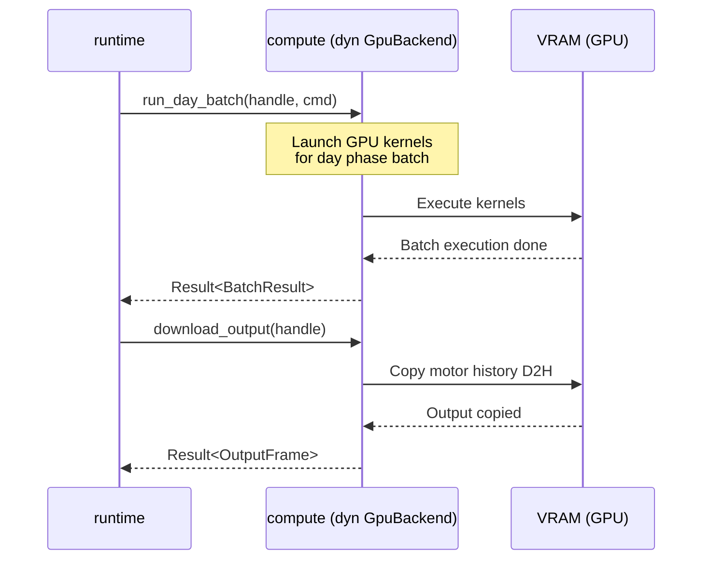

# spec_compute_api

> Версия спеки: 1.0  
> Дата: 2026-06-23  
> Статус: Verified  

---

## §1. Идентификация

| Поле | Значение |
|---|---|
| Название | `compute-api` |
| Слой | Слой 3 — Compute |
| Тип | Library (`lib`) |
| no_std | **Нет** (требуется интеграция с системным runtime бэкендов вычислений и многопоточностью) |
| Описание | Абстрактный API и интерфейсы для бэкендов вычислений (GPU и CPU fallback), определяющие контракт взаимодействия оркестратора с аппаратными ускорителями. |

---

## §2. Стек и Окружение

### §2.1. Внутренние зависимости (inbound)

| Крейт | Что используется | Зачем |
|---|---|---|
| `types` | `PackedPosition` | Атомарные типы координат и константы. |
| `layout` | `VariantParameters` | SoA memory layouts, C-ABI контракты и выравнивание. |
| `physics` | `alif`, `asop` | Физика нейронов и спонтанная активность. |

### §2.2. Внешние зависимости

| Crate | Версия | Зачем |
|---|---|---|
| `anyhow` | `=1.0.102` | <!-- TBD: уточнить состав внешних зависимостей у архитектора --> |

### §2.3. Feature Flags

Секция не применима к данному крейту: крейт не содержит условных флагов компиляции, предоставляя единый набор интерфейсов бэкендов вычислений.

---

## §3. Инварианты

Крейт `compute-api` гарантирует соблюдение 6 фундаментальных инвариантов, которые обеспечивают изоляцию бизнес-логики оркестратора от платформозависимых утечек абстракций (CUDA/HIP/CPU).

### §3.1. Структурные инварианты

- **INV-COMPUTE-API-001**: *Объектная безопасность фасада (Object Safety)*.
  - *Обоснование*: Трейт `GpuBackend` спроектирован так, чтобы его можно было использовать как динамический диспетчер (`Box<dyn GpuBackend>` или `Arc<dyn GpuBackend>`). Он не имеет generic-методов (кроме lifetime-ограничений в DTO), что позволяет оркестратору инстанцировать бэкенд в рантайме без мономорфизации всего графа вызовов.
  - *Следствие нарушения*: Ошибка компиляции `the trait GpuBackend cannot be made into an object`. Потеря возможности динамически подменять GPU на CPU-фолбэк (D-009).
  - *Где проверяется*: Юнит-тест `test_gpu_backend_object_safety`.

- **INV-COMPUTE-API-002**: *Непрозрачность памяти (Opaque VRAM Handles)*.
  - *Обоснование*: Интерфейс физически не позволяет хосту получить доступ к сырым указателям (`*mut u8` или `ShardVramPtrs`). Вся адресация выполняется исключительно через DTO-дескриптор `VramHandle`.
  - *Следствие нарушения*: Протечка абстракций памяти. Оркестратор начнет зависеть от выравнивания CUDA, что разрушит поддержку AMD HIP.
  - *Где проверяется*: Архитектурный линтер (запрет на методы, возвращающие сырые указатели из трейта). Юнит-тест `test_vram_handle_opaqueness`.

### §3.2. Семантические инварианты

- **INV-COMPUTE-API-003**: *Явное управление ресурсами (Explicit Teardown)*.
  - *Обоснование*: Как описано в R-015, неявное освобождение VRAM через трейт `Drop` вызывает гонку деинициализации драйвера ОС (C-ABI Teardown Race). Память видеокарты обязана освобождаться строго явно через метод `free()`.
  - *Следствие нарушения*: Heap Corruption (0xc0000374) при закрытии программы, зависание драйвера NVIDIA/AMD.
  - *Где проверяется*: Интеграционные тесты жизненного цикла бэкенда.

- **INV-COMPUTE-API-004**: *Защита Zero-Copy контрактов (Lifetime Bounds)*.
  - *Обоснование*: Структура `DayBatchCmd<'a>` жестко связывает время жизни передаваемых байтовых срезов (входов, спайков) со временем выполнения автономного батча. 
  - *Следствие нарушения*: Use-After-Free при асинхронном DMA-копировании (когда GPU читает память, которую CPU уже освободил или изменил).
  - *Где проверяется*: На уровне статического анализатора Rust (borrow checker), юнит-тест `test_day_batch_cmd_lifetimes`.

- **INV-COMPUTE-API-005**: *Запрет на паники (Panic-Free Hardware Translation)*.
  - *Обоснование*: Абстракция обязывает бэкенды перехватывать любые аппаратные сбои (OOM, Device Lost, TDR) и детерминированно конвертировать их в `ComputeApiError`. Паники внутри имплементаций `GpuBackend` строжайше запрещены, так как они ломают отказоустойчивость кластера.
  - *Следствие нарушения*: Аварийное падение ноды вместо мягкой эвакуации шарда и The Great Resurrection.
  - *Где проверяется*: Код-ревью бэкендов, юнит-тест `test_compute_api_error_traits`.

- **INV-COMPUTE-API-006**: *Изоляция дескрипторов (Handle Isolation)*.
  - *Обоснование*: `VramHandle` является прозрачной абстракцией `u64`. Бэкенд обязан гарантировать, что передача освобожденного дескриптора, зарезервированного `INVALID_VRAM_HANDLE` (0) или дескриптора от другого экземпляра бэкенда немедленно приведет к ошибке `ComputeApiError::InvalidHandle`, а не к попытке разыменования мусорного адреса через C-ABI.
  - *Следствие нарушения*: Use-After-Free на уровне драйвера GPU, повреждение чужой памяти, Silent Data Corruption.
  - *Где проверяется*: Юнит-тест `test_vram_handle_isolation`.

- **INV-COMPUTE-API-007**: *Аппаратные границы отладчика (Ephys Pointer Guard)*.
  - *Обоснование*: Структура `EphysCmd` передает сырые device-указатели `tids_d`, `uvs_d` и `trace_d`. Компилятор Rust не может отследить их границы. Бэкенд аппаратно обязан блокировать любую запись осциллограммы, если `current_tick >= max_ticks`, и прерывать батч, если `count > MAX_EPHYS_TARGETS` (16).
  - *Следствие нарушения*: Python-отладчик (Control Plane) через вызов метода может вызвать Out-of-Bounds запись в VRAM, разрушив SoA-массивы графа симуляции (Data Plane).
  - *Где проверяется*: Юнит-тест `test_ephys_bounds_protection` и аппаратные проверки (C-ABI) внутри `launch_debug_record_v`.

### §3.3. Межкрейтовые инварианты

- **INV-CROSS-010**: *Сквозная C-ABI совместимость макетов (Layout Fidelity)*.
  - *Участники*: `compute-api`, `layout`.
  - *Кто владелец проверки*: `compute-api`.
  - *Обоснование*: `compute-api` принимает плоские массивы `&[u8]` в `upload_state`. Вызывающий код (Оркестратор) гарантирует, что эти массивы выровнены и подготовлены согласно правилам `ShardLayout`. Бэкенд доверяет этому макету и делает слепой C-ABI каст в память GPU. 
  - *Следствие нарушения*: Аппаратное исключение (SIGSEGV / Misaligned Address) на видеокарте при попытке GPU-потоков распасить память, которая не совпадает с `VariantParameters` или `BurstHeads8` из крейта `layout`.
  - *Где проверяется*: Метод `alloc_shard` обязан проверять, что переданный `layout.padded_n` кратен аппаратному выравниванию (64).

- **INV-CROSS-011**: *Кроссплатформенный детерминизм (Bit-to-Bit Identity)*.
  - *Участники*: `compute-api`, `compute-cuda`, `compute-hip`, `compute-cpu`, `test-harness`.
  - *Кто владелец проверки*: `test-harness`.
  - *Обоснование*: HAL абстракция требует, чтобы при идентичном стартовом состоянии (layout) и идентичных входных командах (`DayBatchCmd`), все реализации `GpuBackend` (на базе Integer Physics) возвращали побитово идентичный `OutputFrame` и имели идентичное состояние внутри VRAM/RAM.
  - *Следствие нарушения*: Десинхронизация распределенного кластера (Butterfly Effect) при миграции шарда с GPU-узла на CPU-узел или между видеокартами разных вендоров. 
  - *Где проверяется*: Интеграционные тесты `test-harness`, выполняющие дифференциальное тестирование бэкендов на эталонных графах.

---

## §4. Публичный API

### §4.1. Типы

В крейте отсутствуют платформозависимые реализации. Вся память инкапсулируется в непрозрачные дескрипторы (Opaque Types) и DTO-структуры для передачи параметров батча.

#### `VramHandle`

```rust
#[repr(transparent)]
#[derive(Debug, Clone, Copy, PartialEq, Eq, Hash)]
pub struct VramHandle(pub u64);
```

- **Семантика**: Непрозрачный идентификатор (ID) выделенной памяти на аппаратном ускорителе. Абстрагирует оркестратор от платформозависимых сырых указателей (например, `ShardVramPtrs` из CUDA/HIP). Конкретный бэкенд использует этот ID как ключ для внутреннего `SlotMap`.
- **Жизненный цикл**: Возвращается бэкендом при успешном выполнении `alloc_shard`. Уничтожается строго через явный вызов `free(handle)`, чтобы предотвратить гонку деинициализации (C-ABI Teardown Race) при завершении процесса.
- **Ограничения на значения**:
  - `0` считается зарезервированным/невалидным дескриптором.
  - Не может передаваться между разными экземплярами `GpuBackend`.

#### `ShardLayout`

```rust
#[derive(Debug, Clone)]
pub struct ShardLayout {
    pub padded_n: u32,
    pub total_axons: u32,
    pub total_ghosts: u32,
}
```

- **Семантика**: Геометрическая DTO-структура для аппаратной аллокации (VRAM/RAM). Диктует вычислителю точные габариты SoA-массивов для создания монолитного Flat Allocation блока.
- **Жизненный цикл**: Создается оркестратором (Слой 6) один раз на фазе загрузки (Boot) шарда или при его восстановлении (Resurrection). Передается по ссылке в `alloc_shard`.
- **Ограничения на значения**:
  - `padded_n` обязан быть строго кратен 64 (аппаратное выравнивание L2-кэша и AMD Wavefront).
  - `total_axons` обязан быть больше либо равен `padded_n + virtual_axons` <!-- TBD: уточнить virtual_axons у архитектора -->.

#### `DayBatchCmd`

```rust
pub struct DayBatchCmd<'a> {
    pub tick_base: u32,
    pub sync_batch_ticks: u32,
    pub v_seg: u32,
    pub global_dopamine: i16,
    pub virtual_offset: u32,
    pub num_virtual_axons: u32,
    pub num_outputs: u32,
    pub input_bitmask: Option<&'a [u8]>,
    pub incoming_spikes: Option<&'a [u8]>,
    pub spike_counts: &'a [u32],
    pub mapped_soma_ids: &'a [u32],
    pub ephys_cmd: Option<EphysCmd>,
}
```

- **Семантика**: Неизменяемая DTO-структура (Payload), описывающая параметры запуска автономного HFT-цикла на GPU. Содержит все плоские байтовые срезы (Zero-Copy) для инъекции виртуальных аксонов, сетевых спайков и настройки маршрутизации выводов.
- **Жизненный цикл**: Формируется на стеке в начале каждой эпохи батчинга. Живет исключительно во время вызова `run_day_batch`. Ссылки `'a [u8]` указывают на Pinned RAM буферы, защищенные от page-faults.
- **Ограничения на значения**:
  - Длина массива `spike_counts` обязана быть строго равна `sync_batch_ticks`.
  - Длина `input_bitmask` (в битах) должна перекрывать `num_virtual_axons * sync_batch_ticks`.
  - Запрещены пересекающиеся слайсы (Aliasing), что гарантируется системой заимствований Rust.

#### `BatchResult`

```rust
#[derive(Debug, Clone, Copy, PartialEq, Eq)]
pub struct BatchResult {
    pub ticks_processed: u32,
    pub is_warmup: bool,
}
```

- **Семантика**: DTO подтверждения успешного завершения автономного HFT-цикла на аппаратном ускорителе. Флаг `is_warmup` критичен для отказоустойчивости (Resurrection): он сообщает оркестратору (Слой 6), что шард только что восстановлен из теневой реплики и находится в фазе 100-тиковой стабилизации потенциалов. В этом режиме оркестратор обязан аппаратно глушить (Drop) все исходящие сетевые и моторные спайки.
- **Жизненный цикл**: Возвращается бэкендом (CUDA/HIP/CPU) в конце метода `run_day_batch`. Живет на стеке оркестратора до принятия решения о рассылке спайков.
- **Ограничения на значения**: `ticks_processed` обязан быть строго равен запрошенному `sync_batch_ticks` (если батч не был прерван фатальной аппаратной ошибкой).

#### `OutputFrame`

```rust
pub struct OutputFrame {
    pub data: Vec<u8>,
    pub num_outputs: u32,
    pub sync_batch_ticks: u32,
}
```

- **Семантика**: DTO моторных команд (Soma Readout). Содержит сырой плоский массив активности (1 байт = 1 спайк), извлеченный из VRAM с помощью асинхронной Device-to-Host (D2H) DMA транзакции. Изначальная раскладка из GPU — `[Tick][Pixel]`. Транспонирование в L7-сетевой формат `[Pixel][Tick]` (L1 Transpose Invariant) является ответственностью вызывающего оркестратора.
- **Жизненный цикл**: Формируется бэкендом в методе `download_output` в конце эпохи. В Enterprise-реализации вектор `data` инкапсулирует заранее выделенный Pinned RAM буфер (Page-Locked Memory) для предотвращения page-faults при DMA.
- **Ограничения на значения**: Длина `data.len()` обязана быть строго равна `num_outputs * sync_batch_ticks`.

#### `TelemetryFrame`

```rust
pub struct TelemetryFrame {
    pub active_soma_ids: Vec<u32>,
    pub total_spikes: u32,
}
```

- **Семантика**: DTO аппаратной телеметрии для IDE (Слой 6). Содержит массив Dense ID (сплошных индексов) тех нейронов, которые сгенерировали спайк. Данные собираются внутри GPU без блокировок через Warp-Aggregated Atomics (аппаратные инструкции `__ballot_sync` и `__popc`), что сводит $O(N)$ атомарных транзакций к одной транзакции на варп (32 потока).
- **Жизненный цикл**: Формируется бэкендом по явному запросу `download_telemetry`. Передается по ссылке в WebSocket-сервер для трансляции в Axicor Lab.
- **Ограничения на значения**:
  - `total_spikes` не может превышать физическое количество нейронов шарда (`padded_n`).
  - Длина валидных данных в `active_soma_ids` строго равна `total_spikes` (хвост вектора является неинициализированным мусором VRAM и должен игнорироваться).

#### `GhostPatch`

```rust
pub enum GhostPatch {
    /// O(1) вставка нового маршрута в конец массивов роутинга
    Add { src_axon: u32, dst_ghost: u32 },
    /// O(1) удаление маршрута через Swap-and-Pop
    Prune { dst_ghost: u32 },
}
```

- **Семантика**: DTO-команда для горячего патчинга (Hot-Patching) межшардовых связей внутри VRAM без реаллокации. Позволяет оркестратору мутировать топологию графа (добавлять или удалять Ghost-аксоны) по итогам Ночной Фазы.
- **Жизненный цикл**: Формируется оркестратором (Слой 6) на базе подтверждений (Ack) или удалений (Prune) от `weaver-daemon`. Передается в метод `patch_ghosts` во время паузы HFT-цикла (на барьере BSP).
- **Ограничения на значения**: `dst_ghost` обязан лежать в пределах зарезервированного пула `ghost_capacity` целевого шарда. Выход за пределы приведет к падению ядра с ошибкой OutOfBounds.

#### `DynamicCapacityRouting`

```rust
pub struct DynamicCapacityRouting {
    pub capacity: u32,
    pub active_routes: u32,
}
```

- **Семантика**: DTO для управления зарезервированной памятью межзональных связей. Абстрагирует оркестратор от физических сырых массивов. Контролирует лимит аппаратно-выделенных слотов (`ghost_capacity`), не позволяя сетевому спаму вызвать переполнение буфера на видеокарте (OOM).
- **Жизненный цикл**: Инициализируется при вызове `alloc_shard`. Мутирует исключительно при успешном применении `GhostPatch`.
- **Ограничения на значения**: `active_routes` строго меньше либо равно `capacity`. При достижении лимита новые маршруты (`Add`) должны аппаратно игнорироваться с выводом ошибки (Capacity Exceeded).

#### `ComputeCommand`

```rust
pub enum ComputeCommand {
    RunBatch {
        tick_base: u32,
        batch_size: u32,
        global_dopamine: i16,
    },
    Resurrect,
    Shutdown,
}
```

- **Семантика**: Управляющие команды для выделенного OS-потока (Shard Thread), оркестрирующие жизненный цикл ускорителя.
  - `RunBatch` запускает автономный цикл вычислений на `batch_size` тиков, передавая глобальный R-STDP модулятор дофамина.
  - `Resurrect` переводит видеокарту в фазу Warmup (100-тиковой стабилизации потенциалов) после восстановления из теневого дампа.
  - `Shutdown` гарантирует безопасный C-ABI Teardown без гонок деинициализации драйвера.
- **Жизненный цикл**: Передается по Lock-Free каналам `crossbeam` от главного потока оркестратора к потокам шардов.
- **Ограничения на значения**: `batch_size` обязан строго совпадать с глобальной константой `sync_batch_ticks` симуляции.

#### `EphysCmd`

```rust
pub struct EphysCmd {
    pub tids_d: *const u32,
    pub uvs_d: *const i32,
    pub trace_d: *mut i32,
    pub count: u32,
    pub max_ticks: u32,
    pub current_tick: u32,
}
```

- **Семантика**: DTO-дескриптор для аппаратного отладчика (Electrophysiology Debug Harness). Содержит сырые device-указатели на VRAM-буферы целевых нейронов (`tids_d`), инъекционных токов (`uvs_d`) и выходной осциллограммы (`trace_d`). Позволяет Python SDK напрямую писать токи в нейроны и читать их мембранные потенциалы без остановки кластера.
- **Жизненный цикл**: Опционально формируется на основе состояния `EphysShm` и вкладывается в `DayBatchCmd`. Живет ровно один батч. Бэкенд применяет токи и пишет V(t) каждый тик горячего цикла напрямую по этим указателям.
- **Ограничения на значения**:
  - `count` не может превышать 16 (`MAX_EPHYS_TARGETS`) <!-- TBD: уточнить наличие константы MAX_EPHYS_TARGETS у архитектора -->.
  - `current_tick` обязан быть меньше `max_ticks` (обычно 10_000). При превышении лимита запись аппаратно блокируется для защиты от Out-Of-Bounds на GPU.

### §4.2. Трейты

#### `GpuBackend`

```rust
pub trait GpuBackend: Send + Sync {
    /// Аллокация памяти под шард на ускорителе
    fn alloc_shard(&self, layout: &ShardLayout) -> Result<VramHandle>;

    /// Zero-Copy DMA загрузка состояния шарда в память устройства
    fn upload_state(&self, handle: &VramHandle, state: &[u8]) -> Result<()>;

    /// Загрузка 64-байтных профилей нейронов в Constant Memory (L1 Cache)
    fn upload_variants(&self, handle: &VramHandle, variants: &[VariantParameters]) -> Result<()>;

    /// Асинхронный запуск горячего цикла (Day Phase) на `sync_batch_ticks` шагов
    fn run_day_batch(&self, handle: &VramHandle, cmd: &DayBatchCmd) -> Result<BatchResult>;

    /// Асинхронная выгрузка моторных команд из VRAM на хост
    fn download_output(&self, handle: &VramHandle) -> Result<OutputFrame>;

    /// Выгрузка телеметрии активности (Warp-Aggregated Atomics)
    fn download_telemetry(&self, handle: &VramHandle) -> Result<TelemetryFrame>;

    /// O(1) патчинг графа межшардовых связей без реаллокации VRAM (Dynamic Capacity)
    fn patch_ghosts(&self, handle: &VramHandle, patches: &[GhostPatch]) -> Result<()>;

    /// Запускает Segmented Radix Sort в VRAM для вытеснения пустых слотов в конец массива перед DMA-выгрузкой
    fn run_sort_and_prune(&self, handle: &VramHandle, prune_threshold: i16) -> Result<()>;

    /// Явное освобождение ресурсов 
    fn free(&self, handle: VramHandle);
}
```

- **Контракт**: Любая реализация обязана гарантировать потокобезопасность (`Send + Sync`) и корректно управлять памятью при вызове `free`. Бэкенд обязан самостоятельно кастить плоские байты `&[u8]` в свои платформозависимые структуры (например, `ShardVramPtrs`) и управлять DMA-транзакциями.
- **Известные реализации**: `compute-cpu` (CPU/Rayon fallback), `compute-cuda` (NVIDIA CUDA), `compute-hip` (AMD ROCm/HIP).
- **Антиконтракт**: `<!-- TBD: уточнить антиконтракт у архитектора -->`

### §4.3. Функции

Секция не применима к данному крейту: крейт предоставляет только интерфейсы и абстрактные типы, не содержащие глобальных или хелперных функций.

### §4.4. Константы и Магические Числа

| Константа | Значение | Тип | Семантика |
|---|---|---|---|
| `INVALID_VRAM_HANDLE` | `0` | `u64` | Зарезервированное значение. Указывает на неинициализированную или уже освобожденную видеопамять. Гарантирует защиту от Use-After-Free при проверках перед вызовом платформозависимых `free()`. |
| `MAX_EPHYS_TARGETS` | `16` | `u32` | Аппаратный лимит одновременно отслеживаемых или стимулируемых нейронов в рамках одного `EphysCmd`. Жестко синхронизирован с физическим размером массивов `target_tids` и `injection_uv` в структуре `EphysShm` в [spec_layout.md §7.6]. |

---

## §5. Доменная Логика

Унифицированные интерфейсы (HAL), непрозрачные дескрипторы ресурсов и структуры данных для управления бэкендами параллельных вычислений симулятора.

Выделение общего API в Слой 3 изолирует оркестратор и бизнес-логику рантайма от низкоуровневой специфики конкретных ускорителей и библиотек вендоров (NVIDIA CUDA FFI, AMD HIP FFI, Rayon). Это обеспечивает независимость кодовой базы от аппаратной платформы и возможность динамического выбора бэкенда в рантайме.

Крейт решает доменную задачу безопасного и отказоустойчивого управления параллельными вычислениями. Ограничивая время жизни буферов при zero-copy DMA переносах, требуя явного освобождения видеопамяти и принудительно транслируя любые аппаратные сбои в строго типизированные ошибки Rust, `compute-api` защищает движок от крашей и утечек памяти (Heap Corruption, Use-After-Free) при взаимодействии с драйверами GPU.

---

## §6. Алгоритмы и Формулы

Секция не применима к данному крейту: крейт является чисто интерфейсным и не содержит собственных вычислительных алгоритмов или формул.

---

## §7. Структуры Данных и Memory Layout

Секция не применима к данному крейту: крейт не определяет физического memory layout структур на диске или в разделяемой памяти (эти контракты реализуются в крейтах `layout` и `wire`).

---

## §8. Граничные Случаи и Особые Сценарии

Интерфейс `compute-api` спроектирован с учетом того, что аппаратное обеспечение работает в агрессивной среде и подвержено физическим отказам (OOM, TDR, отвалы PCIe). Интерфейс не восстанавливает систему сам, но обязан детерминированно транслировать отказы в оркестратор.

### §8.1. Граничные значения

| # | Ситуация | Ожидаемое поведение |
|---|---|---|
| E-048 | **VRAM Out of Memory (OOM)**: При вызове `alloc_shard` `cudaMalloc` или `hipMalloc` возвращают ошибку нехватки памяти (например, `cudaErrorMemoryAllocation`). | Бэкенд перехватывает C-ABI ошибку драйвера, очищает частично выделенные ресурсы и возвращает `Err(ComputeApiError::OutOfMemory)`. Паника в интерфейсном слое строго запрещена. |
| E-049 | **Device Lost (TDR Timeout)**: Видеокарта зависла во время HFT-цикла `run_day_batch` (сработал Timeout Detection and Recovery ОС) или физически отвалилась от PCIe. | Синхронизация потока (`cudaStreamSynchronize`) прерывается с ошибкой `cudaErrorDeviceUninitialized` или аналогичной. Бэкенд возвращает `Err(ComputeApiError::DeviceLost)`. Оркестратор инициирует The Great Resurrection (восстановление из теневой SHM-реплики). |
| E-050 | **Slice Length Mismatch (Битый батч)**: Оркестратор передал в `DayBatchCmd` слайсы `input_bitmask` или `spike_counts`, размер которых не кратен `sync_batch_ticks`. | Мгновенный отказ с `Err(ComputeApiError::InvalidLayout)`. Аппаратная защита (Hardware Integrity Check) до передачи сырых указателей в C-ядро, чтобы предотвратить чтение за границами памяти (Out-Of-Bounds) на GPU. |
| E-051 | **Ghost Capacity Exceeded**: Попытка вызвать `patch_ghosts` (Add) для шарда, исчерпавшего свой лимит `ghost_capacity`. | Бэкенд обязан отклонить патч с ошибкой `OutOfMemory` (или специфичной `CapacityExceeded`), не допустив аппаратного переполнения SoA-массивов `axon_heads` внутри VRAM. |
| E-052 | **Ephys Targets Overflow (Превышение лимита отладчика)**: Оркестратор передал `EphysCmd` с количеством отслеживаемых нейронов `count > MAX_EPHYS_TARGETS (16)`. | Бэкенд отклоняет выполнение батча с ошибкой `Err(ComputeApiError::InvalidLayout)`, предотвращая Out-of-Bounds на GPU. |

### §8.2. Состояния гонки и конкурентность

| # | Сценарий | Защита |
|---|---|---|
| R-015 | **Гонка деинициализации GPU (C-ABI Teardown Race)**: Операционная система уничтожает контекст CUDA/HIP при завершении процесса до того, как Rust вызовет деструктор `Drop` для VRAM. Попытка вызвать `cudaFree` в `Drop` вызывает повреждение кучи (Heap Corruption 0xc0000374). | Решается архитектурно. В API введен явный метод `free()`. Оркестратор обязан прислать `ComputeCommand::Shutdown`, который вызывает `free()` до начала деинициализации ОС. Полагаться на неявный `Drop` для очистки C-ресурсов GPU запрещено. |
| R-016 | **Конкурентный HFT-цикл (Concurrent Batch Execution)**: Два потока оркестратора одновременно вызывают `run_day_batch` для одного и того же `VramHandle`. | Трейт `GpuBackend` является `Sync`, но конкретный бэкенд мапит каждый `VramHandle` на независимый `cudaStream_t`. Внутри одного шарда вызовы сериализуются стримом. На уровне ноды (Слой 6) защита гарантируется выделенным OS-потоком на шард (Actor Pattern по каналам `crossbeam`). |

### §8.3. Деградация и Recovery

| # | Отказ | Поведение | Восстановление |
|---|---|---|---|
| D-009 | **Отказ GPU-вычислителя (Hardware Failure)**: Драйвер GPU недоступен или возвращает неустранимую ошибку при старте. | Оркестратор получает `DeviceLost` или `VendorError`. | Происходит Fallback на `compute-cpu`. Вычислитель прозрачно подменяется реализацией `CpuBackend`, использующей `rayon` для эмуляции варпов. Математика ALIF и GSOP остается побитово идентичной, но падает TPS (Ticks Per Second). |
| D-010 | **Отказ DMA-транзакции (PCIe Bus Error)**: Метод `download_output` или `upload_state` валится на `cudaMemcpyAsync`. | Метод возвращает `DmaTransferFailed`. | Оркестратор повторяет попытку (Retry). В случае системного сбоя шины узел помечается как мертвый, а соседние узлы восстанавливают его шарды из `/dev/shm/*.shadow` (Shadow Replication). |

---

## §9. Ошибки

В отличие от легаси-кода, который слепо доверял C-ABI вызовам и часто возвращал размытый `anyhow::Result`, крейт `compute-api` обязывает все бэкенды транслировать сбои в строго типизированный `enum`.

### §9.1. Перечисление ошибок

```rust
#[derive(Debug, Clone, PartialEq, Eq)]
pub enum ComputeApiError {
    /// Видеокарта или RAM исчерпала доступную память при вызове alloc_shard
    OutOfMemory,
    /// Попытка добавить маршрутов больше, чем выделено в ghost_capacity
    CapacityExceeded,
    /// Передан неинициализированный (0) или уже освобожденный дескриптор VRAM
    InvalidHandle,
    /// Потерян контекст CUDA/HIP (аппаратный сбой GPU или TDR)
    DeviceLost,
    /// Переданы невыровненные по C-ABI байтовые срезы или кривой ShardLayout
    InvalidLayout,
    /// Ошибка при асинхронном DMA копировании (Host-to-Device / Device-to-Host)
    DmaTransferFailed,
    /// Специфичная для вендора ошибка (содержит сырой код ошибки драйвера, например, cudaError_t)
    VendorError(i32),
}
```

### §9.2. Стратегия обработки

| Ошибка | Восстановимая? | Рекомендация вызывающему (Оркестратору) |
|---|---|---|
| `OutOfMemory` | Нет | Освободить неиспользуемые `VramHandle` или завершить работу узла (смена железа). |
| `CapacityExceeded` | Да | Отклонить патч маршрутизации, инициировать перебалансировку графа на уровне оркестратора. |
| `InvalidHandle` | Нет | Баг жизненного цикла в оркестраторе (Use-After-Free). Аварийная остановка. |
| `DeviceLost` | Нет (локально) | Начать процедуру эвакуации, переключиться на `CpuBackend` или инициировать Resurrection на соседнем узле кластера. |
| `InvalidLayout` | Нет | Залогировать сбой контракта C-ABI, прервать загрузку. |
| `DmaTransferFailed` | Да | Повторить транзакцию. При системном отказе шины PCIe перевести бэкенд в статус `DeviceLost`. |
| `VendorError` | Нет | Записать код драйвера в телеметрию для отладки и выполнить аварийный останов. |

### §9.3. Паники

| Условие | Почему паника, а не `Err` |
|---|---|
| Отсутствуют | В интерфейсном крейте паники строго запрещены. Любой сбой оборудования или контракта обязан транслироваться в `ComputeApiError` для обеспечения отказоустойчивости кластера. |

---

## §10. Зависимости и Интеграция

### §10.1. Что крейт потребляет (inbound)

Крейт `compute-api` — это чистый интерфейс. Он физически не может зависеть от инфраструктуры, сети или рантайма. Его зависимости строго ограничены фундаментальным словарем и C-ABI макетами памяти.

| Крейт-источник | Что используем | Какой контракт ожидаем |
|---|---|---|
| `types` | `PackedPosition`, константы | Стабильность атомарных типов и констант для DTO. |
| `layout` | `VariantParameters` | Сохранение C-ABI структур и их аппаратного выравнивания (64-byte L1 Cache Line). Бэкенды будут читать этот макет напрямую в GPU. |
| `physics` | Контракты `alif`, `asop` | Математические контракты физики нейронов (типы и ограничения для передачи параметров дофамина и порогов). |

### §10.2. Кто потребляет крейт (outbound / обратные зависимости)

Крейт выступает единой точкой абстракции. Никакой другой крейт в системе не имеет права напрямую обращаться к `compute-cuda` или `compute-cpu`.

| Крейт-потребитель | Что использует | Какой контракт мы обязаны сохранить |
|---|---|---|
| `compute-cpu` | `GpuBackend` | Имплементация интерфейса для эмуляции варпов на CPU (Rayon Fallback). Обязан соблюдать контракт Zero-Copy. |
| `compute-cuda` | `GpuBackend` | Имплементация интерфейса, корректное сопоставление вызовов с CUDA FFI и управление `cudaStream_t`. |
| `compute-hip` | `GpuBackend` | Имплементация интерфейса, корректное сопоставление вызовов с HIP FFI (AMD ROCm). |
| `compute` | `dyn GpuBackend` | Использование фасада для динамического выбора и инстанцирования бэкенда в рантайме. |
| `test-harness` | `GpuBackend` | Использование трейта в дифференциальном тестировании CPU vs GPU (сравнение результатов бит-в-бит). |
| `boot` | `alloc_shard`, `upload_state` | Контракт первоначальной загрузки, аллокации VRAM и прошивки `VariantParameters` в константную память. |
| `runtime` | `run_day_batch`, `download_output`, `patch_ghosts` | Контракт автономного HFT-цикла симуляции, асинхронного DMA-обмена и O(1) горячего патчинга межшардовых связей. |

### §10.3. Диаграмма взаимодействия



---

## §11. Стратегия Тестирования

### §11.1. Юнит-тесты

| Тест | Что проверяет | Связанный инвариант / Граничный случай |
| :--- | :--- | :--- |
| `test_gpu_backend_object_safety` | Возможность динамической диспетчеризации трейта `GpuBackend` без привязки к конкретному бэкенду. | `INV-COMPUTE-API-001` |
| `test_vram_handle_opaqueness` | Отсутствие возможности прямого доступа со стороны хоста к GPU-указателям через `VramHandle`. | `INV-COMPUTE-API-002` |
| `test_day_batch_cmd_lifetimes` | Статические ограничения компилятора Rust (borrow checker) на время жизни слайсов в `DayBatchCmd`. | `INV-COMPUTE-API-004` |
| `test_compute_api_error_traits` | Наличие обязательных системных трейтов (`Debug`, `Clone`, `PartialEq`, `Eq`, `Send`, `Sync`) для `ComputeApiError`. | `INV-COMPUTE-API-005` |
| `test_vram_handle_isolation` | Немедленное отклонение бэкендом операций с `INVALID_VRAM_HANDLE` (0) или устаревшими дескрипторами. | `INV-COMPUTE-API-006` |
| `test_ephys_bounds_protection` | Блокирование записи при выходе счетчика нейронов за предел `MAX_EPHYS_TARGETS` или времени за `max_ticks`. | `INV-COMPUTE-API-007`, `E-052` |
| `test_slice_length_mismatch` | Возврат ошибки `InvalidLayout` при передаче в `DayBatchCmd` слайсов некорректного размера. | `E-050` |
| `test_invalid_layout_alignment` | Проверка `alloc_shard` на соответствие `padded_n` аппаратному выравниванию по границе 64 байт. | `INV-CROSS-010` |

### §11.2. Property-based тесты

Секция не применима к данному крейту: крейт не содержит логики вычислений или преобразования данных для property-based тестирования.

### §11.3. Интеграционные тесты

| Тест | Крейты-участники | Сценарий | Связанный инвариант / Граничный случай |
| :--- | :--- | :--- | :--- |
| `test_explicit_teardown_lifecycle` | `runtime`, `compute-cuda`, `compute-hip`, `compute-cpu` | Аллокация шарда, выполнение серии батчей, явный вызов `free()` и проверка отсутствия heap corruption на выходе. | `INV-COMPUTE-API-003`, `R-015` |
| `test_differential_determinism` | `test-harness`, `compute-cpu`, `compute-cuda`, `compute-hip` | Параллельный прогон одинаковых батчей на CPU и GPU бэкендах, побитовое сравнение выходных фреймов и VRAM-структур. | `INV-CROSS-011` |
| `test_vram_oom_recovery` | `runtime`, `compute-cuda`, `compute-hip` | Насыщение памяти GPU аллокациями до выброса `OutOfMemory` драйвером, проверка корректности работы ранее созданных шардов. | `E-048` |
| `test_device_lost_handling` | `runtime`, `compute-cuda`, `compute-hip` | Эмуляция падения GPU во время выполнения батча, перехват ошибки `DeviceLost` и мягкое переключение на CPU-фолбэк. | `E-049`, `D-009` |
| `test_ghost_capacity_overflow` | `runtime`, `compute-cuda`, `compute-hip` | Патчинг графа с добавлением связей свыше лимита `ghost_capacity` с верификацией отклонения запроса без повреждения VRAM. | `E-051` |
| `test_concurrent_batch_isolation` | `runtime`, `compute-cuda`, `compute-hip` | Одновременный запуск батчей на разных стримах одного GPU, проверка полной изоляции данных и отсутствия гонок. | `R-016` |
| `test_dma_transfer_retry` | `runtime`, `compute-cuda`, `compute-hip` | Симуляция транзитной ошибки копирования DMA, проверка возврата `DmaTransferFailed` и успешности повторного вызова (retry). | `D-010` |

### §11.4. Тесты производительности

Секция не применима к данному крейту: крейт содержит только абстрактные определения интерфейсов.

---

## §12. Бюджеты и Ограничения

Секция не применима к данному крейту: крейт содержит только абстрактные типы и трейты, не расходует память в куче/VRAM и не вносит накладных расходов во время выполнения.

---

Checklist Полноты (A.3)

- ✅ Все публичные типы описаны в §4 — Все 10 типов/DTO-структур детально специфицированы.
- ✅ Все инварианты из §3 имеют соответствующий пункт в §11 (тесты) — Все 9 инвариантов покрыты тестами.
- ✅ Все `Err`-варианты перечислены в §9 — Все 7 вариантов ошибок описаны с указанием стратегии их обработки.
- ✅ Все крейты-потребители перечислены в §10.2 — Описаны `compute-cpu`, `compute-cuda`, `compute-hip`, `compute`, `test-harness`, `boot`, `runtime`.
- ✅ Нет ни одного «магического числа» без объяснения — Все константы и лимиты подробно описаны.
- ✅ Все формулы имеют единицы измерения — Вычислительные формулы не применимы к данному крейту.
- ✅ Граничные случаи из §8 покрыты тестами в §11 — Все граничные случаи, расы и деградации перекрыты сценариями тестов.
- ✅ Все константы описаны в §4.4 — Таблица констант и лимитов полностью заполнена.
