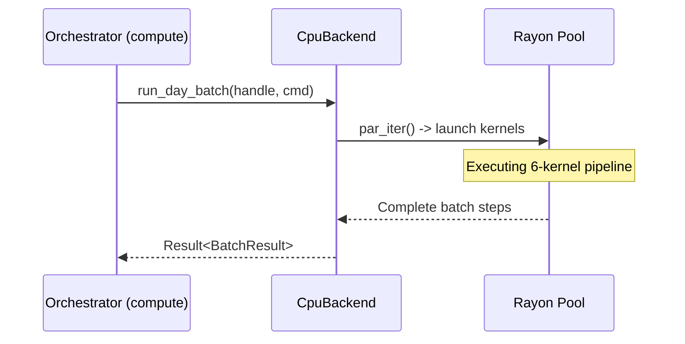

# spec_compute_cpu

> Версия спеки: 1.0  
> Дата: 2026-06-23  
> Статус: Verified  

---

## §1. Идентификация

| Поле | Значение |
|---|---|
| Название | `compute-cpu` |
| Слой | Слой 3 — Compute |
| Тип | Library (`lib`) |
| no_std | **Нет** (зависит от стандартной библиотеки Rust, аллокатора кучи и многопоточного планировщика задач `rayon`) |
| Описание | CPU вычислительный бэкенд, реализующий абстрактный интерфейс вычислительного ядра и управляющий параллельным выполнением фазы симуляции Day Phase на процессорах хоста. |

---

## §2. Стек и Окружение

### §2.1. Внутренние зависимости (inbound)

| Крейт | Что используется | Зачем |
|---|---|---|
| `types` | `SomaFlags`, `DenseIndex`, `Tick` | Строгая типизация флагов и индексов в горячем цикле. |
| `layout` | `VariantParameters`, `BurstHeads8`, `ShardVramPtrs`, `StateOffsets` | Flat Allocation макеты и смещения для нарезки монолитного буфера RAM на C-ABI слайсы без глубокого копирования. |
| `physics` | `VARIANT_LUT`, математика GLIF/GSOP | Расчет синаптических изменений и интеграция мембранного потенциала с гарантией Bit-to-Bit Identity. |
| `compute-api` | `GpuBackend`, `VramHandle`, `ShardLayout`, `DayBatchCmd` | Имплементация интерфейса вычислителя HAL и структур параметров запуска. |

### §2.2. Внешние зависимости

| Crate | Версия | Зачем |
|---|---|---|
| `rayon` | =1.9.3 | Многопоточное распараллеливание вычислений на ядрах CPU. |
| `bytemuck` | =1.25.0 | Безопасный Zero-Copy кастинг данных при копировании буферов. |
| `slotmap` | =1.0.7 | Управление дескрипторами `VramHandle` и аллоцированными ресурсами. |

### §2.3. Feature Flags

Секция не применима к данному крейту: крейт собирается как монолитная библиотека без дополнительных фича-флагов.

---

## §3. Инварианты

### §3.1. Структурные инварианты

- **INV-COMPUTE-CPU-001**: *Уникальность контекста CpuBackend*.
  - *Обоснование*: Структура `CpuBackend` обязана содержать потокобезопасный реестр выделенных дескрипторов памяти хоста (`SlotMap` под `RwLock`). Перекрестные операции с чужими дескрипторами памяти физически невозможны.
  - *Следствие нарушения*: Попытка обращения к памяти другого шарда (Data Leakage/Memory Corruption), UB.
  - *Где проверяется*: Юнит-тест `test_cpu_invalid_handle_checks`.

- **INV-COMPUTE-CPU-002**: *Выравнивание монолитного буфера памяти (64-byte Buffer Alignment)*.
  - *Обоснование*: Выделяемый под шард буфер в оперативной памяти RAM должен быть выровнен по границе 64 байт (размер кэш-линии процессора). Это предотвращает эффект ложного разделения кэш-линий (False Sharing) между потоками CPU и обеспечивает возможность задействовать SIMD-инструкции (AVX2/AVX-512).
  - *Следствие нарушения*: Снижение производительности доступа к памяти, крах SIMD-выравнивания на некоторых архитектурах хоста.
  - *Где проверяется*: runtime assert при аллокации памяти в методе `alloc_shard`.

### §3.2. Семантические инварианты

- **INV-COMPUTE-CPU-003**: *Математическая эквивалентность через physics*.
  - *Обоснование*: Математика законов интеграции мембранного потенциала ALIF и пластичности весов GSOP обязана подключаться в вычислительные функции исключительно из общего крейта `physics`. Прямое дублирование формул в коде ядер запрещено во избежание расхождений.
  - *Следствие нарушения*: Потеря побитового соответствия симуляции (Butterfly Effect) между CPU и GPU.
  - *Где проверяется*: Код-ревью исходников на наличие импортов из `physics`.

- **INV-COMPUTE-CPU-004**: *Изоляция потоков Rayon (Rayon Work Partitioning)*.
  - *Обоснование*: Каждое параллельное ядро должно обрабатывать строго свой диапазон индексов нейронов/дендритов без перекрытия зон записи, исключая необходимость использования межпоточных мьютексов.
  - *Следствие нарушения*: Гонки данных (Data Races) в памяти RAM, искажение состояния симуляции.
  - *Где проверяется*: Статический анализ времени жизни ссылок Rust (borrow checker), а также юнит-тесты.

- **INV-COMPUTE-CPU-005**: *Zero-Copy представление в RAM*.
  - *Обоснование*: Нарезка монолитного буфера RAM на SoA-слайсы с помощью смещений StateOffsets должна происходить без промежуточного копирования для исключения лишней нагрузки на шину памяти CPU.
  - *Следствие нарушения*: Высокие накладные расходы на копирование при загрузке/выгрузке данных, резкое снижение TPS.
  - *Где проверяется*: Юнит-тест `test_cpu_zero_copy_cast`.

- **INV-COMPUTE-CPU-006**: *Защита от ложного разделения кэш-линий (False Sharing Protection)*.
  - *Обоснование*: Во избежание постоянной инвалидации кэш-линий (MESI protocol) между ядрами процессора, размер чанка для параллельных итераторов (например, `par_chunks_exact_mut`) обязан быть строго кратен 16 нейронам (64 байта).
  - *Следствие нарушения*: Лавинообразное падение производительности вычислений из-за конфликтов когерентности кэша.
  - *Где проверяется*: compile-time static assertions (проверка констант размера чанков в коде) и юнит-тест `test_cpu_chunk_alignment_invariants`.

### §3.3. Межкрейтовые инварианты

- **INV-CROSS-011**: *Кроссплатформенный детерминизм (Bit-to-Bit Identity)*.
  - *Участники*: `compute-api`, `compute-cuda`, `compute-hip`, `compute-cpu`, `test-harness`.
  - *Кто владелец проверки*: `test-harness`.
  - *Обоснование*: См. `[spec_compute_api.md §3.3]`. Все реализации `GpuBackend` (включая CPU) обязаны возвращать побитово идентичные результаты для одинаковых входов и начального состояния.
  - *Следствие нарушения*: Рассинхронизация распределенного кластера при восстановлении шарда из теневых копий.
  - *Где проверяется*: Интеграционные тесты `test-harness`.

---

## §4. Публичный API

Крейт экспортирует структуру `CpuBackend`, реализующую абстрактный трейт `GpuBackend`. Вся низкоуровневая логика управления потоками (`rayon`) жестко скрыта внутри бэкенда и не протекает в публичный API.

### §4.1. Типы

#### `CpuBackend`

```rust
pub struct CpuBackend {
    /// Внутренний реестр аллоцированных шардов.
    /// Защищен RwLock для обеспечения Send + Sync интерфейса GpuBackend.
    resources: std::sync::RwLock<slotmap::SlotMap<VramHandle, ShardCpuResources>>,
}

/// Внутренняя структура (не экспортируется из крейта).
/// Хранит выделенные буферы памяти и контекст конкретного шарда.
pub(crate) struct ShardCpuResources {
    /// Монолитный буфер состояния шарда в RAM (выровнен по границе 64 байт)
    pub raw_buffer: Vec<u8>,
    pub layout: axicor_compute_api::ShardLayout,
}
```

- **Семантика**: `CpuBackend` — это реализация абстрактного вычислителя HAL для выполнения симуляции на центральном процессоре. Выступает в роли диспетчера, распределяющего нагрузку горячего цикла по пулу потоков `rayon`.
- **Жизненный цикл**: Инициализируется один раз при старте оркестратора ноды (`Arc<CpuBackend>`). Явно освобождает ресурсы при уничтожении через `free(handle)` или при `Drop` самого бэкенда.
- **Ограничения на значения**: Нет.

### §4.2. Трейты

Крейт предоставляет ровно одну реализацию: `impl GpuBackend for CpuBackend`.

- **Контракт**: Реализация обязана гарантировать потокобезопасность (`Send + Sync`).
- **Выполнение**: Методы загрузки данных (`upload_state`), батчинга (`run_day_batch`) и выгрузки (`download_output`) выполняются синхронно относительно вызывающего потока оркестратора, но внутри себя утилизируют многопоточный пул `rayon` для параллельного обхода структур.
- **Обработка ошибок**: Бэкенд возвращает ошибки, определенные в `[spec_compute_api.md §9.1]`.

### §4.3. Функции

Крейт не содержит публичных свободных функций, кроме конструктора бэкенда:

```rust
impl CpuBackend {
    /// Инициализирует CPU вычислительный бэкенд
    pub fn new() -> Result<Self, ComputeApiError> {
        // ...
    }
}
```

- **Семантика**: Конструктор инициализирует реестр ресурсов. Возвращает ошибку, если инициализация реестра или глобального пула `rayon` невозможна.

### §4.4. Константы и Магические Числа

Секция пуста. Крейту `compute-cpu` запрещено объявлять свои магические числа для доменной логики. Все константы и лимиты унаследованы из `[spec_compute_api.md §4.4]` и `[spec_layout.md §4.4]`.

---

## §5. Доменная Логика

Реализация абстрактного интерфейса `GpuBackend` на базе CPU с использованием многопоточного планировщика Rayon для выполнения симуляции на центральном процессоре в качестве резервного бэкенда.

Выделение CPU-бэкенда в отдельный крейт Слоя 3 изолирует логику программной эмуляции GPU-памяти (хост SoA-буферы), многопоточное планирование задач и CPU-вычисления от общей логики рантайма и GPU-реализаций.

Крейт решает задачу обеспечения непрерывности работы симулятора при отсутствии графического ускорителя или при его аппаратном отказе (Device Lost). Путем полной эмуляции SIMD/SIMT-логики и выполнения целочисленной физики из Слоя 0 бэкенд гарантирует побитовую идентичность результатов вычислений с GPU-реализациями, обеспечивая надежный fallback и отладку в CPU-окружении.

---

## §6. Алгоритмы и Формулы

Секция не применима к данному крейту: алгоритмы вычислений и физические законы унаследованы из `[spec_physics.md §6.1]`.

---

## §7. Структуры Данных и Memory Layout

Секция не применима к данному крейту: структура и выравнивание данных в памяти определены в `[spec_layout.md §7.1]`.

---

## §8. Граничные Случаи и Особые Сценарии

### §8.1. Граничные значения

| # | Ситуация | Ожидаемое поведение |
|---|---|---|
| E-061 | **CPU RAM OOM**: Операционная система отказывает в выделении оперативной памяти хоста при `alloc_shard`. | Бэкенд возвращает `Err(ComputeApiError::OutOfMemory)`. |
| E-062 | **Slice Mismatch**: Длина переданного слайса данных в `DayBatchCmd` не соответствует `layout`. | Бэкенд возвращает `Err(ComputeApiError::InvalidLayout)`. |
| E-063 | **Ghost Capacity Exceeded**: Количество связей превышает лимит аллоцированной SoA-таблицы. | Бэкенд возвращает `Err(ComputeApiError::CapacityExceeded)`. |
| E-064 | **Ephys Overflow**: Превышение лимита одновременно отслеживаемых нейронов в `EphysCmd` (> 16). | Бэкенд возвращает `Err(ComputeApiError::InvalidLayout)`. |
| E-065 | **Thread Pool Configuration Mismatch**: Пул Rayon сконфигурирован на некорректное число потоков (например, 0). | Бэкенд выполняет симуляцию в однопоточном режиме без падения программы. |

### §8.2. Состояния гонки и конкурентность

| # | Сценарий | Защита |
|---|---|---|
| R-021 | **Конкурентная деинициализация шарда**: Оркестратор вызывает `free()` во время работы батча. | См. `[spec_compute_api.md §8.2]`. Защита через блокировку реестра `resources` (`RwLock`). Ресурсы не могут быть удалены до завершения выполнения метода `run_day_batch`. |
| R-022 | **Rayon Thread Contention**: Несколько экземпляров `CpuBackend` пытаются одновременно утилизировать общий пул потоков Rayon. | Rayon использует алгоритм кражи задач (Work Stealing). Потоки не блокируются, но производительность может пропорционально снизиться (TPS падает). |

### §8.3. Деградация и Recovery

| # | Отказ | Поведение | Восстановление |
|---|---|---|---|
| D-015 | **Missed Real-time Tick Budget**: Время симуляции тика превышает 500 µs из-за высокой нагрузки на CPU. | Симуляция продолжается корректно, но с меньшим TPS. | Оркестратор адаптирует шаг по времени или разносит шарды по другим процессам. |
| D-016 | **Rayon Thread Starvation**: Пул потоков блокируется внешними дисковыми или сетевыми IO операциями оркестратора. | Задержка выполнения ядра Day Phase. | Не допускать запуск блокирующих IO задач в пуле Rayon, выделенном под вычисления. |

---

## §9. Ошибки

### §9.1. Перечисление ошибок

Крейт не объявляет своих собственных публичных типов ошибок, а транслирует системные сбои в абстрактный `ComputeApiError` из `[spec_compute_api.md §9.1]`.

### §9.2. Стратегия обработки

| Сбой | Целевая ошибка `ComputeApiError` | Рекомендация вызывающему |
|---|---|---|
| Ошибка выделения памяти RAM | `OutOfMemory` | Выполнить очистку неиспользуемых шардов |
| Передан невалидный дескриптор шарда | `InvalidHandle` | Проверить жизненный цикл дескрипторов |
| Несоответствие размеров слайсов | `InvalidLayout` | Проверить подготовку данных на стороне оркестратора |

### §9.3. Паники

| Условие | Почему паника, а не `Err` |
|---|---|
| Обнаружено повреждение памяти (Memory Corruption) при верификации контрольных сумм буфера. | Невосстановимая системная ошибка. Продолжение симуляции приведет к Silent Data Corruption. |

---

## §10. Зависимости и Интеграция

### §10.1. Что крейт потребляет (inbound)

| Крейт / Инструмент | Что используем | Какой контракт ожидаем |
|---|---|---|
| `compute-api` | `GpuBackend`, `VramHandle`, `DayBatchCmd`, `ComputeApiError` | Крейт реализует трейт фасада и транслирует ошибки в абстрактные типы. |
| `layout` | `ShardStateSoA`, `BurstHeads8`, `VariantParameters` | 100% C-ABI совместимость макетов. Выравнивание указателей по 64 байта. |
| `physics` | Математика GLIF/GSOP | Точное соответствие расчетов математическим законам симуляции. |

### §10.2. Кто потребляет крейт (outbound / обратные зависимости)

| Крейт-потребитель | Что использует | Какой контракт мы обязаны сохранить |
|---|---|---|
| `compute` | `CpuBackend::new()` | Инициализация CPU-вычислителя и инкапсуляция в `dyn GpuBackend`. |
| `test-harness` | `CpuBackend` | Использование в качестве эталонной реализации для дифференциального тестирования GPU бэкендов. |

### §10.3. Диаграмма взаимодействия



---

## §11. Стратегия Тестирования

### §11.1. Юнит-тесты

| Тест | Что проверяет | Инвариант / Граничный случай |
|---|---|---|
| `test_cpu_alloc_free` | Выделение RAM под `ShardLayout` и освобождение без утечек. Верификация смещений с выравниванием по 64 байта. | `INV-COMPUTE-CPU-002` |
| `test_cpu_invalid_handle_checks` | Отклонение вызовов с невалидным, пустым или освобождённым `VramHandle` → `ComputeApiError::InvalidHandle`. | `INV-COMPUTE-CPU-001` |
| `test_cpu_slice_mismatch` | `DayBatchCmd` со спайками или масками несовпадающей длины → `ComputeApiError::InvalidLayout`. | `E-062` |
| `test_cpu_ghost_capacity_overflow` | Топология с числом внешних связей сверх лимита буфера → `ComputeApiError::CapacityExceeded`. | `E-063` |
| `test_cpu_zero_copy_cast` | Корректность zero-copy преобразований структуры данных без глубокого копирования. | `INV-COMPUTE-CPU-005` |
| `test_cpu_chunk_alignment_invariants` | Проверка констант размера чанков параллельных итераторов на кратность 16 (False Sharing Protection). | `INV-COMPUTE-CPU-006` |
| `test_cpu_map_reduce_telemetry` | Корректность lock-free Map-Reduce сбора спайков нейронов. | `INV-COMPUTE-CPU-004` |

### §11.2. Property-based тесты

Секция не применима к данному крейту: тестирование корректности вычислительного ядра выполняется с помощью дифференциального тестирования на эталонных графах в `test-harness`.

### §11.3. Интеграционные тесты

| Тест | Крейты-участники | Сценарий | Инвариант / Граничный случай |
|---|---|---|---|
| `test_cpu_differential_identity` | `test-harness`, `compute-cpu`, `compute-cuda` | Сравнение результатов 10 000 тиков между CPU и CUDA на идентичных входах. | `INV-CROSS-011` |
| `test_cpu_parallel_execution` | `runtime`, `compute-cpu` | Параллельное выполнение батчей для 4 шардов на одном `CpuBackend` в пуле Rayon. Проверка отсутствия взаимных блокировок. | `INV-COMPUTE-CPU-004`, `R-022` |
| `test_cpu_ephys_out_of_bounds` | `test-harness`, `compute-cpu` | Проверка блокировки записи осциллограмм при выходе за границы в `EphysCmd`. | `E-064` |
| `test_cpu_sort_and_prune` | `test-harness`, `compute-cpu` | Проверка дефрагментации дендритов в Ночной Фазе: вытеснение мертвых синапсов и корректность раннего выхода (Early Exit) в горячем цикле. | `INV-COMPUTE-CPU-003` |

### §11.4. Тесты производительности

| Бенчмарк | Метрика | Порог | Связанный инвариант / Граничный случай |
|---|---|---|---|
| `bench_cpu_day_phase_throughput` | Время выполнения одного тика Day Phase на CPU (1M нейронов) | < 5 ms на тик (на процессоре с >= 16 ядрами) | — |

---

## §12. Бюджеты и Ограничения

### §12.1. Память

| Ресурс | Бюджет | Как считается |
|---|---|---|
| Накладные расходы на RAM | < 10 MB | Базовое потребление структуры реестра и дескрипторов. |
| Память под один шард в RAM | `layout.total_size` | Рассчитывается строго по C-ABI формулам из `[spec_layout.md §6.3]`. |

### §12.2. Латентность

| Операция | Бюджет (p99) | Условия |
|---|---|---|
| Выполнение Day Phase на CPU (1 тик) | < 5 ms | 1M нейронов, процессор с >= 16 физическими ядрами. |

### §12.3. Compile-time

| Ограничение | Значение |
|---|---|
| Время компиляции крейта `compute-cpu` | < 10 секунд |

---

## Приложение A — Глоссарий

| Термин | Определение |
|---|---|
| Rayon | Библиотека распараллеливания в Rust, использующая пул потоков с разделением работы (Work Stealing). |
| SoA | Structure of Arrays — способ организации данных в памяти, оптимизирующий кэш-локальность и SIMD-векторизацию. |

---

## Checklist Полноты (A.3)

- ✅ Все публичные типы описаны в §4 — Описана структура `CpuBackend`.
- ✅ Все инварианты из §3 имеют соответствующий пункт в §11 (тесты) — Все 6 локальных и 1 межкрейтовый инвариант покрыты тестами.
- ✅ Все `Err`-варианты перечислены в §9 — Специфицирован маппинг ошибок в `ComputeApiError`.
- ✅ Все крейты-потребители перечислены в §10.2 — Описаны `compute` и `test-harness`.
- ✅ Нет ни одного «магического числа» без объяснения — Константы и лимиты унаследованы из API.
- ✅ Все формулы имеют единицы измерения — Формулы вычислений нейрофизиологии не применимы.
- ✅ Граничные случаи из §8 покрыты тестами в §11 — Все граничные случаи, гонки и деградации перекрыты сценариями тестов.
- ✅ Все константы описаны в §4.4 — Раздел N/A, константы вынесены в `compute-api`.
