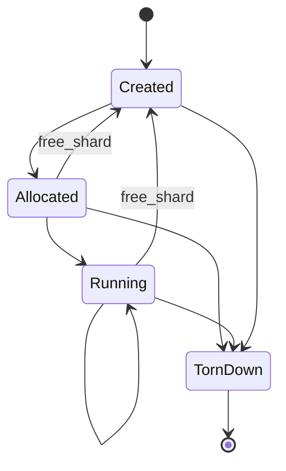

# spec_compute

> Версия спеки: v2.2
> Дата: 2026-06-30  
> Статус: Approved v2.2 / Ready for Implementation (Architecture Pass 2.2)

---

## §1. Идентификация

| Поле | Значение |
|---|---|
| **Имя крейта** | `compute` |
| **Слой** | Слой 3 — Фасад Вычислений (Compute Execution Facade) |
| **Тип** | Library (`lib`) |
| **no_std** | Нет (`false`) — требуется динамический выбор бэкендов в рантайме, использование `Box<dyn ComputeBackend>` и управление коллекциями |
| **Описание** | Главный фасадный крейт Слоя 3, инкапсулирующий выбор аппаратного бэкенда (CPU, CUDA, HIP, Mock), связывающий непрозрачные дескрипторы VRAM с вызовом вычислителя и оркеструющий жизненный цикл шарда через структуру `ShardEngine`. Крейт предоставляет высокоуровневый безопасный API для модулей `boot` и `runtime`, изолируя их от FFI-указателей и библиотек вендоров. |

---

## §2. Стек и Окружение

### §2.1. Внутренние зависимости (inbound)

| Крейт | Что используется | Зачем |
|---|---|---|
| `compute-api` (Слой 3) | `ComputeBackend`, `BackendKind`, `BackendCapabilities`, `VramHandle`, `ShardAllocSpec`, `ShardUpload`, `DayBatchCmd`, `BatchResult`, `ShardSnapshotMut`, `ComputeApiError` | Аппаратно-независимый HAL контракт бэкендов вычислений, дескрипторы ресурсов и DTO вызовов. |
| `compute-cpu` (Слой 3, optional) | `CpuBackend` | Резервный или базовый многопоточный CPU-вычислитель. |
| `compute-cuda` (Слой 3, optional) | `CudaBackend` | Высокопроизводительный вычислитель для видеокарт NVIDIA CUDA (в Stage 1 зарезервирован под фиче-флагом). |
| `compute-hip` (Слой 3, optional) | `HipBackend` | Вычислитель для видеокарт AMD ROCm/HIP (в Stage 1 зарезервирован под фиче-флагом). |

### §2.2. Зависимые компоненты (outbound consumers)

| Крейт / Компонент | Роль в системе и взаимодействие |
|---|---|
| `boot` (Слой 6) | Передает подготовленные байтовые блобы в `compute` для аллокации и первоначальной загрузки VRAM через поэтапный API без вызова сырого FFI. |
| `runtime` (Слой 6) | Управляет выполнением горячего цикла (hot path), вызывая метод `run_day_batch` структуры `ShardEngine` на каждый батч тиков. |

### §2.3. Внешние зависимости

Секция не применима к данному крейту: крейт использует исключительно внутренние зависимости Слоя 3 и стандартную библиотеку Rust. Сторонние SDK изолированы внутри бэкендов.

### §2.4. Feature Flags и Подключение Бэкендов

| Feature Flag | Default | Подключаемый Крейт | Описание |
|---|---|---|---|
| `cpu` | Да | `compute-cpu` | Включает поддержку многопоточного CPU бэкенда. |
| `cuda` | Нет | `compute-cuda` | Включает поддержку бэкенда NVIDIA CUDA (зарезервирован). |
| `hip` | Нет | `compute-hip` | Включает поддержку бэкенда AMD ROCm/HIP (зарезервирован). |
| `mock` | Нет | Внутренний Mock | Включает тестовый Mock-бэкенд. |

*Примечание*: Временное сохранение legacy-псевдонимов (aliases) фичей вроде `amd` или `mock-gpu` в `Cargo.toml` не поддерживается для исключения технического долга миграции.

---

## §3. Ownership Boundaries (Границы Владения)

| Модуль / Крейт | Монопольная Зона Владения (Single Source of Truth) | Строгие Запреты (Что категорически запрещено в крейте) |
|---|---|---|
| **`compute`** (Слой 3) | **Фасад Вычислений и Реестр Бэкендов**: Публичный фасад `ShardEngine`, автоматический выбор бэкенда (`BackendPreference`), feature-gated подключение бэкендов, связка `VramHandle` с выбранным `ComputeBackend` (в `Box<dyn ComputeBackend>`), управление автоматом состояний жизненного цикла (`Created`/`Allocated`/`Running`/`TornDown`), делегирование задач и предоставление безопасного высокоуровневого API для `boot` и `runtime`. | Запрещено объявление базовых DTO и трейтов (владелец `compute-api`), реализация CUDA/HIP/CPU ядер и FFI-символов (владельцы конкретные бэкенды), утечка сырых указателей (`*mut u8`), парсинг файлов архивов и конфигов (`vfs`/`config`), планирование потоков рантайма и IPC (`runtime`/`ipc`), а также расчёт физических формул (`physics`). |
| **`compute-api`** (Слой 3) | **HAL Контракт**: Публичный трейт `ComputeBackend`, `VramHandle`, DTO вызовов и базовые ошибки `ComputeApiError`. | Запрещена логика автовыбора бэкендов и хранение ресурсов шарда. |
| **Бэкенды** (`compute-cuda`/`hip`/`cpu`) | **Физическая Аллокация и Ядра**: Код ядер, вендорские FFI вызовы, управление асинхронными стримами. | Запрещена прямая публикация бэкендов в `runtime` в обход фасада `compute`. |

---

## §4. Выбор Бэкенда и Управление Контекстом (Backend Selection Policy)

Управление выбором вычислителя осуществляется через структуру предпочтений `BackendPreference`.

### §4.1. Конфигурация Предпочтения Бэкенда
```rust
#[derive(Debug, Clone, PartialEq, Eq)]
pub enum BackendPreference {
    Auto,
    Cpu,
    Cuda { device_id: u32 },
    Hip { device_id: u32 },
    Mock,
}
```

### §4.2. Правила Выбора и Политика Ошибок (Error & Fallback Policy)
1. **Разграничение Ошибок Сборки и Доступности Устройств**:
   - Если запрошенный бэкенд не был включен на этапе компиляции Cargo (отсутствует соответствующий feature flag), вызов прерывается с ошибкой `ComputeError::FeatureNotCompiled { feature: &'static str }`.
   - Если feature flag включен, но физическое устройство, драйвер или контекст бэкенда недоступен в ОС (например, отсутствуют драйверы CUDA или сам провайдер бэкенда в Stage 1), вызов возвращает ошибку `ComputeError::BackendUnavailable { backend: BackendKind, reason: String }`.
2. **Явный Запрос (Explicit Preference)**: При явном указании бэкенда (например, `BackendPreference::Cuda { device_id: 0 }`), фасад пытается инициализировать только его. При недоступности или отсутствии фичи возвращается соответствующая ошибка (`FeatureNotCompiled` или `BackendUnavailable`). Тихое переключение (silent fallback) на CPU при явном запросе **запрещено**.
3. **Автоматический Режим (`BackendPreference::Auto`)**: Запускает детерминированный алгоритм автодетекции, опрашивая **только собранные** бэкенды в детерминированном порядке приоритета: CUDA -> HIP -> CPU. Если один из бэкендов в цепочке возвращает `BackendUnavailable`, автовыбор может продолжить поиск далее по списку приоритетов (например, пропустить CUDA и перейти к HIP/CPU).

---

## §5. Архитектура и Автомат Состояний `ShardEngine`

Фасад `ShardEngine` хранит жизненный цикл конкретного вычислительного шарда и опциональный дескриптор `Option<VramHandle>`, состояние жизненного цикла, выбранную реализацию бэкенда `Box<dyn ComputeBackend>` и характеристики оборудования `BackendCapabilities`.

### §5.1. Потокобезопасность и Invariance
Структура `ShardEngine` не реализует маркеры `Send` и `Sync`. Она создаётся и эксплуатируется строго внутри выделенного OS-потока конкретного шарда. Модули `boot` и `runtime` могут передавать параметры инициализации или конфигурацию (которые являются `Send`), но сам инстанс `ShardEngine` остается привязанным к вызывающему потоку (Thread-Affine) для предотвращения неопределенного поведения контекстов видеокарт.

### §5.2. Автомат Состояний Жизненного Цикла (Lifecycle States)



- **`Created`**: Экземпляр инициализирован (`new`), бэкенд выбран, VRAM не выделена (`handle == None`).
- **`Allocated`**: Буферы VRAM успешно аллоцированы через `alloc_shard`, получен `Some(VramHandle)`.
- **`Running`**: Состояние инициализировано данными (`upload_shard`), шард готов к автономному выполнению горячего цикла.
- **`TornDown`**: Память VRAM явно освобождена, дескриптор сброшен в `None`, контекст бэкенда деинициализирован.

Любая попытка вызова метода вне допустимого состояния мгновенно отклоняется с ошибкой `ComputeError::InvalidLifecycleState { current, expected }`:
- Вызов `run_day_batch` или `debug_snapshot` разрешен **строго в состоянии `Running`** (до вызова `upload_shard` или после перехода в `TornDown`/`Created` они возвращают `InvalidLifecycleState`).
- Вызов `free_shard` разрешен в состояниях `Allocated` или `Running` (переводит `handle` в `None` и переводит `ShardEngine` в `Created`). Вызов в состояниях `Created` или `TornDown` возвращает `InvalidLifecycleState`.

### §5.3. Поэтапный API `ShardEngine` (Staged API)
Для точного соответствия фазам загрузочного пайплайна модуля `boot` и вызовам рантайма, `ShardEngine` предоставляет стандартизированный API без использования сырых указателей (`*mut u8`):

```rust
pub struct ShardEngine {
    backend: Box<dyn ComputeBackend>,
    handle: Option<VramHandle>,
    state: LifecycleState,
    capabilities: BackendCapabilities,
}

impl ShardEngine {
    /// Инициализация контекста и выбор бэкенда (Состояние Created)
    pub fn new(pref: BackendPreference) -> Result<Self, ComputeError>;
    
    /// Поэтапная аллокация VRAM памяти (Переход Created -> Allocated)
    pub fn alloc_shard(&mut self, spec: ShardAllocSpec) -> Result<(), ComputeError>;
    
    /// Поэтапная загрузка байтовых блобов в VRAM (Переход Allocated -> Running)
    pub fn upload_shard(&mut self, upload: ShardUpload<'_>) -> Result<(), ComputeError>;
    
    /// Запуск автономного горячего цикла вычислений на батч тиков (блокирующий синхронный вызов, состояние Running)
    pub fn run_day_batch(&mut self, cmd: DayBatchCmd<'_>) -> Result<BatchResult, ComputeError>;

    /// Делегирование отладочной выгрузки полного состояния (state_blob/axons_blob) на сторону хоста (состояние Running)
    pub fn debug_snapshot(&mut self, snapshot: ShardSnapshotMut<'_>) -> Result<(), ComputeError>;
    
    /// Освобождение ресурсов VRAM конкретного шарда (Переход Allocated/Running -> Created)
    pub fn free_shard(&mut self) -> Result<(), ComputeError>;

    /// Деинициализация бэкенда и очистка ресурсов (Переход в TornDown). Метод является идемпотентным.
    pub fn teardown(&mut self) -> Result<(), ComputeError>;

    /// Вспомогательный конструктор для единовременной загрузки в одну операцию
    pub fn bootstrap(pref: BackendPreference, spec: ShardAllocSpec, upload: ShardUpload<'_>) -> Result<Self, ComputeError>;

    // Аксессоры доступа к метаданным
    pub fn backend_kind(&self) -> BackendKind;
    pub fn capabilities(&self) -> BackendCapabilities;
    pub fn handle(&self) -> Option<VramHandle>;
}
```

---

## §6. Иерархия Ошибок (`ComputeError`)

Все ошибки фасада вычислений оборачиваются в типизированный enum `ComputeError`:

```rust
#[derive(Debug)]
pub enum ComputeError {
    BackendUnavailable { backend: BackendKind, reason: String },
    FeatureNotCompiled { feature: &'static str },
    NoBackendAvailable,
    InvalidLifecycleState { current: LifecycleState, expected: &'static str },
    ApiError(ComputeApiError),
}
```

---

## §7. Требуемые Инварианты

- **INV-COMPUTE-001**: `ShardEngine` инкапсулирует вычислительный бэкенд строго через динамический трейт `Box<dyn ComputeBackend>`.
- **INV-COMPUTE-002**: Выбор бэкенда при `BackendPreference::Auto` является строго детерминированным (CUDA -> HIP -> CPU).
- **INV-COMPUTE-003**: При попытке вызова нескомпилированного бэкенда возвращается `ComputeError::FeatureNotCompiled`, а при отсутствии устройства — `ComputeError::BackendUnavailable` (без тихого фолбэка на CPU).
- **INV-COMPUTE-004**: Публичный API `ShardEngine` запрещает утечку сырых указателей (`*mut u8`) и C-ABI структур указателей в `boot` или `runtime`.
- **INV-COMPUTE-005**: Виртуальные вызовы вычислений через vtable происходят строго один раз за батч (`run_day_batch`), а не на каждый отдельный тик внутри горячего цикла.
- **INV-COMPUTE-006**: Метод `teardown()` является идемпотентным и гарантирует безопасное освобождение ресурсов с переводом `handle` в `None`.
- **INV-COMPUTE-007**: `ShardEngine` не реализует авто-типизацию `Send` и `Sync`. Публичный API гарантирует отсутствие данных маркеров на структуре.

---

## §8. Golden Tests / Обязательная Матрица Тестирования

1. **Детерминизм Автовыбора Бэкенда (`test_auto_backend_selection_priority`)**: Проверка порядка приоритетов CUDA -> HIP -> CPU.
2. **Разграничение Ошибок Недоступности и Сборки (`test_explicit_backend_error_policy`)**: Проверка возврата `FeatureNotCompiled` и `BackendUnavailable` без тихого переключения на CPU.
3. **Работа CPU по умолчанию (`test_cpu_fallback_when_gpu_disabled`)**: Проверка успешной работы CPU-пути при отсутствии GPU.
4. **Абстракция Рантайма от Типа Бэкенда (`test_runtime_batch_execution_transparency`)**: Выполнение батча тиков через `run_day_batch` без знания рантайма о конкретном железе.
5. **Поэтапная Загрузка через Фасад без FFI (`test_boot_staged_allocation_without_raw_ffi`)**: Проверка последовательного вызова `alloc_shard` и `upload_shard` модулем `boot` без сырого FFI.
6. **Отсутствие Сырых Указателей в API (`test_no_raw_pointers_in_public_api`)**: Компиляционная проверка отсутствия `*mut u8` в публичных сигнатурах `ShardEngine`.
7. **Батчевая Диспетчеризация (`test_single_dispatch_per_batch`)**: Проверка вызова бэкенда строго один раз на батч тиков.
8. **Идемпотентность Teardown (`test_idempotent_teardown`)**: Повторный вызов `teardown()` не приводит к ошибкам или двойному освобождению памяти.
9. **Контроль Переходов Поэтапного Автомата (`test_invalid_lifecycle_transition_rejected`)**: Вызовы `run_day_batch` и `debug_snapshot` до `upload_shard` или после `teardown`, а также вызов `free_shard` в состояниях `Created` или `TornDown` возвращают `InvalidLifecycleState`.
10. **Проверка Имен Фичей (`test_feature_names_compatibility`)**: Проверка работоспособности фичей `hip` и `mock` без поддержки устаревших псевдонимов.
11. **Проверка Вызовов на Mock-Бэкенде (`test_mock_backend_verification`)**: Проверка последовательности вызовов и геометрии загружаемых данных через Mock-бэкенд.
12. **Инвариант отсутствия Send/Sync (`test_shard_engine_not_send_sync`)**: Проверка компиляции, исключающая возможность передачи `ShardEngine` между потоками.
13. **Делегирование Snapshot API (`test_debug_snapshot_delegation`)**: Проверка успешного снятия полного снэпшота памяти через вызов `debug_snapshot` на фасаде в состоянии `Running`.

---

## §9. Open Questions / Review Debt (Открытые Вопросы и Противоречия)

Все архитектурные вопросы по фасаду вычислений L3 были разрешены в рамках прохода ревью Pass 2.2:
- Названия фичей приведены к стандарту `cpu`, `cuda`, `hip`, `mock` (REV-COMPUTE-001).
- Модель `ShardEngine` спроектирована как привязанная к потоку (Thread-Affine) без реализации `Send`/`Sync` (REV-COMPUTE-002).
- Приоритет автоматического выбора зафиксирован как CUDA -> HIP -> CPU (REV-COMPUTE-003).
- Модель выполнения пакетного режима определена как строго синхронная (REV-COMPUTE-004).
- Фасад не имеет дела с pinned-буферами, они принадлежат бэкендам (REV-COMPUTE-005).
- Межшардовая синхронизация, уплотнение синапсов и сортировки вынесены за пределы фасада (REV-COMPUTE-006).
- Регистрация и съем осциллограмм Ephys исключены из фасада (REV-COMPUTE-007).
